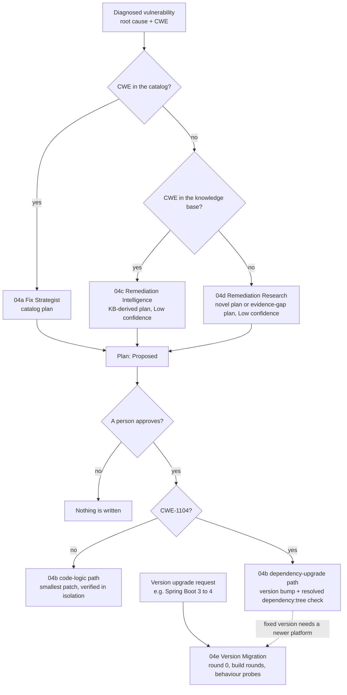

# Agent 04: the Fix Generator

**One agent that plans vulnerability fixes, writes patches only for approved decisions, and
migrates framework and Java versions, with five skills: 04a, 04b, 04c, 04d and 04e.**

Agent 04 merges the Fix Generator agents of two source systems into MARS: the Vulnerability
Remediation Harness (VRH) and the Spring migration reference. It works on its own as a file-driven
pipeline, and alongside the MARS `harness` CLI, which it feeds with patches and research for a
person to approve.

> **The one rule:** Agent 04 never approves its own work and never writes to the real project. In a
> MARS run, a person approves every change with `harness approve`. In the file workflow, a person
> edits a plan's Status cell to `Approved`.

---

## Contents

1. [The five skills](#1-the-five-skills)
2. [Where it came from](#2-where-it-came-from)
3. [How the skills fit together](#3-how-the-skills-fit-together)
4. [Two modes](#4-two-modes)
5. [Harness mode: working with a MARS run](#5-harness-mode-working-with-a-mars-run)
6. [Pipeline mode: the file workflow](#6-pipeline-mode-the-file-workflow)
7. [Running the agent](#7-running-the-agent)
8. [Folder layout](#8-folder-layout)
9. [Keeping the copies in sync](#9-keeping-the-copies-in-sync)
10. [What was verified](#10-what-was-verified)
11. [Limitations](#11-limitations)

---

## 1. The five skills

| # | Skill | What it does | Writes code? |
|---|---|---|---|
| **04a** | [Fix Strategist](skills/04a-fix-strategist/SKILL.md) | Decides *how* to fix a diagnosed vulnerability, citing a CWE-aligned pattern from the catalog. One plan per diagnosis, always `Proposed`. | No |
| **04b** | [Fixer](skills/04b-fixer/SKILL.md) | Turns an **approved** plan into the smallest patch and verifies it in isolation. Has a **code-logic path** for every CWE and a **dependency-upgrade path** for CWE-1104. | Yes, only after approval |
| **04c** | [Remediation Intelligence](skills/04c-remediation-intelligence/SKILL.md) | Fallback when every detected CWE is missing from the catalog. Ranks historical fixes in a local knowledge base (KB) and derives a cited, Low-confidence strategy. | No |
| **04d** | [Remediation Research](skills/04d-remediation-research/SKILL.md) | Fallback when a CWE is in neither the catalog nor the KB. A structured investigation with at least two candidates. It gives a Low-confidence novel strategy, or an evidence-gap plan when evidence is thin. | No |
| **04e** | [Version Migration](skills/04e-version-migration/SKILL.md) | Moves a whole project to a new framework generation or Java level, such as Spring Boot 3 to 4 or Java 17 to 21. It works round by round from a reference pack and compares behaviour before and after. | Yes, in a sandbox |

A support library, [`00-issue-register`](skills/00-issue-register/SKILL.md), reads the Excel issue
register for 04a in the file workflow. It is not one of the five skills.

**What the catalog covers.** The 04a catalog has 11 CWE entries: VRH's ten (CWE-943, 89, 306, 284,
532, 200, 770, 400, 798, 79) plus CWE-1104. The 04c knowledge base covers CWE-22, 918, 359 and 862.
The 04e reference pack covers Spring Boot 3.x to 4.x with Java 17 to 21.

---

## 2. Where it came from

Both source systems had an "Agent 04" with four skills, and two of those skills shared a name. The
merge keeps every capability and gives each one a unique letter.

| Source system | Its skill | In the merged Agent 04 |
|---|---|---|
| VRH | `04a-fix-strategist` | **04a**, merged with the Spring reference's copy: gains the CWE-1104 catalog entry and the `dependency_upgrade` strategy block |
| VRH | `04b-fixer` | **04b**, code-logic path, unchanged in behaviour |
| VRH | `04c-remediation-intelligence` | **04c**, unchanged |
| VRH | `04d-remediation-research` | **04d**, unchanged |
| Spring reference | `04a-fix-strategist` | merged into **04a** (see above) |
| Spring reference | `04b-fixer` | same as VRH's; merged into **04b** |
| Spring reference | `04c-dependency-upgrader` | **04b**'s dependency-upgrade path, with its scripts renamed to avoid clashes |
| Spring reference | `04d-version-migration` | **04e** (renamed, because `04d` is Remediation Research) |

The original skills are kept byte-for-byte under
[`legacy-sources/`](../legacy-sources/SOURCES.json), and a MARS test checks that they never change.
The working copies live here in `.github/skills/`.

**What changed in the merge, beyond copying:**

- The 04a renderer shows a **Dependency** row for CWE-1104 plans and **refuses** a CWE-1104 strategy
  without one. The Spring reference's schema required that block but its renderer never enforced it.
- 04b's code-logic verifier (`verify-patch.js`) now refuses a CWE-1104 plan and points to the
  dependency-upgrade path. Its dependency verifier already refused every other CWE, so each path now
  refuses the other's plans.
- The three renderers that write `docs/agent_output/04-remediation/README.md` now write identical
  index text, as VRH's design requires.
- Every `SKILL.md` gained an **Inside MARS** section explaining how the skill works with the
  harness.

---

## 3. How the skills fit together



- **The knowledge hierarchy is fixed.** A catalogued CWE always wins. 04c runs only when *every*
  detected CWE is a catalog gap, and 04d only when the gap is also missing from the KB. Nothing is
  ever invented to fill a gap.
- **A migration is not a fix.** It has no root cause, no CWE and no plan to approve. It goes straight
  to 04e, whose evidence is a recorded baseline, every build round, and a behaviour comparison.
- **Migration and dependency fixes meet.** When a vulnerable library's fixed version needs a newer
  platform, the harness marks the fix `BLOCKED_BY_PLATFORM` until the migration runs, then re-plans
  it once.

---

## 4. Two modes

| | Harness mode | Pipeline mode |
|---|---|---|
| **Use it when** | You work on a service through MARS (`harness analyze …`). This is the default. | You have VRH-format root cause reports in `docs/agent_output/`, or want a standalone migration report |
| **System of record** | The run under `runs/RUN-…/` | Files under `docs/agent_output/` |
| **Who does the deterministic work** | The harness, in Java: routing, KB ranking, research validation, three fixers, the migration engine, verification and the verdict | The skills' own Node.js scripts |
| **What Agent 04 adds** | Judgement: research analyses, patches for approved strategies, fixes for migration errors no rule covers | The whole pipeline: plans, patches and migrations |
| **The approval gate** | A recorded human decision: `harness approve remediation` | A person edits the plan's Status cell to `Approved` |
| **How code gets in** | `harness submit-patch` creates a proposal a person approves | A patch file verified in a throwaway git worktree |

The agent states which mode it chose before it starts.

---

## 5. Harness mode: working with a MARS run

The harness already performs the parts of 04a to 04e that need no judgement. It reads the same
catalog, KB, ranking weights and reference pack; section 9 explains how that is kept true. Agent 04
fills the gaps that need judgement, and a person makes every decision.

### Who runs what

| Command | Agent 04 | A person |
|---|---|---|
| `harness analyze`, `status`, `findings`, `finding`, `migration-assessment`, `proposals`, `report`, `lineage`, `change`, `verify` | Yes (read-only) | Yes |
| `harness submit-research`, `harness submit-patch` | Yes (they only register inputs and proposals) | Yes |
| `harness resume` | Only when the user asks it to continue | Yes |
| `harness decide …`, `harness approve …`, `harness apply` | **Never** | **Yes, only a person** |

### A run, step by step

```bash
# 1. Analyze (read-only). Stops at Gate A.
harness analyze ./my-service --findings issues.xlsx --probes probes.json
harness findings --run $RUN

# 2. Before Gate A, for each finding whose CWE is in neither catalog nor KB (04d):
node .github/skills/04d-remediation-research/scripts/research-context.js --gap-check CWE-502
#    ...the agent writes analysis.json by the 04d method, then:
harness submit-research --run $RUN --finding FINDING-… --analysis analysis.json

# 3. Gate A: a person chooses the strategy.
harness decide execution --run $RUN --strategy SECURITY_FIRST --actor <person> --role owner --rationale "…"
harness resume --run $RUN

# 4. The agent reviews each plan (04a, 04c) against its catalog entry or KB ranking:
harness proposals --run $RUN
#    runs/$RUN/reports/legacy/04-remediation/fix_plan_<ISSUE>.md

# 5. Gate B: a person decides each proposal.
harness approve remediation --run $RUN --proposal PROP-… --verdict APPROVED --actor <person> --role owner --rationale "…"

# 6. For an approved *strategy-only* proposal, the agent writes the patch (04b) and submits it:
harness submit-patch --run $RUN --finding FINDING-… --file src/main/java/…/Foo.java=./Foo.fixed.java \
  --reason "Implements the approved CWE-943 strategy" \
  --provider llm --model <model id> --prompt-hash <sha256> --response-hash <sha256>
#    ...which a person approves like any other proposal, then: harness resume --run $RUN

# 7. If migration stops in NEEDS_HUMAN (a build error no rule matches), the agent resolves it (04e)
#    from the real dependency jar and submits it with submit-patch and no --finding.

# 8. Report. Applying to the project is a person's decision.
harness report --run $RUN
```

**Research has a deadline.** The harness plans each finding **once**, right after the Gate A
decision. Research submitted after that is stored but never used, and the finding keeps its
`EVIDENCE_GAP` plan. Submit it while the run waits at Gate A, or pass `--research ISSUE=file` to
`harness analyze`.

**LLM patches need provenance.** A patch submitted with `--provider llm` must carry `--model`,
`--prompt-hash` and `--response-hash`, or the harness refuses it at apply time, even after approval.

---

## 6. Pipeline mode: the file workflow

This is VRH's workflow, unchanged, run by the skills' scripts against `docs/agent_output/` in the
repository the skills sit in. To use it on another service, copy `.github/skills/` and the agent
definition into that repository. Each skill folder is self-contained, with zero npm dependencies.
Its input, the root cause reports, comes from VRH's agents 01 to 03, kept under
`legacy-sources/vulnerability-remediation-harness/.github/agents/`.

### Stage 1: plan (04a, with 04c or 04d on a gap)

```bash
cd .github/skills/04a-fix-strategist
node scripts/list-remediation-workload.js
node scripts/collect-remediation-context.js --all
#   the agent writes .github/.pipeline-context/fix-strategy/<id>.strategy.json
#   (on a catalog gap: 04c run-fallback.js; on a KB gap: 04d research-context.js + generate-strategy.js)
node scripts/render-fix-plan.js --all
```

Output: `docs/agent_output/04-remediation/fix_plan_<id>.md`, at `Status: Proposed`. A person
approves a plan by editing its Status cell to `Approved`.

### Stage 2: implement (04b, approved plans only)

| Plan CWE | List | Verify | Render |
|---|---|---|---|
| Any except CWE-1104 | `list-fix-workload.js` | `verify-patch.js --issue <ID>` | `render-fix-report.js --all` |
| CWE-1104 | `list-dependency-workload.js` | `apply-version-bump.js --issue <ID>` | `render-dependency-report.js --all` |

The agent drafts the patch with `git diff` against a disposable copy and checks it with
`git apply --check`. The verifier applies it only inside a throwaway `git worktree` from `HEAD` and
compiles it. The dependency path also runs `mvn dependency:tree` and confirms the *resolved* version
meets the plan's minimum fixed version. Output: `docs/agent_output/04-remediation/fix_<id>.md` and
`fix_<id>.diff`, with Status `Compiled`, `Compile Failed` or `Refused`.

### Migration (04e)

```bash
cd .github/skills/04e-version-migration
node scripts/detect-baseline.js --project <path> --to-java 21   # names the reference pack; none = stop
node scripts/prepare-workspace.js --slug <slug>                  # sandbox copy of the project
node scripts/run-migration-build.js --slug <slug> --baseline --jdk 17
node scripts/probe-runtime.js --slug <slug> --phase baseline --jdk 17 --probes <probes.json>
#   ...build-file changes from the pack, then build rounds on JDK 21 until green...
node scripts/probe-runtime.js --slug <slug> --phase final --jdk 21 --probes <probes.json>
node scripts/render-migration-report.js --slug <slug>
```

Output: `docs/agent_output/04-remediation/migration_<slug>.md` and a cumulative `.diff`. The
project is written only by `apply-migration.js --to-project`, and only when someone asked for it.

---

## 7. Running the agent

| Tool | Definition | How to start it |
|---|---|---|
| Claude Code | [`.claude/agents/04-fix-generator.md`](../.claude/agents/04-fix-generator.md), which preloads the six skill wrappers in `.claude/skills/` | Ask for the `04-fix-generator` agent by name, or use `/agents` |
| Tools that read `.github/agents/` (the `.agent.md` format VRH used) | [`.github/agents/04_fix-generator.agent.md`](agents/04_fix-generator.agent.md) | Select the `04_fix-generator` agent |

The `.github/agents/…agent.md` file is the **canonical** specification. The Claude Code definition
points to it.

Example requests:

- "Analyze `fixtures/composite/inventory-service` with MARS and tell me which findings need research."
- "Run `RUN-…` is waiting at Gate A. Write the research for the CWE-502 finding."
- "PROP-… was approved as a strategy. Write and submit the patch."
- "The migration in `RUN-…` stopped with NEEDS_HUMAN. Resolve the build error."
- "Migrate `fixtures/migration/employee-demo-sb3` from Spring Boot 3 to 4 and give me the report."

---

## 8. Folder layout

```text
.github/
├── README.md                          # this file
├── agents/04_fix-generator.agent.md   # canonical Agent 04 specification
├── scripts/agent04-check.js           # consistency check (section 9)
└── skills/
    ├── 00-issue-register/             # support library: reads the Excel issue register
    ├── 04a-fix-strategist/            # catalog/cwe-patterns.json, strategy schema, plan renderer
    ├── 04b-fixer/                     # code-logic + dependency-upgrade paths, rationale schemas
    ├── 04c-remediation-intelligence/  # knowledge/remediation-kb.json, ranking-weights.json
    ├── 04d-remediation-research/      # research method, schemas, fixtures
    └── 04e-version-migration/         # references/spring-boot-3-to-4.md, migration scripts
.claude/
├── agents/04-fix-generator.md         # Claude Code entry point
└── skills/<skill>/SKILL.md            # thin wrappers pointing to .github/skills/
```

Generated files go to `.github/.pipeline-context/` (git-ignored): context bundles, drafted patches,
throwaway worktrees and migration sandboxes. Pipeline mode's deliverables go to
`docs/agent_output/`, which is meant to be committed.

---

## 9. Keeping the copies in sync

The harness reads its knowledge from `legacy-sources/` in place, as configured in
`policies/default/unified-policy.json`. The skills here use their own copies. If the two drifted,
the same finding could be routed one way by the harness and another way by the skill. Run:

```bash
node .github/scripts/agent04-check.js
```

It is read-only and fails if any of these is true:

- A skill, wrapper or agent definition is missing, misnamed or does not list all five skills.
- The merged catalog differs from what the harness loads, which is VRH's catalog plus the Spring
  reference's extra entries.
- The KB or ranking weights differ from the harness's copies.
- The 04e reference pack differs from the pack the harness's migration rules are pinned to, ignoring
  line endings.
- A script still points to a pre-merge skill path.
- The three renderers of the shared remediation index write different text.
- Any skill script fails `node --check`.

To change the catalog, KB or reference pack, change it in both places, or point the policy at the
new file. Then re-run the check and MARS's parity tests.

---

## 10. What was verified

| Check | Result |
|---|---|
| `agent04-check.js` | 52 checks pass. A deliberately changed ranking weight made it fail as expected. |
| 04c self-test (`test-sample.js`) | PASS, through the merged 04a renderer |
| 04d self-test (`test-sample.js`) | PASS: novel-research plan and evidence-gap safe stop |
| CWE-1104 path, in a scratch git repository | The renderer refuses a strategy with no Dependency row and renders one that has it. The dependency path parses the row and refuses while the plan is `Proposed`. After approval, `verify-patch.js` refuses the plan and points to `apply-version-bump.js`. The bump patch passes `git apply --check`, and the working tree stays untouched. |
| 04e `detect-baseline.js` on `fixtures/migration/employee-demo-sb3` | Matches the `spring-boot-3-to-4` pack |
| 04c and 04d gap checks (`detect-gap.js --cwe`, `research-context.js --gap-check`) | Correct routing for CWE-22 (KB) and CWE-502 (double gap). They write nothing. |

**Not run:** the Maven compile and `dependency:tree` stages of 04b, and 04e's build rounds. They need
Maven and JDKs 17 and 21, which were not available when this was written. No Java code changed, so
MARS's own test suites were not re-run.

---

## 11. Limitations

- **Harness mode relies on the person.** Agent 04 cannot approve anything, so every run needs a
  person at Gates A, B and A2, and for `apply`.
- **Research must arrive before planning.** In a harness run it must be submitted while the run
  waits at Gate A (see section 5).
- **The ranking can differ when embeddings are on.** The harness always ranks the KB without the
  embedding signal. With 04c's optional `.venv/` set up, the scripts here add it and may rank
  differently.
- **Pipeline mode needs Phase A reports.** It expects VRH-format root cause reports in
  `docs/agent_output/02-root-cause/`. MARS's harness writes its own root cause analysis into the run,
  not in that format.
- **Names differ in older places.** MARS's Java code, `docs/` and the pinned rules file still call
  the migration skill `04d-version-migration`, its name in the Spring reference.
- **One migration pack.** Only Spring Boot 3 to 4 is covered. A new jump needs a pack in
  `04e-version-migration/references/`, and for the harness also derived rules; see
  [`docs/writing-a-reference-pack.md`](../docs/writing-a-reference-pack.md).
