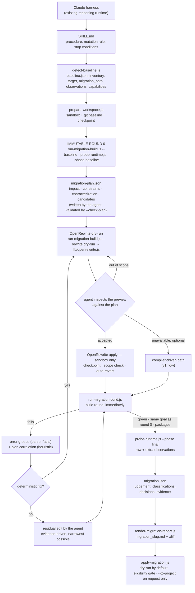

# 04D Version Migration — Architecture

For an engineer who was not part of the design discussion. [`SKILL.md`](./SKILL.md) is the
procedure the agent follows; this document is how the skill is built, why, and what changed from
the first version.

## 1. Purpose and boundary

`04d-version-migration` moves a Java project to a new framework generation and/or language level —
Spring Boot 3 → 4 and Java 17 → 21 is the pack shipped today — and proves the application still
behaves the same.

Everything a migration needs lives inside this one skill directory:

- **"Bootshift"** is not a product, service or second skill in this repository. It is the name the
  design discussion gave to a set of capabilities — understand before mutating, plan the impact,
  characterise behaviour, transform deterministically, keep provenance — and those capabilities
  have been absorbed *into* 04D's existing scripts and procedure.
- **OpenRewrite** is an internal, deterministic transformation capability, implemented by
  `scripts/lib/openrewrite.js` and invoked through `run-migration-build.js`. It is not an agent, a
  service or the orchestrator.
- **The Claude harness** that already runs this repository's agents and skills is the reasoning
  runtime. It reads `SKILL.md` and does the judgement work. There is **no model client, LLM SDK or
  AI service** inside 04D.

There is no second migration skill, no new agent, and no change to 04A/04B/04C or to
`04_fix-generator.agent.md`. The six public scripts keep their names, the session directory keeps
its path, and the report keeps its file names.

```text
            existing Claude harness (reasoning)
                          │ follows SKILL.md
                          ▼
╔══════════════════════════════════════════════════════════════╗
║  04d-version-migration                                       ║
║  UNDERSTAND → BASELINE → PLAN → TRANSFORM → REPAIR → PROVE   ║
║                                   │                          ║
║                         lib/openrewrite.js                   ║
║                   (deterministic capability, sandbox only)   ║
╚══════════════════════════════════════════════════════════════╝
                          │
                          ▼
     migration_<slug>.md + migration_<slug>.diff + session evidence
```

## 2. The v1 architecture (Spring Boot 3 → 4, reactive)

v1 was already disciplined: a baseline, an isolated sandbox with its own git repository, a
recorded pre-migration build and runtime probe, every round kept, a before/after comparison, and an
explicit, green-only apply. Its planning mechanism was the compiler: change the versions, let the
build fail, look the failure up in the reference pack, repair, rebuild.

```text
reference pack
     │
detect-baseline.js ──► baseline.json
     │
prepare-workspace.js ──► sandbox + throwaway git baseline
     │
run-migration-build.js --baseline  +  probe-runtime.js --phase baseline      (round 0)
     │
version bump (by hand)
     │
run-migration-build.js ──► compile failures ──► reference rule ──► hand repair ─┐
     ▲                                                                           │
     └───────────────────────────────────────────────────────────────────────────┘
     │ green
probe-runtime.js --phase final
     │
migration.json (agent judgement) ──► render-migration-report.js ──► report + diff
     │
apply-migration.js (explicit, green-only)
```

The recorded v1 run of the shipped pack took **eight rounds**: four compile/test-compile rounds to
discover the Jackson, actuator and test-layer moves one failure at a time, a package round that
exposed a `@WithMockUser` regression no compiler could see, the fix, and a packaging gate.

## 3. Bootshift capabilities inherited into 04D

| Capability | What it means here | Where it lives |
|---|---|---|
| Understand before mutation | Read the application; record its surfaces; nothing changes before round 0 and the baseline probe | `SKILL.md` Steps 1–4; `detect-baseline.js` `observations`; round-0 guards in `run-migration-build.js` / `probe-runtime.js` |
| Target and path analysis | The exact requested target; whether the source is on the pack's preparation line; ecosystem BOMs that cannot be proven compatible | `detect-baseline.js` `target`, `migration_path`; pack `path`, `target_constraints`, `ecosystem_boms` |
| Richer migration model | A structured, schema-validated pre-mutation plan | `migration-plan.json`, `templates/migration-plan.schema.json` |
| Impact analysis | Predicted impact per file, compared afterwards with what actually failed and changed | plan `impact`; report §0.3 |
| Characterisation | Impact-driven probes with categories, including the security boundary | `probes.json`; plan `characterization`; `probe-runtime.js` |
| Deterministic transformation | OpenRewrite recipes from the pack, selected by the plan, previewed, inspected, applied | `lib/openrewrite.js` via `run-migration-build.js --rewrite` |
| Provenance | Recipe, artifact, pinned versions, licence, sanitised command, per-file recipe attribution, the patch, the log | `transformations/rewrite-NN.*`; report §2.4, §10 |
| Resumable evidence and state | State inferred from the evidence on disk; transition history; BLOCKED flag; sandbox checkpoints | `lib/migration.js` `inferState`/`recordState`; `refs/checkpoints/*` |
| Stronger differential validation | Raw comparison kept; extra observations and classifications beside it; security-boundary summary | `probe-runtime.js`; `compareProbeRecords`; report §6 |

## 4. Final architecture



## 5. Component inheritance

| Existing component | Status | Final responsibility | Bootshift capability absorbed |
|---|---|---|---|
| `SKILL.md` | ENHANCE | The reasoning contract: procedure, who-does-what, mutation rule, stop conditions | Understand before mutation; deterministic first; evidence rules |
| `package.json` | ENHANCE | Same six scripts; adds `test`; still zero npm dependencies | — |
| `scripts/detect-baseline.js` | ENHANCE | v1 inventory unchanged; adds `target`, `migration_path`, `observations`, `capabilities` | Target/path analysis; application understanding |
| `scripts/prepare-workspace.js` | ENHANCE | Same copy + throwaway git baseline; baseline checkpoint ref; resume summary; refuses to copy the session into itself | Resumable state; checkpoints |
| `scripts/run-migration-build.js` | ENHANCE | Same build round; immutable round 0; optional `--rewrite dry-run|apply`; error groups; `--check-plan` | Deterministic transformation; root-cause grouping; plan enforcement |
| `scripts/probe-runtime.js` | ENHANCE | Same request replay and raw fields; optional categories, expected status, semantic hashes; probe-set hash; sandbox side effects | Impact-driven characterisation; differential validation |
| `scripts/render-migration-report.js` | ENHANCE | Same sections 1–9; adds §0 understanding, §2.4 transformations, §2.5 how changes were made, grouped errors, classified behaviour, §10 provenance | Provenance; predicted vs actual |
| `scripts/apply-migration.js` | ENHANCE | Same dry-run default and explicit `--to-project`; compatibility-aware eligibility gate | Controlled promotion |
| `scripts/lib/migration.js` | ENHANCE | v1 helpers unchanged; adds grouping, redaction, checkpoints, schema validation, state, probe comparison | Evidence and state model |
| `scripts/lib/references.js` | ENHANCE | Same discovery and matching; YAML-subset front matter; optional v2 metadata | Provenance-aware knowledge |
| `scripts/lib/openrewrite.js` | NEW INTERNAL | Select, build, sandbox-check, run, classify, record, scope-check, revert | Deterministic transformation |
| `references/README.md` | ENHANCE | Documents the optional metadata and fallback | Provenance-aware knowledge |
| `references/spring-boot-3-to-4.md` | ENHANCE | All v1 rules kept; adds front-matter metadata, §14 target/path checks, §15 deterministic vs residual | Migration knowledge |
| `references/openrewrite/spring-boot-3-to-4.curated.yml` | NEW INTERNAL | Declarative curated recipe pinned to the requested target | Deterministic transformation |
| `templates/migration.schema.json` | ENHANCE | Every v1 field kept; optional v2 fields | Richer migration model |
| `templates/migration.example.json` | ENHANCE | Shows v1 and v2 fields together | — |
| `templates/migration-plan.schema.json` | NEW INTERNAL | The pre-mutation plan contract | Richer model; impact analysis |
| `templates/migration-plan.example.json` | NEW INTERNAL | Worked plan example | — |
| `tests/` | NEW INTERNAL | `node:test` suites and fixtures | — |
| `ARCHITECTURE.md` | NEW INTERNAL | This document | — |

The public surface is unchanged: `detect-baseline.js`, `prepare-workspace.js`,
`run-migration-build.js`, `probe-runtime.js`, `render-migration-report.js`, `apply-migration.js`.
Every new capability is either an optional flag on one of them or an internal module.

## 6. OpenRewrite

- **Not the orchestrator.** 04D decides whether a recipe runs (the plan must name it), where (the
  sandbox), and what counts as its result (the git diff it leaves, checked against the inspected
  preview). The compiler, the tests and the probes stay the proof.
- **Data-driven.** Recipes, artifacts, pinned plugin versions, licence, policy and applicable build
  tools come from the reference pack's `transformations:`; the plan selects and may narrow them. A
  pack may ship a declarative recipe (`references/openrewrite/*.yml`) whose `{{target_platform_version}}`
  and `{{target_language}}` are filled with the *requested* versions, validated as plain version
  strings — so a curated recipe lands on the requested target rather than a recipe's own.
- **Dry-run before apply.** `--rewrite dry-run` runs `rewrite-maven-plugin:<pinned>:dryRunNoFork`,
  verifies the sandbox tree is unchanged, and records the proposed files, the patch, and the
  recipe attribution the tool itself prints. `--rewrite apply` requires `--rewrite-preview` naming a
  successful dry-run with the same recipes, artifacts and rendered config.
- **Sandbox only.** `assertSandbox` refuses any directory but the session's own `workspace/` with
  its own git repository. The application's build files are never edited to install the tool: Maven
  gets the plugin by coordinate on the command line; Gradle gets an init script in the session.
- **Scope enforcement.** Every apply is checkpointed (`refs/checkpoints/rewrite-NN-before`). It is
  reverted automatically if it changes a file the preview did not propose or leaves an OpenRewrite
  plugin declaration behind. Whole out-of-scope files can be excluded (`--rewrite-exclude`).
- **Target reconciliation.** After an apply, the declared platform version is compared with the
  request (`matches-request` / `reconcile-required`). The report and the apply gate check it again at
  the end.
- **Availability and licence.** A failure is classified as `unavailable` (network, credentials,
  licence, plugin or recipe resolution, unsupported build tool) or as a real tool failure. An
  unavailable `optional` transformation falls back to the v1 compiler-driven path; a `required` one
  sets the session BLOCKED. Nothing unavailable is ever reported as run. The licence is recorded,
  not judged — the shipped Spring recipes are under the Moderne Source Available License.
- **Supply chain.** Floating versions (`RELEASE`, `LATEST`, ranges, `SNAPSHOT`) are refused for
  execution. Recorded commands and logs are redacted (secret-named environment values, URL userinfo,
  `-D…password=…`, `Authorization` headers). Credentials are passed through the build tool's own
  configuration and never read by 04D.

## 7. The Claude harness contract

The agent, running in the existing harness, reads the application, interprets the pack, writes the
plan, selects among the pack's transformations, inspects every preview, diagnoses residual
failures, makes the narrowest residual edits in the sandbox, classifies behavioural differences,
and writes the judgement parts of `migration.json`. The scripts do everything deterministic:
discovery, isolation, toolchain selection, OpenRewrite execution, builds, error extraction and
grouping, probes, raw evidence, schema validation, diffs, the report, and the apply gate.

Build, test and runtime evidence outranks the agent's judgement. No code path in 04D calls a model.

## 8. Evidence and state

```text
.github/.pipeline-context/version-migration/<slug>/
  baseline.json              detect-baseline.js    facts + requested target + observations
  probes.json                agent                 requests replayed before/after
  workspace.json, workspace/ prepare-workspace.js  sandbox + own git repo + refs/checkpoints/*
  rounds/round-NN.{json,log} run-migration-build   one per build (errors, groups, correlation, transformation link)
  runtime/{baseline,final}   probe-runtime.js      raw responses + extra observations + side effects
  migration-plan.json        agent                 prediction, written before any change
  transformations/rewrite-NN.{json,patch,log,rewrite.yml}   one per OpenRewrite preview/apply
  migration.json             agent                 judgement
  state.json                 all scripts           transition history + BLOCKED/FAILED
```

State is **inferred from the evidence** (`inferState`): a round-0 record means `BASELINE_BUILT`, a
valid plan means `PLAN_READY`, an accepted apply means `TRANSFORMATION_APPLIED`, and so on through
`FINAL_PROBED`, `EVIDENCE_READY` and `RENDERED`. `state.json` adds what files cannot say: the
history of transitions and an explicit `BLOCKED`/`FAILED` with its reason. This is not a workflow
engine — it exists to enforce prerequisites and to make a session inspectable and resumable.

Every judgement record points at the facts it interprets: `round_notes[].root_causes` name the
parser's error groups, `transformations[].record` names a `rewrite-NN`, `behaviour.differences[].probe`
names a probe, `code_changes[].evidence` names the round, test or preview that required a change.

## 9. Backward compatibility

- The six public scripts, their names and every v1 argument behave as before, with three deliberate
  strengthenings of the rules v1 already stated in prose: a target round is refused until round 0
  exists; round 0 (and the baseline probe) are refused on a sandbox that already differs from the
  project; and `apply-migration.js --to-project` checks the eligibility conditions in §6 of
  `SKILL.md` rather than only the last round. The v1 sequence of invocations passes all three. New
  arguments are optional (`--to-version`, `--rewrite*`, `--check-plan`).
- `baseline.json`, round, runtime and `migration.json` records keep every v1 field; v2 fields are
  additive. `templates/migration.schema.json` still accepts the recorded v1 `migration.json`.
- A session with no plan and no `state.json` is a *legacy* session: its state is inferred from its
  files, it renders (the report says no plan was recorded rather than inventing one), and the apply
  gate holds it only to what its own evidence can answer. Rendering or inspecting it writes no
  state into it.
- A reference pack with only the v1 front matter parses to exactly the same fields as before; every
  optional field normalises to empty.
- The report keeps sections 1–9 with their v1 numbers; new sections are §0, §2.4, §2.5 and §10.
- Every git command runs only in a directory that is itself a sandbox repository, so an archived
  session with no `workspace/.git` can never make git fall through to the enclosing repository.

## 10. Why the final 04D is stronger than the v1 Spring Boot 3 → 4 run

| Concern | v1 | Final 04D |
|---|---|---|
| Migration discovery | Compiler failures, one round at a time | Pack-declared surfaces scanned up front; application read before any change |
| Target validation | Target written into the pom by hand | Exact requested target recorded; never inferred; checked against the final build and at apply |
| Migration planning | Implicit, in the agent's head | `migration-plan.json`, schema-validated, before any change |
| Impact prediction | None — impact was discovered | Per-file impact with risk and verification, reported against what happened |
| Reference knowledge | Pack rules and symptom table | Same rules, plus provenance, preparation line, ecosystem BOMs, recipe mappings |
| Deterministic source transformation | None — every change by hand | OpenRewrite recipes from the pack, previewed, inspected, sandbox-applied, scope-enforced |
| Compiler loop | The planner, detector and validator | Validator and residual detector; errors grouped as parser facts |
| Runtime behaviour | Status + body hash | Same raw comparison, plus categories, expected status, semantic hashes, classifications |
| Security behaviour | Probes present, not called out | Security-boundary probes summarised on their own; classified in the judgement |
| Transformation provenance | Diff only | Recipe, artifact, pinned versions, licence, sanitised command, per-file attribution, patch, log, linked build |
| Resumability | Implied by files | Inferred state, transition history, BLOCKED flag, sandbox checkpoints |
| Fallback behaviour | — | Unavailable optional recipe → compiler-driven v1 path; required → BLOCKED |
| Report quality | Rich round-by-round story | Same story, plus predicted vs observed vs transformed vs verified vs unresolved |
| Safety | Sandbox; green-only apply | Plus immutable round 0, preview-before-apply, auto-revert, redaction, drift and target checks at apply |

## 11. Golden Spring Boot 3 → 4 validation

The recorded v1 run is the behavioural oracle. The new architecture must reproduce its **semantics**,
not its round count — a deterministic transformation is supposed to remove failed rounds.

A fresh run with the final 04D on the same input (the demo application exactly as the v1 run
received it), in a disposable session, produced:

| | v1 recorded run | Final 04D run |
|---|---|---|
| Platform | Spring Boot 3.5.0 → 4.1.1 | Spring Boot 3.5.0 → 4.1.1 (curated recipe pinned to the request) |
| Java | 17 → 21 | 17 → 21 |
| Rounds | 8 (6 failed or red) | 4 (round 0, one green test-compile after the apply, one package with the same pre-existing failures, a packaging gate) |
| Tests before | 15 run, 2 failed, 1 error | 15 run, 2 failed, 1 error |
| Tests after | 15 run, 2 failed, 1 error | 15 run, 2 failed, 1 error — the same tests |
| `@WithMockUser` regression mid-migration | Hit in round 5, fixed in round 6 | Never occurred: the security-test starter was swapped deterministically before the first build |
| Probes | 9, same status on all | 9, same status on all |
| Business endpoints | 4 byte-identical | The same 4 byte-identical |
| Authentication boundary | Preserved (401/401) | Preserved (401/401) |
| Body differences | 5 — health envelope, 401 timestamp format, 404/400 timestamp and field order | The same 5, for the same reasons, classified per probe |
| Files changed | 6 | The same 6 files |
| Out-of-scope proposals | — | 3 kinds rejected: the 3.5 preparation hop's modernisations, `ErrorResponse`'s `@JsonFormat` removal (would have changed the error timestamp format), and a Testcontainers core version removal |

The two things that differ are the ones that should: fewer failed rounds, and complete provenance
for every change.
