# MARS — Modernization, Assessment, Remediation & Security

**MARS** is an agentic remediation harness for Java / Spring Boot systems. It takes a reported
defect or vulnerability and carries it through to a scored, auditable ship decision: understand the
code, diagnose the issue, measure its reach, plan a fix, implement it, verify it, test it, build it,
decide, and document. Framework and Java version migrations (Spring Boot any version → any later
version) follow the same path.

This repository contains two things:

- **The harness** (`.github/`, mirrored in `.claude/`): 7 agents and 18 skills.
- **The application it analyses** (`src/`): six Spring Boot microservices (Section 11).

This README is the single handbook for **developers** who will run or extend MARS and for
**managers** who need to know how it works and what it guarantees.

| If you are… | Read |
|---|---|
| A manager or reviewer | [1](#1-mars-in-one-page), [3](#3-the-end-to-end-workflow), [4](#4-design-principles-the-guarantees), [8](#8-status-vocabulary-and-the-ship-decision), [14](#14-proven-results), [16](#16-key-points-cheat-sheet) |
| A developer joining the project | Everything, in order; keep [12](#12-runbook-setup-and-running), [13](#13-extending-mars) and [15](#15-known-issues-and-gotchas) open while working |
| An operator running a remediation | [12](#12-runbook-setup-and-running), then the agent sections in [6](#6-agent-by-agent-workflows) |

> **Where the code lives.**
> - **`main`** holds the validated harness, with Agent 04D (any-version Spring Boot migration)
>   integrated, plus the validation evidence in `docs/validation/`.
> - **`feature/04d-version-migration-v2`** additionally holds the **in-progress** observability
>   layer (Mission Control and telemetry). It is not yet merged into `main` (Section 10).
>
> `.github/` is the canonical harness. `.claude/` is a path-swapped mirror so the same agents run in
> Claude Code.

---

## Table of contents

1. [MARS in one page](#1-mars-in-one-page)
2. [System context](#2-system-context)
3. [The end-to-end workflow](#3-the-end-to-end-workflow)
4. [Design principles (the guarantees)](#4-design-principles-the-guarantees)
5. [The pattern every stage follows](#5-the-pattern-every-stage-follows)
6. [Agent-by-agent workflows](#6-agent-by-agent-workflows)
   - 6.0 [Input — the Excel issue register (`00`)](#60-input--the-excel-issue-register-00)
   - 6.1 [Agent 01 — Architect](#61-agent-01--architect)
   - 6.2 [Agent 02 — Root Cause Analyst](#62-agent-02--root-cause-analyst)
   - 6.3 [Agent 03 — Blast Radius Analyst](#63-agent-03--blast-radius-analyst)
   - 6.4 [Agent 04 — Fix Generator](#64-agent-04--fix-generator)
   - 6.5 [Agent 05 — Existing App Test Agent](#65-agent-05--existing-app-test-agent)
   - 6.6 [Agent 06 — Additional Test Execution](#66-agent-06--additional-test-execution)
   - 6.7 [Agent 07 — Audit & PR](#67-agent-07--audit--pr)
7. [Agent 04D — Version migration in depth](#7-agent-04d--version-migration-in-depth)
8. [Status vocabulary and the ship decision](#8-status-vocabulary-and-the-ship-decision)
9. [Data and file map](#9-data-and-file-map)
10. [Observability — telemetry and Mission Control (in progress)](#10-observability--telemetry-and-mission-control-in-progress)
11. [The application under analysis and its CI](#11-the-application-under-analysis-and-its-ci)
12. [Runbook: setup and running](#12-runbook-setup-and-running)
13. [Extending MARS](#13-extending-mars)
14. [Proven results](#14-proven-results)
15. [Known issues and gotchas](#15-known-issues-and-gotchas)
16. [Key points cheat sheet](#16-key-points-cheat-sheet)
17. [Glossary](#17-glossary)

---

## 1. MARS in one page

**The problem it solves.** Generating a patch is the easy part. The hard questions come after it:
- Does the patch really close the issue?
- Can the issue be reached another way?
- Did the patch silently change something else?
- Does it build and pass tests?
- Is it safe to ship?

MARS answers each question with a dedicated stage, and every stage leaves written evidence.

| Fact | Value |
|---|---|
| Agents | **7**, run in order: `01` → `07` |
| Skills (tool boxes the agents drive) | **18**, numbered to the agent that runs them |
| Phases | **A · Understand** (01–03) → **B · Fix** (04) → **C · Verify & Ship** (05–07) |
| Human checkpoints | **2**: approve the fix plan; explicitly request a PR |
| Release authority | **1**: only a `Cleared` verdict from Agent 07 authorizes shipping |
| Input | One Excel issue register (`issue-register.xlsx`), read-only |
| Output | One Markdown report per issue per stage under `docs/agent_output/`, plus patches |
| Fix kinds | Code fix (`04b`), dependency upgrade (`04c`), framework/Java version migration (`04D`) |
| Safety | All patches are applied in throwaway `git worktree` copies or sandboxes; the real tree is never edited by analysis |

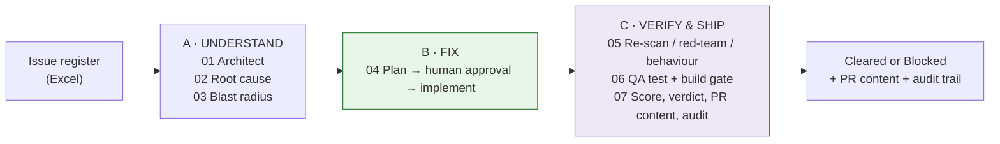

---

## 2. System context

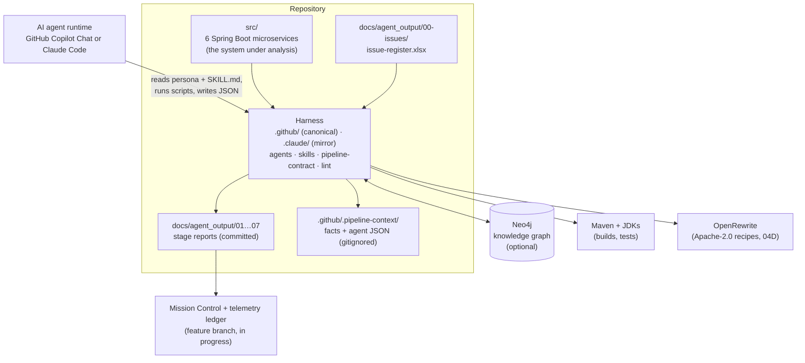

- **Agents** are Markdown personas (`.github/agents/NN_*.agent.md`) that an AI runtime follows.
- **Skills** are folders of deterministic Node.js scripts, JSON schemas, catalogs and policies
  (`.github/skills/<NN><letter>-<name>/`).
- There is **no AI SDK inside the pipeline scripts**. The single exception is an optional fallback
  in 01b, which can call an LLM API to draft descriptions. All reasoning is done by the agent
  runtime, within schemas.

---

## 3. The end-to-end workflow

### 3.1 Full flow

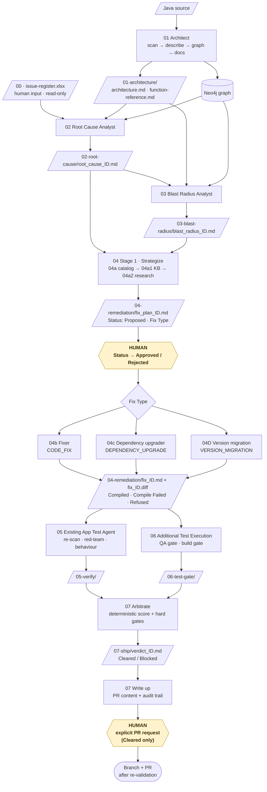

### 3.2 Issue lifecycle

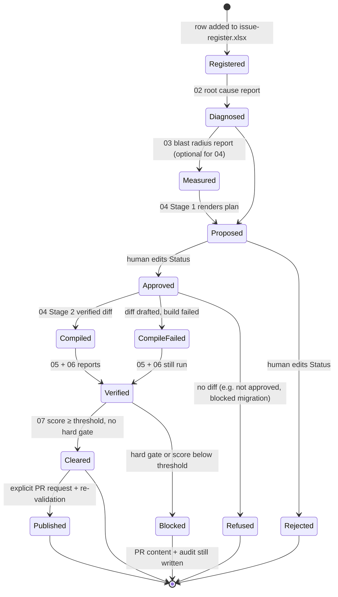

### 3.3 Who does what over time

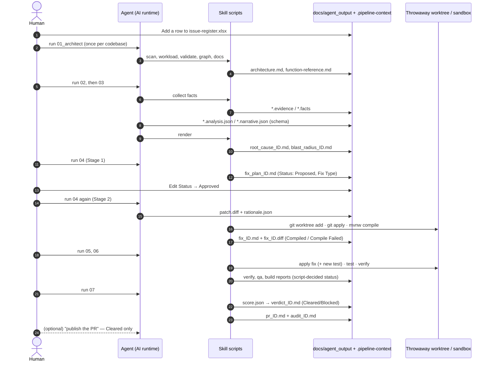

### 3.4 Run order and re-runs

1. **01 runs once per codebase**, and again only when the source changes. It is incremental.
2. **02 → 07 run in numeric order.** Each agent processes **every** eligible file the previous stage
   wrote, or a single issue if you name it (for example `ISSUE-003`).
3. **04 runs twice.** First it proposes plans. After a human approves one or more, run it again to
   implement them.
4. **Any stage can be re-run on its own.** Every hand-off is a file, so re-running a stage only
   rewrites that stage's outputs.
5. **Every skill has a `list-*.js` script** that shows where each issue stands without changing
   anything.

---

## 4. Design principles (the guarantees)

| # | Principle | How it is enforced |
|---|---|---|
| 1 | **Facts ≠ judgement** | Scripts collect facts into `*.facts.json` / `*.evidence.json`. Agents write judgement only into schema-checked JSON. Renderers merge the two, and every report says which parts are measured and which are reasoned. |
| 2 | **Never touch the working tree** | Patches are applied in `git worktree add --detach … HEAD` copies that are removed in a `finally` block. 04D works in a private sandbox repository. |
| 3 | **Human approval before any code** | 04 Stage 2 refuses any plan whose Status cell is not exactly `Approved`. No script ever writes `Approved`. |
| 4 | **Determinism where it counts** | QA, build and scoring outcomes come from real exit codes and a JSON policy. Agents cannot soften a `Failed`. |
| 5 | **One release authority** | Only 07's `Cleared` authorizes shipping. The agent may only override `Cleared → Blocked`, never the reverse. |
| 6 | **Hard gates cannot be out-scored** | `STILL_VULNERABLE`, build `Failed`, and (for migrations) a Migration Status other than PASS/PARTIAL PASS always block. |
| 7 | **File-based hand-off** | Stages talk only through files in `docs/agent_output/`. Each stage is re-runnable, auditable and reviewable on its own. |
| 8 | **Externalized knowledge and policy** | The CWE catalog, the knowledge base, the scoring weights, the migration ladder and the rules packs are editable data, not code. |
| 9 | **Read-only inputs** | The issue register and every upstream report are never written by a downstream stage. |
| 10 | **Always leave a record** | A Blocked patch still gets PR content (with a "do not open" banner) and a full audit trail. |
| 11 | **One job per agent** | No agent both writes code and judges it. No agent both diagnoses a cause and measures its reach. |

---

## 5. The pattern every stage follows

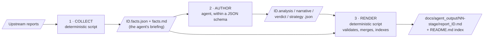

| Step | Who | Can it invent anything? |
|---|---|---|
| Collect | Node script | No. It reads and measures. |
| Author | Agent | Only inside a schema. The renderer refuses invalid or missing required fields. |
| Render | Node script | No. It merges facts and judgement into Markdown and rewrites the stage index. |

Every skill also provides a `list-*.js` workload script. It works out each issue's state purely
from which files exist (for example `not started` → `facts collected` → `judgement written` →
`report written`).

> **Contract between stages:** downstream scripts read specific **"At a glance" table cells** by
> regex, such as `| **Status** |`, `| **Verdict** |` and `| **Decision** |`. **Never hand-edit a
> rendered report.** Changing those cells changes downstream decisions (see Section 15).

---

## 6. Agent-by-agent workflows

Paths below are relative to the repository root. Commands run from the named skill folder.

### 6.0 Input — the Excel issue register (`00`)

| | |
|---|---|
| **File** | `docs/agent_output/00-issues/issue-register.xlsx`, one row per issue |
| **Skill** | `.github/skills/00-issue-register`, the single shared, read-only loader (zero dependencies; the XLSX reader is built on Node `zlib`) |
| **Consumers** | Skills of agents 02, 03, 04 (04a), 05 and 07 (07a, 07b) |
| **Check it** | `node scripts/list-register.js [--issue ISSUE-003] [--full]` |

**Column contract.** Header names are the contract. Column order doesn't matter, unknown columns are
ignored, and rows without an `issue_id` are skipped.

| Group | Columns |
|---|---|
| Identity / triage | `issue_id` (required), `title`, `type` (Defect · Vulnerability · Performance · Security), `severity` (Critical · High · Medium · Low; sets the ship threshold), `status`, `reported_on` (text), `reported_by` |
| Location (multi-value: one per line or comma-separated) | `affected_services` (Maven module names), `affected_symbols` (`Type.method`), `affected_files`, `entry_points` (`METHOD /path`) |
| Narrative (becomes Markdown headings) | `summary`, `affected_area`, `data_flow`, `observed_behavior`, `expected_behavior`, `steps_to_reproduce`, `impact`, `detection_notes` |

- `detection_notes` matters downstream: every `` `backticked` `` token in it becomes a **grep
  signature** that Agent 05's re-scan checks against the patched code.
- **To add an issue:** append a row in Excel, run `list-register.js` to confirm it parses, then
  re-run from Agent 02.
- **Nothing ever writes to the register.**

---

### 6.1 Agent 01 — Architect

**Purpose.** Turn the Java source into the shared understanding every later stage uses: a parsed
code model, a semantic "context" layer, a Neo4j knowledge graph, and architecture documents.
**Runs once per codebase**, and incrementally after source changes. It is the only agent that
writes to the graph.

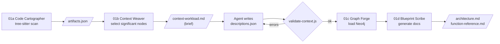

| Step | Skill / command | What happens |
|---|---|---|
| 1 | `01a-code-cartographer`: `node scripts/scan.js` | Parses every `pom.xml` (modules, dependencies) and every `src/main/java/**/*.java` with **tree-sitter (WASM)**. For each top-level type it records annotations, fields, methods (with full source) and call sites. Writes `.github/.pipeline-context/artifacts.json` (gitignored, overwritten each run). |
| 2 | `01b-context-weaver`: `node scripts/list-context-workload.js` | Scores nodes and selects the significant ones (all modules and endpoints; types and methods scoring ≥ 3, e.g. +4 for a REST handler, +3 for a Spring stereotype). Writes the brief `context/context-workload.md`. **Incremental:** only `new` or `stale` nodes are listed, using SHA-1 fingerprints. |
| 3 | **Agent authors** `context/descriptions.json` | For each node: `summary`, `role`, `responsibilities`, `failureModes` (the highest-value field), `sideEffects`, `dataTouched`, `evidence` (`File.java:42`), `confidence`, `openQuestions`. Plus `crossCutting` facts the graph can't show (shared datastores, etc.). Optional fallback: `generate-descriptions.js` calls an LLM (Anthropic / OpenAI / Google) via `.env`. |
| 4 | `node scripts/validate-context.js [--strict]` | Gate: schema shape, no "phantom" nodes, no duplicates, freshness (a stale node is a warning; an error with `--strict`). All errors must be fixed. |
| 5 | `01c-graph-forge`: `node scripts/build-graph.js` | Loads Neo4j (Section 6.1.1). |
| 6 | `01d-blueprint-scribe`: `npm run all` | Writes `docs/agent_output/01-architecture/architecture.md` (modules, service map, layers, REST surface, live graph snapshot) and `function-reference.md` (every type and method with calls / called-by and source). |

#### 6.1.1 Graph model (Neo4j)

| Nodes | `Module`, `Package`, `Type`, `Method`, `Endpoint`, `MavenDependency`, `ExternalType`, `ContextNote` |
|---|---|
| Relationships | `CONTAINS`, `DEPENDS_ON`, `EXTENDS`, `IMPLEMENTS`, `HAS_METHOD`, `CALLS`, `EXPOSES`, `USES`, `ABOUT` |
| Semantic layer | Description fields are stored as `ctx*` properties (`ctxSummary`, `ctxFailureModes`, …), plus a full-text index `context_search` |

**Key points**
- **Facts vs context.** Parser facts and the agent's interpretation are kept apart: a separate file,
  `ctx*` properties, and an author and confidence on every entry.
- **What is tracked in git.** Only `context/descriptions.json` is tracked under `.pipeline-context`,
  because it is expensive to recreate. The two architecture documents are tracked under
  `docs/agent_output/01-architecture/`.
- **Neo4j is optional.** Without it, Agents 02 and 03 fall back to `artifacts.json` and say so in
  their appendix.
- **Rules:** never invent structure; never load a graph that has validation errors; never print
  credentials or full artifacts into chat.

---

### 6.2 Agent 02 — Root Cause Analyst

**Purpose.** For every register row, find the one root cause, explained so a non-engineer
understands it. It diagnoses only: it does not map spread (that is 03) and does not patch (that
is 04).

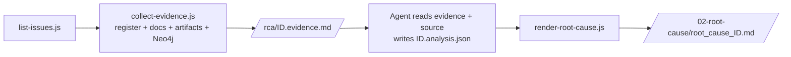

| Step | Command (in `.github/skills/02-root-cause-analyst`) | What happens |
|---|---|---|
| 1 | `node scripts/list-issues.js [--pending]` | Shows the workload and each issue's state |
| 2 | `node scripts/collect-evidence.js --all` (or `--issue ID`, `--depth 1-8`, `--no-graph`) | Resolves `affected_symbols` to methods. Builds a static call graph with interface → implementation edges. Walks callers and callees. Flags self-recursion. Flags "**missing delegation**": an injected collaborator has a same-named method the focus method never calls. Collects the affected area: modules, endpoints, `@Scheduled` jobs, and cross-service HTTP clients. Runs Neo4j queries for callers, callees, owning type, dependants and Maven dependencies. Writes `rca/ID.evidence.{json,md}`. |
| 3 | **Agent authors** `rca/ID.analysis.json` | Required: `summary`, `root_cause{statement, explanation, defect_location}`, `causal_chain` (≥ 2), `impact`, `recommended_fix{approach}`, `verification` (≥ 1). Optional: `confidence`, `plain_summary`, `expected_flow`, `contributing_factors`, `prevention`, `open_questions`. |
| 4 | `node scripts/render-root-cause.js --all` | Validates, renders, and lists anything still pending |

**Report layout (`root_cause_ID.md`).**
- At a glance.
- Numbered sections: what was reported → what should happen vs what happens (diagram) → step-by-step
  failure (flowchart) → where the defect is (defect map) → what it means → why it happened → how to
  fix → how to check → prevention → open questions.
- Appendix: the graph queries that were run.

**Key points**
- **One root cause per issue.** It is the cause, not the symptom.
- **High confidence** only when the evidence alone proves the cause. Anything unproven goes in
  `open_questions`.
- **No false-positive verdict.** 02 assumes every register row is real; it can argue severity in
  `severity_rationale` but cannot dismiss an issue.
- **Consumers:**
  - 03 (its workload is the set of root cause reports);
  - 04a (parses "Where the defect is", Severity, Confidence);
  - 07b (audit trail).

---

### 6.3 Agent 03 — Blast Radius Analyst

**Purpose.** Measure how far each diagnosed defect reaches: which services break or degrade, which
endpoints and scheduled jobs are hit, who feels it, and the priority.

| Step | Command (in `.github/skills/03-blast-radius-analyst`) | What happens |
|---|---|---|
| 1 | `node scripts/list-root-causes.js` | Workload is one report per root cause report. It stops if there are none. |
| 2 | `node scripts/collect-impact.js --all` (`--depth 1-10`, `--no-graph`) | Finds defect sites. Walks callers to every endpoint and `@Scheduled` job that reaches them. Builds per-module inventories. Finds confirmed cross-service HTTP consumers. Works out the platform topology (Eureka, Config Server, shared MongoDB). Writes `blast-radius/ID.facts.{json,md}`. |
| 3 | **Agent authors** `blast-radius/ID.narrative.json` | Required: `scope` (endpoint · service · multi-service), `headline`, `what_is_broken`, `ripple`, `user_impact[{who, what_they_see, status: Blocked/Degraded/At risk}]`, `priority` (e.g. "P1 — reason"). Optional: `not_affected`, `containment`, `if_unfixed`, `open_questions`. |
| 4 | `node scripts/render-blast-radius.js --all` | Applies the status rules, draws three diagrams, renders the report |

**Status rules (deterministic)**

| Status | Rule |
|---|---|
| 🔴 **Broken** | The module is in the issue's `affected_services`, or is a defect-site module |
| 🟠 **Degraded** | The module holds a **confirmed** HTTP consumer of a broken module |
| 🟡 **At risk** | Only for `multi-service` scope: shares the MongoDB store |
| 🟢 **Unaffected** | Everything else |

Endpoints follow the scope. For `endpoint` scope, only handlers that reach the defect are Broken.
For `service` and `multi-service` scope, every endpoint of a broken module is Broken.

**Report layout (`blast_radius_ID.md`).** At a glance (priority, severity, services broken /
degraded, endpoints down, jobs hit), how far it spreads (ring diagram), service map, endpoints,
single-request walk-through, who feels it, what is not affected, containment and priority, open
questions, and an appendix showing how it was measured.

**Key points**
- **Priority** is the agent's reasoned judgement, written as free text. **Severity** is passed
  through from the register.
- The static model decides reach. Neo4j results are recorded alongside it.
- Never contradict 02. Never name a service or endpoint that is not in the facts. Never blur
  *broken* (the request fails) with *degraded* (it succeeds with less).

---

### 6.4 Agent 04 — Fix Generator

The only agent that produces code. It works in **two gated stages** with a human in between.

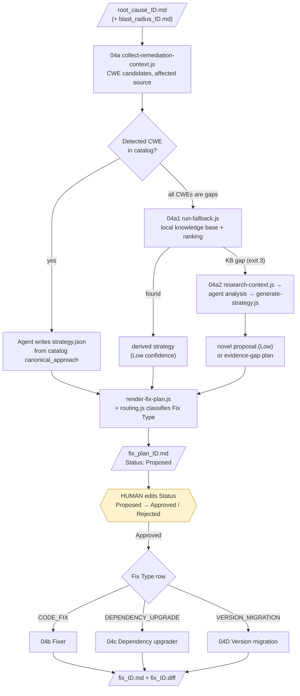

#### Stage 1 — Strategize (skill `04a-fix-strategist`, never writes a diff)

| Step | Command / actor | What happens |
|---|---|---|
| 1 | `node scripts/list-remediation-workload.js` | Workload is one plan per root cause report |
| 2 | `node scripts/collect-remediation-context.js --all` | Reads root cause, blast radius and register row. Snapshots affected files. Detects `CWE-nnn` mentions and tags each as in-catalog or a **catalog gap**. Writes `fix-strategy/ID.context.{json,md}`. |
| 3 | **Agent** reads the briefing and the matching entry in `catalog/cwe-patterns.json` | The catalog has 11 CWEs today: 943, 89, 306, 284, 532, 200, 770, 400, 798, 1104, 79. Each entry has `canonical_approach`, `anti_patterns` and `references`. |
| 3a | Fallback 1: `04a1-remediation-intelligence` | **Only if every detected CWE is a catalog gap.** `run-fallback.js --issue ID` ranks historical fixes from `knowledge/remediation-kb.json` (keyword 0.3 + TF-IDF 0.3 + optional local embedding 0.4) and writes a derived strategy at **Low** confidence. Exit 3 means a **KB gap**. |
| 3b | Fallback 2: `04a2-remediation-research` | **Only on a KB gap.** `research-context.js`, then the agent's structured 13-step analysis (threat, security objective, ≥ 2 candidates, recommendation, validation requirements), then `generate-strategy.js`. Produces a novel **Low**-confidence proposal, or an **evidence-gap plan** ("do not approve as-is") when proof is too thin. |
| 4 | **Agent authors** `fix-strategy/ID.strategy.json` | One `cwe`, `plain_summary`, `approach`, `catalog_reference`, `affected_files[{file, planned_change}]` (prose, no diff), executable `verification_plan`, `alternatives_considered`, `risk_notes`. Optionally exactly one of `dependency_upgrade{…}` or `version_migration{…}`. |
| 5 | `node scripts/render-fix-plan.js --all` | `lib/routing.js` classifies the **Fix Type from evidence**, checking the real `pom.xml`. A contradiction is refused, not re-routed. Renders `fix_plan_ID.md` with `Status: Proposed`. An existing Approved or Rejected Status is preserved on re-render. |

**Fix Type classification (`routing.js`)**

| Fix Type | When | Evidence required |
|---|---|---|
| `VERSION_MIGRATION` | The platform parent or BOM crosses a **major generation**, and/or the Java level changes | `pom.xml` declares the platform coordinate at exactly `source_version`; there is a real major jump or a Java change |
| `DEPENDENCY_UPGRADE` | One library coordinate is bumped to a fixed version (CWE-1104) | It must **not** be a platform parent or BOM crossing a major version. That is refused: "plan it as version_migration". |
| `CODE_FIX` | Everything else | — |

The plan's **Routing decision** section lists this evidence. A migration plan also carries a hidden
machine-readable request, `<!-- 04d-migration-request {…} -->`, that 04D reads.

#### The human checkpoint

- A person opens `fix_plan_ID.md` and changes the **Status** cell from `Proposed` to `Approved` (or
  `Rejected`). The comparison is an exact string match.
- Optionally an **Approved by** cell records who approved it.
- Nothing in the pipeline ever writes `Approved`.
- The Mission Control branch adds `record-decision.js`, a hash-chained, attributed way to do the same thing
  (Section 10).

#### Stage 2 — Implement (Approved plans only, routed by Fix Type)

| Skill | Agent writes | Script verifies (in a throwaway worktree of `HEAD`) | Status |
|---|---|---|---|
| **04b Fixer** (`CODE_FIX`) | `fixer/ID.patch.diff` (smallest diff, in the file's existing style) + `ID.rationale.json` (`files_changed`, `matches_plan`, `deviations`) | `verify-patch.js --issue ID [--test Class]`: worktree → `git apply --check` → apply → detect modules → `mvnw -q compile` (+ targeted test) → remove worktree | `Compiled` / `Compile Failed` / `Refused` |
| **04c Dependency upgrader** (`DEPENDENCY_UPGRADE`, CWE-1104) | `dependency-upgrader/ID.patch.diff` (a `<version>` edit only) + rationale | `apply-version-bump.js --issue ID`: apply → **declared version ≥ minimum** → compile → `dependency:tree` **resolved version ≥ minimum** | same |
| **04D Version migration** (`VERSION_MIGRATION`) | Migration plan, residual repairs, judgement | `detect-baseline.js --issue ID`, then the full 04D procedure in a sandbox (Section 7) | same, plus **Migration Status** PASS / PARTIAL PASS / FAIL / BLOCKED |

All three then render the **same hand-off**, `docs/agent_output/04-remediation/fix_ID.md` +
`fix_ID.diff` (`render-fix-report.js` or 04D's renderer), and update the `04-remediation/README.md`
index.

**Key rules**
- **No code in Stage 1.** One CWE per plan, cited from the catalog. Fallbacks go in order
  04a → 04a1 → 04a2, are never skipped, and never run when any CWE is catalogued.
- **Refuse any Stage 2 plan that is not exactly `Approved`.** "A strongly-worded request is not
  approval."
- **Never edit real source.** Never route CWE-1104 through 04b or other CWEs through 04c. Never
  hand-migrate through 04b/04c.
- **`Compiled` is not a ship signal.** 05 → 06 → 07 must still run.

---

### 6.5 Agent 05 — Existing App Test Agent

**Purpose.** Three **independent, static, reasoning-based** checks on every drafted fix
(`Compiled` **or** `Compile Failed`; `Refused` is excluded). None of them decides whether to ship.

| Check | Question | Verdicts |
|---|---|---|
| **Re-scan** | Does the original finding still trigger? | `FIXED` · `STILL_VULNERABLE` · `INCONCLUSIVE` |
| **Red-team** | Can the patch be bypassed another way? | `NO_BYPASS_FOUND` · `BYPASS_FOUND` · `INCONCLUSIVE` |
| **Behaviour guard** | Did behaviour change beyond what the plan explains? | `BEHAVIOR_PRESERVED` · `BEHAVIOR_CHANGED` · `INCONCLUSIVE` |

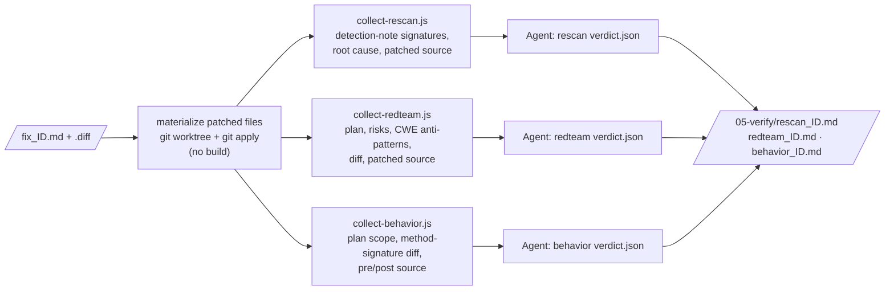

| Step | Command (in `.github/skills/05-verify`) |
|---|---|
| 1 | `node scripts/list-workload.js` |
| 2 | `node scripts/collect-rescan.js --all`, `collect-redteam.js --all`, `collect-behavior.js --all` → `verify/ID.<check>.facts.{json,md}` |
| 3 | **Agent authors** `verify/ID.<check>.verdict.json`. Red-team needs ≥ 1 `attempted_vectors` and real `bypasses_found` when the verdict is `BYPASS_FOUND`. Behaviour needs `out_of_scope_changes` when the verdict is `BEHAVIOR_CHANGED`. |
| 4 | `node scripts/render-rescan.js --all`, `render-redteam.js --all`, `render-behavior.js --all` |

**Key points**
- **No live database by design.** The repository has no embedded Mongo or Testcontainers, so the
  checks are static.
- **If the diff does not apply,** that is recorded as a fact and the verdict should be
  `INCONCLUSIVE`.
- **For a migration** (`Fix Type: VERSION_MIGRATION`), every briefing gets a "Version migration
  context" section. 04D's result is "evidence to check, not a verdict to inherit": a declared
  version that misses the target counts as `STILL_VULNERABLE`, and an unexplained probe difference
  counts as `BEHAVIOR_CHANGED`.
- **Rules:**
  - an absent signature is not automatically `FIXED`;
  - never claim `NO_BYPASS_FOUND` without real vectors;
  - don't judge whether out-of-scope changes are good;
  - never edit upstream folders.

---

### 6.6 Agent 06 — Additional Test Execution

**Purpose.** Deterministic CI-style execution. The agent's only creative work is drafting **one**
new regression test. Applying, compiling, running and the pass/fail call all belong to scripts.

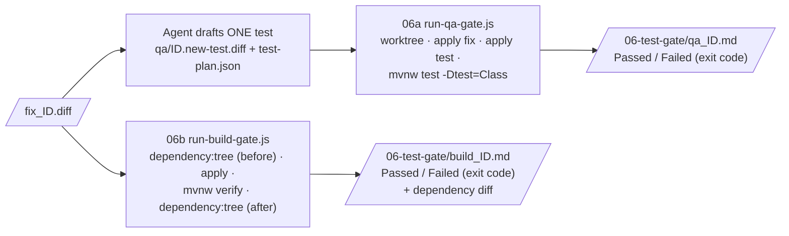

| Gate | Steps | Who decides |
|---|---|---|
| **Gate 1: QA (`06a-qa-runner`)** | `list-qa-workload.js`, then the agent writes one test as a unified diff (mocking Spring Data, replaying the adversarial input and a benign one) plus a `test-plan.json`, then `run-qa-gate.js --issue ID [--existing-test Class]`, then `render-qa-report.js` | The **exit code**. Existing tests that need live infrastructure (`@SpringBootTest`, `@DataMongoTest`, Cucumber, …) are reported `SKIPPED`, which never counts as a pass. |
| **Gate 2: Build (`06b-build-gatekeeper`)** | `list-build-workload.js`, then `run-build-gate.js --issue ID`, then `render-build-report.js` | The **exit code** of `mvnw verify -DskipITs`. The dependency-tree diff is evidence only and never affects pass/fail. **No agent-authored content at all.** |

**Key points**
- **Both gates also run `Compile Failed` fixes,** and report them honestly as `Failed`.
- **For migrations:** the gates switch `JAVA_HOME` to `MIGRATION_JDK_<target>` from the hand-off's
  Target Java. A large dependency diff is expected.
- **Rules:** never hand-edit `result.json`; never re-run hoping for a different result; never
  reclassify a Failed result as acceptable (name an environmental caveat separately).

---

### 6.7 Agent 07 — Audit & PR

**Purpose.** The only place a patch is declared safe to ship. It has three parts.

#### Part 1 — Arbitrate (`07a-merge-arbiter`)

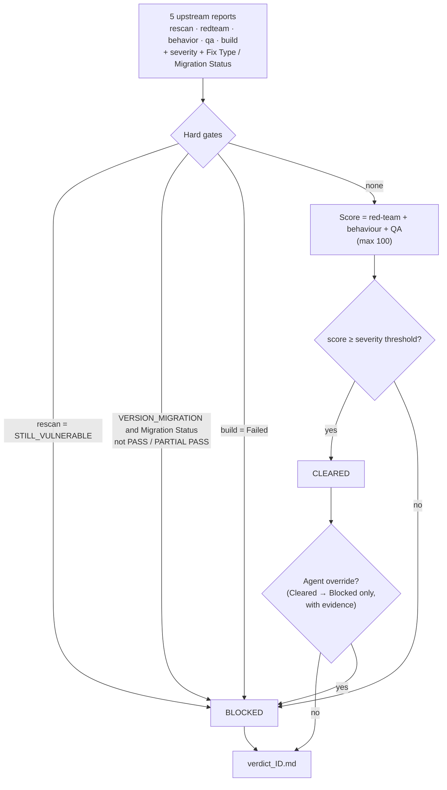

**Policy (`.github/skills/07a-merge-arbiter/scoring.json`, editable, never per patch)**

| Component | Points |
|---|---|
| Red-team | `NO_BYPASS_FOUND` 30 · `INCONCLUSIVE` 15 · `BYPASS_FOUND` 0 |
| Behaviour | `BEHAVIOR_PRESERVED` 30 · `INCONCLUSIVE` 15 · `BEHAVIOR_CHANGED` 0 |
| QA | `Passed` 40 · `Failed` 0 |
| Re-scan | **No points.** It is a hard gate only. |

| Severity | Threshold |
|---|---|
| Critical | 90 |
| High | 85 |
| Medium | 75 |
| Low | 65 |
| Unknown | 85 (default) |

Commands, run in order:
1. `list-merge-workload.js`
2. `compute-score.js --all` writes `merge/ID.score.json`.
3. The agent writes `merge/ID.arbitration.json`: a `narrative`, plus an optional `override`, which
   can only be `Blocked` and must give a reason.
4. `render-verdict.js --all` writes `07-ship/verdict_ID.md`, showing the computed decision and any
   override side by side.
5. For migrations, then run 04D's `finalize-run.js --issue ID`.

#### Part 2 — Write up (`07b-scribe`), always, Cleared or Blocked

1. `collect-chain.js` gathers the **chain of custody**: register row → root cause → blast radius →
   plan → fix + diff → (migration report + summary) → 3 verify reports → QA → build → verdict.
2. The agent writes `scribe/ID.content.json`: `audit_narrative` with every claim linked,
   `pr_title`, `pr_summary`, and `pr_test_plan` drawn from what the gates actually ran.
3. `render-scribe.js` writes `07-ship/audit_ID.md` and `07-ship/pr_ID.md`. A non-Cleared PR file is
   mechanically prefixed with **"BLOCKED — do not open this PR"**. The scribe never runs `git` or
   `gh`.

#### Part 3 — Publish (only on explicit request, and only for a `Cleared` verdict)

1. Create a new branch and an isolated worktree.
2. Apply `fix_ID.diff`.
3. Re-run the validation named in the PR content.
4. Commit only the validated patch, push, and run `gh pr create` using `pr_ID.md`.
5. Report the branch, the commit, the PR URL and the validation performed.

A Blocked patch is never published, even when asked. *This step is followed by the agent; no script
implements it.*

---

## 7. Agent 04D — Version migration in depth

04D is the Stage 2 skill for `VERSION_MIGRATION`. It can also be invoked directly ("upgrade this
app to Spring Boot 4.1.1"). It moves a Java application between **Spring Boot versions (any
published line from 1.5 to 4.1, to any later line) and Java levels**. It proves that the result
builds, passes the same tests, and keeps every endpoint.

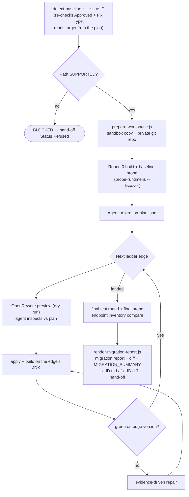

**How it works**
- **The ladder.** The route is planned as edges:
  - PATCH: the latest patch of the current line first;
  - MAJOR_BOUNDARY: every major version is crossed separately, never skipped;
  - MINOR: moves within a major.

  Each edge has its own recipe, Java level and Spring Cloud release train, verified against Maven
  Central. Each edge must build green on its exact version before the next one starts.
- **Open-source OpenRewrite by default.** Spring's recipes are Apache-2.0 only up to Boot 3.3
  (`rewrite-spring` 5.24.1). Beyond 3.3, 04D uses its own composite (built from Apache core
  recipes), plus version pins and evidence-driven repair. Source-available recipes run only with
  `--license-policy source-available`. A licence gate in code refuses anything else.
- **Safety gates.**
  - Order: nothing changes before round 0, the baseline probe and a valid plan exist.
  - Preview-before-apply, with automatic revert if an apply overreaches the preview.
  - Licence gate.
  - Status rules.
  - An apply gate covering unfinished edges, lost endpoints, open constraints, version mismatch and
    project drift.
- **Endpoint preservation.** It inventories controller mappings, config-enabled framework endpoints
  (H2 console, actuator) and the live `/actuator/mappings`. It probes before and after. A lost
  endpoint means **FAIL**. A classified framework change means **PARTIAL PASS**, which needs human
  acceptance.
- **Outputs.**
  - `04-remediation/migration_<slug>.md` + `.diff`;
  - `migration-runs/<run_id>/MIGRATION_SUMMARY.md` (an automatic PASS / PARTIAL PASS / FAIL /
    BLOCKED status, regenerated after every command);
  - the standard `fix_ID.md` + `fix_ID.diff` hand-off for 05–07.
- **Downstream.** 05 and 06 re-verify a migration independently. 07a adds the migration hard gate.
  **04D's own result never clears a patch.**

**Further reading:** `.github/skills/04d-version-migration/SKILL.md` (the procedure),
`ARCHITECTURE.md` (the design), `docs/validation/04d-any-version/ANY_VERSION_REPORT.md` (evidence)
and `04D_PREVIOUS_VS_CURRENT.md` (comparison with the earlier version).

---

## 8. Status vocabulary and the ship decision

| Stage (output folder) | Field | Values | Set by |
|---|---|---|---|
| 04 · Fix plan | `Status` | `Proposed` → `Approved` · `Rejected` | Renderer writes `Proposed`; **only a human** sets the others |
| 04 · Fix plan | `Fix Type` | `CODE_FIX` · `DEPENDENCY_UPGRADE` · `VERSION_MIGRATION` | `routing.js`, from evidence |
| 04 · Fix | `Status` | `Compiled` · `Compile Failed` · `Refused` | Verification script |
| 04 · Fix (migration) | `Migration Status` | `PASS` · `PARTIAL PASS` · `FAIL` · `BLOCKED` | 04D summary rules |
| 05 · Re-scan | `Verdict` | `FIXED` · `STILL_VULNERABLE` · `INCONCLUSIVE` | Agent (schema) |
| 05 · Red-team | `Verdict` | `NO_BYPASS_FOUND` · `BYPASS_FOUND` · `INCONCLUSIVE` | Agent (schema) |
| 05 · Behaviour | `Verdict` | `BEHAVIOR_PRESERVED` · `BEHAVIOR_CHANGED` · `INCONCLUSIVE` | Agent (schema) |
| 06 · QA | `Status` | `Passed` · `Failed` · `Refused` | **Exit code** |
| 06 · Build | `Status` | `Passed` · `Failed` · `Refused` | **Exit code** |
| 07 · Verdict | `Decision` | `Cleared` · `Blocked` | `compute-score.js` + optional downgrade |

**Eligibility.** `Compiled` and `Compile Failed` fixes both go through 05, 06 and 07, because a patch
that does not build still has a real diff worth checking. `Refused` fixes stop, because no diff
exists.

**Worked example (from the validation run).**
- The migration fix ISSUE-001 scored 30 (red-team) + 0 (behaviour changed) + 40 (QA passed) = **70**.
- The threshold was 75, and the build hard gate triggered on two pre-existing test failures.
- Verdict: **Blocked**. The migration gate itself was clear (PARTIAL PASS).

The canonical rules are in `.github/pipeline-contract.md`. Run `node .github/scripts/pipeline-lint.js`
after changing any agent, skill or renderer.

---

## 9. Data and file map

### 9.1 Deliverables (committed): `docs/agent_output/`

| Folder | Written by | Files |
|---|---|---|
| `00-issues/` | Human | `issue-register.xlsx`, `README.md` (column contract) |
| `01-architecture/` | 01 | `architecture.md`, `function-reference.md` |
| `02-root-cause/` | 02 | `root_cause_ID.md` |
| `03-blast-radius/` | 03 | `blast_radius_ID.md` |
| `04-remediation/` | 04 (04a/04b/04c/04D) | `fix_plan_ID.md`, `fix_ID.md`, `fix_ID.diff`, `migration_<slug>.md/.diff`, `migration-runs/<run_id>/`, `README.md` index |
| `05-verify/` | 05 | `rescan_ID.md`, `redteam_ID.md`, `behavior_ID.md`, `README.md` |
| `06-test-gate/` | 06 | `qa_ID.md`, `build_ID.md`, `README.md` |
| `07-ship/` | 07 | `verdict_ID.md`, `pr_ID.md`, `audit_ID.md`, `README.md` (scribe only) |

### 9.2 Working data (gitignored): `.github/.pipeline-context/`

| Path | Contents |
|---|---|
| `artifacts.json` | Parsed code model (01a) |
| `context/descriptions.json` | Semantic layer (01b). **The one tracked file.** |
| `rca/`, `blast-radius/` | 02/03 facts and agent JSON |
| `fix-strategy/`, `research/` | 04a context and strategies; 04a2 research |
| `fixer/`, `dependency-upgrader/` | 04b/04c patches, rationales, verification records, temporary worktrees |
| `version-migration/<slug>/` | 04D session: baseline, plan, rounds, transformations, runtime probes, sandbox |
| `verify/`, `qa/`, `build/`, `merge/`, `scribe/` | Phase C facts, verdicts, results, scores and content |

`PIPELINE_CONTEXT_DATA_DIR` and `PIPELINE_OUTPUT_DIR` redirect these locations, for isolated test
runs.

### 9.3 Repository layout

```
src/                         the application under analysis (6 Spring Boot microservices, Section 11)
docs/agent_output/           harness deliverables: issue register + one folder per stage (9.1)
docs/validation/             validation evidence (04D integration, any-version migration)
Jenkinsfile                  CI: test gates, build, deploy WARs to Tomcat
.github/                     canonical harness (Copilot-style agent frontmatter)
├── agents/                  01_architect … 07_audit-and-pr  (*.agent.md)
├── skills/                  00 … 07b (18 skills; each self-contained, own package.json)
├── pipeline-contract.md     ownership, status transitions, routing, decision policy
├── scripts/pipeline-lint.js contract text checks
└── README.md                harness overview
.claude/                     path-swapped mirror for Claude Code (Claude-style frontmatter);
                             its 04D folder is a pointer to .github/skills/04d-version-migration
```

---

## 10. Observability — telemetry and Mission Control (in progress)

> **Status.** This layer lives on branch **`feature/04d-version-migration-v2`** and is **not yet
> merged into `main`**. Its own build report states that "no MARS agent has yet been observed live".
> Treat it as a working prototype.

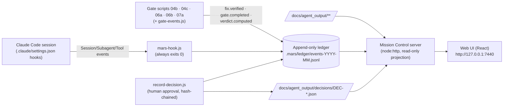

**Telemetry (`.claude/scripts/telemetry/`)**
- **`mars-hook.js`** turns Claude Code hook events into ledger events: `session.*`, `agent_run.*`,
  `skill.loaded`, `operation.*`, `artifact.written` (path and sha256), `human.waiting`, and guard
  events.
  - It never records prompts, model output, file contents or full commands.
  - `MARS_EVIDENCE_GUARD=observe|enforce|off` controls whether direct edits to evidence files are
    only logged or actually denied.
- **`ledger.js`** writes `mars.event/1` events: ULID, a gap-free sequence, redaction. `MARS_TELEMETRY=0`
  disables it.
- **`classify.js`** maps commands and paths to MARS stages.
- **`gate-events.js`** is called by the five gate scripts after they write their record, with a
  failure class.
- **`record-decision.js`** is the attributed way to approve or reject a plan:

  ```
  node .claude/scripts/record-decision.js --issue ISSUE-001 --decision APPROVED \
       --expected-sha256 <plan hash> --actor "Your Name" --rationale "…"
  ```

  - It needs an interactive terminal and refuses to run inside an agent session or with a
    machine-like actor name.
  - It edits only the Status cell, writes a hash-chained `DEC-*.json`, and does **not** start the
    Fixer.

**Mission Control (`mission-control/`)** is a local, **read-only** operations console. It answers:
what is MARS doing now, why is each issue where it is, and what needs a human?

| Aspect | Detail |
|---|---|
| Stack | Node ≥ 20.19, plain `node:http` server with Server-Sent Events, React 19 + TanStack + React Flow + Tailwind 4 + Vite 7, TypeScript |
| Screens | Home ("needs a human", live feed), Issues board and detail (lifecycle, checks, verdict replay, lineage), Approvals, Runs, Evidence, Audit, Architecture, Harness registry, Health |
| Integrity rules | R1–R14. For example: a report header contradicts its own result table; a verdict cannot be reproduced; an approval was carried over to a re-proposed plan |
| Run | `cd mission-control && npm install && npm run build && npm start` (loopback only; `--enable-decisions` turns on the approval endpoint). Dev mode: `npm run dev`. |
| Tests | 137 vitest tests and 31 Playwright tests passed (as stated in its build report) |
| Limits (self-reported) | No authentication (loopback only); decision attribution is advisory; evidence guard defaults to `observe`; Insights page not built |

---

## 11. The application under analysis and its CI

`src/` holds the system MARS analyses and remediates: a Spring Cloud microservices system for
managing employees, departments, reports and scheduled jobs. It is backed by a config server and a
Eureka service registry.

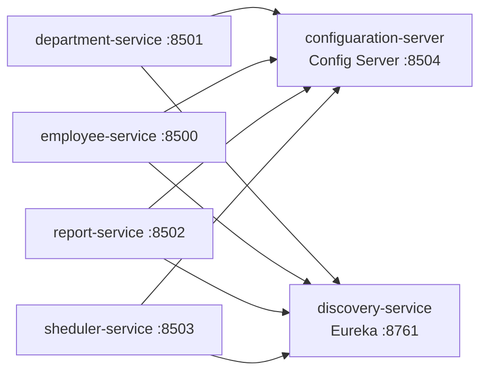

| Service | Description | Default port | Depends on |
|---|---|---|---|
| [configuaration-server](src/configuaration-server) | Spring Cloud Config Server, backed by a Git-hosted properties repo | 8504 | — |
| [discovery-service](src/discovery-service) | Eureka service registry | 8761 | — |
| [department-service](src/department-service) | Department CRUD API (`/api/v1`), MongoDB-backed, Cucumber tests | 8501 | config-server, discovery |
| [employee-service](src/employee-service) | Employee CRUD API (`/api/v1`), MongoDB-backed | 8500 | config-server, discovery |
| [report-service](src/report-service) | Employee report generation API (`/api/v1`), WebFlux client | 8502 | config-server, discovery |
| [sheduler-service](src/sheduler-service) | Scheduled jobs API (`/api/v1`) | 8503 | config-server, discovery |

> Ports above are the intended values. Some are commented out in `application.properties` in
> favour of Spring Boot defaults; update as needed per environment. The service folder names keep
> their original spelling (`configuaration`, `sheduler`), and the harness's module lists depend on
> those exact names.

**Tech stack:**
- Java 17
- Spring Boot 2.7.12 / Spring Cloud 2021.0.7
- Spring Cloud Config, Netflix Eureka
- Spring Data MongoDB, Lombok
- Cucumber + JUnit for BDD and unit tests
- Maven, with the Maven Wrapper; each module packages as a WAR

**Prerequisites:** JDK 17+, Maven (or the bundled `mvnw` / `mvnw.cmd`), and a reachable MongoDB
instance (connection string configured per service).

### 11.1 Running the services

Start config and discovery first, then the feature services in any order:

```powershell
# 1. Config Server
cd src/configuaration-server
./mvnw spring-boot:run

# 2. Discovery Service (Eureka)
cd src/discovery-service
./mvnw spring-boot:run

# 3. Feature services (any order)
cd src/department-service; ./mvnw spring-boot:run
cd src/employee-service;   ./mvnw spring-boot:run
cd src/report-service;     ./mvnw spring-boot:run
cd src/sheduler-service;   ./mvnw spring-boot:run
```

Each service reads its shared configuration from the config server via `bootstrap.properties`
(`spring.cloud.config.uri`) and registers itself with Eureka once started.

### 11.2 Building and testing

```powershell
cd src/department-service
./mvnw clean package          # builds the WAR

cd src/employee-service
./mvnw test                   # unit + Cucumber tests
```

Cucumber feature files live under each service's `src/test/resources/features` (or
`src/main/resources/features`).

### 11.3 CI/CD — the `Jenkinsfile`

The [Jenkinsfile](Jenkinsfile) uses Windows `bat` steps:
1. Checks out the source.
2. Gates the employee service on JaCoCo unit-test coverage above 30% and a Cucumber pass rate above
   90%.
3. Builds each service with `mvn clean compile package`.
4. Deploys each WAR to a local Tomcat 8.5 instance.

---

## 12. Runbook: setup and running

### 12.1 Prerequisites

| Need | For |
|---|---|
| Node.js 18+ (20.19+ for Mission Control) | All skills |
| Git | Worktrees and sandboxes |
| JDK 17 (and the migration target JDK, e.g. 21) + Maven, or the services' `mvnw` | Builds, gates, 04D |
| Neo4j (Aura or Docker), optional | Graph-backed sections of 01–03 |
| Docker, optional | Testcontainers integration tests during 04D runs |
| Network access | Maven Central, OpenRewrite plugin (04D) |
| An AI runtime | GitHub Copilot Chat (uses `.github/agents`) or Claude Code (uses `.claude/agents`) |

### 12.2 One-time setup

```powershell
cd .github/skills/01a-code-cartographer; npm install
cd ../01b-context-weaver;                npm install
cd ../01c-graph-forge;                   npm install; Copy-Item .env.example .env   # fill NEO4J_*
cd ../01d-blueprint-scribe;              npm install
cd ../02-root-cause-analyst;             npm install
cd ../03-blast-radius-analyst;           npm install
```

The other skills (00, 04a–04D, 05, 06a, 06b, 07a, 07b) have **zero npm dependencies**. 04a1 can
optionally use a local Python virtual environment for embedding ranking.

### 12.3 Running the pipeline

Ask the agent runtime, in order:

```
run the 01_architect agent                  → architecture + knowledge graph
run the 02_root-cause-analyst agent         → why each issue is real
run the 03_blast-radius-analyst agent       → how far it reaches
run the 04_fix-generator agent              → fix plans (Status: Proposed)
   ⏸ a human edits Status → Approved in docs/agent_output/04-remediation/fix_plan_ID.md
run the 04_fix-generator agent              → implements Approved plans (04b / 04c / 04D)
run the 05_existing-app-test-agent agent    → re-scan, red-team, behaviour
run the 06_additional-test-execution agent  → QA gate + build gate
run the 07_audit-and-pr agent               → verdict, PR content, audit
   ⏸ (optional) "publish the PR for ISSUE-00N" — Cleared verdicts only
```

Add an issue id to any agent run to narrow it, for example `run the 05 agent for ISSUE-003`.

### 12.4 Checking state without changing anything

```powershell
node .github/skills/00-issue-register/scripts/list-register.js
node .github/skills/02-root-cause-analyst/scripts/list-issues.js --pending
node .github/skills/04a-fix-strategist/scripts/list-remediation-workload.js
node .github/skills/04b-fixer/scripts/list-fix-workload.js
node .github/skills/05-verify/scripts/list-workload.js
node .github/skills/07a-merge-arbiter/scripts/list-merge-workload.js
node .github/scripts/pipeline-lint.js
```

### 12.5 Environment variables

| Variable | Used by | Meaning |
|---|---|---|
| `NEO4J_URI`, `NEO4J_USERNAME`, `NEO4J_PASSWORD`, `NEO4J_DATABASE` | 01c, 01d, 02, 03 | Graph connection (in `01c-graph-forge/.env`) |
| `LLM_PROVIDER`, `ANTHROPIC_API_KEY` / `OPENAI_API_KEY` / `GOOGLE_API_KEY`, `*_MODEL` | 01b fallback only | Optional LLM drafting of descriptions |
| `CONTEXT_MAX_NODES`, `CONTEXT_*_THRESHOLD` | 01b | Node selection tuning |
| `PIPELINE_CONTEXT_DATA_DIR`, `PIPELINE_OUTPUT_DIR` | All | Redirect working data and outputs (isolated runs, tests) |
| `MIGRATION_JDK_<major>`, `MIGRATION_MVN` | 04D, 06 | Point at a specific JDK or Maven without changing the machine default |
| `MIGRATION_OFFLINE=1` | 04D | Plan from recorded versions instead of Maven Central |
| `MIGRATION_REPORT_DIR` | 04D | Redirect migration reports |
| `MARS_TELEMETRY`, `MARS_LEDGER_DIR`, `MARS_RUN_ID`, `MARS_SESSION_ID`, `MARS_EVIDENCE_GUARD` | Telemetry (feature branch) | Ledger control |
| `MC_PORT`, `MC_E2E_PORT`, `PW_CHANNEL` | Mission Control | Server and test ports, browser |

---

## 13. Extending MARS

| You want to… | Do this | Code change? |
|---|---|---|
| Add a vulnerability class | Add an entry to `.github/skills/04a-fix-strategist/catalog/cwe-patterns.json` (`title`, `applicable_when`, `canonical_approach`, `anti_patterns`, `references`) | No |
| Teach a fallback pattern | Add to `04a1-remediation-intelligence/knowledge/remediation-kb.json` (+ a ref note). Promote it to the catalog once proven. | No |
| Change ship policy | Edit `07a-merge-arbiter/scoring.json` (weights, thresholds, hard gates). This is a standing policy decision, never per patch. | No |
| Support a new framework jump | Add a rules pack `04d-version-migration/references/<from>-to-<to>.md` and/or a ladder rung in `references/openrewrite/spring-boot-ladder.json` | No |
| Add a microservice | Add it under `src/`. **Also add it to the module lists** in `verify-patch.js`, `apply-version-bump.js` and the 06 gates (or give it a `pom.xml` the gates detect). | Small |
| Change an agent or renderer | Edit it, then run `node .github/scripts/pipeline-lint.js`. Keep the `.claude` mirror in sync (paths only). | — |
| Change a report layout | Change the renderer, **and** every downstream parser that reads its table cells | Yes, carefully |
| Run 04D's tests | `cd .github/skills/04d-version-migration && node --test tests/*.test.js` (50 tests) | — |

---

## 14. Proven results

All evidence is under `docs/validation/`.

| Validation | What it proved | Entry point |
|---|---|---|
| **Round A**, unmodified pipeline 01 → 07 on MARS `src/` | The pipeline runs end to end; 04D was unreachable (routing by CWE only) | `04d-integration/BASELINE_PIPELINE_REPORT.md` |
| **Round B**, 04D standalone | 04D migrates Boot 3.5.0 → 4.1.1 correctly; found and fixed a pack-selection bug that accepted a Boot 2.7 source | `04d-integration/ROUND_B_REPORT.md` |
| **Round C**, integrated 01 → 04 → 04D → 05 → 06 → 07 | Agent 04 routed by Fix Type to 04D; 04D migrated and handed off; 05–07 consumed the result; verdict **Blocked** by the build gate on pre-existing failures; nothing published | `04d-integration/FINAL_VALIDATION_REPORT.md` |
| **Any-version 04D**, V1 | MARS `employee-service` 2.7.12 + Spring Cloud → 3.5.16 in 4 edges; 7/7 tests; all endpoints kept; PARTIAL PASS (one expected Boot 3 trailing-slash change) | `04d-any-version/ANY_VERSION_REPORT.md` |
| **Any-version 04D**, V2c | Demo app 3.5.0 → 4.1.1 in 3 edges; same tests; 11/11 endpoints; caught and restored a lost `/h2-console`; PASS | same |

Approvals in validation runs were granted programmatically for controlled testing. This does not
replace the production human approval requirement.

---

## 15. Known issues and gotchas

These were found while researching this handbook. Read them before relying on the sample outputs or
extending the harness.

| # | Area | Issue | Impact / what to do |
|---|---|---|---|
| 1 | Sample outputs (06) | All 8 committed `06-test-gate/*.md` show `Status: Passed` in "At a glance", but their own result tables show exit code 1. The 06 README and the verdicts say Failed. The reports were hand-edited after rendering. | Re-running `compute-score.js` on these files would wrongly **clear** ISSUE-003 and ISSUE-004. **Regenerate the 06 reports by re-running the gates** before using them. |
| 2 | Sample outputs (04, 07) | Older plans and fix reports predate the current renderers: no Fix Type or Routing sections, hand-added sections, `.claude/.architect` paths. `fix_ISSUE-003.md` claims 3 files changed but the diff touches 1. | Treat the samples as illustrative; re-render before demos |
| 3 | 03 ← 02 parsing | `03/lib/inputs.js` looks for old 02 report headings, so root cause statement, location and confidence come through as null ("not parsed — read the report") | Update the parser to the current headings (`## N. Where the defect is`, `| **Severity** |`) |
| 4 | Agent 02 | There is no false-positive / not-a-defect outcome; every register row is assumed real | Triage the register before running 02 |
| 5 | Schemas | Renderers hand-validate required fields only. Enums and `additionalProperties` are not enforced (02, 03, 04a). | Agents must follow the schemas; consider a real validator |
| 6 | 07a policy | `BYPASS_FOUND` or `BEHAVIOR_CHANGED` caps the score at 70, which is **≥ the Low threshold (65)**. A Low-severity fix with a bypass could compute Cleared. | Decide whether `BYPASS_FOUND` should be a hard gate, and update `scoring.json` |
| 7 | 04b routing | `verify-patch.js` does not itself refuse CWE-1104 plans; only the agent's routing prevents it | Add a script-level refusal |
| 8 | 04c | The declared-version check does not resolve `${property}` versions | Property-managed versions will fail the check; record a deviation |
| 9 | Hard-coded modules | 04b, 04c and the 06 gates recognise the six existing `src/` modules only | Add new services to those lists |
| 10 | Neo4j | The graph only grows; the loader never deletes. Live counts exceed the artifacts (old leftovers or a shared database). | Use a dedicated database, or clear it before a full reload |
| 11 | Semantic layer | The `ctx*` graph properties and `descriptions.json` are not read by any downstream script (only the docs and the structural graph are) | Value today is for humans and future use |
| 12 | 01a scan scope | The `.github` copy of `scan.js` scans `**/pom.xml`, which can pick up the 04D test fixture as a 7th module (the `.claude` copy scans `src/**`) | Narrow the glob to `src/**/pom.xml` |
| 13 | Issue register | The live spreadsheet lacks the `entry_points` and `affected_area` columns | Add them for richer evidence |
| 14 | Stale prose | Some 05/06 texts still say gates run on "Compiled only". The code and contract run on Compiled **and** Compile Failed. 04a2 docs still mention a "SAFE STOP". | Doc clean-up |
| 15 | Publish step | PR publication is agent-followed prose, not scripted; the lint only checks that the sentence exists | Keep the human request explicit; consider a script |
| 16 | Secrets | Some `src/*/application.properties` contain a **commented-out MongoDB connection string with embedded credentials** | Rotate the credential and remove it from history |
| 17 | CI | `Jenkinsfile` checks out an external repository URL, not this one | Point it at this repository |
| 18 | Telemetry | Only the `.claude` gate scripts are instrumented, with hard-coded `.claude` paths; gate events have not fired in a real run yet | Expected for a prototype |
| 19 | Environment | A JDK much newer than 17 breaks Lombok, producing "cannot find symbol" in untouched files | Use JDK 17 for 2.7 services (`MIGRATION_JDK_17`); compare error locations with the changed files |
| 20 | Docs drift | The `.claude/README.md` badges (14 skills) differ from `.github` (18) | Sync the mirror |

---

## 16. Key points cheat sheet

1. **Seven agents, three phases, one direction:** Understand (01–03) → Fix (04) → Verify & Ship
   (05–07).
2. **Input is one Excel register.** Output is one Markdown report per issue per stage, plus patches.
3. **Scripts measure, agents judge, renderers merge.** Judgement lives only in schema-checked JSON,
   so every report shows what was measured and what was reasoned.
4. **No code before a human approves the plan.** The approval is the Status cell in
   `fix_plan_ID.md`.
5. **Fix Type decides the fixer:** `CODE_FIX` → 04b, `DEPENDENCY_UPGRADE` → 04c,
   `VERSION_MIGRATION` → 04D. It is checked against the real `pom.xml`.
6. **The real repository is never touched by analysis.** Patches live in throwaway worktrees or
   sandboxes.
7. **Tests and builds are decided by exit codes,** never by an agent.
8. **Only 07 can say "Cleared".** Hard gates (still vulnerable, build failed, migration not passed)
   cannot be out-scored. The agent can only make a decision stricter.
9. **Every issue ends with an audit trail,** Cleared or Blocked. A PR is opened only for Cleared,
   and only when a human asks.
10. **Knowledge and policy are data:** CWE catalog, knowledge base, scoring weights, migration ladder
    and rules packs.
11. **04D upgrades Spring Boot and Java across versions** with open-source OpenRewrite recipes, step
    by step, and proves endpoints and behaviour are preserved.
12. **Never hand-edit rendered reports.** Downstream stages read their table cells.

---

## 17. Glossary

| Term | Meaning |
|---|---|
| **Agent** | A Markdown persona (`*.agent.md`) that an AI runtime follows to run one or more stages |
| **Skill** | A folder of deterministic scripts, schemas and data that an agent drives |
| **Stage** | One step of the pipeline, with its own output folder |
| **Facts / judgement** | Script-measured data vs agent-authored, schema-checked reasoning |
| **Worktree** | A throwaway git checkout of `HEAD` where a patch is applied and built |
| **Sandbox** | 04D's private project copy with its own git history |
| **CWE** | Common Weakness Enumeration, the vulnerability class a plan is keyed on |
| **Catalog / KB** | The curated CWE remediation patterns (04a) and the historical-fix knowledge base (04a1) |
| **Fix Type** | `CODE_FIX`, `DEPENDENCY_UPGRADE` or `VERSION_MIGRATION`; decides which Stage 2 skill runs |
| **Hard gate** | A condition that blocks regardless of score |
| **Override** | The 07 agent's evidence-based downgrade of a computed `Cleared` to `Blocked` |
| **Chain of custody** | Every artifact from register row to verdict, linked in the audit |
| **Ladder / edge** | 04D's planned version route and its individual steps |
| **OpenRewrite recipe** | A named, repeatable code transformation (open-source engine) |
| **Probe** | An HTTP request replayed before and after a migration |
| **Ledger** | The append-only telemetry event log (`.mars/ledger/`, feature branch) |
| **Mission Control** | The read-only web console over evidence and the ledger (feature branch, in progress) |
