<div align="center">

# MARS — Modernization, Assessment, Remediation & Security

**MARS is an agentic remediation harness for Java and Spring Boot systems. It takes a reported
defect or vulnerability through all of these steps to a scored ship decision that you can audit:**

`understand the code` → `diagnose the issue` → `measure its reach` → `plan a fix` → `get human approval` → `implement it` → `verify it` → `test it` → `build it` → `decide` → `document it`.


**[Summary](#1-summary)** ·
**[Agents](#24-the-7-agents)** ·
**[Skills](#25-the-18-skills)** ·
**[Workflow](#4-the-end-to-end-workflow)** ·
**[Ship decision](#12-the-ship-decision-and-status-vocabulary)** ·
**[Run MARS](#15-how-to-run-mars)** ·
**[Glossary](#20-glossary)**

</div>

> [!NOTE]
> This README uses ASD-STE100 Simplified Technical English. The writing rules and the project
> vocabulary are in [`docs/ste-style-guide.md`](docs/ste-style-guide.md). Each term in the
> [Glossary](#20-glossary) has only one meaning.

---

MARS uses the same pipeline for framework and Java version migrations. It can migrate Spring Boot
from any published line to any later line.

This README is the **one location that explains all of MARS**. It gives these topics:

- the general design
- each of the 7 agents
- each of the 18 skills: its purpose, its contents and its procedure, step by step
- the decision rules
- the data map
- observability
- the runbook
- the known problems

This README describes the harness. It does not describe the Java application that MARS analyses.

| If you are… | Read |
|---|---|
| A manager or reviewer | [1](#1-summary), [3](#3-design-rules), [4](#4-the-end-to-end-workflow), [12](#12-the-ship-decision-and-status-vocabulary), [17](#17-validation-results), [19](#19-key-points) |
| A developer who joins the project | All sections, in sequence. Keep [15](#15-how-to-run-mars), [16](#16-how-to-extend-mars) and [18](#18-known-problems) open while you work |
| An operator who runs a remediation | [15](#15-how-to-run-mars), then the section for the agent that you will run (sections [6](#6-phase-a--understand) to [11](#11-phase-c--verify--ship)) |
| A person who needs one skill | The [skill index](#25-the-18-skills), then the detailed section for that skill |

---

## Table of contents

1. 🧭 [Summary](#1-summary)
2. 🏗️ [How MARS is built](#2-how-mars-is-built)
   - 2.1 [Agents, skills, scripts and the AI runtime](#21-agents-skills-scripts-and-the-ai-runtime)
   - 2.2 [System context](#22-system-context)
   - 2.3 [`.github` and `.claude`](#23-github-and-claude)
   - 2.4 [The 7 agents](#24-the-7-agents)
   - 2.5 [The 18 skills](#25-the-18-skills)
   - 2.6 [Which agent uses which skill](#26-which-agent-uses-which-skill)
3. 🛡️ [Design rules](#3-design-rules)
4. 🔄 [The end-to-end workflow](#4-the-end-to-end-workflow)
5. 📊 [The input — skill `00-issue-register`](#5-the-input--skill-00-issue-register)
6. 🔵 [Phase A · Understand](#6-phase-a--understand)
   - 6.1 [Agent 01 — Architect](#61-agent-01--architect) · skills [01a](#skill-01a--code-cartographer), [01b](#skill-01b--context-weaver), [01c](#skill-01c--graph-forge), [01d](#skill-01d--blueprint-scribe)
   - 6.2 [Agent 02 — Root Cause Analyst](#62-agent-02--root-cause-analyst) · skill [02](#skill-02--root-cause-analyst)
   - 6.3 [Agent 03 — Blast Radius Analyst](#63-agent-03--blast-radius-analyst) · skill [03](#skill-03--blast-radius-analyst)
7. 🟢 [Phase B · Fix — Agent 04 Fix Generator](#7-phase-b--fix--agent-04-fix-generator)
8. 🧠 [Agent 04, Stage 1 — Strategize](#8-agent-04-stage-1--strategize) · skills [04a](#skill-04a--fix-strategist), [04a1](#skill-04a1--remediation-intelligence), [04a2](#skill-04a2--remediation-research)
9. ⏸️ [Human approval and Fix Type](#9-human-approval-and-fix-type)
10. 🛠️ [Agent 04, Stage 2 — Implement](#10-agent-04-stage-2--implement) · skills [04b](#skill-04b--fixer), [04c](#skill-04c--dependency-upgrader), [04d](#skill-04d--version-migration)
11. 🟣 [Phase C · Verify & Ship](#11-phase-c--verify--ship)
    - 11.1 [Agent 05 — Existing App Test Agent](#111-agent-05--existing-app-test-agent) · skill [05](#skill-05--verify)
    - 11.2 [Agent 06 — Additional Test Execution](#112-agent-06--additional-test-execution) · skills [06a](#skill-06a--qa-runner), [06b](#skill-06b--build-gatekeeper)
    - 11.3 [Agent 07 — Audit & PR](#113-agent-07--audit--pr) · skills [07a](#skill-07a--merge-arbiter), [07b](#skill-07b--scribe)
12. ⚖️ [The ship decision and status vocabulary](#12-the-ship-decision-and-status-vocabulary)
13. 🗂️ [Data and file map](#13-data-and-file-map)
14. 📡 [Observability — telemetry and Mission Control](#14-observability--telemetry-and-mission-control)
15. ▶️ [How to run MARS](#15-how-to-run-mars)
16. 🧩 [How to extend MARS](#16-how-to-extend-mars)
17. ✅ [Validation results](#17-validation-results)
18. ⚠️ [Known problems](#18-known-problems)
19. 📌 [Key points](#19-key-points)
20. 📖 [Glossary](#20-glossary)

---

## 1. Summary

**The problem.** It is easy to make a patch. The difficult questions come after the patch:

- Does the patch close the issue?
- Can a different path still reach the issue?
- Did the patch also change something that nobody expected?
- Does the patch build? Do the tests pass?
- Is it safe to ship the patch? Who decided that?

MARS gives each of these questions its own stage. Each stage writes a record that the next stage
reads.

| Item | Value |
|---|---|
| Agents | **7**, run in order `01` → `07` |
| Skills (the folders that the agents use) | **18**, with the number of the agent that runs them |
| Phases | **A · Understand** (01–03) → **B · Fix** (04) → **C · Verify & Ship** (05–07) |
| Human checkpoints | **2**: approve the fix plan · make an explicit request for a pull request |
| Release authority | **1**: only a `Cleared` verdict from Agent 07 lets a patch ship |
| Hard gates (a score cannot cancel them) | **3**: still vulnerable · build failed · migration not passed |
| Input | One Excel issue register, `issue-register.xlsx`. MARS only reads it. |
| Output | One Markdown report for each issue and each stage in `docs/agent_output/`, and diff files |
| Kinds of fix | Code fix (`04b`), dependency upgrade (`04c`), framework or Java version migration (`04d`) |
| Safety | A script tries each patch in a temporary `git worktree` or in a private sandbox. Analysis never changes the real code. |

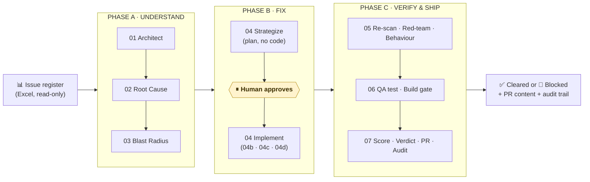

| Phase | Agents | The questions that the phase answers |
|---|---|---|
| 🔵 **A · Understand** | 01 – 03 | What is the structure of this codebase? *Why* is this defect real? *How far* does it reach? |
| 🟢 **B · Fix** | 04 | *How* do we fix it? What is the smallest patch that fixes it? |
| 🟣 **C · Verify & Ship** | 05 – 07 | Does the patch close the issue? Is it safe from a bypass? Is it free of side effects? Is it tested? Does it build? Is it safe to ship? |

---

## 2. How MARS is built

### 2.1 Agents, skills, scripts and the AI runtime

MARS has four kinds of building block. The job of each kind explains almost every rule in this
README.

| Building block | What it is | What it can do |
|---|---|---|
| **Agent** | A Markdown persona file (`NN_name.agent.md`) that an AI runtime follows. It gives the purpose of the agent and the skills that it uses. It also gives its procedure, its hard constraints and the format of its report. | Read briefings and code, analyse them, and write **judgement** into JSON files. Each JSON file must agree with a schema. |
| **Skill** | A self-contained folder (`SKILL.md`, scripts, JSON schemas, templates, catalogs, policies). You can copy each skill to a different repository by itself. | Give the scripts and the rules for one job. |
| **Script** | A deterministic Node.js program in a skill. | **Measure facts**, apply patches in isolation, run builds and tests, validate JSON, and render the final Markdown. Scripts never guess. |
| **AI runtime** | GitHub Copilot Chat (reads `.github/agents`) or Claude Code (reads `.claude/agents`). | Load an agent and run it. |

> **The pipeline does not contain an AI SDK.** The AI runtime writes all judgement, inside schemas.
> There is one exception: an optional fallback in skill `01b`. If the workload is too large for one
> agent session, this fallback can ask an LLM API to write draft descriptions.

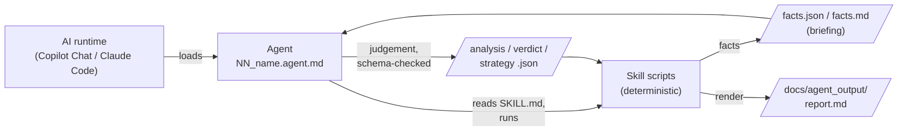

### 2.2 System context

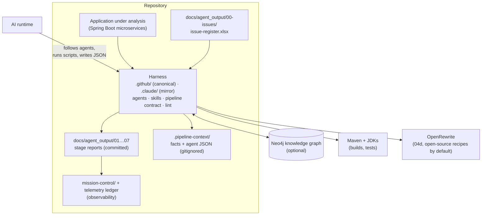

### 2.3 `.github` and `.claude`

- **`.github/` is the canonical harness.** Its agents use front matter in the GitHub Copilot style.
  Its working data is in `.github/.pipeline-context/`.
- **`.claude/` is a mirror of the same agents and skills, with changed paths.** This lets the same
  pipeline run in Claude Code. Its working data is in `.claude/.pipeline-context/`.
- The `.claude` copy of skill `04d-version-migration` is a pointer to the `.github` copy. Only the
  `.github` copy is a full version.
- `pipeline-contract.md` (in both folders) is the only authoritative source for ownership, status
  transitions, routing and release authority. The text of the agents and skills must agree with it.
  `pipeline-lint.js` checks this.
- The telemetry hooks and `record-decision.js` are in `.claude/scripts/` (Section 14).

### 2.4 The 7 agents

| # | Agent | Phase | One-line job | Writes to |
|---|---|---|---|---|
| **01** | `01_architect` | A | Changes source code into a code model, a meaning layer, a graph and architecture reports. It runs one time for each codebase. | `01-architecture/`, Neo4j |
| **02** | `02_root-cause-analyst` | A | Finds the single root cause of each issue. It writes the explanation so that a person who is not an engineer can understand it. | `02-root-cause/` |
| **03** | `03_blast-radius-analyst` | A | Measures how far each defect reaches: services, endpoints, jobs and people. It sets the priority. | `03-blast-radius/` |
| **04** | `04_fix-generator` | B | Stage 1 writes a fix **plan** (never code). After a person approves the plan, Stage 2 writes and verifies the smallest patch. It is the only agent that makes code. | `04-remediation/` |
| **05** | `05_existing-app-test-agent` | C | Three static checks on each patch: re-scan, red-team and behaviour guard. | `05-verify/` |
| **06** | `06_additional-test-execution` | C | Writes one regression test. Scripts then run the test and the full build. The exit codes decide the result. | `06-test-gate/` |
| **07** | `07_audit-and-pr` | C | Uses all the results to calculate a score and give the decision **Cleared** or **Blocked**. It writes the PR content and the audit trail. It opens a PR only on request, and only for a Cleared patch. | `07-ship/` |

### 2.5 The 18 skills

The number of a skill folder is the number of the agent that runs the skill. If an agent has only
one skill, that skill gets only a number (`02`, `03`, `05`). If an agent has more than one skill,
each skill also gets a letter, in run order (`01a`–`01d`, `04a`–`04d`, `06a`/`06b`, `07a`/`07b`).
`00` is shared infrastructure and has no single owner.

| Skill | Run by | Used for | Kind of work |
|---|---|---|---|
| [`00-issue-register`](#5-the-input--skill-00-issue-register) | 02, 03, 04, 05, 07 | Reads the Excel issue register and owns its column contract | Deterministic loader |
| [`01a-code-cartographer`](#skill-01a--code-cartographer) | 01 | Parses each `pom.xml` and `.java` file into `artifacts.json` | Deterministic parser |
| [`01b-context-weaver`](#skill-01b--context-weaver) | 01 | Selects the important code nodes and validates the meaning that the agent writes about them | Selection + validation gate |
| [`01c-graph-forge`](#skill-01c--graph-forge) | 01 | Loads the code model and the meaning layer into Neo4j | Deterministic loader |
| [`01d-blueprint-scribe`](#skill-01d--blueprint-scribe) | 01 | Writes `architecture.md` and `function-reference.md` | Deterministic renderer |
| [`02-root-cause-analyst`](#skill-02--root-cause-analyst) | 02 | Collects facts, checks the diagnosis and renders the report | Collect · author · render |
| [`03-blast-radius-analyst`](#skill-03--blast-radius-analyst) | 03 | Measures reach, checks the narrative and renders a report that puts diagrams first | Collect · author · render |
| [`04a-fix-strategist`](#skill-04a--fix-strategist) | 04 (Stage 1) | Uses the CWE catalog and the remediation context, sets the Fix Type that selects the Stage 2 skill, and renders the plan | Collect · author · render |
| [`04a1-remediation-intelligence`](#skill-04a1--remediation-intelligence) | 04 (Stage 1 fallback 1) | Gets a strategy from a local knowledge base if there is a catalog gap | Ranked retrieval |
| [`04a2-remediation-research`](#skill-04a2--remediation-research) | 04 (Stage 1 fallback 2) | Does structured security research if the catalog **and** the knowledge base both have a gap | Guided investigation |
| [`04b-fixer`](#skill-04b--fixer) | 04 (Stage 2, `CODE_FIX`) | Verifies a code patch in a temporary worktree and renders the fix report | Isolated verification |
| [`04c-dependency-upgrader`](#skill-04c--dependency-upgrader) | 04 (Stage 2, `DEPENDENCY_UPGRADE`) | Verifies a version increase, and also the version that Maven resolves | Isolated verification |
| [`04d-version-migration`](#skill-04d--version-migration) | 04 (Stage 2, `VERSION_MIGRATION`) or direct | Migrates Spring Boot or Java versions in a sandbox and proves that the behaviour stays the same | Sandbox migration engine |
| [`05-verify`](#skill-05--verify) | 05 | Re-scan, red-team and behaviour-guard checks | Collect · author · render ×3 |
| [`06a-qa-runner`](#skill-06a--qa-runner) | 06 (Gate 1) | Runs the one new regression test that the agent writes, and does not simulate it | Deterministic test gate |
| [`06b-build-gatekeeper`](#skill-06b--build-gatekeeper) | 06 (Gate 2) | Runs `mvn verify` and a dependency-tree diff | Deterministic build gate |
| [`07a-merge-arbiter`](#skill-07a--merge-arbiter) | 07 (Part 1) | Calculates a score for the five upstream reports with the policy in `scoring.json` | Deterministic score calculation |
| [`07b-scribe`](#skill-07b--scribe) | 07 (Part 2) | Writes the PR content and the chain-of-custody audit trail | Collect · author · render |

**Dependencies.** Skills `01a`, `01b`, `01c`, `01d`, `02` and `03` need an `npm install`. The other
twelve skills have **zero npm dependencies**. Skill `04a1` can also use a local Python environment to
rank results by meaning. This is optional.

### 2.6 Which agent uses which skill

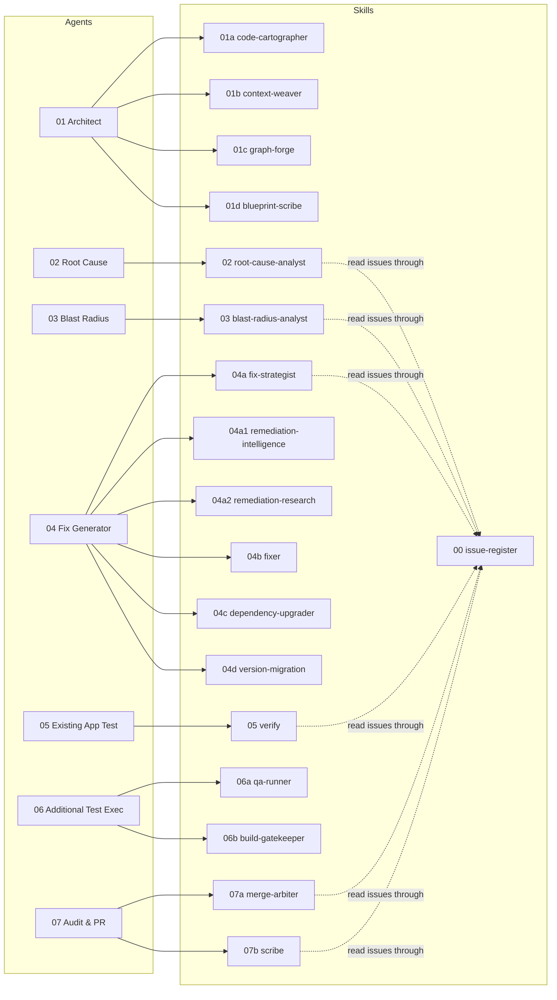

---

## 3. Design rules

### 3.1 Scripts write facts and agents write judgement

This is the most important rule in MARS. Each stage that needs judgement uses the same three steps:

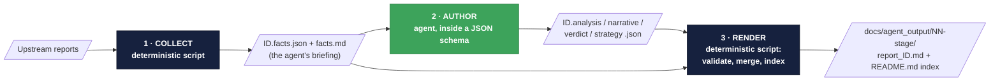

| Step | Who | Can it invent anything? |
|---|---|---|
| 1 · Collect | Node script | No. It only reads and measures. |
| 2 · Author | Agent | Only inside a schema. The renderer stops if a required field is missing. |
| 3 · Render | Node script | No. It merges facts and judgement into Markdown. It also writes the index of the stage again. |

Facts and judgement are in different files. Thus a reader can always tell **what a script measured**
from **what an agent concluded**. Also, an agent cannot write over a measured fact. Each skill also
has a `list-*` workload script. This script calculates the state of each issue only from the files
that exist (`not started` → `facts collected` → `judgement written` → `report written`).

### 3.2 The guarantees

| # | Guarantee | How MARS enforces it |
|---|---|---|
| 1 | **Facts ≠ judgement** | Separate files, agent JSON that a schema checks, and renderers that merge the two |
| 2 | **Analysis never changes the real code** | Scripts apply patches in worktrees of `HEAD` (`git worktree`). A `finally` block removes each worktree. 04d works in a private sandbox with its own git repository. |
| 3 | **No code before a person approves** | Stage 2 refuses each fix plan whose Status cell is not exactly `Approved`. No script writes `Approved`. |
| 4 | **Determinism where it is important** | The QA, build and score results come from real exit codes and a JSON policy. An agent cannot change a `Failed` result to a better result. |
| 5 | **One release authority** | Only a `Cleared` decision from Agent 07 permits a patch to ship. Agent 07 can only override `Cleared → Blocked`. It can never do the opposite. |
| 6 | **A score cannot cancel a hard gate** | `STILL_VULNERABLE`, build `Failed` and a migration that is not `PASS`/`PARTIAL PASS` always block the patch. |
| 7 | **Stages communicate through files** | Stages communicate only through files in `docs/agent_output/`. You can run each stage again by itself. You can also audit and review each stage by itself. |
| 8 | **Knowledge and policy are data** | The CWE catalog, the knowledge base, the rank weights, the score policy, the migration ladder and the rules packs are JSON or Markdown files that you can edit. They are not code. |
| 9 | **Inputs are read-only** | A downstream stage never writes to the issue register or to an upstream report. |
| 10 | **Always keep a record** | A Blocked patch still gets PR content (with a "do not open" banner) and a full audit trail. |
| 11 | **One job for each agent** | No agent writes code and also judges it. No agent finds a root cause and also measures its reach. |

### 3.3 Stages read results from table cells

Downstream scripts use a pattern to find specific cells in the "At a glance" table of a report.
Examples are `| **Status** |`, `| **Verdict** |`, `| **Fix Type** |` and `| **Decision** |`. These
cells tell a stage what the previous stage decided.

**Do not edit a rendered report by hand.** If you change one of these cells, you change the result
of a downstream stage. For an example, see [Section 18](#18-known-problems), item 1.

---

## 4. The end-to-end workflow

### 4.1 Full flow

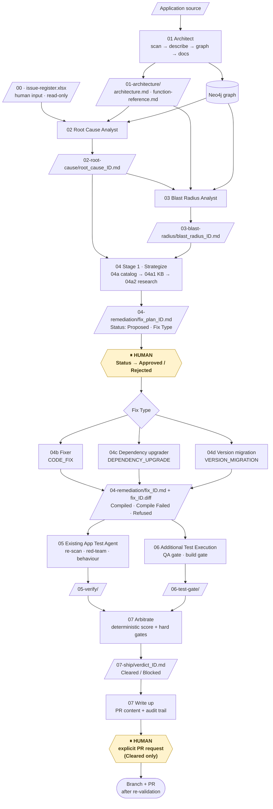

### 4.2 The life cycle of one issue


### 4.3 Who does which step

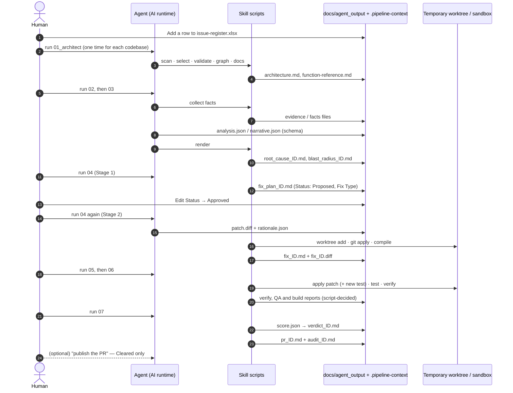

### 4.4 Run order and re-runs

1. **Agent 01 runs one time for each codebase.** It runs again only when the source changes. A
   re-run is incremental.
2. **Agents 02 → 07 run in numeric order.** Each agent processes **each** eligible file that the
   previous stage wrote. If you name one issue (for example `ISSUE-003`), the agent processes only
   that issue.
3. **Agent 04 runs two times.** In the first run, it proposes fix plans. After a person approves
   one or more plans, run Agent 04 again to implement them.
4. **You can run each stage again by itself.** Stages communicate only through files. Thus a re-run
   writes again only the outputs of that stage.
5. **Each skill has a `list-*` script.** This script shows the state of each issue. It does not
   change anything.

---

## 5. The input — skill `00-issue-register`

| | |
|---|---|
| **Used for** | To give the issue register to every agent that uses issues, through one `register` library and one column contract |
| **Run by** | The skills of agents 02, 03, 04 (04a), 05 and 07 (07a, 07b) |
| **Reads** | `docs/agent_output/00-issues/issue-register.xlsx`, one row for each issue |
| **Writes** | Nothing. The people who report issues own the issue register. |
| **Dependencies** | None. The XLSX reader uses Node's own `zlib`. |

**Why a spreadsheet.** Issues come from people and from programs that already use spreadsheets.
Examples are scanner exports, exports from defect trackers and a reviewer's own sheet. A reporter
adds a row and runs the agents again. The reporter does not write Markdown, so Markdown syntax
errors cannot occur.

**What is inside the skill**

| Part | Role |
|---|---|
| `xlsx` reader | A small reader with zero dependencies. It reads only the parts of the format that the issue register needs. |
| `register` library | The column contract, row → issue normalisation and the synthesis of a Markdown body |
| `list-register` script | Prints the issue register exactly as the pipeline parses it (`--issue ID`, `--full` for the body) |

**How the other skills stay unchanged.** Downstream skills take three sections from an issue:
`## Summary` (Blast Radius), `## Observed Behavior` (Root Cause) and `## Detection Notes`
(re-scan). The `register` library **rebuilds a Markdown body** from the long-text columns of the
spreadsheet. It uses those exact headings. Thus every consumer works, and no consumer must know that
the source is Excel.

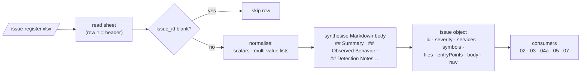

**Column contract.** The header names are the contract. The column order is not important. The
library ignores unknown columns. It skips rows that have no `issue_id`.

| Group | Columns |
|---|---|
| Identity / triage | `issue_id` (required), `title`, `type` (Defect · Vulnerability · Performance · Security), `severity` (Critical · High · Medium · Low — sets the ship threshold), `status`, `reported_on`, `reported_by` |
| Location (multi-value: one value on each line, or values with commas between them) | `affected_services` (module names), `affected_symbols` (`Type.method`), `affected_files`, `entry_points` (`METHOD /path`) |
| Narrative (becomes Markdown headings) | `summary`, `affected_area`, `data_flow`, `observed_behavior`, `expected_behavior`, `steps_to_reproduce`, `impact`, `detection_notes` |

- `affected_symbols` and `affected_files` let Agent 02 find the defect in the graph.
- Every `` `backticked` `` token in `detection_notes` becomes a **grep signature**. The re-scan of
  Agent 05 checks this signature against the patched code.
- **To add an issue:**
  1. Add a row at the bottom of the issue register.
  2. Run `list-register` to make sure that the row parses.
  3. Run the pipeline again from Agent 02.

---

## 6. Phase A · Understand

### 6.1 Agent 01 — Architect

**Purpose.** Agent 01 changes the application source into the shared knowledge that all later
stages use. It makes a parsed code model, a meaning layer, a Neo4j knowledge graph and two
architecture reports. **It runs one time for each codebase.** After the source changes, it runs
again incrementally. It is the only agent that writes to the graph. Thus its output sets the limit
for the accuracy of every later agent.

| | |
|---|---|
| **Inputs** | Application source and every `pom.xml` |
| **Outputs** | `artifacts.json`, `context/descriptions.json`, the Neo4j graph, `architecture.md`, `function-reference.md` |
| **Skills, in order** | `01a` → `01b` → `01c` → `01d` |
| **Argument** | Nothing or `full` for the whole pipeline, or one module as the focus |

**The distinction that controls all of its work.**

- **Facts** come from the parser, for example "method A calls method B". A fact has only one
  interpretation.
- **Judgement** (the meaning layer) is the interpretation of those facts by the agent. For example:
  "this call blocks on another service, and if that service is down the caller gets a 500".
  Downstream agents need facts and judgement. They must always know which is which.

MARS keeps facts and judgement apart in its structure. The meaning layer is in its own file. Each
entry has an author and a confidence. Graph Forge loads the meaning layer into a separate `ctx*`
property namespace in Neo4j.

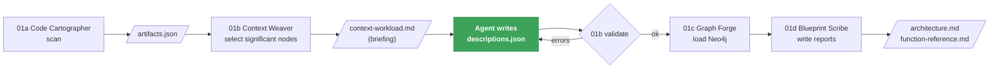

**Agent workflow, step by step**

1. **Scan** with `01a`. If the source changed after the last scan, scan again.
2. **Select** with `01b`. This step writes the briefing. If a node already has a description for
   unchanged code, the briefing does not show that node again.
3. **Describe.** The agent reads the briefing and writes `descriptions.json`. In this step, the
   judgement of the agent is the product. You can divide a large workload into several passes,
   because the file merges by node id. You can also give a large workload to the optional LLM
   batch generator.
4. **Validate** with `01b`. Correct every error. An invented node id or an overconfident claim can
   spread into every downstream agent. No downstream agent can find it.
5. **Load** the graph with `01c`.
6. **Write** the architecture reports with `01d`.
7. **Report** only the counts: files scanned, nodes described, graph nodes and relationships
   loaded, and all nodes that are not described or are stale.

**What the agent writes for each node, and who uses it**

| Field | Meaning | Main consumer |
|---|---|---|
| `summary` | What it is and what it is for, in domain language. If the summary is still true after you rename the class to `Foo`, it gives no information. | Everyone |
| `failureModes` | How it can fail in practice and what the caller sees. **The field with the highest value.** | Root Cause |
| `invariants` | What must be true for it to be correct. A violated invariant is usually the defect. | Root Cause |
| `sideEffects` | Writes, outbound calls, published events, mutated state. An empty list means that the code is pure. | Blast Radius |
| `testHints` | The request to replay, the fixture, the boundary to assert | QA |
| `criticality` | The damage that a defect here can cause, not code complexity | Blast Radius |
| `crossCutting` | Facts that belong to no single node: a shared datastore, a service dependency with no Java call edge | Everyone |
| `confidence`, `openQuestions`, `evidence` | How sure, what is unknown, and where each claim came from (`File.java:42`) | Everyone |

**Rules.**

- Do not invent behaviour that the code does not show.
- If the intent is not clear, say so (`confidence: low` plus an open question).
- Give the source of each claim in `evidence`.
- Do not add filler text. Omit the content instead.
- Copy the `kind`, `id` and `fingerprint` of each node exactly.
- Do not load a graph that has validation errors.
- Do not print credentials or full artifacts into the chat.

---

#### Skill 01a — Code Cartographer

| | |
|---|---|
| **Used for** | To change source into structured data that you can query. This data is the raw material for every other Phase A skill. |
| **Reads** | Every `pom.xml` and every `src/main/java/**/*.java` |
| **Writes** | `.pipeline-context/artifacts.json` (gitignored, written again at each run) |
| **Technology** | A real syntax tree through **tree-sitter** (Java grammar, WASM), not regular expressions |

**What it extracts**

| From | It records |
|---|---|
| `pom.xml` | Each Maven module: `groupId`, `artifactId`, `version`, packaging, dependencies |
| Each Java type | Package, kind (class / interface / enum / record), line range, annotations with arguments, `extends` / `implements`, fields (name, type, annotations) |
| Each method | Name, return type, parameters, annotations, REST mapping, **call sites** (for the call graph), line range, and the **exact source text** (for the function reference) |

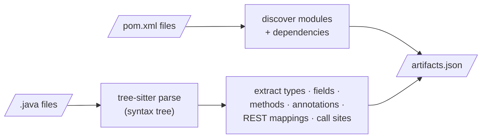

The skill uses a real parser. Thus it records nested generics, annotations with arguments,
inheritance and overloaded methods correctly. Currently, the skill parses only Java. Another
language needs another tree-sitter grammar in the same skill.

---

#### Skill 01b — Context Weaver

| | |
|---|---|
| **Used for** | To add the meaning layer. The skill chooses the nodes that need a description. It writes a briefing with real facts for the agent. It validates what the agent writes and gives it back to the downstream agents. |
| **Reads** | `artifacts.json`, and the `descriptions.json` that is already there |
| **Writes** | `context/context-workload.{json,md}` (the briefing). It validates `context/descriptions.json`, which the agent writes. `descriptions.json` is the **one tracked file** in `.pipeline-context`, because it is expensive to make again. |

`01a` answers **what exists**. This skill answers **what it means**.

**What is inside the skill**

| Part | Role |
|---|---|
| Workload selector | Gives a score to every node. Lists only the significant nodes that are new or stale. |
| Validator | The gate: schema shape, no phantom node ids, no duplicates, freshness. `--strict` changes stale warnings into errors. |
| Lookup script | The read side. It resolves a symbol, module or search term. It returns stored descriptions with labels for confidence and staleness. It works without Neo4j. |
| Batch generator (optional) | For a workload that is too large for one agent. It sends the same briefing to Anthropic, OpenAI or Google in batches, pinned to the schema. A failed run never changes the file. |
| Schema + worked example | `descriptions.schema.json`, `descriptions.example.json` |

**How the selector chooses nodes.** The selector uses scores, not a list of rules. Thus the
threshold is the one value that controls the selection.

| Node kind | Selected when |
|---|---|
| `Module` | Always. Service boundaries give the descriptions with the highest value at the lowest cost. |
| `Package` | It holds 2 or more types |
| `Type` | Score ≥ 3: Spring stereotype (+3), exposes endpoints (+3), interface with an implementation (+3), extends a framework base (+3), scheduled job (+2), holds an HTTP client (+2), fan-in ≥ 2 (+2), injects in-repo collaborators (+1) |
| `Method` | Score ≥ 3 and not a trivial accessor: REST handler (+4), `@Scheduled` (+4), ≥ 2 callers (+3), ≥ 2 callees (+2), outbound HTTP call (+2), interface contract (+2), > 15 lines (+1) |
| `Endpoint` | Always. It is the external contract, where every investigation starts. |
| `ExternalType` | Always. Framework bases like `MongoRepository` add methods that the parser never sees. |

On the sample application, the selector selects about 77 of about 108 nodes. It does not select
DTOs and enums.

**Staleness — how the descriptions stay correct.** Each description has a **fingerprint** of the
code that it describes. For a method, the fingerprint is its normalised source. The selector
calculates the fingerprint again to find what to describe again. Graph Forge also calculates it
again at load time. It marks drifted nodes `ctxStale = true`. Consumers ignore stale entries.

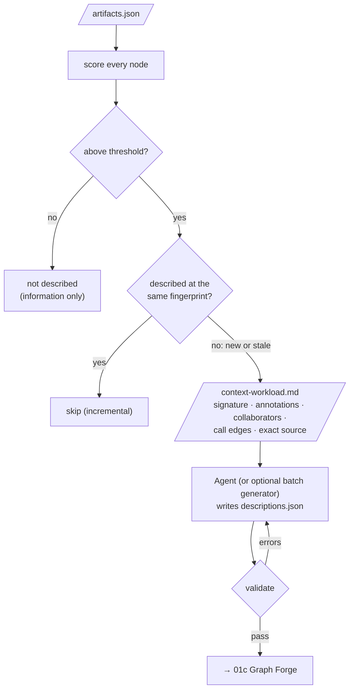

---

#### Skill 01c — Graph Forge

| | |
|---|---|
| **Used for** | To load the code model into Neo4j and attach the meaning layer to the same nodes. Then Cypher queries can answer architecture questions. |
| **Reads** | `artifacts.json`, optional `descriptions.json`, Neo4j connection details from the skill's own `.env` |
| **Writes** | The Neo4j graph: uniqueness constraints first, then `MERGE` of nodes and relationships. Thus a second run updates the graph and does not make duplicates. |

**Graph model**

| Node | Key | Notes |
|---|---|---|
| `Module` | `name` | One for each Maven module |
| `Package` | `name` | Java package |
| `Type` | fully qualified name | class / interface / enum / record |
| `Method` | `Type#name(paramTypes)` | Keeps overloads separate |
| `Endpoint` | `METHOD path` | From the mapping annotations plus the class-level base path |
| `MavenDependency` | `groupId:artifactId` | Third-party libraries |
| `ExternalType` | `name` | A base class or interface that the repository does not define |
| `ContextNote` | topic | A cross-cutting fact from the meaning layer |

| Relationship | Meaning |
|---|---|
| `Module -[:CONTAINS]-> Package/Type`, `Package -[:CONTAINS]-> Type` | Structure |
| `Module -[:DEPENDS_ON]-> MavenDependency` | `pom.xml` dependency |
| `Type -[:EXTENDS / IMPLEMENTS]-> Type/ExternalType` | Inheritance |
| `Type -[:HAS_METHOD]-> Method` | Ownership |
| `Type -[:EXPOSES]-> Endpoint` | REST surface |
| `Type -[:USES]-> Type` | The type of a field refers to another type (best effort) |
| `Method -[:CALLS]-> Method` | Call graph (best effort, matched by method name) |
| `ContextNote -[:ABOUT]-> Module/Type` | A cross-cutting fact, attached to each node that it is about |

**The meaning layer (`ctx*` properties).** The properties are `ctxSummary`, `ctxRole`,
`ctxCriticality`, `ctxResponsibilities`, `ctxInvariants`, `ctxFailureModes`, `ctxSideEffects`,
`ctxDataTouched`, `ctxUpstream` / `ctxDownstream`, `ctxTestHints`, `ctxOpenQuestions`,
`ctxEvidence`, `ctxAuthor`, `ctxConfidence`, `ctxFingerprint` and `ctxStale`. There is also a
full-text index, `context_search`. With this index, MARS can match a reported symptom to the node
whose failure modes describe it.

- The `ctx` prefix is important. Judgement can never overwrite parser output. Also, nobody can
  mistake judgement for parser output.
- Descriptions only annotate nodes that the parser found. For descriptions, the loader uses
  `MATCH`, never `MERGE`. Thus the loader skips an unknown id and does not invent a node.
- `descriptions.json` is the source of truth. The graph is a loaded copy.

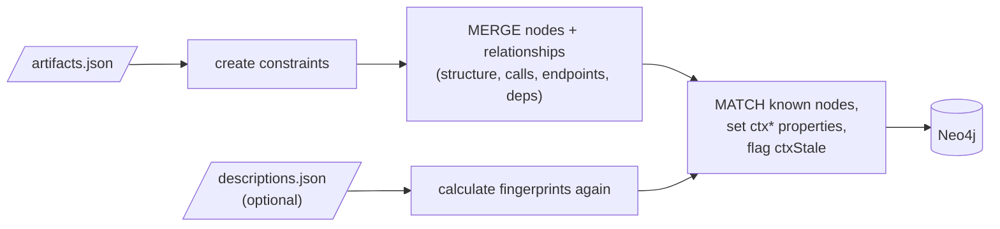

---

#### Skill 01d — Blueprint Scribe

| | |
|---|---|
| **Used for** | To write the two architecture reports for human readers. Every later agent reads these reports. |
| **Reads** | `artifacts.json`, plus live Neo4j counts if Neo4j is available. If Neo4j is not available, the skill uses only static data. |
| **Writes** | `docs/agent_output/01-architecture/architecture.md` and `function-reference.md` |

| Report | Contents |
|---|---|
| `architecture.md` (overview) | Module table, Mermaid service map, layered type breakdown for each module (controller, service, repository, entity, DTO, configuration, exception), REST API surface, external frameworks, live graph snapshot, "Ideas & Observations" |
| `function-reference.md` (deep dive) | One entry for each method: exact signature, file and line range, annotations, REST mapping, resolved **Calls** / **Called by** (calculated from `artifacts.json`, Neo4j not necessary), and the exact method source |

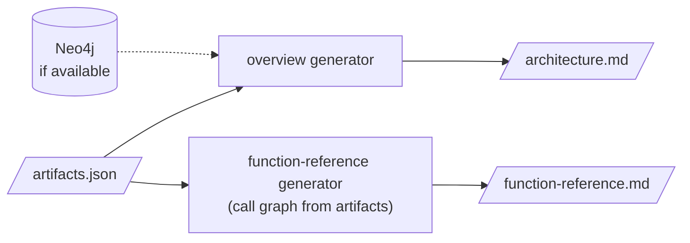

---

### 6.2 Agent 02 — Root Cause Analyst

**Purpose.** For each row in the issue register, Agent 02 finds **the one root cause** and cites
the facts. It explains the cause in words that a non-engineer can understand. It only diagnoses. It
does not map the spread (Agent 03), and it does not make a patch (Agent 04). It never writes, edits
or invents an issue.

| | |
|---|---|
| **Inputs (all four, for every issue)** | 1. The issue row · 2. `architecture.md` · 3. `function-reference.md` · 4. The Neo4j graph |
| **Output** | `docs/agent_output/02-root-cause/root_cause_ID.md`, one for each issue |
| **Skills** | `02-root-cause-analyst` (and `00-issue-register` for the rows) |
| **Argument** | Nothing (every issue) or one issue id |

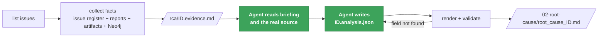

**Agent workflow**

1. **Find the workload.** Analyse exactly the listed issues, no more and no fewer.
2. **Collect facts for all of the issues.** The script processes each issue independently. A
   failure on one issue does not stop the other issues.
3. **For each issue, read the briefing, then the code.** Separate the **defect site** from methods
   that are only on the path to it. Record each endpoint, scheduled job, module and cross-service
   consumer in the affected area. Also record all items that the facts do *not* show.
4. **For each issue, write the analysis.** Give one root cause with cited facts. Give a causal
   chain from trigger to symptom. Make the impact agree with the measured area. Give a fix that
   removes the cause, and give verification steps. Write a plain-language summary and the expected
   correct flow.
5. **Render** the report. Correct each validation error, then render again.
6. **Confirm coverage.** Every issue must show `report written`.

**Rules.**

- Give one root cause for each issue. A second independent defect is a second issue.
- Give a cause, not a symptom. Write "the handler calls itself instead of the injected service",
  not "a StackOverflowError is thrown".
- Do not invent classes, methods, edges or config.
- Give an honest `confidence`. Put points that you cannot prove in `open_questions`.
- Keep issues independent.
- Do not map the spread.

#### Skill 02 — Root Cause Analyst

| | |
|---|---|
| **Used for** | Fact collection, the analysis schema and the report renderer for Agent 02 |
| **Writes** | `.pipeline-context/rca/ID.evidence.{json,md}`. It validates `ID.analysis.json` and renders `root_cause_ID.md`. |

**What is inside the skill**

| Part | Role |
|---|---|
| `list-issues` | The issue register and the state of each issue: `not started` → `evidence collected` → `analysis written` → `report written` |
| `collect-evidence` | The fact collector (below). Flags: `--depth 1-8` (default 4), `--no-graph` |
| `render-root-cause` | Validates the analysis, merges it with the facts, writes the report and lists all items that are not complete |
| `analysis.schema.json` + example | The judgement contract |

**What the fact collector does**

- It resolves `affected_symbols` against `artifacts.json`. It makes a static call graph that has
  interface → implementation edges.
- It follows callers and callees in the two directions.
- It **flags self-recursion**. It also flags **"missing delegation"**: an injected collaborator has
  a method with the same name, but the focus method never calls that method.
- It collects the affected area: modules, endpoints, `@Scheduled` jobs, and cross-service HTTP
  clients that no Java call edge captures.
- It queries Neo4j for callers, callees, the owner type, dependants and Maven dependencies. If it
  cannot reach Neo4j, it says so and uses the static graph. The report records this fallback.
- It copies the related rows from `architecture.md` and the related entries from
  `function-reference.md`.

**Analysis contract.** Required: `summary`, `root_cause` (statement, explanation, defect location),
`causal_chain` (≥ 2 steps), `impact`, `recommended_fix`, `verification`. Optional: `confidence`,
`plain_summary` (the headline, no class names), `expected_flow` (2–5 short correct steps),
`contributing_factors`, `prevention`, `open_questions`.

**Report layout.** The person who must decide, not only the engineer, reads the report from top to
bottom. The sections are, in this sequence: plain-language headline → *At a glance* table → what was
reported → what should happen vs what happens (green/red diagram) → how it fails, step by step (flow
that ends in red) → where the defect is (call-graph diagram, method table, source in a collapsed
block) → what it means → why it happened → how to fix it → how to check the fix → how to stop it
recurring → open questions → appendix (inputs used and Cypher run).

---

### 6.3 Agent 03 — Blast Radius Analyst

**Purpose.** Agent 02 finds **why** a defect exists. Agent 03 finds **what else breaks because of
it**: services, endpoints, scheduled jobs, cross-service calls and shared infrastructure. It uses
words and diagrams that a non-engineer can understand. It gives a priority from real reachability,
not from theoretical severity.

| | |
|---|---|
| **Inputs (all five)** | Root cause reports (the workload) · issue rows · `architecture.md` · `function-reference.md` · Neo4j |
| **Output** | `docs/agent_output/03-blast-radius/blast_radius_ID.md`, one for each root cause |
| **Skill** | `03-blast-radius-analyst` |

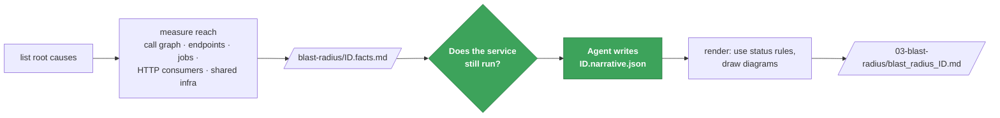

**Agent workflow**

1. **Find the workload.** If there are no root cause reports, stop. Tell the user that Agent 02
   must run first.
2. **Measure the reach** of each defect independently.
3. **For each defect, read the facts, then the root cause report.** First, answer the decisive
   question. Does the service still **run** with this defect? Or does it fail to build, to start or
   to continue to run? The answer decides if one endpoint is down or the whole service is down.
4. **For each defect, write the narrative.** Give the scope and the ripple, one ring at a time. Say
   who feels the effect. Say what is explicitly **not** affected.
5. **Render** the report. Then make sure that every row shows `report written`.

**Rules.**

- Do not diagnose again. Do not contradict a root cause report. If you disagree, tell the user.
- Do not write the fix again. Give a link to it.
- Do not name a service, endpoint or job that the facts do not list. Put wider suspicions in
  `open_questions`.
- Do not confuse **broken** (the request fails) with **degraded** (the request succeeds, but with
  incomplete, stale or slow results).
- Do not skip `not_affected`.

#### Skill 03 — Blast Radius Analyst

| | |
|---|---|
| **Used for** | To measure the reach so that nobody can state it as too large or too small. Then to render a diagram-led report. |
| **Writes** | `.pipeline-context/blast-radius/ID.facts.{json,md}`. It validates `ID.narrative.json` and renders the report. |

**What is inside the skill**

| Part | Role |
|---|---|
| `list-root-causes` | Workload and state: `not started` → `reach measured` → `narrative written` → `report written` |
| `collect-impact` | Finds defect sites. Follows callers back to every endpoint and `@Scheduled` job. Makes an inventory of each module. Finds confirmed cross-service HTTP consumers. Finds the platform topology (service registry, config server, shared datastore). Cross-checks with Neo4j. Flags: `--depth 1-10` (default 6), `--no-graph`. |
| `render-blast-radius` | Validates, uses the status rules, draws three diagrams, writes the report |
| `narrative.schema.json` + example | The judgement contract |

The skill intentionally has its own code model and does not import the code model of Agent 02.
Thus neither skill breaks if the other skill moves. The briefing gives **two endpoint counts**. The
first count is the endpoints whose handler reaches the defect. The second count is every endpoint
that the broken service hosts. Thus the agent intentionally chooses the correct count.

**Status rules (the script uses them)**

| Status | Rule |
|---|---|
| 🔴 **Broken** | The module is in the `affected_services` of the issue, or it is a defect-site module |
| 🟠 **Degraded** | The module holds a **confirmed** HTTP consumer of a broken module |
| 🟡 **At risk** | Only for `multi-service` scope: the module shares the datastore with a broken module |
| 🟢 **Unaffected** | All other modules |

Endpoints follow the scope. For `endpoint` scope, only the handlers that reach the defect are
Broken. For `service` and `multi-service` scope, every endpoint of a broken module is Broken.

**Narrative contract.** Required: `scope` (endpoint · service · multi-service), `headline`,
`what_is_broken`, `ripple`, `user_impact` (who, what they see, status), `priority` (for example
"P1 — reason"). Optional: `confidence`, `failure_note`, `not_affected`, `containment` (what to
disable, monitor or communicate now — not the fix), `if_unfixed`, `open_questions`.

**Report layout.** The sections are, in this sequence: At a glance (priority, severity, services
broken / degraded, endpoints down, jobs hit) → what is broken → how far it spreads (ring diagram) →
which services (colour-coded map + table) → which endpoints → what happens on a single request →
who feels it → what is NOT affected → containment and priority → how it was measured.

---

## 7. Phase B · Fix — Agent 04 Fix Generator

**Purpose.** Agent 04 changes a diagnosed defect into a verified patch. It does this in **two stages
with strict gates**, and a person approves the work between the two stages. Agent 04 is the only
agent that makes code. It never edits the real code.

| Stage | Question | Output | Skills |
|---|---|---|---|
| **Stage 1 — Strategize** | *How* do we fix this? | `fix_plan_ID.md`, `Status: Proposed`, **never a patch** | `04a` → fallbacks `04a1` → `04a2` |
| ⏸ **Human approval** | Is this the correct approach? | A person edits the Status cell to `Approved` or `Rejected` | — |
| **Stage 2 — Implement** | What is the smallest patch that does the fix? | `fix_ID.md` + `fix_ID.diff` | `04b` · `04c` · `04d`, selected by **Fix Type** |

| | |
|---|---|
| **Inputs** | Root cause reports (the Stage 1 workload) · blast radius reports, if they exist · issue rows · the CWE catalog · the fix plans (Stage 2 reads their Status) · the current source of each affected file |
| **Read-only to it** | `00-issues/`, `02-root-cause/` and `03-blast-radius/`. In Stage 2, also the fix plan files. |


**Key rules for the agent**

- **No code in Stage 1.** An optional `illustrative_sketch` must show clearly that it is only an
  illustration.
- **One CWE for each fix plan**, with a citation from the catalog. The fallbacks run in this order:
  `04a` → `04a1` → `04a2`. The agent never skips a fallback. A fallback never runs when the catalog
  has any detected CWE.
- **Do not set a fix plan to `Approved` or `Rejected`.** Do not render an approved or rejected fix
  plan again to reset it to `Proposed`.
- **Refuse each Stage 2 fix plan that is not exactly `Approved`.** Refuse one time, in clear words,
  and do not negotiate. "A strongly-worded request is not approval."
- **Do not edit the real source.** Do not route by keyword. Route by the Fix Type of the fix plan.
  Do not run `apply-migration --to-project` as part of Stage 2.
- **`Compiled` is not a signal to ship.** Agents 05 → 06 → 07 must still run.

---

## 8. Agent 04, Stage 1 — Strategize

Stage 1 gets a strategy from three levels of knowledge. It stops at the first level that has an
answer.

| Level | Skill | Knowledge source | Meaning | Confidence |
|---|---|---|---|---|
| 1 | `04a-fix-strategist` | Curated CWE catalog | We already know the remediation pattern | The agent sets it honestly |
| 2 | `04a1-remediation-intelligence` | Local knowledge base of historical fixes | We have related knowledge from past fixes | Always **Low** |
| 3 | `04a2-remediation-research` | Structured security investigation | No known remediation. Make a new strategy. | Always **Low** |

All three skills write the **same** `ID.strategy.json`. The same renderer changes it into a
`Status: Proposed` fix plan. Stage 2 does not need to know which level made the strategy.

#### Skill 04a — Fix Strategist

| | |
|---|---|
| **Used for** | Decide *how* to fix a defect, before any code exists. The skill matches the defect to a CWE-aligned remediation pattern. It also classifies the type of change (Fix Type). |
| **Reads** | Root cause report · blast radius report (optional) · issue row · current source of each affected file · `catalog/cwe-patterns.json` |
| **Writes** | `.pipeline-context/fix-strategy/ID.context.{json,md}`. It validates `ID.strategy.json`. It renders `docs/agent_output/04-remediation/fix_plan_ID.md` and the `README.md` index of the folder. |

**What is inside the skill**

| Part | Role |
|---|---|
| `list-remediation-workload` | Lists each root cause report with the state and the Status of its fix plan. `--pending` shows the fix plans that a person did not approve or reject yet. |
| `collect-remediation-context` | Reads the diagnosis, the blast radius, the issue row and the affected source. Finds each `CWE-nnn` mention and tags it **in catalog** or **catalog gap**. Stops with a clear error message if a root cause has no issue row. |
| `render-fix-plan` | Validates the strategy, classifies the Fix Type and renders the fix plan. Keeps an approval or rejection that a person already made. |
| `routing` library | Classifies the **Fix Type** from the strategy *and* the real `pom.xml` |
| `catalog/cwe-patterns.json` | The curated knowledge (below) |
| `strategy.schema.json` + example | The contract for the judgement |

**The CWE catalog (11 entries).** Each entry has a title, an OWASP category, `applicable_when`,
`canonical_approach`, `anti_patterns` and `references`.

| CWE | Pattern | OWASP 2021 |
|---|---|---|
| CWE-943 | NoSQL / data-query injection | A03 Injection |
| CWE-89 | SQL injection | A03 Injection |
| CWE-79 | Cross-site scripting | A03 Injection |
| CWE-306 | Missing authentication for a critical function | A01 Broken Access Control |
| CWE-284 | Improper access control | A01 Broken Access Control |
| CWE-200 | Exposure of sensitive information | A01 Broken Access Control |
| CWE-532 | Sensitive information in log files | A09 Logging & Monitoring Failures |
| CWE-770 | Resource allocation without limits | A04 Insecure Design |
| CWE-400 | Uncontrolled resource consumption | A04 Insecure Design |
| CWE-798 | Hard-coded credentials | A07 Identification & Authentication Failures |
| CWE-1104 | Unmaintained third-party components | A06 Vulnerable & Outdated Components |

**Strategy contract.** The required fields are `cwe`, `plain_summary`, `approach`,
`catalog_reference`, `affected_files` and `verification_plan`. Each item in `affected_files` has a
prose `planned_change` and no patch. The `verification_plan` has steps that Stage 2 can do. The
optional fields are `confidence`, `alternatives_considered` (with the reason for each rejection),
`risk_notes`, `illustrative_sketch` and `open_questions`. A strategy can also have **a maximum of
one** of `dependency_upgrade` or `version_migration`. A strategy from a fallback also has
`derived_pattern` provenance.

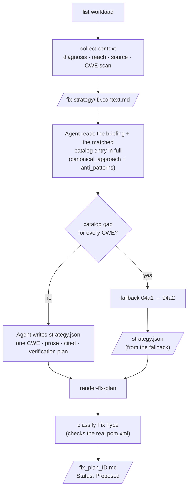

**Fix plan layout.** The fix plan has these sections in this order:

1. Plain-language headline
2. "At a glance" (Status, Fix Type, CWE + OWASP, files, confidence, links)
3. Remediation approach
4. Alternatives considered
5. Planned changes for each file (no patch)
6. Risks to watch
7. How the fix must be verified
8. **Routing decision** (the facts for the Fix Type)
9. Approval instructions
10. Appendix of inputs

A migration fix plan also has a hidden migration request that a machine can read. Skill `04d` reads
this request.

---

#### Skill 04a1 — Remediation Intelligence

| | |
|---|---|
| **Used for** | Fallback 1. If **every** detected CWE is not in the catalog, the skill makes a strategy from a local knowledge base. The strategy has a basis in the KB, has citations and has Low confidence. The skill does not leave an empty fix plan. |
| **Runs when** | All detected CWEs are catalog gaps. It does not run when the catalog has any detected CWE. It does not run when no CWE was detected. |
| **Reads** | The `04a` briefing · the main catalog (through the library of `04a`, so "gap" has the same meaning) · `knowledge/remediation-kb.json` + `knowledge/refs/` · `ranking-weights.json` · optional local embedding model |
| **Writes** | The same `ID.strategy.json`, with `confidence: Low`, `catalog_reference.title: null`, a "Derived by the 04a1 fallback" note and a `derived_pattern` provenance block |
| **Never** | Invents a pattern, uses the network or the memory of the AI runtime, writes a patch or approves |

**The knowledge base today**

| CWE | Topic | Historical fixes |
|---|---|---|
| CWE-22 | Path traversal | 2 |
| CWE-918 | Server-side request forgery | 1 |
| CWE-359 | Exposure of private personal information | 1 |
| CWE-862 | Missing authorization | 1 |

**How 04a1 ranks the fixes.** If a gap CWE has more than one historical fix, 04a1 gives a score to
each fix. The score uses a maximum of three independent signals. The weights in
`ranking-weights.json` combine the signals:

| Signal | What it measures | Weight |
|---|---|---|
| `keyword_score` | Exact keyword matches (weight 1.0) and synonym matches (weight 0.5) in the root cause text, normalised | 0.3 |
| `tfidf_score` | TF-IDF cosine similarity across all fixes in the KB. Rare, specific words have more weight than common words. | 0.3 |
| `embedding_score` | Sentence-embedding similarity from a local `all-MiniLM-L6-v2` model. It is the only signal that finds paraphrases that nobody expected. | 0.4 (optional) |

If the local model is not installed, 04a1 records `embedding_score` as `null`. It then renormalises
the other two weights. The fix plan shows this change. For a given
model, the rank order is deterministic. 04a1 writes the full score breakdown of each candidate into
the provenance of the fix plan.

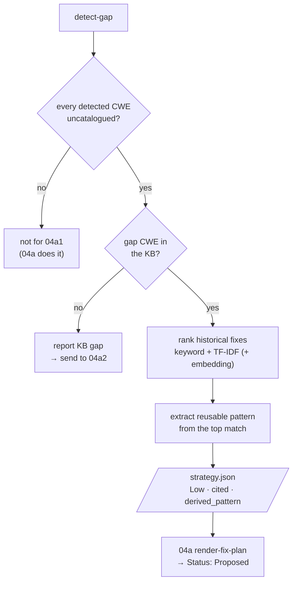

**Self-test.** The self-test uses a bundled path-traversal (CWE-22) sample. It also uses a
paraphrased version that has **zero** exact keywords in common with the KB. The self-test runs the
two samples through the full fallback and renders them in a temporary directory. It makes sure that
each fix plan is Proposed, has Low confidence and has provenance. It also makes sure that the score
breakdown is in the correct order.

**Promotion path.** If a KB pattern proves that it works, promote it into the main catalog. After
the promotion, that CWE is not a gap. The goal is to make the gaps in the catalog smaller. The goal
is not to keep a second catalog for all time.

---

#### Skill 04a2 — Remediation Research

| | |
|---|---|
| **Used for** | Fallback 2, the deepest level. If a CWE is in **neither** the catalog **nor** the knowledge base, the skill does a structured security investigation that uses evidence. It makes a novel remediation strategy for a person to review. |
| **Runs when** | `04a1` reports a KB gap |
| **Reads** | Root cause report · blast radius report (if one exists) · issue row and vulnerable source · catalog + KB (to confirm the double gap) |
| **Writes** | `.pipeline-context/research/ID.analysis.json` (agent). Then a base-contract `ID.strategy.json` with `remediation_source: 04a2-remediation-research`, `confidence: Low`, `derived_pattern.type: novel-research`, a `research` payload and `promotion_candidate: true`. Also a separate promotion-candidate file. |
| **Never** | Invents a remediation without analysis. Fabricates a citation (it has no web access, so it labels a source *internally derived*). Writes a patch, approves its own fix plan or increases its own confidence. |

**The 13-step research method** (the agent writes steps 3–12):

```mermaid
flowchart LR
    S1["1 Confirm<br/>the gap"] --> S2["2 Collect context<br/>(Agents 1–3)"] --> S3["3 Understand the<br/>vulnerability"] --> S4["4 Validate root cause<br/>facts · conclusions ·<br/>hypotheses"]
    S4 --> S5["5 Threat<br/>model"] --> S6["6 Security objective<br/>(the invariant)"] --> S7["7 Research<br/>approaches"] --> S8["8 Make<br/>≥ 2 candidates"]
    S8 --> S9["9 Evaluate<br/>them"] --> S10["10 Select the<br/>smallest safe one"] --> S11["11 Define<br/>validation tests"] --> S12["12 Attach evidence<br/>+ provenance"] --> S13["13 Write strategy.json<br/>(Low, Proposed)"]
```

Each **candidate** records its approach, security mechanism, affected layer, advantages,
limitations, bypass risks, behavioural risks, implementation complexity and validation requirements.

**If the evidence is not enough** (`research_status: insufficient_evidence`), 04a2 does **not** stop
at that point. It also does **not** invent a confident fix. It makes a **Proposed evidence-gap
plan**. This fix plan gives what is known, the evidence that is not available and a conservative default.
It has a clear mark that tells a person to review it.

| | 04a | 04a1 | 04a2 |
|---|---|---|---|
| Knowledge | Catalog | KB / historical fixes | Novel investigation |
| Confidence | Established | Derived (Low) | Low, always |
| Citations | Catalog entry | KB references | Internal judgement, none fabricated |
| Multiple candidates | No | No | Yes (≥ 2) |
| No confident fix | — | Reports KB gap | Evidence-gap plan → person |

**Path into the KB.** A 04a2 remediation can go into the KB after these events: a person approves
it, and MARS implements, verifies and tests it. The decision must also be **Cleared**. 04a2 only
writes the promotion candidate. A person promotes it. After that, `04a1` handles similar issues.

**Self-test.** It runs the full path on two bundled samples in a temporary directory: a double-gap
sample (CWE-502) and an evidence-gap sample. It makes sure of these results: 04a2 ran,
Low confidence, both gaps, ≥ 2 candidates, `Status: Proposed`, no patch, no automatic approval and
honest provenance.

---

## 9. Human approval and Fix Type

### 9.1 The approval checkpoint

- A person opens `fix_plan_ID.md` and changes the **Status** cell from `Proposed` to `Approved` or
  `Rejected`. The comparison is an exact string match.
- An optional **Approved by** cell records the person who approved the fix plan.
- **No part of the pipeline writes `Approved`.** If a script renders the fix plan again, it keeps
  the approval or rejection that the person already made. It adds a note and does not reset the Status.
- `record-decision.js` gives a second way to make the same edit. It records the person who made the
  edit and adds the edit to a hash chain (Section 14).

This checkpoint is the cheapest point to change the approach. At this point, nobody wrote code.

### 9.2 Fix Type selects the Stage 2 skill

Each rendered fix plan has one **Fix Type**. The `04a` routing library classifies the Fix Type from
the strategy **and** the build descriptor on disk. It never classifies the Fix Type from a keyword.

| Fix Type | Stage 2 skill | When | Evidence required |
|---|---|---|---|
| `CODE_FIX` | `04b-fixer` | A code change for the diagnosed defect | — |
| `DEPENDENCY_UPGRADE` | `04c-dependency-upgrader` | One library coordinate goes up to a fixed version (CWE-1104) | It must **not** move a platform parent or BOM across a major generation. The routing library refuses that move with the message "plan it as `version_migration`". |
| `VERSION_MIGRATION` | `04d-version-migration` | The platform parent or BOM crosses a **major generation**, the Java level changes, or both | The routing library checks two facts. `pom.xml` on disk declares the platform at exactly `source_version`. The jump changes the generation, the Java level or both. |

MARS **refuses a contradiction**. It does not secretly route the fix plan to a different skill.
The presence of a dependency alone is never a reason to migrate. The **Routing decision**
section of the fix plan lists the facts. MARS routes fix plans that it rendered before Fix Type
existed by CWE (`CWE-1104` → 04c, all other CWEs → 04b).

```mermaid
flowchart TD
    ST[/"strategy.json"/] --> VM{"version_migration<br/>recorded?"}
    VM -->|yes| CK1{"pom.xml declares source_version<br/>AND major or Java jump?"}
    CK1 -->|yes| T3["VERSION_MIGRATION → 04d"]
    CK1 -->|no| REF1["refuse fix plan"]
    VM -->|no| DU{"dependency_upgrade<br/>recorded?"}
    DU -->|yes| CK2{"platform parent/BOM<br/>across a major?"}
    CK2 -->|yes| REF2["refuse: plan it as<br/>version_migration"]
    CK2 -->|no| T2["DEPENDENCY_UPGRADE → 04c"]
    DU -->|no| T1["CODE_FIX → 04b"]
```

All three Stage 2 skills write the **same hand-off**: `fix_ID.md` + `fix_ID.diff`, with the Status
`Compiled`, `Compile Failed` or `Refused`. Thus Agents 05–07 use all the hand-offs in the same way.

---

## 10. Agent 04, Stage 2 — Implement

#### Skill 04b — Fixer

| | |
|---|---|
| **Used for** | Change an **Approved `CODE_FIX`** fix plan into a small, verified patch that a person can review |
| **Reads** | The fix plan (the Status must be exactly `Approved`) · its `affected_files` and `planned_change` · the current source |
| **Writes** | `.pipeline-context/fixer/ID.patch.diff` + `ID.rationale.json` (agent) and `ID.verification.{json,md}` (script). It renders `fix_ID.md` and a standalone `fix_ID.diff` that `git apply` can use. |
| **Never** | Edits the real working tree, acts on a fix plan that is not `Approved` or claims a verification that did not pass |

**What is inside the skill**

| Part | Role |
|---|---|
| `list-fix-workload` | Lists each fix plan with its Status and its fixer state. `--approved` shows only the Approved fix plans. |
| `verify-patch` | The isolated verifier (below). It refuses immediately if the fix plan is not Approved. `--test Class` adds a targeted test. `--keep` keeps the worktree. Use `--keep` only to debug. |
| `render-fix-report` | Writes the fix report and the diff file. Writes the shared index again. The Status always shows the real result. |
| `rationale.schema.json` + example | `summary`, `files_changed` and `matches_plan`. If the patch does not match the fix plan, also `deviations` with reasons. Also `residual_risk` and `open_questions`. |

```mermaid
flowchart LR
    P[/"Approved plan"/] --> A["Agent writes smallest patch<br/>in the current style of the file"]
    A --> R["Agent writes rationale.json<br/>(deviations if code ≠ plan)"]
    R --> V["verify-patch"]
    subgraph WT["Temporary worktree of HEAD"]
      direction TB
      W1["git apply --check"] --> W2["git apply"] --> W3["detect affected module"] --> W4["mvnw compile<br/>(+ named test)"]
    end
    V --> WT
    WT --> RM["remove worktree"]
    RM --> REN["render"]
    REN --> O[/"fix_ID.md + fix_ID.diff<br/>Compiled · Compile Failed · Refused"/]

    classDef agent fill:#3DA35B,stroke:#26773f,color:#fff,font-weight:bold
    class A,R agent
```

**Fix report layout.** The fix report has these sections in this order:

1. Plain-language summary
2. "At a glance" (Status, CWE, plan link, files changed, verification level, matches plan?)
3. What changed for each file
4. The diff
5. Why this is the smallest correct diff
6. Deviations from the plan
7. Verification evidence (folded)
8. Residual risk
9. How to apply the patch

---

#### Skill 04c — Dependency Upgrader

| | |
|---|---|
| **Used for** | Change an **Approved `DEPENDENCY_UPGRADE`** (CWE-1104) fix plan into a patch that raises a version. Prove that the build uses the new version. |
| **Reads** | The **Dependency** row of the fix plan (`maven_coordinate`, `current_version`, `minimum_fixed_version`, optional `cve`) · the current `pom.xml` of the module |
| **Writes** | `.pipeline-context/dependency-upgrader/ID.*` and the same `fix_ID.md` + `fix_ID.diff` pair as `04b` |
| **Why its own skill** | A `<version>` edit can be correct as text but have no effect. This occurs if a managed version in a different location overrides it. A compile cannot find this. A second, mechanical check is necessary. |

```mermaid
flowchart LR
    P[/"Approved CWE-1104 plan"/] --> A["Agent: raise one &lt;version&gt;<br/>to ≥ minimum_fixed_version"]
    A --> V["apply-version-bump"]
    subgraph WT["Temporary worktree"]
      direction TB
      C1["1 · declared version ≥ target?"] --> C2["2 · compile the module"] --> C3["3 · mvn dependency:tree"] --> C4["4 · resolved version ≥ target?"]
    end
    V --> WT --> O[/"fix_ID.md + fix_ID.diff"/]

    classDef agent fill:#3DA35B,stroke:#26773f,color:#fff,font-weight:bold
    class A agent
```

**Rules.** Raise the version to the `minimum_fixed_version` of the advisory, not to "latest". Change
only the one dependency. A successful compile is not enough. The **resolved** version must also meet
the target. The skill refuses each fix plan that is not Approved or not CWE-1104.

---

#### Skill 04d — Version Migration

| | |
|---|---|
| **Used for** | Migrate a full Java project to a newer framework generation, a newer Java level or both. The range is Spring Boot **any published line from 1.5 to 4.1, to any later line**. Prove that the result builds, passes the same tests and keeps every endpoint. |
| **Two ways in** | **Routed by Agent 04** for an Approved `VERSION_MIGRATION` fix plan. The target comes from the fix plan, never from the caller. Or a **direct request** ("upgrade this to Spring Boot 4.1.1"). A direct request writes no hand-off. |
| **Writes** | `docs/agent_output/04-remediation/migration_<slug>.md` + cumulative `migration_<slug>.diff` and `migration-runs/<run_id>/MIGRATION_SUMMARY.md` (+ JSON). For a routed fix plan, also the standard `fix_ID.md` + `fix_ID.diff` hand-off. |
| **Never** | Edits the project directory (it does all work in a sandbox), migrates from memory without a reference pack or treats its own result as clearance |

A migration is a different type of change from a fix. At the start, nothing is broken. The goal is
**identical behaviour** after the migration. Five principles come from this goal:

1. **Understand before you change.** Read the application. Record its behaviour. Predict the impact
   in a migration plan before anything changes.
2. **Deterministic first, generative second.** If an OpenRewrite recipe covers a structural change,
   the recipe makes that change. The change is previewed, inspected, applied and built. The agent
   edits only what remains. Each edit by the agent comes from evidence.
3. **The compiler, the tests and the application at runtime are the authority.** A recipe that ran is
   not the authority. The confidence of the agent is not the authority.
4. **A migration is a sequence of rounds.** 04d records each build. This includes the builds that
   fail.
5. **04d never edits the project directory.** To apply the result is a separate, explicit step. That
   step refuses if the result is not eligible.

**Who does what inside 04d**

| The agent | The scripts |
|---|---|
| Reads the application and the reference pack | Discover the project deterministically (`detect-baseline`) |
| Writes the probes and the migration plan | Isolate the sandbox and its checkpoints (`prepare-workspace`) |
| Selects from the transformations of the pack and **inspects every preview** | Select the JDK and the build tool for each process. Run OpenRewrite. Enforce preview before apply (`run-migration-build`). |
| Diagnoses the residual compiler, test and runtime failures | Run builds. Extract and group the errors. |
| Makes the narrowest residual edits, in the sandbox | Replay probes. Keep the raw facts (`probe-runtime`). |
| Classifies the before and after differences. Writes the judgement file. | Validate schemas. Export the diff. Render the report (`render-migration-report`). Update the summary (`finalize-run`). Gate each apply (`apply-migration`). |

04d has no model client. Build, test and runtime facts have priority over judgement.

**The migration ladder (any version to any version).** 04d plans the route as **edges**. Each edge
must build successfully before the next edge starts. The knowledge is data.
`references/openrewrite/spring-boot-ladder.json` lists each Boot line as a rung. Each rung has its
OpenRewrite recipe, Java floor, Spring Cloud train and recipe licence.

04d reads the published lines and Cloud trains live from Maven Central. With
`MIGRATION_OFFLINE=1`, it reads recorded values.

| Edge class | Meaning | Recipe |
|---|---|---|
| `PATCH` | To the latest patch version of the current line (for example, 2.7.12 → 2.7.18) | Version pin only |
| `MINOR` | To a later line in the same major | The upstream recipe of the rung, if the licence policy allows it. If not, a pin plus compiler-driven repair. |
| `MAJOR_BOUNDARY` | Into the first line of the next major. **Mandatory, never skipped.** | The upstream recipe, or the open-source composite of 04d |

Each edge runs a recipe that 04d **generates**. This recipe starts with the recipe of the rung. Then
it has pins that set the edge to the exact version for these items:

- the parent or BOM version
- the Spring Boot artifacts that have an explicit version
- the Java level
- the Spring Cloud train verified for that line

**Licence policy.** The Spring OpenRewrite upgrade recipes are Apache-2.0 only up to **Boot 3.3**.
`rewrite-spring` 5.24.1 is the last Apache release. Later recipes use the Moderne Source Available
License.

The default policy, `open-source-only`, runs only Apache-2.0 stacks. After 3.3, 04d uses its own
composite of Apache core recipes plus compiler-driven repair. `source-available` is an explicit
opt-in, and 04d records it. If the policy does not allow a recipe, 04d refuses the recipe
(`rejected-license`).

**Endpoint preservation.** The baseline records each endpoint that the code maps. It also records
the framework endpoints that the configuration enables, for example the H2 console or exposed
actuator endpoints. Each probe run records the live mappings. **A lost endpoint is `FAIL`**, and the
apply gate refuses it.

```mermaid
flowchart TD
    A["detect-baseline<br/>(routed: checks Approved + Fix Type again,<br/>reads target from the fix plan)"] --> P{"path SUPPORTED?"}
    P -->|no| BL(["BLOCKED → hand-off Status Refused"])
    P -->|yes| W["prepare-workspace<br/>sandbox copy + private git repo"]
    W --> R0["IMMUTABLE ROUND 0<br/>baseline build + baseline probe<br/>on the current JDK"]
    R0 --> PL["Agent: migration-plan.json<br/>impact · constraints · probes · candidates"]
    PL --> E{"next ladder edge"}
    E --> DR["OpenRewrite dry-run<br/>(no source change)"]
    DR --> IN{"Agent inspects preview<br/>against the plan"}
    IN -->|"out of scope"| DR
    IN -->|accepted| AP["apply in sandbox<br/>checkpoint · scope check · auto-revert"]
    AP --> B["build round on the JDK of the edge"]
    B -->|fails| G["grouped errors →<br/>residual edit from evidence"]
    G --> B
    B -->|"passes on edge version"| E
    E -->|landed| FP["final test round + final probe<br/>endpoint inventory compare"]
    FP --> J["Agent: migration.json (judgement)"]
    J --> REN["render report + diff +<br/>MIGRATION_SUMMARY + fix_ID hand-off"]
    REN --> AG["apply-migration<br/>dry-run by default · eligibility gate ·<br/>--to-project only on explicit request"]
```

**The procedure, step by step**

| # | Step | What happens |
|---|---|---|
| 1 | **Detect the baseline** | Records the declared Java level, the build tool and the platform coordinates. Records the dependencies, the plugins, the container and CI files and the local JDKs. Records the exact requested **target** (never inferred), and the **migration path** and its status. Records **observations** (places to read, not conclusions) and the transformations that the pack offers. |
| 2 | **Understand and write probes** | The agent reads the entry points, controllers, security, persistence, configuration and tests. Then it writes probes that come from the predicted impact. The probes include a success path and an error path for each important route. They include authenticated, unauthenticated and bad-credential requests (`security-boundary`). They also include a representative payload and the exposed actuator endpoints. `--discover` writes draft safe probes for every endpoint. |
| 3 | **Create the sandbox** | Copies the project and commits it to a temporary git repository. That baseline commit is the first checkpoint. |
| 4 | **Round 0** | Builds and probes **before anything changes**, on the current JDK. If round 0 does not compile, stop. 04d records the test failures that existed before. It never fixes them here. Thus the report can say "no new failures". |
| 5 | **Write the migration plan** | Contains the source and the target, and the path. Contains the constraints, with their evidence and with the constraints that block. Contains the impact for each file with the expected symptoms, and which probe protects which impact. Contains the selected deterministic candidates, the expected residual work, the out-of-scope items and the stop conditions. 04d validates the migration plan before any build. |
| 6 | **Deterministic transformations** | Do an OpenRewrite dry-run. The agent inspects the patch. Accept the changes that map to an impact entry. Reject all other changes (narrow the recipes, exclude a file, or revert a hunk and record it). Apply exactly the change that the preview showed. The build runs immediately. |
| 7 | **Declared versions not covered** | Apply the build-file section of the reference pack in the sandbox (parent or BOM, Java level, renamed artifacts). Let the build find the errors in the source. |
| 8 | **Round loop** | Read the grouped failures. Compare them with the migration plan and the symptom table of the pack. Prefer a deterministic fix. Verify classes and coordinates against the real dependency tree. Make the narrowest edit. Build again. Record the rationale. The goals go from `compile` to `package`. |
| 9 | **Prove behaviour survived** | Run the same probes on the new runtime. 04d keeps three layers separate: the raw result, extra observations and the classification of the agent. The classification values are `expected-framework-change`, `non-deterministic`, `regression` and `unexplained`. |
| 10 | **Write the judgement file** | `migration.json` contains a note for every round. It records how each change was made (`openrewrite`, `reference-rule`, `harness-residual`, `build-file`) and the evidence that made the change necessary. It contains an accept or reject entry for each transformation and the behaviour classifications. It also contains the impact review, the conditions that block, the follow-ups and the residual risk. |
| 11 | **Render** | Renders the report, the cumulative diff, the index block and, for a routed fix plan, the `fix_ID` hand-off. |
| 12 | **Apply (only if asked)** | 04d refuses the apply unless all these conditions are true. Round 0 and a target round exist. The last round passes on a goal that packages the code. The app was probed again. Nothing blocks. The final declared version is the requested version. The project did not drift. |

**The mutation rule.** Nothing changes before round 0 and the baseline probe exist. A transformation
runs only if all these conditions are true:

- The pack declares it.
- The migration plan selects it.
- 04d previewed it.
- The agent inspected that preview.
- The apply names that preview.

A manual edit must have one of these causes:

- a compiler error
- a test regression against round 0
- a startup failure
- a behaviour difference
- a verified pack rule.

Do not make speculative cleanups, refactors or unrelated modernisation.

**Migration status** (in the summary for each run, which 04d makes again after every command):

| Status | Meaning |
|---|---|
| `PASS` | Build passes, same tests, all endpoints kept, behaviour kept |
| `PARTIAL PASS` | Build passes, but a person must accept a classified framework change |
| `FAIL` | A lost endpoint, a regression, or a build that does not pass |
| `BLOCKED` | Unsupported path, no ecosystem train, a necessary transformation that is not available, or a violated constraint that blocks |
| `IN_PROGRESS` | The last state that the facts prove |

**Path statuses that block before 04d creates a sandbox:** `UNSUPPORTED_MIGRATION_PATH`,
`MULTI_STEP_REQUIRED` (pack mode), `NO_ELIGIBLE_PACK` / `NO_MATCHING_PACK`, and
`BLOCKED_ECOSYSTEM`. `BLOCKED_ECOSYSTEM` means that the app uses Spring Cloud and a line on the path
has no GA train. In that case, 04d records the closest target that it can support.

**Session files** (in `.github/.pipeline-context/version-migration/<slug>/`, gitignored):
`baseline.json`, `probes.json`, `workspace/` (the sandbox), `rounds/round-NN.{json,log}`,
`runtime/{baseline,final}.json`, `migration-plan.json`, `transformations/rewrite-NN.*`,
`migration.json` and `state.json` (the transition history and any BLOCKED flag). 04d gets the state
from these files. Thus you can inspect a session and continue it later.

**Migration report layout.** The migration report has these sections in this order:

- "At a glance"
- §0 what was understood before anything changed (predicted impact next to what actually failed)
- §1 what moved
- §2 how it went (round diagram, ledger, every transformation preview and apply, how each change was
  made)
- §3 round by round
- §4 source changes
- §5 every file changed
- §6 does it still behave the same (raw, extra observations and classification in separate
  columns, and the security boundary)
- §7 not caused by the upgrade
- §8 what still needs a human
- §9 the patch
- §10 evidence and provenance

**Downstream.** Agents 05 and 06 verify a migration again, independently. Agent 07 adds a migration
hard gate. **The result of 04d alone never clears a patch.**

For more information, read `.github/skills/04d-version-migration/SKILL.md` (procedure),
`ARCHITECTURE.md` (design), `docs/validation/04d-any-version/ANY_VERSION_REPORT.md` (evidence) and
`04D_PREVIOUS_VS_CURRENT.md` (comparison with the earlier version).

---

## 11. Phase C · Verify & Ship

Phase C sends each hand-off through five independent reports and one decision. The Status of the
fix report can be `Compiled` **or** `Compile Failed`. Phase C does not examine a fix report with the
Status `Refused`, because no diff file exists.

```mermaid
flowchart LR
    FX[/"fix_ID.md + fix_ID.diff"/] --> V05["05 · three static checks"]
    FX --> V06["06 · two deterministic gates"]
    V05 --> R1[/"rescan"/] & R2[/"redteam"/] & R3[/"behavior"/]
    V06 --> R4[/"qa"/] & R5[/"build"/]
    R1 & R2 & R3 & R4 & R5 --> A07["07 · score + hard gates"]
    A07 --> D{"Decision"}
    D --> CL["✅ Cleared"]
    D --> BL["🚫 Blocked"]
    CL & BL --> W["PR content + audit trail"]
```

### 11.1 Agent 05 — Existing App Test Agent

**Purpose.** Agent 05 answers three independent questions about each patch. It compares the patch
with the existing behaviour of the real application. No answer decides whether the patch can ship.

| Check | Question | Verdicts |
|---|---|---|
| **Re-scan** | Does the finding from the original issue still trigger? | `FIXED` · `STILL_VULNERABLE` · `INCONCLUSIVE` |
| **Red-team** | Can a different field, operator or boundary bypass the patch? | `NO_BYPASS_FOUND` · `BYPASS_FOUND` · `INCONCLUSIVE` |
| **Behaviour guard** | Did behaviour change more than the fix plan explains (log format, exception types, return values, visibility)? | `BEHAVIOR_PRESERVED` · `BEHAVIOR_CHANGED` · `INCONCLUSIVE` |

**Why static, not dynamic.** The application has no embedded database and no Testcontainers. Thus,
Agent 05 has no live instance to replay an exploit against. Each check applies the diff file in a
temporary worktree. Then the check reads the patched files and removes the worktree. A fix report
with the Status `Compile Failed` is also in scope, because no check needs a compiler. The report
clearly says this next to the verdict.

**Agent workflow**

1. Find the work: each row that does not have a re-scan, red-team or behaviour report.
2. Collect the facts for all three checks.
3. For each patch, do each check and write its verdict JSON:
   - **Re-scan:** Compare each detection signature with the patched content. Then examine more than
     the signature. Is the *mechanism* closed? Can an equivalent unsafe pattern occur again with a
     different name?
   - **Red-team:** Make a list of concrete vectors against the **new** code. Examples are a
     different field, operator or character class, unbounded input and type confusion. Base each
     vector on the `anti_patterns` of the catalog entry. Mark each vector `blocked`, `succeeds` or
     `uncertain`.
   - **Behaviour guard:** Classify each observable change. If `planned_change` explains the change,
     the change is in scope. Put each other change in `out_of_scope_changes`, also a very small
     change.
4. Render all three reports.
5. Make sure that all three columns show `report written` for each patch.

**Version migrations.** Each briefing gets a *Version migration context* section. This section has
the migration report, the diff and the run summary. The Migration Status from 04d is a fact to
verify, not a verdict to copy. If the declared version does not reach the target, the re-scan
verdict is `STILL_VULNERABLE`. The red-team check examines security-boundary probes, auth filter
chains, error contracts, actuator exposure and each rejected or reverted OpenRewrite hunk. If a
probe difference has no explanation, the behaviour verdict is `BEHAVIOR_CHANGED` or `INCONCLUSIVE`.

**Rules.** If a signature is absent, the verdict is not automatically `FIXED`. Do not give the
original vulnerability again as a "new" vector. Do not give `NO_BYPASS_FOUND` if you did not make
real attempts. Do not accept a change as "probably fine". Do not judge whether an out-of-scope change
is good. Do not propose a fix plan or a patch, because that is the work of Agent 04.

#### Skill 05 — Verify

| | |
|---|---|
| **Used for** | One skill with three independent checks. The checks read the same inputs. Each check writes its own facts, verdict and report. Thus, you can run and audit each check alone, in any order. |
| **Writes** | `.pipeline-context/verify/ID.<check>.facts.{json,md}`. It validates `ID.<check>.verdict.json`. It renders `05-verify/rescan_ID.md`, `redteam_ID.md`, `behavior_ID.md` and the folder index. |

**Inputs per check**

| Input | Re-scan | Red-team | Behaviour |
|---|---|---|---|
| Fix report + diff file | ✔ (patched files) | ✔ full text + patched files | ✔ full text + patched files |
| Fix plan (approach, risks, scope) | — | ✔ | ✔ scope for the comparison |
| Root cause statement | ✔ | — | — |
| Detection Notes of the issue (signatures) | ✔ | — | — |
| CWE catalog entry (`canonical_approach`, `anti_patterns`) | — | ✔ | — |
| Source before the patch (read-only) | — | — | ✔ |
| Simple diff of method signatures (an aid, not the verdict) | — | — | ✔ |

```mermaid
flowchart LR
    FX[/"fix_ID.md + .diff"/] --> M["make the patched files<br/>worktree + git apply<br/>(no build)"]
    M --> R1["collect-rescan"]
    M --> R2["collect-redteam"]
    M --> R3["collect-behavior"]
    R1 --> V1["Agent: rescan verdict"]
    R2 --> V2["Agent: redteam verdict"]
    R3 --> V3["Agent: behaviour verdict"]
    V1 --> O1[/"rescan_ID.md"/]
    V2 --> O2[/"redteam_ID.md"/]
    V3 --> O3[/"behavior_ID.md"/]

    classDef agent fill:#3DA35B,stroke:#26773f,color:#fff,font-weight:bold
    class V1,V2,V3 agent
```

**Verdict contracts.**
- Re-scan: `verdict`, `plain_summary` and `reasoning`. Optional fields are `confidence`,
  `residual_indicators` and `open_questions`.
- Red-team: `verdict`, `plain_summary`, `attempted_vectors` (≥ 1) and `reasoning`. If the verdict is
  `BYPASS_FOUND`, `bypasses_found` must also have a concrete proof sketch.
- Behaviour: `verdict`, `plain_summary`, `in_scope_changes`, `out_of_scope_changes` and `reasoning`.
  If the verdict is `BEHAVIOR_CHANGED`, `out_of_scope_changes` must have content.

If the diff file does not apply, the script records this as a fact (`worktree.applied: false`).
Then the verdict must be `INCONCLUSIVE`.

---

### 11.2 Agent 06 — Additional Test Execution

**Purpose.** Agent 06 is the deterministic, CI-style half of the verification: "deterministic
execution, not open-ended agentic reasoning". It runs two gates, one after the other, on each
hand-off. Its only creative work is to draft **one** regression test. Scripts apply the patch,
compile it, run the tests and decide pass or fail. **The agent cannot interpret, soften or override
the result of either gate.**

| Gate | Skill | Who decides |
|---|---|---|
| **Gate 1 — QA** | `06a-qa-runner` | The **exit code** of the new test (and of each named existing test) |
| **Gate 2 — Build** | `06b-build-gatekeeper` | The **exit code** of `mvnw verify`. The agent writes no content. |

**Why the test is mocked.** A test that needs a database cannot start in this environment. Thus, the
new test mocks the applicable Spring Data type. An example is a mocked `MongoTemplate` with an
`ArgumentCaptor` on the constructed query. This test has meaning for the patch *and* can run here.

**Version migrations.** Both gates read the **Target Java** of the hand-off. They build with
`JAVA_HOME` set from `MIGRATION_JDK_<n>`. The QA test examines behaviour that the migration put at
risk. The test must compile against the APIs of the target framework. A large diff of the dependency
tree is usual for a generation jump. This diff is a fact for Agent 07, not a failure.

**Rules.** Do not edit the `result.json` of a gate manually. Do not say that a test "should pass".
Run the test. Do not run a gate again on the same input to get a different result.

Do not change a `Failed` status to an acceptable status, also when the cause looks like the known
JDK/Lombok toolchain mismatch. Report the Status that the gate gave. Give the caveat separately.

#### Skill 06a — QA Runner

| | |
|---|---|
| **Used for** | Proof that a real regression test covers each patch, and that the test ran |
| **Agent writes** | `.pipeline-context/qa/ID.new-test.diff` (exactly one new test file, as a unified diff) and `ID.test-plan.json` (`test_file`, `what_it_proves`, `mocking_strategy`, `requires_live_dependency`). `requires_live_dependency` must be `false`, unless no other method is possible. |
| **Script writes** | `ID.result.json` (only when the gate runs) → `06-test-gate/qa_ID.md` |

```mermaid
flowchart LR
    FX[/"fix diff + source"/] --> A["Agent drafts ONE test<br/>adversarial input + benign input,<br/>asserts what the patch constructs"]
    A --> G["run-qa-gate"]
    subgraph WT["Temporary worktree"]
      direction TB
      W1["apply fix diff"] --> W2["apply test diff"] --> W3["mvnw test -Dtest=NewTest"] --> W4{"--existing-test named?"}
      W4 -->|"needs live infrastructure"| SK["SKIPPED (with reason)"]
      W4 -->|"can run"| W5["run it also"]
    end
    G --> WT --> RJ[/"result.json<br/>Passed / Failed (exit code)"/]
    RJ --> R["render-qa-report"] --> O[/"qa_ID.md"/]

    classDef agent fill:#3DA35B,stroke:#26773f,color:#fff,font-weight:bold
    class A agent
```

If an existing test needs live infrastructure (`@SpringBootTest`, `@DataMongoTest`, Cucumber), the
report gives `SKIPPED` and the reason. **`SKIPPED` never counts as a pass.**

#### Skill 06b — Build Gatekeeper

| | |
|---|---|
| **Used for** | Confirmation that the patched module builds without errors, and detection of dependency drift. **The output has no agent judgement in it.** |
| **Writes** | `.pipeline-context/build/ID.result.json` → `06-test-gate/build_ID.md` (Status, full build output, dependency diff) |

```mermaid
flowchart LR
    FX[/"fix diff"/] --> G["run-build-gate"]
    subgraph WT["Temporary worktree"]
      direction TB
      B1["mvn dependency:tree (before)"] --> B2["apply fix diff"] --> B3["mvnw verify -DskipITs"] --> B4["mvn dependency:tree (after)"] --> B5["diff the two trees"]
    end
    G --> WT --> RJ[/"result.json"/] --> R["render-build-report"] --> O[/"build_ID.md<br/>Passed / Failed + dependency diff"/]
```

`mvn verify` is a stronger check than the `compile` of the Fixer. Each added or removed line in the
dependency tree shows a dependency change from the patch that the fix plan did not request. The diff
is a fact only. It never changes the pass or fail result. This skill intentionally has **no schema**.
Each explanation goes in the narrative of Agent 07.

---

### 11.3 Agent 07 — Audit & PR

**Purpose.** Agent 07 is the last stage. It is the **only place where MARS declares a patch safe to
ship**. It runs in three parts.

| Part | Skill | What it does | Runs |
|---|---|---|---|
| **1 · Arbitrate** | `07a-merge-arbiter` | Scores the five upstream reports against hard gates and weights. Renders the verdict. | Each hand-off that has all five reports |
| **2 · Write up** | `07b-scribe` | Writes PR content and a full chain-of-custody audit trail | **Always**, Cleared or Blocked |
| **3 · Publish** | — (steps that the agent follows) | Checks the diff file again, then makes a branch and a PR | Only on an explicit request, only for `Cleared` |

**Rules.** Do not calculate the score again. Do not give a number that is different from the score
file. Use an override only to change `Cleared` to `Blocked`. The override must have a reason that
cites specific content of an upstream report. A reason such as "to be safe" is not acceptable. Do not use an override to
change the threshold for a full category.

A change for a full category is a change to `scoring.json`. Do not restate or soften the decision in
the write-up. Do not publish a Blocked patch, also when a person asks for it. Each claim in the audit
links to its source file.

#### Skill 07a — Merge Arbiter

| | |
|---|---|
| **Used for** | One deterministic, auditable decision from five independent reports |
| **Reads** | `rescan_ID.md`, `redteam_ID.md`, `behavior_ID.md`, `qa_ID.md`, `build_ID.md`, the severity of the issue and, for a migration, the Fix Type and the Migration Status |
| **Writes** | `.pipeline-context/merge/ID.score.json` (script) and `ID.arbitration.json` (agent: a `narrative` in plain language and an `override` with the default `applied: false`) → `07-ship/verdict_ID.md` |

```mermaid
flowchart TD
    IN["5 upstream reports<br/>+ severity + Fix Type / Migration Status"] --> G{"Hard gates"}
    G -->|"re-scan = STILL_VULNERABLE"| BL["🚫 BLOCKED"]
    G -->|"migration not PASS / PARTIAL PASS"| BL
    G -->|"build = Failed"| BL
    G -->|"no gate triggered"| S["score = red-team + behaviour + QA<br/>(0 – 100)"]
    S --> T{"score ≥ severity threshold?"}
    T -->|yes| CL["✅ CLEARED"]
    T -->|no| BL
    CL --> OV{"Agent override?<br/>(Cleared → Blocked only,<br/>with a cited reason)"}
    OV -->|no| FIN[/"verdict_ID.md"/]
    OV -->|yes| BL
    BL --> FIN

    classDef gate fill:#F5C542,stroke:#b8901f,color:#3d2f00,font-weight:bold
    classDef bad fill:#C0392B,stroke:#8d2618,color:#fff,font-weight:bold
    classDef good fill:#3DA35B,stroke:#26773f,color:#fff,font-weight:bold
    class G,T,OV gate
    class BL bad
    class CL good
```

The weights and thresholds are in `scoring.json` (Section 12). The rendered verdict always shows the
calculated decision **and** each override, next to each other. Thus, an override cannot be
invisible. For a migration, Agent 07 then runs `finalize-run`. This makes the hand-off answers in
the migration summary current.

#### Skill 07b — Scribe

| | |
|---|---|
| **Used for** | To write the record, always. A Cleared patch gets a PR that is ready to open. A Blocked patch also gets a PR draft, with a clear mark not to use it. Each patch gets a full audit trail. |
| **Reads** | The full chain for one patch: issue → root cause → blast radius → fix plan → fix report + diff file → (migration report + summary) → three verify reports → QA → build → verdict |
| **Writes** | `.pipeline-context/scribe/ID.chain.facts.{json,md}` (script), `ID.content.json` (agent) → `07-ship/audit_ID.md`, `07-ship/pr_ID.md`, and the `07-ship/README.md` index (only this skill writes it) |
| **Never** | Runs `git` or `gh`, or makes the decision |

```mermaid
flowchart LR
    CH["collect-chain<br/>links + full text from every stage"] --> F[/"chain.facts.md"/]
    F --> A["Agent writes content.json<br/>audit_narrative (every claim linked) ·<br/>pr_title · pr_summary · pr_test_plan"]
    A --> R["render-scribe"]
    V[/"verdict_ID.md<br/>(Decision read mechanically)"/] --> R
    R --> AU[/"audit_ID.md<br/>chronological chain of custody"/]
    R --> PR[/"pr_ID.md<br/>+ 'BLOCKED — do not open' banner<br/>when not Cleared"/]

    classDef agent fill:#3DA35B,stroke:#26773f,color:#fff,font-weight:bold
    class A agent
```

The script **reads the Decision directly from the verdict file**. It never reads the Decision from
the agent output. Thus, the agent cannot choose to omit the Blocked banner. `pr_test_plan` comes
from the tests that the QA and build gates ran. It also includes the tests that the gates were not able to
run.

#### Part 3 — Publish (explicit request + Cleared only)

1. Read `verdict_ID.md`.
2. If the Decision is not exactly `Cleared`, stop.
3. Make a new branch and an isolated worktree from the target branch.
4. Apply `fix_ID.diff` in that worktree.
5. Run again the validation that the PR content names.
6. Commit only the patch that passed this validation.
7. Push the branch.
8. Make the PR from `pr_ID.md`.
9. Report the branch, the commit, the PR URL and the validation that you did.

The agent follows these steps. No script does this part.

---

## 12. The ship decision and status vocabulary

### 12.1 Scoring policy (`07a-merge-arbiter/scoring.json`)

You can edit and audit this policy. It is a **standing policy**. It is never changed for one patch.

| Component | Points |
|---|---|
| Red-team | `NO_BYPASS_FOUND` 30 · `INCONCLUSIVE` 15 · `BYPASS_FOUND` 0 |
| Behaviour | `BEHAVIOR_PRESERVED` 30 · `INCONCLUSIVE` 15 · `BEHAVIOR_CHANGED` 0 |
| QA | `Passed` 40 · `Failed` 0 |
| Re-scan | **No points**. It is only a hard gate. |

| Hard gate (blocks at all scores) |
|---|
| Re-scan verdict is `STILL_VULNERABLE` |
| Build gate Status is `Failed` |
| `VERSION_MIGRATION` with a Migration Status other than `PASS` / `PARTIAL PASS` |

| Severity (from the issue row) | Threshold to clear |
|---|---|
| 🔴 Critical | 90 |
| 🟠 High | 85 |
| 🟡 Medium | 75 |
| 🟢 Low | 65 |
| Unknown | 85 (default) |

A confirmed bypass is not a separate hard gate. But it limits the score to a maximum of 70. Thus,
the calculation blocks Critical, High and Medium issues. For the edge case at Low severity, see
[Section 18](#18-known-problems), item 6.

**Worked example (from the integrated validation run).** This example is ISSUE-001, a migration patch. It got a
score of 30 (red-team) + 0 (behaviour changed) + 40 (QA passed) = **70**. The threshold was 75.
Also, the build hard gate triggered because of two test failures that existed before the patch.
Verdict: **Blocked**. The migration gate itself was clear (PARTIAL PASS).

### 12.2 Every status in the pipeline

| Stage (output folder) | Field | Values | Set by |
|---|---|---|---|
| 04 · Fix plan | `Status` | `Proposed` → `Approved` · `Rejected` | The renderer writes `Proposed`. **Only a person** sets the other values. |
| 04 · Fix plan | `Fix Type` | `CODE_FIX` · `DEPENDENCY_UPGRADE` · `VERSION_MIGRATION` | Routing library, from facts |
| 04 · Fix | `Status` | `Compiled` · `Compile Failed` · `Refused` | Verification script |
| 04 · Fix (migration) | `Migration Status` | `PASS` · `PARTIAL PASS` · `FAIL` · `BLOCKED` | 04d summary rules |
| 05 · Re-scan | `Verdict` | `FIXED` · `STILL_VULNERABLE` · `INCONCLUSIVE` | Agent (schema) |
| 05 · Red-team | `Verdict` | `NO_BYPASS_FOUND` · `BYPASS_FOUND` · `INCONCLUSIVE` | Agent (schema) |
| 05 · Behaviour | `Verdict` | `BEHAVIOR_PRESERVED` · `BEHAVIOR_CHANGED` · `INCONCLUSIVE` | Agent (schema) |
| 06 · QA | `Status` | `Passed` · `Failed` · `Refused` | **Exit code** |
| 06 · Build | `Status` | `Passed` · `Failed` · `Refused` | **Exit code** |
| 07 · Verdict | `Decision` | `Cleared` · `Blocked` | Score + optional override |

**Eligibility.** Fix reports with the Status `Compiled` or `Compile Failed` both go through 05, 06
and 07. A patch that does not build still has a real diff file, and this diff file needs a check.
Work stops for a fix report with the Status `Refused`, because no diff file exists.

The canonical rules are in `.github/pipeline-contract.md`. After you change an agent, a skill or a
renderer, run `pipeline-lint.js`.

---

## 13. Data and file map

### 13.1 Deliverables (committed): `docs/agent_output/`

| Folder | Written by | Files |
|---|---|---|
| `00-issues/` | A person | `issue-register.xlsx`, `README.md` (column contract) |
| `01-architecture/` | 01 | `architecture.md`, `function-reference.md` |
| `02-root-cause/` | 02 | `root_cause_ID.md` |
| `03-blast-radius/` | 03 | `blast_radius_ID.md` |
| `04-remediation/` | 04 (04a / 04b / 04c / 04d) | `fix_plan_ID.md`, `fix_ID.md`, `fix_ID.diff`, `migration_<slug>.md/.diff`, `migration-runs/<run_id>/`, `README.md` index |
| `05-verify/` | 05 | `rescan_ID.md`, `redteam_ID.md`, `behavior_ID.md`, `README.md` |
| `06-test-gate/` | 06 | `qa_ID.md`, `build_ID.md`, `README.md` |
| `07-ship/` | 07 | `verdict_ID.md`, `pr_ID.md`, `audit_ID.md`, `README.md` (scribe only) |
| `decisions/` | `record-decision.js` | `DEC-*.json` approval records, each with the name of its author |
| `VULNERABILITY_REMEDIATION_SUMMARY.md` | — | Historical summary. Its paths are not updated. |

**Shared index ownership.** 04a, 04b and 04c write `04-remediation/README.md` again each time they
run. They use one shared marker. 04d keeps its own migration block above that content, with its own
start and end markers. The renderer that runs last writes `05-verify/README.md` and
`06-test-gate/README.md` again. Only 07b writes `07-ship/README.md`.

### 13.2 Working data (gitignored): `.pipeline-context/`

| Path | Contents |
|---|---|
| `artifacts.json` | Parsed code model (01a) |
| `context/descriptions.json` | Meaning layer (01b). **This is the only file that git tracks.** |
| `rca/`, `blast-radius/` | Facts and agent JSON files of 02 and 03 |
| `fix-strategy/`, `research/` | 04a context files and strategy files. 04a2 research. |
| `fixer/`, `dependency-upgrader/` | 04b and 04c patches, rationales, verification records and temporary worktrees |
| `version-migration/<slug>/` | 04d session: baseline, plan, rounds, transformations, probes, sandbox |
| `verify/`, `qa/`, `build/`, `merge/`, `scribe/` | Phase C facts, verdicts, gate results, scores and content |

`PIPELINE_CONTEXT_DATA_DIR` and `PIPELINE_OUTPUT_DIR` change these locations for isolated runs and
self-tests.

### 13.3 Harness layout

```
.github/                         canonical harness
├── agents/                      01_architect … 07_audit-and-pr (*.agent.md)
├── skills/                      00 … 07b — 18 self-contained skill folders
│   ├── 00-issue-register/       shared, read-only register loader
│   ├── 01a-code-cartographer/   ┐
│   ├── 01b-context-weaver/      ├─ Agent 01, in this order
│   ├── 01c-graph-forge/         │
│   ├── 01d-blueprint-scribe/    ┘
│   ├── 02-root-cause-analyst/
│   ├── 03-blast-radius-analyst/
│   ├── 04a-fix-strategist/      + catalog/cwe-patterns.json · routing  ┐
│   ├── 04a1-remediation-intelligence/  + knowledge/ · ranking-weights  │ Agent 04, Stage 1
│   ├── 04a2-remediation-research/                                      ┘
│   ├── 04b-fixer/               ┐
│   ├── 04c-dependency-upgrader/ ├─ Agent 04, Stage 2 (by Fix Type)
│   ├── 04d-version-migration/   ┘  + references/ (packs, ladder, recipes)
│   ├── 05-verify/               Agent 05
│   ├── 06a-qa-runner/           ┐ Agent 06
│   ├── 06b-build-gatekeeper/    ┘
│   ├── 07a-merge-arbiter/       + scoring.json  ┐ Agent 07
│   └── 07b-scribe/                              ┘
├── pipeline-contract.md         ownership · transitions · routing · decision policy
├── scripts/pipeline-lint.js     contract text checks
└── HARNESS.md                   harness overview (not README.md, so GitHub shows the root README)
.claude/                         path-swapped mirror for Claude Code
├── agents/ · skills/            same agents and skills (04d is a pointer)
├── scripts/                     pipeline-lint · record-decision · telemetry/
└── settings.json                telemetry hooks
docs/agent_output/               deliverables (13.1)
docs/validation/                 validation evidence (Section 17)
mission-control/                 observability console (Section 14)
.mars/ledger/                    telemetry event log
```

---

## 14. Observability — telemetry and Mission Control

> **Status.** This layer is merged into `main`, but it is a **prototype**. Its own build report
> states that "no MARS agent has yet been observed live". Scenario tests that use hooks, and
> sessions that are not MARS sessions, proved the live telemetry.

```mermaid
flowchart LR
    CC["Claude Code session<br/>(.claude/settings.json hooks)"] -->|"session · subagent ·<br/>tool · notification events"| HK["mars-hook<br/>(always exits 0)"]
    GS["Gate scripts 04b · 04c · 06a · 06b · 07a"] -->|"fix.verified · gate.completed ·<br/>verdict.computed"| LG
    HK --> LG[("Append-only ledger<br/>.mars/ledger/events-YYYY-MM.jsonl")]
    RD["record-decision<br/>(approval by a person, hash chain)"] --> DEC[/"docs/agent_output/decisions/DEC-*.json"/]
    RD --> LG
    EV[/"docs/agent_output/**"/] --> MC["Mission Control server<br/>(read-only view)"]
    LG --> MC
    DEC --> MC
    MC --> UI["Web UI<br/>http://127.0.0.1:7440"]
```

**Principles.** *The evidence is the authority. The events are only witnesses.* The evidence is the
set of files in `docs/agent_output/**`. Mission Control calculates the state of each issue from the
evidence. The ledger adds only *when* and *who*. If the evidence and the ledger do not agree, Mission
Control shows the evidence and records an integrity finding.

The server never writes to the workspace. The only exception is the approval or rejection of a fix
plan by a person, and this function is off by default. No path in the dashboard starts an agent,
edits evidence, changes a verdict, skips a gate or opens a PR.

**Telemetry (`.claude/scripts/telemetry/`)**

| Part | Role |
|---|---|
| `mars-hook` | Changes hook events into ledger events: `session.*`, `agent_run.*`, `skill.loaded`, `operation.*`, `artifact.written` (path + sha256), `human.waiting` and guard events. It never records prompts, AI runtime output, tool output, file contents or full commands. It redacts secrets. |
| `ledger` | Writes `mars.event/1` events. Each event has a ULID and a sequence number with no gaps. The ledger also redacts the events. `MARS_TELEMETRY=0` disables it. |
| `classify` | Finds the MARS stage for each command and path |
| `gate-events` | The five gate and score scripts call it after they write their own record. This `require` is optional. The scripts operate the same without it. |
| Evidence guard | `MARS_EVIDENCE_GUARD=observe` (default) records an event when an agent edits rendered evidence, the issue register or approval records. `enforce` stops those edits. `off` disables the guard. |

**Plan approval (`record-decision.js`).** This script approves or rejects a fix plan and records the
name of the person. The script:

- needs an interactive terminal.
- does not run inside an agent session.
- does not run if the actor name looks like the name of a machine.
- compares the hash of the fix plan with the expected hash.
- edits only the Status cell.
- writes a `DEC-*.json` file with a hash chain.
- does **not** start the Fixer.

**Mission Control (`mission-control/`).** Mission Control is a local, read-only operations console.
It answers three questions. What does MARS do now? Why is each issue in its current state? What
needs a person?

| Aspect | Detail |
|---|---|
| Stack | Node ≥ 20.19, a `node:http` server with Server-Sent Events, React 19 + TanStack + React Flow + Tailwind 4 + Vite 7, TypeScript |
| Screens | Home ("needs a human", live feed), Issues board and detail (lifecycle, checks, verdict replay, lineage), Approvals, Runs, Evidence, Audit, Architecture, Harness registry, Health |
| Integrity rules | R1–R14. Examples: a report header that does not agree with its own result table, a verdict that Mission Control cannot reproduce, or an approval that stays on a fix plan after a new proposal. |
| Run | Run `npm install`, `npm run build` and `npm start` in `mission-control/` (loopback only). `--enable-decisions` enables the approval endpoint. Only a one-time link gives access to this endpoint. Use `npm run dev` for development. |
| Tests | 137 unit tests and 31 browser tests passed. 5 tests are intentionally skipped. The build report of Mission Control gives these numbers. |
| Limits (self-reported) | No authentication (loopback only). The name on an approval record is only advisory. The default value of the evidence guard is `observe`. The Insights page is not built. |

For the design and build details, read `docs/mission-control/MARS-Mission-Control-Proposal.md` and
`MARS-Mission-Control-Build-Report.md`.

---

## 15. How to run MARS

### 15.1 Prerequisites

| Need | For |
|---|---|
| Node.js 18+ (20.19+ for Mission Control) | All skills |
| Git | Worktrees and sandboxes |
| JDK 17, the migration target JDK (for example, 21), and Maven or the `mvnw` of the project | Builds, gates, 04d |
| Neo4j (Aura or Docker), optional | Sections of 01–03 that use the graph |
| Docker, optional | Testcontainers integration tests when 04d runs |
| Network access | Maven Central, the OpenRewrite plugin (04d) |
| An AI runtime | GitHub Copilot Chat (`.github/agents`) or Claude Code (`.claude/agents`) |

### 15.2 One-time setup

```powershell
cd .github/skills/01a-code-cartographer; npm install
cd ../01b-context-weaver;                npm install
cd ../01c-graph-forge;                   npm install; Copy-Item .env.example .env   # fill NEO4J_*
cd ../01d-blueprint-scribe;              npm install
cd ../02-root-cause-analyst;             npm install
cd ../03-blast-radius-analyst;           npm install
```

The other twelve skills do not need an installation. `04a1` can use a local Python virtual
environment (`requirements.txt`) for ranking with embeddings. This environment is optional.

### 15.3 Run the pipeline

Give these requests to the AI runtime, in this sequence:

```
run the 01_architect agent                  → architecture + knowledge graph
run the 02_root-cause-analyst agent         → why each issue is real
run the 03_blast-radius-analyst agent       → how far it reaches
run the 04_fix-generator agent              → fix plans (Status: Proposed)
   ⏸ a human edits Status → Approved in docs/agent_output/04-remediation/fix_plan_ID.md
run the 04_fix-generator agent              → implements Approved plans (04b / 04c / 04d)
run the 05_existing-app-test-agent agent    → re-scan, red-team, behaviour
run the 06_additional-test-execution agent  → QA gate + build gate
run the 07_audit-and-pr agent               → verdict, PR content, audit
   ⏸ (optional) "publish the PR for ISSUE-00N" — Cleared verdicts only
```

To limit a run to one issue, add the issue id. For example: `run the 05 agent for ISSUE-003`. You
can also send a direct migration request to skill `04d`, for example "upgrade this app to Spring
Boot 4.1.1".

### 15.4 Check the state of each issue

These commands only read. They do not change files.

```powershell
node .github/skills/00-issue-register/scripts/list-register.js
node .github/skills/02-root-cause-analyst/scripts/list-issues.js --pending
node .github/skills/04a-fix-strategist/scripts/list-remediation-workload.js
node .github/skills/04b-fixer/scripts/list-fix-workload.js
node .github/skills/05-verify/scripts/list-workload.js
node .github/skills/07a-merge-arbiter/scripts/list-merge-workload.js
node .github/scripts/pipeline-lint.js
```

### 15.5 Environment variables

| Variable | Used by | Meaning |
|---|---|---|
| `NEO4J_URI`, `NEO4J_USERNAME`, `NEO4J_PASSWORD`, `NEO4J_DATABASE` | 01c, 01d, 02, 03 | Graph connection (in `01c-graph-forge/.env`) |
| `LLM_PROVIDER`, `ANTHROPIC_API_KEY` / `OPENAI_API_KEY` / `GOOGLE_API_KEY`, `*_MODEL` | 01b batch generator only | Optional. An LLM writes draft descriptions. |
| `CONTEXT_MAX_NODES`, `CONTEXT_*_THRESHOLD`, `CONTEXT_BATCH_SIZE` | 01b | Node selection and batch size |
| `PIPELINE_CONTEXT_DATA_DIR`, `PIPELINE_OUTPUT_DIR` | All | Change the location of working data and outputs |
| `MIGRATION_JDK_<major>`, `MIGRATION_MVN` | 04d, 06 | A specific JDK or Maven. The machine default does not change. |
| `MIGRATION_OFFLINE=1` | 04d | Make the plan from recorded versions, not from Maven Central |
| `MIGRATION_REPORT_DIR` | 04d | Change the location of migration reports |
| `MARS_TELEMETRY`, `MARS_LEDGER_DIR`, `MARS_RUN_ID`, `MARS_SESSION_ID`, `MARS_EVIDENCE_GUARD` | Telemetry | Ledger control |
| `MC_PORT`, `MC_E2E_PORT`, `PW_CHANNEL` | Mission Control | Server and test ports, browser |

Credentials are only in local `.env` files. Git ignores these files. Do not print or commit
credentials.

---

## 16. How to extend MARS

| You want to… | Do this | Code change? |
|---|---|---|
| Add a vulnerability class | Add an entry to `04a-fix-strategist/catalog/cwe-patterns.json` (`title`, `applicable_when`, `canonical_approach`, `anti_patterns`, `references`). | No |
| Add a fallback pattern | Add the pattern to `04a1-remediation-intelligence/knowledge/remediation-kb.json`. Also add a reference note. When the pattern is proven, move it to the catalog. | No |
| Change the fallback ranking | Edit `04a1-remediation-intelligence/ranking-weights.json`. | No |
| Change the ship policy | Edit `07a-merge-arbiter/scoring.json`. This is a permanent policy change. Do not change it for one patch. | No |
| Add support for a new framework jump | Add a rules pack `04d-version-migration/references/<from>-to-<to>.md`, a rung in `references/openrewrite/spring-boot-ladder.json` or both. | No |
| Add a service to the analysed application | Also add the service to the module lists in the verifiers of `04b` and `04c` and in the 06 gates. Alternatively, give the service a `pom.xml` that the gates detect. | Small |
| Change an agent or renderer | Edit it. Run `pipeline-lint.js`. Make the same change in the `.claude` mirror (only the paths are different). | — |
| Change a report layout | Change the renderer **and** every downstream parser that reads its table cells. | Yes, carefully |
| Run the tests of 04d | Run `node --test tests/*.test.js` in the 04d folder (50 tests). | — |

---

## 17. Validation results

All validation evidence is in `docs/validation/`.

| Validation | What it proved | Entry point |
|---|---|---|
| **Round A** — unmodified pipeline 01 → 07 | The pipeline runs from end to end. At that time, no route went to 04d, because the routing used only the CWE. | `04d-integration/BASELINE_PIPELINE_REPORT.md` |
| **Round B** — 04d standalone | 04d migrates Boot 3.5.0 → 4.1.1 correctly. This validation found and corrected a problem in pack selection that accepted a Boot 2.7 source. | `04d-integration/ROUND_B_REPORT.md` |
| **Round C** — integrated 01 → 04 → 04d → 05 → 06 → 07 | Agent 04 routed the fix plan to 04d by Fix Type. 04d migrated the project and wrote the hand-off. 05–07 used the result. The verdict was **Blocked** because of the build gate. The build gate failed on test failures that existed before the migration. Nothing was published. | `04d-integration/FINAL_VALIDATION_REPORT.md` |
| **Any-version 04d, V1** | A service on Boot 2.7.12 + Spring Cloud → 3.5.16 in 4 edges. 7/7 tests. All endpoints kept. PARTIAL PASS (one expected Boot 3 trailing-slash change). | `04d-any-version/ANY_VERSION_REPORT.md` |
| **Any-version 04d, V2c** | Demo app 3.5.0 → 4.1.1 in 3 edges. Same tests. 11/11 endpoints. Found and restored a lost `/h2-console`. PASS. | same |
| **04d v1 vs v2 (golden run)** | The same 6 files changed and the same test results, in 4 rounds, not 8. No security-test regression occurred, because the replacement of the starter was deterministic. 3 kinds of out-of-scope recipe proposals were refused. | `.github/skills/04d-version-migration/ARCHITECTURE.md` §11 |

In the validation runs, the approvals were given programmatically for controlled tests. This does
not replace the production requirement: a person must approve each fix plan.

---

## 18. Known problems

Read these problems before you use the sample outputs or extend the harness.

| # | Area | Problem | Impact and action |
|---|---|---|---|
| 1 | Sample outputs (06) | All 8 committed `06-test-gate/*.md` reports show `Status: Passed` in "At a glance". But their own result tables show exit code 1. A person edited the reports by hand after the renderer wrote them. | If you run the scoring again on these reports, it will incorrectly **clear** ISSUE-003 and ISSUE-004. First, **run the gates again to write new 06 reports**. |
| 2 | Sample outputs (04, 07) | Older fix plans and fix reports are older than the current renderers. They have no Fix Type or Routing sections, they have sections that a person added by hand, and they have old paths. `fix_ISSUE-003.md` states that 3 files changed, but the diff file changes only 1. | Use them only as examples. Render them again before a demonstration. |
| 3 | 03 ← 02 parser | Skill 03 looks for the older headings of the 02 report. Thus, the root cause statement, the location and the confidence show as "not parsed". | Change the parser to read the current headings. |
| 4 | Agent 02 | Agent 02 has no false-positive or "not a defect" result. It accepts every issue in the issue register as real. | Examine each issue in the issue register before you run 02. |
| 5 | Schemas | The renderers of 02, 03 and 04a check only the required fields. They do not enforce enums or `additionalProperties`. | Agents must obey the schemas. A full validator is a possible improvement. |
| 6 | 07a policy | `BYPASS_FOUND` or `BEHAVIOR_CHANGED` sets a maximum score of 70. This value is **above the Low threshold (65)**. Thus, 07a can calculate `Cleared` for a Low-severity patch that has a bypass. | Decide if `BYPASS_FOUND` must be a hard gate. Then change `scoring.json`. |
| 7 | 04b routing | The verifier of the Fixer does not refuse CWE-1104 fix plans. Only the routing prevents this. | Add a refusal to the script. |
| 8 | 04c | The check of the declared version does not resolve `${property}` versions. | Versions that a property controls fail the check. Record a deviation. |
| 9 | Hard-coded modules | 04b, 04c and the 06 gates know only the existing modules of the analysed application. | Add new modules to those lists. |
| 10 | Neo4j | The graph only gets larger. The loader never deletes data. | Use a dedicated database, or delete its contents before you load the full graph again. |
| 11 | Meaning layer | No downstream script reads the `ctx*` graph properties or `descriptions.json` today. Downstream scripts read only the documents and the structural graph. | Today, the meaning layer is useful for people and for future use. |
| 12 | 01a scan scope | The `.github` copy of the scanner matches `**/pom.xml`. Thus, it can find the test fixture of 04d and add it as an extra module. | Limit the pattern to the application folder. |
| 13 | Issue register | The live issue register does not have the `entry_points` and `affected_area` columns. | Add these columns to get better evidence. |
| 14 | Old text | Some 05 and 06 texts still state that the gates run on "Compiled only". The code and the contract run the gates on Compiled **and** Compile Failed. The 04a2 documents still refer to a "SAFE STOP". | Correct the documentation. |
| 15 | Publish step | PR publication is a text instruction that the agent follows. It is not a script. The lint only checks that the sentence exists. | Publish a PR only when a person explicitly asks for it. A script is a possible improvement. |
| 16 | Secrets in the analysed application | Some service configuration files contain a database connection string in a comment. This string contains credentials. | Replace the credential with a new one. Remove it from the git history. |
| 17 | Telemetry | Only the `.claude` gate scripts send telemetry events, and they use hard-coded `.claude` paths. At this time, no real MARS run sent a gate event. | This is normal for a prototype. |
| 18 | Environment | A JDK that is much newer than 17 breaks Lombok. The result is "cannot find symbol" errors in files that the patch did not change. | Use JDK 17 for Java 17 projects (`MIGRATION_JDK_17`). Compare the error locations with the changed files. |
| 19 | Documentation difference | `.claude/README.md` still shows 14 skills. `.github` has 18. | Change the mirror to agree with `.github`. |

---

## 19. Key points

1. **Seven agents, three phases, one direction:** Understand (01–03) → Fix (04) → Verify & Ship
   (05–07). Eighteen skills do the mechanical work.
2. **The input is one Excel issue register.** The output is one Markdown report for each issue at
   each stage, and the patches.
3. **Scripts measure. Agents judge. Renderers merge.** Judgement is only in schema-checked JSON
   files. Thus, each report shows the facts and the judgement separately.
4. **Agent 01 makes the shared knowledge one time:** the code model, the meaning layer, the graph
   and the documents.
5. **Agent 02 finds the cause. Agent 03 measures the reach.** Each agent does only its own work.
6. **No code before a person approves the fix plan.** The approval is the Status cell in
   `fix_plan_ID.md`.
7. **Stage 1 knowledge has three levels:** catalog → knowledge base → structured research. The lower
   two levels always have Low confidence. They never invent citations.
8. **Fix Type selects the Stage 2 skill:** `CODE_FIX` → 04b, `DEPENDENCY_UPGRADE` → 04c,
   `VERSION_MIGRATION` → 04d. The Fix Type is checked against the real `pom.xml`.
9. **The analysis never changes the real repository.** Patches are only in temporary worktrees or a
   sandbox.
10. **04d migrates Spring Boot and Java one edge at a time.** By default, it uses open-source
    OpenRewrite recipes. It proves that the endpoints and the behaviour do not change.
11. **Exit codes decide the results of tests and builds.** An agent never decides them.
12. **Only Agent 07 can say "Cleared".** A high score cannot cancel a hard gate. The agent can only
    make a decision stricter.
13. **Each issue ends with an audit trail**, Cleared or Blocked. Agent 07 opens a PR only for a
    Cleared decision. It opens the PR only when a person asks.
14. **Knowledge and policy are data:** the CWE catalog, the knowledge base, the ranking weights, the
    scoring policy, the migration ladder and the rules packs.
15. **Do not edit rendered reports by hand.** Downstream stages read their table cells.

---

## 20. Glossary

| Term | Meaning |
|---|---|
| **Agent** | A Markdown persona file (`*.agent.md`) that the AI runtime follows to run one or more stages |
| **Skill** | A self-contained folder of deterministic scripts, schemas and data that an agent uses |
| **Stage** | One step of the pipeline that has its own output folder |
| **Issue** | One row in the issue register (`issue-register.xlsx`): a reported defect or vulnerability |
| **Problem** | A known fault or limit in MARS itself (see [Section 18](#18-known-problems)) |
| **Facts / judgement** | A fact is data that a script measures. A judgement is reasoning that an agent writes in a schema-checked JSON file. |
| **Briefing** | The `facts.md` or `evidence.md` file that a collector script writes for the agent |
| **Meaning layer** | The descriptions that 01b validates: what each code node is for and how it fails. They are the `ctx*` properties in the graph. |
| **Fingerprint / stale** | A fingerprint is a hash of the code that a description is for. A description is stale when its code changed after the description was written. |
| **Worktree** | A temporary git checkout of `HEAD` where a script applies a patch and builds it |
| **Sandbox** | The private copy of the project that 04d uses, with its own git repository and history |
| **CWE** | Common Weakness Enumeration. The vulnerability class on which a fix plan is based. |
| **Catalog / KB** | The catalog is `cwe-patterns.json`, the curated CWE remediation patterns (04a). The KB is `remediation-kb.json` and its references, the knowledge base of historical fixes (04a1). |
| **Catalog gap / KB gap** | A detected CWE that is not in the catalog (catalog gap), or not in the catalog and not in the KB (KB gap) |
| **Fix plan** | `fix_plan_ID.md`, the report that Stage 1 writes for each issue |
| **Evidence-gap plan** | The Proposed fix plan that 04a2 writes when the evidence is not enough for a confident fix |
| **Fix Type** | `CODE_FIX`, `DEPENDENCY_UPGRADE` or `VERSION_MIGRATION`. It selects the Stage 2 skill that runs. |
| **Patch** | The code change that Stage 2 makes |
| **Diff file** | `fix_ID.diff`, the patch as a standalone file |
| **Fix report** | `fix_ID.md`, the report that Stage 2 writes |
| **Hand-off** | The fix report (`fix_ID.md`) and the diff file (`fix_ID.diff`) together. Each Stage 2 skill writes them for Agents 05–07. |
| **Verdict** | The result of one check in Agent 05, or the result file of Agent 07 (`verdict_ID.md`) |
| **Decision** | `Cleared` or `Blocked` |
| **Hard gate** | A condition that blocks a patch at all scores |
| **Override** | The change of a calculated `Cleared` decision to `Blocked` by Agent 07, based on evidence |
| **Chain of custody** | All files from the issue register row to the verdict, with links in the audit report |
| **Ladder / edge** | The ladder is the version route that 04d plans. An edge is one step on the ladder (`PATCH`, `MINOR` or `MAJOR_BOUNDARY`). |
| **Reference pack** | A Markdown rules file for one framework jump. It contains symptoms, rules and recipes. |
| **OpenRewrite recipe** | A named, repeatable code transformation. Its changes are previewed before they go into the files. |
| **Round** | One recorded build in a 04d session. Round 0 is the pre-migration baseline, and it does not change. |
| **Probe** | An HTTP request that 04d sends before and after a migration (the same request both times) |
| **Ledger** | The append-only telemetry event log in `.mars/ledger/` |
| **Mission Control** | The read-only web console that shows the evidence and the ledger |
