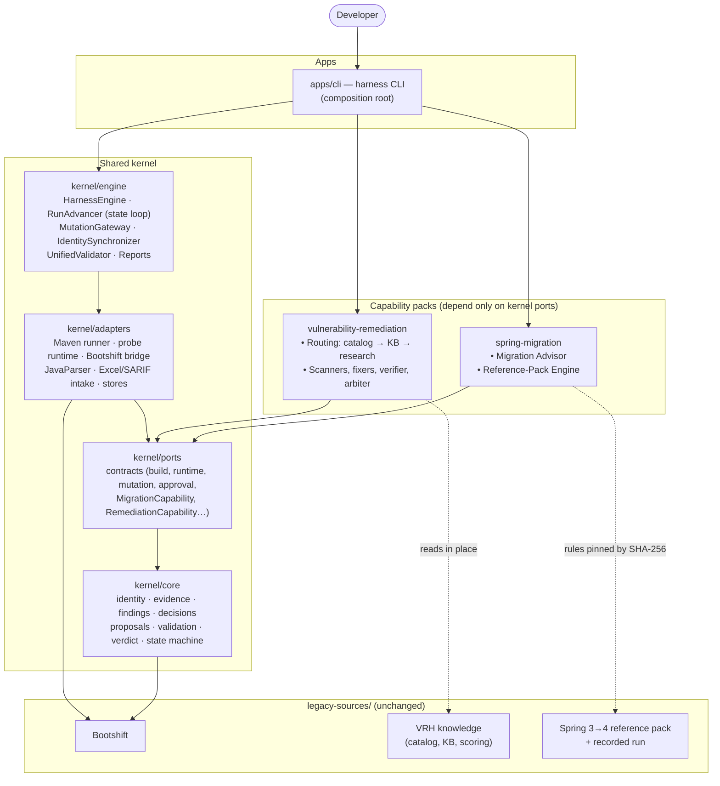
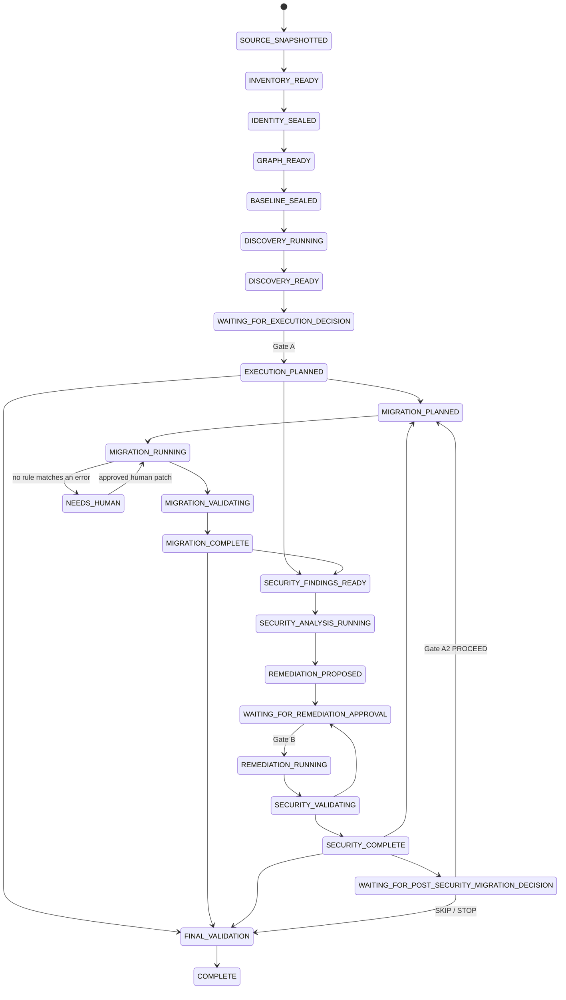
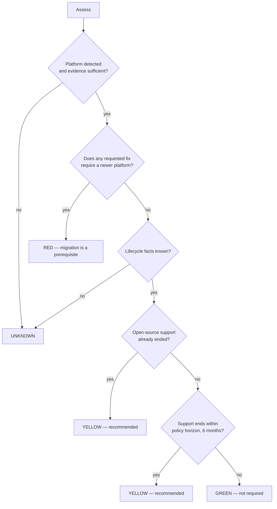
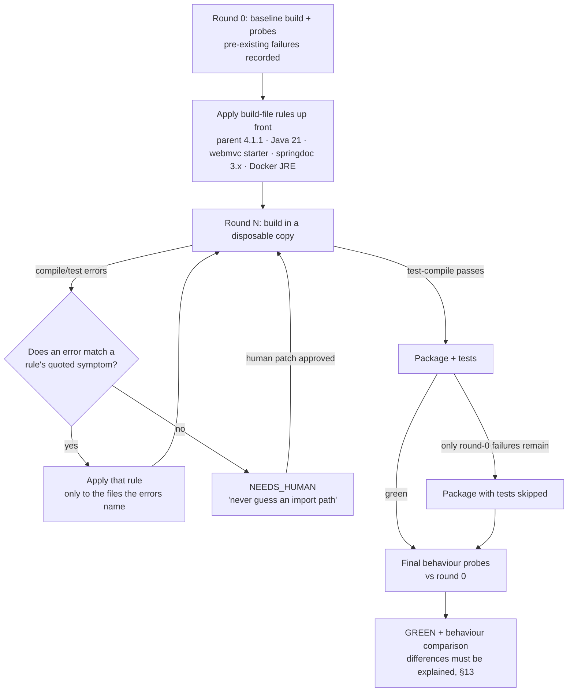
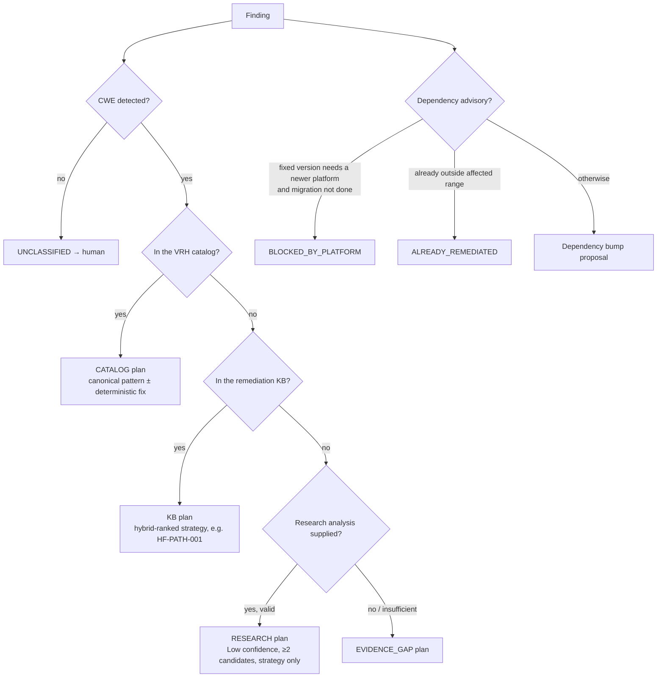
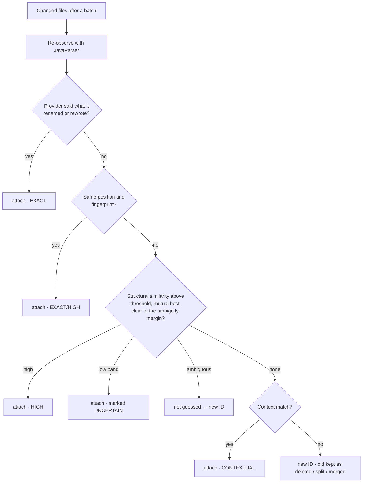
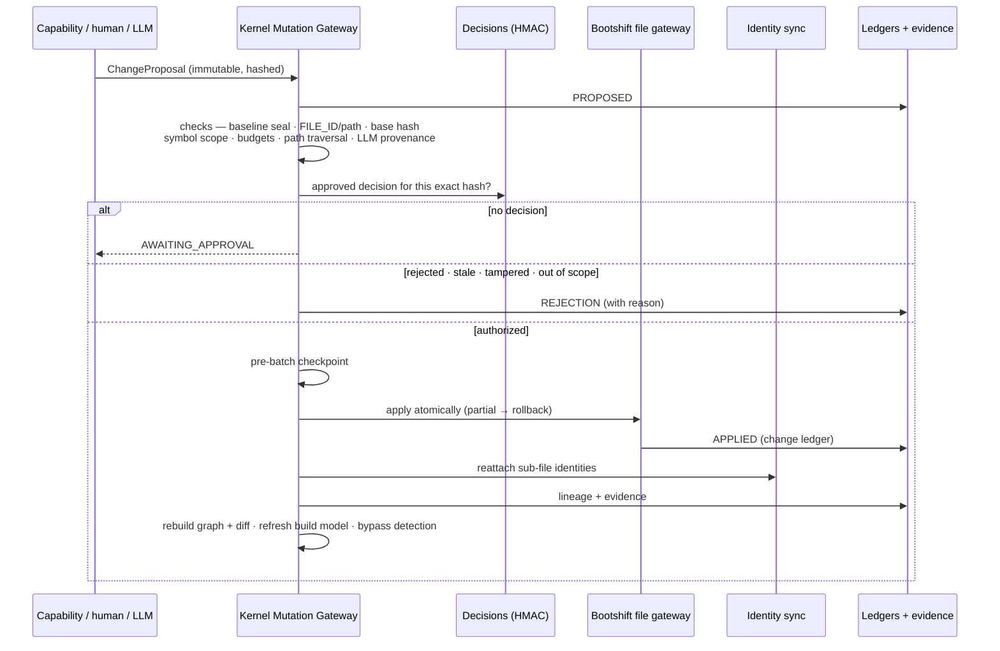
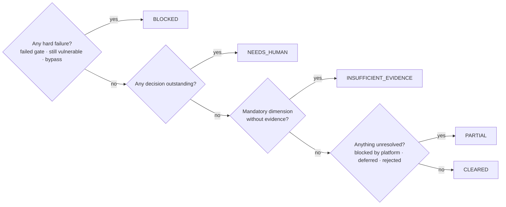

# MARS — Migration and Remediation System

**A developer harness that upgrades Java/Spring applications and fixes their security vulnerabilities in one audited run.**

Under a strict rule: *nothing changes your code unless a human approved it, and every claim the
harness makes is backed by recorded evidence.*

MARS merges three existing systems into one engine:

- a migration engine (**Bootshift**)
- a vulnerability-remediation pipeline (**VRH**, the Vulnerability Remediation Harness)
- a Spring Boot 3 → 4 migration workflow

MARS gives them one identity model, one change ledger, one approval process and one final verdict.

> It is a **developer harness, not a chatbot**. You drive it from the command line. It analyzes,
> recommends, waits for your decisions, applies only what you authorize, verifies the result on the
> real toolchain, and produces an evidence package you can audit.

MARS ships as the **`harness`** command-line tool (`apps/cli/target/harness.jar`).

---

## Overview

- **Analyze** a Java/Spring service. MARS takes in vulnerability findings from your scanners
  (Excel issue register, SARIF, dependency advisories), confirms and pinpoints them (and flags new ones) with its own
  built-in checks for seven common weakness types, assesses whether the service should migrate
  (GREEN / YELLOW / RED), and recommends an order: migrate first, or fix security first.
- **Decide** at human gates. You pick the strategy and approve each individual fix. No AI or tool
  can approve on your behalf.
- **Verify** the result. It is built, tested, probed and re-scanned, and ends
  in one verdict: `CLEARED`, `PARTIAL`, `NEEDS_HUMAN`, `INSUFFICIENT_EVIDENCE` or `BLOCKED`.

```bash
harness analyze ./my-service --findings issues.xlsx     # read-only; stops at Gate A
harness decide execution --run RUN-… --strategy SECURITY_FIRST --actor you --role owner --rationale "…"
harness resume  --run RUN-…                             # advances to Gate B
harness approve remediation --run RUN-… --proposal PROP-… --verdict APPROVED --actor you --role owner --rationale "…"
harness resume  --run RUN-… --accept-pending            # applies, verifies; undecided proposals keep the verdict at NEEDS_HUMAN
harness report  --run RUN-…                             # the evidence report
```

New here? Read [§1](#1-why-mars-exists), [§2](#2-the-five-non-negotiable-rules) and
[§15](#15-quick-start), then try the [worked example](#16-worked-example-a-composite-run).

---

## Table of Contents

1. [Why MARS exists](#1-why-mars-exists)
2. [The five non-negotiable rules](#2-the-five-non-negotiable-rules)
3. [What was unified](#3-what-was-unified)
4. [Architecture at a glance](#4-architecture-at-a-glance)
5. [End-to-end flow](#5-end-to-end-flow)
6. [Phase by phase](#6-phase-by-phase)
7. [Human decision gates](#7-human-decision-gates)
8. [The migration capability](#8-the-migration-capability)
9. [The security capability](#9-the-security-capability)
10. [Persistent identity: tracking code through change](#10-persistent-identity-tracking-code-through-change)
11. [The single Mutation Gateway](#11-the-single-mutation-gateway)
12. [Validation and the final verdict](#12-validation-and-the-final-verdict)
13. [Evidence, ledgers and auditability](#13-evidence-ledgers-and-auditability)
14. [Resume and recovery](#14-resume-and-recovery)
15. [Quick start](#15-quick-start)
16. [Worked example: a composite run](#16-worked-example-a-composite-run)
17. [CLI reference](#17-cli-reference)
18. [Configuration (policy)](#18-configuration-policy)
19. [What a run produces](#19-what-a-run-produces)
20. [Repository layout](#20-repository-layout)
21. [Testing and quality evidence](#21-testing-and-quality-evidence)
22. [Extending MARS](#22-extending-mars)
23. [Limitations](#23-limitations)
24. [Glossary](#24-glossary)
25. [Troubleshooting](#25-troubleshooting)
26. [Further documentation](#26-further-documentation)
27. [License](#27-license)

---

## 1. Why MARS exists

Teams modernizing Java services face two jobs that are usually done separately, and that interfere
with each other:

| Problem | What goes wrong when the jobs are separate |
|---|---|
| **Platform migration** (e.g. Spring Boot 3.5 → 4.1) | Security fixes written against the old platform break or get lost during the upgrade. |
| **Vulnerability remediation** (SQL injection, path traversal, vulnerable dependencies…) | Some fixes are *impossible* on the old platform (the fixed library version requires the new one), so they silently stall. |
| **Audit and trust** | Automated tools change code without a traceable reason, approvals live in editable Markdown, and "tests passed" hides that some checks never ran. |

MARS answers three questions in one run, with evidence:

1. **Should we migrate, and how urgently?** A grounded GREEN / YELLOW / RED / UNKNOWN recommendation.
2. **Which vulnerabilities can be fixed now, and which need the migration first?** Explicit
   sequencing, including `BLOCKED_BY_PLATFORM`.
3. **What exactly changed, why, who approved it, and did it really work?** A verifiable evidence
   package and verdict.

---

## 2. The five non-negotiable rules

Everything in the design follows from these rules. Each one is enforced in code and tested.

| # | Rule | How it is enforced |
|---|---|---|
| 1 | **No agent directly mutates tracked source.** | Every change is a `ChangeProposal` applied by one Mutation Gateway. Architecture tests fail the build if any other class writes source files. A runtime bypass detector flags any direct write. |
| 2 | **No AI or tool self-authorizes a change.** | Approvals are recorded human decisions, bound to the exact proposal hash. Machine identities (`llm`, `agent`, `copilot`, `harness`…) are refused as approvers. |
| 3 | **A RED recommendation never starts a migration by itself.** | The run stops at Human Gate A until a person chooses a strategy. |
| 4 | **Unknown evidence stays unknown.** | Missing data is recorded as `UNKNOWN` / `NOT_RUN` / `INSUFFICIENT_EVIDENCE`, never guessed, and never counted as a pass. |
| 5 | **Protected business logic is not rewritten for elegance.** | The three source systems are kept byte-for-byte in `legacy-sources/`. Bootshift runs unchanged, and ported rules are checked against the original code by parity tests. |

---

## 3. What was unified

| Source system | What it contributed | How MARS uses it |
|---|---|---|
| **Bootshift** (Java) | Persistent file identity (`FILE_ID`), immutable snapshot, isolated workspace, hash-chained change ledger, file mutation gateway, inventory / build model / application graph, lifecycle facts | **Called unchanged.** It is built from `legacy-sources/bootshift` in the same Maven reactor and forms the kernel base. Its 190 tests still run on every build. |
| **Vulnerability Remediation Harness (VRH)** (Node.js skills) | Excel issue register; CWE routing catalog → knowledge base → research; fix strategies; re-scan / red-team / QA gates; merge arbiter scoring | **Ported to Java rule-for-rule.** Knowledge files are read in place, unchanged. Parity tests run the original JavaScript and compare results. |
| **Spring migration reference** (`04d-version-migration`) | Spring Boot 3 → 4 reference pack, a round-based compiler-driven workflow, behaviour probes, a recorded real migration | **Ported as a deterministic engine.** Its rules are pinned to the pack's SHA-256, and the recorded run is used as the parity baseline. |

---

## 4. Architecture at a glance

MARS follows a **Shared Kernel + Capability Packs** architecture. The kernel owns the
infrastructure: identity, graph, evidence, decisions, mutation, validation and run state. The
capabilities own domain knowledge (migration, security). The kernel never depends on a
capability. Capabilities see only kernel *contracts*.



| Layer | Module | Responsibility |
|---|---|---|
| Legacy base | `legacy-sources/bootshift` | File identity, ledger, file writer, inventory, graph, lifecycle facts (unchanged) |
| Kernel core | `kernel/core` | Domain model: identities, evidence, findings, decisions, proposals, validation, verdict, run state |
| Kernel ports | `kernel/ports` | Interfaces every tool and capability must satisfy |
| Kernel adapters | `kernel/adapters` | Concrete tools: Maven, Java runtime probing, JavaParser, Excel/SARIF, stores, Bootshift bridge |
| Kernel engine | `kernel/engine` | Orchestration: phases, gates, state loop, the Mutation Gateway, validation, reporting |
| Capability | `capabilities/spring-migration` | Should we migrate, and how (advisor + round engine) |
| Capability | `capabilities/vulnerability-remediation` | What is vulnerable, and how to fix and verify it |
| App | `apps/cli` | The `harness` command and wiring |
| Tests | `tests` | Unit, architecture, contract, schema, parity, integration, E2E, real-toolchain acceptance |

---

## 5. End-to-end flow

One run moves through **analysis → human decision → authorized execution → re-assessment →
validation → verdict**.

```mermaid
flowchart LR
  A[Repository<br/>+ finding sources] --> B[Phase 0–1<br/>Snapshot · Inventory<br/>· Identity]
  B --> C[Phase 2<br/>Canonical graph]
  C --> D[Phase 3<br/>Baseline seal<br/>round-0 build + probes]
  D --> E[Phase 4<br/>Read-only discovery<br/>migration + security]
  E --> GA{{Gate A<br/>Human chooses strategy}}
  GA -->|MIGRATE_FIRST / MIGRATION_ONLY| M[Migration rounds]
  GA -->|SECURITY_FIRST / SECURITY_ONLY| S[Remediation plans]
  GA -->|ANALYZE_ONLY / STOP| V
  M --> S
  S --> GB{{Gate B<br/>Human approves<br/>each proposal}}
  GB --> F[Apply via Mutation Gateway<br/>+ verify each fix]
  F --> R[Re-assess migration]
  R --> GA2{{Gate A2<br/>Migrate now?}}
  GA2 -->|PROCEED| M
  GA2 -->|SKIP / STOP| V
  M -->|after SECURITY_FIRST| V
  V[Unified validation] --> VD[Verdict +<br/>evidence package]
  VD --> AP{{Optional:<br/>Apply to project<br/>decision}}
```



The full state machine, with every legal transition enforced in code:



---

## 6. Phase by phase

| Phase | What happens | Key guarantee |
|---|---|---|
| **0 — Ingest** | Bootshift takes an immutable snapshot of the repository (`original/`) and creates the isolated workspace (`migration/`) plus a checkpoint repository. | Your repository is only ever read. |
| **1 — Inventory and identity** | Every file gets a `FILE_ID`. Every Java module, type, member and statement gets a persistent `MOD-` / `PU-` / `SYM-` / `STMT-` identity. The build model is read (declared + resolved versions). | Identity is allocated, not derived from paths, so it survives renames and edits. |
| **2 — Canonical graph** | Bootshift's application graph plus an identity overlay: which statements live in which methods, which endpoints call what. | One graph for both capabilities. |
| **3 — Baseline seal** | "Round 0": the project is built and tested, and the app is started and probed over loopback, *before anything changes*. Pre-existing failures are recorded, never fixed. Everything is sealed with a hash. | No mutating state can be entered before the seal. |
| **4 — Read-only discovery** | Security: findings are normalized from Excel/SARIF/advisories, scanners corroborate them, and root cause and blast radius are computed. Migration: platform detection, lifecycle facts, reference-pack scan, effort and traffic light. Then a sequencing recommendation. | The workspace hash is compared before and after: discovery cannot change code. |
| **Gate A** | The developer chooses an execution strategy. | Nothing executes without it. |
| **Execution** | Migration rounds and/or remediation, each change a proposal through the Mutation Gateway. | Single writer, authorized, checkpointed, reversible. |
| **Re-assessment and Gate A2** | After security work, migration is assessed again, and the developer is asked again if it is still relevant. | Decisions are made on current facts. |
| **Validation and verdict** | 13 validation dimensions, then a verdict with explicit precedence. | An unexecuted check is never a pass. |

---

## 7. Human decision gates

Every decision is a **write-once JSON artifact**. It is HMAC integrity-protected, bound by hash to
the exact thing it decides about, and refused if the actor is a reserved machine identity.

| Gate | When | Choices | Bound to |
|---|---|---|---|
| **A — Execution strategy** | After discovery | `MIGRATE_FIRST`, `SECURITY_FIRST`, `MIGRATION_ONLY`, `SECURITY_ONLY`, `ANALYZE_ONLY`, `STOP` | Hash of the combined assessment + baseline seal |
| **B — Remediation approval** | Per proposal | `APPROVED`, `REJECTED`, `DEFERRED` | SHA-256 of that exact proposal + baseline seal |
| **A2 — Post-security migration** | After security work, if migration is still not GREEN | `PROCEED`, `SKIP`, `STOP` | Hash of the *refreshed* assessment |
| **Plan approval** (optional, by policy) | Before migration rounds | `APPROVED`, `REJECTED`, `DEFERRED` | Hash of the frozen migration plan |
| **Apply to project** | After the verdict | `APPROVED`, `REJECTED`, `DEFERRED` | Current ledger head |

What the gates guarantee:

- **A missing decision is never approval.** Undecided proposals stay `PENDING_APPROVAL`, and the
  verdict says so.
- **An edited proposal loses its approval.** Its hash no longer matches ("stale approval").
- **A tampered decision file authorizes nothing.** Its integrity hash fails.
- **LLM-authored patches** must carry model, prompt and response hashes, and always need a human
  approval.

### Choosing a strategy

| Strategy | Use when | What runs |
|---|---|---|
| `MIGRATE_FIRST` | Some fixes need the new platform (RED assessment) | Migration → then remediation against the migrated code |
| `SECURITY_FIRST` | A critical vulnerability cannot wait for the upgrade | Independent fixes → migration → platform-blocked fixes re-planned once |
| `MIGRATION_ONLY` | Upgrade now, security later | Migration only; findings reported as deferred |
| `SECURITY_ONLY` | No upgrade this cycle | Remediation only; platform-blocked fixes reported `BLOCKED_BY_PLATFORM`; Gate A2 offered |
| `ANALYZE_ONLY` | Assessment and report only | No change at all |
| `STOP` | Abandon the run | Final report of what is known |

---

## 8. The migration capability

### 8.1 Migration Advisor: should we migrate?

The advisor gives **separate answers** rather than one blended score:

| Output | Values | Grounded in |
|---|---|---|
| **Traffic light** | GREEN / YELLOW / RED / UNKNOWN | Platform detected in the build model, lifecycle facts, requested objectives |
| **Need** | NOT_REQUIRED / RECOMMENDED / PREREQUISITE / UNKNOWN | Same |
| **Priority** | NONE … CRITICAL | Traffic light + objectives' severity |
| **Complexity** | TRIVIAL / LOW / MODERATE / HIGH / REARCHITECTURE | Effort score vs policy thresholds + blockers |
| **Effort score** | 0–100 | 10 weighted factors (below) |
| **Evidence confidence** | HIGH / MEDIUM / LOW / INSUFFICIENT | How much of the above is verified vs unknown |

**Traffic-light rules**, evaluated in this order:



RED comes from **your objectives**, not from the calendar. Example: a vulnerable library whose
only fixed version needs Spring Boot 4 turns the light RED even if Boot 3.5 is still supported.

**Effort score.** Each factor is normalized (raw value ÷ saturation, capped at 1), then multiplied
by its policy weight. The weights sum to 100. Every known factor cites evidence; an unknown factor
is reported as unknown, never guessed.

| Factor | Weight |
|---|---|
| Mandatory migration issue count | 20 |
| Removed / relocated API count | 14 |
| Platform version distance | 12 |
| Dependency incompatibility count | 12 |
| Java version jump | 8 |
| Configuration breakage count | 8 |
| Module / service breadth | 8 |
| Runtime test coverage gap | 8 |
| Unknown internal components | 5 |
| Ecosystem constraints | 5 |

### 8.2 Reference-Pack Engine: how we migrate

The engine executes the Spring Boot 3 → 4 reference workflow deterministically:



- **Rules are data.** `capabilities/spring-migration/reference-packs/spring-boot-3-to-4.rules.json`
  is derived from the Markdown pack and pinned to the pack's SHA-256. If the pack changes, the
  rules must be re-derived first.
- **The compiler is the authority.** A source rule is applied only because a round failed with that
  rule's symptom:
  - `SB4-JACKSON3` — Jackson 2 → 3
  - `SB4-HEALTH` — relocated health indicator API
  - `SB4-MOCKITOBEAN` — `@MockBean` → `@MockitoBean`
  - `SB4-WEBMVC-TEST` — relocated WebMvc test support
  - `SB4-DATAJPA-TEST` — relocated Data JPA test support
  - `SB4-SECURITY-TEST` — 401s when the security-test starter is missing
- **Behaviour, not compilation, is acceptance.** The app is started and the same HTTP probes are
  replayed. Every difference must be one the pack documents as expected (§13), or validation fails.

---

## 9. The security capability

### 9.1 Intake and discovery

| Source | Normalizer | Anchoring |
|---|---|---|
| VRH Excel issue register (`.xlsx`) | `IssueRegisterNormalizer` (same column contract as VRH) | `affected_files`, `affected_symbols`, `File.java:line` references in the data flow |
| SARIF (any scanner) | `SarifNormalizer` | Physical location → statement |
| Dependency advisories (`*.advisories.json`) | `AdvisoryScanner` | Build file + coordinate; may carry a **platform requirement** |
| Built-in rule scanner | `RuleScanner` (CWE-89, 943, 22, 502, 798, 532, 770) | Statement identity; corroborates imported findings |

All of them become one **canonical finding**, anchored to a `STATEMENT` / `SYMBOL` / `FILE`
identity rather than to a path and line. Discovery then adds a **root cause** (data flow, location)
and a **blast radius** (affected endpoints and services, from the graph).

### 9.2 Routing: from finding to plan



Every plan is **Proposed**. Deterministic fixers produce real patches for common shapes:

- SQL string concatenation → a parameterized query
- a path built from input → a normalize-and-contain check
- a vulnerable dependency → a version bump

Other plans are *strategy-only*: approving one authorizes producing a concrete fix, which then needs
its own approval.

### 9.3 Verification of every applied fix

Each fix is verified the way VRH verifies it, then scored with VRH's unchanged `scoring.json`:

| Gate | What it checks |
|---|---|
| Build / QA (06) | One VERIFY build in a disposable copy. New test failures vs baseline → Failed. |
| Re-scan (05) | The finding's rule no longer fires **at the same statement identity** |
| Red team (05) | Attack vectors replayed against the patched code (e.g. `' OR '1'='1`, `../` escapes) |
| Behaviour guard (05) | No symbol outside the proposal's declared scope changed |
| Merge arbiter (07a) | Score vs severity threshold plus hard gates → **Cleared** or **Blocked** |

---

## 10. Persistent identity: tracking code through change

Findings point at statements, migrations rewrite methods, and developers rename files. MARS keeps
one allocated identity per element and **reattaches** it after every change:

| Level | ID | Example |
|---|---|---|
| File | `FILE-…` (Bootshift) | `ProductRepository.java` |
| Module | `MOD-…` | a Maven module |
| Program unit | `PU-…` | class `ProductRepository` |
| Symbol | `SYM-…` | method `findByName(String)`, field `API_KEY`, an endpoint |
| Statement | `STMT-…` | `String sql = "SELECT … '" + name + "'";` |



Result: after `SecurityConfig.java` is renamed to `ApiKeyConfig.java` (class renamed too), its
`FILE_ID`, class, method and statement IDs all survive, and the finding on it stays linked. The
`harness lineage <ID>` command shows the full history of any identity.

---

## 11. The single Mutation Gateway

There is exactly **one** code path that writes tracked source.



What counts as authorization:

- **Deterministic migration rules:** the human execution decision (Gate A or A2), plus the frozen
  plan's hash, plus the rule appearing in the plan's allowlist.
- **Everything else** (security fixes, manual patches, LLM patches): a human approval of that exact
  proposal hash.

---

## 12. Validation and the final verdict

### 12.1 Validation dimensions

| Dimension | Meaning |
|---|---|
| `COMPILE`, `TESTS`, `BUILD_PACKAGE` | Final build of the mutated workspace vs the round-0 baseline |
| `RUNTIME_STARTUP`, `BEHAVIOR_PROBES`, `OLD_NEW_DIFFERENTIAL` | App starts; probes match baseline or differ only in documented ways |
| `SECURITY_RESCAN`, `DEPENDENCY_SCAN`, `RED_TEAM` | Findings no longer reproduce; bypass attempts fail |
| `GRAPH_DIFF` | Structural changes stay inside authorized files |
| `IDENTITY_INTEGRITY`, `EVIDENCE_COVERAGE` | Identities consistent; claims backed by evidence |
| `MUTATION_BYPASS` | No write happened outside the gateway |

Every dimension ends in exactly one of these statuses:

- `PASS`
- `PASS_WITH_EXPLAINED_DIFFERENCES`
- `FAIL`
- `NOT_RUN`
- `NOT_COMPARED`
- `TOOL_UNAVAILABLE`
- `INSUFFICIENT_EVIDENCE`
- `NOT_APPLICABLE`

**The last five are never counted as a pass.**

### 12.2 Verdict precedence



Each finding and capability also gets an **item status**, for example:

- `FIXED`, `STILL_VULNERABLE`, `BLOCKED_BY_PLATFORM`
- `DEFERRED_BY_DEVELOPER`, `REJECTED_BY_DEVELOPER`, `PENDING_APPROVAL`
- `MIGRATED`, `MIGRATION_DECLINED`, …

The VRH-native verdict (`Cleared (100/85)`) is shown alongside.

---

## 13. Evidence, ledgers and auditability

| Artifact | Purpose | Tamper evidence |
|---|---|---|
| **Evidence log** (`provenance/evidence.jsonl`) | Every observation, tool result, lifecycle fact, rule, decision and unknown, as an `EVID-` record | Hash chain |
| **Change ledger** (Bootshift, unchanged schema) | Every proposed / applied / validated / rejected / reverted change | Hash chain + recorded head |
| **Lineage ledger** | Sub-file identity changes per `CHANGE_ID`, including decision and capability | Hash chain |
| **Decisions** (`decisions/DEC-*.json`) | Human decisions | HMAC per decision |
| **Proposals** (`proposals/PROP-*.json`) | Immutable change requests | SHA-256 recorded alongside |
| **Checkpoints** | Git checkpoint repository per batch | Revertible |

`harness verify --run RUN-…` recomputes every chain and integrity hash from disk and exits non-zero
if anything was altered. All artifacts follow the versioned JSON Schemas in `schemas/v1/`.

---

## 14. Resume and recovery

Every step is a function of **persisted state**, never of in-memory progress. You can stop at any
gate, close the terminal and continue days later with `harness resume`.

- Applied proposals are recognized from the run record and the ledger, and are **never applied
  twice**.
- If the process dies after a fix was applied but before it was verified, resuming **verifies it**.
  It does not re-apply it.
- A partially applied proposal is rolled back to its pre-batch checkpoint.

---

## 15. Quick start

### Prerequisites

| Tool | Version | Notes |
|---|---|---|
| JDK | 21 | Required to build and run MARS |
| Maven | 3.8+ | Builds MARS; also used on the target project (wrapper, `PATH`, `MAVEN_HOME`, or `~/.m2/wrapper` are detected) |
| Node.js | 22 (optional) | Only for the parity test suite, which runs the original VRH / migration JavaScript |
| Docker | optional | Only for target projects whose tests use Testcontainers |

### Build

```bash
git clone https://github.com/KrishnaAnnavaram/MARS.git
cd MARS
mvn install -DskipTests   # fast build: just the CLI jar
# CLI jar: apps/cli/target/harness.jar
```

A plain `mvn install` also runs every default test suite, including Bootshift's 190 tests. That
takes about **20 minutes** (21 min 11 s in the recorded run). Add `-o` when all dependencies are
already in your local repository.

### Make `harness` a command

```bash
# bash / zsh
alias harness='java -jar /path/to/MARS/apps/cli/target/harness.jar'
```

```powershell
# Windows PowerShell (add to $PROFILE to keep it)
function harness { java -jar D:\path\to\MARS\apps\cli\target\harness.jar @args }
```

MARS finds its installation root (the folder containing `policies/default/unified-policy.json`
and `legacy-sources/bootshift`) in this order: `--harness-root`, the `HARNESS_HOME` environment
variable, the current directory and its parents, then the jar's own location and its parents.
Running the jar from inside a MARS checkout therefore needs no setup. Runs are written to
`<harness-root>/runs` unless you pass `--runs-root` or set `HARNESS_RUNS_ROOT`.

### Getting the run ID

Every command after `analyze` needs `--run RUN-…`. `analyze` prints it on its first line
(`run      : RUN-…`), and each run is also a folder under `runs/`. To capture it in a script:

```bash
RUN=$(harness analyze /path/to/your-service --json | jq -r .run_id)
harness status --run "$RUN"
```

```powershell
$RUN = (harness analyze D:\path\to\your-service --json | ConvertFrom-Json).run_id
harness status --run $RUN
```

When the run is waiting for you, `status` ends with a `next:` list of the commands you can run
now.

### First run

```bash

# 1. analyze (read-only) — stops at Gate A
harness analyze /path/to/your-service \
  --findings issues.xlsx --findings scan.sarif \
  --probes /path/to/your-service/probes.json

# 2. inspect
harness status               --run RUN-…
harness migration-assessment --run RUN-…
harness findings             --run RUN-…

# 3. decide (Gate A)
harness decide execution --run RUN-… --strategy SECURITY_FIRST \
  --actor jane.doe --role owner --rationale "SQL injection cannot wait for the upgrade"

# 4. advance to Gate B, review, approve
harness resume    --run RUN-…
harness proposals --run RUN-…
harness approve remediation --run RUN-… --proposal PROP-… --verdict APPROVED \
  --actor jane.doe --role owner --rationale "Reviewed the diff"

# 5. continue to the verdict
harness resume --run RUN-… --accept-pending
harness report --run RUN-…
harness verify --run RUN-…
```

**Probe file** (`probes.json`): HTTP requests replayed against the running app before and after.

```json
{
  "base_url": "http://localhost:8080",
  "auth": { "type": "basic", "username": "demo", "password": "demo123" },
  "readiness": { "path": "/actuator/health", "timeout_seconds": 120 },
  "requests": [
    { "name": "health is public", "method": "GET", "path": "/actuator/health", "no_auth": true },
    { "name": "list items", "method": "GET", "path": "/api/v1/items" }
  ]
}
```

Probes may only target loopback: the app is started locally on a free port.

### Control Center (web)

The same workflow, watched live and decided in a browser. It is a second entry point over the same
engine and the same runs root: CLI runs appear in it, and every decision it records goes through the
engine's approval store, bound to the exact assessment, plan or proposal the reviewer saw.

```bash
mvn -pl apps/control-center-api -am install -DskipTests
(cd ui/mars-control-center && npm ci --include=dev && npm run build)
java -jar apps/control-center-api/target/control-center-api-1.0.0-exec.jar \
     --mars.control-center.ui-dir=ui/mars-control-center/dist
# http://127.0.0.1:8080 — sign in as approver / mars-dev (development identities; see the security doc)
```

It shows the pipeline from the state machine, the live execution events (RCA, blast radius, migration
rounds, Mutation Gateway checks), the Human Action Center for Gate A, B and A2, the exact diffs, the
evidence chain, validation and the verdict. See the
[user guide](docs/control-center-user-guide.md) and the [architecture](docs/control-center-architecture.md).

---

## 16. Worked example: a composite run

The repository ships a realistic fixture, `fixtures/composite/inventory-service`. It is a Spring
Boot 3.5 service with:

- a **SQL injection** (CWE-89)
- a **path traversal** (CWE-22)
- **unsafe deserialization** (CWE-502)
- a **hard-coded key** (CWE-798)
- a **vulnerable springdoc 2.x** dependency whose fix exists only on the Spring Boot 4 line
  (a synthetic advisory, clearly marked)

```bash
F=fixtures/composite
harness analyze $F/inventory-service \
  --findings $F/inputs/issue-register.xlsx \
  --findings $F/inputs/inventory.advisories.json \
  --research INV-103=$F/inputs/INV-103.analysis.json \
  --probes   $F/inventory-service/probes.json
```

What happens:

| Step | Result |
|---|---|
| Discovery | 5 findings. Each register row is corroborated by the scanner on the **same statement**. |
| Migration advisor | **RED**: "the springdoc fix needs org.springdoc … ≥ 3.1.0, which requires Spring Boot 4.0+". Recommended strategy **MIGRATE_FIRST**. |
| Routing | CWE-89 → catalog (deterministic fix) · CWE-22 → KB (`HF-PATH-001` fix) · CWE-502 → research (Low confidence, strategy only) · CWE-798 → catalog · advisory → platform-dependent |
| If you choose `SECURITY_ONLY` | SQL fix applied and **Cleared**; advisory **BLOCKED_BY_PLATFORM**; Gate A2 asks again about migration |
| If you choose `MIGRATE_FIRST` | Boot 4.1.1 migration → springdoc moves to 3.1.0 → advisory re-matched as **already remediated** → fixes applied against migrated code |

The fixture's finding IDs:

| ID | Finding |
|---|---|
| `INV-101` | SQL injection (CWE-89) |
| `INV-102` | Path traversal (CWE-22) |
| `INV-103` | Unsafe deserialization (CWE-502), with a supplied research analysis |
| `INV-104` | Hard-coded key (CWE-798) |
| `FIXTURE-ADV-SPRINGDOC-0001` | Synthetic springdoc advisory that needs Spring Boot 4 |

### Walkthrough A: `SECURITY_ONLY`, then migrate at Gate A2

These are the steps `CliWorkflowIT` and `CompositeSequencingE2ETest` drive. The `…` parts are the
IDs your run prints.

```bash
# 1. analyze (the command above). The run stops at Gate A:
#    phase   : WAITING_FOR_EXECUTION_DECISION   (migration-assessment shows "traffic_light" : "RED")

# 2. choose security only
harness decide execution --run $RUN --strategy SECURITY_ONLY \
  --actor dev.lead --role owner --rationale "Security this sprint"
harness resume --run $RUN                 # -> WAITING_FOR_REMEDIATION_APPROVAL

# 3. review and approve the SQL injection fix (find its PROP- ID in the list)
harness proposals --run $RUN
harness approve remediation --run $RUN --proposal PROP-… --verdict APPROVED \
  --actor dev.lead --role owner --rationale "Reviewed the parameterized query"

# 4. apply and verify. The springdoc advisory is BLOCKED_BY_PLATFORM, so MARS asks again about migrating
harness resume --run $RUN --accept-pending   # -> WAITING_FOR_POST_SECURITY_MIGRATION_DECISION
#    migration is re-assessed: still RED (discovery/migration/post-security-reassessment.json says why)

# 5. Gate A2: migrate now
harness decide migration --run $RUN --decision PROCEED \
  --actor dev.lead --role owner --rationale "Unblocks the springdoc fix"
harness resume --run $RUN

# 6. inspect and check integrity
harness report --run $RUN
harness verify --run $RUN
```

Outcome: the migration reaches GREEN, and the verdict lists `MIGRATION` as `MIGRATED`, the SQL
injection as `FIXED` and the springdoc advisory as `FIXED`. Choosing `SKIP` at step 5 instead
leaves the advisory `BLOCKED_BY_PLATFORM`.

`--accept-pending` lets the run continue while some proposals are still undecided. They are
**not** approved: they stay `PENDING_APPROVAL`, and the run ends in `NEEDS_HUMAN` ("N decision(s)
outstanding") until you decide them.

### Walkthrough B: `MIGRATE_FIRST`

```bash
harness decide execution --run $RUN --strategy MIGRATE_FIRST \
  --actor dev.lead --role owner --rationale "Follow the recommendation"
harness resume --run $RUN          # migration rounds run; stops at Gate B
harness proposals --run $RUN       # fixes are now computed against the migrated code
harness approve remediation --run $RUN --proposal PROP-… --verdict APPROVED \
  --actor dev.lead --role owner --rationale "…"      # repeat for INV-101 and INV-102
harness resume --run $RUN --accept-pending
```

Outcome: the pom moves to Spring Boot 4.1.1 and springdoc 3.1.0, and the advisory is re-matched as
`ALREADY_REMEDIATED`. In the change ledger, every migration change comes before every security
change.

---

## 17. CLI reference

| Command | Purpose |
|---|---|
| `analyze <repo> [--findings …] [--research ID=file] [--probes file] [--skip-build]` | Phases 0–4; stops at Gate A |
| `status --run RUN-…` | Current phase, what it waits for, next commands |
| `migration-assessment --run RUN-…` | The advisory assessment (JSON) |
| `findings --run RUN-…` | Canonical findings with identity anchors |
| `proposals --run RUN-… [--json]` | Proposals, status and reviewable diffs |
| `decide execution --run … --strategy …` | Gate A |
| `decide migration --run … --decision PROCEED\|SKIP\|STOP` | Gate A2 |
| `approve remediation --run … --proposal PROP-… --verdict …` | Gate B (per proposal) |
| `approve migration --run …` | Migration plan approval (when policy requires it) |
| `approve apply --run …` | Authorize applying the result to your project |
| `submit-patch --run … --reason "…" --file repo/path=local [--rename old=new] [--finding ID…] [--provider manual\|llm …]` | Register a human- or LLM-written patch as a proposal. `--finding` links it to findings (omit for a migration or manual patch). An `llm` patch is refused at apply time unless it gives `--model`, `--prompt-hash` and `--response-hash` (`--model-version` and `--context-hash` are recorded when given). |
| `submit-research --run … --finding ID --analysis analysis.json` | Supply a research analysis for a double-gap finding |
| `resume --run … [--accept-pending]` | Advance to the next gate or the verdict |
| `report --run …` | Render the final evidence report |
| `lineage <ID> --run …` · `finding <ID> --run …` · `change <ID> --run …` | Audit any identity, finding or change |
| `apply --run … --decision DEC-…` | Write the verified result into your project (decision-bound) |
| `verify --run …` | Recompute every hash chain and integrity check |

Every `decide` and `approve` command also requires `--actor <name>`, `--role <role>` and
`--rationale "<why>"`. For `approve`, `--verdict` defaults to `APPROVED`, so pass `--verdict
REJECTED` or `--verdict DEFERRED` explicitly when you mean that.

Every command accepts these common options: `--harness-root`, `--runs-root`, `--policy`, `--today`,
`--maven-offline`, `--network` and `--json`.

**Exit codes**

| Code | Meaning |
|---|---|
| 0 | Success |
| 1 | Failure / tool unavailable |
| 2 | Refused / stale / baseline invalid |
| 3 | Policy block / blocked by platform / validation failed |
| 4 | Needs human / authorization missing / insufficient evidence |

---

## 18. Configuration (policy)

All tunable behaviour lives in `policies/default/unified-policy.json` (versioned as
`policy_version`, and recorded in every run):

| Section | Controls |
|---|---|
| `reserved_machine_actors` | Identities that may never decide (`llm`, `agent`, `copilot`, `harness`, `ci`, …) |
| `identity` | Reattachment thresholds and ambiguity margin |
| `migration.effort_weights` / `effort_saturation` | Effort model (weights must sum to 100; the policy is refused otherwise) |
| `migration.complexity_thresholds` | Score → TRIVIAL / LOW / MODERATE / HIGH / REARCHITECTURE |
| `migration.support_horizon_warning_months` | YELLOW when support ends within N months |
| `migration.plan_requires_approval`, `max_rounds`, `round_timeout_seconds` | Migration execution controls |
| `mutation` | Per-proposal budgets (files, changed lines) |
| `validation` | Mandatory dimensions per run type |
| `security` | Locations of the VRH catalog, KB, ranking weights and scoring files |

Use `--policy <file>` to run with an alternative policy.

---

## 19. What a run produces

Each run lives in `runs/RUN-…/` (use `--runs-root` to change the location):

| Area | Contents |
|---|---|
| `manifest/` | Environment, inputs, source provenance |
| `original/` · `migration/` · `exec/` | Immutable snapshot · the only mutable workspace · disposable build and runtime copies |
| `inventory/` · `identity/` · `graph/` | File registry, identity registry, canonical graph and per-batch graph diffs |
| `baseline/` | Round-0 build, probes and runtime results, sealed manifest |
| `findings/` · `discovery/` | Canonical findings; security discovery; migration assessment; combined assessment |
| `plans/` | Migration plan and rounds; remediation plans; research inputs and promotion candidates |
| `proposals/` · `decisions/` | Immutable proposals; human decisions (JSON + Markdown rendering) |
| `ledger/` · `provenance/` | Change ledger, lineage ledger, evidence log |
| `validation/` | Per-fix verification reports, final build, probe comparison, validation results |
| `reports/` | `final-report.md` (with Mermaid diagrams), `verdict.json`, `cumulative.patch`, migration report, VRH-format `fix_plan_<ISSUE>.md` files |

---

## 20. Repository layout

```text
MARS/
├── apps/cli/                       # harness CLI (composition root, fat jar)
├── apps/control-center-api/        # Control Center API (second composition root: REST, SSE, decisions)
├── ui/mars-control-center/         # Control Center UI (React + TypeScript)
├── kernel/
│   ├── core/                       # domain model: identity, evidence, decisions, proposals, verdict, state
│   ├── ports/                      # contracts
│   ├── adapters/                   # Maven, runtime probing, JavaParser, Excel/SARIF, stores, Bootshift bridge
│   └── engine/                     # HarnessEngine, RunAdvancer, MutationGateway, validation, reports
├── capabilities/
│   ├── spring-migration/           # advisor, reference-pack engine, rules JSON
│   └── vulnerability-remediation/  # routing, KB, research, scanners, fixers, verifier, arbiter
├── legacy-sources/                 # byte-identical exports of the 3 source systems (see SOURCES.json)
├── policies/default/               # unified-policy.json
├── schemas/v1/                     # JSON Schemas for every artifact contract
├── fixtures/                       # composite and migration test projects + inputs
├── tests/                          # all harness test suites
└── docs/                           # analysis, plan, protection map, ADRs, implementation report
```

---

## 21. Testing and quality evidence

Results from the latest full runs (JDK 21, Maven 3.8.7):

| Suite | What it proves | Result |
|---|---|---|
| Bootshift's own suite | The kernel base is unchanged | 190 run, 0 failures, 3 skipped (environmental) |
| Unit | IDs, decisions, state machine, verdict, policy, advisor, normalization, routing, fixers, arbiter, gateway authorization | pass |
| Identity golden | Rename, edit, move, split, merge, uncertain and ambiguous mapping | 14 pass |
| Architecture (ArchUnit) | Single writer, layering, no capability global state, only humans record decisions, reports never write state, processes only via adapters, legacy sources unchanged | pass |
| Contract + schema | Assessments carry evidence, proposals carry base identity, unexecuted ≠ pass, reports are not state; every artifact validates against `schemas/v1` | pass |
| Parity (96 tests) | Java ports vs the **original JavaScript**, run through Node: register reading, routing, KB ranking, research assembly, arbiter (1,152 combinations), build-error parsing (all recorded logs), probe comparison, diffs | pass |
| Integration | Crash/resume without duplicate changes, bypass detection, full CLI flow, apply-to-project safety | pass |
| End to end | Acceptance scenarios 1–10 and every sequencing scenario | pass |
| **Total harness** | | **175 run, 0 failures** |
| **Real toolchain** | Real Maven and real running apps: employee service **Spring Boot 3.5.0 → 4.1.1** reaches GREEN in 8 rounds, with behaviour matching the recorded reference run; composite service migrated and SQL fix **Cleared** | **2 run, 0 failures** |

```bash
mvn install                                                                  # all default suites
mvn -pl tests test -Dharness.excludedGroups= -Dtest=RealToolchainAcceptanceIT # real toolchain (~10 min)
```

The E2E suites run on the production wiring with a clearly labelled test double for Maven and the
app runtime. The double reproduces the real compiler's failure modes and emits Maven-format output
that the production parser reads. The real-toolchain suite uses no doubles.

---

## 22. Extending MARS

| To add… | Do this |
|---|---|
| A new migration path (e.g. Spring Boot 2 → 3) | Add a reference pack and derive a `*.rules.json` pinned to its SHA-256 (build-file rules + symptom rules). The engine and advisor pick it up with no code change if it uses the existing rule kinds. New rule kinds or non-Spring frameworks need code. See [`docs/writing-a-reference-pack.md`](docs/writing-a-reference-pack.md). |
| A new finding source | Implement `FindingNormalizer` (anchor to identity via `FindingAnchoring`) and register it in `HarnessFactory`. |
| A new deterministic fix | Add a fixer in `capabilities/vulnerability-remediation/.../fix/Fixers` and route to it from the catalog or KB plan. |
| A new build tool or runtime | Implement `BuildPort` / `RuntimePort` in `kernel/adapters`. The architecture tests keep processes inside adapters. |
| A new capability | Implement the capability contract in `kernel/ports`, depend only on ports, and wire it in `apps/cli`. |

---

## 23. Limitations

Stated plainly:

- **Statement-level identity is Java-only.** Other files carry `FILE_ID` only.
- **One migration reference pack** (Spring Boot 3 → 4). On real code it may meet errors the pack
  does not cover (e.g. `AutoConfigureTestDatabase` moved in Boot 4). The harness then stops for a
  human by design. It does not guess.
- **Research judgement is an input.** Without a supplied analysis, a double-gap finding gets an
  evidence-gap plan.
- **Deterministic fixers cover common shapes only.** Other plans are approved strategies awaiting a
  concrete patch.
- **Approver identity is locally asserted.** HMAC provides tamper evidence, not non-repudiation.
- **No pull-request automation.** The outputs are the evidence package, the patch, and a
  decision-bound `apply`.
- **Testcontainers tests need Docker.** Without it they are skipped on both sides of every
  comparison.

The full list is in [`docs/IMPLEMENTATION-REPORT.md`](docs/IMPLEMENTATION-REPORT.md#5-limitations-and-known-gaps).

---

## 24. Glossary

| Term | Meaning |
|---|---|
| **Run** | One analysis-to-verdict session, stored in `runs/RUN-…/`. Every command after `analyze` names it with `--run`. |
| **Bootshift** | The Java migration engine MARS is built on. It provides file identity, the snapshot and workspace, and the change ledger, and it runs unchanged. |
| **VRH** | Vulnerability Remediation Harness: the source security pipeline whose rules, catalog, knowledge base and scoring MARS ports or reads in place. |
| **Capability** | A domain module plugged into the kernel: `spring-migration` or `vulnerability-remediation`. |
| **Baseline seal** | The hashed record of "round 0": the build, tests and probes of the untouched project. No change can happen before it exists. |
| **Round** | One migration build attempt in a disposable copy. Round 0 is the baseline; later rounds apply rules for the errors they hit. |
| **Reference pack** | A Markdown migration guide (e.g. Spring Boot 3 → 4) plus a machine-readable `*.rules.json` pinned to it by SHA-256. |
| **Symptom rule** | A migration rule applied only when a build fails with the exact error text it quotes. |
| **Traffic light** | The Migration Advisor's answer: GREEN (not required), YELLOW (recommended), RED (a prerequisite for a requested fix), UNKNOWN. |
| **Gate A / A2 / B** | Human decisions: A picks the execution strategy, A2 asks again about migrating after security work, B approves each individual proposal. |
| **Proposal (`PROP-`)** | An immutable, hashed change request. It is the only way code changes. |
| **Decision (`DEC-`)** | A recorded human decision, HMAC-protected and bound to the hash of what it decides about. |
| **Mutation Gateway** | The single code path allowed to write tracked source. |
| **Identity (`FILE-`, `MOD-`, `PU-`, `SYM-`, `STMT-`)** | Persistent IDs for files, modules, classes, members and statements that survive renames and edits. |
| **Finding** | A vulnerability in canonical form, anchored to an identity rather than a path and line. |
| **Catalog / KB / Research** | The three routing levels for a finding: VRH's CWE catalog, the remediation knowledge base, then a supplied research analysis. |
| **Double gap** | A finding whose CWE is in neither the catalog nor the KB. It needs a research analysis, or it gets an `EVIDENCE_GAP` plan. |
| **Strategy-only plan** | A plan with no concrete patch. Approving it authorizes producing a fix, which then needs its own approval. |
| **`BLOCKED_BY_PLATFORM`** | A fix that cannot be applied until the migration is done (e.g. the fixed library needs Spring Boot 4). |
| **Probe** | An HTTP request replayed against the running app before and after, to compare behaviour. |
| **Evidence (`EVID-`)** | A hash-chained record backing every claim MARS makes. |
| **Verdict** | The final outcome: `CLEARED`, `PARTIAL`, `NEEDS_HUMAN`, `INSUFFICIENT_EVIDENCE` or `BLOCKED`. |

---

## 25. Troubleshooting

| Symptom | Cause and fix |
|---|---|
| `Cannot locate the harness installation` | Run from inside the MARS checkout, pass `--harness-root`, or set `HARNESS_HOME` to the folder that contains `policies/default/unified-policy.json`. |
| `reserved machine identity` (exit 2) | `--actor` is a machine name such as `llm`, `agent`, `copilot`, `harness` or `ci`. Decisions must be made by a person; use your own name. |
| A proposal is rejected with `STALE_PROPOSAL` | The file it edits changed after the proposal was computed (its base hash no longer matches), it was computed against another baseline, or the migration plan changed after it was frozen. MARS never applies it over newer content; review the current state and submit or approve a fresh proposal. |
| The run ends in `NEEDS_HUMAN` with "decision(s) outstanding" | You continued with `--accept-pending` while some proposals were undecided. Run `harness proposals`, decide each one, then `harness resume`. |
| Migration stops in `NEEDS_HUMAN` | A build error matched no rule in the reference pack, and MARS does not guess. Write the fix yourself (a local file with the full new content), register it with `harness submit-patch --run … --file repo/relative/path=local/file --reason "…"`, approve it with `harness approve remediation`, then `harness resume`. |
| Migration refuses: "reference pack text changed after its rules were derived" | The pack Markdown was edited, so its SHA-256 no longer matches `pack_sha256` in the `*.rules.json`. Re-derive the rules (see [`docs/writing-a-reference-pack.md`](docs/writing-a-reference-pack.md)). |
| Migration refuses: "Round 0 … did not run" | The run was analyzed with `--skip-build`. Migration needs a real baseline build; analyze again without `--skip-build`. |
| Validation shows `NOT_RUN` or `TOOL_UNAVAILABLE` | A tool (Maven, Java runtime, Docker) was missing or a step was skipped (e.g. `--skip-build`). MARS never counts these as a pass. Install the tool and start a new run. |
| Tests that use Testcontainers are skipped | Docker is not available. They are skipped on both sides of every comparison (baseline and final), so they cannot hide a regression, but they are not evidence either. |
| `harness verify` exits 3 | A ledger, evidence chain or decision file was changed after it was written. The output names the altered item. |

Exit codes are listed in [§17](#17-cli-reference).

---

## 26. Further documentation

| Document | Contents |
|---|---|
| [`docs/README.md`](docs/README.md) | Index of all documentation |
| [`CONTRIBUTING.md`](CONTRIBUTING.md) · [`SECURITY.md`](SECURITY.md) · [`CHANGELOG.md`](CHANGELOG.md) | How to contribute, how to report a vulnerability, what changed |
| [`docs/user-guide.md`](docs/user-guide.md) | Task-based guide: analyze, decide, review proposals, submit patches, apply, audit |
| [`docs/writing-a-reference-pack.md`](docs/writing-a-reference-pack.md) | How to add a migration path: pack format, rule kinds, pinning, testing |
| [`docs/IMPLEMENTATION-REPORT.md`](docs/IMPLEMENTATION-REPORT.md) | Final architecture, preserved behaviour, changes, full test evidence, defects found and fixed, limitations |
| [`docs/current-system-analysis.md`](docs/current-system-analysis.md) | Analysis of the three source systems and their baseline test state |
| [`docs/protected-business-logic.md`](docs/protected-business-logic.md) | Every protected behaviour, how it is preserved, and the test that guards it |
| [`docs/implementation-plan.md`](docs/implementation-plan.md) | The phased plan |
| [`docs/adr/`](docs/adr) | Architecture decision records ADR-U001 … U008 |
| [`docs/control-center-user-guide.md`](docs/control-center-user-guide.md) | Running and using the Control Center, demo script, operations |
| [`docs/control-center-architecture.md`](docs/control-center-architecture.md) | Control Center modules, event sources, read and command sides, invariants |
| [`docs/control-center-api.md`](docs/control-center-api.md) · [`openapi.json`](docs/control-center-openapi.json) | REST endpoints, decision semantics, errors |
| [`docs/control-center-events.md`](docs/control-center-events.md) | The execution event model and the SSE protocol |
| [`docs/control-center-security.md`](docs/control-center-security.md) | Authentication boundary, roles, controls, limitations |
| [`docs/spec/UNIFIED_HARNESS_IMPLEMENTATION_MASTER_PROMPT.md`](docs/spec/UNIFIED_HARNESS_IMPLEMENTATION_MASTER_PROMPT.md) | The original specification MARS was built from (historical) |
| [`legacy-sources/SOURCES.json`](legacy-sources/SOURCES.json) | Provenance of the three imported systems (repositories, branches, commits) |
| [`schemas/v1/`](schemas/v1) | JSON Schemas for findings, proposals, decisions, assessments, evidence, lineage, validation, verdict |

---

## 27. License

MIT — see [LICENSE](LICENSE). The systems under `legacy-sources/` retain their original licenses
and provenance.
