# MARS — Modernization, Assessment, Remediation & Security

**MARS** is an agentic remediation harness for Java / Spring Boot systems. It takes a reported
defect or vulnerability and carries it all the way to a scored, auditable ship decision:

> understand the code → diagnose the issue → measure its reach → plan a fix → get human approval →
> implement it → verify it → test it → build it → decide → document it.

Framework and Java version migrations (Spring Boot from any published line to any later one) travel
the same road.

This README is the **single place for every explanation of MARS**: the overall design, each of the
7 agents, each of the 18 skills (what it is for, what is inside it, and how it works step by step),
the decision rules, the data map, observability, the runbook and the known issues. It describes the
harness. It does not describe the Java application that MARS analyses.

| If you are… | Read |
|---|---|
| A manager or reviewer | [1](#1-mars-at-a-glance), [3](#3-the-ideas-that-make-mars-trustworthy), [4](#4-the-end-to-end-workflow), [12](#12-the-ship-decision-and-status-vocabulary), [17](#17-proven-results), [19](#19-key-points-cheat-sheet) |
| A developer joining the project | Everything, in order. Keep [15](#15-running-mars), [16](#16-extending-mars) and [18](#18-known-issues-and-gotchas) open while you work |
| An operator running a remediation | [15](#15-running-mars), then the agent you are about to run in sections [6](#6-phase-a--understand) to [11](#11-phase-c--verify--ship) |
| Someone who needs one skill | The [skill index](#25-the-18-skills-at-a-glance), then that skill's deep dive |

---

## Table of contents

1. [MARS at a glance](#1-mars-at-a-glance)
2. [How MARS is built](#2-how-mars-is-built)
   - 2.1 [Agents, skills, scripts and the runtime](#21-agents-skills-scripts-and-the-runtime)
   - 2.2 [System context](#22-system-context)
   - 2.3 [`.github` and `.claude`](#23-github-and-claude)
   - 2.4 [The 7 agents at a glance](#24-the-7-agents-at-a-glance)
   - 2.5 [The 18 skills at a glance](#25-the-18-skills-at-a-glance)
   - 2.6 [Which agent drives which skill](#26-which-agent-drives-which-skill)
3. [The ideas that make MARS trustworthy](#3-the-ideas-that-make-mars-trustworthy)
4. [The end-to-end workflow](#4-the-end-to-end-workflow)
5. [The input — skill `00-issue-register`](#5-the-input--skill-00-issue-register)
6. [Phase A · Understand](#6-phase-a--understand)
   - 6.1 [Agent 01 — Architect](#61-agent-01--architect) · skills [01a](#skill-01a--code-cartographer), [01b](#skill-01b--context-weaver), [01c](#skill-01c--graph-forge), [01d](#skill-01d--blueprint-scribe)
   - 6.2 [Agent 02 — Root Cause Analyst](#62-agent-02--root-cause-analyst) · skill [02](#skill-02--root-cause-analyst)
   - 6.3 [Agent 03 — Blast Radius Analyst](#63-agent-03--blast-radius-analyst) · skill [03](#skill-03--blast-radius-analyst)
7. [Phase B · Fix — Agent 04 Fix Generator](#7-phase-b--fix--agent-04-fix-generator)
8. [Agent 04, Stage 1 — Strategize](#8-agent-04-stage-1--strategize) · skills [04a](#skill-04a--fix-strategist), [04a1](#skill-04a1--remediation-intelligence), [04a2](#skill-04a2--remediation-research)
9. [The human checkpoint and Fix Type routing](#9-the-human-checkpoint-and-fix-type-routing)
10. [Agent 04, Stage 2 — Implement](#10-agent-04-stage-2--implement) · skills [04b](#skill-04b--fixer), [04c](#skill-04c--dependency-upgrader), [04d](#skill-04d--version-migration)
11. [Phase C · Verify & Ship](#11-phase-c--verify--ship)
    - 11.1 [Agent 05 — Existing App Test Agent](#111-agent-05--existing-app-test-agent) · skill [05](#skill-05--verify)
    - 11.2 [Agent 06 — Additional Test Execution](#112-agent-06--additional-test-execution) · skills [06a](#skill-06a--qa-runner), [06b](#skill-06b--build-gatekeeper)
    - 11.3 [Agent 07 — Audit & PR](#113-agent-07--audit--pr) · skills [07a](#skill-07a--merge-arbiter), [07b](#skill-07b--scribe)
12. [The ship decision and status vocabulary](#12-the-ship-decision-and-status-vocabulary)
13. [Data and file map](#13-data-and-file-map)
14. [Observability — telemetry and Mission Control](#14-observability--telemetry-and-mission-control)
15. [Running MARS](#15-running-mars)
16. [Extending MARS](#16-extending-mars)
17. [Proven results](#17-proven-results)
18. [Known issues and gotchas](#18-known-issues-and-gotchas)
19. [Key points cheat sheet](#19-key-points-cheat-sheet)
20. [Glossary](#20-glossary)

---

## 1. MARS at a glance

**The problem.** Generating a patch is the easy part. The hard questions come after it:

- Does the patch really close the issue?
- Can the issue still be reached another way?
- Did the patch quietly change something else?
- Does it build, and do the tests pass?
- Is it safe to ship, and who decided that?

MARS gives each of those questions its own stage, and every stage leaves a written record that the
next stage reads.

| Fact | Value |
|---|---|
| Agents | **7**, run in order `01` → `07` |
| Skills (the toolboxes the agents drive) | **18**, numbered to the agent that runs them |
| Phases | **A · Understand** (01–03) → **B · Fix** (04) → **C · Verify & Ship** (05–07) |
| Human checkpoints | **2**: approve the fix plan; explicitly ask for a pull request |
| Release authority | **1**: only a `Cleared` verdict from Agent 07 says a patch may ship |
| Hard gates (cannot be out-scored) | **3**: still vulnerable · build failed · migration not passed |
| Input | One Excel issue register, `issue-register.xlsx`, which MARS only reads |
| Output | One Markdown report per issue per stage under `docs/agent_output/`, plus patch files |
| Kinds of fix | Code fix (`04b`), dependency upgrade (`04c`), framework / Java version migration (`04d`) |
| Safety | Every patch is tried in a throwaway `git worktree` or a private sandbox; analysis never edits the real code |

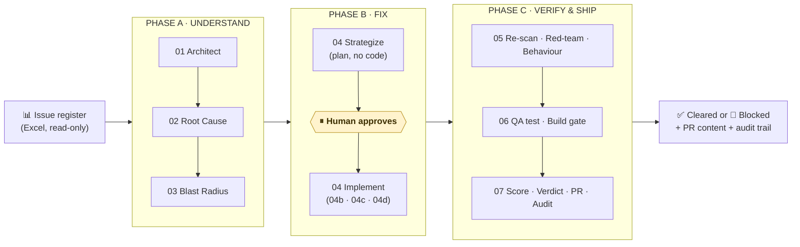

| Phase | Agents | The question it answers |
|---|---|---|
| 🔵 **A · Understand** | 01 – 03 | What does this codebase look like, *why* is this defect real, and *how far* does it reach? |
| 🟢 **B · Fix** | 04 | *How* should it be fixed, and what is the smallest change that does it? |
| 🟣 **C · Verify & Ship** | 05 – 07 | Is the fix really closed, bypass-proof, free of side effects, tested, buildable, and safe to ship? |

---

## 2. How MARS is built

### 2.1 Agents, skills, scripts and the runtime

MARS has four kinds of building block. Knowing which one does what explains almost every rule in
this document.

| Building block | What it is | What it is allowed to do |
|---|---|---|
| **Agent** | A Markdown persona (`NN_name.agent.md`) that an AI runtime follows. It says what the agent is for, which skills it drives, its procedure, its hard constraints and how it reports back. | Read briefings and code, reason, and write **judgement** into JSON files that must match a schema. |
| **Skill** | A self-contained folder (`SKILL.md`, scripts, JSON schemas, templates, catalogs, policies). Each one can be copied to another repository on its own. | Provide the tools and the rules for one job. |
| **Script** | A deterministic Node.js program inside a skill. | **Measure facts**, apply patches in isolation, run builds and tests, validate JSON, and render the final Markdown. Scripts never guess. |
| **AI runtime** | GitHub Copilot Chat (reads `.github/agents`) or Claude Code (reads `.claude/agents`). | Load an agent persona and run it. |

> **There is no AI SDK inside the pipeline.** All reasoning is done by the agent runtime, inside
> schemas. The single exception is an optional fallback in skill `01b`, which can ask an LLM API
> to draft descriptions when the workload is too large for one agent session.

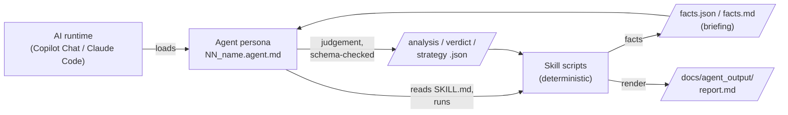

### 2.2 System context

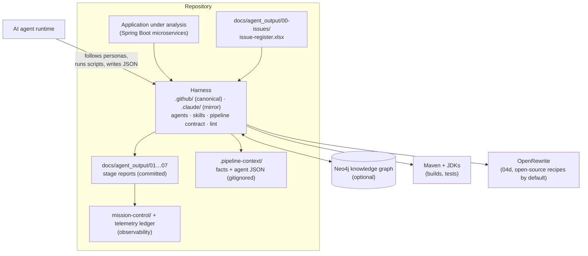

### 2.3 `.github` and `.claude`

- **`.github/` is the canonical harness.** Its agents use GitHub Copilot-style front matter, and its
  working data lives in `.github/.pipeline-context/`.
- **`.claude/` is a path-swapped mirror** of the same agents and skills, so the identical pipeline
  runs in Claude Code. Its working data lives in `.claude/.pipeline-context/`.
- The `.claude` copy of skill `04d-version-migration` is a pointer to the `.github` copy, which is
  the only full version.
- `pipeline-contract.md` (in both folders) is the single source of truth for ownership, status
  transitions, routing and release authority. Agent and skill prose must agree with it, and
  `pipeline-lint.js` checks that they do.
- The telemetry hooks and `record-decision.js` live under `.claude/scripts/` (Section 14).

### 2.4 The 7 agents at a glance

| # | Agent | Phase | One-line job | Writes to |
|---|---|---|---|---|
| **01** | `01_architect` | A | Turns source into a code model, a meaning layer, a knowledge graph and architecture documents. Runs once per codebase. | `01-architecture/`, Neo4j |
| **02** | `02_root-cause-analyst` | A | Finds the single root cause of each reported issue, explained so a non-engineer can follow it. | `02-root-cause/` |
| **03** | `03_blast-radius-analyst` | A | Measures how far each defect reaches: services, endpoints, jobs, people. Sets the priority. | `03-blast-radius/` |
| **04** | `04_fix-generator` | B | Stage 1 writes a fix **plan** (never code). After a human approves it, Stage 2 writes and verifies the smallest patch. The only agent that produces code. | `04-remediation/` |
| **05** | `05_existing-app-test-agent` | C | Three static checks on every patch: re-scan, red-team, behaviour guard. | `05-verify/` |
| **06** | `06_additional-test-execution` | C | Writes one regression test, then lets scripts run it and run the full build. Exit codes decide. | `06-test-gate/` |
| **07** | `07_audit-and-pr` | C | Scores everything into **Cleared** or **Blocked**, writes PR content and the audit trail, and opens a PR only on request for a Cleared patch. | `07-ship/` |

### 2.5 The 18 skills at a glance

Skill folder numbers match the agent that runs them. One skill per agent gets a plain number
(`02`, `03`, `05`). An agent with several skills gets a letter per skill, in run order
(`01a`–`01d`, `04a`–`04d`, `06a`/`06b`, `07a`/`07b`). `00` is shared infrastructure with no single
owner.

| Skill | Run by | Used for | Kind of work |
|---|---|---|---|
| [`00-issue-register`](#5-the-input--skill-00-issue-register) | 02, 03, 04, 05, 07 | Reads the Excel register and owns its column contract | Deterministic loader |
| [`01a-code-cartographer`](#skill-01a--code-cartographer) | 01 | Parses every `pom.xml` and `.java` file into `artifacts.json` | Deterministic parser |
| [`01b-context-weaver`](#skill-01b--context-weaver) | 01 | Picks the important code nodes and validates the meaning the agent writes about them | Selection + validation gate |
| [`01c-graph-forge`](#skill-01c--graph-forge) | 01 | Loads the code model and the meaning layer into Neo4j | Deterministic loader |
| [`01d-blueprint-scribe`](#skill-01d--blueprint-scribe) | 01 | Writes `architecture.md` and `function-reference.md` | Deterministic renderer |
| [`02-root-cause-analyst`](#skill-02--root-cause-analyst) | 02 | Collects evidence, checks the diagnosis, renders the report | Collect · author · render |
| [`03-blast-radius-analyst`](#skill-03--blast-radius-analyst) | 03 | Measures reach, checks the narrative, renders a diagram-led report | Collect · author · render |
| [`04a-fix-strategist`](#skill-04a--fix-strategist) | 04 (Stage 1) | CWE catalog, remediation context, Fix Type routing, plan rendering | Collect · author · render |
| [`04a1-remediation-intelligence`](#skill-04a1--remediation-intelligence) | 04 (Stage 1 fallback 1) | Derives a strategy from a local knowledge base when the catalog has a gap | Ranked retrieval |
| [`04a2-remediation-research`](#skill-04a2--remediation-research) | 04 (Stage 1 fallback 2) | Structured security research when the catalog **and** the knowledge base have a gap | Guided investigation |
| [`04b-fixer`](#skill-04b--fixer) | 04 (Stage 2, `CODE_FIX`) | Verifies a code patch in a throwaway worktree and renders the fix report | Isolated verification |
| [`04c-dependency-upgrader`](#skill-04c--dependency-upgrader) | 04 (Stage 2, `DEPENDENCY_UPGRADE`) | Verifies a version bump, including the version Maven really resolves | Isolated verification |
| [`04d-version-migration`](#skill-04d--version-migration) | 04 (Stage 2, `VERSION_MIGRATION`) or direct | Migrates Spring Boot / Java versions in a sandbox and proves behaviour is preserved | Sandbox migration engine |
| [`05-verify`](#skill-05--verify) | 05 | Re-scan, red-team and behaviour-guard checks | Collect · author · render ×3 |
| [`06a-qa-runner`](#skill-06a--qa-runner) | 06 (Gate 1) | Runs the agent's one new regression test for real | Deterministic test gate |
| [`06b-build-gatekeeper`](#skill-06b--build-gatekeeper) | 06 (Gate 2) | Runs `mvn verify` and a dependency-tree diff | Deterministic build gate |
| [`07a-merge-arbiter`](#skill-07a--merge-arbiter) | 07 (Part 1) | Scores the five upstream reports against `scoring.json` | Deterministic scoring |
| [`07b-scribe`](#skill-07b--scribe) | 07 (Part 2) | Writes PR content and the chain-of-custody audit trail | Collect · author · render |

**Dependencies.** Skills `01a`, `01b`, `01c`, `01d`, `02` and `03` need an `npm install`. The
other twelve have **zero npm dependencies**. (`04a1` can optionally use a local Python environment
for semantic ranking.)

### 2.6 Which agent drives which skill

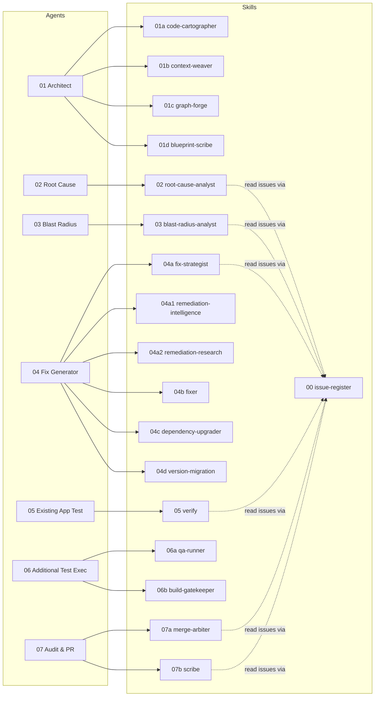

---

## 3. The ideas that make MARS trustworthy

### 3.1 Facts and judgement are never written by the same thing

This is the most important idea in MARS. Every stage that needs reasoning follows the same three
steps:

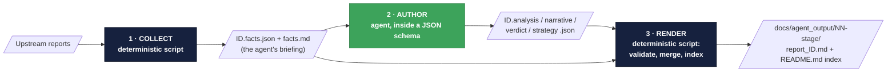

| Step | Who | Can it invent anything? |
|---|---|---|
| 1 · Collect | Node script | No. It only reads and measures. |
| 2 · Author | Agent | Only inside a schema. The renderer refuses missing required fields. |
| 3 · Render | Node script | No. It merges facts and judgement into Markdown and rewrites the stage's index. |

Because the two live in separate files, a reader can always tell **what was measured** from **what
was reasoned**, and an agent cannot overwrite a measured fact. Every skill also has a `list-*`
workload script that works out each issue's state purely from which files exist
(`not started` → `facts collected` → `judgement written` → `report written`).

### 3.2 The guarantees

| # | Guarantee | How it is enforced |
|---|---|---|
| 1 | **Facts ≠ judgement** | Separate files; schema-checked agent JSON; renderers merge them |
| 2 | **The real code is never touched by analysis** | Patches are applied in `git worktree` copies of `HEAD`, removed in a `finally` block. 04d works in a private sandbox with its own git repository. |
| 3 | **No code before a human approves** | Stage 2 refuses any plan whose Status cell is not exactly `Approved`. No script ever writes `Approved`. |
| 4 | **Determinism where it counts** | QA, build and scoring outcomes come from real exit codes and a JSON policy. An agent cannot soften a `Failed`. |
| 5 | **One release authority** | Only Agent 07's `Cleared` authorizes shipping. Its agent may only override `Cleared → Blocked`, never the reverse. |
| 6 | **Hard gates cannot be out-scored** | `STILL_VULNERABLE`, build `Failed`, and a migration that is not `PASS`/`PARTIAL PASS` always block. |
| 7 | **File-based hand-offs** | Stages talk only through files in `docs/agent_output/`. Each stage can be re-run, audited and reviewed on its own. |
| 8 | **Knowledge and policy are data** | The CWE catalog, the knowledge base, the ranking weights, the scoring policy, the migration ladder and the rules packs are editable JSON/Markdown, not code. |
| 9 | **Inputs are read-only** | The issue register and every upstream report are never written by a downstream stage. |
| 10 | **Always leave a record** | A Blocked patch still gets PR content (with a "do not open" banner) and a full audit trail. |
| 11 | **One job per agent** | No agent both writes code and judges it. No agent both diagnoses a cause and measures its reach. |

### 3.3 Hand-offs between stages are table cells

Downstream scripts read specific **"At a glance" table cells** by pattern, such as `| **Status** |`,
`| **Verdict** |`, `| **Fix Type** |` and `| **Decision** |`. That is how a stage knows what the
previous one decided. **Never hand-edit a rendered report**: changing one of those cells changes a
downstream decision (see [Section 18](#18-known-issues-and-gotchas), item 1).

---

## 4. The end-to-end workflow

### 4.1 Full flow


### 4.2 The life of one issue

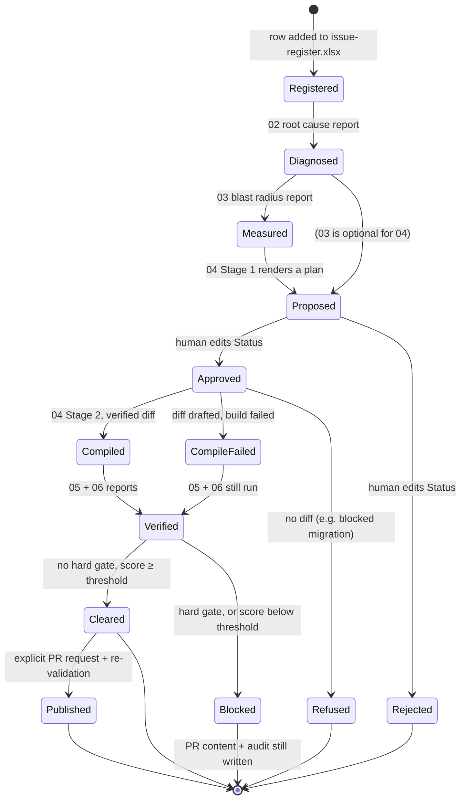

### 4.3 Who does what, over time

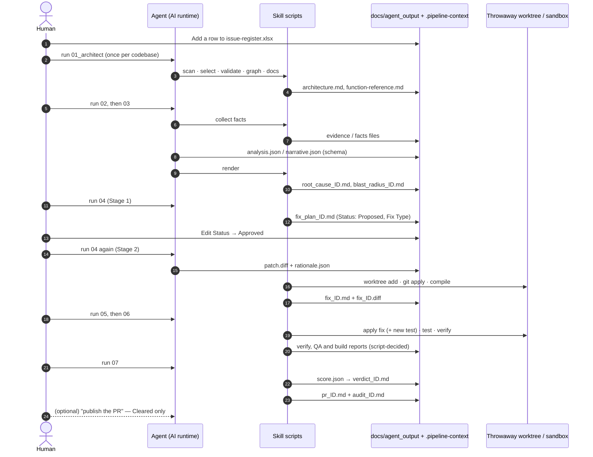

### 4.4 Run order and re-runs

1. **01 runs once per codebase**, and again only when the source changes. Re-runs are incremental.
2. **02 → 07 run in numeric order.** Each agent processes **every** eligible file the previous stage
   wrote, or one issue if you name it (for example `ISSUE-003`).
3. **04 runs twice.** First it proposes plans. After a human approves one or more, run it again to
   implement them.
4. **Any stage can be re-run on its own.** Every hand-off is a file, so a re-run only rewrites that
   stage's outputs.
5. **Every skill has a `list-*` script** that shows where each issue stands without changing
   anything.

---

## 5. The input — skill `00-issue-register`

| | |
|---|---|
| **Used for** | Serving the issue register to every agent that consumes issues, through one loader and one column contract |
| **Run by** | The skills of agents 02, 03, 04 (04a), 05 and 07 (07a, 07b) |
| **Reads** | `docs/agent_output/00-issues/issue-register.xlsx`, one row per issue |
| **Writes** | Nothing. The register is owned by whoever reports issues. |
| **Dependencies** | None. The XLSX reader is built on Node's own `zlib`. |

**Why a spreadsheet.** Issues come from people and tools that already work in spreadsheets: scanner
exports, tracker dumps, a reviewer's own sheet. A reporter adds a row and re-runs the agents. There
is no Markdown syntax to get wrong.

**What is inside the skill**

| Part | Role |
|---|---|
| `xlsx` reader | A minimal, zero-dependency reader for just the parts of the format the register needs |
| `register` library | The column contract, row → issue normalisation, and the synthesis of a Markdown body |
| `list-register` script | Prints the register exactly as the pipeline parses it (`--issue ID`, `--full` for the body) |

**The trick that keeps everything else unchanged.** Downstream skills pull three sections out of an
issue: `## Summary` (Blast Radius), `## Observed Behavior` (Root Cause) and `## Detection Notes`
(re-scan). The loader **rebuilds a Markdown body** from the spreadsheet's long-text columns using
those exact headings, so every consumer works without knowing the source is Excel.

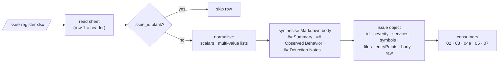

**Column contract.** Header names are the contract. Column order does not matter, unknown columns
are ignored, and rows without an `issue_id` are skipped.

| Group | Columns |
|---|---|
| Identity / triage | `issue_id` (required), `title`, `type` (Defect · Vulnerability · Performance · Security), `severity` (Critical · High · Medium · Low — sets the ship threshold), `status`, `reported_on`, `reported_by` |
| Location (multi-value: one per line or comma-separated) | `affected_services` (module names), `affected_symbols` (`Type.method`), `affected_files`, `entry_points` (`METHOD /path`) |
| Narrative (becomes Markdown headings) | `summary`, `affected_area`, `data_flow`, `observed_behavior`, `expected_behavior`, `steps_to_reproduce`, `impact`, `detection_notes` |

- `affected_symbols` and `affected_files` let Agent 02 find the defect in the graph.
- Every `` `backticked` `` token in `detection_notes` becomes a **grep signature** that Agent 05's
  re-scan checks against the patched code.
- **To add an issue:** append a row, run `list-register` to confirm it parses, then re-run from
  Agent 02.

---

## 6. Phase A · Understand

### 6.1 Agent 01 — Architect

**Purpose.** Turn the application source into the shared understanding every later stage relies on:
a parsed code model, a meaning ("context") layer, a Neo4j knowledge graph, and two architecture
documents. **It runs once per codebase** and incrementally after source changes. It is the only
agent that writes to the graph, so the accuracy of every later agent is bounded by its output.

| | |
|---|---|
| **Inputs** | Application source and every `pom.xml` |
| **Outputs** | `artifacts.json`, `context/descriptions.json`, the Neo4j graph, `architecture.md`, `function-reference.md` |
| **Skills, in order** | `01a` → `01b` → `01c` → `01d` |
| **Argument** | Nothing or `full` for the whole pipeline, or one module to focus on |

**The distinction that governs everything it does.**

- **Facts** come from the parser: "method A calls method B". They are not open to interpretation.
- **Context** is the agent's reading of those facts: "this call blocks on another service, and if
  that service is down the caller gets a 500". Downstream agents need both, but must always be able
  to tell them apart.

MARS keeps them apart structurally: context lives in its own file, every entry carries an author and
a confidence, and it loads into a separate `ctx*` property namespace in Neo4j.

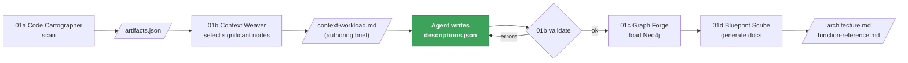

**Agent workflow, step by step**

1. **Scan** with `01a`. Re-run whenever source changed since the last scan.
2. **Select** with `01b`. This writes the authoring brief. Nodes already described against
   unchanged code do not reappear.
3. **Describe.** The agent reads the brief and writes `descriptions.json`. This is the step where
   the agent's judgement is the product. A large workload can be split over several passes (the
   file merges by node id) or handed to the optional LLM batch generator.
4. **Validate** with `01b`. Every error must be fixed. An invented node id or an overconfident claim
   would spread into every downstream agent, and none of them could detect it.
5. **Load** the graph with `01c`.
6. **Document** with `01d`.
7. **Report back** with counts only: files scanned, nodes described, graph nodes and relationships
   loaded, anything left undescribed or stale.

**What the agent writes for each node, and who uses it**

| Field | Meaning | Main consumer |
|---|---|---|
| `summary` | What it is and what it is for, in domain language. If it would still be true with the class renamed `Foo`, it says nothing. | Everyone |
| `failureModes` | How it realistically breaks and what the caller sees. **The highest-value field.** | Root Cause |
| `invariants` | What must hold for it to be correct. A violated invariant is usually the defect. | Root Cause |
| `sideEffects` | Writes, outbound calls, published events, mutated state. An empty list means genuinely pure. | Blast Radius |
| `testHints` | The request to replay, the fixture, the boundary to assert | QA |
| `criticality` | Damage a defect here would do, not code complexity | Blast Radius |
| `crossCutting` | Facts that belong to no single node: a shared datastore, a service dependency with no Java call edge | Everyone |
| `confidence`, `openQuestions`, `evidence` | How sure, what is unknown, and where each claim came from (`File.java:42`) | Everyone |

**Rules.** Never invent behaviour the code does not show. Say when intent is unclear
(`confidence: low` plus an open question). Cite evidence. Omit rather than pad. Copy each node's
`kind`, `id` and `fingerprint` exactly. Never load a graph with validation errors. Never print
credentials or full artifacts into chat.

---

#### Skill 01a — Code Cartographer

| | |
|---|---|
| **Used for** | Turning source into structured, queryable data: the raw material for every other Phase A skill |
| **Reads** | Every `pom.xml` and every `src/main/java/**/*.java` |
| **Writes** | `.pipeline-context/artifacts.json` (gitignored, overwritten each run) |
| **Technology** | A real syntax tree via **tree-sitter** (Java grammar, WASM), not regular expressions |

**What it extracts**

| From | It records |
|---|---|
| `pom.xml` | Each Maven module: `groupId`, `artifactId`, `version`, packaging, dependencies |
| Each Java type | Package, kind (class / interface / enum / record), line range, annotations with arguments, `extends` / `implements`, fields (name, type, annotations) |
| Each method | Name, return type, parameters, annotations, REST mapping, **call sites** (for the call graph), line range, and the **exact source text** (for the function reference) |

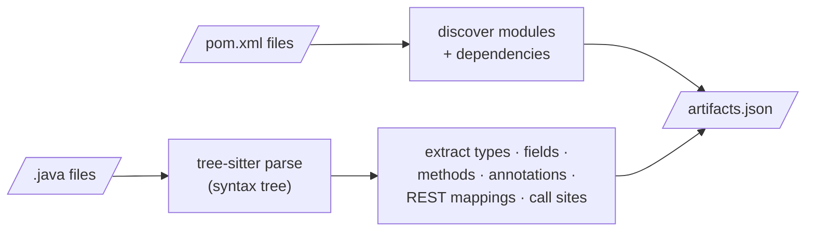

Because it uses a real parser, nested generics, annotations with arguments, inheritance and
overloaded methods are captured correctly. Only Java is parsed today; another language would be
added as another tree-sitter grammar in the same skill.

---

#### Skill 01b — Context Weaver

| | |
|---|---|
| **Used for** | Adding the meaning layer: choosing which nodes deserve a description, briefing the agent with real evidence, validating what it writes, and serving it back |
| **Reads** | `artifacts.json`, and existing `descriptions.json` |
| **Writes** | `context/context-workload.{json,md}` (the brief) and validates `context/descriptions.json` (written by the agent). `descriptions.json` is the **one tracked file** in `.pipeline-context`, because it is expensive to recreate. |

`01a` answers **what exists**. This skill answers **what it means**.

**What is inside the skill**

| Part | Role |
|---|---|
| Workload selector | Scores every node and lists only the significant ones that are new or stale |
| Validator | The gate: schema shape, no phantom node ids, no duplicates, freshness. `--strict` turns stale warnings into errors. |
| Lookup tool | The read side: resolves a symbol, module or search term and returns stored context labelled with confidence and staleness. Works without Neo4j. |
| Batch generator (optional) | For a workload too large for one agent: sends the same brief to Anthropic, OpenAI or Google in batches, pinned to the schema. A failed run never touches the file. |
| Schema + worked example | `descriptions.schema.json`, `descriptions.example.json` |

**How nodes are selected.** Scored rather than rule-listed, so the threshold is one knob.

| Node kind | Selected when |
|---|---|
| `Module` | Always — service boundaries are the cheapest, highest-value context |
| `Package` | It holds 2 or more types |
| `Type` | Score ≥ 3: Spring stereotype (+3), exposes endpoints (+3), interface with an implementation (+3), extends a framework base (+3), scheduled job (+2), holds an HTTP client (+2), fan-in ≥ 2 (+2), injects in-repo collaborators (+1) |
| `Method` | Score ≥ 3 and not a trivial accessor: REST handler (+4), `@Scheduled` (+4), ≥ 2 callers (+3), ≥ 2 callees (+2), outbound HTTP call (+2), interface contract (+2), > 15 lines (+1) |
| `Endpoint` | Always — the external contract, where every investigation starts |
| `ExternalType` | Always — framework bases like `MongoRepository` contribute methods the parser never sees |

On the sample application this selects about 77 of roughly 108 nodes, leaving DTOs and enums out.

**Staleness — what keeps it honest.** Every description carries a **fingerprint** of the code it
was written for (for a method, its normalised source). The selector recomputes it to decide what to
re-describe, and Graph Forge recomputes it at load time and marks drifted nodes `ctxStale = true`.
Consumers ignore stale entries.

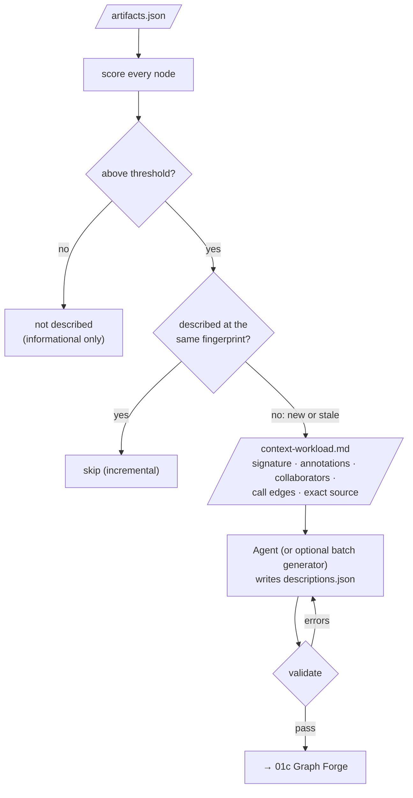

---

#### Skill 01c — Graph Forge

| | |
|---|---|
| **Used for** | Loading the code model into Neo4j so architecture questions can be answered with Cypher, and attaching the meaning layer to the same nodes |
| **Reads** | `artifacts.json`, optional `descriptions.json`, Neo4j connection details from the skill's own `.env` |
| **Writes** | The Neo4j graph (uniqueness constraints, then `MERGE` of nodes and relationships, so a re-run updates rather than duplicates) |

**Graph model**

| Node | Key | Notes |
|---|---|---|
| `Module` | `name` | One per Maven module |
| `Package` | `name` | Java package |
| `Type` | fully qualified name | class / interface / enum / record |
| `Method` | `Type#name(paramTypes)` | Distinguishes overloads |
| `Endpoint` | `METHOD path` | From the mapping annotations plus the class-level base path |
| `MavenDependency` | `groupId:artifactId` | Third-party libraries |
| `ExternalType` | `name` | A base class or interface not defined in the repository |
| `ContextNote` | topic | A cross-cutting fact from the meaning layer |

| Relationship | Meaning |
|---|---|
| `Module -[:CONTAINS]-> Package/Type`, `Package -[:CONTAINS]-> Type` | Structure |
| `Module -[:DEPENDS_ON]-> MavenDependency` | `pom.xml` dependency |
| `Type -[:EXTENDS / IMPLEMENTS]-> Type/ExternalType` | Inheritance |
| `Type -[:HAS_METHOD]-> Method` | Ownership |
| `Type -[:EXPOSES]-> Endpoint` | REST surface |
| `Type -[:USES]-> Type` | A field's type references another type (best effort) |
| `Method -[:CALLS]-> Method` | Call graph (best effort, matched by method name) |
| `ContextNote -[:ABOUT]-> Module/Type` | A cross-cutting fact attached to everything it concerns |

**The meaning layer (`ctx*` properties).** `ctxSummary`, `ctxRole`, `ctxCriticality`,
`ctxResponsibilities`, `ctxInvariants`, `ctxFailureModes`, `ctxSideEffects`, `ctxDataTouched`,
`ctxUpstream` / `ctxDownstream`, `ctxTestHints`, `ctxOpenQuestions`, `ctxEvidence`, `ctxAuthor`,
`ctxConfidence`, `ctxFingerprint`, `ctxStale`, plus a full-text index `context_search` so a
reported symptom can be matched to the node whose failure modes describe it.

- The `ctx` prefix is load-bearing: it keeps interpretation from ever overwriting or being mistaken
  for parser output.
- Descriptions only annotate nodes the parser found. The loader uses `MATCH`, never `MERGE`, for
  them, so an unknown id is skipped rather than inventing a node.
- `descriptions.json` is the source of truth; the graph is a loaded copy.

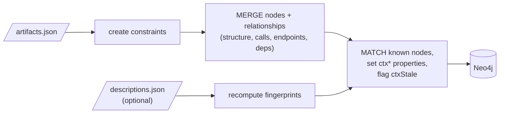

---

#### Skill 01d — Blueprint Scribe

| | |
|---|---|
| **Used for** | Writing the two human-readable architecture documents every later agent reads |
| **Reads** | `artifacts.json`, plus live Neo4j counts when reachable (falls back to static-only otherwise) |
| **Writes** | `docs/agent_output/01-architecture/architecture.md` and `function-reference.md` |

| Document | Contents |
|---|---|
| `architecture.md` (overview) | Module table, Mermaid service map, layered type breakdown per module (controller, service, repository, entity, DTO, configuration, exception), REST API surface, external frameworks, live graph snapshot, "Ideas & Observations" |
| `function-reference.md` (deep dive) | One entry per method: exact signature, file and line range, annotations, REST mapping, resolved **Calls** / **Called by** (computed from `artifacts.json`, no Neo4j needed), and the exact method source |


---

### 6.2 Agent 02 — Root Cause Analyst

**Purpose.** For every row in the register, find **the one root cause**, cite the evidence, and
explain it so a non-engineer can follow. It diagnoses only. It does not map spread (Agent 03) and
does not patch (Agent 04). It never writes, edits or invents an issue.

| | |
|---|---|
| **Inputs (all four, for every issue)** | 1. The issue row · 2. `architecture.md` · 3. `function-reference.md` · 4. The Neo4j graph |
| **Output** | `docs/agent_output/02-root-cause/root_cause_ID.md`, one per issue |
| **Skills** | `02-root-cause-analyst` (and `00-issue-register` for the rows) |
| **Argument** | Nothing (every issue) or one issue id |

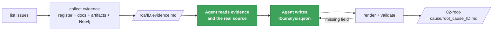

**Agent workflow**

1. **Discover the workload.** Analyse exactly the issues listed — no more, no fewer.
2. **Collect evidence for all of them.** Each issue is processed independently; one failure does not
   stop the rest.
3. **Per issue: read the briefing, then the code.** Separate the **defect site** from methods merely
   on the path to it. Note every endpoint, scheduled job, module and cross-service consumer in the
   affected area, and anything the evidence does *not* show.
4. **Per issue: write the analysis** — one root cause, cited evidence, a causal chain from trigger to
   symptom, impact consistent with the measured area, a fix that addresses the cause, verification
   steps, a plain-language summary and the expected correct flow.
5. **Render**, fix any validation error, re-render.
6. **Confirm coverage**: every issue reads `report written`.

**Rules.** One root cause per issue (a second independent defect is a second issue). A cause, not a
symptom ("the handler calls itself instead of the injected service", not "a StackOverflowError is
thrown"). Never invent classes, methods, edges or config. Set confidence honestly and put unproven
points in `open_questions`. Keep issues independent. Do not map spread.

#### Skill 02 — Root Cause Analyst

| | |
|---|---|
| **Used for** | Evidence collection, the analysis schema, and report rendering for Agent 02 |
| **Writes** | `.pipeline-context/rca/ID.evidence.{json,md}`, validates `ID.analysis.json`, renders `root_cause_ID.md` |

**What is inside the skill**

| Part | Role |
|---|---|
| `list-issues` | The register and each issue's state: `not started` → `evidence collected` → `analysis written` → `report written` |
| `collect-evidence` | The fact collector (below). Flags: `--depth 1-8` (default 4), `--no-graph` |
| `render-root-cause` | Validates the analysis, merges it with the evidence, writes the report, lists anything pending |
| `analysis.schema.json` + example | The judgement contract |

**What the evidence collector does**

- Resolves `affected_symbols` against `artifacts.json` and builds a static call graph, including
  interface → implementation edges.
- Walks callers and callees in both directions.
- **Flags self-recursion**, and flags **"missing delegation"**: an injected collaborator has a
  same-named method that the focus method never calls.
- Collects the affected area: modules, endpoints, `@Scheduled` jobs, and cross-service HTTP clients
  that no Java call edge captures.
- Queries Neo4j for callers, callees, owning type, dependants and Maven dependencies. If Neo4j is
  unreachable it says so, falls back to the static graph, and the report records the fallback.
- Slices the matching rows out of `architecture.md` and entries out of `function-reference.md`.

**Analysis contract.** Required: `summary`, `root_cause` (statement, explanation, defect location),
`causal_chain` (≥ 2 steps), `impact`, `recommended_fix`, `verification`. Optional: `confidence`,
`plain_summary` (the headline, no class names), `expected_flow` (2–5 short correct steps),
`contributing_factors`, `prevention`, `open_questions`.

**Report layout.** Read top-down by whoever must decide, not only the engineer: plain-language
headline → *At a glance* table → what was reported → what should happen vs what happens (green/red
diagram) → how it fails, step by step (flow ending in red) → where the defect is (call-graph diagram,
method table, source folded away) → what it means → why it happened → how to fix it → how to check
the fix → how to stop it recurring → open questions → appendix (inputs used and Cypher run).

---

### 6.3 Agent 03 — Blast Radius Analyst

**Purpose.** Agent 02 establishes **why** a defect exists. Agent 03 establishes **what else breaks
because of it** — services, endpoints, scheduled jobs, cross-service calls and shared
infrastructure — in language and diagrams a non-engineer can follow, and assigns a priority based on
real reachability rather than theoretical severity.

| | |
|---|---|
| **Inputs (all five)** | Root cause reports (the workload) · issue rows · `architecture.md` · `function-reference.md` · Neo4j |
| **Output** | `docs/agent_output/03-blast-radius/blast_radius_ID.md`, one per root cause |
| **Skill** | `03-blast-radius-analyst` |

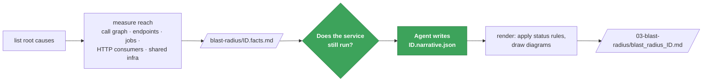

**Agent workflow**

1. **Discover the workload.** If no root cause reports exist, stop and say Agent 02 must run first.
2. **Measure the reach** for every defect, independently.
3. **Per defect: read the facts, then the root cause report.** Settle the decisive question first:
   does the service still **run** with this defect, or does it fail to build, start or stay up? That
   decides whether one endpoint is down or the whole service is.
4. **Per defect: write the narrative** — scope, the ripple ring by ring, who feels it, and what is
   explicitly **not** affected.
5. **Render**, then confirm every row reads `report written`.

**Rules.** Never re-diagnose or contradict a root cause report (raise it with the user instead).
Never restate the fix — link to it. Never name a service, endpoint or job the facts do not list
(wider suspicions go in `open_questions`). Never blur **broken** (the request fails) with
**degraded** (it succeeds with missing, stale or slow results). Never skip `not_affected`.

#### Skill 03 — Blast Radius Analyst

| | |
|---|---|
| **Used for** | Measuring reach so it cannot be over- or under-stated, then rendering a diagram-led report |
| **Writes** | `.pipeline-context/blast-radius/ID.facts.{json,md}`, validates `ID.narrative.json`, renders the report |

**What is inside the skill**

| Part | Role |
|---|---|
| `list-root-causes` | Workload and state: `not started` → `reach measured` → `narrative written` → `report written` |
| `collect-impact` | Finds defect sites; walks callers back to every endpoint and `@Scheduled` job; inventories each module; finds confirmed cross-service HTTP consumers; works out platform topology (service registry, config server, shared datastore); cross-checks with Neo4j. Flags: `--depth 1-10` (default 6), `--no-graph`. |
| `render-blast-radius` | Validates, applies the status rules, draws three diagrams, writes the report |
| `narrative.schema.json` + example | The judgement contract |

The skill deliberately carries its own code model rather than importing Agent 02's, so neither skill
breaks if the other moves. The briefing gives **two endpoint counts** — endpoints whose handler
reaches the defect, and every endpoint the broken service hosts — so the agent picks the right one
on purpose.

**Status rules (applied by the script)**

| Status | Rule |
|---|---|
| 🔴 **Broken** | The module is in the issue's `affected_services`, or is a defect-site module |
| 🟠 **Degraded** | The module holds a **confirmed** HTTP consumer of a broken module |
| 🟡 **At risk** | `multi-service` scope only: shares the datastore with a broken module |
| 🟢 **Unaffected** | Everything else |

Endpoints follow the scope: for `endpoint` scope only handlers that reach the defect are Broken; for
`service` and `multi-service` scope every endpoint of a broken module is Broken.

**Narrative contract.** Required: `scope` (endpoint · service · multi-service), `headline`,
`what_is_broken`, `ripple`, `user_impact` (who, what they see, status), `priority` (for example
"P1 — reason"). Optional: `confidence`, `failure_note`, `not_affected`, `containment` (what to
disable, monitor or communicate now — not the fix), `if_unfixed`, `open_questions`.

**Report layout.** At a glance (priority, severity, services broken / degraded, endpoints down, jobs
hit) → what is broken → how far it spreads (ring diagram) → which services (colour-coded map +
table) → which endpoints → what happens on a single request → who feels it → what is NOT affected →
containment and priority → how it was measured.

---

## 7. Phase B · Fix — Agent 04 Fix Generator

**Purpose.** Turn a diagnosed defect into a verified patch, in **two strictly gated stages** with a
human in between. It is the only agent that produces code, and it never edits the real code.

| Stage | Question | Output | Skills |
|---|---|---|---|
| **Stage 1 — Strategize** | *How* should this be fixed? | `fix_plan_ID.md`, `Status: Proposed`, **never a diff** | `04a` → fallbacks `04a1` → `04a2` |
| ⏸ **Human checkpoint** | Is this the right approach? | Status cell edited to `Approved` or `Rejected` | — |
| **Stage 2 — Implement** | What is the smallest change that does it? | `fix_ID.md` + `fix_ID.diff` | `04b` · `04c` · `04d`, chosen by **Fix Type** |

| | |
|---|---|
| **Inputs** | Root cause reports (Stage 1 workload) · blast radius reports, if present · issue rows · the CWE catalog · the plans (Stage 2 reads their Status) · the current source of every affected file |
| **Read-only to it** | `00-issues/`, `02-root-cause/`, `03-blast-radius/`; and in Stage 2, the plan files themselves |

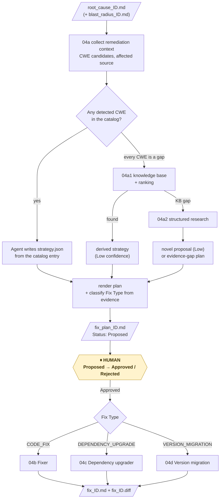

**Key rules for the agent**

- **No code in Stage 1.** An optional `illustrative_sketch` must read as illustrative.
- **One CWE per plan**, cited from the catalog. Fallbacks run in order `04a` → `04a1` → `04a2`, are
  never skipped, and never run when any detected CWE is catalogued.
- **Never set a plan to `Approved` or `Rejected`**, and never reset an approved or rejected plan to
  `Proposed` by re-rendering it.
- **Refuse any Stage 2 plan that is not exactly `Approved`** — once, plainly, without negotiating.
  "A strongly-worded request is not approval."
- **Never edit real source.** Never route by keyword; route by the plan's Fix Type. Never run
  `apply-migration --to-project` as part of Stage 2.
- **`Compiled` is not a ship signal.** Agents 05 → 06 → 07 must still run.

---

## 8. Agent 04, Stage 1 — Strategize

Stage 1 resolves a strategy from three levels of knowledge, stopping at the first one that has an
answer:

| Level | Skill | Knowledge source | Meaning | Confidence |
|---|---|---|---|---|
| 1 | `04a-fix-strategist` | Curated CWE catalog | We already know the remediation pattern | Set honestly by the agent |
| 2 | `04a1-remediation-intelligence` | Local knowledge base of historical fixes | We have relevant prior knowledge | Always **Low** |
| 3 | `04a2-remediation-research` | Structured security investigation | No known remediation; develop a new proposal | Always **Low** |

All three write the **same** `ID.strategy.json`, which the same renderer turns into a
`Status: Proposed` plan. Stage 2 never needs to know which level produced it.

#### Skill 04a — Fix Strategist

| | |
|---|---|
| **Used for** | Deciding *how* a defect should be fixed — before any code — by matching it to a CWE-aligned remediation pattern, and classifying the kind of change (Fix Type) |
| **Reads** | Root cause report · blast radius report (optional) · issue row · current source of every affected file · `catalog/cwe-patterns.json` |
| **Writes** | `.pipeline-context/fix-strategy/ID.context.{json,md}`, validates `ID.strategy.json`, renders `docs/agent_output/04-remediation/fix_plan_ID.md` and the folder's `README.md` index |

**What is inside the skill**

| Part | Role |
|---|---|
| `list-remediation-workload` | Every root cause report with its plan state and Status. `--pending` shows plans not yet decided. |
| `collect-remediation-context` | Reads the diagnosis, the blast radius, the issue row and the affected source; finds every `CWE-nnn` mention and tags each one **in catalog** or **catalog gap**. Fails loudly if a root cause has no issue row. |
| `render-fix-plan` | Validates the strategy, classifies the Fix Type, renders the plan, preserves an existing human decision |
| `routing` library | Classifies **Fix Type** from the strategy *and* the real `pom.xml` |
| `catalog/cwe-patterns.json` | The curated knowledge (below) |
| `strategy.schema.json` + example | The judgement contract |

**The CWE catalog (11 entries).** Each has a title, an OWASP category, `applicable_when`,
`canonical_approach`, `anti_patterns` and `references`.

| CWE | Pattern | OWASP 2021 |
|---|---|---|
| CWE-943 | NoSQL / data-query injection | A03 Injection |
| CWE-89 | SQL injection | A03 Injection |
| CWE-79 | Cross-site scripting | A03 Injection |
| CWE-306 | Missing authentication for a critical function | A01 Broken Access Control |
| CWE-284 | Improper access control | A01 Broken Access Control |
| CWE-200 | Exposure of sensitive information | A01 Broken Access Control |
| CWE-532 | Sensitive information in log files | A09 Logging & Monitoring Failures |
| CWE-770 | Resource allocation without limits | A04 Insecure Design |
| CWE-400 | Uncontrolled resource consumption | A04 Insecure Design |
| CWE-798 | Hard-coded credentials | A07 Identification & Authentication Failures |
| CWE-1104 | Unmaintained third-party components | A06 Vulnerable & Outdated Components |

**Strategy contract.** Required: `cwe`, `plain_summary`, `approach`, `catalog_reference`,
`affected_files` (each with a prose `planned_change`, no diff), `verification_plan` (steps Stage 2
can execute). Optional: `confidence`, `alternatives_considered` (with why rejected), `risk_notes`,
`illustrative_sketch`, `open_questions`, and **at most one** of `dependency_upgrade` or
`version_migration`. Fallback-produced strategies add `derived_pattern` provenance.


**Plan layout.** Plain-language headline → *At a glance* (Status, Fix Type, CWE + OWASP, files,
confidence, links) → remediation approach → alternatives considered → planned changes per file (no
diff) → risks to watch → how the fix must be verified → **Routing decision** (the Fix Type evidence)
→ approval instructions → appendix of inputs. A migration plan also carries a hidden,
machine-readable migration request that skill `04d` reads.

---

#### Skill 04a1 — Remediation Intelligence

| | |
|---|---|
| **Used for** | Fallback 1. When **every** detected CWE is missing from the catalog, derive a grounded, cited, Low-confidence strategy from a local knowledge base instead of leaving a hollow plan |
| **Fires when** | All detected CWEs are catalog gaps. Not when any CWE is catalogued; not when no CWE was detected. |
| **Reads** | `04a`'s context bundle · the main catalog (through `04a`'s own library, so "gap" means the same thing) · `knowledge/remediation-kb.json` + `knowledge/refs/` · `ranking-weights.json` · optional local embedding model |
| **Writes** | The same `ID.strategy.json`, with `confidence: Low`, `catalog_reference.title: null`, a "Derived by the 04a1 fallback" note, and a `derived_pattern` provenance block |
| **Never** | Invents a pattern, reaches the network or model memory, writes a diff, or approves |

**The knowledge base today**

| CWE | Topic | Historical fixes |
|---|---|---|
| CWE-22 | Path traversal | 2 |
| CWE-918 | Server-side request forgery | 1 |
| CWE-359 | Exposure of private personal information | 1 |
| CWE-862 | Missing authorization | 1 |

**How ranking works.** When a gap CWE has several historical fixes, each one is scored on up to
three independent signals and combined using weights from `ranking-weights.json`:

| Signal | What it measures | Weight |
|---|---|---|
| `keyword_score` | Exact keyword hits (weight 1.0) and synonym hits (weight 0.5) against the root-cause text, normalised | 0.3 |
| `tfidf_score` | TF-IDF cosine similarity across every fix in the KB, so rare specific words count more than common ones | 0.3 |
| `embedding_score` | Real sentence-embedding similarity from a local `all-MiniLM-L6-v2` model — the only signal that recognises paraphrases nobody anticipated | 0.4 (optional) |

If the local model is not installed, `embedding_score` is recorded as `null` and the other two
weights are renormalised — visible, not silent. Ranking is deterministic for a given model. Every
candidate's full score breakdown is written into the plan's provenance.

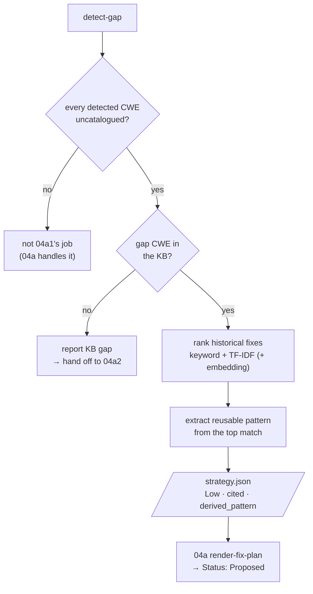

**Self-test.** A bundled path-traversal (CWE-22) sample, plus a paraphrased version sharing **zero**
exact keywords with the KB, are run through the whole fallback and rendered in a temporary
directory. It asserts a Proposed, Low-confidence plan with provenance and a correctly ordered score
breakdown.

**Promotion path.** A KB pattern that proves itself should be promoted into the main catalog, after
which that CWE is no longer a gap. The goal is to shrink the catalog's blind spots, not to run a
second catalog forever.

---

#### Skill 04a2 — Remediation Research

| | |
|---|---|
| **Used for** | Fallback 2, the deepest level. When a CWE is in **neither** the catalog **nor** the knowledge base, run a structured, evidence-driven security investigation and produce a novel remediation proposal for human review |
| **Fires when** | `04a1` reports a KB gap |
| **Reads** | Root cause report · blast radius report (if any) · issue row and vulnerable source · catalog + KB (to confirm the double gap) |
| **Writes** | `.pipeline-context/research/ID.analysis.json` (agent), then a base-contract `ID.strategy.json` with `remediation_source: 04a2-remediation-research`, `confidence: Low`, `derived_pattern.type: novel-research`, a `research` payload, `promotion_candidate: true`, and a separate promotion-candidate file |
| **Never** | Invents a remediation without analysis, fabricates a citation (no web access → labelled *internally derived*), writes a diff, self-approves, or raises its own confidence |

**The 13-step research method** (the agent authors steps 3–12):

```mermaid
flowchart LR
    S1["1 Confirm<br/>the gap"] --> S2["2 Collect context<br/>(Agents 1–3)"] --> S3["3 Understand the<br/>vulnerability"] --> S4["4 Validate root cause<br/>facts · conclusions ·<br/>hypotheses"]
    S4 --> S5["5 Threat<br/>model"] --> S6["6 Security objective<br/>(the invariant)"] --> S7["7 Research<br/>approaches"] --> S8["8 Generate<br/>≥ 2 candidates"]
    S8 --> S9["9 Evaluate<br/>them"] --> S10["10 Select the<br/>smallest safe one"] --> S11["11 Define<br/>validation tests"] --> S12["12 Attach evidence<br/>+ provenance"] --> S13["13 Emit strategy.json<br/>(Low, Proposed)"]
```

Each **candidate** records its approach, security mechanism, affected layer, advantages,
limitations, bypass risks, behavioural risks, implementation complexity and validation requirements.

**When the evidence is too thin** (`research_status: insufficient_evidence`), it does **not**
dead-end and does **not** invent a confident fix. It produces a **Proposed evidence-gap plan**: what
is known, what evidence is missing, and a conservative default, clearly marked for a human.

| | 04a | 04a1 | 04a2 |
|---|---|---|---|
| Knowledge | Catalog | KB / historical fixes | Novel investigation |
| Confidence | Established | Derived (Low) | Low, always |
| Citations | Catalog entry | KB references | Internal reasoning; none fabricated |
| Multiple candidates | No | No | Yes (≥ 2) |
| No confident fix | — | Reports KB gap | Evidence-gap plan → human |

**Learning loop.** A 04a2 remediation that is approved, implemented, verified, tested and
**Cleared** becomes eligible for promotion into the KB. 04a2 only writes the promotion candidate; a
human promotes it, after which `04a1` handles similar issues.

**Self-test.** Runs the full path on a bundled double-gap sample (CWE-502) and an evidence-gap sample
in a temporary directory, asserting: 04a2 fired, Low confidence, both gaps, ≥ 2 candidates,
`Status: Proposed`, no diff, no auto-approval, honest provenance.

---

## 9. The human checkpoint and Fix Type routing

### 9.1 The approval checkpoint

- A person opens `fix_plan_ID.md` and changes the **Status** cell from `Proposed` to `Approved` (or
  `Rejected`). The comparison is an exact string match.
- An optional **Approved by** cell records who approved it.
- **Nothing in the pipeline ever writes `Approved`.** A re-render keeps an existing human decision
  and appends a note instead of resetting it.
- `record-decision.js` offers an attributed, hash-chained way to make the same edit (Section 14).

This is where it is cheapest to change the approach: no code has been written yet.

### 9.2 Fix Type — choosing the Stage 2 skill

Every rendered plan carries one **Fix Type**, classified by `04a`'s routing library from the
strategy **and** the build descriptor on disk — never from a keyword.

| Fix Type | Stage 2 skill | When | Evidence required |
|---|---|---|---|
| `CODE_FIX` | `04b-fixer` | A code change for the diagnosed defect | — |
| `DEPENDENCY_UPGRADE` | `04c-dependency-upgrader` | One library coordinate bumped to a fixed version (CWE-1104) | It must **not** move a platform parent or BOM across a major generation — that is refused with "plan it as `version_migration`" |
| `VERSION_MIGRATION` | `04d-version-migration` | The platform parent/BOM crosses a **major generation**, and/or the Java level changes | `pom.xml` really declares the platform at exactly `source_version`, and the jump really changes the generation or Java level |

A contradiction is **refused, not quietly re-routed**. A dependency merely being present is never a
reason to migrate. The plan's **Routing decision** section lists the evidence. Plans rendered before
Fix Type existed are routed by CWE (`CWE-1104` → 04c, anything else → 04b).

```mermaid
flowchart TD
    ST[/"strategy.json"/] --> VM{"version_migration<br/>recorded?"}
    VM -->|yes| CK1{"pom.xml declares source_version<br/>AND major or Java jump?"}
    CK1 -->|yes| T3["VERSION_MIGRATION → 04d"]
    CK1 -->|no| REF1["refuse plan"]
    VM -->|no| DU{"dependency_upgrade<br/>recorded?"}
    DU -->|yes| CK2{"platform parent/BOM<br/>across a major?"}
    CK2 -->|yes| REF2["refuse: plan it as<br/>version_migration"]
    CK2 -->|no| T2["DEPENDENCY_UPGRADE → 04c"]
    DU -->|no| T1["CODE_FIX → 04b"]
```

All three Stage 2 skills write the **same hand-off** — `fix_ID.md` + `fix_ID.diff` with the Status
`Compiled` / `Compile Failed` / `Refused` — so Agents 05–07 consume them identically.

---

## 10. Agent 04, Stage 2 — Implement

#### Skill 04b — Fixer

| | |
|---|---|
| **Used for** | Turning an **Approved `CODE_FIX`** plan into a small, verified, reviewable diff |
| **Reads** | The plan (Status must be exactly `Approved`) · its `affected_files` and `planned_change` · the current source |
| **Writes** | `.pipeline-context/fixer/ID.patch.diff` + `ID.rationale.json` (agent), `ID.verification.{json,md}` (script); renders `fix_ID.md` and a standalone, `git apply`-able `fix_ID.diff` |
| **Never** | Edits the real working tree; acts on a plan that is not `Approved`; claims a verification that did not pass |

**What is inside the skill**

| Part | Role |
|---|---|
| `list-fix-workload` | Every plan with its Status and fixer state. `--approved` narrows to Approved. |
| `verify-patch` | The isolated verifier (below). Refuses outright if the plan is not Approved. `--test Class` adds a targeted test; `--keep` keeps the worktree for debugging only. |
| `render-fix-report` | Writes the report and the `.diff`, rewrites the shared index. The Status always reflects the real result. |
| `rationale.schema.json` + example | `summary`, `files_changed`, `matches_plan`, and when it does not, `deviations` with reasons; plus `residual_risk`, `open_questions` |

```mermaid
flowchart LR
    P[/"Approved plan"/] --> A["Agent drafts smallest diff<br/>in the file's existing style"]
    A --> R["Agent writes rationale.json<br/>(deviations if code ≠ plan)"]
    R --> V["verify-patch"]
    subgraph WT["Throwaway worktree of HEAD"]
      direction TB
      W1["git apply --check"] --> W2["git apply"] --> W3["detect affected module"] --> W4["mvnw compile<br/>(+ named test)"]
    end
    V --> WT
    WT --> RM["worktree removed"]
    RM --> REN["render"]
    REN --> O[/"fix_ID.md + fix_ID.diff<br/>Compiled · Compile Failed · Refused"/]

    classDef agent fill:#3DA35B,stroke:#26773f,color:#fff,font-weight:bold
    class A,R agent
```

**Report layout.** Plain-language summary → *At a glance* (Status, CWE, plan link, files changed,
verification level, matches plan?) → what changed per file → the diff → why this is the smallest
correct diff → deviations from the plan → verification evidence (folded) → residual risk → how to
apply the patch.

---

#### Skill 04c — Dependency Upgrader

| | |
|---|---|
| **Used for** | Turning an **Approved `DEPENDENCY_UPGRADE`** (CWE-1104) plan into a version-bump diff, and proving the new version really takes effect |
| **Reads** | The plan's **Dependency** row (`maven_coordinate`, `current_version`, `minimum_fixed_version`, optional `cve`) · the module's current `pom.xml` |
| **Writes** | `.pipeline-context/dependency-upgrader/ID.*` and the same `fix_ID.md` + `fix_ID.diff` pair as `04b` |
| **Why its own skill** | A `<version>` edit can be textually right yet not take effect if a managed version elsewhere overrides it. That needs a second, mechanical check a compile cannot give. |

```mermaid
flowchart LR
    P[/"Approved CWE-1104 plan"/] --> A["Agent: bump one &lt;version&gt;<br/>to ≥ minimum_fixed_version"]
    A --> V["apply-version-bump"]
    subgraph WT["Throwaway worktree"]
      direction TB
      C1["1 · declared version ≥ target?"] --> C2["2 · compile the module"] --> C3["3 · mvn dependency:tree"] --> C4["4 · resolved version ≥ target?"]
    end
    V --> WT --> O[/"fix_ID.md + fix_ID.diff"/]

    classDef agent fill:#3DA35B,stroke:#26773f,color:#fff,font-weight:bold
    class A agent
```

**Rules.** Bump to the advisory's `minimum_fixed_version`, not "latest". Touch only the one
dependency. A passing compile is not enough — the **resolved** version must also meet the target.
Refuses any plan that is not Approved, or not CWE-1104.

---

#### Skill 04d — Version Migration

| | |
|---|---|
| **Used for** | Moving a whole Java project to a newer framework generation and/or Java level — Spring Boot **any published line from 1.5 to 4.1, to any later line** — and proving the result builds, passes the same tests and keeps every endpoint |
| **Two ways in** | **Routed by Agent 04** for an Approved `VERSION_MIGRATION` plan (the target comes from the plan, never the caller), or a **direct request** ("upgrade this to Spring Boot 4.1.1"), which writes no hand-off |
| **Writes** | `docs/agent_output/04-remediation/migration_<slug>.md` + cumulative `migration_<slug>.diff`, `migration-runs/<run_id>/MIGRATION_SUMMARY.md` (+ JSON), and — when routed — the standard `fix_ID.md` + `fix_ID.diff` hand-off |
| **Never** | Edits the project directory (all work is in a sandbox), migrates from memory without a reference pack, or treats its own result as clearance |

A migration is a different kind of change from a fix: nothing is broken to begin with, and the goal
is to arrive on the other side with **identical behaviour**. That drives five principles:

1. **Understand before mutating.** Read the application, record its behaviour and predict the
   impact in a migration plan before anything changes.
2. **Deterministic first, generative second.** Where an OpenRewrite recipe covers a structural
   change, the recipe makes it — previewed, inspected, applied, built. The agent's own edits are
   reserved for what remains, and each traces to evidence.
3. **The compiler, the tests and the running application are the authority.** Not a recipe having
   run, and not the agent's confidence.
4. **A migration is a sequence of rounds.** Every build is recorded, including failed ones.
5. **The project directory is never edited.** Applying the result is a separate, explicit,
   refuse-if-not-eligible step.

**Who does what inside 04d**

| The agent | The scripts |
|---|---|
| Reads the application and the reference pack | Discover the project deterministically (`detect-baseline`) |
| Writes the probes and the migration plan | Isolate the sandbox and its checkpoints (`prepare-workspace`) |
| Selects among the pack's transformations and **inspects every preview** | Pick the JDK and build tool per process; run OpenRewrite; enforce preview-before-apply (`run-migration-build`) |
| Diagnoses residual compiler, test and runtime failures | Run builds, extract and group errors |
| Makes the narrowest residual edits, in the sandbox | Replay probes, keep raw evidence (`probe-runtime`) |
| Classifies before/after differences; writes the judgement file | Validate schemas, export the diff, render the report (`render-migration-report`), refresh the summary (`finalize-run`), gate any apply (`apply-migration`) |

There is no model client inside 04d. Build, test and runtime evidence outranks judgement.

**The migration ladder (any version to any version).** The route is planned as **edges**, each one
built green before the next starts. The knowledge is data: `references/openrewrite/spring-boot-ladder.json`
lists every Boot line as a rung with its OpenRewrite recipe, Java floor, Spring Cloud train and
recipe licence. Published lines and Cloud trains are read live from Maven Central (or from recorded
values under `MIGRATION_OFFLINE=1`).

| Edge class | Meaning | Recipe |
|---|---|---|
| `PATCH` | To the latest patch of the current line (e.g. 2.7.12 → 2.7.18) | Version pin only |
| `MINOR` | To a later line in the same major | The rung's upstream recipe if the licence policy allows it, otherwise a pin plus compiler-driven repair |
| `MAJOR_BOUNDARY` | Into the first line of the next major — **mandatory, never skipped** | The upstream recipe, or 04d's own open-source composite |

Each edge runs a recipe 04d **generates**: the rung's recipe, then pins that land the edge exactly —
the parent or BOM version, explicitly versioned Spring Boot artifacts, the Java level and the Spring
Cloud train verified for that line.

**Licence policy.** Spring's OpenRewrite upgrade recipes are Apache-2.0 only up to **Boot 3.3**
(`rewrite-spring` 5.24.1 is the last Apache release). Later recipes are under the Moderne Source
Available License. The default policy, `open-source-only`, runs only Apache-2.0 stacks; beyond 3.3,
04d uses its own composite of Apache core recipes plus compiler-driven repair. `source-available` is
an explicit, recorded opt-in. A recipe the policy does not allow is refused (`rejected-license`).

**Endpoint preservation.** The baseline records every endpoint the code maps, plus framework
endpoints that configuration switches on (such as the H2 console or exposed actuator endpoints).
Every probe run records the live mappings. **A lost endpoint is `FAIL`**, and the apply gate refuses
it.

```mermaid
flowchart TD
    A["detect-baseline<br/>(routed: re-checks Approved + Fix Type,<br/>reads target from the plan)"] --> P{"path SUPPORTED?"}
    P -->|no| BL(["BLOCKED → hand-off Status Refused"])
    P -->|yes| W["prepare-workspace<br/>sandbox copy + private git repo"]
    W --> R0["IMMUTABLE ROUND 0<br/>baseline build + baseline probe<br/>on today's JDK"]
    R0 --> PL["Agent: migration-plan.json<br/>impact · constraints · probes · candidates"]
    PL --> E{"next ladder edge"}
    E --> DR["OpenRewrite dry-run<br/>(no source change)"]
    DR --> IN{"Agent inspects preview<br/>against the plan"}
    IN -->|"out of scope"| DR
    IN -->|accepted| AP["apply in sandbox<br/>checkpoint · scope check · auto-revert"]
    AP --> B["build round on the edge's JDK"]
    B -->|fails| G["grouped errors →<br/>evidence-driven residual edit"]
    G --> B
    B -->|"green on edge version"| E
    E -->|landed| FP["final test round + final probe<br/>endpoint inventory compare"]
    FP --> J["Agent: migration.json (judgement)"]
    J --> REN["render report + diff +<br/>MIGRATION_SUMMARY + fix_ID hand-off"]
    REN --> AG["apply-migration<br/>dry-run by default · eligibility gate ·<br/>--to-project only on explicit request"]
```

**The procedure, step by step**

| # | Step | What happens |
|---|---|---|
| 1 | **Detect the baseline** | Records the declared Java level, build tool, platform coordinates, dependencies, plugins, container and CI files, local JDKs, the exact requested **target** (never inferred), the **migration path** and its status, **observations** (places to read, not conclusions) and the transformations the pack offers |
| 2 | **Understand and write probes** | The agent reads entry points, controllers, security, persistence, configuration and tests, then writes impact-driven probes: a happy and an error path per important route, authenticated / unauthenticated / bad-credential requests (`security-boundary`), a representative payload, the exposed actuator endpoints. `--discover` drafts safe probes for every endpoint. |
| 3 | **Create the sandbox** | Copies the project and commits it to a throwaway git repository; that baseline commit is the first checkpoint |
| 4 | **Round 0** | Builds and probes **before anything changes**, on today's JDK. If round 0 does not compile, stop. Pre-existing test failures are recorded, never fixed here, so the report can say "no new failures". |
| 5 | **Write the migration plan** | Source and target, path, constraints (with evidence and which are blocking), per-file impact with expected symptoms, which probe protects which impact, selected deterministic candidates, expected residual work, out of scope, stop conditions. Validated before any build. |
| 6 | **Deterministic transformations** | OpenRewrite dry-run → the agent inspects the patch → accept what maps to an impact entry, reject anything else (narrow recipes, exclude a file, or revert a hunk and record it) → apply exactly what was previewed; the build runs immediately |
| 7 | **Declared versions not covered** | Apply the reference pack's build-file section in the sandbox (parent/BOM, Java level, renamed artifacts) — let the build name source problems |
| 8 | **Round loop** | Read grouped failures → correlate with the plan and the pack's symptom table → prefer a deterministic fix → verify classes and coordinates against the real dependency tree → make the narrowest edit → rebuild → record the rationale. Goals go from `compile` to `package`. |
| 9 | **Prove behaviour survived** | Same probes, new runtime. Three layers are kept apart: the raw result, extra observations, and the agent's classification (`expected-framework-change`, `non-deterministic`, `regression`, `unexplained`) |
| 10 | **Write the judgement file** | `migration.json`: a note for every round, how each change was made (`openrewrite`, `reference-rule`, `harness-residual`, `build-file`) and the evidence that demanded it, a decision on every transformation, behaviour classifications, impact review, blocking conditions, follow-ups, residual risk |
| 11 | **Render** | The report, the cumulative diff, the index block, and (when routed) the `fix_ID` hand-off |
| 12 | **Apply (only if asked)** | Refused unless round 0 and a target round exist, the last round is green on a packaging goal, the app was re-probed, nothing blocks, the final declared version is the requested one, and the project has not drifted |

**The mutation rule.** Nothing changes before round 0 and the baseline probe exist. A transformation
runs only if the pack declares it, the plan selects it, it was previewed, the agent inspected that
preview, and the apply names that preview. A hand edit needs evidence: a compiler error, a test
regression against round 0, a startup failure, a behaviour difference, or a verified pack rule.
Never speculative cleanup, refactoring or unrelated modernisation.

**Migration status** (in the per-run summary, regenerated after every command):

| Status | Meaning |
|---|---|
| `PASS` | Green, same tests, all endpoints kept, behaviour preserved |
| `PARTIAL PASS` | Green, but a classified framework change needs human acceptance |
| `FAIL` | A lost endpoint, a regression, or the build not green |
| `BLOCKED` | Unsupported path, missing ecosystem train, a required transformation unavailable, or a blocking constraint violated |
| `IN_PROGRESS` | The last state the evidence proves |

**Path statuses that block before a sandbox is ever created:** `UNSUPPORTED_MIGRATION_PATH`,
`MULTI_STEP_REQUIRED` (pack mode), `NO_ELIGIBLE_PACK` / `NO_MATCHING_PACK`, and `BLOCKED_ECOSYSTEM`
(the app uses Spring Cloud and a line on the path has no GA train; the closest supportable target is
recorded).

**Session evidence** (in `.github/.pipeline-context/version-migration/<slug>/`, gitignored):
`baseline.json`, `probes.json`, `workspace/` (the sandbox), `rounds/round-NN.{json,log}`,
`runtime/{baseline,final}.json`, `migration-plan.json`, `transformations/rewrite-NN.*`,
`migration.json` and `state.json` (transition history and any BLOCKED flag). State is inferred from
these files, so a session can be inspected and resumed.

**Report layout.** At a glance → §0 what was understood before anything changed (predicted impact
next to what actually failed) → §1 what moved → §2 how it went (round diagram, ledger, every
transformation preview and apply, how each change was made) → §3 round by round → §4 source changes
→ §5 every file changed → §6 does it still behave the same (raw, extra observations and
classification in separate columns; the security boundary) → §7 not caused by the upgrade → §8 what
still needs a human → §9 the patch → §10 evidence and provenance.

**Downstream.** Agents 05 and 06 re-verify a migration independently, and 07 adds a migration hard
gate. **04d's own result never clears a patch.**

Further reading: `.github/skills/04d-version-migration/SKILL.md` (procedure), `ARCHITECTURE.md`
(design), `docs/validation/04d-any-version/ANY_VERSION_REPORT.md` (evidence) and
`04D_PREVIOUS_VS_CURRENT.md` (comparison with the earlier version).

---

## 11. Phase C · Verify & Ship

Phase C takes every drafted fix — `Compiled` **or** `Compile Failed` — through five independent
reports and one decision. Only `Refused` fixes (no diff exists) are out of scope.

```mermaid
flowchart LR
    FX[/"fix_ID.md + fix_ID.diff"/] --> V05["05 · three static checks"]
    FX --> V06["06 · two deterministic gates"]
    V05 --> R1[/"rescan"/] & R2[/"redteam"/] & R3[/"behavior"/]
    V06 --> R4[/"qa"/] & R5[/"build"/]
    R1 & R2 & R3 & R4 & R5 --> A07["07 · score + hard gates"]
    A07 --> D{"Decision"}
    D --> CL["✅ Cleared"]
    D --> BL["🚫 Blocked"]
    CL & BL --> W["PR content + audit trail"]
```

### 11.1 Agent 05 — Existing App Test Agent

**Purpose.** Answer three independent questions about each patch, against the real application's
existing behaviour. None of them decides whether to ship.

| Check | Question | Verdicts |
|---|---|---|
| **Re-scan** | Does the originally reported finding still trigger? | `FIXED` · `STILL_VULNERABLE` · `INCONCLUSIVE` |
| **Red-team** | Can the patch be bypassed by a different field, operator or boundary? | `NO_BYPASS_FOUND` · `BYPASS_FOUND` · `INCONCLUSIVE` |
| **Behaviour guard** | Did behaviour change beyond what the plan explains (log format, exception types, return values, visibility)? | `BEHAVIOR_PRESERVED` · `BEHAVIOR_CHANGED` · `INCONCLUSIVE` |

**Why static, not dynamic.** The application has no embedded database or Testcontainers, so there is
no live instance to replay an exploit against. Each check instead applies the fix diff in a
throwaway worktree, reads the resulting files, and removes the worktree. A `Compile Failed` fix is
still in scope, because none of these checks needs a compiler; the report says so plainly beside the
verdict.

**Agent workflow**

1. Discover the workload: every row missing a report under re-scan, red-team or behaviour.
2. Collect the facts for all three checks.
3. Per fix, work through each check and write its verdict JSON:
   - **Re-scan:** check each detection signature against the patched content, then reason past it —
     is the *mechanism* closed, or could an equivalent unsafe pattern reappear under another name?
   - **Red-team:** enumerate concrete vectors against the **new** code — a different field,
     operator or character class, unbounded input, type confusion — grounded in the catalog entry's
     `anti_patterns`. Mark each `blocked`, `succeeds` or `uncertain`.
   - **Behaviour guard:** classify every observable change. Explained by `planned_change` → in scope;
     anything else → `out_of_scope_changes`, however small.
4. Render all three reports.
5. Confirm all three columns read `report written` for every fix.

**Version migrations.** Each briefing gets a *Version migration context* section (migration report,
diff, run summary). 04d's Migration Status is evidence to verify, not a verdict to inherit: a
declared version that misses the target is `STILL_VULNERABLE`; red-team looks at security-boundary
probes, auth filter chains, error contracts, actuator exposure and any rejected or reverted
OpenRewrite hunk; an unexplained probe difference is `BEHAVIOR_CHANGED` or `INCONCLUSIVE`.

**Rules.** An absent signature is not automatically `FIXED`. Never restate the original
vulnerability as a "new" vector. Never claim `NO_BYPASS_FOUND` without real attempts. Never wave a
change through as "probably fine". Never judge whether an out-of-scope change is good, and never
propose a fix — that is Agent 04's job.

#### Skill 05 — Verify

| | |
|---|---|
| **Used for** | One skill, three independent checks that read the same inputs but write their own facts, verdicts and reports, so each can be run and audited on its own, in any order |
| **Writes** | `.pipeline-context/verify/ID.<check>.facts.{json,md}`, validates `ID.<check>.verdict.json`, renders `05-verify/rescan_ID.md`, `redteam_ID.md`, `behavior_ID.md` and the folder index |

**Inputs per check**

| Input | Re-scan | Red-team | Behaviour |
|---|---|---|---|
| Fix report + diff | ✔ (patched files) | ✔ full text + patched files | ✔ full text + patched files |
| Fix plan (approach, risks, scope) | — | ✔ | ✔ scope to compare against |
| Root cause statement | ✔ | — | — |
| Issue's Detection Notes (signatures) | ✔ | — | — |
| CWE catalog entry (`canonical_approach`, `anti_patterns`) | — | ✔ | — |
| Pre-patch source (read-only) | — | — | ✔ |
| Cheap method-signature diff (an aid, not the verdict) | — | — | ✔ |

```mermaid
flowchart LR
    FX[/"fix_ID.md + .diff"/] --> M["materialise patched files<br/>worktree + git apply<br/>(no build)"]
    M --> R1["collect-rescan"]
    M --> R2["collect-redteam"]
    M --> R3["collect-behavior"]
    R1 --> V1["Agent: rescan verdict"]
    R2 --> V2["Agent: redteam verdict"]
    R3 --> V3["Agent: behaviour verdict"]
    V1 --> O1[/"rescan_ID.md"/]
    V2 --> O2[/"redteam_ID.md"/]
    V3 --> O3[/"behavior_ID.md"/]

    classDef agent fill:#3DA35B,stroke:#26773f,color:#fff,font-weight:bold
    class V1,V2,V3 agent
```

**Verdict contracts.**
- Re-scan: `verdict`, `plain_summary`, `reasoning` (+ `confidence`, `residual_indicators`, `open_questions`).
- Red-team: `verdict`, `plain_summary`, `attempted_vectors` (≥ 1), `reasoning`, and `bypasses_found`
  with a concrete proof sketch when the verdict is `BYPASS_FOUND`.
- Behaviour: `verdict`, `plain_summary`, `in_scope_changes`, `out_of_scope_changes` (required content
  when `BEHAVIOR_CHANGED`), `reasoning`.

If the diff does not apply, that is recorded as a fact (`worktree.applied: false`) and the verdict
should be `INCONCLUSIVE`.

---

### 11.2 Agent 06 — Additional Test Execution

**Purpose.** The deterministic, CI-style half of verification — "deterministic execution, not
open-ended agentic reasoning". It runs two gates back to back on every drafted fix. Its only creative
work is drafting **one** regression test. Applying, compiling, running and deciding pass/fail all
belong to scripts, and **the agent cannot interpret, soften or override either result**.

| Gate | Skill | Who decides |
|---|---|---|
| **Gate 1 — QA** | `06a-qa-runner` | The **exit code** of the new test (and any named existing test) |
| **Gate 2 — Build** | `06b-build-gatekeeper` | The **exit code** of `mvnw verify`. No agent-authored content at all. |

**Why the test is mocked.** A database-backed test cannot even start in this sandbox, so the new test
mocks the relevant Spring Data type (for example a mocked `MongoTemplate` with an `ArgumentCaptor` on
the constructed query) — meaningful for the fix *and* runnable here.

**Version migrations.** Both gates read the hand-off's **Target Java** and build with `JAVA_HOME` set
from `MIGRATION_JDK_<n>`. The QA test exercises behaviour the migration put at risk and must compile
against the target framework's APIs. A large dependency-tree diff is expected for a generation jump —
it is evidence for Agent 07, not a failure.

**Rules.** Never hand-edit a gate's `result.json`. Never claim a test "should pass" instead of running
it. Never re-run a gate hoping for a different result on the same input. Never reclassify a `Failed`
as acceptable, even when the cause looks like the known JDK/Lombok toolchain mismatch — report the
Status as produced and name the caveat separately.

#### Skill 06a — QA Runner

| | |
|---|---|
| **Used for** | Proving each fix is covered by a real, executed regression test |
| **Agent writes** | `.pipeline-context/qa/ID.new-test.diff` (exactly one new test file, as a unified diff) and `ID.test-plan.json` (`test_file`, `what_it_proves`, `mocking_strategy`, `requires_live_dependency` — must be `false` unless truly unavoidable) |
| **Script writes** | `ID.result.json` (only by running the gate) → `06-test-gate/qa_ID.md` |

```mermaid
flowchart LR
    FX[/"fix diff + source"/] --> A["Agent drafts ONE test<br/>adversarial input + benign input,<br/>asserts the construction the fix produces"]
    A --> G["run-qa-gate"]
    subgraph WT["Throwaway worktree"]
      direction TB
      W1["apply fix diff"] --> W2["apply test diff"] --> W3["mvnw test -Dtest=NewTest"] --> W4{"--existing-test named?"}
      W4 -->|"needs live infra"| SK["SKIPPED (with reason)"]
      W4 -->|"runnable"| W5["run it too"]
    end
    G --> WT --> RJ[/"result.json<br/>Passed / Failed (exit code)"/]
    RJ --> R["render-qa-report"] --> O[/"qa_ID.md"/]

    classDef agent fill:#3DA35B,stroke:#26773f,color:#fff,font-weight:bold
    class A agent
```

An existing test that needs live infrastructure (`@SpringBootTest`, `@DataMongoTest`, Cucumber) is
reported `SKIPPED` with the reason. **`SKIPPED` never counts as a pass.**

#### Skill 06b — Build Gatekeeper

| | |
|---|---|
| **Used for** | Confirming the patched module builds cleanly and spotting dependency drift — with **no agent-authored judgement anywhere in its output** |
| **Writes** | `.pipeline-context/build/ID.result.json` → `06-test-gate/build_ID.md` (Status, full build output, dependency diff) |

```mermaid
flowchart LR
    FX[/"fix diff"/] --> G["run-build-gate"]
    subgraph WT["Throwaway worktree"]
      direction TB
      B1["mvn dependency:tree (before)"] --> B2["apply fix diff"] --> B3["mvnw verify -DskipITs"] --> B4["mvn dependency:tree (after)"] --> B5["diff the two trees"]
    end
    G --> WT --> RJ[/"result.json"/] --> R["render-build-report"] --> O[/"build_ID.md<br/>Passed / Failed + dependency diff"/]
```

`mvn verify` is stronger than the Fixer's own `compile`. Any added or removed line in the dependency
tree is something the fix pulled in or dropped that its plan did not call for. The diff is evidence
only; it never changes pass/fail. There is deliberately **no schema** in this skill: anything that
needs explaining belongs in Agent 07's narrative.

---

### 11.3 Agent 07 — Audit & PR

**Purpose.** The last stage, and the **only place a patch is declared safe to ship**. It runs in
three parts.

| Part | Skill | What it does | Runs |
|---|---|---|---|
| **1 · Arbitrate** | `07a-merge-arbiter` | Scores the five upstream reports against hard gates and weights; renders the verdict | Every fix whose five reports exist |
| **2 · Write up** | `07b-scribe` | Writes PR content and a full chain-of-custody audit trail | **Always**, Cleared or Blocked |
| **3 · Publish** | — (agent-followed steps) | Creates a branch and PR after re-validating the diff | Only on an explicit request, only for `Cleared` |

**Rules.** Never recompute the score or state a number that disagrees with the score file. Override
only `Cleared → Blocked`, with a reason citing specific upstream evidence ("to be safe" is not a
reason). Never use an override to move the bar for a whole category — that is a `scoring.json`
change. Never restate or soften the decision in the write-up. Never publish a Blocked patch, even
when asked. Every claim in the audit links to its source document.

#### Skill 07a — Merge Arbiter

| | |
|---|---|
| **Used for** | Turning five independent reports into one deterministic, auditable decision |
| **Reads** | `rescan_ID.md`, `redteam_ID.md`, `behavior_ID.md`, `qa_ID.md`, `build_ID.md`, the issue's severity, and for migrations the Fix Type and Migration Status |
| **Writes** | `.pipeline-context/merge/ID.score.json` (script) and `ID.arbitration.json` (agent: a plain-language `narrative` plus an `override` defaulting to `applied: false`) → `07-ship/verdict_ID.md` |

```mermaid
flowchart TD
    IN["5 upstream reports<br/>+ severity + Fix Type / Migration Status"] --> G{"Hard gates"}
    G -->|"re-scan = STILL_VULNERABLE"| BL["🚫 BLOCKED"]
    G -->|"migration not PASS / PARTIAL PASS"| BL
    G -->|"build = Failed"| BL
    G -->|"none triggered"| S["score = red-team + behaviour + QA<br/>(0 – 100)"]
    S --> T{"score ≥ severity threshold?"}
    T -->|yes| CL["✅ CLEARED"]
    T -->|no| BL
    CL --> OV{"Agent override?<br/>(Cleared → Blocked only,<br/>with cited evidence)"}
    OV -->|no| FIN[/"verdict_ID.md"/]
    OV -->|yes| BL
    BL --> FIN

    classDef gate fill:#F5C542,stroke:#b8901f,color:#3d2f00,font-weight:bold
    classDef bad fill:#C0392B,stroke:#8d2618,color:#fff,font-weight:bold
    classDef good fill:#3DA35B,stroke:#26773f,color:#fff,font-weight:bold
    class G,T,OV gate
    class BL bad
    class CL good
```

The weights and thresholds live in `scoring.json` (Section 12). The rendered verdict always shows the
computed decision **and** any override side by side — there is no path for an invisible override.
For migrations, `finalize-run` is then run so the migration summary's hand-off answers are current.

#### Skill 07b — Scribe

| | |
|---|---|
| **Used for** | Writing the record — always. A Cleared patch gets a PR ready to open; a Blocked one still gets a PR draft (clearly marked not to use) and, either way, a full audit trail |
| **Reads** | The whole chain for one fix: issue → root cause → blast radius → plan → fix + diff → (migration report + summary) → three verify reports → QA → build → verdict |
| **Writes** | `.pipeline-context/scribe/ID.chain.facts.{json,md}` (script), `ID.content.json` (agent) → `07-ship/audit_ID.md`, `07-ship/pr_ID.md`, and the `07-ship/README.md` index (owned only by this skill) |
| **Never** | Runs `git` or `gh`, or decides the outcome |

```mermaid
flowchart LR
    CH["collect-chain<br/>links + full text from every stage"] --> F[/"chain.facts.md"/]
    F --> A["Agent writes content.json<br/>audit_narrative (every claim linked) ·<br/>pr_title · pr_summary · pr_test_plan"]
    A --> R["render-scribe"]
    V[/"verdict_ID.md<br/>(Decision read mechanically)"/] --> R
    R --> AU[/"audit_ID.md<br/>chronological chain of custody"/]
    R --> PR[/"pr_ID.md<br/>+ 'BLOCKED — do not open' banner<br/>when not Cleared"/]

    classDef agent fill:#3DA35B,stroke:#26773f,color:#fff,font-weight:bold
    class A agent
```

The **Decision is read straight from the verdict file**, never from what the agent writes, so the
Blocked banner cannot be omitted by choice. `pr_test_plan` is drawn from what the QA and build gates
actually ran — including what they could not run.

#### Part 3 — Publish (explicit request + Cleared only)

1. Read `verdict_ID.md`; stop unless the Decision is exactly `Cleared`.
2. Create a new branch and an isolated worktree from the target branch.
3. Apply `fix_ID.diff` there and re-run the validation named in the PR content.
4. Commit only the validated patch, push, and create the PR using `pr_ID.md`.
5. Report the branch, commit, PR URL and validation performed.

This part is followed by the agent; no script implements it.

---

## 12. The ship decision and status vocabulary

### 12.1 Scoring policy (`07a-merge-arbiter/scoring.json`)

Editable, auditable, and a **standing policy** — never adjusted per patch.

| Component | Points |
|---|---|
| Red-team | `NO_BYPASS_FOUND` 30 · `INCONCLUSIVE` 15 · `BYPASS_FOUND` 0 |
| Behaviour | `BEHAVIOR_PRESERVED` 30 · `INCONCLUSIVE` 15 · `BEHAVIOR_CHANGED` 0 |
| QA | `Passed` 40 · `Failed` 0 |
| Re-scan | **No points** — it is a hard gate only |

| Hard gate (blocks regardless of score) |
|---|
| Re-scan verdict is `STILL_VULNERABLE` |
| Build gate Status is `Failed` |
| `VERSION_MIGRATION` with a Migration Status other than `PASS` / `PARTIAL PASS` |

| Severity (from the issue row) | Threshold to clear |
|---|---|
| 🔴 Critical | 90 |
| 🟠 High | 85 |
| 🟡 Medium | 75 |
| 🟢 Low | 65 |
| Unknown | 85 (default) |

A confirmed bypass is not a separate hard gate, but it caps the score at 70, which blocks Critical,
High and Medium issues through the arithmetic (see [Section 18](#18-known-issues-and-gotchas),
item 6, for the Low-severity edge case).

**Worked example (from the integrated validation run).** The migration fix ISSUE-001 scored 30
(red-team) + 0 (behaviour changed) + 40 (QA passed) = **70** against a threshold of 75, and the build
hard gate triggered on two pre-existing test failures. Verdict: **Blocked**. The migration gate
itself was clear (PARTIAL PASS).

### 12.2 Every status in the pipeline

| Stage (output folder) | Field | Values | Set by |
|---|---|---|---|
| 04 · Fix plan | `Status` | `Proposed` → `Approved` · `Rejected` | Renderer writes `Proposed`; **only a human** sets the others |
| 04 · Fix plan | `Fix Type` | `CODE_FIX` · `DEPENDENCY_UPGRADE` · `VERSION_MIGRATION` | Routing library, from evidence |
| 04 · Fix | `Status` | `Compiled` · `Compile Failed` · `Refused` | Verification script |
| 04 · Fix (migration) | `Migration Status` | `PASS` · `PARTIAL PASS` · `FAIL` · `BLOCKED` | 04d summary rules |
| 05 · Re-scan | `Verdict` | `FIXED` · `STILL_VULNERABLE` · `INCONCLUSIVE` | Agent (schema) |
| 05 · Red-team | `Verdict` | `NO_BYPASS_FOUND` · `BYPASS_FOUND` · `INCONCLUSIVE` | Agent (schema) |
| 05 · Behaviour | `Verdict` | `BEHAVIOR_PRESERVED` · `BEHAVIOR_CHANGED` · `INCONCLUSIVE` | Agent (schema) |
| 06 · QA | `Status` | `Passed` · `Failed` · `Refused` | **Exit code** |
| 06 · Build | `Status` | `Passed` · `Failed` · `Refused` | **Exit code** |
| 07 · Verdict | `Decision` | `Cleared` · `Blocked` | Score + optional downgrade |

**Eligibility.** `Compiled` and `Compile Failed` fixes both go through 05, 06 and 07: a patch that
does not build still has a real diff worth checking. `Refused` fixes stop, because no diff exists.

The canonical rules are in `.github/pipeline-contract.md`. Run `pipeline-lint.js` after changing any
agent, skill or renderer.

---

## 13. Data and file map

### 13.1 Deliverables (committed): `docs/agent_output/`

| Folder | Written by | Files |
|---|---|---|
| `00-issues/` | Human | `issue-register.xlsx`, `README.md` (column contract) |
| `01-architecture/` | 01 | `architecture.md`, `function-reference.md` |
| `02-root-cause/` | 02 | `root_cause_ID.md` |
| `03-blast-radius/` | 03 | `blast_radius_ID.md` |
| `04-remediation/` | 04 (04a / 04b / 04c / 04d) | `fix_plan_ID.md`, `fix_ID.md`, `fix_ID.diff`, `migration_<slug>.md/.diff`, `migration-runs/<run_id>/`, `README.md` index |
| `05-verify/` | 05 | `rescan_ID.md`, `redteam_ID.md`, `behavior_ID.md`, `README.md` |
| `06-test-gate/` | 06 | `qa_ID.md`, `build_ID.md`, `README.md` |
| `07-ship/` | 07 | `verdict_ID.md`, `pr_ID.md`, `audit_ID.md`, `README.md` (scribe only) |
| `decisions/` | `record-decision.js` | `DEC-*.json` attributed approval records |
| `VULNERABILITY_REMEDIATION_SUMMARY.md` | — | Historical summary; its paths are not rewritten |

**Shared index ownership.** `04-remediation/README.md` is regenerated by 04a / 04b / 04c with one
shared marker; 04d keeps its own self-delimited migration block above it. `05-verify/README.md` and
`06-test-gate/README.md` are rewritten by whichever renderer runs last. `07-ship/README.md` belongs
to 07b only.

### 13.2 Working data (gitignored): `.pipeline-context/`

| Path | Contents |
|---|---|
| `artifacts.json` | Parsed code model (01a) |
| `context/descriptions.json` | Meaning layer (01b). **The one tracked file.** |
| `rca/`, `blast-radius/` | 02 / 03 facts and agent JSON |
| `fix-strategy/`, `research/` | 04a context and strategies; 04a2 research |
| `fixer/`, `dependency-upgrader/` | 04b / 04c patches, rationales, verification records, temporary worktrees |
| `version-migration/<slug>/` | 04d session: baseline, plan, rounds, transformations, probes, sandbox |
| `verify/`, `qa/`, `build/`, `merge/`, `scribe/` | Phase C facts, verdicts, gate results, scores and content |

`PIPELINE_CONTEXT_DATA_DIR` and `PIPELINE_OUTPUT_DIR` redirect these locations for isolated runs and
self-tests.

### 13.3 Harness layout

```
.github/                         canonical harness
├── agents/                      01_architect … 07_audit-and-pr (*.agent.md)
├── skills/                      00 … 07b — 18 self-contained skill folders
│   ├── 00-issue-register/       shared, read-only register loader
│   ├── 01a-code-cartographer/   ┐
│   ├── 01b-context-weaver/      ├─ Agent 01, in this order
│   ├── 01c-graph-forge/         │
│   ├── 01d-blueprint-scribe/    ┘
│   ├── 02-root-cause-analyst/
│   ├── 03-blast-radius-analyst/
│   ├── 04a-fix-strategist/      + catalog/cwe-patterns.json · routing  ┐
│   ├── 04a1-remediation-intelligence/  + knowledge/ · ranking-weights  │ Agent 04, Stage 1
│   ├── 04a2-remediation-research/                                      ┘
│   ├── 04b-fixer/               ┐
│   ├── 04c-dependency-upgrader/ ├─ Agent 04, Stage 2 (by Fix Type)
│   ├── 04d-version-migration/   ┘  + references/ (packs, ladder, recipes)
│   ├── 05-verify/               Agent 05
│   ├── 06a-qa-runner/           ┐ Agent 06
│   ├── 06b-build-gatekeeper/    ┘
│   ├── 07a-merge-arbiter/       + scoring.json  ┐ Agent 07
│   └── 07b-scribe/                              ┘
├── pipeline-contract.md         ownership · transitions · routing · decision policy
├── scripts/pipeline-lint.js     contract text checks
└── HARNESS.md                   harness overview (not README.md, so GitHub shows the root README)
.claude/                         path-swapped mirror for Claude Code
├── agents/ · skills/            same agents and skills (04d is a pointer)
├── scripts/                     pipeline-lint · record-decision · telemetry/
└── settings.json                telemetry hooks
docs/agent_output/               deliverables (13.1)
docs/validation/                 validation evidence (Section 17)
mission-control/                 observability console (Section 14)
.mars/ledger/                    telemetry event log
```

---

## 14. Observability — telemetry and Mission Control

> **Status.** This layer is merged into `main`, but it is still a **prototype**: its own build
> report states that "no MARS agent has yet been observed live". Live tracking has been proven with
> hook-driven scenario tests and non-MARS sessions.

```mermaid
flowchart LR
    CC["Claude Code session<br/>(.claude/settings.json hooks)"] -->|"session · subagent ·<br/>tool · notification events"| HK["mars-hook<br/>(always exits 0)"]
    GS["Gate scripts 04b · 04c · 06a · 06b · 07a"] -->|"fix.verified · gate.completed ·<br/>verdict.computed"| LG
    HK --> LG[("Append-only ledger<br/>.mars/ledger/events-YYYY-MM.jsonl")]
    RD["record-decision<br/>(human approval, hash-chained)"] --> DEC[/"docs/agent_output/decisions/DEC-*.json"/]
    RD --> LG
    EV[/"docs/agent_output/**"/] --> MC["Mission Control server<br/>(read-only projection)"]
    LG --> MC
    DEC --> MC
    MC --> UI["Web UI<br/>http://127.0.0.1:7440"]
```

**Principles.** *Evidence is authority; events are witnesses.* Issue state is derived from
`docs/agent_output/**`; the ledger only adds *when* and *who*. If they disagree, Mission Control shows
the evidence and raises an integrity finding. The server never writes to the workspace, except the
human plan decision, which is off by default. No dashboard path starts an agent, edits evidence,
changes a verdict, skips a gate or opens a PR.

**Telemetry (`.claude/scripts/telemetry/`)**

| Part | Role |
|---|---|
| `mars-hook` | Turns hook events into ledger events: `session.*`, `agent_run.*`, `skill.loaded`, `operation.*`, `artifact.written` (path + sha256), `human.waiting`, guard events. Never records prompts, model output, tool output, file contents or full commands; secrets are redacted. |
| `ledger` | Writes `mars.event/1` events with a ULID, a gap-free sequence and redaction. `MARS_TELEMETRY=0` disables it. |
| `classify` | Maps commands and paths to MARS stages |
| `gate-events` | Called by the five gate/score scripts after they write their own record (an optional require — they behave the same without it) |
| Evidence guard | `MARS_EVIDENCE_GUARD=observe` (default) logs when an agent edits rendered evidence, the register or decision records; `enforce` denies those edits; `off` disables it |

**Recording a plan decision (`record-decision.js`).** The attributed way to approve or reject a plan.
It needs an interactive terminal, refuses to run inside an agent session or with a machine-like actor
name, checks the plan's expected hash, edits only the Status cell, writes a hash-chained `DEC-*.json`,
and does **not** start the Fixer.

**Mission Control (`mission-control/`).** A local, read-only operations console that answers: what is
MARS doing now, why is each issue where it is, and what needs a human?

| Aspect | Detail |
|---|---|
| Stack | Node ≥ 20.19, a `node:http` server with Server-Sent Events, React 19 + TanStack + React Flow + Tailwind 4 + Vite 7, TypeScript |
| Screens | Home ("needs a human", live feed), Issues board and detail (lifecycle, checks, verdict replay, lineage), Approvals, Runs, Evidence, Audit, Architecture, Harness registry, Health |
| Integrity rules | R1–R14 — for example, a report header that contradicts its own result table, a verdict that cannot be reproduced, or an approval carried over to a re-proposed plan |
| Run | `npm install`, `npm run build`, `npm start` in `mission-control/` (loopback only); `--enable-decisions` turns on the approval endpoint, reachable only through a one-time link; `npm run dev` for development |
| Tests | 137 unit tests and 31 browser tests passed (5 skipped by design), as stated in its build report |
| Limits (self-reported) | No authentication (loopback only); decision attribution is advisory; the evidence guard defaults to `observe`; the Insights page is not built |

Design and build details: `docs/mission-control/MARS-Mission-Control-Proposal.md` and
`MARS-Mission-Control-Build-Report.md`.

---

## 15. Running MARS

### 15.1 Prerequisites

| Need | For |
|---|---|
| Node.js 18+ (20.19+ for Mission Control) | All skills |
| Git | Worktrees and sandboxes |
| JDK 17, the migration target JDK (e.g. 21), and Maven or the project's `mvnw` | Builds, gates, 04d |
| Neo4j (Aura or Docker), optional | Graph-backed sections of 01–03 |
| Docker, optional | Testcontainers integration tests during 04d runs |
| Network access | Maven Central, the OpenRewrite plugin (04d) |
| An AI runtime | GitHub Copilot Chat (`.github/agents`) or Claude Code (`.claude/agents`) |

### 15.2 One-time setup

```powershell
cd .github/skills/01a-code-cartographer; npm install
cd ../01b-context-weaver;                npm install
cd ../01c-graph-forge;                   npm install; Copy-Item .env.example .env   # fill NEO4J_*
cd ../01d-blueprint-scribe;              npm install
cd ../02-root-cause-analyst;             npm install
cd ../03-blast-radius-analyst;           npm install
```

The other twelve skills need nothing installed. `04a1` can optionally use a local Python virtual
environment (`requirements.txt`) for embedding-based ranking.

### 15.3 Running the pipeline

Ask the agent runtime, in order:

```
run the 01_architect agent                  → architecture + knowledge graph
run the 02_root-cause-analyst agent         → why each issue is real
run the 03_blast-radius-analyst agent       → how far it reaches
run the 04_fix-generator agent              → fix plans (Status: Proposed)
   ⏸ a human edits Status → Approved in docs/agent_output/04-remediation/fix_plan_ID.md
run the 04_fix-generator agent              → implements Approved plans (04b / 04c / 04d)
run the 05_existing-app-test-agent agent    → re-scan, red-team, behaviour
run the 06_additional-test-execution agent  → QA gate + build gate
run the 07_audit-and-pr agent               → verdict, PR content, audit
   ⏸ (optional) "publish the PR for ISSUE-00N" — Cleared verdicts only
```

Add an issue id to narrow any run, for example `run the 05 agent for ISSUE-003`. A direct migration
request ("upgrade this app to Spring Boot 4.1.1") can also go straight to skill `04d`.

### 15.4 Checking state without changing anything

```powershell
node .github/skills/00-issue-register/scripts/list-register.js
node .github/skills/02-root-cause-analyst/scripts/list-issues.js --pending
node .github/skills/04a-fix-strategist/scripts/list-remediation-workload.js
node .github/skills/04b-fixer/scripts/list-fix-workload.js
node .github/skills/05-verify/scripts/list-workload.js
node .github/skills/07a-merge-arbiter/scripts/list-merge-workload.js
node .github/scripts/pipeline-lint.js
```

### 15.5 Environment variables

| Variable | Used by | Meaning |
|---|---|---|
| `NEO4J_URI`, `NEO4J_USERNAME`, `NEO4J_PASSWORD`, `NEO4J_DATABASE` | 01c, 01d, 02, 03 | Graph connection (in `01c-graph-forge/.env`) |
| `LLM_PROVIDER`, `ANTHROPIC_API_KEY` / `OPENAI_API_KEY` / `GOOGLE_API_KEY`, `*_MODEL` | 01b batch generator only | Optional LLM drafting of descriptions |
| `CONTEXT_MAX_NODES`, `CONTEXT_*_THRESHOLD`, `CONTEXT_BATCH_SIZE` | 01b | Node selection and batching |
| `PIPELINE_CONTEXT_DATA_DIR`, `PIPELINE_OUTPUT_DIR` | All | Redirect working data and outputs |
| `MIGRATION_JDK_<major>`, `MIGRATION_MVN` | 04d, 06 | A specific JDK or Maven without changing the machine default |
| `MIGRATION_OFFLINE=1` | 04d | Plan from recorded versions instead of Maven Central |
| `MIGRATION_REPORT_DIR` | 04d | Redirect migration reports |
| `MARS_TELEMETRY`, `MARS_LEDGER_DIR`, `MARS_RUN_ID`, `MARS_SESSION_ID`, `MARS_EVIDENCE_GUARD` | Telemetry | Ledger control |
| `MC_PORT`, `MC_E2E_PORT`, `PW_CHANNEL` | Mission Control | Server and test ports, browser |

Credentials live only in local `.env` files, which are gitignored. Never print or commit them.

---

## 16. Extending MARS

| You want to… | Do this | Code change? |
|---|---|---|
| Add a vulnerability class | Add an entry to `04a-fix-strategist/catalog/cwe-patterns.json` (`title`, `applicable_when`, `canonical_approach`, `anti_patterns`, `references`) | No |
| Teach a fallback pattern | Add to `04a1-remediation-intelligence/knowledge/remediation-kb.json` (+ a reference note). Promote it to the catalog once proven. | No |
| Retune fallback ranking | Edit `04a1-remediation-intelligence/ranking-weights.json` | No |
| Change ship policy | Edit `07a-merge-arbiter/scoring.json` — a standing decision, never per patch | No |
| Support a new framework jump | Add a rules pack `04d-version-migration/references/<from>-to-<to>.md` and/or a rung in `references/openrewrite/spring-boot-ladder.json` | No |
| Add a service to the analysed application | Also add it to the module lists in `04b`'s and `04c`'s verifiers and the 06 gates (or give it a `pom.xml` the gates detect) | Small |
| Change an agent or renderer | Edit it, run `pipeline-lint.js`, and keep the `.claude` mirror in sync (paths only) | — |
| Change a report layout | Change the renderer **and** every downstream parser that reads its table cells | Yes, carefully |
| Run 04d's own tests | `node --test tests/*.test.js` in the 04d folder (50 tests) | — |

---

## 17. Proven results

All evidence is under `docs/validation/`.

| Validation | What it proved | Entry point |
|---|---|---|
| **Round A** — unmodified pipeline 01 → 07 | The pipeline runs end to end; 04d was unreachable at the time (routing was by CWE only) | `04d-integration/BASELINE_PIPELINE_REPORT.md` |
| **Round B** — 04d standalone | 04d migrates Boot 3.5.0 → 4.1.1 correctly; found and fixed a pack-selection bug that accepted a Boot 2.7 source | `04d-integration/ROUND_B_REPORT.md` |
| **Round C** — integrated 01 → 04 → 04d → 05 → 06 → 07 | Agent 04 routed by Fix Type to 04d; 04d migrated and handed off; 05–07 consumed the result; verdict **Blocked** by the build gate on pre-existing failures; nothing published | `04d-integration/FINAL_VALIDATION_REPORT.md` |
| **Any-version 04d, V1** | A service on Boot 2.7.12 + Spring Cloud → 3.5.16 in 4 edges; 7/7 tests; all endpoints kept; PARTIAL PASS (one expected Boot 3 trailing-slash change) | `04d-any-version/ANY_VERSION_REPORT.md` |
| **Any-version 04d, V2c** | Demo app 3.5.0 → 4.1.1 in 3 edges; same tests; 11/11 endpoints; caught and restored a lost `/h2-console`; PASS | same |
| **04d v1 vs v2 (golden run)** | Same 6 files changed and same test results, in 4 rounds instead of 8; a security-test regression never occurred because the starter was swapped deterministically; 3 kinds of out-of-scope recipe proposals rejected | `.github/skills/04d-version-migration/ARCHITECTURE.md` §11 |

Approvals in validation runs were granted programmatically for controlled testing. That does not
replace the production requirement for a human approval.

---

## 18. Known issues and gotchas

Read these before relying on the sample outputs or extending the harness.

| # | Area | Issue | Impact / what to do |
|---|---|---|---|
| 1 | Sample outputs (06) | All 8 committed `06-test-gate/*.md` show `Status: Passed` in "At a glance", but their own result tables show exit code 1. The reports were hand-edited after rendering. | Re-running scoring on them would wrongly **clear** ISSUE-003 and ISSUE-004. **Regenerate the 06 reports by re-running the gates** first. |
| 2 | Sample outputs (04, 07) | Older plans and fix reports predate the current renderers (no Fix Type or Routing sections, hand-added sections, old paths). `fix_ISSUE-003.md` claims 3 files changed but the diff touches 1. | Treat them as illustrative; re-render before demos |
| 3 | 03 ← 02 parsing | Skill 03 looks for older 02 report headings, so the root cause statement, location and confidence come through as "not parsed" | Update the parser to the current headings |
| 4 | Agent 02 | There is no false-positive / not-a-defect outcome; every register row is assumed real | Triage the register before running 02 |
| 5 | Schemas | Renderers check required fields only; enums and `additionalProperties` are not enforced (02, 03, 04a) | Agents must follow the schemas; consider a full validator |
| 6 | 07a policy | `BYPASS_FOUND` or `BEHAVIOR_CHANGED` caps the score at 70, which is **above the Low threshold (65)**. A Low-severity fix with a bypass could compute Cleared. | Decide whether `BYPASS_FOUND` should be a hard gate, and update `scoring.json` |
| 7 | 04b routing | The Fixer's verifier does not itself refuse CWE-1104 plans; only the routing prevents it | Add a script-level refusal |
| 8 | 04c | The declared-version check does not resolve `${property}` versions | Property-managed versions fail the check; record a deviation |
| 9 | Hard-coded modules | 04b, 04c and the 06 gates recognise only the analysed application's existing modules | Add new modules to those lists |
| 10 | Neo4j | The graph only grows; the loader never deletes | Use a dedicated database, or clear it before a full reload |
| 11 | Meaning layer | The `ctx*` graph properties and `descriptions.json` are not read by any downstream script today (only the documents and the structural graph are) | Value today is for humans and future use |
| 12 | 01a scan scope | The `.github` copy of the scanner matches `**/pom.xml`, which can pick up 04d's test fixture as an extra module | Narrow the pattern to the application folder |
| 13 | Issue register | The live spreadsheet lacks the `entry_points` and `affected_area` columns | Add them for richer evidence |
| 14 | Stale prose | Some 05 / 06 texts still say gates run on "Compiled only"; the code and contract run on Compiled **and** Compile Failed. 04a2 docs still mention a "SAFE STOP". | Documentation clean-up |
| 15 | Publish step | PR publication is agent-followed prose, not a script; the lint only checks the sentence exists | Keep the human request explicit; consider a script |
| 16 | Secrets in the analysed application | Some service configuration files contain a commented-out database connection string with embedded credentials | Rotate the credential and remove it from history |
| 17 | Telemetry | Only the `.claude` gate scripts are instrumented, with hard-coded `.claude` paths; gate events have not yet fired in a real MARS run | Expected for a prototype |
| 18 | Environment | A JDK much newer than 17 breaks Lombok, producing "cannot find symbol" in files the patch never touched | Use JDK 17 for Java 17 projects (`MIGRATION_JDK_17`); compare error locations with the changed files |
| 19 | Docs drift | `.claude/README.md` still shows 14 skills; `.github` has 18 | Sync the mirror |

---

## 19. Key points cheat sheet

1. **Seven agents, three phases, one direction:** Understand (01–03) → Fix (04) → Verify & Ship
   (05–07). Eighteen skills do the mechanical work.
2. **Input is one Excel register.** Output is one Markdown report per issue per stage, plus patches.
3. **Scripts measure, agents judge, renderers merge.** Judgement lives only in schema-checked JSON,
   so every report shows what was measured and what was reasoned.
4. **Agent 01 builds the shared understanding once**: code model, meaning layer, graph, documents.
5. **Agent 02 finds the cause; Agent 03 measures the reach.** Neither does the other's job.
6. **No code before a human approves the plan** — the Status cell in `fix_plan_ID.md`.
7. **Stage 1 knowledge has three levels:** catalog → knowledge base → structured research. The lower
   two are always Low confidence and never invent citations.
8. **Fix Type decides the fixer:** `CODE_FIX` → 04b, `DEPENDENCY_UPGRADE` → 04c,
   `VERSION_MIGRATION` → 04d — checked against the real `pom.xml`.
9. **The real repository is never touched by analysis.** Patches live in throwaway worktrees or a
   sandbox.
10. **04d upgrades Spring Boot and Java edge by edge**, with open-source OpenRewrite recipes by
    default, and proves endpoints and behaviour are preserved.
11. **Tests and builds are decided by exit codes**, never by an agent.
12. **Only Agent 07 can say "Cleared".** Hard gates cannot be out-scored, and the agent can only make
    a decision stricter.
13. **Every issue ends with an audit trail**, Cleared or Blocked. A PR is opened only for Cleared,
    and only when a human asks.
14. **Knowledge and policy are data:** CWE catalog, knowledge base, ranking weights, scoring policy,
    migration ladder, rules packs.
15. **Never hand-edit rendered reports.** Downstream stages read their table cells.

---

## 20. Glossary

| Term | Meaning |
|---|---|
| **Agent** | A Markdown persona (`*.agent.md`) that an AI runtime follows to run one or more stages |
| **Skill** | A self-contained folder of deterministic scripts, schemas and data that an agent drives |
| **Stage** | One step of the pipeline, with its own output folder |
| **Facts / judgement** | Script-measured data vs agent-authored, schema-checked reasoning |
| **Briefing** | The `facts.md` / `evidence.md` file a collector writes for the agent to read |
| **Meaning layer / context** | 01b's descriptions of what code nodes are for and how they fail; `ctx*` properties in the graph |
| **Fingerprint / stale** | A hash of the code a description was written for; stale means the code has since changed |
| **Worktree** | A throwaway git checkout of `HEAD` where a patch is applied and built |
| **Sandbox** | 04d's private copy of the project, with its own git history |
| **CWE** | Common Weakness Enumeration — the vulnerability class a plan is keyed on |
| **Catalog / KB** | The curated CWE remediation patterns (04a) and the historical-fix knowledge base (04a1) |
| **Catalog gap / KB gap** | A detected CWE missing from the catalog / missing from both catalog and KB |
| **Evidence-gap plan** | 04a2's Proposed plan when evidence is too thin for a confident fix |
| **Fix Type** | `CODE_FIX`, `DEPENDENCY_UPGRADE` or `VERSION_MIGRATION`; decides which Stage 2 skill runs |
| **Hand-off** | The `fix_ID.md` + `fix_ID.diff` pair every Stage 2 skill writes for Agents 05–07 |
| **Hard gate** | A condition that blocks regardless of score |
| **Override** | Agent 07's evidence-based downgrade of a computed `Cleared` to `Blocked` |
| **Chain of custody** | Every artifact from register row to verdict, linked in the audit |
| **Ladder / edge** | 04d's planned version route and its individual steps (`PATCH`, `MINOR`, `MAJOR_BOUNDARY`) |
| **Reference pack** | A Markdown rules file for one framework jump: symptoms, rules, recipes |
| **OpenRewrite recipe** | A named, repeatable code transformation, previewed before it is applied |
| **Round** | One recorded build in a 04d session; round 0 is the immutable pre-migration baseline |
| **Probe** | An HTTP request replayed before and after a migration |
| **Ledger** | The append-only telemetry event log in `.mars/ledger/` |
| **Mission Control** | The read-only web console over evidence and the ledger |
