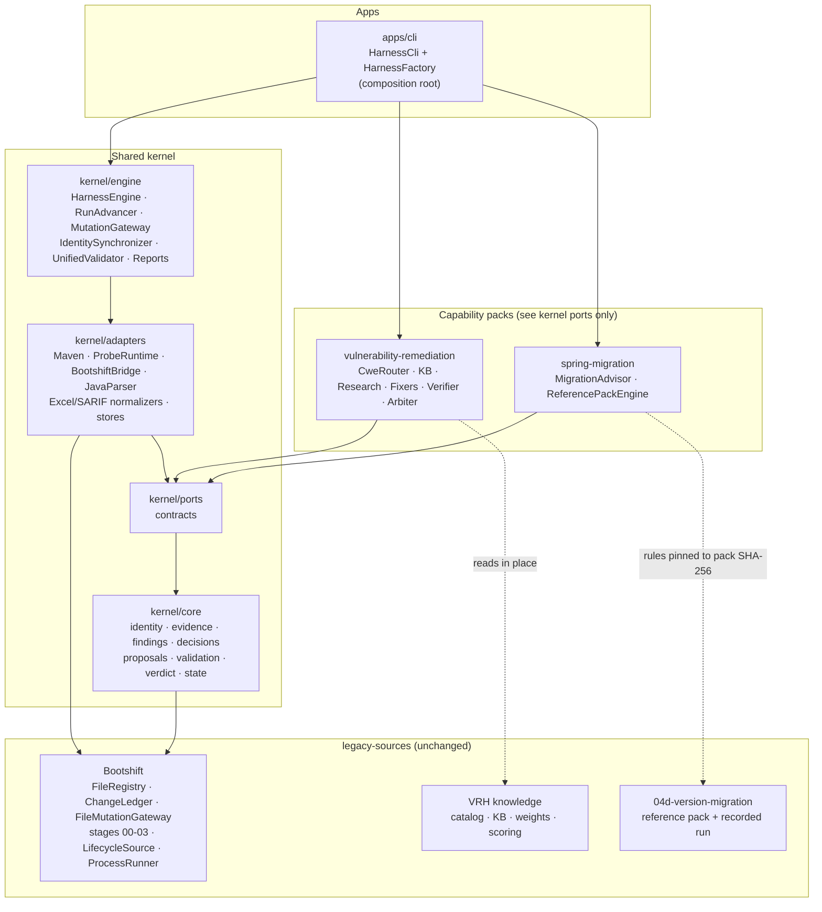
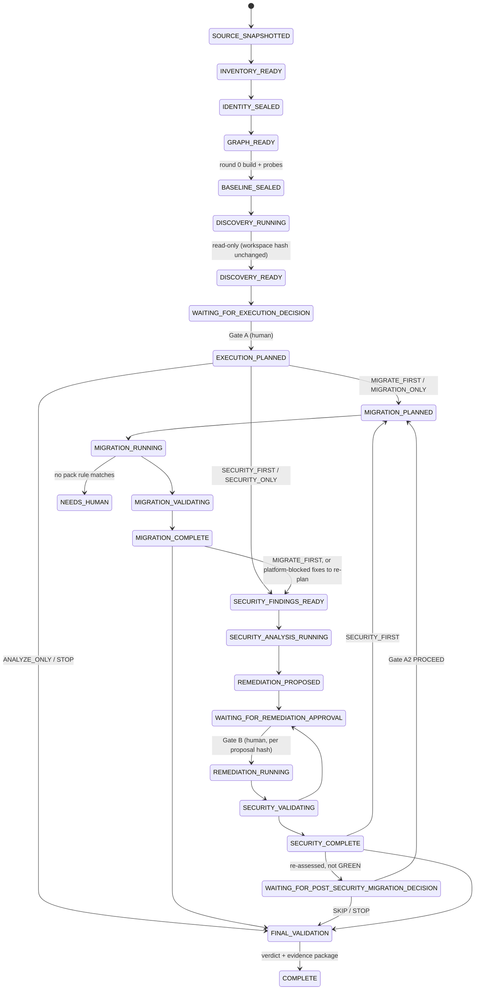
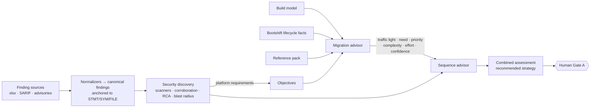
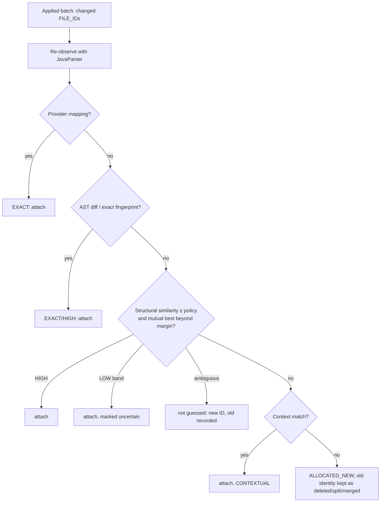

# MARS Unified Harness — Implementation Report

**Scope.** This report covers the unified migration and security harness built from three source
repositories, as specified in `docs/UNIFIED_HARNESS_IMPLEMENTATION_MASTER_PROMPT.md`. It states what
was built, what was preserved and how, what changed, the test evidence (from commands actually run),
and what remains limited. Related documents:

- `docs/current-system-analysis.md`: Phase A analysis and the baseline, before any change.
- `docs/protected-business-logic.md`: the parity and protection map.
- `docs/implementation-plan.md`: the phased plan.
- `docs/adr/ADR-U001` … `ADR-U007`: architecture decisions.

## Summary

| Question | Answer (from runs made on 2026-09-24, JDK 21.0.11, Maven 3.8.7, Windows 11, no Docker) |
|---|---|
| Does the unified monorepo build? | Yes. `mvn -o install`: BUILD SUCCESS, 21 min 11 s |
| Is Bootshift's behaviour intact? | Yes. Its own suite: **190 run, 0 failures, 0 errors, 3 skipped**, identical to the pre-change baseline (the skips are environmental, see analysis §3). All 1,076 legacy files are byte-identical to the export. |
| Do the harness suites pass? | Yes. **174 run, 0 failures, 0 errors, 0 skipped** (unit, architecture, contract, schema, parity, integration, E2E) |
| Does it work on the real toolchain? | Yes. `RealToolchainAcceptanceIT`: **2 run, 0 failures** (real Maven, real `java -jar` runtimes, 9 min 22 s) |
| Pre-existing failures kept separate | VRH `employee-service` does not build on JDK 21 (Lombok 1.18.28, pre-existing, analysis §3). Bootshift's 3 environmental skips. Testcontainers tests skip without Docker. None of these was "fixed" or hidden. |

## Test evidence

### E1. Default reactor run (`mvn -o install`)

| Suite (spec §32) | Classes | Tests | Result |
|---|---|---|---|
| Bootshift's own suite (kernel base parity) | Bootshift test modules | 190 | 0 failures, 3 skipped (environmental) |
| Unit (§32.1): IDs, decisions, state machine, verdict, policy, advisor/traffic light/effort, normalization, routing, fixers, arbiter, probes, gateway authorization matrix | `CoreContractsTest`, `MigrationAdvisorTest`, `SecurityUnitTest`, `GatewayAuthorizationTest` | 23 | pass |
| Identity golden (§32.5) | `IdentityGoldenTest` | 14 | pass |
| Architecture (§32.2) | `ArchitectureTest`, `ProtectedSourcesUnchangedTest` | 12 | pass |
| Contract and schema (§32.3, Phase E) | `CapabilityContractTest`, `SchemaValidationTest` | 7 | pass |
| Parity vs legacy (§32.4): the legacy JavaScript runs unchanged through Node | 8 `*ParityTest` classes | 96 | pass (including 1,152 arbiter combinations and all 8 recorded round logs) |
| Integration (§32.14, §32.15, CLI, apply) | `ResumeRecoveryIT`, `MutationBypassIT`, `CliWorkflowIT`, `ApplyToProjectIT` | 7 | pass |
| End to end (§32.6–32.13, Scenarios 1–10) | 7 `*E2ETest` classes | 15 | pass |
| **Total harness** | 28 classes | **174** | **0 failures, 0 errors** |

The E2E and integration suites use the production composition root with one substitution: a
content-aware **test double** for Maven and the running application (`SimulatedToolchain`). It
parses nothing itself. It emits Maven-format output that the production `BuildErrorClassifier`
parses, and it reproduces the failure modes the real compiler showed:
- removed and moved Boot 4 packages
- module-gated test packages
- `@WithMockUser` returning 401 without the security-test starter
- springdoc 2.x not starting on Boot 4
- §13 body changes

The test double is never wired into the CLI.

### E2. Scenario coverage

| Spec | Test | What is proven |
|---|---|---|
| Scenario 1, analyze only | `AnalyzeOnlyE2ETest` | inventory, identity, graph, sealed baseline (round 0 build and probes), both discovery planes, report; ANALYZE_ONLY leaves workspace and repository byte-identical |
| Scenario 2, YELLOW declined | `HumanApprovalsE2ETest.yellowMigrationDeclinedDoesNotExecute` | no migration round, no migration proposal; verdict item MIGRATION_DECLINED |
| Scenario 3 / §32.10, RED declined | `RedMigrationDeclinedE2ETest` | the RED rationale cites the advisory's Boot 4.0 requirement; fix A applied and FIXED; fix B `BLOCKED_BY_PLATFORM` with no proposal; Gate A2 offered; truthful report; repository untouched |
| Scenario 4 / §32.7, catalog | `VulnerabilityRoutesE2ETest` | RCA and blast radius, catalog hit, Proposed, approval, fix, identity-anchored rescan FIXED, QA Passed, arbiter Cleared |
| Scenario 5 / §32.8, KB | `VulnerabilityRoutesE2ETest` | catalog gap → KB with provenance and confidence, HF-PATH-001 containment fix, red-team NO_BYPASS_FOUND, Cleared |
| Scenario 6 / §32.9, research | `VulnerabilityRoutesE2ETest` | Low confidence, 2 candidates, strategy-only, no fabricated citation, promotion candidate not auto-promoted; evidence gap without analysis |
| Scenario 7 / §32.6, full migration | `FullMigrationE2ETest`, `RealToolchainAcceptanceIT` | see E3 |
| Scenario 8 / §32.12, composite MIGRATE_FIRST | `CompositeSequencingE2ETest` | one run, one identity plane, one graph, one evidence log, one ledger, one gateway; migration first (springdoc → 3.1.0), then the advisory re-matched as already remediated; security changes follow migration changes in the ledger |
| §32.11 SECURITY_FIRST | `CompositeSequencingE2ETest` | the SQL fix is applied before the migration and survives it; the platform-blocked fix is re-planned once after migration |
| §32.13 post-security re-assessment | `CompositeSequencingE2ETest` | comparison artifact, Gate A2, decision bound to the refreshed assessment hash, PROCEED runs the migration |
| Scenario 9, rename | `RenameDuringMigrationE2ETest` | `SecurityConfig.java` → `ApiKeyConfig.java` (class renamed) by an approved patch; FILE_ID, PROGRAM_UNIT_ID, SYMBOL_IDs and STATEMENT_IDs preserved; the finding stays linked |
| Scenario 10, approvals | `HumanApprovalsE2ETest`, `GatewayAuthorizationTest`, `CliWorkflowIT` | a missing decision is never approval; machine actors refused (CLI exit 2); an LLM cannot approve; an LLM patch without provenance is refused even after human approval; a decision tampered or edited after approval authorizes nothing |
| §32.14 resume/recovery | `ResumeRecoveryIT` | crash after apply and checkpoint; a fresh engine restores state and identity; ledgers intact; no second APPLIED event; the missed verification completes |
| §32.15 mutation bypass | `MutationBypassIT`, `ArchitectureTest` | direct workspace write detected post-batch and at final validation → verdict BLOCKED; the static rule demonstrably catches a rogue writer |

### E3. Real-toolchain acceptance (`RealToolchainAcceptanceIT`)

**Employee service, Spring Boot 3.5.0 → 4.1.1**, real Maven and real runtimes, compared with the
recorded reference run:

| Round | Intent | Outcome | Rules applied (evidence-driven) |
|---|---|---|---|
| 0 | package | passed (19 tests, 5 skipped: Testcontainers) | — (sealed baseline and probes) |
| 1 | test-compile | compile-failed | SB4-PARENT, SB4-JAVA, SB4-STARTER-WEBMVC, SB4-DOCKER-JRE (build-file section only) |
| 2 | test-compile | compile-failed | SB4-JACKSON3, SB4-HEALTH |
| 3 | test-compile | compile-failed → **NEEDS_HUMAN** (no rule matches `AutoConfigureTestDatabase`) | SB4-WEBMVC-TEST, SB4-JACKSON3, SB4-MOCKITOBEAN, SB4-DATAJPA-TEST |
| — | human patch | approved, applied through the gateway | import resolved from `spring-boot-jdbc-test-4.1.1.jar` |
| 4 | test-compile | passed | — |
| 5 | package | tests-failed (`but was:<401>`) | — |
| 6 | test-compile | passed | SB4-SECURITY-TEST |
| 7 | package | **passed → GREEN** | — |

Behaviour: the same status on all 9 probes and 5 body-only differences, each explained by pack §13
(health document, error timestamp format). That is the same result as the recorded reference run.
Verdict PARTIAL, truthfully: the pre-existing CWE-770 finding was DEFERRED because MIGRATION_ONLY
excluded security.

**Composite service:** MIGRATE_FIRST migrated to GREEN in 3 rounds (1 §13-explained body difference).
The approved SQL-injection fix was verified **Cleared** on a real VERIFY build. The verdict is
NEEDS_HUMAN, because three proposals were deliberately left undecided (a missing decision is not
approval).

---

## 1. What the harness is

It is a developer harness, not a chatbot. A developer points it at a repository and, optionally, at
finding sources: a VRH Excel issue register, SARIF, or dependency advisory feeds. The harness then:

1. **Analyzes read-only** (Phases 0–4). It snapshots the source, inventories every file with a
   persistent FILE_ID, and allocates MODULE, PROGRAM_UNIT, SYMBOL and STATEMENT identities. It
   builds one canonical graph, seals a baseline (round 0 build and behaviour probes), runs migration
   and security discovery, and stops at **Human Gate A** with a grounded recommendation.
2. **Waits for a human execution decision**: MIGRATE_FIRST, SECURITY_FIRST, MIGRATION_ONLY,
   SECURITY_ONLY, ANALYZE_ONLY or STOP. A RED assessment never starts a migration by itself.
3. **Executes only what was authorized.** Every change is a `ChangeProposal` applied by the single
   Mutation Gateway:
   - Deterministic migration rules run under the human execution decision plus the frozen plan's rule
     allowlist.
   - Every security fix, manual patch and LLM patch needs its own human approval, bound to the
     proposal's hash (**Human Gate B**).
4. **Re-assesses migration after security work** and asks again (**Human Gate A2**) when it is still
   relevant.
5. **Validates across all dimensions** and computes a verdict that never counts an unexecuted
   dimension as a pass. It then renders an evidence package whose every claim traces to hash-chained
   evidence.

The original project is never written. Applying the result to it is a separate, decision-bound
command.

## 2. Final architecture

### 2.1 Modules (Shared Kernel + Capability Packs)

| Module | Role | Depends on |
|---|---|---|
| `legacy-sources/bootshift` | Bootshift, **unchanged** (commit `eacdca19`); the kernel base (ADR-U001) | — |
| `kernel/core` | Identity registries and reattachment, evidence log, findings, decisions and validator, ChangeProposal, validation and verdict, run state machine, canonical graph, unified policy | bootshift-core |
| `kernel/ports` | Contracts: build, runtime, lifecycle, code model, evidence and artifact stores, identity view, mutation, approval, checkpoint, `MigrationCapability`, `RemediationCapability`, `FindingNormalizer` | kernel-core |
| `kernel/adapters` | Maven runner and 04d error classifier, loopback probe runtime, Bootshift bridge (stages 00–03, gateway), JavaParser observer, POM model reader, Excel register and SARIF normalizers, filesystem stores | ports, bootshift-adapters/stages, javaparser |
| `kernel/engine` | `HarnessEngine` (phases, gates, commands), `RunAdvancer` (resumable state loop), `MutationGateway`, identity synchronizer, graph builder, sequence advisor, unified validator, verdict items, reports, lineage | adapters |
| `capabilities/spring-migration` | Migration advisor (traffic light, effort model) and the reference-pack engine (04d-version-migration) | kernel-ports only |
| `capabilities/vulnerability-remediation` | VRH routing (catalog → KB → research → evidence gap), rule and advisory scanners, RCA and blast radius, fixers, 05/06/07 verification and arbiter | kernel-ports only |
| `apps/cli` | Composition root and the `harness` CLI (picocli, fat jar `harness.jar`) | engine + both capabilities |
| `tests` | Unit, architecture, contract, parity, integration, E2E, real-toolchain acceptance | cli |



### 2.2 Run lifecycle and human gates



### 2.3 The single mutation path

```mermaid
sequenceDiagram
  participant Cap as Capability / human / model
  participant GW as kernel MutationGateway
  participant AP as Approval store (HMAC)
  participant BS as Bootshift FileMutationGateway
  participant ID as IdentitySynchronizer
  participant L as Ledgers + evidence
  Cap->>GW: ChangeProposal (immutable, hashed)
  GW->>L: PROPOSED event
  GW->>GW: identity + scope checks<br/>(baseline seal, FILE_ID/path, base hash,<br/>symbol scope, budgets, traversal, LLM provenance)
  GW->>AP: decision for this proposal hash? integrity ok?
  alt no decision
    GW-->>Cap: AWAITING_APPROVAL (a missing decision is not approval)
  else rejected / stale / tampered
    GW->>L: REJECTION
  else authorized (human approval, or execution decision + frozen plan allowlist)
    GW->>GW: pre-batch checkpoint
    GW->>BS: apply batch (atomic; partial = rollback)
    BS->>L: APPLIED (ChangeLedger, unchanged schema)
    GW->>ID: reattach MODULE/PU/SYM/STMT identities
    GW->>L: lineage CHANGE + evidence
    GW->>GW: graph rebuild + diff, build-model refresh, bypass detection
  end
```

### 2.4 Discovery, recommendation and sequencing



### 2.5 Identity reattachment



## 3. Preserved behaviour (protected business logic)

The full map is `docs/protected-business-logic.md`, with the guarding tests named per row. In
summary:

- **Bootshift is CALLED, unchanged.** This covers FileRegistry identity, the ChangeLedger,
  FileMutationGateway, stages 00–03, LifecycleSource and ProcessRunner. Its 190 tests run in the
  reactor, and `ProtectedSourcesUnchangedTest` checks all 1,076 legacy files against the export
  manifest. The manifest was cross-checked byte-for-byte against the pristine clones: 0 differences
  across 447 + 368 + 261 files.
- **VRH behaviour is PORTED or INPUT**, with its knowledge files read in place:
  - catalog → KB → research routing, with its exact reason strings
  - 04c hybrid ranking and strategy derivation
  - 04d research assembly (Low confidence, at least 2 candidates, no fabricated citations, evidence
    gap)
  - 05/06/07 verification vocabularies and the 07a arbiter over the unchanged `scoring.json`
  - the issue-register column contract and synthesized body
  - legacy `fix_plan_<ISSUE>.md` rendering
- **The spring-migration reference is PORTED or INPUT**:
  - the reference pack is pinned by SHA-256
  - round 0 comes before any change
  - build-file rules are applied up front
  - source rules apply only on a quoted symptom, and an unmatched error goes to a human
  - every round is kept
  - pre-existing failures are recorded, never fixed
  - behaviour probes compared with §13 explanations
  - the project is never edited, and apply is explicit and refused unless green

## 4. What changed (new capability)

| Spec area | Implemented as |
|---|---|
| Persistent sub-file identity (§6) | `IdentityRegistry` (MODULE / PROGRAM_UNIT / SYMBOL / STATEMENT), `JavaCodeObserver`, `IdentityReattacher` (hierarchy in 2.5), `IdentitySynchronizer`, lineage queries (`harness lineage`) |
| Canonical graph (§8) | `CanonicalGraph` overlay on Bootshift's ApplicationGraph, with identity bindings and finding attachments; rebuilt and diffed after every batch |
| Evidence plane (§7) | hash-chained `EvidenceLog`; every claim cites `EVID-` records; `harness verify` re-computes all chains |
| Read-only discovery (§10) | discovery asserts the workspace hash is unchanged before and after |
| Migration advisor (§11–12) | traffic light / need / priority / complexity / effort / evidence confidence as separate answers; effort = policy-weighted factors (weights sum to 100); lifecycle facts from Bootshift |
| Canonical findings (§14) | Excel register, SARIF, rule scanner and advisory normalizers; corroboration merges a register row and a scanner hit on the same statement |
| Decisions and gates (§9, §17, §23) | write-once, HMAC-integrity, hash-bound decisions; machine actors refused; Gates A, B, A2, plan approval, apply |
| ChangeProposal (§18) and single gateway (§19) | one kernel `MutationGateway` wrapping Bootshift's; pre-batch checkpoint and atomic rollback; runtime bypass detection |
| Validation and verdict (§21–22) | 13 dimensions; unexecuted ≠ PASS; precedence BLOCKED > NEEDS_HUMAN > INSUFFICIENT_EVIDENCE > PARTIAL > CLEARED |
| Post-security re-assessment (§23) | comparison artifact (`post-security-reassessment.json`) plus Gate A2, with the decision bound to the refreshed assessment hash |
| Resume and recovery (§25) | every step is a function of persisted state; applied proposals are recognised and never re-applied; an interruption after apply is recovered by verifying, not re-applying |
| Schemas (Phase E) | `schemas/v1/*.schema.json` (JSON Schema 2020-12) for findings, proposals, decisions, assessments, evidence, lineage, validation and verdict |
| CLI (§34) | `analyze`, `status`, `migration-assessment`, `findings`, `proposals`, `decide execution/migration`, `approve remediation/migration/apply`, `submit-patch` (with `--rename`), `submit-research`, `resume [--accept-pending]`, `report`, `lineage`, `finding`, `change`, `apply`, `verify` |

### 4.1 Defects found by the new tests, and fixed

Each of these was found by a test written against the spec. Each was fixed in production code,
never by weakening the test.

| Found by | Defect | Fix |
|---|---|---|
| §32.10 E2E | FixVerifier NPE: `List.contains(null)` for symbols created in the baseline | null-safe comparison |
| §32.11/§32.12 E2E | Build model stale after a migration bumped `pom.xml`, so the advisory still matched 2.8.9 | re-read the build model after any batch that changes a build file; resolved versions of managed dependencies become unknown, not carried over |
| §32.11/§32.13 E2E | A platform-blocked fix was never re-planned when migration ran after security (SECURITY_FIRST, Gate A2 PROCEED) | re-plan platform-blocked findings once after migration; settled findings are never re-planned |
| Scenario 10 E2E | A refused approved proposal stranded the run in REMEDIATION_RUNNING | the phase always leaves via SECURITY_VALIDATING |
| §32.14 IT | A crash between apply and verification left the applied fix unverified forever on resume | `recoverRemediation`: verify what was applied, never re-apply; re-entrant proposal registration |
| Gateway matrix | RENAME target path not validated; RENAME with content skipped symbol scope and line budget | traversal and occupancy check on `new_path`; the same scope and budget checks as MODIFY |
| Gateway matrix | A migration Java edit declaring no symbols bypassed the symbol-scope check | a migration edit of Java must declare its symbol or program-unit scope |
| Simulated runtime | the probe `ok` flag was wrong in the test double (production was correct) | test double fixed to match `JarProbeRuntime` |
| Schema validation | a "known" effort factor with a count of 0 cited no evidence | the reference-pack scan is recorded as an observation and cited by every pack-derived count |
| CLI workflow IT | a decision refused by the validator (machine actor) exited as AUTHORIZATION_MISSING | refused decisions are `REFUSAL` (exit 2) |
| CLI workflow IT | the NEEDS_HUMAN summary echoed a stale note written before later decisions | derived from the verdict's outstanding decisions |
| Issue-register parity | Java `trim()` / `\s` kept Unicode spaces (e.g. NBSP) that JavaScript `trim()` strips | JS-equivalent trimming in `Xlsx` / `IssueRegister` |
| KB parity | an empty (not null) root-cause statement did not fall back to the title, as `fallback.js:296` does | empty treated like null |
| **Real-toolchain acceptance** | Baseline and final runtimes ran in different fresh `exec/` copies, so an H2 file database (`./data/…`) was reseeded and bodies differed for reasons that were not the migration's | the runtime's working directory is one per-run `exec/runtime-state`, as the reference's single project directory was; the result now matches the recorded run (9 probes, 4 identical, 5 explained) |
| **Real-toolchain acceptance** | The simulated compiler did not know that Boot 4 moved `AutoConfigureTestDatabase`; the real compiler stopped the run for a human | the test double reproduces it. Both the simulated and real E2E now exercise the human-patch path. The new location was resolved from the 4.1.1 jar (`spring-boot-jdbc-test`), not guessed. |

## 5. Limitations and known gaps

These are stated plainly. None of them is hidden behind a passing test.

1. **Sub-file identity is Java-only.** Other files (POMs, YAML, Dockerfiles, SQL) have FILE_ID only.
2. **One migration reference pack** (Spring Boot 3 → 4). No OpenRewrite recipes run inside the
   unified migration flow. Bootshift's own 20-stage pipeline stays callable unchanged through its
   CLI but is not orchestrated by the harness (ADR-U003).
3. **The reference pack is incomplete for real code.** On the employee fixture, real Maven stopped
   on `AutoConfigureTestDatabase`, which Boot 4 moved and the pack does not mention. The harness
   stopped for a human exactly as the reference workflow requires, and the run completed after a
   human-approved patch. Adding that rule means changing the pack (with a new SHA) and re-deriving
   the rules. It was deliberately not added silently.
4. **Judgement is input.** The harness does not perform 04d research itself. Without an
   `analysis.json`, a double-gap finding gets the legacy evidence-gap plan (ADR-U005). Strategy-only
   plans need a human or agent to submit the concrete patch.
5. **Deterministic fixers exist only for common shapes:** SQL string concatenation (CWE-89), path
   containment (HF-PATH-001, CWE-22) and dependency bumps (CWE-1104). Other catalog and KB routes
   produce approved strategies, not patches.
6. **Identity of the approver is locally asserted.** The HMAC key lives in the run, so this is
   tamper evidence, not non-repudiation (ADR-U006).
7. **No PR / 07b scribe.** The harness makes no git or gh calls. The evidence package,
   `cumulative.patch` and the decision-bound `harness apply` are its outputs.
8. **Docker was not available.** Testcontainers tests are skipped on both sides of every comparison,
   as in the recorded reference run (PostgreSQL behaviour under Hibernate 7 is unverified).
9. **Documented parity deviations (asserted by tests, not hidden):**
   - Mixed CWE gaps route to the KB-covered CWE (as `run-fallback.js --cwe`).
   - CWE-1104 is catalogued through the supplemental entry.
   - A never-started runtime is "not compared" rather than a zero-probe match. The legacy behaviour
     would let an unstarted baseline read as "no differences", which spec §21 forbids.
10. **Natural-sort detail.** The register's id sort uses code-point natural compare, where JS uses
    ICU `localeCompare`. It differs only for ids that differ in case or punctuation.
11. **Bootshift side effect (pre-existing).** Its test suite rewrites
    `legacy-sources/bootshift/reports/impact-accuracy.json` on every run. The protected-sources test
    documents this one exception.
12. **Git history is not consolidated** (see `legacy-sources/SOURCES.json`), and nothing has been
    committed. Both need an explicit instruction.

## 6. How to run

```bash
# build everything and run every default suite (Bootshift's 190 + the harness suites)
mvn -o install

# real toolchain acceptance (downloads Spring Boot 4.1.1 on first run; ~10 minutes)
mvn -pl tests test -Dharness.excludedGroups= -Dtest=RealToolchainAcceptanceIT

# the CLI
java -jar apps/cli/target/harness.jar analyze <repo> --findings register.xlsx --probes probes.json
java -jar apps/cli/target/harness.jar decide execution --run RUN-… --strategy SECURITY_FIRST \
     --actor <you> --role owner --rationale "…"
java -jar apps/cli/target/harness.jar resume --run RUN-…
java -jar apps/cli/target/harness.jar verify --run RUN-…
```
