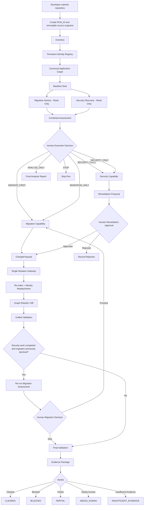

# Unified Modernization & Vulnerability Remediation Harness
## Master Implementation Prompt for Cloud Code / Repository Coding Agent

> **Purpose:** This file is the authoritative implementation specification for merging the three existing harness projects into **one developer-facing harness system** while preserving the existing business logic, agent behavior, safety gates, migration behavior, vulnerability-remediation behavior, evidence semantics, and human approval requirements.
>
> **Important:** This is **not a chatbot product**. Build a developer tool / harness that accepts a repository, analyzes it, creates persistent identity and evidence, recommends actions, waits at explicit human decision gates, executes selected capabilities, validates the result, and produces an auditable final evidence package.

---

# 0. YOUR ROLE

Act as all of the following at once:

- Principal software architect
- Staff/Principal Java engineer
- Application modernization engineer
- Spring Boot migration specialist
- Secure software / vulnerability-remediation engineer
- Static-analysis engineer
- Compiler/tooling engineer
- Agentic workflow architect
- Build/release engineer
- Test architect
- Reliability engineer
- Audit/provenance engineer

You are responsible for **understanding the existing systems first, then implementing the integration**.

Do not merely create a design document. Implement a working, testable system.

Do not claim success because code compiles once. The final system must be exercised through meaningful end-to-end scenarios, and the test evidence must be included in the final implementation report.

---

# 1. SOURCE REPOSITORIES

The system is derived from these three existing repositories.

## Repository A — Bootshift

```text
https://github.com/KrishnaAnnavaram/bootshift
branch: main
```

Primary value to preserve:

- persistent allocated file identity
- inventory-first architecture
- build resolution
- application graph
- baseline sealing
- compatibility analysis
- migration target resolution
- migration knowledge
- impact analysis
- characterization
- migration planning
- transformation
- compiler/build repair
- graph rebuild/diff
- test validation
- runtime validation
- differential validation
- approval
- evidence reporting
- provenance QA
- ports/adapters architecture
- artifact plane
- state machine
- evidence model
- change ledger
- `FileMutationGateway` / single-writer mutation model
- optional AI / deterministic-first behavior
- human authority where evidence cannot authorize a decision

Important Bootshift areas include, but are not limited to:

```text
.claude/agents/
core/
ports/
adapters/
stages/
schemas/
policies/
migration-rules/
apps/
fixtures/
docs/adr/
```

Important existing concepts include:

```text
RUN_ID
FILE_ID
SYMBOL_ID
CHANGE_ID
Evidence
Claim
CoverageStatement
ApplicationGraph
GraphDiff
FileRegistry
ChangeLedger
RunState
StateMachine
FileMutationGateway
ApprovalPort / decisions
```

## Repository B — Vulnerability Remediation Harness

```text
https://github.com/kaajalkrish/Vulnerability-Remediation-Harness
branch: main
```

Primary value to preserve:

- issue register intake
- architecture / code cartography
- root-cause analysis
- blast-radius analysis
- CWE-aligned remediation strategy
- human approval before code mutation
- fixer
- dependency remediation
- CWE catalog
- local remediation knowledge base
- catalog-gap fallback
- deeper remediation research fallback
- behavior verification
- re-scan verification
- red-team verification
- QA gate
- build gate
- merge arbitration
- audit / PR reporting
- evidence-chain behavior

Important areas include:

```text
.github/agents/
.github/skills/
.github/pipeline-contract.md
docs/agent_output/
```

The existing remediation hierarchy must remain functionally intact:

```text
Known CWE catalog
      ↓
Established remediation strategy

Catalog gap
      ↓
Historical/local remediation KB

Catalog + KB gap
      ↓
Structured remediation research
      ↓
Low-confidence proposed strategy

ALL remediation strategies
      ↓
Human approval
      ↓
Fix
      ↓
Verify
      ↓
Test/build
      ↓
Audit/verdict
```

## Repository C — Spring Boot migration capability/reference implementation

```text
https://github.com/Udaradg/sample-java-project
branch: feature/springboot-3-to-4
```

Primary value to preserve:

- version migration workflow
- baseline detection
- reference-pack-driven migration
- sandbox migration
- old-runtime baseline probes
- target-version build rounds
- compiler-guided repair
- explicit migration rounds
- final runtime probes
- behavior comparison
- migration report
- cumulative patch
- explicit apply-to-project step
- no implicit mutation of the original project

Important migration behavior:

```text
Detect current versions
      ↓
Read reference pack
      ↓
Understand application behavior
      ↓
Create sandbox
      ↓
Run baseline build/runtime probes
      ↓
Change versions
      ↓
Compiler/build rounds
      ↓
Fix only evidenced failures
      ↓
Reach green build
      ↓
Run final runtime probes
      ↓
Compare old vs new behavior
      ↓
Produce migration report + patch
```

---

# 2. NON-NEGOTIABLE PRESERVATION CONTRACT

This is the most important requirement.

## 2.1 Do NOT rewrite the working business logic simply to make the new architecture look clean

The existing Bootshift stages and the existing vulnerability agents/skills contain the project’s business value.

Preserve that value.

### You MAY:

- wrap an existing stage behind a new interface
- add adapters
- add compatibility shims
- add canonical schemas
- add new orchestration around existing logic
- extend inventory/identity
- add new state transitions
- add evidence translation
- convert old outputs into canonical internal objects
- add tests around existing behavior
- refactor duplicated infrastructure only after parity is proven

### You MUST NOT initially:

- replace working Bootshift migration logic with a new LLM implementation
- replace the vulnerability-remediation agent chain with a generic new agent
- remove human approval from remediation
- remove sandbox migration behavior
- remove compiler-guided migration repair
- remove old-vs-new runtime behavior comparison
- remove the CWE catalog / KB / research hierarchy
- let an LLM self-authorize a mutation
- let any agent directly write arbitrary customer source outside the authorized mutation plane
- silently change the meaning of existing statuses or gates
- merge three repos by merely placing three folders next to each other and calling that a unified harness

## 2.2 Establish behavior parity BEFORE major refactoring

Before changing protected business logic:

1. identify the critical workflows
2. create golden/contract tests
3. capture representative outputs
4. make the new integration call the existing behavior through adapters
5. compare outputs
6. only refactor internals after parity is demonstrated

If the integration fails, prefer fixing the adapter/orchestration layer rather than changing the preserved business logic.

---

# 3. PRODUCT DEFINITION

Build **one developer-facing harness system**.

The developer should interact with one system such as:

```bash
harness analyze <repository>
harness status --run <RUN_ID>
harness decide migration --run <RUN_ID> --decision proceed
harness decide migration --run <RUN_ID> --decision skip
harness approve remediation --proposal <PROPOSAL_ID> ...
harness resume --run <RUN_ID>
harness report --run <RUN_ID>
```

Exact CLI syntax may differ, but there must be a single coherent entry point.

The tool may later expose an API or UI, but the initial implementation must be fully usable from CLI / automation.

This is NOT a conversational chatbot.

---

# 4. FINAL ARCHITECTURE

The target architecture is **Shared Kernel + Capability Packs**.

```text
                         DEVELOPER
                             │
                             ▼
                    Unified CLI / API
                             │
                             ▼
┌───────────────────────────────────────────────────────────────┐
│                    UNIFIED HARNESS KERNEL                     │
│                                                               │
│  Run State     Identity      Graph       Evidence             │
│  Policy        Approval      Ledger      Provenance           │
│  Workspace     Checkpoint    Mutation    Validation           │
└───────────────────────────────┬───────────────────────────────┘
                                │
                                ▼
                      Capability Orchestrator
                                │
                  ┌─────────────┴─────────────┐
                  │                           │
                  ▼                           ▼
        Spring Migration Capability    Security Capability
                  │                           │
                  │                           ├─ finding intake
                  │                           ├─ root cause
                  │                           ├─ blast radius
                  │                           ├─ CWE catalog
                  │                           ├─ KB fallback
                  │                           ├─ research fallback
                  │                           └─ remediation
                  │
                  ├─ compatibility
                  ├─ target resolution
                  ├─ reference knowledge
                  ├─ migration plan
                  ├─ transformations
                  └─ compiler repair
                  │                           │
                  └─────────────┬─────────────┘
                                ▼
                         ChangeProposal
                                │
                                ▼
                        Mutation Gateway
                      (single source writer)
                                │
                                ▼
                   Identity Reattachment
                                │
                                ▼
                     Unified Validation
                                │
                                ▼
                       Evidence Package
                                │
                                ▼
                   CLEARED / BLOCKED /
                PARTIAL / NEEDS_HUMAN /
                 INSUFFICIENT_EVIDENCE
```

---

# 5. REPOSITORY STRUCTURE

Create a unified monorepo.

A suggested final structure is:

```text
unified-harness/
├── README.md
├── pom.xml
├── docs/
│   ├── architecture.md
│   ├── developer-flow.md
│   ├── identity-model.md
│   ├── migration-assessment.md
│   ├── security-remediation.md
│   ├── human-gates.md
│   ├── evidence-model.md
│   └── adr/
│
├── kernel/
│   ├── core/
│   │   ├── run/
│   │   ├── identity/
│   │   ├── graph/
│   │   ├── evidence/
│   │   ├── ledger/
│   │   ├── policy/
│   │   ├── decisions/
│   │   ├── provenance/
│   │   └── state/
│   │
│   ├── ports/
│   │   ├── inventory/
│   │   ├── analysis/
│   │   ├── graph/
│   │   ├── build/
│   │   ├── scanner/
│   │   ├── migration/
│   │   ├── remediation/
│   │   ├── transformation/
│   │   ├── mutation/
│   │   ├── approval/
│   │   ├── runtime/
│   │   ├── evidence/
│   │   └── scm/
│   │
│   ├── engine/
│   │   ├── orchestrator/
│   │   ├── stages/
│   │   ├── state-machine/
│   │   ├── scheduler/
│   │   └── capability-runtime/
│   │
│   └── adapters/
│       ├── git/
│       ├── filesystem/
│       ├── maven/
│       ├── gradle/
│       ├── javaparser/
│       ├── ast-diff/
│       ├── openrewrite/
│       ├── sarif/
│       ├── excel/
│       ├── scanners/
│       ├── runtime/
│       └── evidence-store/
│
├── capabilities/
│   ├── spring-migration/
│   │   ├── adapter/
│   │   ├── assessment/
│   │   ├── compatibility/
│   │   ├── target-resolution/
│   │   ├── reference-packs/
│   │   ├── planning/
│   │   ├── transformation/
│   │   ├── compiler-repair/
│   │   ├── probes/
│   │   └── reports/
│   │
│   └── vulnerability-remediation/
│       ├── adapter/
│       ├── intake/
│       ├── architecture/
│       ├── root-cause/
│       ├── blast-radius/
│       ├── cwe-catalog/
│       ├── remediation-kb/
│       ├── remediation-research/
│       ├── planning/
│       ├── fixer/
│       ├── rescan/
│       ├── red-team/
│       ├── qa/
│       ├── build-gate/
│       └── audit/
│
├── schemas/
│   ├── run/
│   ├── identity/
│   ├── findings/
│   ├── migration/
│   ├── change/
│   ├── decision/
│   ├── evidence/
│   └── verdict/
│
├── policies/
│   ├── default/
│   └── examples/
│
├── apps/
│   └── cli/
│
├── fixtures/
│   ├── identity/
│   ├── migration/
│   ├── vulnerability/
│   └── composite/
│
├── tests/
│   ├── unit/
│   ├── architecture/
│   ├── contract/
│   ├── parity/
│   ├── integration/
│   └── end-to-end/
│
└── legacy-sources/
    ├── bootshift/
    ├── vulnerability-remediation-harness/
    └── spring-migration-reference/
```

`legacy-sources/` is temporary/reference material during convergence.

The final system must not depend on running three independent top-level harness engines forever.

---

# 6. CORE EXECUTION FLOW

Implement this lifecycle.

```text
DEVELOPER SUBMITS REPOSITORY
        │
        ▼
PHASE 0 — INGEST
        │
        ├─ allocate RUN_ID
        ├─ record branch / commit
        ├─ environment fingerprint
        ├─ immutable source snapshot
        └─ create isolated workspace
        │
        ▼
PHASE 1 — INVENTORY + PERSISTENT IDENTITY
        │
        ├─ module/service discovery
        ├─ FILE_ID
        ├─ PROGRAM_UNIT_ID
        ├─ SYMBOL_ID
        └─ STATEMENT_ID
        │
        ▼
PHASE 2 — APPLICATION GRAPH
        │
        ├─ files
        ├─ packages
        ├─ types
        ├─ methods/functions
        ├─ calls
        ├─ dependencies
        ├─ configuration
        ├─ routes
        ├─ persistence
        └─ statement relationships
        │
        ▼
PHASE 3 — BASELINE SEAL
        │
        ├─ build
        ├─ tests
        ├─ runtime
        ├─ API probes
        ├─ dependency state
        ├─ security state
        ├─ graph state
        └─ evidence manifest
        │
        ▼
PHASE 4 — READ-ONLY DISCOVERY
        │
        ├───────────────┬────────────────┐
        │               │                │
        ▼               ▼                ▼
 Migration Advisor   Security        Other future
                     Discovery       capabilities
        │               │
        └───────┬───────┘
                ▼
       Combined Assessment
                │
                ▼
PHASE 5 — HUMAN DECISION
                │
                ▼
      Developer chooses strategy
                │
                ▼
PHASE 6 — CAPABILITY EXECUTION
                │
                ▼
         ChangeProposal(s)
                │
                ▼
PHASE 7 — MUTATION GATEWAY
                │
                ▼
       Re-index + reattach IDs
                │
                ▼
PHASE 8 — UNIFIED VALIDATION
                │
                ▼
PHASE 9 — VERDICT + EVIDENCE
```

---

# 7. IDENTITY MODEL

This is a key extension of Bootshift.

## 7.1 Existing FILE_ID behavior must remain intact

Do not regress Bootshift’s persistent allocated file identity.

Maintain the principle:

```text
FILE_ID != PATH
FILE_ID != CONTENT_HASH
```

File identity must survive:

- edits
- renames
- package moves
- path moves
- split
- merge
- delete history

Continue to retain lineage even if a file is deleted or merged away.

## 7.2 Extend identity below the file

Add at minimum:

```text
RUN_ID
REPOSITORY_ID
MODULE_ID
FILE_ID
PROGRAM_UNIT_ID
SYMBOL_ID
STATEMENT_ID
FINDING_ID
CHANGE_ID
PROPOSAL_ID
DECISION_ID
EVIDENCE_ID
CHECKPOINT_ID
```

### Definitions

`MODULE_ID`
: logical Maven/Gradle module, microservice, or application module.

`PROGRAM_UNIT_ID`
: language-neutral executable/declarative unit. Examples:
- Java class/interface/record
- COBOL program
- PL/SQL package/procedure/function
- Python module/class/function

`SYMBOL_ID`
: method, constructor, field, function, endpoint, query, configuration symbol, etc.

`STATEMENT_ID`
: an allocated stable identity for a statement or AST-level executable unit.

## 7.3 Statement identity must be persistent

Do NOT use the line number as identity.

Do NOT use raw statement hash as identity.

A statement may change contents while keeping the same logical identity.

Example:

```text
STMT-001

v1:
repository.save(employee);

v2:
repository.save(sanitize(employee));

same STATEMENT_ID
different StatementVersion
```

Store statement history separately:

```text
StatementRecord
├── statementId
├── parentSymbolId
├── fileId
├── baselineLocation
├── currentLocation
├── nodeKind
├── baselineFingerprint
├── currentFingerprint
├── versions[]
├── changeIds[]
├── status
├── createdByChange
├── deletedByChange
├── splitFrom
├── mergedInto
└── reattachmentEvidence
```

## 7.4 Statement reattachment algorithm

Implement an evidence-based hierarchy.

Suggested order:

1. transformation-provider explicit node mapping
2. AST-diff mapping
3. exact normalized AST/token fingerprint under the same parent symbol
4. structural similarity under the same/reattached parent
5. contextual sibling/parent matching
6. otherwise allocate a new `STATEMENT_ID`

Every non-exact reattachment must record:

```text
method
confidence
evidence
old location
new location
```

Do not silently pretend uncertain mappings are exact.

## 7.5 Symbol/program identity

Apply similar principles to symbols:

- identity is allocated
- name is an attribute
- FQN is an attribute
- signature is an attribute
- path is an attribute

A rename should not automatically create a new identity when strong evidence shows lineage.

---

# 8. CANONICAL APPLICATION GRAPH

Bootshift’s graph becomes the canonical graph.

Do not create two competing authoritative graphs.

Graph nodes should support:

```text
Repository
Module
File
ProgramUnit
Type
Method
Constructor
Field
Statement
Endpoint
Dependency
Configuration
DatabaseEntity
Query
ExternalService
Finding
```

Useful edge types:

```text
CONTAINS
DECLARES
CALLS
READS
WRITES
DEPENDS_ON
IMPLEMENTS
EXTENDS
ANNOTATED_BY
EXPOSES
CONFIGURES
USES
PERSISTS
AFFECTS
FLOWS_TO
CHANGED_BY
SUPPORTED_BY
EVIDENCED_BY
```

Neo4j may be used as a projection/query backend, but not as a second independent truth source.

Use adapters:

```text
Canonical ApplicationGraph
          ↓
Neo4jProjectionAdapter
          ↓
Neo4j
```

If Neo4j is unavailable, core correctness must still be possible from the canonical graph artifact.

---

# 9. BASELINE SEAL

No source mutation is legal before baseline sealing.

The baseline should include:

- repository snapshot
- environment/toolchain
- inventory
- identity registry
- application graph
- build model
- dependency model
- build outcome
- tests and pre-existing failures
- runtime startup
- representative runtime probes where available
- security finding snapshot
- existing scanner outputs
- secrets findings where applicable
- evidence coverage

Pre-existing failures must not be hidden.

Record them and compare later against the same baseline.

The goal is:

```text
Did our change introduce a regression?
```

not:

```text
Can we pretend the project was green before we touched it?
```

---

# 10. READ-ONLY DISCOVERY MUST HAPPEN BEFORE THE FIRST HUMAN EXECUTION DECISION

After the baseline is sealed, run at least these two analyses **without mutating customer source**:

```text
Migration Assessment
Security Discovery
```

They may run in parallel if dependencies permit.

Why:

A vulnerability may reveal that remediation requires a newer framework/dependency line.

A migration may introduce or remove dependency risk.

Therefore the developer should receive a combined evidence-based assessment before selecting the execution order.

---

# 11. MIGRATION ADVISOR

The harness must be capable of detecting whether migration is relevant even when the developer did not explicitly request migration.

The assessment is advisory.

It must NEVER automatically authorize migration.

## 11.1 Required output dimensions

Do not collapse everything into one score.

Produce:

```text
MigrationNeed
MigrationPriority
MigrationComplexity
MigrationEffortScore
EvidenceConfidence
RecommendedTarget
RecommendedSequence
Evidence[]
Unknowns[]
Blockers[]
```

## 11.2 Traffic-light recommendation

Use these exact semantics.

### GREEN

```text
Migration is not currently required for the requested objectives.
The current platform can proceed.
```

### YELLOW

```text
Migration is recommended / beneficial, but is not currently a hard prerequisite.
The developer may proceed without migrating.
```

### RED

```text
Migration is a prerequisite for at least one specific requested objective.
The harness must explain exactly which objective and why.
```

RED does NOT authorize migration.

If the developer rejects migration, the harness must respect the rejection.

The affected later work may become:

```text
BLOCKED_BY_PLATFORM
PARTIAL
UNRESOLVED
```

but migration must not be silently forced.

### UNKNOWN

```text
The harness does not have enough trustworthy evidence to classify migration need.
```

Never coerce insufficient evidence into Green.

## 11.3 Complexity scale

Use a separate scale, for example:

```text
TRIVIAL
LOW
MODERATE
HIGH
REARCHITECTURE
UNKNOWN
```

## 11.4 Evidence confidence

Use:

```text
HIGH
MEDIUM
LOW
INSUFFICIENT
```

This is evidence confidence, not model confidence.

Base it on:

- build model resolution quality
- dependency resolution quality
- lifecycle evidence quality
- framework version evidence
- Java/toolchain evidence
- internal dependency knowledge
- static-analysis coverage
- rule/reference coverage
- runtime coverage
- unresolved graph attribution

## 11.5 Migration effort score

The developer requested a percentage-style “hardness.”

Implement a deterministic `migration_effort_score` from 0–100.

This is NOT a probability.

It must be decomposable into evidenced factors.

Example factor model:

```text
platform_version_distance
java_version_jump
mandatory_migration_issue_count
dependency_incompatibility_count
removed/deprecated_api_count
configuration_breakage_count
module/service_breadth
runtime/test_coverage_gap
unknown_internal_components
ecosystem_constraints
```

Store factor contribution and evidence IDs:

```json
{
  "migration_effort_score": 68,
  "factors": [
    {
      "name": "removed_api_usage",
      "contribution": 15,
      "evidence_refs": ["EVID-..."]
    }
  ]
}
```

Do not hard-code unexplained magic numbers.

Weights must live in versioned policy/configuration.

## 11.6 Grounding requirements

Every recommendation must answer:

```text
What was observed?
Where was it observed?
Which rule/lifecycle fact/reference supports the conclusion?
How fresh/reliable is that evidence?
What is unknown?
```

No agent may say:

```text
"You should migrate because it seems old."
```

It must produce evidence.

---

# 12. HUMAN GATE A — EXECUTION STRATEGY

After discovery, present the developer with the assessment and require an explicit decision.

Supported strategy choices must include:

```text
MIGRATE_FIRST
SECURITY_FIRST
MIGRATION_ONLY
SECURITY_ONLY
ANALYZE_ONLY
STOP
```

The harness may recommend a sequence.

The developer decides the actual sequence.

Record the decision as a first-class immutable artifact.

Example:

```json
{
  "decision_id": "DEC-...",
  "run_id": "RUN-...",
  "type": "EXECUTION_STRATEGY",
  "selected": "SECURITY_FIRST",
  "recommendation": "MIGRATE_FIRST",
  "actor": "...",
  "role": "...",
  "rationale": "...",
  "timestamp": "...",
  "assessment_hash": "...",
  "policy_version": "..."
}
```

Do not use a Markdown text edit as the authoritative decision store.

Human-readable Markdown may be rendered from the machine decision object.

---

# 13. MIGRATION CAPABILITY

Preserve Bootshift migration business logic and the migration workflow from the Spring migration repository.

The migration capability should expose a common contract but preserve existing semantics.

Suggested interface:

```text
MigrationCapability.assess(context)
MigrationCapability.plan(context, decision)
MigrationCapability.execute(plan, approvals)
MigrationCapability.validate(context)
```

## 13.1 Migration sequence

When developer authorizes migration:

```text
Migration assessment
       ↓
Target resolution
       ↓
Migration path / edges
       ↓
Migration plan
       ↓
Human approval if required by existing policy
       ↓
Sandbox/workspace execution
       ↓
Version/build changes
       ↓
Compiler-guided repair rounds
       ↓
Tests
       ↓
Runtime probes
       ↓
Old-vs-new differential
       ↓
Graph rebuild/diff
       ↓
Security scan
       ↓
Evidence report
```

## 13.2 Preserve these Spring migration rules

- baseline before version mutation
- project/original is not silently mutated
- sandbox first
- reference packs are authoritative migration knowledge
- compiler/build errors drive repair
- source is not preemptively rewritten merely because a reference pack mentions a possible change
- all rounds are recorded
- final behavior is compared against baseline behavior
- green compile alone is not enough
- applying final result requires explicit authorized action

## 13.3 OpenRewrite

Use OpenRewrite as a transformation provider where appropriate, not as the product architecture.

Known deterministic transformations should be preferred over LLM-generated edits.

The unified harness must preserve Bootshift’s principle that transformation providers propose changes; mutation authorization belongs to the kernel.

---

# 14. SECURITY DISCOVERY

Support vulnerability inputs from multiple sources.

Initial required support:

```text
Existing vulnerability Excel workbook
```

Add canonical adapter design for future inputs:

```text
Excel
SARIF
CodeQL
Semgrep
Sonar-style export
dependency scanners
other scanners
```

Do not make Excel the system of record.

Convert every finding to a canonical `Finding`.

Example:

```text
Finding
├── findingId
├── source
├── sourceFindingId
├── ruleId
├── CWE
├── CVE
├── severity
├── status
├── fileId
├── programUnitId
├── symbolId
├── statementId
├── location
├── codeFlow
├── fingerprint
├── rootCauseRef
├── blastRadiusRef
├── evidenceRefs[]
├── firstSeenRun
├── lastSeenRun
└── resolution
```

Where possible, use stable fingerprints / identity-aware matching so the same finding survives:

- line movement
- file edits
- migration
- file rename
- statement movement

---

# 15. VULNERABILITY REMEDIATION CAPABILITY

Preserve the current agent/skill business flow.

The unified capability should maintain the conceptual chain:

```text
Finding intake
      ↓
Architecture / code model
      ↓
Root cause
      ↓
Blast radius
      ↓
Remediation strategy
      ↓
Human approval
      ↓
Fix
      ↓
Verification
      ↓
QA/build
      ↓
Audit/verdict
```

## 15.1 Remediation strategy routing

Preserve this hierarchy.

### Level 1 — Existing CWE catalog

If a strong catalog match exists:

```text
use the existing catalog strategy
```

### Level 2 — Catalog gap, historical KB available

Use the current remediation-intelligence / historical-fix path.

The plan must clearly identify:

```text
derived from historical KB
confidence lower than established catalog
provenance
ranking/evidence
```

### Level 3 — Catalog + KB gap

Use the existing deeper remediation research workflow.

Requirements:

- structured investigation
- understand vulnerability
- validate root cause
- threat model
- define security objective
- generate multiple candidates
- compare candidates
- select smallest safe proposal
- define validation
- Low confidence by default
- never fabricate citations
- produce Proposed plan
- require human approval
- no direct diff before approval

If evidence is insufficient:

```text
produce an EVIDENCE-GAP / INSUFFICIENT_EVIDENCE proposal
```

Do not invent a confident solution.

---

# 16. HUMAN GATE B — REMEDIATION STRATEGY APPROVAL

A remediation plan must not self-approve.

Replace Markdown-as-authority with a canonical signed/scoped decision object.

Example:

```text
ApprovalDecision
├── decisionId
├── runId
├── proposalId
├── proposalHash
├── findingIds[]
├── affectedFileIds[]
├── affectedSymbolIds[]
├── affectedStatementIds[]
├── actor
├── role
├── rationale
├── verdict
│   ├── APPROVED
│   ├── REJECTED
│   └── DEFERRED
├── timestamp
├── baselineSeal
└── policyVersion
```

Requirements:

- missing decision is not approval
- AI may not approve
- approval is scoped to the exact proposal/findings
- changed proposal invalidates stale approval
- changed baseline invalidates stale approval
- rationale must be recorded
- actor/role must be recorded

Keep old Markdown plan outputs for compatibility/reporting if required, but they are not the authoritative write gate.

---

# 17. CHANGE PROPOSAL CONTRACT

All capabilities and tools that want to change source must produce a common `ChangeProposal`.

Example:

```text
ChangeProposal
├── proposalId
├── runId
├── capability
├── provider
├── providerVersion
├── reason
├── findingRefs[]
├── migrationRefs[]
├── evidenceRefs[]
├── knowledgeRefs[]
├── affectedFileIds[]
├── affectedSymbolIds[]
├── affectedStatementIds[]
├── operation
├── patch / replacement representation
├── expectedOutcome
├── risk
├── baseHashes
├── generatedAt
└── provenance
```

Potential providers:

```text
OpenRewrite
deterministic migration transformer
dependency upgrader
security fixer
compiler repair
LLM repair agent
manual approved patch
```

The kernel must not care which provider created the proposal.

---

# 18. SINGLE MUTATION GATEWAY

This is mandatory.

No capability, agent, script, LLM, OpenRewrite integration, or fixer may directly write customer source outside this gateway.

Extend/preserve Bootshift’s `FileMutationGateway`.

The gateway must:

1. confirm baseline is sealed
2. resolve identity
3. confirm proposal is authorized
4. confirm any required human approval
5. verify file/symbol/statement scope
6. verify base hash / stale proposal
7. ensure path is inside workspace
8. enforce mutation budget
9. apply the proposal
10. determine CREATE/MODIFY/DELETE/RENAME/SPLIT/MERGE
11. update persistent identity registry
12. reattach symbol/statement identity
13. write patch artifact
14. append immutable `ChangeEvent`
15. checkpoint source state
16. publish evidence
17. run bypass detection

Every attempted mutation should be recorded, including:

```text
PROPOSED
APPLIED
VALIDATED
REJECTED
FAILED_VALIDATION
REVERTED
```

Direct unauthorized filesystem writes to tracked source should be detected.

Add architecture tests and runtime bypass detection.

---

# 19. CHANGE LEDGER

Extend the change ledger so it can answer:

```text
Who/what proposed this?
Why?
Which evidence supported it?
Which human approved it?
Which file identity changed?
Which symbol identity changed?
Which statement identities changed?
What was the old path?
What is the new path?
What were the old/new hashes?
What tests validated the change?
Was it reverted?
```

The lineage should remain queryable after rename/delete/merge.

Example future CLI:

```bash
harness lineage FILE-...
harness lineage SYM-...
harness lineage STMT-...
harness finding FINDING-...
harness change CHANGE-...
```

---

# 20. IDENTITY REBUILD / REATTACH AFTER MUTATION

After each authorized mutation batch:

```text
Source change
      ↓
Re-scan
      ↓
File reattachment
      ↓
Symbol reattachment
      ↓
Statement reattachment
      ↓
Graph rebuild
      ↓
Graph diff
      ↓
Ledger/evidence update
```

Do not defer identity synchronization until the end of the entire run.

A crash should cost at most the current stage/batch, not the lineage history.

---

# 21. UNIFIED VALIDATION

Migration changes and vulnerability-remediation changes must go through a common validation plane.

At minimum:

```text
Compile
Tests
Build/package
Security re-scan
Dependency scan
Runtime startup
Behavior probes
Old/new differential
Graph diff
Red-team/security regression
Evidence coverage
```

A successful build is not equivalent to a successful migration.

A fix that compiles is not equivalent to a fixed vulnerability.

Use explicit dimensions.

Example:

```text
Build: PASS
Tests: PASS
Original exploit: NO_LONGER_REPRODUCES
Security re-scan: CLEARED
Runtime behavior: EQUIVALENT_WITH_EXPLAINED_DIFFS
Graph diff: EXPECTED
Evidence coverage: SUFFICIENT
```

---

# 22. FINAL VERDICT MODEL

Support at minimum:

```text
CLEARED
BLOCKED
PARTIAL
NEEDS_HUMAN
INSUFFICIENT_EVIDENCE
```

Also support per-finding/per-capability statuses such as:

```text
FIXED
STILL_VULNERABLE
BLOCKED_BY_PLATFORM
DEFERRED_BY_DEVELOPER
NOT_APPLICABLE
NOT_COMPARED
```

Never convert unknown/unexecuted dimensions into PASS.

A hard failed gate must not be auto-overridden to Cleared.

---

# 23. MIGRATION AFTER SECURITY REMEDIATION

The developer requested a second opportunity to decide on migration after security work.

Implement:

```text
Security remediation complete
      ↓
Re-index
      ↓
Rebuild graph
      ↓
Re-run migration assessment
      ↓
Compare old recommendation vs new recommendation
      ↓
If migration is YELLOW / RED / UNKNOWN and migration was previously declined:
      ↓
present refreshed evidence to developer
      ↓
Human Gate A2
```

The harness must show:

```text
previous recommendation
current recommendation
what changed
why the recommendation changed or stayed the same
```

The developer may again:

```text
proceed
skip
stop
```

If migration is now Green, do not create a pointless mandatory migration prompt.

---

# 24. SEQUENCE ADVISOR

Do not blindly force `MIGRATE_FIRST`.

Compute an evidence-backed sequence recommendation.

Possible outputs:

```text
MIGRATE_FIRST
SECURITY_FIRST
NO_SEQUENCE_REQUIRED
INSUFFICIENT_EVIDENCE
```

Examples:

`MIGRATE_FIRST`
when the desired security remediation requires a platform/dependency line unavailable on the current framework.

`SECURITY_FIRST`
when an urgent security issue is independently remediable and migration is larger or unrelated.

Again, this is advice.

Developer choice remains authoritative.

---

# 25. STATE MACHINE

Create a first-class run state machine.

Suggested high-level states:

```text
CREATED
SOURCE_SNAPSHOTTED
INVENTORY_READY
IDENTITY_SEALED
GRAPH_READY
BASELINE_SEALED
DISCOVERY_RUNNING
DISCOVERY_READY
WAITING_FOR_EXECUTION_DECISION
EXECUTION_PLANNED

MIGRATION_PLANNED
WAITING_FOR_MIGRATION_APPROVAL
MIGRATION_RUNNING
MIGRATION_VALIDATING
MIGRATION_COMPLETE

SECURITY_FINDINGS_READY
SECURITY_ANALYSIS_RUNNING
REMEDIATION_PROPOSED
WAITING_FOR_REMEDIATION_APPROVAL
REMEDIATION_RUNNING
SECURITY_VALIDATING
SECURITY_COMPLETE

WAITING_FOR_POST_SECURITY_MIGRATION_DECISION

FINAL_VALIDATION
NEEDS_HUMAN
BLOCKED
PARTIAL
CLEARED
COMPLETE
FAILED
```

A run must be resumable.

State must be persisted durably.

Pointer-after-write or equivalent atomic publication should prevent partial artifact state from becoming current.

---

# 26. ARTIFACT / EVIDENCE PLANE

Create a canonical artifact layout per run.

Example:

```text
runs/<RUN_ID>/
├── manifest/
├── source-snapshot/
├── inventory/
├── identity/
├── graph/
├── baseline/
├── discovery/
│   ├── migration/
│   └── security/
├── decisions/
├── plans/
├── proposals/
├── mutations/
├── checkpoints/
├── validation/
├── findings/
├── reports/
└── provenance/
```

Every important machine decision must be reproducible from artifacts.

Logs are not evidence.

Keep telemetry/logs separate from evidence artifacts.

---

# 27. CANONICAL INTERFACES

Use language-appropriate Java interfaces/records where the codebase is Java.

The exact names may evolve, but preserve the responsibility boundaries.

```text
interface InventoryPort
interface IdentityRegistry
interface StatementIdentityResolver
interface CodeModelPort
interface ApplicationGraphPort
interface BuildPort
interface RuntimePort
interface ScannerPort
interface FindingNormalizer
interface MigrationAdvisor
interface MigrationCapability
interface RemediationCapability
interface Planner
interface Transformer
interface Validator
interface MutationPort
interface ApprovalPort
interface EvidenceStore
interface CheckpointStore
interface ScmPort
```

Representative contracts:

```text
InventoryResult inventory(Workspace)

MigrationAssessment assess(RunContext)

List<Finding> discover(RunContext)

Plan plan(RunContext)

List<ChangeProposal> propose(Plan)

MutationResult apply(
    Authorization,
    List<ChangeProposal>
)

ValidationResult validate(RunContext)

Decision record(ApprovalDecision)

Checkpoint save(RunState)
```

---

# 28. LLM / AGENT RULES

Agents are capability implementations, not the platform architecture.

Do not make the kernel depend directly on a specific model vendor.

Agent contracts should describe:

```text
input
output schema
allowed tools
mutation permission
evidence requirements
confidence/uncertainty
failure mode
```

## Deterministic-first policy

Use:

```text
Known deterministic rule
        ↓
deterministic transformer/analyzer
```

before:

```text
LLM reasoning
```

Use LLMs where judgment is required, not where a deterministic parser/compiler/rule can provide stronger evidence.

## LLM mutation rule

LLM-generated changes are proposals only.

They cannot self-authorize.

They must pass deterministic checks and mutation authorization.

Record LLM provenance where applicable:

```text
model
model version
prompt hash
context hash
response hash
verification
outcome
```

---

# 29. EXTERNAL DESIGN PATTERNS TO STUDY WHILE IMPLEMENTING

Use these as architectural references, not as code to blindly copy.

## OpenRewrite

Study:

- Lossless Semantic Trees
- recipe composition
- deterministic transformations
- Spring Boot 4 recipe composition

References:

```text
https://docs.openrewrite.org/concepts-and-explanations/lossless-semantic-trees
https://docs.openrewrite.org/concepts-and-explanations/recipes
https://docs.openrewrite.org/recipes/java/spring/boot4
```

Important principle:

```text
transformation logic should be composable and deterministic where possible
```

## Red Hat Migration Toolkit for Applications / Konveyor

Study:

- analysis-first migration assessment
- migration issues
- effort estimation
- mandatory vs optional migration tasks
- migration reporting

Reference:

```text
https://docs.redhat.com/
```

Important principle:

```text
separate migration need / issue criticality from implementation effort
```

## SARIF / GitHub Code Scanning

Study:

- stable finding fingerprints
- result identity
- code locations
- code flows
- cross-run matching

Reference:

```text
https://docs.github.com/en/code-security/reference/code-scanning/sarif-files/sarif-support
```

Important principle:

```text
a finding should survive irrelevant line movement and source edits
```

## GumTree-style AST differencing

Study AST node mapping between revisions.

Use this concept for statement/symbol reattachment where appropriate.

Reference:

```text
https://github.com/GumTreeDiff/gumtree
```

---

# 30. IMPLEMENTATION PLAN — EXECUTE IN THIS ORDER

Do not attempt a big-bang rewrite.

## PHASE A — Inspect and freeze existing behavior

1. clone/read all three repositories
2. verify the exact branches
3. inventory their structure
4. run existing tests
5. identify failing tests before any change
6. document existing entry points
7. map stage/agent inputs and outputs
8. create protected-business-logic matrix
9. create parity/golden test fixtures

Deliver:

```text
docs/current-system-analysis.md
docs/protected-business-logic.md
```

## PHASE B — Build the parent monorepo

Place/import repos under a parent project.

If preserving Git history is required, prefer `git subtree` or `git filter-repo` based consolidation rather than copy/paste.

Important:

Git history consolidation and application architecture consolidation are different tasks.

Do not confuse them.

Initially preserve original code under reference/imported locations.

## PHASE C — Extract shared kernel from Bootshift

Promote/reuse Bootshift:

```text
core
identity
graph
state
evidence
ledger
policy
provenance
ports
adapters
mutation gateway
```

Do not break Bootshift tests.

## PHASE D — Extend identity

Add:

```text
MODULE_ID
PROGRAM_UNIT_ID
persistent SYMBOL_ID improvements
STATEMENT_ID
FINDING_ID linkage
```

Add identity tests for:

- rename
- edit
- move
- method rename
- method move where traceable
- statement edit
- statement move
- insertion around statement
- deletion
- split
- merge
- ambiguous match
- low-confidence match

Never silently attach ambiguous identity.

## PHASE E — Canonical schemas

Create versioned machine schemas for:

```text
Run
Identity
Graph
Finding
MigrationAssessment
Plan
ChangeProposal
ApprovalDecision
ChangeEvent
ValidationResult
Verdict
```

Build schema validation tests.

## PHASE F — Capability adapters

Wrap the existing systems first.

### Migration adapter

Call existing Bootshift / Spring migration behavior through common contracts.

### Vulnerability adapter

Call existing vulnerability agents/skills through common contracts.

Do not rewrite their reasoning flow yet.

## PHASE G — Unified read-only discovery

Implement:

```text
MigrationAdvisor
SecurityDiscovery
CombinedAssessment
SequenceAdvisor
```

Add the first Human Gate.

## PHASE H — Canonical decisions

Implement machine-readable decision artifacts.

Keep compatibility renderers for existing Markdown outputs.

## PHASE I — Common ChangeProposal + MutationGateway

Route migration and remediation mutation through one gateway.

This is a major acceptance checkpoint.

No protected source-writing path may bypass it.

## PHASE J — Unified validation

Make both capabilities publish common validation dimensions.

Keep capability-specific validation as plugins.

## PHASE K — Post-security migration reassessment

Implement Human Gate A2.

## PHASE L — Remove duplicated infrastructure only after parity

Candidate duplicated responsibilities:

```text
workspace handling
state
evidence storage
generic approval infrastructure
generic change tracking
generic reporting metadata
generic validation orchestration
```

Do NOT prematurely merge domain-specific business logic.

---

# 31. WHAT SHOULD NOT BE MERGED PREMATURELY

Keep separate until proven equivalent:

- Spring migration knowledge/reference packs
- compiler-guided migration repair
- CWE remediation catalog
- historical remediation KB
- remediation research workflow
- vulnerability root-cause reasoning
- vulnerability blast-radius reasoning
- migration compatibility reasoning
- migration target resolution
- migration behavior probes
- security red-team checks

Share infrastructure, not domain meaning.

---

# 32. TEST STRATEGY

Do not ship without these classes of tests.

## 32.1 Unit tests

For:

- IDs
- registries
- statement mapping
- finding normalization
- migration score
- traffic-light classification
- decision validation
- authorization
- schema validation

## 32.2 Architecture tests

Enforce:

- no direct source writes outside MutationGateway
- core does not depend on concrete adapters
- capability packs do not own global state
- AI adapters cannot call approval authorization directly
- reports are not treated as authoritative state
- protected layer boundaries remain intact

## 32.3 Contract tests

Every capability must satisfy common contracts.

Examples:

```text
assessment must contain evidence
proposal must contain base identity
mutation requires authorization
validation cannot return PASS for unexecuted dimension
```

## 32.4 Parity tests

Run representative current workflows through:

```text
legacy behavior
vs
adapter-driven unified behavior
```

Compare required outputs/semantics.

## 32.5 Identity golden tests

Mandatory.

Test:

```text
file rename preserves FILE_ID
file edit preserves FILE_ID
method rename preserves symbol lineage when mapping is strong
statement edit preserves STATEMENT_ID
statement move preserves STATEMENT_ID when mapping is strong
uncertain statement mapping is marked uncertain
delete keeps historical identity
split/merge lineage remains queryable
```

## 32.6 Migration E2E

Use the Spring Boot 3→4 fixture.

Test:

```text
ingest
inventory
graph
baseline
assessment
human decision
migration
compiler rounds
tests
runtime probes
behavior diff
graph diff
security check
final evidence
```

## 32.7 Vulnerability E2E — catalog case

Test:

```text
finding
root cause
blast radius
catalog hit
Proposed plan
human approval
fix
rescan
tests
audit
Cleared/Blocked
```

## 32.8 Vulnerability E2E — KB fallback

Test a catalog gap with KB knowledge.

Ensure provenance/confidence is preserved.

## 32.9 Vulnerability E2E — research fallback

Test catalog + KB gap.

Ensure:

```text
Low confidence
multiple candidate analysis
Proposed
human approval required
no fabricated citation
```

## 32.10 Human-declines-migration scenario

Mandatory:

```text
assessment = RED
developer = SKIP
security fix A = independently executable
security fix B = requires newer platform
```

Expected:

```text
migration does not run
fix A may proceed
fix B = BLOCKED_BY_PLATFORM
final report is truthful
```

## 32.11 SECURITY_FIRST scenario

Ensure critical independent vulnerability can be fixed before a larger migration.

## 32.12 MIGRATE_FIRST scenario

Ensure dependency/platform-constrained vulnerability is correctly sequenced after approved migration.

## 32.13 Post-security re-assessment

Ensure migration assessment runs again when required and Human Gate A2 appears.

## 32.14 Resume/recovery

Interrupt a run after mutation/checkpoint.

Resume.

Verify:

- state restored
- identity restored
- ledger intact
- duplicate changes not applied

## 32.15 Mutation bypass

Attempt direct tracked-source write.

Expected:

```text
architecture test fails and/or runtime bypass detector flags it
```

---

# 33. ACCEPTANCE SCENARIOS

The complete project is not accepted until these work.

## Scenario 1 — Analyze only

Developer submits a repo.

Harness:

```text
inventory
identity
graph
baseline
migration assessment
security discovery
report
```

Developer chooses `ANALYZE_ONLY`.

No source mutation occurs.

## Scenario 2 — Migration recommended but declined

Harness reports Yellow.

Developer selects security only.

Migration does not execute.

## Scenario 3 — Red migration recommendation declined

Harness reports Red for a specific objective.

Developer declines.

Harness respects decision.

Blocked work is labeled `BLOCKED_BY_PLATFORM`.

## Scenario 4 — Known CWE

Existing catalog path works unchanged in business meaning.

## Scenario 5 — CWE catalog gap, KB match

Existing KB fallback works unchanged in business meaning.

## Scenario 6 — CWE catalog + KB gap

Research fallback works unchanged in business meaning.

## Scenario 7 — Full migration

Existing migration business flow remains:

```text
baseline
sandbox
rounds
compiler repair
runtime comparison
report
```

## Scenario 8 — Composite migrate + remediate

One run.

One identity plane.

One graph.

One evidence plane.

One ledger.

One mutation gateway.

Both capabilities participate.

## Scenario 9 — Rename during migration

`SecurityConfig.java` renamed.

`FILE_ID` survives.

Applicable symbols/statements preserve lineage when confidently mapped.

Findings remain linked through identity.

## Scenario 10 — Human approvals

No missing approval is treated as approval.

No AI self-approval.

---

# 34. CLI / DEVELOPER EXPERIENCE

At minimum support an understandable operational flow.

Example only:

```bash
# analyze
harness analyze ./repo --findings vulnerabilities.xlsx

# inspect
harness status --run RUN-...
harness report --run RUN-...
harness migration-assessment --run RUN-...
harness findings --run RUN-...

# human decision
harness decide execution \
  --run RUN-... \
  --strategy SECURITY_FIRST \
  --actor "developer" \
  --role "owner" \
  --rationale "Critical security findings are independent of migration"

# approve one remediation
harness approve remediation \
  --run RUN-... \
  --proposal PROP-... \
  --actor "developer" \
  --role "owner" \
  --rationale "Reviewed strategy and evidence"

# resume
harness resume --run RUN-...

# identity / audit
harness lineage FILE-...
harness lineage STMT-...
harness finding FINDING-...
```

Do not require a chat interface.

---

# 35. ERROR HANDLING

Use explicit outcomes.

Avoid ambiguous generic exceptions for expected workflow conditions.

Useful categories:

```text
FAILURE
REFUSAL
POLICY_BLOCK
NEEDS_HUMAN
INSUFFICIENT_EVIDENCE
BLOCKED_BY_PLATFORM
TOOL_UNAVAILABLE
BASELINE_INVALID
STALE_PROPOSAL
AUTHORIZATION_MISSING
VALIDATION_FAILED
```

Never silently skip a failed mandatory step.

Independent findings may continue if the architecture already supports isolated per-finding progress, but final coverage must accurately report what did/did not run.

---

# 36. SECURITY / SAFETY RULES

- do not expose secrets in evidence
- redact sensitive values
- sandbox transformation execution
- restrict workspace writes
- prevent path traversal
- validate external tool outputs
- use allowlists where appropriate
- do not execute untrusted generated commands without policy
- maintain deterministic audit artifacts
- do not let arbitrary prompt text grant mutation permissions

---

# 37. REPORTING

Produce both machine-readable and human-readable reports.

The final report should include:

```text
Run identity
Source commit
Environment
Inventory summary
Identity coverage
Graph coverage
Baseline state
Migration assessment
Migration evidence
Security findings
Developer decisions
Execution sequence
Migration changes
Security changes
All approvals
All rejected proposals
File/symbol/statement lineage
Validation dimensions
Known gaps
Unknowns
Residual risk
Final verdict
```

Every summary statement that claims a fact should trace to evidence.

---

# 38. DEFINITION OF DONE

Do not mark the project complete until:

- unified monorepo builds
- existing protected business flows remain materially equivalent
- all required adapters are implemented
- inventory/identity is extended
- graph is canonical
- discovery is read-only
- migration traffic-light recommendation is grounded
- complexity and evidence confidence are separate
- human execution decision exists
- security finding normalization works
- CWE catalog path works
- KB fallback works
- research fallback works
- remediation approval is machine-authoritative
- all mutations flow through one gateway
- statement lineage is tested
- migration behavior validation works
- security re-scan works
- post-security migration reassessment works
- final evidence package works
- unit tests pass
- architecture tests pass
- contract tests pass
- parity tests pass
- integration tests pass
- end-to-end tests pass

No `TODO` placeholders in core execution paths.

No fake mocks presented as production implementations.

Mocks are allowed in tests.

No claiming success without actually running the tests.

---

# 39. HOW YOU MUST WORK

Follow this implementation discipline.

## Before coding

1. inspect all three repos
2. read READMEs
3. read pipeline contracts
4. read Bootshift ADRs
5. read agent/skill definitions
6. inspect tests
7. run baseline builds/tests
8. write `docs/current-system-analysis.md`
9. write an implementation plan
10. identify protected business logic

## During coding

After every meaningful phase:

1. compile
2. run relevant unit tests
3. run architecture/contract tests
4. inspect diff
5. verify protected behavior
6. checkpoint progress
7. update implementation notes

## When a test fails

Do not weaken the test merely to get green.

Determine whether:

```text
the integration is wrong
the adapter is wrong
the schema is wrong
the existing behavior is wrong
the environment is missing a dependency
```

Preserve pre-existing known failures separately from new failures.

## When evidence is missing

Do not guess.

Record:

```text
INSUFFICIENT_EVIDENCE
UNKNOWN
NOT_COMPARED
```

as appropriate.

## When external tools are unavailable

Provide a clean adapter failure and degraded mode if a safe degraded mode exists.

Do not fake the tool result.

---

# 40. FINAL IMPLEMENTATION REPORT

When implementation is complete, write:

```text
docs/IMPLEMENTATION-REPORT.md
```

It must contain:

1. what was built
2. final architecture
3. repository/module structure
4. which original business behaviors were preserved
5. which areas were adapted
6. which areas were refactored
7. identity design
8. statement identity algorithm
9. migration assessment algorithm
10. human decision model
11. vulnerability routing
12. mutation authorization model
13. validation model
14. test results
15. E2E scenarios executed
16. known limitations
17. unresolved risks
18. next recommended work

Also produce an architecture diagram in Mermaid.

---

# 41. REQUIRED MERMAID DIAGRAM

Include this architecture or an implementation-equivalent updated version in project docs:



---

# 42. CRITICAL DESIGN PRINCIPLES — DO NOT VIOLATE

1. **Inventory first.**
2. **Identity is allocated, not derived from path.**
3. **Identity lineage survives change.**
4. **Graph precedes migration/remediation decisions.**
5. **Baseline before mutation.**
6. **Discovery is read-only.**
7. **Migration is advisory until a human authorizes it.**
8. **Red recommendation does not equal automatic permission.**
9. **Migration urgency, complexity, effort, and confidence are separate.**
10. **Every recommendation is evidence-grounded.**
11. **Existing migration business logic must be preserved.**
12. **Existing vulnerability-remediation business logic must be preserved.**
13. **Known deterministic transformations precede LLM improvisation.**
14. **Agents propose; they do not self-authorize.**
15. **Only the Mutation Gateway writes tracked customer source.**
16. **Every attempted change is logged.**
17. **Human decisions are first-class machine artifacts.**
18. **Excel/Markdown are inputs/views, not authoritative workflow databases.**
19. **Build success is not enough; behavior matters.**
20. **Security fixes must be re-scanned.**
21. **Unknown evidence stays unknown.**
22. **Hard validation failures cannot be converted to success by an agent.**
23. **Run state is resumable.**
24. **All final claims trace to evidence.**
25. **Do not call three independent harnesses a unified architecture.**

---

# 43. FIRST ACTION YOU SHOULD TAKE

Do not immediately start rewriting code.

Your first action should be:

```text
1. Inspect all three repositories.
2. Confirm their current build/test status.
3. Produce a concise architecture and parity map.
4. Identify the exact modules/files that will be preserved.
5. Identify the adapters/contracts that must be created.
6. Create the phased implementation plan.
7. Then implement phase-by-phase.
```

Proceed autonomously through implementation after that analysis.

Do not repeatedly ask the user for decisions that are already defined by this specification.

Only stop for:
- an actual missing credential/access problem
- an external dependency that cannot be obtained
- a destructive action requiring explicit user authorization
- a genuinely ambiguous business requirement not covered by this specification

Otherwise make the safest reasonable implementation decision, record it in an ADR, and continue.

---

# 44. FINAL COMMAND TO THE CODING AGENT

Build the complete unified harness described above.

Preserve the business value of Bootshift and the Vulnerability Remediation Harness.

Use the Spring migration repository as the migration capability/reference behavior.

Add the new persistent program/symbol/statement identity layer, canonical graph integration, grounded migration advisor, human execution gates, canonical findings, capability orchestration, one mutation gateway, common validation, post-security migration reassessment, evidence plane, CLI, tests, and documentation.

Iterate until the project is runnable and the acceptance scenarios have been executed.

Do not report “complete” until the test evidence supports that claim.
