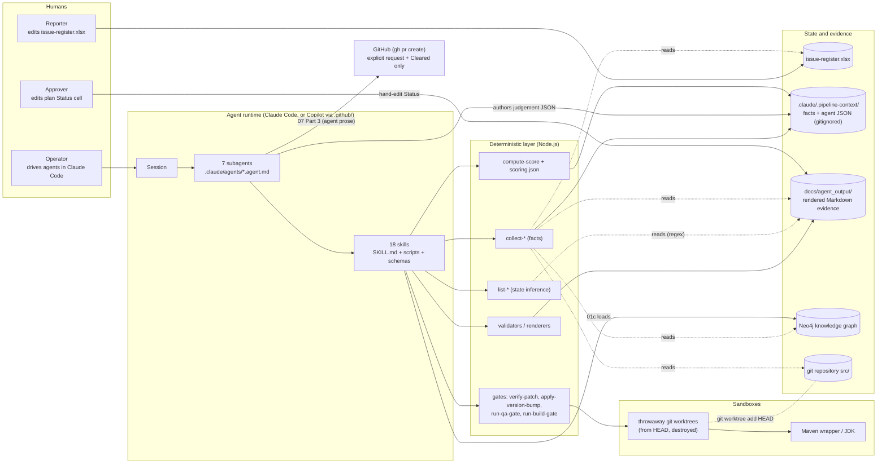
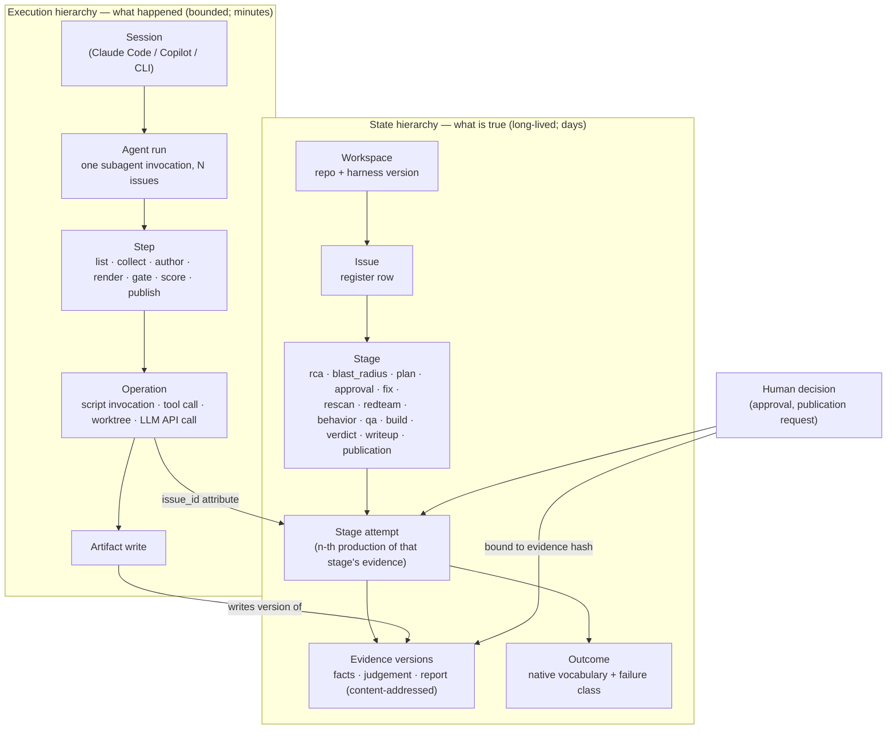
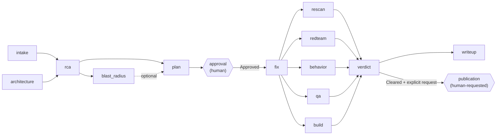
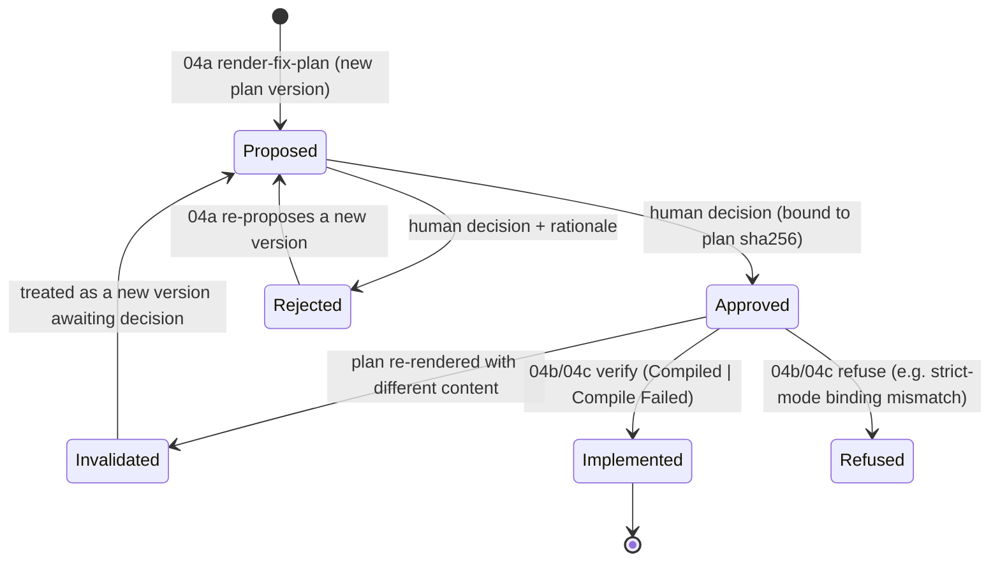
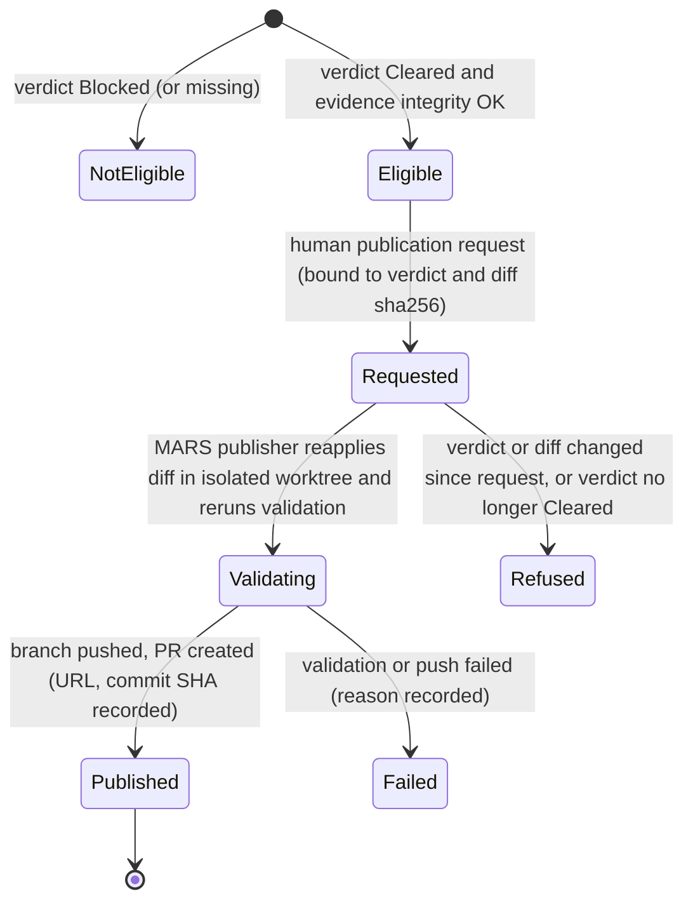
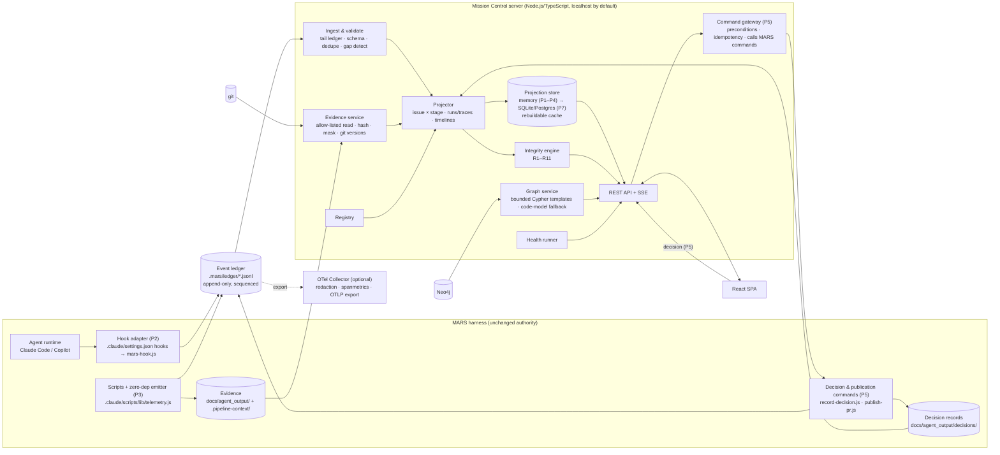
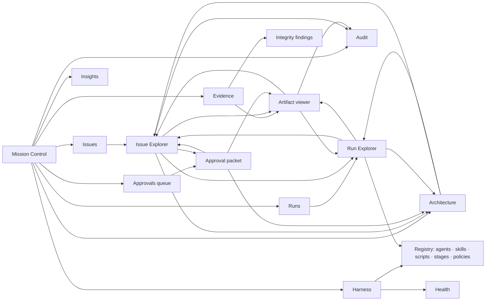

# MARS Mission Control — Architecture, Observability, UX, and Implementation Proposal

| | |
|---|---|
| **Status** | Proposal for review. Nothing described here is implemented. No MARS agent, skill, script, contract or generated artifact was changed to produce it. |
| **Date** | 2026-09-30 (repository inspection and external research both performed on this date) |
| **Repository state inspected** | branch `feature/04d-version-migration-v2`, commit `5b8008b`, clean working tree |
| **Scope** | What MARS Mission Control should be, what it must show, how it gets its data, how it integrates with MARS without weakening MARS's safety model, and in what order to build it |

**How to read the evidence labels used throughout**

- **[Repo]** — verified by reading or executing (read-only) something in this repository. A file reference follows.
- **[Doc]** — documented fact from an external source. The source link is in the section or in [Appendix A](#appendix-a--sources).
- **[Rec]** — a recommendation or inference made in this proposal. Every major [Rec] names the [Repo] or [Doc] evidence that motivated it.

---

## Contents

**Part I — MARS as it actually is**
1. [Executive summary](#1-executive-summary)
2. [What MARS is today](#2-what-mars-is-today)
3. [Repository findings](#3-repository-findings)
4. [Current MARS architecture](#4-current-mars-architecture)
5. [Actual pipeline and execution model](#5-actual-pipeline-and-execution-model)
6. [Agent / skill / script / stage inventory](#6-agent--skill--script--stage-inventory)
7. [Existing artifact model](#7-existing-artifact-model)
8. [Current observability gaps](#8-current-observability-gaps)

**Part II — What comparable systems teach**
9. [Research method](#9-research-method)
10. [Comparable systems matrix](#10-comparable-systems-matrix)
11. [Lessons from agent observability platforms](#11-lessons-from-agent-observability-platforms)
12. [Lessons from workflow and CI/CD platforms](#12-lessons-from-workflow-and-cicd-platforms)
13. [Lessons from APM and tracing platforms](#13-lessons-from-apm-and-tracing-platforms)
14. [Lessons from security and remediation platforms](#14-lessons-from-security-and-remediation-platforms)
15. [Lessons from human-in-the-loop systems](#15-lessons-from-human-in-the-loop-systems)
16. [Lessons from MARS's own prior Control Center](#16-lessons-from-marss-own-prior-control-center)

**Part III — The product**
17. [Product definition](#17-product-definition)
18. [Personas and lenses](#18-personas-and-lenses)
19. [Information architecture](#19-information-architecture)
20. [Mission Control (home)](#20-mission-control-home)
21. [Run Explorer](#21-run-explorer)
22. [Issue Explorer](#22-issue-explorer)
23. [Agent and Skill Explorers (the Registry)](#23-agent-and-skill-explorers-the-registry)
24. [Architecture Explorer](#24-architecture-explorer)
25. [Approval Center](#25-approval-center)
26. [Verification and test gates](#26-verification-and-test-gates)
27. [Evidence (Artifact) Explorer](#27-evidence-artifact-explorer)
28. [Audit Explorer](#28-audit-explorer)
29. [Analytics](#29-analytics)
30. [Harness Health and synthetic checks](#30-harness-health-and-synthetic-checks)
31. [Two graphs, and the correlation between them](#31-two-graphs-and-the-correlation-between-them)

**Part IV — The architecture**
32. [Domain model](#32-domain-model)
33. [Event model](#33-event-model)
34. [OpenTelemetry strategy](#34-opentelemetry-strategy)
35. [Source-of-truth matrix](#35-source-of-truth-matrix)
36. [Discovery instead of hardcoded inventory](#36-discovery-instead-of-hardcoded-inventory)
37. [Backend architecture](#37-backend-architecture)
38. [Real-time transport](#38-real-time-transport)
39. [Frontend architecture, state and real-time behaviour](#39-frontend-architecture-state-and-real-time-behaviour)
40. [Visual design system](#40-visual-design-system)
41. [Security and enterprise architecture](#41-security-and-enterprise-architecture)
42. [Threat model](#42-threat-model)
43. [API requirements](#43-api-requirements)

**Part V — Grounding, plan and decision**
44. [Walkthrough: ISSUE-003 (and ISSUE-002 as contrast)](#44-walkthrough-issue-003-and-issue-002-as-contrast)
45. [Screen map](#45-screen-map)
46. [Wireframes](#46-wireframes)
47. [What not to build](#47-what-not-to-build)
48. [MVP recommendation](#48-mvp-recommendation)
49. [Incremental roadmap](#49-incremental-roadmap)
50. [Required MARS changes](#50-required-mars-changes)
51. [Risks and tradeoffs](#51-risks-and-tradeoffs)
52. [Design review of this proposal](#52-design-review-of-this-proposal)
53. [Open questions](#53-open-questions)
54. [Final recommended architecture (answers A–O)](#54-final-recommended-architecture)

[Appendix A — Sources](#appendix-a--sources) · [Appendix B — Glossary](#appendix-b--glossary)

---

# Part I — MARS as it actually is

## 1. Executive summary

**MARS today** is a human-gated vulnerability-remediation pipeline that runs *inside* Claude Code. It
is seven subagent personas (`.claude/agents/`), eighteen skill folders (`.claude/skills/`), 49 entry
scripts plus 23 library modules (deterministic Node.js), a Neo4j knowledge graph of the target
application, and a tree of Markdown evidence under `docs/agent_output/`. There is no orchestrator, no
run identity, no event stream, no hooks and no telemetry. Pipeline state is not stored anywhere. It
is *inferred* from which Markdown files exist and from table cells that later stages read with
regular expressions. [Repo]

**Six findings shape this whole proposal.**

1. **The assumed execution hierarchy is wrong for MARS.** Agents run in *batches across issues*
   (`--all` is the default), not once per issue, and MARS has no "task" entity. The real model is
   two hierarchies joined by issue ID: a per-issue **state** hierarchy (Issue → Stage → Attempt →
   Evidence → Gate → Verdict → Publication) and a per-invocation **execution** hierarchy (Session →
   Agent run → Step [collect · author · render · gate · score] → Script or tool call → Artifact
   write). Skills are toolboxes that steps use, not invocations. ([§5](#5-actual-pipeline-and-execution-model))
2. **The on-disk evidence is internally inconsistent, and the deterministic scorer would act on it.**
   All eight QA and build reports in `docs/agent_output/06-test-gate/` state `Status: Passed` in their
   header, while their own result tables record exit code `1`. The four verdicts, computed earlier,
   recorded those gates as `Failed`. Replaying `compute-score.js` read-only against today's files
   (output redirected to a scratch directory) turns **ISSUE-003 and ISSUE-004 from Blocked into
   Cleared at 100/100**, even though no test or build for either patch has ever succeeded.
   ([§3.4](#34-evidence-integrity-the-on-disk-reports-contradict-themselves))
3. **Human approval leaves no attributable record, and an approval can outlive the plan it
   approved.** Approval is hand-editing a Markdown table cell. No identity, time or plan version is
   recorded. ISSUE-003's plan was re-proposed and substantially rewritten *after* its patch existed,
   and it kept `Status: Approved`. ([§3.5](#35-approval-integrity))
4. **The gates cannot say *why* they failed.** According to MARS's own AI-written verdict narratives,
   three of four issues are Blocked mainly by a JDK 25 / Lombok toolchain mismatch against a Java 17
   project, not by their patches. The deterministic gates can only say `Failed`, so that attribution
   is unverified. The obvious location-based heuristic would misclassify at least one case. ISSUE-002
   is the one issue whose security verification itself fails.
   ([§3.6](#36-failure-classification-toolchain-failures-look-identical-to-patch-failures))
5. **PR publication is unscripted and unrecorded.** It is prose in agent 07 ("create a branch … run
   `gh pr create`") that leaves no artifact. ([§5.13](#513-how-pr-publication-is-controlled))
6. **MARS already contains the right patterns, in two places.** The new 04d migration skill infers
   state from evidence and keeps a `state.json` transition ledger. The previous MARS (kept untracked
   in `older-project/`) shipped a Control Center built on "events are witnesses, not authority",
   SSE replay and hash-bound, write-once decisions. ([§3.8](#38-prior-art-already-inside-this-repository), [§16](#16-lessons-from-marss-own-prior-control-center))

**What Mission Control should be.** [Rec] A **remediation operations console with evidence-grade
observability**, organized around the issue lifecycle and the boundary of human authority. It answers
four questions in this order:

1. What needs a human now?
2. Where is every issue, and what is blocking it, by *class* of cause?
3. Can I trust the evidence behind that status?
4. What exactly did MARS do, and when?

It is not an LLM token and cost console, not a chat interface and not a second workflow engine.

**How it gets its data.** [Rec] *Evidence is authority; events are witnesses.* Rendered evidence and
decision records stay authoritative, exactly as MARS uses them today. A new, append-only, MARS-native
event log, compatible with OpenTelemetry (OTel), records what happened and when. It is fed first by
Claude Code hooks (configuration only, no agent changes) and later by a tiny zero-dependency emitter
inside the scripts (runtime-agnostic, so it also covers the Copilot harness in `.github/`). Mission
Control is a read-only projection over both. Human decisions enter MARS only through MARS-owned
commands that bind each decision to a content hash.

**What can be built now.** [Rec] A read-only Evidence Board, with zero MARS changes. It parses the
same Markdown contract the pipeline itself parses, adds cross-checks that surface finding 2 and
finding 3 automatically, and shows a reconstructed timeline labelled as reconstructed.

**What must come before true live observability.** [Rec]
- Hooks-based activity events.
- Then script-level events carrying input and output hashes, the base commit, durations and a
  deterministic failure class.
- Then decision records and a publication record.

**Recommended sequence.** [Rec]

| Phase | Content |
|---|---|
| Prerequisite (MARS-side) | Evidence-integrity hardening ([§50](#50-required-mars-changes)) |
| P0 | Contracts |
| P1 | Read-only board |
| P2 | Passive hooks |
| P3 | Script emitter and hashes |
| P4 | Live Run Explorer |
| P5 | Decision records and the Approval Center |
| P6 | Architecture correlation |
| P7 | History and analytics |
| P8 | Enterprise governance |

Every phase is additive. None changes a gate's pass or fail semantics, except P5's stricter approval
binding, which is opt-in and needs a contract amendment.

## 2. What MARS is today

MARS (in this repository) is the **Agentic Remediation Harness** described in
[`.claude/README.md`](../../.claude/README.md). Given a spreadsheet of reported vulnerabilities and a
Java/Spring Cloud application, it produces, per issue:

- a root-cause diagnosis,
- a measured blast radius,
- a CWE-aligned remediation plan that a human must approve,
- a minimal patch verified in a throwaway `git worktree`,
- three independent reasoning-based verification reports,
- a deterministic regression-test gate and build gate,
- a deterministic Cleared/Blocked verdict,
- PR content and an audit trail,
- and, only on explicit request and only for a Cleared verdict, a published PR.

Its defining architectural ideas are stated in the harness README and are real in the code. [Repo]

| Idea | Where it is enforced |
|---|---|
| Facts are collected by scripts; judgement is written by agents; renderers merge the two | every skill has `collect-*` → agent-authored `*.json` validated against `templates/*.schema.json` → `render-*` |
| Normal analysis never edits the real repository | every patch is applied in `git worktree add --detach … HEAD` and removed in a `finally` block (`04b-fixer/scripts/verify-patch.js`, `05-verify/scripts/lib/verify.js`, `06a`, `06b`) |
| One stage may declare a patch safe | `07a-merge-arbiter/scripts/compute-score.js` + `scoring.json`; the agent may only override `Cleared` → `Blocked` (`render-verdict.js`, checked by `pipeline-lint.js`) |
| Determinism where it counts | QA and build pass/fail come from real exit codes (`run-qa-gate.js`, `run-build-gate.js`) |
| Human checkpoint before code | 04b/04c refuse unless the plan's `Status` cell reads exactly `Approved` (`verify-patch.js:161`) |

The application under analysis is six Spring Boot 2.7 / Java 17 services in [`src/`](../../src). The
[`Jenkinsfile`](../../Jenkinsfile) is that application's own deploy pipeline. It checks out an
external GitHub repository and deploys WARs to a local Tomcat. It does not run, call or know about
MARS. [Repo]

## 3. Repository findings

### 3.1 What was inspected

- Every file under `.claude/`: 7 agents, 18 skill folders, the contract, the lint script, settings,
  and `.pipeline-context/`.
- The `.github/` mirror harness.
- All 61 files in `docs/agent_output/`.
- The README files.
- The `Jenkinsfile` and the six Maven modules.
- The code model (`artifacts.json`) and semantic layer (`descriptions.json`).
- The Neo4j snapshot recorded in `architecture.md`.
- The untracked `older-project/` (the previous MARS and its Control Center).
- Local Claude Code session transcript *structure*; field names only, no content was read.

These read-only scripts were executed:

- every `list-*.js` workload script except `list-context-workload.js` (which writes a file);
- `node .claude/scripts/pipeline-lint.js`, which passes;
- one replay of `compute-score.js` with `PIPELINE_CONTEXT_DATA_DIR` pointed at a scratch directory
  outside the repository.

`git status` was clean before and after.

### 3.2 Facts in numbers

| Item | Count | Source |
|---|---|---|
| Agents | 7 (`01_architect` … `07_audit-and-pr`) | `.claude/agents/*.agent.md` |
| Skill folders | 18 (00, 01a–d, 02, 03, 04a, 04a1, 04a2, 04b, 04c, 04d, 05, 06a, 06b, 07a, 07b) | `.claude/skills/` |
| Entry scripts / library modules | 49 / 23 (plus 1 optional Python helper, `04a1/scripts/embed.py`) | `.claude/skills/*/scripts/` |
| Judgement schemas | 16 `*.schema.json` | `.claude/skills/*/templates/` |
| Zero-npm-dependency skills | 11 of the 17 code-bearing skills in `.claude` (04d's code exists only in `.github`) | `package.json` per skill |
| Issues in the register | 4 (ISSUE-001…004), all register-status `Open` | `list-register.js` |
| Generated evidence files | 61 | `docs/agent_output/` |
| Current verdicts | 4 × Blocked (scores 30, 0, 60, 60) | `07-ship/verdict_*.md` |
| Parsed code model | 6 modules, 51 files, 51 types, 57 methods, 272 call sites | `.claude/.pipeline-context/artifacts.json` (generated 2026-09-30 in this checkout) |
| Semantic layer | 77 node descriptions + 3 cross-cutting notes; author `mixed (architect-agent + llm:google:gemini-3.5-flash-lite)` | `.claude/.pipeline-context/context/descriptions.json` |
| Neo4j snapshot (as recorded) | Method 110, Type 101, Package 74, MavenDependency 19, ContextNote 12, Endpoint 10, Module 6, ExternalType 4 | `01-architecture/architecture.md` §Live Graph Snapshot |

The Neo4j counts are roughly double the parsed model (101 types against 51). `build-graph.js` only
ever `MERGE`s and never deletes or prunes, so nodes from earlier loads accumulate. Neo4j is not
configured in this checkout (there is no `.env` in `01c-graph-forge/`), so this could not be checked
live. **Mission Control must therefore treat the graph as a derived, possibly stale view with its
own generation identity**, never as ground truth. [Repo]

### 3.3 Documentation drift

Mission Control must not hardcode counts or names from documentation, because the documentation
disagrees with the filesystem and with itself:

| # | Documentation says | Repository shows | Where |
|---|---|---|---|
| D1 | "14 skills", "8 of 14 zero-dep" | 18 skill folders; 04a1, 04a2, 04c and 04d are missing from its tables | `.claude/README.md` badges and skill table |
| D2 | "18 skills", "12 of 18 zero-dep" | the Copilot mirror's README counts differently from the Claude one | `.github/README.md` |
| D3 | "nine distinct pipeline stages"; status table numbers stages 04–11 | output folders are numbered 00–07; at least 15 distinguishable stage nodes exist ([§6.4](#64-pipeline-stages-derived-canonical-list)) | `.claude/README.md` |
| D4 | layout shows `.claude/docs/…` | outputs live in `docs/agent_output/` | `.claude/README.md` repository layout |
| D5 | agent 06: QA and build gates "refuse outright if the fix isn't `Compiled`"; 05-verify: 06 "stays correctly gated on Status: Compiled" | both gate scripts accept `Compiled` **and** `Compile Failed` (`STEP2_ELIGIBLE_STATUSES`) and refuse only `Refused`; the contract agrees with the scripts | `06_additional-test-execution.agent.md`, `05-verify/SKILL.md`, `06a/…/lib/qa.js`, `06b/…/lib/gate.js` |
| D6 | contract lists 7 agents' ownership | contract does not mention 04a1, 04a2, 04c or 04d | `.claude/pipeline-contract.md` |
| D7 | 04d is a pipeline skill | 04d is referenced by no agent and not by the contract in either harness; it is a standalone, user-invoked skill whose code lives only in `.github/` | `grep 04d .claude/agents .github/agents` |
| D8 | register README "Current register" lists 3 issues; refers to `.claude/.architect/artifacts.json` | 4 issues; data directory is `.claude/.pipeline-context/` | `docs/agent_output/00-issues/README.md` |
| D9 | historical summary: 3 issues, "2 cleared to ship via evidenced override", paths under `10-build/` | today's contract forbids any override toward Cleared; 4 issues; all Blocked | `docs/agent_output/VULNERABILITY_REMEDIATION_SUMMARY.md` (marked historical by the contract) |
| D10 | `.claude/` is a path-swapped mirror of `.github/` | 19 files differ substantively. The `.github` gate and fixer scripts still resolve modules at the repository root (`f.split('/')[0]`), while the `.claude` copies were adapted to `src/<module>`. The Copilot harness would fail module detection in this repository layout | diff after path normalization |
| D11 | root README: Jenkins "gates deployment" for this repository | the Jenkinsfile checks out `https://github.com/Vihanga22365/springboot-assignment.git` (branch `master`), not this checkout | `Jenkinsfile` |
| D12 | gate reports: "Every line below comes straight from the gate script — nothing here is agent-written" | each `06-test-gate/*.md` contains an agent-written "Why this is environmental" paragraph | [§3.4](#34-evidence-integrity-the-on-disk-reports-contradict-themselves) |

`pipeline-lint.js` passes despite D5–D7 and D12, because it checks a fixed list of phrases. It does
not check counts, the mirror harness or rendered evidence. [Repo]

### 3.4 Evidence integrity: the on-disk reports contradict themselves

The merge arbiter reads each upstream verdict from the rendered Markdown with a regex
(`extractField(text, 'Verdict') || extractField(text, 'Status')` in `07a…/lib/arbiter.js`). The
Markdown header is therefore the inter-stage contract. Today the headers and the bodies disagree:

| Report | Header `Status` | Own result table | Index (`06-test-gate/README.md`) | Verdict that consumed it |
|---|---|---|---|---|
| `qa_ISSUE-001…004.md` | **Passed** (all four) | test `FAIL`, exit code `1` (all four) | Failed (rows present) | Failed (0/40) |
| `build_ISSUE-001…004.md` | **Passed** (all four) | `mvnw verify` exit code `1` where shown | Failed | Failed (hard gate triggered) |

The renderers cannot produce this combination. Both map `result.passed ? 'Passed' : 'Failed'`
(`render-qa-report.js:22`, `render-build-report.js:22`), and a non-zero exit sets `passed = false`.
Neither emits the "environmental" paragraphs now present. The reports were edited after rendering.
The Scribe's own `audit_ISSUE-003.md` noticed and recorded the contradiction rather than reconciling
it.

**Replay.** `compute-score.js --all`, run with its working directory redirected to a scratch folder,
produces from today's files:

| Issue | Recorded verdict | Replayed computed decision |
|---|---|---|
| ISSUE-001 | Blocked 30/100 | Blocked 70/100 (QA now counted 40/40) |
| ISSUE-002 | Blocked 0/100 | Blocked 40/100 (re-scan hard gate still triggers) |
| ISSUE-003 | Blocked 60/100, build hard gate | **Cleared 100/100**, no hard gate |
| ISSUE-004 | Blocked 60/100, build hard gate | **Cleared 100/100**, no hard gate |

Consequences for Mission Control:

- A UI that reads headers, as the pipeline does, would display two unverified patches as
  ship-ready.
- A UI that only reads verdicts would hide that the evidence underneath them no longer supports them.
- The only safe design shows *each* representation with its provenance, checks them against each
  other, and raises an integrity finding when they diverge.

This finding is the strongest repository evidence for "instrument first": the authoritative facts (exit codes) exist only as rendered text that
anyone can edit, and nothing binds a verdict to the exact bytes it was computed from. [Repo]

### 3.5 Approval integrity

- **Mechanism.** A plan is approved when its `| **Status** | … |` cell reads `Approved`. The Fixer
  checks this immediately before acting (`verify-patch.js:161`; `apply-version-bump.js` likewise).
  [Repo]
- **No attribution.** Nothing records who changed the cell, when, or from what. All 61 evidence files
  arrived in a single import commit (`93200e2`, 2026-09-30), so even git history cannot answer these
  questions for the current data. [Repo]
- **Approval survives re-proposal.** `render-fix-plan.js:191` preserves `Approved`/`Rejected` when a
  plan is re-rendered from a new strategy, and adds a one-line note.
  `fix_plan_ISSUE-003.md` carries exactly that note: "re-proposed on 2026-08-16; its Status
  (Approved) was preserved". Its body was then extended with source quotations, expanded risks and
  a reviewer checklist that cross-checks "the applied patch". That is content written after
  implementation, under an approval given to an earlier version. [Repo]
- **Partial implementation is visible only in prose.** The plan says the controller-side allow-list
  validation "is not present in the applied diff". The diff touches only
  `EmployeeSearchRepository.java`. Yet `fix_ISSUE-003.md`'s table lists three files changed, including
  "Added allow-list validation", and says "Matches plan: yes". [Repo]

Mature approval systems bind an approval to an immutable digest and invalidate it when the reviewed
object changes ([§15](#15-lessons-from-human-in-the-loop-systems)). MARS currently cannot.

### 3.6 Failure classification: toolchain failures look identical to patch failures

Gate records carry `stage` (`worktree-create`, `module-detection`, `patch-apply-check`,
`patch-apply`, `complete`), per-step `exitCode`, and the last 4,000 characters of output
(`06b…/lib/gate.js` `tail`). [Repo] They carry no cause. In the current data:

| Issue | Security signals | What actually blocks it | Who says so |
|---|---|---|---|
| ISSUE-001 (CWE-770) | re-scan FIXED, red-team NO_BYPASS | behaviour regression: only page 0 is read, so data over 500 rows is silently truncated; build failure is environmental | merge-arbiter narrative (AI) |
| ISSUE-002 (CWE-306) | re-scan **STILL_VULNERABLE**, red-team **BYPASS_FOUND** (other services still anonymous; new hardcoded credential) | genuine security verification failure | re-scan + red-team verdicts (AI over script facts) |
| ISSUE-003 (CWE-943) | FIXED, NO_BYPASS, BEHAVIOUR_PRESERVED | only the build environment (JDK 25 vs Java 17 Lombok): "Re-run on a JDK 17 toolchain and this should clear" | merge-arbiter narrative (AI) |
| ISSUE-004 (CWE-1104) | FIXED, NO_BYPASS, BEHAVIOUR_PRESERVED | only the build environment | merge-arbiter narrative (AI) |

The skill docs already describe the deterministic test a script could run. It is documented as a manual step and nothing executes it:

- check whether the error locations fall outside `files_changed`, and
- whether the unpatched module fails identically

(`04b-fixer/SKILL.md` "Known caveats"). Mission Control must render "Blocked — environment" and
"Blocked — security verification" as visibly different things. To do that from evidence rather than
from AI prose, MARS must compute the class ([§50](#50-required-mars-changes), change C5). [Repo/Rec]

### 3.7 Provenance

- **Foreign origin.** Every gate log in `docs/agent_output/` shows paths under a different checkout
  (`D:/Office Research/…/sample-java-project/.claude/.architect/…`) and the harness's former data
  directory name (`.architect`, now `.pipeline-context`). The evidence was produced by an earlier
  harness version elsewhere and copied in. [Repo]
- **Mismatched timestamps.** `artifacts.json` was regenerated here on 2026-09-30, while the evidence
  dates from 2026-08-16 and 2026-08-31. The code model and the evidence describe the same code only
  by assumption: no artifact records a base commit SHA, a harness version, or a hash of its inputs.
  The only hashes anywhere are Context Weaver's description fingerprints. [Repo]
- **Policy changed over time.** The historical summary records overrides to Cleared, which the current
  contract forbids. A verdict cannot be interpreted without knowing which `scoring.json` and contract
  version produced it, and neither is recorded. [Repo]

### 3.8 Prior art already inside this repository

| Prior art | What it does | Relevance |
|---|---|---|
| `.github/skills/04d-version-migration/scripts/lib/migration.js` (`inferState`, `recordState`, `redact`) | State is *inferred from evidence on disk*. `state.json` adds only "what files cannot say": a transition history with `{state, at, by}` and an explicit `BLOCKED`/`FAILED` with reason. Secrets are redacted before anything is written. Its own architecture document says "This is not a workflow engine." | The exact authority model Mission Control should generalize: evidence first, ledger second, never a parallel state machine |
| `older-project/` (untracked; the previous Java-based MARS) | A shipped **Control Center**: React 19 + Vite + Tailwind 4 + TanStack Query/Virtual + XYFlow + Cytoscape + Mermaid + react-diff-view. Also an append-only `events.jsonl` with gap-free sequence numbers, SSE with `Last-Event-ID` replay, hash-bound HMAC write-once decisions with `actor_authentication`, viewer/operator/approver/admin roles, and architecture tests forbidding the web layer from writing state | Validated decisions to reuse. Its *engine-centric* command model does not transfer as-is, because the current MARS has no engine ([§16](#16-lessons-from-marss-own-prior-control-center)) |

## 4. Current MARS architecture



Three properties of this architecture drive the Mission Control design:

1. **Everything is wired through files.** The workload of every stage is "every file the previous
   stage wrote" (harness README). There is no message bus to tap.
2. **The deterministic layer is the only reliable chokepoint.** Every authoritative output is written
   by a script, and every script is invoked through the runtime's shell tool. That makes scripts the
   right place for runtime-agnostic instrumentation, and runtime hooks the right place for agent and
   skill attribution.
3. **There are two runtimes.** `.claude/` (Claude Code) and `.github/` (GitHub Copilot custom
   agents, with `tools: [execute, read, agent, edit, search, todo]`). Hooks are runtime-specific;
   script-level events are not.

## 5. Actual pipeline and execution model

### 5.1 What starts work

A human opens Claude Code in the repository and asks for an agent by name ("run the
02_root-cause-analyst agent", per `.claude/README.md` "Getting started"). Nothing schedules, queues
or chains agents. The operator runs them in numeric order. No CI job, Jenkins stage, cron or headless
invocation exists for MARS. [Repo]

### 5.2 How issues enter

A reporter appends a row to `docs/agent_output/00-issues/issue-register.xlsx`. Every consumer reads
it through `00-issue-register/scripts/lib/register.js`, which rebuilds each row into a Markdown body
(`## Summary`, `## Observed Behavior`, `## Detection Notes`). That body is what downstream regexes
extract. The register's `status` column (`Open | In Progress | Fixed | Closed`) is reporter-owned and
is **not** updated by the pipeline; all four issues still read `Open`. [Repo]

### 5.3 How an agent is invoked

Claude Code launches the subagent defined in `.claude/agents/<name>.agent.md`. Its `tools:` line
(`Bash, Read, Edit, Write, Glob, Grep`) never grants the Agent tool, and the lint enforces that
("Subagents never delegate"). With no argument, each agent processes **every eligible issue**; with an
issue id, it processes one. One agent invocation therefore produces work for N issues. [Repo]

### 5.4 How skills are selected

Skill selection is written into agent prose, not resolved at runtime:

- 01 runs 01a → 01b → 01c → 01d in order;
- 04 Stage 1 runs 04a, falling back to 04a1 only if *every* detected CWE is uncatalogued, and to 04a2
  only on a knowledge-base gap;
- 04 Stage 2 routes `CWE-1104` to 04c and everything else to 04b.

Agents are told to *read* `SKILL.md` and then run the scripts through Bash. Using the Skill tool is
not required, so **a skill "invocation" is often only observable as a Read of its `SKILL.md` followed
by Bash calls into `.claude/skills/<skill>/scripts/`**. [Repo] This is why
[§23](#23-agent-and-skill-explorers-the-registry) recommends treating a skill as span *metadata*,
derived from script paths, rather than as a first-class runtime span.

### 5.5 How scripts participate: the step types

Every per-issue stage is a sequence of typed steps. [Repo]

| Step type | Performed by | Determinism | Example |
|---|---|---|---|
| **list** | script | deterministic, read-only | `list-fix-workload.js` infers state from files |
| **collect** | script | deterministic | `collect-evidence.js` → `rca/<id>.evidence.{json,md}` |
| **author** | agent (Write tool) | LLM judgement, schema-constrained | `rca/<id>.analysis.json`, `fixer/<id>.patch.diff`, `qa/<id>.new-test.diff` |
| **validate + render** | script | deterministic | `render-root-cause.js` validates the analysis and writes the report |
| **gate** | script in a worktree | deterministic outcome from exit codes | `verify-patch.js`, `apply-version-bump.js`, `run-qa-gate.js`, `run-build-gate.js` |
| **score** | script | deterministic | `compute-score.js` |
| **human** | person | human judgement | Status cell edit; explicit PR request |
| **publish** | agent (git/gh in Bash) | agent action, not scripted | 07 Part 3 |

### 5.6 Where deterministic execution and LLM judgement happen

LLM judgement is confined to *author* steps:

- architecture descriptions;
- RCA analysis;
- blast-radius narrative;
- fix strategy (including 04a2 research);
- patch and rationale;
- the three verification verdicts;
- the QA test and its plan;
- the arbitration narrative and conservative override;
- the scribe content.

Everything else is deterministic. Two exceptions sit outside Claude Code itself:

- `01b-context-weaver/scripts/generate-descriptions.js` can call Anthropic, OpenAI or Google APIs
  directly;
- `04a1` can rank with a local sentence-embedding model.

[Repo]

### 5.7 Where artifacts are written

| Location | Contents | Tracked in git |
|---|---|---|
| `.claude/.pipeline-context/<stage>/` | facts, agent JSON, script results, transient worktrees | gitignored, except `context/descriptions.json` (tracked as expensive interpretive content) |
| `docs/agent_output/NN-*/` | rendered reports, diffs and index `README.md` files | committed |
| Neo4j | the knowledge graph | external |

[Repo]

### 5.8 How state passes between stages

State passes through the files themselves and the regex contract over them. Examples:

- `| **Status** | Approved |` gates 04b and 04c;
- `| **Status** | Compiled \| Compile Failed |` gates 05, 06 and 07;
- `| **Verdict** | … |` and `| **Status** | … |` feed 07a;
- `| **Decision** | … |` feeds 07b and publication.

Workload scripts recompute state on every call from what exists on disk. [Repo]

### 5.9 How approvals work

There are two human checkpoints:

1. The plan Status cell (`Proposed` → `Approved | Rejected`), edited by hand.
2. An explicit chat request to publish a Cleared PR.

Neither is recorded as a record of its own ([§3.5](#35-approval-integrity)). [Repo]

### 5.10 How patches are generated and worktrees used

1. The agent writes a unified diff to `.pipeline-context/fixer/<id>.patch.diff`.
2. `verify-patch.js` refuses unless the plan is Approved.
3. It removes any stale worktree, then runs `git worktree add --detach <dir> HEAD`.
4. It runs `git apply --check`, then `git apply`, then the module's Maven wrapper (`compile`,
   optionally one named test).
5. It records the result and removes the worktree in `finally`.

05, 06a and 06b each create their *own* worktree from `HEAD` for their own purpose. The base SHA is
never recorded. [Repo]

### 5.11 How tests and verification execute

| Check | How it runs | Who decides the outcome |
|---|---|---|
| 05 re-scan, red-team, behaviour | a worktree materializes the patched files; the agent reasons over them (no compiler, no live service) | agent |
| 06a QA | applies the fix diff and the agent's single new test diff, runs `mvnw -q test -Dtest=<Class>`; an optional existing test is SKIPPED if it carries a live-dependency marker | script (exit code) |
| 06b build | records `dependency:tree` before the patch, applies it, runs `mvnw -q verify -DskipITs`, then diffs `dependency:tree` after | script (exit code) |

[Repo]

### 5.12 How final decisions are made

`compute-score.js` decides:

1. hard gates first (re-scan `STILL_VULNERABLE`, build `Failed`);
2. then weighted points (red-team 30, behaviour 30, QA 40) against a severity threshold (90 / 85 /
   75 / 65).

The agent writes a narrative and may only turn a computed Cleared into Blocked, with a reason.
`render-verdict.js` shows both side by side. [Repo]

### 5.13 How PR publication is controlled

The controls are the agent prose in 07 Part 3 and the contract:

- the Decision must be exactly `Cleared`;
- the user must request publication explicitly;
- the publisher reapplies the rendered diff in an isolated worktree, reruns validation, commits,
  pushes and runs `gh pr create`.

No script implements this and no record is written. The Scribe (07b) is forbidden to run `git` or
`gh`. [Repo]

### 5.14 The derived hierarchy

The hierarchy proposed in the brief (Run → Issue → Stage → Agent → Skill → Task → Script → Artifact)
does not match MARS, for four reasons:

- one agent run spans many issues;
- one stage can span two agents' worth of evidence;
- skills are not invocations;
- there is no task entity.

The model that fits is two linked trees:



The Issue × Stage board is a *projection* of the state tree. The Run Explorer is a view of the
execution tree. Every operation that writes evidence links the two through `issue_id` and the evidence
version's hash. Skills appear as an attribute (`skill_id`) of steps and operations.

## 6. Agent / skill / script / stage inventory

This inventory is what the Registry ([§36](#36-discovery-instead-of-hardcoded-inventory)) must be
able to *derive* automatically. It is written out here once, as the validation target.

### 6.1 Agents

| Agent | Responsibility | Inputs | Outputs | Skills | Determinism | Modifies code? | Final decision? | Human approval |
|---|---|---|---|---|---|---|---|---|
| `01_architect` | code model, semantic layer, knowledge graph, architecture docs (per workspace, not per issue) | `src/**` Java + POMs | `artifacts.json`, `descriptions.json`, Neo4j, `architecture.md`, `function-reference.md` | 01a → 01b → 01c → 01d | mixed: parse, load and render are deterministic; descriptions are AI-authored with author and confidence (optionally via external LLM APIs) | no | no | no |
| `02_root-cause-analyst` | one diagnosis per register issue | register (via 00), architecture docs, Neo4j | `rca/<id>.evidence.*`, `<id>.analysis.json`, `root_cause_<id>.md` | 00, 02 | collect / render deterministic; analysis AI | no | no | no |
| `03_blast-radius-analyst` | reach per diagnosis | root-cause reports, register, architecture docs, Neo4j | `blast-radius/<id>.facts.*`, `<id>.narrative.json`, `blast_radius_<id>.md` | 03 (00 via library) | Broken / Degraded / At-risk / Unaffected computed by rule; narrative AI | no | no | no |
| `04_fix-generator` Stage 1 | CWE-aligned plan per diagnosis | RCA, blast radius (optional), issue row, catalog, current source | `fix-strategy/<id>.*`, `fix_plan_<id>.md` (Proposed), `04-remediation/README.md` | 04a → (04a1 → 04a2) | strategy AI; catalog, KB ranking and rendering deterministic | no | no | its output **awaits** approval |
| `04_fix-generator` Stage 2 | smallest diff for an Approved plan | Approved plan, current source | `fixer/` or `dependency-upgrader/<id>.patch.diff`, `rationale.json`, `verification.*`, `fix_<id>.md` + `.diff` | 04b (or 04c for CWE-1104) | diff AI; apply and compile deterministic | drafts diffs; applies only in throwaway worktrees | no | **requires** Approved |
| `05_existing-app-test-agent` | re-scan, red-team, behaviour guard | fix (Compiled or Compile Failed), detection notes, RCA, plan, catalog anti-patterns | `verify/<id>.<check>.facts.*`, `.verdict.json`, three reports | 05 | facts deterministic; three verdicts AI | no | no | no |
| `06_additional-test-execution` | QA gate, then build gate | fix (Compiled or Compile Failed), source | `qa/<id>.new-test.diff` + `test-plan.json` (AI), `qa/` and `build/<id>.result.json` (script), `qa_<id>.md`, `build_<id>.md` | 06a, 06b | test authored by AI; both outcomes script-decided | drafts one test as a diff; worktree only | no | no |
| `07_audit-and-pr` | verdict, PR content and audit; publication on request | the five upstream reports | `merge/<id>.score.json` (script), `arbitration.json` (AI), `verdict_<id>.md`, `scribe/…`, `pr_<id>.md`, `audit_<id>.md`; on request, a branch and PR | 07a, 07b | decision deterministic; narrative AI; override may only tighten | publication commits the validated diff to a new branch | **yes**: the only release authority | publication **requires** an explicit request |

### 6.2 Skills

| Skill | Run by | Scripts (entry) | Judgement schema / config | npm dependencies | Neo4j | Notes |
|---|---|---|---|---|---|---|
| `00-issue-register` | library for 02, 03, 04, 05, 07 | `list-register` | (column contract in `lib/register.js`) | none (own XLSX reader) | — | read-only input owner |
| `01a-code-cartographer` | 01 | `scan` | — | tree-sitter, glob, fast-xml-parser | — | writes `artifacts.json` |
| `01b-context-weaver` | 01 | `list-context-workload`, `validate-context`, `lookup-context`, `generate-descriptions` | `descriptions.schema.json` | dotenv (+ optional LLM SDKs) | — | only script that calls external LLM APIs |
| `01c-graph-forge` | 01 | `build-graph` | — | neo4j-driver, dotenv | write (MERGE only) | no pruning |
| `01d-blueprint-scribe` | 01 | `generate-docs`, `generate-function-reference` | — | neo4j-driver, dotenv | read counts | |
| `02-root-cause-analyst` | 02 | `list-issues`, `collect-evidence`, `render-root-cause` | `analysis.schema.json` | neo4j-driver, dotenv | read | falls back to static call graph |
| `03-blast-radius-analyst` | 03 | `list-root-causes`, `collect-impact`, `render-blast-radius` | `narrative.schema.json` | neo4j-driver, dotenv | read | |
| `04a-fix-strategist` | 04 S1 | `list-remediation-workload`, `collect-remediation-context`, `render-fix-plan` | `strategy.schema.json`, `catalog/cwe-patterns.json` | none | — | preserves Approved across re-render |
| `04a1-remediation-intelligence` | 04 S1 fallback L2 | `detect-gap`, `run-fallback`, `test-sample` (+ `embed.py`) | `derived_pattern.schema.json`, `remediation-kb.json`, `ranking-weights.json` | none (optional Python venv) | — | always Low confidence |
| `04a2-remediation-research` | 04 S1 fallback L3 | `research-context`, `generate-strategy`, `test-sample` | 3 research schemas | none | — | evidence-gap plan if thin |
| `04b-fixer` | 04 S2 | `list-fix-workload`, `verify-patch`, `render-fix-report` | `rationale.schema.json` | none | — | worktree + compile |
| `04c-dependency-upgrader` | 04 S2 (CWE-1104) | `list-fix-workload`, `apply-version-bump`, `render-fix-report` | `rationale.schema.json` | none | — | checks declared **and** resolved versions |
| `04d-version-migration` | *(no agent; user-invoked)* | `.github` only: `detect-baseline`, `prepare-workspace`, `run-migration-build`, `apply-migration`, `probe-runtime`, `render-migration-report` | migration and plan schemas | (in `.github`) | — | has `state.json` ledger and `redact()` |
| `05-verify` | 05 | `list-workload`, `collect-{rescan,redteam,behavior}`, `render-{…}` | 3 verdict schemas | none | — | |
| `06a-qa-runner` | 06 | `list-qa-workload`, `run-qa-gate`, `render-qa-report` | `test-plan.schema.json` | none | — | SKIPPED for live-dependency tests |
| `06b-build-gatekeeper` | 06 | `list-build-workload`, `run-build-gate`, `render-build-report` | none, by design | none | — | zero agent content (by contract) |
| `07a-merge-arbiter` | 07 | `list-merge-workload`, `compute-score`, `render-verdict` | `arbitration.schema.json`, `scoring.json` | none | — | |
| `07b-scribe` | 07 | `list-scribe-workload`, `collect-chain`, `render-scribe` | `content.schema.json` | none | — | never runs git or gh |

### 6.3 Important scripts by role

| Role | Scripts | What Mission Control needs from them (future instrumentation) |
|---|---|---|
| State inference (`list-*`, 12) | one per skill | already support `--json` in several skills. They are the reference for the board's state rules, and the board should *reuse their logic*, not reimplement it |
| Collect (7) | `collect-evidence`, `collect-impact`, `collect-remediation-context`, `collect-{rescan,redteam,behavior}`, `collect-chain` | issue IDs, input artifact hashes, output hash, duration, Neo4j used or fallback |
| Gate (4) | `verify-patch`, `apply-version-bump`, `run-qa-gate`, `run-build-gate` | base commit, diff hash, worktree lifecycle, per-step exit codes and durations, failure class |
| Score (1) | `compute-score` | hashes of the five input reports, `scoring.json` hash, contract version |
| Render (12) | `render-*` | output hash, section-level provenance map, input hashes |
| Support | `scan`, `build-graph`, `generate-docs`, `generate-function-reference`, `validate-context`, `lookup-context`, `generate-descriptions`, `detect-gap`, `run-fallback`, `research-context`, `generate-strategy`, `test-sample` (2), `pipeline-lint` | graph generation ID and counts; external LLM call count, model and token usage, with no content |

### 6.4 Pipeline stages (derived canonical list)

[Rec] Mission Control needs stable stage IDs. These are derived from the code, not from the README's
numbering:

| Stage ID | Scope | Owner | Skills | Kind | Native outcome vocabulary | Evidence | Depends on |
|---|---|---|---|---|---|---|---|
| `intake` | per issue | reporter | 00 | human input | register `status` (reporter-owned) | `issue-register.xlsx` | — |
| `architecture` | **per workspace** | 01 | 01a–d | mixed | fresh / stale (fingerprints) | code model, semantic layer, graph, docs | source |
| `rca` | per issue | 02 | 00, 02 | collect → author → render | confidence High / Medium / Low | `root_cause_<id>.md` | intake, architecture |
| `blast_radius` | per issue | 03 | 03 | collect → author → render | scope, priority, service status | `blast_radius_<id>.md` | rca |
| `plan` | per issue | 04 S1 | 04a / 04a1 / 04a2 | collect → author → render | route (catalog / KB / research / evidence-gap), confidence | `fix_plan_<id>.md` | rca (+ blast_radius, optional) |
| `approval` | per issue | **human** | — | human | `Proposed` → `Approved` \| `Rejected` | Status cell (later: decision record) | plan |
| `fix` | per issue | 04 S2 | 04b / 04c | author → gate → render | `Compiled` \| `Compile Failed` \| `Refused` | `fix_<id>.md` + `.diff` | approval = Approved |
| `rescan` | per issue | 05 | 05 | collect → author → render | `FIXED` \| `STILL_VULNERABLE` \| `INCONCLUSIVE` | `rescan_<id>.md` | fix ≠ Refused |
| `redteam` | per issue | 05 | 05 | collect → author → render | `NO_BYPASS_FOUND` \| `BYPASS_FOUND` \| `INCONCLUSIVE` | `redteam_<id>.md` | fix ≠ Refused |
| `behavior` | per issue | 05 | 05 | collect → author → render | `BEHAVIOR_PRESERVED` \| `BEHAVIOR_CHANGED` \| `INCONCLUSIVE` | `behavior_<id>.md` | fix ≠ Refused |
| `qa` | per issue | 06 | 06a | author → gate → render | `Passed` \| `Failed` \| `Refused` (per test: PASS / FAIL / SKIPPED) | `qa_<id>.md` | fix ≠ Refused |
| `build` | per issue | 06 | 06b | gate → render | `Passed` \| `Failed` \| `Refused` + dependency drift | `build_<id>.md` | fix ≠ Refused |
| `verdict` | per issue | 07 | 07a | score → author → render | `Cleared` \| `Blocked` (+ override) | `verdict_<id>.md` | rescan, redteam, behavior, qa, build |
| `writeup` | per issue | 07 | 07b | collect → author → render | written | `pr_<id>.md`, `audit_<id>.md` | verdict |
| `publication` | per issue | 07 Part 3 on **human request** | — | human-requested action | *(unrecorded today)* | GitHub only | verdict = Cleared + request |
| `migration` | per workspace | user-invoked 04d | 04d | separate flow | 04d states (`BASELINE_DETECTED` … `READY_TO_APPLY`, `BLOCKED`, `FAILED`) | `.github/.pipeline-context/version-migration/<slug>/` | — |



### 6.5 Artifact types

| Type | Path pattern | Written by | Authorship | Read by (contract fields) | In git |
|---|---|---|---|---|---|
| Issue register | `docs/agent_output/00-issues/issue-register.xlsx` | reporter | human | 02, 03, 04, 05, 07 (column names) | yes |
| Code model | `.claude/.pipeline-context/artifacts.json` | `scan.js` | deterministic | 01b, 01c, 01d, 02, 03 | no |
| Semantic layer | `.pipeline-context/context/descriptions.json` | agent or `generate-descriptions.js` | AI (per-node author and confidence; fingerprint) | 01c, `lookup-context` | **yes** |
| Knowledge graph | Neo4j | `build-graph.js` | deterministic + `ctx*` AI layer | 01d, 02, 03 | external |
| Architecture docs | `01-architecture/architecture.md`, `function-reference.md` | 01d scripts | deterministic | 02, 03 | yes |
| RCA facts / analysis / report | `rca/<id>.evidence.{json,md}` / `<id>.analysis.json` / `02-root-cause/root_cause_<id>.md` | collector / agent / renderer | det / AI / mixed (declared in footer) | 03, 04, 05, 07b | report only |
| Blast-radius facts / narrative / report | `blast-radius/<id>.facts.*` / `.narrative.json` / `03-blast-radius/blast_radius_<id>.md` | " | " | 04, 04a2, 07b | report only |
| Remediation context / strategy / promotion candidate | `fix-strategy/<id>.context.*` / `.strategy.json` / `.promotion-candidate.json` | collector / agent or 04a1 / 04a2 | det / AI / AI | renderer | no |
| Fix plan | `04-remediation/fix_plan_<id>.md` | `render-fix-plan.js` | mixed; **Status cell human-edited** | 04b / 04c gate (`Status`, `CWE`, `Dependency` row), 05, 07b | yes |
| Patch draft / rationale / verification | `fixer/` or `dependency-upgrader/<id>.patch.diff` / `.rationale.json` / `.verification.{json,md}` | agent / agent / gate script | AI / AI / det | renderer | no |
| Fix report + diff | `04-remediation/fix_<id>.md`, `fix_<id>.diff` | `render-fix-report.js` | mixed | 05, 06, 07 (`Status`, `CWE`, `Patch` link, "What changed" links) | yes |
| Verification facts / verdicts / reports | `verify/<id>.<check>.facts.*` / `.verdict.json` / `05-verify/<check>_<id>.md` | collectors / agent / renderers | det / AI / mixed | 07a (`Verdict`) | reports only |
| QA test / plan / result / report | `qa/<id>.new-test.diff` / `.test-plan.json` / `.result.json` / `06-test-gate/qa_<id>.md` | agent / agent / gate / renderer | AI / AI / det / mixed | 07a (`Status`) | report only |
| Build result / report | `build/<id>.result.json` / `06-test-gate/build_<id>.md` | gate / renderer | deterministic only (declared) | 07a (`Status`) | report only |
| Score / arbitration / verdict | `merge/<id>.score.json` / `.arbitration.json` / `07-ship/verdict_<id>.md` | script / agent / renderer | det / AI / mixed | 07b, publication (`Decision`) | verdict only |
| Chain facts / content / PR / audit | `scribe/<id>.chain.facts.*` / `.content.json` / `07-ship/pr_<id>.md`, `audit_<id>.md` | collector / agent / renderer | det / AI / mixed | humans | PR and audit only |
| Stage indexes | `04-remediation/`, `05-verify/`, `06-test-gate/`, `07-ship/README.md` | renderers (shared marker) | deterministic | humans | yes |
| Historical summary | `docs/agent_output/VULNERABILITY_REMEDIATION_SUMMARY.md` | hand-written | human | — (historical; do not rewrite) | yes |
| Migration session | `.github/.pipeline-context/version-migration/<slug>/…` incl. `state.json` | 04d scripts / agent | mixed | 04d | not ignored by `.gitignore` |
| Transient worktrees | `.pipeline-context/<stage>/worktrees/<id>/` | gate scripts | — | — | removed |

## 7. Existing artifact model

What the current artifacts already give Mission Control, and what they lack: [Repo]

**Already present**

- **Stable naming by issue ID.** `<kind>_<ISSUE-ID>.md` everywhere. The issue ID is the universal join
  key.
- **Machine-readable "At a glance" tables.** A two-column `| **Label** | value |` table at the top of
  every report. This is the de facto API. Stage outcomes, CWE, severity, confidence, score and
  threshold are all extractable with the same regex the pipeline uses.
- **Declared provenance.** Every renderer appends a footer saying which parts are rendered from facts
  and which are agent judgement. Example: "The score, the gate results and the upstream links are
  computed by `compute-score.js` … The narrative … is the judgement of the merge-arbiter agent."
- **Timestamps.** Renderers stamp a date (`YYYY-MM-DD`). Collectors and gates stamp `generatedAt`
  (ISO, one per record). The audit trail's chain-of-custody table lists them in order.
- **Lineage by links.** Reports link to their upstream reports with relative paths.
- **Diagrams.** Mermaid in the RCA, blast-radius and README files, with a stated colour meaning (green
  correct, red broken, orange degraded, yellow at-risk).

**Missing**

- No content hash or version. Re-rendering overwrites, so the previous version is gone unless
  committed.
- No producer identity beyond prose: no run, session or harness version.
- No end times or durations.
- No input-to-output binding. A verdict does not say which bytes of which five reports it scored.
- Intermediate JSON is gitignored and absent from this checkout, so `score.json`, the `result.json`
  files and every `verdict.json` are unavailable. The rendered Markdown is the only durable evidence.
- Section-level provenance is prose, not data.

## 8. Current observability gaps

Each gap below was confirmed in the repository. None is assumed.

| # | What Mission Control cannot know today | Evidence | Consequence | Minimum instrumentation |
|---|---|---|---|---|
| G1 | Run or session identity | no `run_id` or `session_id` in any record | cannot group work, compare runs, or tie an artifact to an execution | hook-emitted session and agent-run IDs; scripts stamp `CLAUDE_CODE_SESSION_ID` or a `MARS_RUN_ID` |
| G2 | End time and duration of anything | `generatedAt` is stamped once at record creation; renderers stamp a date only | no stage durations, no bottleneck analysis | `script.started` / `script.completed` with monotonic duration |
| G3 | Which agent ran, and when | no hooks configured; `settings.local.json` holds only a permission allowlist | the "which agent is active" question is unanswerable | `SubagentStart` / `SubagentStop` hooks |
| G4 | Which skill and step was active | skills are read, not invoked; author steps are plain Write calls | no live "what is it doing" | `PreToolUse` / `PostToolUse` on Bash, Write, Edit and Skill, classified by path pattern |
| G5 | Which code was tested | worktrees use `HEAD`; the SHA is not recorded | cannot prove evidence matches the shipped commit | `git rev-parse HEAD` in every gate record |
| G6 | Which bytes a stage consumed or produced | no hashes (only 01b fingerprints) | stale or edited evidence undetectable; [§3.4](#34-evidence-integrity-the-on-disk-reports-contradict-themselves) | sha256 of inputs and outputs in every script record |
| G7 | Who approved which plan version, and when | Status-cell regex; single import commit | no accountability; approval survives re-proposal ([§3.5](#35-approval-integrity)) | decision record bound to the plan's sha256 |
| G8 | Whether, by whom and how a PR was published | 07 Part 3 is prose; no record | publication unauditable | publication script + publication record |
| G9 | Why a gate failed, by class | exit code and output tail only | environment and patch failures look identical ([§3.6](#36-failure-classification-toolchain-failures-look-identical-to-patch-failures)) | baseline run + error-location intersection → `failure_class` |
| G10 | Attempts and rework | overwrite on re-render; intermediates ignored | no rework metric, no attempt comparison | attempt counter + content-addressed archive of superseded versions |
| G11 | Evidence edited out of band | nothing detects it | silent drift; verdict replay differs ([§3.4](#34-evidence-integrity-the-on-disk-reports-contradict-themselves)) | hash at render; Mission Control re-verifies on read |
| G12 | Harness and policy version behind a verdict | no harness SHA, contract version or `scoring.json` hash | historical verdicts uninterpretable ([§3.7](#37-provenance)) | resource attributes on every record |
| G13 | Live progress | nothing exists until a renderer writes | no in-flight visibility | events |
| G14 | Ordering of parallel checks | none | interleaved activity cannot be reconstructed | per-log sequence numbers |
| G15 | Graph generation and freshness | MERGE-only loads; counts disagree with the code model | blast-radius highlights may show deleted code | graph generation ID; prune or mark stale nodes |
| G16 | LLM cost and tokens | Claude Code telemetry disabled; 01b calls external APIs directly | unknown cost (low priority) | optional Claude Code OTel; usage counts in the 01b record |


---

# Part II — What comparable systems teach

## 9. Research method

- **Date.** All external sources were consulted on **2026-09-30**. Versions and statuses are as of that
  date.
- **Sources.** Official documentation was preferred, then source code and release notes, then
  engineering blogs. Marketing pages were used only for ownership changes. Where official
  documentation could not be fetched, the source is named and the claim is marked "to verify"
  (ServiceNow community pages; Wiz via its Cortex XSOAR integration reference).
- **Categories.** Seven parallel research tracks:
  1. AI-agent observability;
  2. Claude Code's own telemetry and hooks;
  3. workflow and CI/CD dashboards;
  4. APM, tracing and OpenTelemetry (OTel) core;
  5. security remediation and human-in-the-loop systems;
  6. graph visualization and the frontend stack;
  7. mission-control UX.
- **Labels.** In this part, a plain statement about a product is documented fact. **"→ MARS"** marks
  this proposal's inference.
- **Where the other two tracks are summarized.** The graph-visualization research is in
  [§24.1](#241-graph-technology) (graph technology) and [§39.1](#391-libraries) (frontend libraries).
  The mission-control UX research is in [§40.1](#401-research-summary). Each sits beside the design
  decision it supports.
- **Bibliography.** [Appendix A](#appendix-a--sources) lists the sources per section.

Four ecosystem facts shape the recommendations. All four are documented, and all four bear on
building on standards rather than on a vendor:

1. **OpenTelemetry's generative-AI (GenAI) semantic conventions moved out of the core repository in
   June 2026** (core v1.42.0), into `open-telemetry/semantic-conventions-genai`. That repository has no
   tagged release. Every GenAI span and attribute is still *Development* status.
2. **OTel's CI/CD and VCS conventions reached *Release Candidate*** in v1.43.0 (2026-07-03).
3. **The separate OTel Events API was removed in spec v1.41.** An Event is now a LogRecord with a
   non-empty `EventName`. The span-event API is on a deprecation path (OTEP 4430). Current guidance is
   to write events as logs correlated with the current span.
4. **The agent-observability vendor market consolidated in 2026:**
   - Langfuse was acquired by ClickHouse; it remains MIT-licensed.
   - Traceloop (OpenLLMetry) was acquired by ServiceNow.
   - Helicone entered maintenance mode under Mintlify.
   - Weights & Biases documentation moved to CoreWeave.

## 10. Comparable systems matrix

**Capability coverage.** ● = strong or native · ◐ = partial or paid tier · ○ = absent or weak.
"Human approval" means approval bound to an execution or artifact, not annotation.

| System | Primary purpose | Execution viz | Trace / data model | Artifact model | Human approval | Audit | Arch / graph viz | Live | History / analytics | Debugging | Enterprise |
|---|---|---|---|---|---|---|---|---|---|---|---|
| LangSmith | LLM-app tracing and evaluation | ● tree, trajectory | runs ≈ spans; threads | ◐ attachments | ◐ annotation queues (not gating) | ◐ (180-day SaaS retention) | ○ | ● | ● compare, insights | ● | ◐ RBAC/SSO in Enterprise |
| Langfuse | OSS LLM tracing | ● tree + inferred agent graph | observations (typed) / traces / sessions | ○ | ◐ annotation | ◐ (audit logs paid) | ◐ graph inferred from timing | ● | ● | ● | ◐ masking/RBAC in Enterprise |
| Arize Phoenix / OpenInference | OSS tracing and evaluation | ● | span kinds incl. AGENT, TOOL, EVALUATOR, GUARDRAIL, DECISION; `graph.node.*` | ◐ blob uploader | ◐ annotations | ○ | ◐ (AX agent graph) | ● | ● | ● | ● self-host, LDAP/OAuth2 |
| OpenAI Agents SDK | agent runtime + tracing | ● | agent / handoff / guardrail / function spans | ○ | ● `needs_approval` interruption + RunState | ◐ | ○ | ● | ◐ | ● | ◐ |
| Braintrust | evaluation and observability | ● timeline by kind | spans with scores | ● attachments | ◐ **review spans** (per reviewer, immutable) | ◐ | ○ | ● | ● | ● | ● hybrid |
| W&B Weave | tracing and evaluation | ● tree, flame | ops / calls | ● **content-addressed objects** | ◐ feedback | ◐ | ○ | ● | ● diff vs baseline | ● | ● |
| Claude Code OTel + hooks | MARS's actual runtime | ◐ (beta traces) | interaction → llm_request / tool → execution; `TRACEPARENT` passed to Bash | ○ | ◐ `tool_decision` (permissions) | ◐ | ○ | ● | ○ | ◐ | ● redaction by default |
| Temporal | durable execution | ● event-history timeline | append-only event history | ○ | ● Signals / Updates (validated) | ● history as audit; principal attribution (pre-release) | ○ | ● | ○ | ● replay | ● |
| Prefect | workflow orchestration | ● run graph | type + name states; events with `related[]` | ● **keyed, versioned artifacts** | ◐ pause / suspend + typed input form | ◐ (Cloud) | ○ | ● (websocket) | ◐ | ● | ◐ |
| Dagster | data orchestration | ● Gantt + structured event log | asset lineage; asset checks | ● materializations | ○ | ◐ (Plus) | ● asset lineage graph | ● | ● insights | ● | ◐ |
| Airflow 3 | workflow orchestration | ● **grid** + graph | task-instance states incl. `awaiting_input`, `upstream_failed` | ◐ XCom | ● HITL operators; Required Actions inbox | ◐ | ○ | ◐ (3 s polling) | ◐ | ● | ● |
| Argo Workflows | Kubernetes DAGs | ● DAG | Failed vs **Error** vs **Omitted** | ● artifacts in sandboxed panel | ◐ suspend + enum | ◐ archive | ○ | ● SSE | ◐ | ● | ● |
| GitHub Actions | CI/CD | ● job graph | run / job / step | ● immutable, digest | ● environments: required reviewers, prevent self-review | ● approvals API | ○ | ● | ◐ | ● | ● |
| GitLab CI/CD | CI/CD | ● stage / needs graph; mini-graph | statuses + **typed failure_reason** | ◐ | ● approval rules; approve ≠ execute | ● audit events | ○ | ◐ ETag polling | ◐ | ● | ● |
| Jenkins (Pipeline Graph View) | CI | ● | stages / steps | ◐ | ◐ `input` + submitter (admin bypass) | ◐ | ○ | ◐ polling | ○ | ◐ | ● |
| Jaeger v2 | tracing | ● timeline, graph, flame; **critical path**; trace compare | OTLP | ○ | ○ | ○ | ◐ service deps | ◐ | ◐ | ● | ● |
| Grafana Tempo + Drilldown | tracing at scale | ● | TraceQL (structural) | ○ | ○ | ○ | ● service graph | ● | ● **comparison vs baseline** | ● | ● |
| Datadog APM / LLM Obs | commercial APM | ● flame / waterfall / list / map; execution-flow graph for agents | spans; LLM span kinds | ○ | ○ | ◐ | ● service map | ● | ● (15-day spans) | ● | ● |
| Honeycomb | wide-event observability | ● waterfall | wide events | ○ | ○ | ○ | ○ | ● | ● **BubbleUp** | ● | ● |
| GitHub code scanning / Autofix | SAST + AI fix | ◐ | alerts with CWE, data flow | ◐ | ◐ delegated dismissal | ● dismissal timeline | ○ | ● | ● security overview | ◐ | ● |
| Snyk | SCA / SAST + fix | ○ | issues; priority score | ○ | ● ignore-approval workflow | ◐ (90-day export) | ○ | ● | ● | ○ | ● |
| Semgrep | SAST + AI triage | ○ | findings; **Provisionally ignored** | ○ | ◐ | ◐ | ○ | ● | ● | ○ | ● |
| DefectDojo | vulnerability management | ○ | engagement / test / finding | ◐ proof attachments | ● **risk acceptance** with expiry | ● object history | ○ | ○ | ● SLA | ○ | ● |
| Wiz | cloud security posture | ○ | issues; toxic combinations | ○ | ◐ | ◐ | ● **attack-path graph** | ● | ● | ○ | ● |
| HCP Terraform / Atlantis | infrastructure change | ◐ | run states; **plan = apply** | ● plan file | ● confirm & apply; `undiverged` | ● | ○ | ● | ○ | ◐ | ● |
| TheHive / Splunk SOAR | security case management | ○ | case / tasks / observables; timeline | ● observables | ● SOAR approvals: veto, escalation | ● | ○ | ● | ◐ | ○ | ● |
| in-toto / SLSA / Sigstore | supply-chain provenance | — | statement → subject digests → predicate | ● | — | ● **verification summary attestation (VSA)**; transparency log | — | — | — | — | ● |
| MARS Control Center (previous, local) | MARS's own predecessor | ● pipeline, activity | `events.jsonl`, sequence numbers | ● evidence chain | ● **hash-bound HMAC decisions** | ● | ● Cytoscape + XYFlow | ● SSE replay | ○ | ● | ◐ (OIDC server side only) |

**What MARS should take from each, and what it must not copy:**

| System | Adopt → MARS | Avoid |
|---|---|---|
| LangSmith | sortable lineage key; queue reservations; baseline + red/green comparison of attempts; automation rules (e.g. "Blocked → review queue") | pairwise preference review (approval is authorization, not preference); 180-day retention for audit |
| Langfuse | typed observations (stage, tool, evaluator, guardrail); aggregated vs expanded graph toggle | its Claude Code plugin (**exports thinking blocks**); timing-inferred graphs instead of the declared DAG |
| OpenInference | explicit `graph.node.id` / `parent_id` for the *declared* DAG; EVALUATOR / GUARDRAIL / DECISION kinds | content capture on by default |
| OpenAI Agents SDK | guardrail span ≈ hard gate; interruption + persisted state ≈ approval gate; fail closed on unverifiable approvals | vendor-hosted-only storage; sticky "always approve" |
| Braintrust | **review as an immutable child record per reviewer**; timeline bars coloured by kind (AI vs deterministic vs human wait) | cost-scaled timelines as the default |
| Weave | **content-addressed artifact versions with refs**; diff against a baseline | conversation-centric grouping |
| Claude Code telemetry | the cheapest substrate: hooks for agent and tool lifecycle; `TRACEPARENT` into scripts; `tool_decision` for permission waits | enabling prompt or response logging; `user.email` in exports (strip it at the Collector) |
| Temporal | append-only typed event log as the audit backbone; validated update-style decisions that can be refused; server-stamped actor | raw event list as the main view; running a durable engine just for a file pipeline |
| Prefect | type + name states; **Failed vs Crashed**; keyed, versioned artifacts; proactive "expected event did not happen" alerts | 7-day event retention |
| Dagster | verification checks modelled as checks (**FAILED vs EXECUTION_FAILED**); blocking (ERROR) vs weighted (WARN) checks; structured events kept separate from raw logs; lineage as a secondary view | an asset graph as the home page |
| Airflow 3 | **grid view, transposed** (issues × stages); `awaiting_input` and `upstream_failed` as distinct states; a Required Actions inbox | approvals that time out to defaults |
| Argo | Failed vs **Error** vs **Omitted**; artifacts openable from the graph; **CSP-sandboxed rendering** of untrusted output; SSE | approval enums with no identity |
| GitHub Actions | approval history (who, when, decision, comment); prevent self-review; digests on artifacts; Markdown summary cards | admin bypass enabled by default |
| GitLab | **typed failure_reason** (`script_failure` vs `runner_system_failure` …); mini-graph per row; approve ≠ execute | — |
| Jenkins | emit OTel `cicd.*` so CI traces can join | a separate UI stack that rots (the Blue Ocean lesson) |
| Jaeger / Tempo / Honeycomb / Datadog | tree + waterfall + details; critical path; compare to baseline; BubbleUp-style "what distinguishes Blocked runs"; degraded preview for huge traces | one trace for a multi-day run; large text in span attributes; sampling for audit data |
| GitHub code scanning / Autofix | only re-scan marks "fixed"; reason codes + bounded comment; the Autofix caveat list as a standard disclosure on AI patches | free-text-only reasons |
| Snyk | breakability-style risk label on a plan; the request object (reason, expiry, decision comment) | auto-proceed when risk looks low; self-approval; 90-day audit |
| Semgrep | **"Provisional" AI conclusions until a human or deterministic check confirms them** | closure reasons without expiry |
| DefectDojo / VEX / SARIF | risk-acceptance object with expiry and reactivation; VEX justification vocabulary; SARIF `baselineState` and `suppression.status` | a "Verified" human checkbox standing in for a test result |
| Wiz / Orca | attack-path rendering of blast radius; "show path to vulnerable method" | continuous posture rescoring (MARS works per issue) |
| Terraform / Atlantis | **the reviewed plan is the applied plan**; staleness on any input change; `undiverged` base-commit rule | applying a stale plan (Atlantis #1122) |
| SOAR / TheHive | mandatory tasks ≈ hard gates; veto and escalation semantics for timeouts | — |
| in-toto / SLSA / Sigstore | verdict as a VSA (`policy.digest` = sha256 of `scoring.json`; inputs = digests of the five reports); in-toto-shaped stage records; a hash chain first, signatures later | keyless signing on day one (needs OIDC) |
| Previous MARS Control Center | events are witnesses; SSE replay; snapshot + invalidate; hash-bound decisions; `actor_authentication` vocabulary; web layer forbidden to write | its engine-centric command model (current MARS has no engine) |

No single product fits. The agent tools centre on prompts and conversations. The workflow tools lack
first-class evidence. The APM tools lack human gates. The security tools lack execution. The approval
tools lack observability. **MARS Mission Control is the intersection.** Its distinctive views are the
issue × stage board, the bound approval, the verdict decomposition and the evidence chain of custody,
and no product offers them together. → MARS: build the console; standardize the telemetry.

## 11. Lessons from agent observability platforms

1. **Tree + timeline + details is the universal pattern.** LangSmith, Langfuse, Braintrust, Weave and
   AgentOps all use it. Agent graphs are a secondary view, inferred from nesting or timing (Langfuse)
   or declared (OpenInference `graph.node.*`). → MARS has a *declared* topology. Draw it from the
   manifest; never infer it.
2. **Typed spans make kinds visible.** LLM call, tool, agent, evaluator, guardrail, decision.
   → MARS: step kinds (collect · author · render · gate · score · publish) carry a provenance class.
   The arbiter is a DECISION-kind span and the gates are GUARDRAIL- or EVALUATOR-kind.
3. **Human input is annotation, not authorization.** Annotation queues and review spans attach
   judgements to finished work. None of the agent tools gates execution on a bound approval except
   the OpenAI Agents SDK's tool approval. → MARS's approval needs the approval-system patterns in
   [§15](#15-lessons-from-human-in-the-loop-systems), not the annotation-queue patterns.
4. **Content capture defaults diverge, and that is dangerous.**
   - Off by default: the OTel conventions, Claude Code (redacted), and the OpenAI and Microsoft
     Agent Framework SDKs (flags).
   - **On by default:** OpenInference and OpenLLMetry.
   - A Claude Code tracing plugin (Langfuse) exports **thinking blocks**; CrewAI captures "agent
     thoughts".

   → MARS cannot rely on vendor defaults. Its emitter must be allow-list-based, and ingestion must
   drop any reasoning content.
5. **The OTel GenAI conventions now describe MARS almost literally:**
   - `invoke_workflow`, `invoke_agent` (internal);
   - `execute_tool` refinements for **loading a skill** (`gen_ai.skill.name`), **reading a skill
     resource**, and **executing a skill's command** (`process.executable.name`, `process.exit.code`),
     which names Anthropic's bash tool and the `SKILL.md` folder format;
   - a `gen_ai.evaluation.result` event (`score.label`, `score.value`, `explanation`).

   All of this is Development status. → MARS maps onto these names on export, but owns its schema
   ([§34](#34-opentelemetry-strategy)).
6. **Content-addressed versions** (Weave) and **baseline comparison** (LangSmith, Weave) are the right
   tools for "plan v2 vs v1" and "attempt 2 vs attempt 1".
7. **What does not transfer:**
   - token- and cost-centred dashboards;
   - prompt playgrounds (MARS prompts are version-controlled files);
   - conversation and thread as the unit;
   - sampling (audit needs 100%);
   - session replay of raw prompts;
   - AI-generated "trace summaries" inside an audit surface.

## 12. Lessons from workflow and CI/CD platforms

1. **The home view is a grid.** Airflow's grid is its "primary interface": tasks × runs. Transposed
   for MARS, it becomes **issues × stages**, MARS's natural matrix. GitLab adds a per-row mini-graph.
2. **"Waiting on a human" is its own state with its own colour everywhere:**
   - Airflow `awaiting_input` (orange);
   - Prefect `Paused` / `Suspended`;
   - GitHub `waiting`;
   - GitLab `manual` / `blocked`;
   - Buildkite `blocked → unblocked`, which keeps "was gated" visible afterwards;
   - Jenkins `PAUSED`.
3. **"Blocked by upstream" is distinct from failure.** Airflow `upstream_failed`, Argo `Omitted`,
   Tekton skip reasons.
4. **Infrastructure errors are distinct from task failures.** Prefect *Crashed* vs *Failed*; Argo
   *Error* vs *Failed*; Dagster checks *EXECUTION_FAILED* vs *FAILED*; GitLab's typed
   `failure_reason` (`script_failure` vs `runner_system_failure`, `api_failure`, …); OTel CI/CD
   `error` vs `failure`. → This is precisely the toolchain-vs-patch distinction MARS lacks
   ([§3.6](#36-failure-classification-toolchain-failures-look-identical-to-patch-failures)).
5. **Approval does not execute.** GitLab: "Deployment approval doesn't automatically start the
   corresponding deployment job." Airflow's Required Actions inbox is instance-wide. → MARS's approval
   records a decision. The Fixer still runs as a separate, explicit step that re-checks the decision.
6. **Artifacts are keyed and versioned** (Prefect, GitHub v4 digests) and rendered in a sandbox
   (Argo, because the content is "served from the same origin").
7. **Structured events are kept separate from raw logs** (Dagster). Re-run from failure, with attempt
   numbers (Dagster, Jenkins, GitHub).
8. **Live transport varies:**
   - SSE: Argo;
   - websocket: Prefect, Dagster (silently fails behind proxies);
   - polling: Airflow, 3 s;
   - ETag polling: GitLab.

   → One-way SSE with an ETag-polling fallback suits a file-backed system
   ([§38](#38-real-time-transport)).
9. **OTel CI/CD conventions (Release Candidate)** supply `cicd.pipeline.*` and `cicd.pipeline.task.*`,
   with result `success | failure | error | timeout | cancellation | skip`, plus `vcs.*`. There is
   **no "awaiting approval" value**, so the human gate needs MARS's own attribute and must not be
   modelled as `pending`.

**State vocabularies compared (condensed):**

| Concept | Airflow | Prefect | Argo | GitLab | Buildkite | OTel CI/CD | **MARS (proposed)** |
|---|---|---|---|---|---|---|---|
| waiting on prerequisites | `scheduled` / `queued` | Scheduled / Pending | Pending | created / pending | waiting | `pending` | `waiting` |
| running | running | Running | Running | running | running | `executing` | `running` |
| waiting on human | **awaiting_input** | Paused / Suspended | Suspend node | manual / blocked | **blocked** | — | **`awaiting_human`** |
| blocked by upstream | **upstream_failed** | — | **Omitted** | skipped | blocked_failed | — | **`blocked_upstream`** |
| task failure | failed | Failed | Failed | failed + `script_failure` | failed | `failure` | `failed` + failure class |
| system / infra error | (not separated) | **Crashed** | **Error** | `runner_system_failure` | broken / expired | **`error`** | `error` + failure class |
| not applicable | skipped | — | Omitted | skipped | skipped | `skip` | `not_applicable` + reason |

## 13. Lessons from APM and tracing platforms

1. **Multiple views over one trace.**
   - Jaeger: timeline, graph, statistics, spans table, flame graph, trace logs, GenAI view.
   - Datadog: flame graph, span list, waterfall, map.
   - Honeycomb: waterfall with minimap and collapse-by-name.

   **Critical-path highlighting** is on by default in Jaeger, and Grafana has a toggle. → MARS Run
   Explorer: waterfall plus tree as default; critical path; collapse by step name.
2. **Compare against a baseline.** Jaeger structural trace compare; Grafana Traces Drilldown's
   Comparison tab ranks the attributes that most distinguish a selection from its baseline; Honeycomb
   BubbleUp; New Relic 2σ anomalies; Elastic failed-transaction correlations. → MARS Insights: "what
   distinguishes Blocked from Cleared attempts?" and "this stage is 2σ slower than its history".
3. **Large traces need explicit degradation.** Jaeger freezes around 80k spans; Honeycomb shows at most
   32k spans, breadth-first, with placeholders; Datadog falls back to a preview above 100 MB; Elastic
   shows 5,000 items. → keep MARS traces **small by design**, a few hundred spans per agent run, with
   summary spans rather than per-file spans.
4. **Long-running work must not be one trace.** Tempo documents memory spikes and broken search for
   traces lasting minutes or hours and recommends **span links** to split them. Honeycomb recommends
   one trace per job, linked to its scheduler. Temporal and Argo derive **deterministic span IDs** so
   that replays and restarts do not fragment traces. No OTel standard exists yet for long or partial
   spans; a span is invisible until it ends. Consequences for MARS:
   - **no span covers a human wait**;
   - each agent run (or per-issue segment) is its own trace, with links;
   - "in progress" comes from `*.started` events, not from open spans;
   - IDs are derived deterministically from (run, issue, stage, attempt), so re-emitting from files
     is idempotent.
5. **Business outcomes are not span errors.** OTel span status `Error` means the operation failed to
   execute. A Blocked verdict or a failing `mvn verify` is a *result*, carried as an attribute. Error
   status is reserved for crashes, timeouts and refusals to run.
6. **Correlation is by ID, not by text.** Grafana trace-to-logs and trace-to-metrics; Jaeger
   `linkPatterns` that template span fields into URLs, which suits deep links into the MARS Evidence
   viewer.
7. **Environment-variable context propagation is Release Candidate.** `TRACEPARENT`, `TRACESTATE` and
   `BAGGAGE` as env vars; not stable before November 2026. Claude Code already sets `TRACEPARENT` for
   Bash subprocesses. → Record that inbound context as a **link** from the MARS span, not as its
   parent, so Claude Code's per-prompt trace shape does not dictate MARS's topology.
8. **Redaction belongs in the Collector, but not only there.**
   - The redaction processor's `allowed_keys` "fails closed", and the processor calls itself "one
     line of defence rather than the only compliance measure".
   - OTel warns that hashes of small input spaces are reversible.

   → MARS minimizes at the source (allow-listed envelope) and uses Collector redaction as the second
   layer. Opaque IDs replace hashed class names.

## 14. Lessons from security and remediation platforms

1. **Only verification marks something fixed.** GitHub code scanning (users can set only open or
   dismissed; analysis sets `fixed`), Semgrep "Fixed" (no longer detected), DefectDojo re-import,
   SARIF `baselineState: absent`. → MARS: "Fixed" in Mission Control means *re-scan FIXED*, and
   "Resolved" means *Cleared and published*. Neither is a human checkbox.
2. **AI conclusions stay provisional until confirmed.** Semgrep "Provisionally ignored" is an AI
   suggestion that a human must finalize. GitHub requires "explicit developer review and acceptance" of
   Copilot Autofix and documents its failure modes:
   - it may not fix the issue;
   - it may introduce new vulnerabilities, syntax errors or semantic changes;
   - it may edit the wrong location;
   - it may fabricate dependencies.

   → MARS labels every AI-authored conclusion as such and shows a standard caveat list on every
   AI-drafted patch. MARS already has one stronger mechanism than these tools: its *deterministic*
   gates.
3. **Exceptions are structured objects.** DefectDojo's Full Risk Acceptance, Snyk ignores, ServiceNow
   deferrals and Wiz reasons share the same shape:
   - owner, decision and decision details;
   - reason code plus bounded comment;
   - expiry and reactivation;
   - proof.

   VEX supplies the justification vocabulary (`vulnerable_code_not_in_execute_path`, …).
   → MARS has no exception concept today. When it needs one (e.g. "accept residual risk on a
   Blocked-by-environment patch"), it should be a separate, expiring, human decision record, never a
   verdict override ([§53](#53-open-questions)).
4. **Severity is not priority.**
   - Snyk Priority Score: severity, exploit maturity, reachability, fixability.
   - Wiz "toxic combinations": low-severity issues chained along an attack path.

   → MARS's blast radius *already* computes reachability-based priority (P0…). Mission Control
   should sort by it and render blast radius as a path from entry point to defect.
5. **Analysis state is kept separate from suppression or exception** (Dependency-Track), and
   **history is permanent** ("a later analyzer report never overwrites it").
6. **Campaigns** (GitHub) group many alerts under an owner, a due date and progress. This maps to a
   future MARS "remediation campaign" across register rows.
7. **SOC case management** gives the shape for audit: TheHive mandatory tasks block case closure; SOAR
   approvals use a single-denial veto and escalation on SLA breach.

## 15. Lessons from human-in-the-loop systems

Fifteen approval-integrity rules recur across mature systems. Rules marked ★ are adopted for MARS in
[§25.3](#253-integrity-rules); those marked ◇ are policy options.

| # | Rule | Implemented by | MARS |
|---|---|---|---|
| 1 | Approval binds to an immutable artifact (digest, ID or version) | HCP Terraform (plan → apply), Atlantis, Temporal (`request_id`), OpenAI SDK, in-toto | ★ plan sha256 |
| 2 | Any new change invalidates the approval | GitHub "dismiss stale approvals", GitLab "remove all approvals", Terraform saved-plan discard, Atlantis `undiverged` (counter-example: ServiceNow by default) | ★ **today's gap** ([§3.5](#35-approval-integrity)) |
| 3 | The latest change must be approved by someone other than its author | GitHub, GitLab | ◇ (whoever hand-edits a plan cannot approve it) |
| 4 | Requester or author ≠ approver | GitHub "prevent self-review", GitLab, Atlantis (counter-example: Snyk self-approval) | ◇ separation-of-duties switch |
| 5 | An AI cannot approve, and AI-authored changes need human approval | Copilot cloud agent, Semgrep provisional, Autofix acceptance | ★ machine identities refused |
| 6 | Reasons are required and enumerated | Snyk, GitHub, DefectDojo, Wiz, VEX | ★ rationale required; reason codes for reject |
| 7 | Exceptions expire and reactivate | DefectDojo, Snyk, ServiceNow | future exception record |
| 8 | Only verification marks "fixed" | GitHub, Semgrep, DefectDojo, SARIF | ★ |
| 9 | Approver roles and counts are explicit | GitHub, GitLab, SOAR, Spinnaker, Jenkins `submitter` | ◇ N-of-M later |
| 10 | Timeouts escalate or fail closed, never approve | GitHub (30 days), SOAR, Temporal, OpenAI SDK fail-closed | ★ |
| 11 | Bypass is explicit, privileged and recorded | GitHub admin bypass with comment / "do not allow bypassing"; Terraform policy override | ★ no bypass in MARS (the contract has none) |
| 12 | The audit record is immutable and attributable | GitHub, GitLab, Dependency-Track, Temporal, DefectDojo, Rekor | ★ |
| 13 | Mandatory steps complete before closure | TheHive, GitHub required checks | ★ (already the hard gates) |
| 14 | The policy itself is code, pinned by digest | SLSA VSA `policy.digest`, cosign policies, Armory OPA | ★ `scoring.json` hash in every verdict |
| 15 | Re-authentication at approval acts as an e-signature | GitLab (21 CFR Part 11) | ◇ regulated deployments |

**Two further design consequences:**

- **"The reviewed plan is the applied plan"** (HCP Terraform). 04b and 04c should implement exactly
  the bytes whose digest was approved. The base commit should not have moved for the affected files
  (Atlantis `undiverged`). Approval of plan v1 must never authorize implementation of plan v2.
- **The approval must be unforgeable by the agent.** Today an agent could edit the Status cell; the
  contract forbids it but nothing prevents it. A Claude Code `PreToolUse` hook can **deny agent
  Write/Edit** on the decision store and on rendered evidence under `docs/agent_output/`. Renderers are
  unaffected, because they write through Node, not through the Write/Edit tools. The same guard would
  very likely have prevented the post-render edits in [§3.4](#34-evidence-integrity-the-on-disk-reports-contradict-themselves).
  It cannot prove *who* edited the files; their history is gone. → [§50](#50-required-mars-changes) C1.

**Provenance standards supply the record shapes.**

- An **in-toto Statement** (subject = digests; predicate = typed payload) for each stage output.
- A **SLSA Verification Summary Attestation (VSA)** for the verdict: `policy{uri,digest}` =
  `scoring.json`, `inputAttestations` = the five reports, `verificationResult` = PASSED/FAILED.
- **Sigstore / Rekor** later, for signing and transparency.

Start with an unsigned hash chain. GitHub's private-repository attestations have no transparency
log.

## 16. Lessons from MARS's own prior Control Center

The previous MARS (Java CLI "harness", `older-project/`, untracked) shipped a Control Center that has
already validated much of what this proposal needs. [Repo]

| Decision (from `older-project/docs/control-center-*.md`, ADR-U008) | Carry forward? | Adaptation for current MARS |
|---|---|---|
| Events are *witnesses*, never authority: "A missing event never makes anything false; an event never makes anything true" | **Yes, verbatim** | the core principle of [§35](#35-source-of-truth-matrix) |
| Append-only `events/events.jsonl`, gap-free per-run `sequence` assigned under an OS file lock; torn-write tolerant; never fatal to the run | **Yes** | per-workspace log (no run directory exists today); written by the hook adapter and the script emitter |
| SSE with `Last-Event-ID` replay, heartbeat every 15 s, client dedupe by sequence, gap → refetch snapshot | **Yes** | [§38](#38-real-time-transport) |
| Snapshot + replay: UI reads authoritative snapshots, events invalidate them | **Yes** | [§39](#39-frontend-architecture-state-and-real-time-behaviour) |
| Decisions bound to `expected_*_hash`, write-once, HMAC, `actor_authentication` ∈ {LOCALLY_ASSERTED, DEVELOPMENT_ASSERTED, OIDC_AUTHENTICATED:\<issuer\>}; machine actor names refused; rationale required | **Yes** | P5 decision records ([§25](#25-approval-center)) |
| Viewer / operator / approver / admin roles; "starting is not approving" | **Yes** | [§41](#41-security-and-enterprise-architecture) |
| Architecture tests forbid the web layer from writing state or evidence | **Yes** | enforced by process boundary: the API has no write path to `docs/agent_output/` |
| Commands call the engine's public operations (`decide*`, `resume`) under a per-run permit | **Partly** | there is **no engine** now. The command equivalent is a small MARS-owned CLI (`record-decision.js`, `request-publication.js`) that is the *only* writer of decision records, called identically by Mission Control and by a human at a terminal |
| Credential masking, server-path placeholders, Markdown without raw HTML, Mermaid `strict`, CSP `default-src 'self'` | **Yes** | [§41](#41-security-and-enterprise-architecture) |
| Run-centric UI (one run = one repository analysis) | **No** | current MARS is issue-centric with batch agent runs ([§5.14](#514-the-derived-hierarchy)) |
| Stack: React 19, Vite, Tailwind 4, TanStack Query and Virtual, XYFlow, Cytoscape, Mermaid, react-diff-view, react-markdown | **Yes, updated** | [§39](#39-frontend-architecture-state-and-real-time-behaviour) |
| Known gaps: OIDC browser login unimplemented; approver identity "locally asserted" (tamper evidence, not non-repudiation) | lesson | plan OIDC + PKCE in P8; state the limitation honestly in the UI until then |

---

# Part III — The product

## 17. Product definition

**MARS Mission Control is the operations console for MARS remediation work.** [Rec]

For every reported vulnerability it shows four things:

- where MARS is;
- what is blocking progress, and the class of cause;
- what needs a human;
- the evidence chain behind every status.

It lets an authenticated human record only the decisions the MARS contract reserves for humans, and
nothing else.

It combines several of the product types named in the brief. They are ranked here because the
ranking decides what goes on the primary surface:

| Rank | Role | Why it ranks here (evidence) | Primary surface? |
|---|---|---|---|
| 1 | **Remediation operations console** (issue lifecycle, blockers by class) | MARS's unit of value is an issue moving through stages to a verdict ([§5.14](#514-the-derived-hierarchy)). Today all four issues are Blocked for different reasons that nobody can see without opening five reports ([§3.6](#36-failure-classification-toolchain-failures-look-identical-to-patch-failures)) | **Yes** |
| 2 | **Human authority center** (plan decisions, publication requests) | The two human checkpoints are the safety boundary of the whole system, and today they leave no record ([§3.5](#35-approval-integrity)) | **Yes** (the "needs a human" zone) |
| 3 | **Evidence and audit system** (integrity, provenance, lineage, chain of custody) | The on-disk evidence already contradicts itself in a way that would change verdicts ([§3.4](#34-evidence-integrity-the-on-disk-reports-contradict-themselves)) | **Yes**, as a compact trust indicator; details are secondary |
| 4 | **Execution observability** (agent runs → steps → scripts; live activity) | Needed for debugging and for "what is it doing now", but it is the *how*, not the *what* | Compact live strip; details are secondary |
| 5 | **Architecture correlation** (knowledge graph with issue overlays) | A distinctive capability. It is grounded in an existing Neo4j model with stable IDs ([§31](#31-two-graphs-and-the-correlation-between-them)) | Secondary |
| 6 | **Harness registry and health** (agents, skills, scripts, stages, policies, synthetic checks) | Drift is real ([§3.3](#33-documentation-drift)), and a toolchain mismatch blocked three of four issues | Secondary; a compact health dot on the home screen |
| 7 | **Analytics** | Useful only once there is history; every metric must support a decision ([§29](#29-analytics)) | Secondary |

**What Mission Control is not.** [Rec]

- **Not an LLM cost and token console.** Cost is a secondary column at most. MARS's risk is wrong
  evidence, not spend.
- **Not a chat or agent-steering interface.**
- **Not a workflow engine.** It never advances the pipeline on its own. MARS has no engine, and adding
  one inside a dashboard would create the second state machine the brief warns against.
- **Not a scanner or a ticketing system.** The register remains the intake.
- **Not a code editor.**

Starting agent runs from the UI is a possible later capability with strict constraints
([§49](#49-incremental-roadmap), "Operate"). It is not part of this definition.

## 18. Personas and lenses

One data model serves every persona. Personas differ in their **lens**: default landing page,
density, which panels open expanded, and which actions their role permits. They never receive
different data or different products. [Rec]

| Persona | Primary question | Default landing | Lens defaults | Actions (role) |
|---|---|---|---|---|
| **Developer / security engineer** | "What exactly did MARS do, and why did it fail?" | Issue Explorer; Run Explorer | technical detail expanded; IDs, hashes and file:line visible; raw event log available | none that change state; may request a synthetic check |
| **Engineering / security manager** | "Where is work stuck, and why?" | Mission Control → Insights | blockers grouped by class; ages; counts; technical sections folded | none |
| **Reviewer / approver** | "What am I approving, is it safe, and is it still the version I reviewed?" | Approval Center | plan, evidence, risk and diff first; integrity warnings pinned | **Approve / Reject** plan (P5); **request publication** of a Cleared verdict (P5) |
| **Auditor / governance** | "Can I reconstruct and trust every decision?" | Audit Explorer | actor kind, hashes and versions always visible; nothing folded | export (P8) |
| **Executive / business** | "What is being fixed, how bad is it, what's needed, what happened?" | Mission Control in **summary mode** | one row per issue: plain-language headline, impact, status, action required, outcome | none |

The executive lens costs little because **MARS already writes for non-engineers**:

| Report field | Written for |
|---|---|
| `plain_summary` (RCA) | the headline |
| blast-radius headline and "Who feels it" | business impact |
| verdict narrative | the manager summary |

These are AI-authored, so the lens labels them as such. Summary mode is a rendering of the same
issue projection, not a separate dataset. [Repo/Rec]

## 19. Information architecture

The brief's candidate list was revised against what MARS actually is. [Rec]

| Brief's candidate | Decision | Reason |
|---|---|---|
| Mission Control | **Keep** (home) | |
| Runs | **Keep** | execution history is real once instrumented |
| Issues | **Keep** | the primary object |
| Agents, Skills | **Merge into "Harness"** | they are *definitions* (code). Their runtime activity appears in Runs, so separate top-level sections would duplicate Runs |
| Architecture | **Keep** | |
| Approvals | **Keep**, with a badge count | human authority must be one click from anywhere |
| Verification, Test Gates | **Fold into the Issue Explorer** ("Verification" tab), plus a cross-issue view in Insights | the five signals only mean something for one fix of one issue; a global "Verification" page would be a list of out-of-context results |
| Artifacts | **Rename to "Evidence"** | names the purpose; includes integrity findings and lineage |
| Audit | **Keep** | |
| Analytics | **Rename to "Insights"** | |
| Synthetic Tests, System Health | **Merge into Harness → Health** | operator concern, not daily surface |
| Settings | **Keep** | |

**Final navigation:** Mission Control · Issues · Approvals · Runs · Evidence · Audit · Architecture ·
Insights · Harness · Settings.

| Section | Purpose | Primary user | Core data | Primary components | Drill-down to | Actions | Related sections |
|---|---|---|---|---|---|---|---|
| **Mission Control** | the 5-second picture | everyone | attention queue, issue × stage projection, live activity, trust and health | attention list, stage board, activity rail, trust strip | Issue, Approval, Run, Integrity finding | none (navigation) | all |
| **Issues** | every issue, filterable | developer, manager | issue projections, stage attempts, blockers | virtualized table and board, filter chips, saved views | Issue Explorer | saved views | Approvals, Evidence, Architecture |
| **Approvals** | decisions reserved for humans | approver | pending and decided plan decisions, publication eligibility, stale approvals | queue table, decision packet, plan-version diff, decision receipt | Issue, Evidence, Architecture | approve, reject, request publication (P5) | Audit (every decision), Issues |
| **Runs** | what MARS executed | developer | agent runs, steps, operations, events | runs table, trace tree + waterfall, details drawer, event log | Issue, Evidence, Harness (script / skill) | none | Issues, Harness |
| **Evidence** | every artifact with provenance and lineage | developer, auditor | artifact versions, hashes, producers, consumers, integrity checks | artifact browser, safe viewers, lineage graph, version compare | Issue, Run, Audit | none | Audit, Issues |
| **Audit** | who did what, when, on what evidence | auditor | immutable events: decisions, publications, verdicts, gate results, overrides, policy changes | audit timeline, chain-of-custody table, export | Evidence, Issue, Run | export (P8) | Approvals, Evidence |
| **Architecture** | what part of the application MARS is reasoning about | developer, approver | Neo4j graph (bounded), code model, issue overlays | graph canvas + list twin, overlay selector, node drawer | Issue, Evidence, Run step | none | Issues, Runs |
| **Insights** | decision-supporting trends | manager | derived metrics ([§29](#29-analytics)) | small multiples, tables | Issues filtered by metric slice | saved views | Issues |
| **Harness** | definitions, policies, health | operator, developer | registry (agents, skills, scripts, stages, schemas, catalog, scoring policy), drift findings, synthetic check results | registry tables, definition pages, check list | Runs filtered by agent / skill / script | run synthetic checks (operator) | Runs, Mission Control (health dot) |
| **Settings** | preferences; administration | everyone; admin | theme, density, lens, saved views; auth, retention (admin) | forms | — | change own preferences; admin config | — |

## 20. Mission Control (home)

**Within about 5 seconds a user must be able to answer four questions:**

1. Is anything waiting on a human?
2. Is anything failing that is *not* waiting on a human, and what class of failure is it?
3. Is MARS doing something right now?
4. Can I trust what I am looking at?

The composition follows from those questions. Overview-first with drill-down, attention ordering
and calm defaults are covered in [§40](#40-visual-design-system).

| Zone | Content | Behaviour |
|---|---|---|
| **Global header** | product mark "MARS Mission Control"; workspace (repo, branch, harness SHA); environment badge (Local / Shared); connection status (Live · Reconnecting · Offline, with snapshot age); search / command palette (Ctrl/⌘ K); approvals bell (human-action items only); user, role and authentication method ("Locally asserted" vs "SSO") | always visible; the connection status never claims "live" when it is showing a snapshot |
| **A · Needs a human** | the first full-width band, shown **only when non-empty**: pending plan decisions; Cleared verdicts eligible for a publication request; approvals invalidated by a later plan change; integrity findings that block trust | each row: issue, decision type, waiting since, evidence integrity, **Review** → Approval Center. Empty state: one quiet line, "No decisions waiting" |
| **B · Remediation board** | issue × stage grid (rows = issues, columns = the canonical stages in [§6.4](#64-pipeline-stages-derived-canonical-list), grouped under Understand · Fix · Verify & Ship); a one-line summary above it | cells: status shape + colour + short label; hover = outcome, time, provenance; click = stage drawer. Rows sort by *needs human* → *failing* → *running* → *waiting on prerequisites* → *done* |
| **C · Activity** (right rail) | "Now running" card (agent run, current step, issue(s), elapsed); grouped live feed of recent events | pauses while hovered or scrolled; a "N new" pill instead of auto-insert; in P1 it shows "Recently written evidence (reconstructed from timestamps)" |
| **D · Trust and health** (compact strip under the header) | evidence integrity (N findings), graph freshness, harness drift, toolchain status, event pipeline status | each item is a link; amber or red only when it affects decisions |

The board's summary line replaces a wall of KPI cards:

> **4 issues** · 0 awaiting decision · **4 Blocked**: security verification 1 · behavioural regression 2 · build gate 4 (cause unverified) · 0 Cleared · 0 published · ⚠ 8 evidence integrity findings

Every count in that line is computed from evidence. The AI narratives' claim that the build failures
are environmental is not repeated as a count until MARS classifies failures deterministically
([§50](#50-required-mars-changes), C5).

Cell states, encoded as described in [§40](#40-visual-design-system):

- not started
- eligible / queued
- running
- **awaiting human**
- passed (native label, e.g. `FIXED`)
- inconclusive
- failed (with class)
- blocked by upstream
- not applicable / skipped (with reason)
- stale (older than its upstream)
- **integrity conflict**

Scale. Four issues show as a full grid. Four hundred issues show as a virtualized table grouped by
current stage, with a per-stage count header that acts as a funnel and filter chips (severity,
service, CWE, blocker class, age). The full grid is never drawn as a node-link graph ([§31](#31-two-graphs-and-the-correlation-between-them)).

## 21. Run Explorer

**Question answered:** "What exactly did MARS do during this run?" A **run** is one agent invocation
(`agent_run`): bounded, minutes long, spanning one or many issues ([§5.14](#514-the-derived-hierarchy)).
The Run Explorer needs P2 (hooks); script-level detail needs P3.

**Hierarchy shown (derived, not assumed):**

```
Run (agent_run) ─ e.g. 06_additional-test-execution, scope "--all"
 └─ Step group by skill (UI grouping, from skill_id attribute) ─ 06a-qa-runner
     └─ Step ─ author: write qa/ISSUE-003.new-test.diff        [AI-authored]
     └─ Step ─ gate: run-qa-gate --issue ISSUE-003             [deterministic]
         └─ Operation ─ worktree.create  (base 5b8008b)
         └─ Operation ─ git apply --check fix + test
         └─ Operation ─ mvnw -q test -Dtest=…InjectionTest  exit 1  (67 s)
         └─ Operation ─ worktree.remove
         └─ Write ─ qa/ISSUE-003.result.json  sha256:…
     └─ Step ─ render: render-qa-report --all                  [deterministic]
         └─ Write ─ docs/agent_output/06-test-gate/qa_ISSUE-003.md  sha256:…
```

**Views.** Research shows that agent and APM tools converge on tree + waterfall + details drawer
rather than node-link trace graphs ([§11](#11-lessons-from-agent-observability-platforms),
[§13](#13-lessons-from-apm-and-tracing-platforms)). [Rec]

1. **Trace tree + waterfall (primary).** One virtualized list. The left column is the indented tree;
   the right column holds time bars on a shared axis. Rows can be collapsed by step. Two toggles:
   "group by issue" vs "chronological", and "failures and writes only".
2. **Details drawer (right).** For the selected node.
3. **Event log tab (secondary).** The raw normalized events for the run, filterable, with a JSON view.
   It is for debugging the telemetry itself.
4. **Issue lens.** Highlights rows that touched a chosen issue and dims the rest.

**What the drawer shows per operation:**

| Field | Shown | Notes |
|---|---|---|
| name, type (step kind / operation kind) | yes | |
| provenance class | yes, always | Deterministic · AI-authored · Human · Mixed ([§40](#40-visual-design-system)) |
| status, native outcome, failure class | yes | |
| start, end, duration, attempt | yes | P3 for scripts |
| parent / children | yes | |
| issue IDs, stage ID, skill ID, script ID | yes | |
| input refs / output refs | yes | path + sha256 + link to Evidence |
| errors | yes | class, code, redacted message |
| retries | yes | as an attempt number, not hidden |
| sanitized arguments | yes | allow-list only (`--issue`, `--all`, `--existing-test`) |
| stdout / stderr tail | on demand, permissioned, redacted | never sent by default |
| code references | yes | → Architecture |
| model metadata | for AI-authored steps only: model name if known; token counts optional | never prompts, completions or thinking |
| evidence and architecture links | yes | |

**Scale.** A run with 4 issues produces roughly 50–200 operations. History adds up across runs,
never inside one view. Virtualization, collapse-by-step and server-side paging keep a 100,000-span
history usable. Each view is one bounded run, and cross-run questions go to Insights.

### 21.1 Operational trace, not private reasoning

Mission Control must never depend on, ingest or display hidden model reasoning. [Rec] The line is
drawn by *what MARS declares*, not by what a runtime happens to expose:

| Shown (operational trace) | Never captured or shown (private reasoning and raw content) |
|---|---|
| the step being performed and its declared purpose (from the registry: script role, SKILL.md step) | thinking or reasoning blocks from any channel (transcripts, stream-json, plugins) |
| tool or script invoked, with allow-listed sanitized arguments | assistant free text and user prompts |
| artifact refs and hashes for inputs and outputs | full tool outputs by default; source file contents in telemetry |
| exit codes, durations, failure class | raw API bodies |
| **AI-authored deliverables**, the schema-validated judgement files (`analysis.json`, `narrative.json`, verdict JSONs, `arbitration.json`) shown as labelled evidence | anything the agent did not write into a deliverable |
| confidence and open questions **when the deliverable declares them** | inferred "confidence" scores |
| errors | |

AI-authored deliverables are not private reasoning. They are the agent's declared output, required by
the pipeline, schema-constrained, and already published as evidence. Mission Control labels them
"AI-authored" and never presents them as fact.

Research note: at least one third-party Claude Code tracing plugin exports thinking blocks
([§11](#11-lessons-from-agent-observability-platforms)). Mission Control must not adopt it, and its
own hook adapter must read only tool names and inputs.

## 22. Issue Explorer

**Question answered:** "Tell me the whole story of this issue, from one place."

**Header.** Contains:

- issue ID and title;
- severity;
- CWE and OWASP category (from the plan);
- CVE where present (ISSUE-004: `CVE-2025-31672`);
- affected services;
- register status, labelled "reporter-owned";
- pipeline state, labelled "derived";
- **current blocker with class**, e.g. "Blocked — build gate · cause unverified (narrative: JDK/Lombok)";
- **next required action and who owns it**, e.g. "Re-run 06 on a JDK 17 toolchain — operator".

**Lifecycle rail.** A vertical stepper on the left, with the canonical stages and their states. It is
the issue's own view of the board row. Selecting a stage scrolls to its section.

**Sections:**

| Section | Content | Provenance split |
|---|---|---|
| Overview | plain-language headline, impact summary, state, decisions to date | headline AI-authored (labelled) |
| Diagnosis (RCA) | root cause statement, location (file:line → code ref), causal chain, confidence, open questions, Cypher used | evidence (call paths, source) vs judgement (cause, chain) |
| Impact (blast radius) | services broken / degraded / at-risk / unaffected, endpoints, scheduled jobs, not affected, priority | status rule deterministic; narrative AI |
| Plan and approval | route (catalog / KB / research / evidence-gap), CWE pattern cited, approach, alternatives, risks, verification plan, **plan versions** and **decision records**, staleness warnings | catalog citation vs AI strategy vs human decision |
| Patch | diff viewer; files changed; **automatic cross-check** of the files the diff touches against the files the report claims; compile evidence; deviations | diff AI-authored; apply / compile deterministic |
| Verification | the five lanes and the verdict computation ([§26](#26-verification-and-test-gates)) | per lane |
| Ship | verdict, PR content preview (with Blocked banner), audit trail, publication status | decision deterministic; content AI |
| Timeline | every event and derived timestamp in order, each tagged *observed* (event) or *reconstructed* (from `generatedAt`) | |
| Evidence | artifact list and lineage graph for this issue | |

The cross-check would have caught ISSUE-003 automatically. `fix_ISSUE-003.md` claims three files
changed, including "Added allow-list validation", but `fix_ISSUE-003.diff` touches one file.
[Repo]

## 23. Agent and Skill Explorers (the Registry)

Both live under **Harness**. They show definitions discovered from the filesystem
([§36](#36-discovery-instead-of-hardcoded-inventory)) joined with runtime history from events.
**No performance metric is shown unless telemetry for it exists.** Before P3, the duration and
success-rate panels read "Not instrumented yet", never zero.

**Agent page.**

- **Identity:** name, file, description, tools line, runtime(s) it exists in (`.claude`, `.github`)
  and whether the two definitions differ.
- **Stages owned.** From the pipeline manifest, which today is derived from the contract.
- **Skills used.** Derived by matching `.claude/skills/<id>/` references in the agent prose.
- **Inputs and outputs.** From the contract's ownership table.
- **Declared constraints.** The agent's "DO NOT" list, rendered as text and labelled "declared in
  prose, enforced only where a script enforces it". Where a script does enforce one, it is linked.
  Example: "DO NOT act on any plan not Approved" → `verify-patch.js:161`.
- **Upstream and downstream agents.**
- **Recent runs**, and success/failure and duration history (P2+).
- **Artifact types produced.**

**Skill page.**

- **Identity:** ID, name, description, argument hint, owning agent(s).
- **Purpose:** the SKILL.md body, rendered safely.
- **Scripts:** role, usage line, reads and writes.
- **Schemas and policies:** schemas, catalogs and policies with their content hashes (`cwe-patterns.json`,
  `scoring.json`, `ranking-weights.json`, `remediation-kb.json`).
- **Dependencies:** npm packages, Neo4j, Python venv, external LLM APIs.
- **Recent executions and failure patterns:** failure-class histogram (P3).
- **Related artifacts.**

**Recommendation: skills as span metadata, not as runtime nodes.** [Rec] MARS skills are toolboxes.
In this harness they are activated by reading `SKILL.md` and running scripts, and the Skill tool
is not necessarily used ([§5.4](#54-how-skills-are-selected)). A "skill span" would often have to be
invented. Instead:

- every step and operation carries `skill_id`, derived from the script path, or from the Skill tool
  input when that tool is used;
- the UI draws a **skill segment**, a grouping band, over consecutive operations with the same
  `skill_id`;
- when the runtime does report a skill load (Claude Code's `skill_activated` event, or the OTel GenAI
  load-skill refinement), it is recorded as an event *on* the segment, not as a parent that the
  operations depend on.

## 24. Architecture Explorer

**Question answered:** "What part of the application is MARS reasoning about, and how does it
connect?"

**Data.**

- **Neo4j** (read-only, bounded queries) for the graph and its `ctx*` semantic layer.
- **`artifacts.json`** as a fallback when Neo4j is not configured, which is the case in this checkout.
  It already holds the call sites needed for a static call graph.
- **Issue overlays** from code refs ([§31](#31-two-graphs-and-the-correlation-between-them)).

**Interaction model.** Follows the dependency-visualization research summarized in
[§24.1](#241-graph-technology): Datadog service map "Inspect", Backstage catalog-graph progressive
expansion, GitHub "Show paths", and the Wiz and Orca attack-path views. It applies the "search, show
context, expand on demand" principle. [Rec]

- **Start from a focus.** An issue's defect site, a selected run step, or a search hit.
- **Show the ego network.** One to two hops, directed toward endpoints and modules.
- **Aggregate by default.** Module ⊃ Package ⊃ Type ⊃ Method, with "+N more" placeholders.
- **Overlays.**
  - RCA defect site and call path.
  - Blast-radius service status (Broken / Degraded / At risk / Unaffected, with the same
    colour meaning the reports use).
  - Files changed by the patch.
  - Nodes the *current* run step references (live highlight, P3).
- **Every graph has a list twin.** A synchronized, keyboard-navigable, ranked list of the same nodes.
  It is the accessible alternative and usually the fastest way to triage.
- **Semantic layer shown as interpretation.** `ctxSummary`, `ctxFailureModes` and the other `ctx*`
  fields are labelled with `ctxAuthor` and `ctxConfidence`. Entries with `ctxStale = true` are hidden
  by default with a "stale" toggle. This follows the rule in `01c-graph-forge/SKILL.md`.
- **Generation banner.** Shows the graph's load time and generation. When node counts disagree with
  the current code model, as they do today (101 vs 51 types, [§3.2](#32-facts-in-numbers)), the banner
  shows **"Graph may contain stale nodes"**.

### 24.1 Graph technology

Recommendations, from the research in [§11](#11-lessons-from-agent-observability-platforms) and Appendix A. [Rec]

| Graph | Library | Why | Not chosen |
|---|---|---|---|
| Pipeline DAG (≈15 fixed stage nodes; per issue, or aggregated with counts) | **React Flow (`@xyflow/react`)** + `@dagrejs/dagre`, layout computed once and cached | React components as nodes (status chips, approval node); the strongest built-in keyboard and ARIA support of the libraries evaluated; MIT; very active | ELK (heavier; layered layout not needed for a fixed topology) |
| Trace view | **not a node-link graph**: virtualized list (TanStack Virtual) with CSS bars and a time scale | matches Jaeger and Grafana practice; scales to very large traces | any graph library |
| Knowledge graph (thousands of nodes; possibly 100k+) | **Cytoscape.js** behind an in-house thin React wrapper; fcose or ELK layouts; compound nodes for module ⊃ package ⊃ type | compound nodes match the aggregation model; built-in graph algorithms; MIT; active; canvas, with a WebGL preview | `react-cytoscapejs` (unmaintained since 2022); expand-collapse extension (unmaintained); React Flow (DOM-based, not meant for 1,000+ nodes) |
| Whole-repository overview at 100k+ nodes (later) | **Sigma.js + graphology** (WebGL) | scale | — |
| Neo4j's own visualization | **deep link only** ("Open in Neo4j Explore") | **NVL's licence restricts use to Aura or Neo4j commercial products** (legal check required); Bloom / Explore is an application, not an embeddable library | embedding NVL or Bloom |

## 25. Approval Center

Approvals are first-class workflow entities, never a toast. [Rec]

### 25.1 What exists in the contract today

The contract grants humans exactly two powers:

1. **Plan decision**: `Proposed` → `Approved` | `Rejected`.
2. **Publication request**: an explicit request, valid only for a `Cleared` verdict.

So the actions are:

| Action | In the contract today? | Proposal |
|---|---|---|
| **Approve** plan | yes | P5: through a MARS-owned command that also writes a decision record |
| **Reject** plan | yes | P5: same; rationale required |
| **View full plan** | — | always |
| **Comment** | no | Mission Control annotations: non-authoritative, never read by MARS, stored by Mission Control, shown in Audit as annotations |
| **Request changes** | no | v1: Reject with a reason. MARS re-runs 04 Stage 1, which produces a new plan version. A distinct `Changes Requested` state needs a contract amendment ([§53](#53-open-questions)) |
| **Request publication** | yes (explicit request) | P5: a publication-request record bound to the verdict and diff hashes; executed by MARS, never by Mission Control |

### 25.2 The approval packet (what the approver sees)

| Panel | Content | Source |
|---|---|---|
| Identity | issue, title, severity, CWE / OWASP, CVE | register, plan |
| **Version being decided** | plan path, **sha256 of the plan file**, plan version number, rendered time, strategy route (catalog / KB / research / evidence-gap), confidence | plan file (hash computed by Mission Control in P1; by MARS in P3) |
| Changes since the last version | diff of plan versions (git history or the content-addressed archive) | git / archive |
| Proposed remediation | approach, alternatives rejected, planned changes per file, illustrative sketch (labelled not-a-patch) | plan |
| Evidence | links to RCA and blast radius, with their own integrity status | Evidence |
| Scope | affected services, files and endpoints; mini architecture view with blast-radius overlay | blast radius, Architecture |
| Risk | plan "Risks to watch"; blast-radius priority; route confidence (04a1 and 04a2 are always Low) | plan, blast radius |
| Expected behaviour change and verification plan | plan "How the fix must be verified" | plan |
| What happens next | "Approving records a decision. It does **not** start the Fixer. An operator runs 04 Stage 2, which re-checks this decision." | contract |
| Decision form | Approve / Reject; rationale (required); the plan hash being decided (shown, pre-filled, read-only) | — |

### 25.3 Integrity rules

These are the rules mature approval systems implement ([§15](#15-lessons-from-human-in-the-loop-systems)),
applied to MARS. [Rec]

1. **A decision binds to the exact bytes reviewed.** The request carries `expected_plan_sha256`. If
   the file changed since the packet loaded, the command refuses with `PLAN_CHANGED`.
2. **A later change invalidates an earlier approval.** If a plan with a recorded approval is
   re-rendered with different content, the approval becomes **Invalidated (plan changed)** in
   Mission Control and in the decision ledger. In strict mode the Fixer refuses until a new decision
   exists. This closes the ISSUE-003 gap ([§3.5](#35-approval-integrity)).
3. **The actor comes from authentication, never from the request body.** `actor_authentication` is
   recorded (`LOCALLY_ASSERTED` · `DEVELOPMENT_ASSERTED` · `OIDC:<issuer>`), as the previous Control
   Center did.
4. **Machine identities cannot decide.** Names such as `agent`, `claude`, `copilot` and `ci` are
   refused, as in the previous MARS's `DecisionValidator`.
5. **Separation of duties is a policy switch.** "The operator who ran Stage 1 may not approve its
   plan" defaults to off locally and on for shared deployments.
6. **One decision per plan version.** A second decision must name the one it supersedes.
7. **Decisions are append-only.** Each record is integrity-protected (hash; HMAC in P5, signature in
   P8). Mission Control re-verifies it on every read and shows VERIFIED or TAMPERED.
8. **No timeout ever approves.** Escalation is a notification, never a default decision.

### 25.4 State transitions



Publication is a separate human-controlled flow:



**Today, both flows can only be observed, not recorded.** An approval appears as
"Approved (unattributed; time unknown)". A publication appears as "No publication record exists". The
UI says exactly that rather than implying anything happened. [Rec]

## 26. Verification and test gates

**Principle:** five independent signals plus one deterministic computation. They are never collapsed
into a single pass/fail badge. [Rec]

**Lanes.** One card per signal, in a fixed order:

| Lane | Decided by | Native outcome | Also shown |
|---|---|---|---|
| Re-scan | **agent** (over script facts) | `FIXED` / `STILL_VULNERABLE` / `INCONCLUSIVE` | confidence; signatures checked; worktree applied? |
| Red-team | **agent** | `NO_BYPASS_FOUND` / `BYPASS_FOUND` / `INCONCLUSIVE` | vectors tried (count, blocked / succeeds / uncertain); bypasses with severity |
| Behaviour guard | **agent** | `BEHAVIOR_PRESERVED` / `BEHAVIOR_CHANGED` / `INCONCLUSIVE` | out-of-scope changes count |
| QA | test **authored by agent**; outcome **decided by script** | `Passed` / `Failed` / `Refused`; per test PASS / FAIL / SKIPPED | exit code; failure stage; failure class |
| Build | **script only** | `Passed` / `Failed` / `Refused` | exit code per module; dependency drift (added / removed); failure class |

**Every lane card shows:**

- inputs: diff sha256 and base commit (P3);
- attempt number and timestamp;
- a link to the report;
- the integrity status of that report (header vs body vs index vs verdict).

When the underlying fix is `Compile Failed`, every lane carries that banner, as the agent prose
requires.

**Verdict computation panel.** This is the score made visible, not a new badge:

- **Hard gates:** "Re-scan still-vulnerable: clear / TRIGGERED" and "Build failed: clear / TRIGGERED".
- **Weighted points:** bars for red-team (30), behaviour (30) and QA (40), with the severity threshold
  line (e.g. Critical 90).
- **Computed decision**, then the **override** if any (always side by side), then the **final
  decision**.
- **Policy identity:** `scoring.json` hash and contract version (P3).
- **Input check:** whether the five input reports still hash to what was scored (P3). In P1 this is a
  re-parse, which today reveals the [§3.4](#34-evidence-integrity-the-on-disk-reports-contradict-themselves)
  divergence.

**Failure classes.** A failure must state its class, and classes never share a visual treatment.

| Class | Meaning | Examples | Source of classification |
|---|---|---|---|
| **Security verification failure** | the vulnerability is not closed or can be bypassed | `STILL_VULNERABLE`, `BYPASS_FOUND` (ISSUE-002) | verification verdict (AI-judged, labelled) |
| **Behavioural regression** | behaviour changed beyond the plan's scope | `BEHAVIOR_CHANGED` (ISSUE-001 truncation) | verification verdict |
| **Code defect (patch)** | the patch itself does not compile, or its test fails an assertion | compile errors inside `files_changed`; assertion failure | **deterministic** once C5 exists ([§50](#50-required-mars-changes)) |
| **QA failure: test** | the test ran and failed | exit 1 after compile | deterministic |
| **Build / toolchain failure (environment)** | the environment cannot build the project irrespective of the patch | JDK 25 vs Java 17 Lombok (ISSUE-001, 003, 004) | **deterministic** once C5 exists; until then "unclassified", with the AI narrative's opinion shown as an opinion |
| **Infrastructure / harness failure** | worktree, apply, module detection, Maven resolution or Neo4j failed | `stage: worktree-create`, `patch-apply-check`, `module-detection` | deterministic (already in the gate record's `stage`) |
| **Inconclusive** | evidence insufficient to decide | `INCONCLUSIVE` | verdict |
| **Not run / skipped** | the dependency is unavailable in the sandbox | QA `SKIPPED` | deterministic |

So "Blocked" is always rendered with its cause:

- ISSUE-003 reads **"Blocked — build gate (cause unverified; the narrative cites the environment)"**;
- ISSUE-002 reads **"Blocked — security verification (re-scan + red-team)"**.

They are different colours *and* different icons *and* different words. Once C5 exists, a manager's
grouping ("N blocked by environment, M by security") comes straight from deterministic data rather
than from AI prose.

## 27. Evidence (Artifact) Explorer

Artifacts are first-class objects. [Rec]

- **Browse** by issue, stage, type, provenance, producer, or integrity status.
- **Artifact page:**
  - type;
  - issue and stage;
  - producer script, producing agent and skill;
  - authorship, with a section map where available;
  - `generatedAt`;
  - **version** (sha256) and the git history of versions;
  - **inputs** (upstream lineage) and **consumers** (downstream);
  - integrity checks;
  - content, rendered by a safe viewer ([§41](#41-security-and-enterprise-architecture)): Markdown,
    sandboxed Mermaid, diff, JSON, spreadsheet rows for the register;
  - "compare versions".
- **Lineage graph: yes, per issue.** About 15–25 artifact-version nodes per issue, drawn with React
  Flow and dagre: issue row → RCA → blast radius → plan vN → decision → patch → five reports → score →
  verdict → PR / audit. Superseded versions are greyed. Edges carry the hash consumed, so a
  consumption of a superseded version is visibly broken. This is how the [§3.4](#34-evidence-integrity-the-on-disk-reports-contradict-themselves)
  problem looks once hashes exist.
- **Checksums are useful.** sha256 is the identity of a version, the binding target of decisions, and
  the basis of integrity checks. They are shown truncated, with copy-to-clipboard.

## 28. Audit Explorer

**Question set and answer source:**

| Question | Answered from |
|---|---|
| What happened, when | event log (observed) + `generatedAt` (reconstructed, labelled) |
| Which agent acted | `agent_run` events (P2) |
| Which skill / deterministic script ran | `skill_id` and `script.*` events (P2 coarse, P3 exact) |
| What evidence was generated | `artifact.written` events with hashes (P3); file inventory (P1) |
| What the human approved | decision records (P5); Status-cell observation, labelled unattributed (P1) |
| What changed | artifact version diffs; plan version diffs |
| What verification found | verification and gate records |
| What verdict was reached | `verdict.computed` + `verdict.rendered` (score, gates, override, policy hash) |
| Whether a PR was generated | `pr_<id>.md` existence (content only) |
| Whether a PR was actually published, and who initiated it | publication request and publication records (P5); otherwise "no record" |

**Must be immutable** (append-only, integrity-protected, never edited by any component):

- decision records;
- publication requests and results;
- `verdict.computed` (with input hashes and policy hash);
- gate results;
- override records;
- `artifact.written` hashes;
- integrity findings;
- policy and catalog changes (hash transitions of `scoring.json`, `cwe-patterns.json`,
  `remediation-kb.json`);
- authentication and role changes.

Evidence *files* may be re-rendered. Their versions and the hashes recorded at render time may not be
rewritten.

**Views.**

- **Audit timeline.** Filters: actor kind (human · agent · script · system), event type, issue, time.
- **Chain-of-custody table.** The same shape as `audit_<id>.md`, but generated from records and
  hashes. Each row shows "observed" or "reconstructed".
- **Export (P8).** A bundle of events + artifacts + a hash manifest, with an optional signature or
  in-toto-style statement ([§15](#15-lessons-from-human-in-the-loop-systems)).

## 29. Analytics

Every metric must name the decision it supports, or it is not built. [Rec]

| Metric | Definition | Available from | Decision it supports |
|---|---|---|---|
| **Blocked by class** | count of Blocked verdicts by cause class | P1 (AI-classified, labelled) → P3 (deterministic) | where to invest: the toolchain (3 of 4 today) or fix strategy and verification |
| **Approval wait time** | `plan.proposed` → `approval.recorded` | P5 (P2 can observe Status-cell changes) | approver staffing; SLA; escalation |
| **Time from approval to verdict** | approval → `verdict.computed` | P3 | pipeline throughput; operator cadence |
| **Remediation cycle time** | intake → Cleared (→ published) | P3 / P5 | delivery performance per severity |
| **Gate failure rate by gate and class** | failures ÷ attempts per lane | P3 | toolchain fixes vs patch quality vs harness bugs |
| **Inconclusive rate per verification check** | `INCONCLUSIVE` ÷ attempts | P1 | whether a check is informative; schema or prompt work |
| **Rework** | attempts per stage per issue | P3 | plan quality (re-proposals), fix quality (re-drafts) |
| **Approval invalidation rate** | approvals invalidated by plan changes | P5 | process discipline: reviewing before implementing |
| **Override rate** | Cleared → Blocked overrides | P1 | disagreement between policy and arbiter; tune `scoring.json` deliberately |
| **Remediation route mix** | catalog / KB / research / evidence-gap per plan | P1 | catalog investment; KB promotion |
| **Open issues by severity × age; by service; by CWE** | | P1 | prioritization and risk |
| **Stage duration p50 / p90** | per agent run step | P3 | performance bottlenecks |
| **Evidence integrity findings** | open findings by rule | P1 | governance health |
| **Harness drift findings** | registry vs docs vs mirror | P1 | maintenance backlog |

Not built:

- tokens or cost as a headline (secondary, P2 optional);
- "agent productivity" scores;
- lines of code;
- run counts;
- any "AI confidence" aggregate across different checks.

## 30. Harness Health and synthetic checks

These checks belong in Mission Control, under **Harness → Health**, for the operator persona. The home
screen shows only a compact status. Checks run on demand or on a schedule, *outside* the pipeline.
They read state and never write evidence; any check that needs a sandbox uses a temporary directory.
Results are events. [Rec]

| Check | What it verifies | Would have caught (repository evidence) |
|---|---|---|
| Registry consistency | agents, skills, scripts and stages discovered vs contract vs README counts | D1–D7 |
| Mirror drift | `.claude` vs `.github` after path normalization | D10 (`.github` gates resolve modules at the repository root) |
| Contract lint | runs `pipeline-lint.js`; reports pass or fail | (passes today) |
| **Toolchain probe** | `JAVA_HOME`, `java -version` vs the project's target release in each POM; Maven wrapper present; Lombok version vs JDK compatibility | **the JDK 25 / Java 17 mismatch that blocks 3 of 4 issues** |
| **Baseline build** | `mvnw -q compile` of each untouched module in a temporary worktree | pre-existing failures before any patch is blamed |
| Worktree lifecycle | create and remove a throwaway worktree | worktree permission / lock problems |
| Neo4j | connectivity; graph generation vs code model counts | the 101-vs-51-types staleness |
| Register parse | `list-register.js` succeeds; required columns present | |
| Skill self-tests | `04a1/scripts/test-sample.js`, `04a2/scripts/test-sample.js`, 04d tests | regressions in fallbacks |
| Evidence integrity | Mission Control's integrity rules ([§35](#35-source-of-truth-matrix)) | [§3.4](#34-evidence-integrity-the-on-disk-reports-contradict-themselves) |
| Event pipeline | last event age, sequence gaps, malformed lines, hook installed | P2+ |

Each check shows status, last run, duration and evidence, and links to the issues it affects. For
example, a toolchain mismatch links to every Blocked issue whose build failed.

## 31. Two graphs, and the correlation between them

MARS needs two related but distinct graph experiences. They are never merged into one canvas. [Rec]

| | A. Runtime execution graph | B. Application knowledge graph |
|---|---|---|
| Question | "What is MARS doing, and where is each issue in the pipeline?" | "What part of the target application is MARS reasoning about?" |
| Nodes | stages (fixed topology from the manifest); for traces, rows rather than nodes | Module, Package, Type, Method, Endpoint, MavenDependency, ExternalType, ContextNote |
| Edges | stage dependencies; artifact consumption (lineage) | CONTAINS, HAS_METHOD, CALLS, USES, EXPOSES, EXTENDS, IMPLEMENTS, DEPENDS_ON, ABOUT |
| Size | ≈15 stage nodes per issue; trace rows bounded per run | thousands of nodes in the sample app; potentially 100k+ in enterprise applications |
| Rendering | React Flow (DAG); virtualized waterfall (trace) | Cytoscape.js (bounded ego networks) |
| Source of truth | evidence and events | Neo4j, derived from `artifacts.json` + `descriptions.json` |

**Correlation is the defining capability.** Selecting a runtime element highlights its code. Selecting
code lists the issues, stages and runs that touched it. The join key is a **code reference** with a
stable ID, taken from the IDs the graph already uses:

| Code ref kind | ID format (Graph Forge) | Where it appears today |
|---|---|---|
| Module | `name` (e.g. `employee-service`) | register `affected_services`, blast-radius tables, gate `modules` |
| Type | FQN (e.g. `com.aura.vihanga.employeeservice.repository.EmployeeSearchRepository`) | RCA tables; code model |
| Method | `TypeId#name(paramTypes)` | RCA Mermaid node IDs encode it; resolvable from file:line via `artifacts.json` |
| Endpoint | `METHOD path` (e.g. `GET /api/v1/employee/search`) | RCA, blast-radius endpoint tables |
| File / line | repo-relative path + line | RCA "Location", diff headers |

The resolution from report to graph is **deterministic today**. Example:
`EmployeeSearchRepository.java:21` resolves through `artifacts.json` (type `startLine` 12–33, method
`searchEmployees` lines 19–32) to `…EmployeeSearchRepository#searchEmployees(String,String)`. [Repo]
In P3 the collectors emit the code refs they already resolve as a `code_refs` attribute, so the join
no longer depends on parsing prose.

**ISSUE-003 example.** Selecting the RCA step highlights:

- the defect method;
- its callers `EmployeeServiceImpl#searchEmployees`, `EmployeeService#searchEmployees` and
  `EmployeeController#searchEmployees`;
- the endpoint `GET /api/v1/employee/search`.

Switching the overlay to blast radius colours `employee-service` Broken and `report-service`
Degraded (via `GET /api/v1/export`). Switching to the patch overlay marks
`EmployeeSearchRepository.java` changed and `EmployeeController.java` *planned but not changed*. That
gap is the one [§3.5](#35-approval-integrity) found.

**Guardrails.**

- A highlighted node must exist in the *current* code model generation. If it does not, the
  highlight shows a "stale node" marker.
- `ctx*` interpretation is labelled with its author and confidence.
- The two canvases share a selection model but have separate legends.

---

# Part IV — The architecture

## 32. Domain model

Each entity has a purpose that the repository evidence motivates. The brief's "Task" and
"ToolInvocation" are deliberately absent: MARS has no task entity, and tool invocations are a kind of
`Operation`. [Rec]

| Entity | Purpose | Identity | Key fields | Relationships | Authoritative source |
|---|---|---|---|---|---|
| **Workspace** | one repository under MARS | `ws_` + hash of canonical repo URL (or path) | repo, default branch, environment, runtimes present (`claude`, `copilot`) | has Issues, Runs, Ledger | git + configuration |
| **HarnessVersion** | which harness produced what | git tree SHA of `.claude/` (and `.github/`) | contract version, `scoring.json` sha, catalog sha, KB sha | referenced by every record | git |
| **Agent** | definition of a persona | frontmatter `name` | file, description, tools, runtimes, stages owned, skills used (derived) | uses Skills; owns Stages | `.claude/agents/*.agent.md` |
| **Skill** | definition of a toolbox | folder name | SKILL.md frontmatter, scripts, schemas, policies, dependencies | used by Agents; contains Scripts | `.claude/skills/<id>/` |
| **Script** | deterministic program | `<skill>/<script>` | role (list · collect · validate · render · gate · score · support · test), usage, reads, writes | in Skill; invoked by Operations | file + registry annotations |
| **Stage** | node of the pipeline topology | canonical ID ([§6.4](#64-pipeline-stages-derived-canonical-list)) | scope (workspace / issue), owner, kind, outcome vocabulary, depends-on, evidence pattern | has StageAttempts | pipeline manifest (proposed; today derived from contract + code) |
| **Issue** | a reported vulnerability | `issue_id` | title, type, severity, register status, services, symbols, files, entry points, reported on / by; CWE and CVE (derived) | has StageAttempts, Decisions, CodeRefs | `issue-register.xlsx` |
| **StageAttempt** | the n-th production of a stage's evidence for an issue | (issue, stage, n) | lifecycle state, native outcome, failure class, started / completed, inputs, outputs (ArtifactVersions), producing Run | of Issue and Stage; produced by Operations | derived: from evidence (P1); from events + records (P3) |
| **Artifact** | a named evidence slot | repo-relative path | type, issue, stage | has ArtifactVersions | filesystem |
| **ArtifactVersion** | immutable content of an artifact | sha256 | `generatedAt`, producer (script / agent / human), provenance class, section map, parse results | consumed by StageAttempts; bound by Decisions | content (+ git history / archive) |
| **Session** | a runtime session | runtime `session_id` | runtime, entrypoint (IDE / CLI / headless), user (as asserted), cwd, branch, base SHA | contains Runs | hook events |
| **Run** (agent run) | one subagent invocation | runtime `agent_id` (+ MARS ULID) | agent, scope argument, started / ended, status, issues touched | in Session; contains Steps | events |
| **Step** | a typed phase of a run | span ID | kind (list · collect · author · render · gate · score · publish), stage, skill | in Run; contains Operations | events |
| **Operation** | a script invocation, tool call, worktree action or LLM API call | span ID | kind, name, sanitized args, exit code, duration, failure class | in Step; writes ArtifactVersions | events |
| **Event** | witness record | `event_id` (ULID) + `seq` | envelope ([§33](#33-event-model)) | about any entity | event ledger |
| **Decision** | a human decision the contract reserves | `DEC-` ULID | type (`PLAN_APPROVAL` · `PLAN_REJECTION` · `PUBLICATION_REQUEST`), subject ArtifactVersion sha, actor, role, `actor_authentication`, rationale, time, supersedes, integrity | about Issue + ArtifactVersion | decision record (P5); today: Status cell (unattributed) |
| **GateResult** | outcome of one of the five checks | (issue, check, attempt) | check, decided-by (agent / script), native outcome, confidence, failure class, exit codes, inputs (diff sha, base commit) | of StageAttempt | result / verdict JSON → rendered report |
| **Verdict** | the release decision | (issue, attempt) | score, threshold, hard gates, computed decision, override, final decision, input hashes, policy sha | consumes 5 GateResults | `score.json` + `verdict_<id>.md` |
| **Publication** | the PR side effect | (issue, n) | requesting Decision, branch, commit SHA, PR URL, validation result, state | of Verdict | publication record (P5) + GitHub |
| **CodeRef** | join key into the application graph | (kind, stable ID) | kind (module · type · method · endpoint · file-line), ID | links Issues / Steps / Artifacts to ArchitectureNodes | derived (register, evidence, diffs, collector output) |
| **ArchitectureNode / Edge** | graph element | Graph Forge IDs | labels, properties, `ctx*` layer, generation | — | Neo4j (derived from code model + semantic layer) |
| **IntegrityFinding** | a detected contradiction | rule + subject hash | rule, severity, subjects, first seen, resolved | about ArtifactVersions / Decisions | Mission Control (its own log) |
| **HarnessCheck** | synthetic check result | (check, time) | status, duration, evidence | about Workspace | events |
| **Principal** | a human or service identity | IdP subject (P8) / local name | display name, roles, authentication method | makes Decisions | IdP / local configuration |
| **Annotation** | non-authoritative comment | ULID | author, target, text, time | about any entity | Mission Control store |

## 33. Event model

### 33.1 Principles

[Rec] Each principle comes from [§13](#13-lessons-from-apm-and-tracing-platforms), [§15](#15-lessons-from-human-in-the-loop-systems)
or [§16](#16-lessons-from-marss-own-prior-control-center).

1. **Witness, not authority.** An event never makes anything true. Mission Control derives truth from
   evidence and decision records, and uses events for *what happened, when and in what order*.
2. **Append-only JSONL, one per workspace.** File: `.mars/ledger/events-YYYY-MM.jsonl`; gitignored
   locally and shipped to a central store in shared deployments. Writers take an OS file lock and assign
   `seq` (gap-free per file). Readers parse only newline-terminated lines. A failing writer never fails
   the pipeline; it records a degradation note.
3. **Allow-listed content.** Every event type has a fixed set of attribute keys, and anything else is
   dropped by the emitter. Events never contain:
   - source code;
   - diffs;
   - prompts;
   - model output;
   - environment values;
   - full tool output.

   Artifacts are referenced by path + sha256, which follows the OTel GenAI recommendation to "store
   content externally and record references".
4. **OTel-shaped IDs.** W3C 128-bit `trace_id` and 64-bit `span_id`, derived **deterministically**:

   ```
   trace_id = sha256(workspace_id | run_id)[0:32]
   span_id  = sha256(trace_id | step_key)[0:16]
   ```

   so re-emitting from files is idempotent. A runtime `TRACEPARENT` is recorded as a link, never as
   the parent.
5. **The emitter that decides a fact emits it.** Gate scripts emit `gate.completed`; the renderer
   emits `artifact.written`; the decision command emits `approval.recorded`. Hooks emit only what the
   runtime knows (agent, tool, file path), never pipeline semantics.

### 33.2 Envelope

```jsonc
{
  "schema": "mars.event/1",
  "event_id": "evt_01K4Q3W8D2Z9…",          // ULID
  "seq": 1042,                              // assigned under lock, gap-free per ledger file
  "time": "2026-08-16T07:28:05.820Z",       // emitter clock (UTC)
  "type": "gate.completed",
  "source": { "emitter": "script", "id": "06b-build-gatekeeper/run-build-gate", "runtime": "claude-code" },
  "workspace_id": "ws_9f2c…",
  "harness": { "sha": "5b8008b", "contract": "2026-09", "policy_sha256": "ee440b2d…" },
  "session_id": "b0124acf-…",               // runtime session, if known
  "run_id": "run_01K4Q2…",                  // agent run (hook agent_id → MARS ULID)
  "trace_id": "4bf92f3577b34da6a3ce929d0e0e4736",
  "span_id": "00f067aa0ba902b7",
  "parent_span_id": "a3ce929d0e0e4736",
  "links": [ { "trace_id": "…", "span_id": "…", "type": "claude_session" } ],
  "issue_ids": ["ISSUE-003"],
  "stage_id": "build",
  "attempt": 1,
  "agent_id": "06_additional-test-execution",
  "skill_id": "06b-build-gatekeeper",
  "step_kind": "gate",
  "actor": { "kind": "script", "id": "06b-build-gatekeeper/run-build-gate" },
  "provenance": "computed",                  // computed | ai_authored | human | mixed
  "status": "completed",                    // lifecycle: started | completed | failed | refused
  "outcome": "Failed",                      // native vocabulary of the stage
  "failure": { "class": "environment.toolchain", "code": "BASELINE_ALSO_FAILS", "summary": "mvnw verify exit 1; unpatched module fails identically" },
  "inputs":  [ { "path": "docs/agent_output/04-remediation/fix_ISSUE-003.diff", "sha256": "759b0151f3fb6edf…" } ],
  "outputs": [ { "path": ".claude/.pipeline-context/build/ISSUE-003.result.json", "sha256": "…" } ],
  "code_refs": [ { "kind": "module", "id": "src/employee-service" } ],
  "duration_ms": 66412,
  "attrs": { "exit_codes": { "src/employee-service": 1 }, "base_commit": "…", "dependency_drift": false },
  "chain": "sha256:…"                        // hash of previous line + this line (audit-class types; P5)
}
```

### 33.3 Vocabulary (derived from the real pipeline)

| Event type | Emitted by | Phase | Replaces in the brief |
|---|---|---|---|
| `session.started` / `session.ended` | hook (SessionStart / SessionEnd) | P2 | — |
| `agent_run.started` / `agent_run.completed` / `agent_run.failed` | hook (SubagentStart / SubagentStop) | P2 | `run.*`, `agent.*` |
| `skill.loaded` | hook (Skill tool, or Read of a `SKILL.md`) | P2 | `skill.started` (skills do not "complete") |
| `step.started` / `step.completed` | script emitter (by script role) or hook (author writes classified by path) | P2 coarse / P3 | `stage.*`, `task.*` |
| `script.started` / `script.completed` / `script.failed` | script emitter (hook fallback from Bash command parsing) | P3 (P2 coarse) | `script.*` |
| `worktree.created` / `worktree.removed` | gate and collector scripts | P3 | — |
| `artifact.written` | renderers, collectors, gates (hook fallback for agent Write) | P3 (P2 coarse) | `artifact.created` / `artifact.updated` |
| `llm.call.completed` | `01b generate-descriptions.js` (provider, model, token counts; no content) | P3 | — |
| `plan.proposed` | `render-fix-plan.js` (new plan version at Proposed) | P3 | `approval.requested` |
| `plan.reproposed` | `render-fix-plan.js` (Status preserved; content hash changed) | P3 | — |
| `approval.recorded` | decision command (`record-decision.js`) | P5 | `approval.approved` / `approval.rejected` |
| `approval.invalidated` | decision ledger or renderer (plan changed after approval; base moved) | P5 | — |
| `approval.observed` | Mission Control (Status-cell change seen with no decision record; actor unknown) | P1 / P2 | — |
| `fix.verified` / `fix.refused` | `verify-patch.js`, `apply-version-bump.js` | P3 | — |
| `verification.completed` | 05 renderers (check, verdict, confidence) | P3 | — |
| `gate.completed` | `run-qa-gate.js`, `run-build-gate.js` | P3 | `gate.passed` / `gate.failed` |
| `verdict.computed` | `compute-score.js` (score, threshold, gates, computed decision, input hashes, policy sha) | P3 | `verdict.cleared` / `verdict.blocked` |
| `verdict.rendered` | `render-verdict.js` (final decision, override) | P3 | — |
| `writeup.rendered` | `render-scribe.js` | P3 | `pr.generated` |
| `publication.requested` | decision command | P5 | `pr.publication_requested` |
| `publication.validated` / `publication.completed` / `publication.failed` / `publication.refused` | publisher (07 Part 3 → `publish-pr.js`) | P5 | `pr.published`, `pr.publication_failed` |
| `integrity.finding_opened` / `integrity.finding_resolved` | Mission Control (own log) | P1 | — |
| `code_model.scanned` / `graph.loaded` | `scan.js` / `build-graph.js` (generation ID, counts) | P3 | — |
| `policy.changed` | Mission Control (`scoring.json`, catalog or KB hash transition) | P1 | — |
| `harness.check.completed` | Mission Control health runner | P1 | — |

The brief's `issue.started` / `issue.completed` were dropped. An issue has no start or end event; its
lifecycle is a projection over its stage attempts.

### 33.4 Example events

The examples use real IDs, times and hashes from this repository wherever the event corresponds to
something that happened. Hashes are the sha256 of the current files, truncated to 16 hex characters.
Events marked *(illustrative)* describe future behaviour that the current data cannot contain, such as
an attributed approval or a publication.

**Run started** (agent 06 invoked for all drafted fixes)

```json
{ "type": "agent_run.started", "time": "2026-08-16T07:22:40.000Z", "run_id": "run_01K2X…", "session_id": "…",
  "agent_id": "06_additional-test-execution", "actor": {"kind":"agent","id":"06_additional-test-execution"},
  "provenance": "computed", "status": "started", "attrs": { "scope": "--all", "runtime": "claude-code" } }
```

**Agent started.** In MARS a "run" *is* an agent invocation, so this is the same event as above.
A nested runtime agent would carry `parent_run_id`; MARS lint forbids nesting today.

**Skill loaded**

```json
{ "type": "skill.loaded", "run_id": "run_01K2X…", "skill_id": "06b-build-gatekeeper",
  "attrs": { "via": "read", "path": ".claude/skills/06b-build-gatekeeper/SKILL.md", "sha256": "…" } }
```

**Script started**

```json
{ "type": "script.started", "time": "2026-08-16T07:26:59.408Z", "run_id": "run_01K2X…", "skill_id": "06b-build-gatekeeper",
  "step_kind": "gate", "issue_ids": ["ISSUE-003"], "stage_id": "build",
  "attrs": { "script": "06b-build-gatekeeper/run-build-gate", "args": ["--issue", "ISSUE-003"], "base_commit": "(not recorded in current data)" } }
```

**Artifact created** (rendered build report)

```json
{ "type": "artifact.written", "issue_ids": ["ISSUE-003"], "stage_id": "build", "provenance": "computed",
  "actor": {"kind":"script","id":"06b-build-gatekeeper/render-build-report"},
  "outputs": [ { "path": "docs/agent_output/06-test-gate/build_ISSUE-003.md", "sha256": "998014f022cfebb8…", "artifact_type": "build_report" } ],
  "attrs": { "header_status": "Failed" } }
```

As rendered, the header read `Failed`; today's file hash `998014f0…` belongs to the *edited* version
whose header reads `Passed`. With this event recorded, Mission Control would see the mismatch
immediately. That is the point of hashing at render time.

**Approval requested** (plan rendered at Proposed)

```json
{ "type": "plan.proposed", "issue_ids": ["ISSUE-003"], "stage_id": "plan", "provenance": "mixed",
  "outputs": [ { "path": "docs/agent_output/04-remediation/fix_plan_ISSUE-003.md", "sha256": "(v1 — not recoverable)" } ],
  "attrs": { "route": "catalog", "cwe": "CWE-943", "confidence": "High", "plan_version": 1 } }
```

**Approval approved** *(illustrative; no attributed approval exists in current data)*

```json
{ "type": "approval.recorded", "issue_ids": ["ISSUE-003"], "stage_id": "approval", "provenance": "human",
  "actor": { "kind": "human", "id": "j.reviewer", "role": "APPROVER", "authentication": "OIDC:https://login.example/" },
  "attrs": { "decision_id": "DEC-01K2X…", "decision": "APPROVED", "plan_sha256": "ca185ef19e9c5657…",
             "plan_version": 2, "rationale_present": true, "supersedes": null } }
```

**Verification failed** (ISSUE-002 re-scan)

```json
{ "type": "verification.completed", "issue_ids": ["ISSUE-002"], "stage_id": "rescan", "provenance": "ai_authored",
  "actor": {"kind":"agent","id":"05_existing-app-test-agent"}, "outcome": "STILL_VULNERABLE",
  "failure": { "class": "security.verification", "code": "STILL_VULNERABLE", "summary": "only employee-service received authentication" },
  "outputs": [ { "path": "docs/agent_output/05-verify/rescan_ISSUE-002.md", "sha256": "57fe36b757cd84bc…" } ],
  "attrs": { "confidence": "(as declared in verdict JSON)" } }
```

**Build failed** (ISSUE-003, as it actually ran)

```json
{ "type": "gate.completed", "time": "2026-08-16T07:28:05.820Z", "issue_ids": ["ISSUE-003"], "stage_id": "build",
  "provenance": "computed", "outcome": "Failed",
  "failure": { "class": "unclassified", "code": "EXIT_NONZERO", "summary": "mvnw verify exit 1 in src/employee-service; errors in ExcelUploadImpl.java (not in diff)" },
  "inputs": [ { "path": "docs/agent_output/04-remediation/fix_ISSUE-003.diff", "sha256": "759b0151f3fb6edf…" } ],
  "attrs": { "exit_codes": { "src/employee-service": 1 }, "stage": "complete", "dependency_drift": false } }
```

After change C5 ([§50](#50-required-mars-changes)), the same event would carry
`"class": "environment.toolchain", "code": "BASELINE_ALSO_FAILS"`.

**Verdict blocked** (ISSUE-003, as computed)

```json
{ "type": "verdict.computed", "time": "2026-08-16T07:28:29.191Z", "issue_ids": ["ISSUE-003"], "stage_id": "verdict",
  "provenance": "computed", "outcome": "Blocked",
  "attrs": { "score": 60, "threshold": 90, "severity": "Critical", "hard_gates": ["build-gatekeeper"],
             "breakdown": { "redteam": "NO_BYPASS_FOUND:30", "behavior": "BEHAVIOR_PRESERVED:30", "qa": "Failed:0" },
             "input_sha256": { "rescan": "f9fa132de30b9863…", "redteam": "0e42175808ad7f85…", "behavior": "e0c0e45fc63f81a4…",
                                "qa": "(as scored)", "build": "(as scored)" },
             "policy_sha256": "ee440b2d054f26f9…" } }
```

**Verdict cleared** *(illustrative: ISSUE-003 re-run on a JDK 17 toolchain, as its narrative predicts)*

```json
{ "type": "verdict.computed", "issue_ids": ["ISSUE-003"], "attempt": 2, "outcome": "Cleared",
  "attrs": { "score": 100, "threshold": 90, "hard_gates": [], "policy_sha256": "ee440b2d054f26f9…" } }
```

**PR publication requested** *(illustrative)*

```json
{ "type": "publication.requested", "issue_ids": ["ISSUE-003"], "stage_id": "publication", "provenance": "human",
  "actor": { "kind": "human", "id": "j.reviewer", "role": "APPROVER", "authentication": "OIDC:https://login.example/" },
  "attrs": { "decision_id": "DEC-01K3…", "verdict_sha256": "…", "diff_sha256": "759b0151f3fb6edf…", "base_commit": "…" } }
```

**PR published** *(illustrative)*

```json
{ "type": "publication.completed", "issue_ids": ["ISSUE-003"], "stage_id": "publication",
  "actor": { "kind": "agent", "id": "07_audit-and-pr" }, "provenance": "computed",
  "attrs": { "branch": "mars/ISSUE-003", "commit": "…", "pr_url": "https://github.com/…/pull/…",
             "revalidation": "Passed", "requested_by_decision": "DEC-01K3…" } }
```

In that last event the *agent* performs the publication, but the event names the *human* decision that
authorized it. The UI therefore renders it as "Published by 07_audit-and-pr [agent] on request of
j.reviewer". It never renders "Published by j.reviewer", and never "Published" with no authority shown.

## 34. OpenTelemetry strategy

**Decision.** [Rec] Adopt OTel's data model and naming, not its SDK as a dependency, and not an OTel
backend as the source of truth. The MARS-native ledger ([§33](#33-event-model)) is OTel-shaped and
exported to OTLP through an OTel Collector as an optional sink. Revisit a thin live OTel emitter once
environment-variable context propagation is stable, which will not be before November 2026.

| Option | Assessment |
|---|---|
| 1. OTel SDK directly in MARS scripts | Breaks the "zero-dependency skill" property of 11 skills. JS logs and the env carrier are experimental. Short-lived CLIs must flush (5 s batch default). Data is lost if the Collector is down. Telemetry stores sample and expire, so they are not audit records. Approval state has no place to live |
| **2. MARS-native, OTel-mappable envelope exported via Collector** (**chosen**) | Durable, offline, unsampled, replayable. Models human gates and attempts. Allow-list enforced at the source. Mission Control reads it directly. Export is standard. Cost: MARS owns a schema and its mapping |
| 3a. Option 2 plus a thin live OTel emitter | Later (P4+), reusing the ledger's deterministic IDs so both paths agree |
| 3b. Workflow engine, or an LLM-observability SaaS as the backbone | Re-platforms MARS; prompt-centric tools conflict with the no-prompt rule |

**Mapping of MARS concepts onto OTel signals:**

| MARS | OTel signal | Names and attributes |
|---|---|---|
| Workspace + harness | **Resource** | `service.name=mars-harness`, `service.version=<harness sha>`, `mars.workspace.id`, `mars.runtime`, `vcs.repository.url.full`, `vcs.ref.head.revision` |
| Agent run | **Trace** root span, INTERNAL | span name `invoke_agent {agent}`; `gen_ai.operation.name=invoke_agent`, `gen_ai.agent.name`, `mars.run.id`, `mars.run.scope` |
| Step | span, INTERNAL | `mars.step {kind}`; `mars.step.kind`, `mars.stage.id`, `mars.skill.id`, `mars.issue.ids` |
| Gate step | span | as above, plus `cicd.pipeline.task.name=<stage>`, `cicd.pipeline.task.run.id`, `cicd.pipeline.task.run.result` (`success \| failure \| error \| skip`); `cicd.pipeline.name=mars-remediation` (never the issue ID) |
| Script invocation | span (GenAI skill command-execution refinement / CLI span) | `execute_tool {tool} {skill}` or `node`; `gen_ai.skill.name`, `process.executable.name`, `process.exit.code`; **`process.command_args` not collected** |
| Maven / git sub-processes | child spans | `mvnw`, `git`; `process.exit.code` |
| Verification verdicts | **Event** (LogRecord with EventName) parented to the step | `gen_ai.evaluation.result`: `gen_ai.evaluation.name=rescan\|redteam\|behavior`, `gen_ai.evaluation.score.label=<native verdict>`; explanation omitted, artifact ref attached |
| Verdict | span + Event | `mars.verdict.computed`; `mars.verdict.decision`, `mars.verdict.score`, `mars.verdict.threshold`, `mars.verdict.hard_gates`; **span status OK** (a Blocked verdict is an outcome, not an error) |
| Approval, publication request | **Event** (not a span) | `mars.approval.recorded`; actor attributes; link to the plan span. **No span covers the human wait** |
| Publication | span | `mars.publication`; `vcs.change.id`, `vcs.change.state`, `vcs.ref.head.revision` |
| Artifact refs | attributes | `mars.artifact.path`, `mars.artifact.sha256`, never content |
| Durations, failure rates | **Metrics**, derived in the Collector (`spanmetrics` connector) or the projector | low-cardinality dimensions only: stage, outcome, failure class, agent |
| Span status | | `Error` only when a step failed to *execute* (crash, timeout, refusal to run); gate failures are outcomes |

**Claude Code's native telemetry is a separate, optional stream.** Recommended settings:

- Enable metrics and events, plus beta traces if useful, for runtime-level facts: tool decisions,
  permission waits, cost and tokens.
- **Never** set `OTEL_LOG_USER_PROMPTS`, `OTEL_LOG_ASSISTANT_RESPONSES` or `OTEL_LOG_RAW_API_BODIES`.
- Keep `OTEL_LOG_TOOL_DETAILS` off. Without it, custom agent and skill names arrive as "custom", but
  MARS carries them in its own ledger.
- Strip `user.email` at the Collector.
- Link Claude Code traces to MARS run traces through the injected `TRACEPARENT`. Record it as a link,
  never adopt it as the parent.

**Stability caveat.** The GenAI attribute names are Development status and the CI/CD names are
Release Candidate. The mapping is a single translation table in the exporter. A naming change is a
table edit, not a schema change.

## 35. Source-of-truth matrix

Mission Control must not become a second, conflicting state machine. For every entity there is
exactly one authority. [Rec]

| Entity | Authoritative | Derived | Live representation | Historical representation |
|---|---|---|---|---|
| Issue identity and reported facts | `issue-register.xlsx` | issue projection | file change → re-parse | git history of the register |
| Register status (Open, …) | register (reporter-owned) | shown as-is, labelled | — | git |
| Stage outcome | stage result file (`*.result.json`, `*.verdict.json`, `score.json`), mirrored in the rendered report's header, which the pipeline itself consumes | Mission Control projection | `gate.completed`, `verification.completed` | ArtifactVersions + events |
| Plan content | `fix_plan_<id>.md` | plan versions | `plan.proposed` / `plan.reproposed` | git + content-addressed archive |
| **Plan approval** | **today:** the Status cell (unattributed). **P5:** decision record `DEC-*.json`; the Status cell becomes a projection written by the decision command | — | `approval.recorded` | decision ledger (append-only) |
| Fix status | `fix_<id>.md` header + `verification.json` | projection | `fix.verified` | versions |
| Verdict | `score.json` (computation) + `verdict_<id>.md` (final decision, override) | projection | `verdict.computed` / `verdict.rendered` | versions + events |
| Publication | **P5:** publication record + GitHub | — | `publication.*` | ledger + GitHub API |
| What ran, when, in what order | event ledger (witness) | runs and traces | SSE | ledger retention |
| Code structure | source at a commit | `artifacts.json` → Neo4j | `code_model.scanned` | git |
| Semantic layer | `descriptions.json` | Neo4j `ctx*` | `graph.loaded` | git |
| Architecture graph | *none*: Neo4j is a cache of code model + semantic layer, carrying a generation ID | — | `graph.loaded` | generation history |
| Registry | files under `.claude/` (and `.github/`) | registry projection | file watch | git |
| Policies (`scoring.json`, catalog, KB, ranking weights) | the JSON files | hashes | `policy.changed` | git |
| Build and test output | gate `result.json` (output tail) | — | — | archive (retention policy) |
| Integrity findings, health checks | Mission Control (own log) | — | SSE | Mission Control log |
| Annotations, preferences, saved views | Mission Control store | — | — | Mission Control store |
| Users and roles | IdP (P8) / local configuration | — | — | IdP |

**Conflict rule.** When representations of the same fact disagree, Mission Control does not choose
silently. It shows the authoritative value per this matrix, *and* the disagreement as an
`IntegrityFinding`, and lists that finding in the "Needs a human" zone.

**Integrity rules implementable in P1, without any MARS change:**

| Rule | Check | Fires today? |
|---|---|---|
| R1 header ↔ body | gate report header Status equals the value derived from its own per-step exit codes | **yes, 8 reports** |
| R2 report ↔ index | report header equals the stage `README.md` index row | **yes, 8 reports** |
| R3 verdict replay | re-evaluate the scoring rule over current headers; compare with the recorded verdict | **yes: ISSUE-003, ISSUE-004 would flip to Cleared** |
| R4 approval carried over | plan carries the "re-proposed … Status (…) was preserved" marker | **yes: ISSUE-003** (check others) |
| R5 claims ↔ diff | files listed in the fix report "What changed" table equal the files in `fix_<id>.diff` | **yes: ISSUE-003** (3 claimed, 1 in diff) |
| R6 deterministic-only report contains non-template prose | build report sections differ from the renderer's template | **yes** (heuristic) |
| R7 foreign provenance | output paths outside the workspace root; data directory name mismatch | **yes** (`D:/…/.architect/…`) |
| R8 time order | a downstream `generatedAt` earlier than its upstream | to evaluate |
| R9 missing inputs | a verdict exists while an input report is missing | no |
| R10 register ↔ evidence | evidence for an issue not in the register, or the reverse | no |
| R11 graph freshness | Neo4j counts vs code model counts | **yes** (101 vs 51 types, as recorded) |

## 36. Discovery instead of hardcoded inventory

Counts and names already drift ([§3.3](#33-documentation-drift)), so Mission Control must discover
everything. [Rec]

| Concern | Source | Mechanism |
|---|---|---|
| Agents | `.claude/agents/*.agent.md` and `.github/agents/*.agent.md` frontmatter | parse YAML frontmatter; compare the two runtimes |
| Skills | `.claude/skills/*/SKILL.md` frontmatter + `package.json` | parse; dependencies from `package.json` |
| Scripts | `skills/*/scripts/*.js`, the header comment's "Usage:" block | role from name prefix (`list-`, `collect-`, `render-`, `run-`, `compute-`, …), overridable by manifest |
| Agent → skill | `.claude/skills/<id>/` references in agent prose | deterministic regex; a mismatch with the manifest is a finding |
| Stages, topology, outcome vocabularies, artifact patterns | **pipeline manifest** (proposed `.claude/pipeline-manifest.json`; until it exists, Mission Control's built-in derived table from [§6.4](#64-pipeline-stages-derived-canonical-list), versioned and labelled "derived") | hand-maintained, **lint-verified** against agents, skills, contract and renderer output |
| Policies | `scoring.json`, `cwe-patterns.json`, `remediation-kb.json`, `ranking-weights.json` | hash + parse |

**Safest design.**

- **Generate counts; never write them by hand.**
- **Keep one hand-maintained manifest only where meaning cannot be derived:** stage topology and outcome
  vocabularies.
- **Make `pipeline-lint.js` verify that the manifest, the agents, the skills, the contract and the README
  agree.** That turns D1–D7 into lint failures.

Mission Control reads the registry at startup and on file change. It never ships with a list of seven
agents or eighteen skills.

## 37. Backend architecture



| Component | Responsibility | Never does |
|---|---|---|
| **Hook adapter** (`mars-hook.js`, P2) | turns hook stdin JSON into allow-listed events: SessionStart/End, SubagentStart/Stop, PreToolUse/PostToolUse for Skill, Bash, Write and Edit (classified by path and command pattern). Also denies agent Write/Edit on protected paths (C1) | read tool output content; emit pipeline semantics; block anything except the protected-path rule |
| **Script emitter** (`telemetry.js`, P3) | ~150 lines, zero dependencies; `started` / `completed` / `failed` with duration, exit code, issue IDs, input and output hashes, base commit, failure class; deterministic IDs; file-locked append; `redact()` (ported from 04d) on any text | throw; block the script; write evidence |
| **Decision and publication commands** (P5) | the *only* writers of decision records and publication requests; validate preconditions (hash, state, actor, separation of duties); update the plan Status cell as a projection; append audit-class events with hash chain | run from an agent without a human principal |
| **Ingest** | tail ledger by byte offset; validate schema; dedupe by `event_id`; detect `seq` gaps; enrich (registry, issue → stage) | accept events over the network from unknown sources (local file only until P8) |
| **Projector** | issue × stage state using the same rules as the `list-*` scripts (conformance-tested against `list-*.js --json`); runs and traces; timelines labelled observed vs reconstructed | invent state not supported by evidence or events |
| **Integrity engine** | R1–R11 ([§35](#35-source-of-truth-matrix)); emits findings | "fix" evidence |
| **Evidence service** | serve allow-listed artifacts (sanitized); compute sha256; versions from git; mask credentials; replace absolute paths with placeholders | serve `.env`, `.git` internals, arbitrary paths, source outside allow-listed excerpts |
| **Graph service** | parameterized, bounded Cypher templates (focus, depth, kinds, limit ≤ 2,000) with truncation flag; fallback to `artifacts.json` | accept arbitrary Cypher from the browser |
| **Command gateway** (P5) | authenticate, authorize, check CSRF and idempotency, then invoke MARS commands | write decision files itself; call `gh` or git |
| **API + SSE** | snapshots and streams | serve stale data without an "as of" marker |
| **Projection store** | memory first; SQLite or Postgres when history spans many runs or workspaces | be authoritative: it can be deleted and rebuilt |

**Technology.**

- **Node.js 22 + TypeScript with Fastify.**
  - It is the same runtime as the harness.
  - It can reuse the register's zero-dependency XLSX reader (`00-issue-register/scripts/lib/register.js`)
    as a read-only library.
  - Rejected: the previous Spring Boot API. It is engine-coupled and adds a JVM to a Node harness.
- **Code location: a new top-level `mission-control/`** (`server/`, `web/`, `schemas/`). It sits
  *outside* `.claude/`, so the harness stays self-contained and Mission Control stays optional.
- **Configuration only, inside the harness:** the hook adapter and the emitter library under
  `.claude/scripts/`.

## 38. Real-time transport

[Rec] **Server-Sent Events for server → browser; plain HTTP for commands.** Polling with ETag is the
fallback. WebSockets are not needed. A message broker enters only for multi-workspace central
deployments (P8).

| Option | Verdict | Reason |
|---|---|---|
| **SSE** (`EventSource`) | **chosen** | one-way feed; built-in reconnect with `Last-Event-ID`; works through proxies over HTTP/2 (HTTP/1.1 limits a browser to 6 connections per domain, so serve over HTTP/2); proven by Argo and by MARS's previous Control Center |
| ETag polling | fallback | GitLab's model; robust for file-backed state; used when SSE is blocked |
| WebSockets | not needed | commands are ordinary authenticated requests; Dagster documents silent failures behind proxies |
| Broker (NATS / Kafka) or OTLP pipeline | P8 | only for many workspaces feeding a central Mission Control |

**Protocol** (adopted from the previous Control Center):

- `GET /api/v1/events/stream?scope=workspace|issue:<id>|run:<id>`.
- First message is `hello` (last sequence, replay cursor).
- Then `event` messages with `id: <seq>`.
- A `heartbeat` every 15 s.
- The server replays everything after `Last-Event-ID`.
- The client dedupes by sequence. A gap triggers a snapshot refetch. If neither data nor a heartbeat
  arrives for 40 s, the client reconnects with exponential backoff (0.5–15 s).
- `EventSource` cannot send custom headers, so authentication uses an `HttpOnly`, `SameSite=Strict`
  session cookie.

**When to evolve:**

- Add the broker when there is more than one workspace, or more than one Mission Control instance.
- Add the live OTel path when users need Tempo or Jaeger alongside.
- Never move commands onto the stream.

## 39. Frontend architecture, state and real-time behaviour

### 39.1 Libraries

Each choice comes from the research in [§10](#10-comparable-systems-matrix) and Appendix A, and is
cross-checked against the previous Control Center's validated stack. [Rec]

| Concern | Choice | Problem solved / why it fits | Alternatives considered | Limitations |
|---|---|---|---|---|
| Build | **Vite 8** | fast dev / build; the previous Control Center used Vite | — | Rolldown bundler is new; pin plugins |
| UI runtime | **React 19 + TypeScript (strict)** | team familiarity; ecosystem for graphs, tables and Markdown | — | — |
| Styling | **Tailwind CSS 4 + CSS variable tokens** | design tokens ([§40](#40-visual-design-system)) as variables; light and dark | CSS modules | discipline needed to stay token-only |
| Components | **shadcn/ui (Base UI or Radix primitives), code owned in-repo** | accessible primitives (dialog, popover, tabs, tooltip) without a heavy library | React Aria Components (strongest accessibility rigour; a good alternative), MUI, Mantine | you own upgrades and accessibility regressions |
| Routing | **TanStack Router** | **typed, validated search params**: filters, selection and time mode live in the URL | React Router 8 (v7 was used before; typed search needs extra work) | younger ecosystem |
| Server state | **TanStack Query 5** | snapshot caching; SSE-driven invalidation; `staleTime: Infinity` on push-fed queries | SWR | — |
| Tables | **TanStack Table** (v9 stable since 2026-08; pin) + **TanStack Virtual** | headless, virtualized issue board and runs list; 400+ rows | AG Grid (heavy, licence) | v9 is new; recipes may still assume v8 |
| Client UI state | **Zustand 5** (two small stores: live buffer, selection) | no provider; selector-based | Jotai; Redux Toolkit (overkill) | keep stores tiny |
| Command palette | **cmdk** | Ctrl/⌘ K; tested with VoiceOver | — | virtualize, or search server-side for large catalogues |
| Pipeline DAG and lineage | **@xyflow/react + @dagrejs/dagre** | React nodes; best keyboard and ARIA support | ELK (heavier) | not for 1,000+ nodes (not needed here) |
| Knowledge graph | **Cytoscape.js** (own thin wrapper) | compound nodes; algorithms; layouts | Sigma.js (overview mode at 100k+); NVL (licence restriction) | canvas: needs a list twin for accessibility |
| Trace waterfall | **custom virtualized list** (TanStack Virtual + CSS bars) | scales to large traces | graph libraries | build effort |
| Charts | **Recharts 3** | accessibility layer on by default; enough for small multiples | ECharts 6 (dense time series; ARIA off by default), visx | not for very dense data |
| Markdown | **react-markdown 10 + remark-gfm + rehype-sanitize** (no `rehype-raw`) | safe by default; GFM tables (MARS reports are table-heavy) | markdown-it + DOMPurify | sanitize must run last |
| Mermaid | **Mermaid 12** with `securityLevel: 'sandbox'`, or server-side render to sanitized SVG; low `maxEdges` / `maxTextSize`; render timeout | MARS reports embed Mermaid | — | active advisory stream: pin and track |
| Code / diff | **Shiki 4** (JS engine, fine-grained bundle, `codeToHast`) + **react-diff-view** | text-node rendering; worker tokenization | Monaco (heavy, CDN, no mobile) | load grammars selectively |
| API types and validation | **openapi-typescript + openapi-fetch**; **Zod 4** at trust boundaries (SSE payloads) | typed client, zero runtime cost; validates pushed data | Orval | — |
| Dates | **date-fns 4 + Intl** | time zones; relative times | Temporal (not Baseline in Safari) | — |
| Tests | **Vitest + Testing Library + Playwright + axe** | the previous Control Center used the same | — | — |

**Do not use:**

- NVL (licence);
- `react-cytoscapejs` (unmaintained);
- `cytoscape.js-expand-collapse` (unmaintained);
- the original `dagre` (unmaintained);
- `@microsoft/fetch-event-source` (last release 2021);
- `rehype-raw`, `dangerouslySetInnerHTML`, or Mermaid `loose` on any LLM-authored content;
- Monaco for read-only diffs;
- d3-dag for new work (light maintenance).

### 39.2 Application structure

```
mission-control/
  server/                    Fastify; ingest/ projector/ integrity/ registry/ evidence/ graph/ health/ commands/ http/ sse/
  schemas/                   mars.event/1 JSON Schema · decision record schema · OpenAPI (source of generated client types)
  web/src/
    app/                     router, providers (Query, theme, live), shell (global header, nav), command palette
    api/                     generated OpenAPI types, fetch client, query keys and factories
    live/                    SSE client, sequence/gap handling, event → cache reconciler, live buffer store
    domain/                  pure TypeScript, no React: status semantics, failure classes, provenance, stage registry,
                             integrity-rule labels, formatting (IDs, hashes, durations). Exhaustively unit-tested
    components/              design-system primitives: StatusGlyph, StatusCell, ProvenanceBadge, HashChip, EvidenceLink,
                             HumanActionChip, StaleModifier, DataTable, Drawer, Timeline, Waterfall, SafeMarkdown,
                             SafeMermaid, CodeView, DiffView, EmptyState, ConnectionStatus
    features/
      mission-control/       attention zone, remediation board, activity rail, trust strip
      issues/                table, saved views, Issue Explorer (lifecycle rail, sections)
      approvals/             queue, decision packet, plan-version diff, receipt
      runs/                  runs table, Run Explorer (tree + waterfall, drawer, event log)
      verification/          lanes, verdict computation panel (used inside the Issue Explorer)
      evidence/              browser, viewers, lineage graph, version compare, integrity findings
      audit/                 audit timeline, chain-of-custody, export
      architecture/          graph canvas + list twin, overlays, node drawer
      insights/              metrics ([§29](#29-analytics))
      harness/               registry pages (agents, skills, scripts, stages, policies), health checks
      settings/
    routes/                  thin route modules binding URL search params to features
    styles/                  tokens.css (light / dark / colour-blind themes)
```

**Component boundaries:**

- Features never import each other's internals. They communicate through routes (URL) and the
  `domain/` layer.
- Only `api/` and `live/` talk to the network.
- Only `domain/` encodes MARS semantics (state names, failure classes, provenance). Every screen
  therefore renders, say, "Blocked by environment" identically.

### 39.3 State management

| State | Where | Examples | Rule |
|---|---|---|---|
| Server state | TanStack Query cache | issues, attempts, verdicts, artifacts, runs, approvals | snapshots only; push-fed queries use `staleTime: Infinity`; events **invalidate** (or patch with `setQueryData` for small, exact updates such as a stage cell); after a reconnect, invalidate once |
| Live events | small Zustand store (ring buffer, ~2,000 events) | activity feed, "now running", new-count pill | the buffer feeds the feed UI only; screens never treat it as state |
| URL state | TanStack Router search params | filters, selected issue / stage / span, tab, time mode (`live` or `from` / `to`) | everything shareable is in the URL |
| Local UI state | component state | drawer open, hover, graph viewport | never global |
| Durable preferences | `localStorage` (try/catch, safe defaults) and, later, server-side profile | theme, density, lens, saved views | never authoritative data |

There is no global "app store" holding issues or runs.

### 39.4 Real-time behaviour

**Rules** (from the UX research in [§40](#40-visual-design-system)):

- Update in place by stable key.
- Never reorder rows under the pointer, focus or selection; defer re-sorting until idle or until
  asked.
- Never insert above the reading position; show a "N new" pill instead.
- Highlight a change for about 1 s, and use instant swaps under `prefers-reduced-motion`.
- Keep the connection status honest.
- Announce through `role="log"` (polite) and a throttled `role="status"`. Use `role="alert"` only for
  "an approval was assigned to you" or "an issue you own was blocked".

| When | Board | Feed / rail | Status, counters, notifications | Open drawer / page |
|---|---|---|---|---|
| a run starts (`agent_run.started`) | — | "Now running" card appears (agent, scope) | — | Run Explorer list gains a row (pill if scrolled) |
| a script or step starts | the affected stage cell shows **running** for the issue(s) in `issue_ids` | grouped under the run | — | an open Run Explorer appends the row; follows only if the user is "pinned to live" |
| a skill loads | — | sub-line under the run | — | skill segment band appears |
| an artifact is written | cell outcome updates when the stage's deciding artifact lands | line with path and provenance badge | — | an open artifact viewer shows "Newer version available — view"; content is never swapped under the reader |
| an agent run fails | cells return to their previous outcome with a **tool error** modifier if the run failed mid-stage | red line | health strip updates if the failure is harness-level | — |
| an approval is requested (`plan.proposed`) | approval cell → **awaiting human** | line | "Needs a human" row appears; approvals badge +1; actionable toast only for designated approvers | — |
| a human approves | approval cell → Approved (actor shown on hover) | line with actor and authentication | badge −1; receipt shown to the approver inline | an open packet for the same plan becomes read-only ("Decided by …") |
| verification starts or completes | lane cells update | lines | — | the verification panel updates the lane in place |
| a test fails | QA cell → failed with class | line | — | — |
| the build fails | build cell → failed or tool error with class | line | "4 Blocked (3 environment · 1 security)" recomputed | — |
| a verdict is generated | verdict cell → Blocked or Cleared lozenge | line | summary line updates; Cleared adds an "eligible for publication request" row | an open verdict panel re-renders with a brief highlight |
| a PR publication is requested | publication cell → requested | line with requester | — | — |
| a PR is published | publication cell → published (link) | line with PR URL | — | — |
| an integrity finding opens | affected cells get the **evidence conflict** modifier | line | trust strip count +1; "Needs a human" row | an open artifact shows the finding banner |

## 40. Visual design system

**Aim.** An engineering operations console, not an "AI dashboard":

- calm and mostly neutral in normal operation, the "grey for normal" discipline of ISA-101;
- unmistakable when a human must act;
- never ambiguous about who did what.

[Rec, grounded in the UX research summarized below]

### 40.1 Research summary

| Source | What it contributes |
|---|---|
| **Astro UXDS** (space ground systems) | six status levels with *distinct shapes*: Critical ▼ triangle, Serious ◆ diamond, Caution ■ square, Normal ● circle, Standby ○ ring, Off · small dot. A state change must change both colour and icon. Worst-of rollups. Red reserved for urgent states. A persistent global status bar. A log that stays locked to newest while at the top and freezes once scrolled. Notification ladder: log → badge → toast → banner → modal |
| **IBM Carbon** | status uses at least three of symbol, shape, colour and type; 3:1 contrast; "more than five or six indicators can overwhelm users"; row heights 24 / 32 / 40 / 48 / 64; IBM Plex; an **AI label** with an explainability popover that is never decorative |
| **NASA Open MCT** | *severity* (critical, warning, watch) is kept separate from *operator state* (unacknowledged, acknowledged, shelved); fixed vs real-time time modes |
| **PagerDuty, Statuspage, Google SRE** | urgency, priority and severity kept apart; worst-of top-level status; "every page should be actionable" |
| **Grafana, Datadog** | "tell a story"; avoid sprawl; URL-encoded state; live tail pauses on scroll; **"No Data" must never display as OK** |
| **NN/g, Shneiderman** | overview → zoom and filter → details on demand; at most two disclosure levels; side panels keep tables visible; full pages for multi-step decisions; confirmations name their outcome; no pie charts or gauges |
| **WCAG 2.2** | 1.4.1 not colour alone; 1.4.3 / 1.4.11 contrast; 2.2.2 pause auto-updates; 4.1.3 status messages via live regions; 2.4.11 focus not obscured; reduced motion |
| **CVD simulation** (Machado et al. matrices, CIEDE2000, computed during research) | red, orange and amber **collapse** under protanopia or deuteranopia however they are tuned, so shape and label are mandatory. Moving *pass* to bluish green and *human* to magenta greatly improves separation |

### 40.2 Five channels that never compete

| Channel | Encodes | Vocabulary |
|---|---|---|
| 1. **Stage state** | what happened at this stage | glyph + colour + native label |
| 2. **Human action** | a person must act | dedicated magenta hue + person glyph + **filled** chip (the only filled chip in calm operation) + global queue counter |
| 3. **Freshness / integrity** | can this be trusted? | modifiers: dashed outline + clock ("as of …") for **stale**; seal-break glyph for **evidence conflict**. No new hue |
| 4. **Provenance** | who or what produced it | neutral badges: **Computed** (gear) · **AI-authored** ("AI" label + `[agent]` name) · **Human** (avatar + name + authentication method). Never a status colour |
| 5. **Verdict** | ship / no-ship | large lozenge: **Cleared** (shield-check) / **Blocked** (octagon) + cause class |

### 40.3 Status vocabulary and tokens

Starting tokens were computed during research for ≥ 4.5:1 text contrast on the light page
(`#F4F5F7` / `#FFFFFF`) and the dark surfaces (`#0E1116` / `#14181F`). They need final validation
in implementation.

| Status | Meaning in MARS | Role · light / dark | Glyph | Rollup rank |
|---|---|---|---|---|
| **Failed** (+ class) | security verification failed; behaviour regressed; test assertion failed; patch does not compile | `fail` #C4161C / #FF6B6B | ▼ triangle with "!" | 1 |
| **Blocked** (verdict / hard gate) | deterministic refusal | `fail` | ⯃ octagon | 1 |
| **Tool error** (environment / infrastructure) | no trustworthy result: toolchain, worktree, Maven, Neo4j, timeout | `tool` #B35000 / #F59E0B | ◆ diamond with wrench | 2 |
| **Awaiting human** | plan decision pending; publication request possible | `human` #A3238E / #F38BDB | person glyph, filled rounded square | separate channel |
| **Inconclusive / warning** | `INCONCLUSIVE`; non-blocking concern | `warn` #7A5C00 / #F2D45C | ■ square with "?" | 3 |
| **Running** | in progress | `run` #0B63CE / #58A6FF | ◐ half circle (static under reduced motion; elapsed time shown) | 4 |
| **Ready** | prerequisites met, not started | `neutral` #5F6670 / #9AA3AE | ○ ring | 5 |
| **Waiting** | prerequisites not met | `neutral` | dashed ring | 5 |
| **Blocked by upstream** | will not run because an upstream refused or failed | `neutral` | ring with bar ("waiting on <stage>") | 5 |
| **Passed / Cleared** | native positive outcome (`FIXED`, `NO_BYPASS_FOUND`, `Passed`, `Compiled` …) / final Cleared | `pass` #0E7C66 / #2DB89A (bluish green) | ● check circle / shield-check | 6 |
| **Not applicable / skipped** | not on this issue's path (e.g. 04c for non-CWE-1104); test SKIPPED | `neutral` | ⊘ + reason | **never counts as a pass** |
| **Stale** (modifier) | older than its upstream, or connection lost beyond budget | desaturated + dashed border | clock + "as of …" | rollup reads "Unknown" |
| **Evidence conflict** (modifier) | integrity rule violated | `fail` outline only | seal-break | surfaced in "Needs a human" |

**Deviations from the brief's suggested colour mapping, with reasons:**

- **Blue does not mean "deterministic".** Blue means *running*, and provenance is never colour-coded.
  Colouring provenance would collide with state and give AI-authored content a "warning" feel that
  is not a state.
- **Amber does not mean "waiting / human action".** Under colour-vision deficiency amber is
  indistinguishable from tool error and warning. Human action gets **magenta** plus a person glyph
  plus a filled chip.
- **Purple / magenta means human action, not "governance / final decision".** The verdict is
  distinguished by *form* (a large lozenge with a shield or octagon) rather than by a hue.
- **A colour-blind theme** swapping red/green for orange/blue (as GitHub offers) is provided in
  addition. The mandatory shapes keep the default theme legible regardless.

**Rules:**

- **Tool error is never rendered like Failed.**
  - The copy differs: "Re-scan: finding still present" vs "Build did not produce a trustworthy
    result: toolchain".
  - A tool error never turns green on retry without a fresh run record.
- **Skipped never counts as passed** in verification rollups. GitHub's branch protection counts skipped
  checks as satisfying; MARS must not.
- **Missing data is never OK.** Past the freshness budget, rollups read "Unknown".
- **There are two rollups in the header:** pipeline health (worst-of) and the human queue (a count).
  Waiting is not failure. Approvals never turn health amber, and a red elsewhere never hides the
  queue.
- **"Approved", "Requested publication" and "Accepted" render only with a human principal attached.**
  Agents get `[agent]` identities, like GitHub's `[bot]`. An agent's diff reads "Drafted", never
  "Applied" or "Merged".

### 40.4 Typography, density, layout

- **Type.**
  - IBM Plex Sans for UI and IBM Plex Mono for identifiers (open source; tabular figures).
  - `font-variant-numeric: tabular-nums` on numbers and durations.
  - Mono with slashed zero for issue IDs, CWE, SHAs, paths and line numbers, coordinates and versions,
    run and span IDs, and exit codes.
  - Sizes: 14/20 for UI chrome and tables; 16/24 for evidence prose; 12 px minimum for secondary
    metadata only, never for status labels. Sentence case throughout.
- **Density by lens.** Rows of 32 px for engineers and managers, 40 px for approvals and audit,
  48 px for executive and wall-screen views, and 24 px only for event streams. Spacing on a 4 px base
  (4 / 8 / 12 / 16 / 24 / 32 / 48).
- **Surfaces.**
  - Non-modal right drawer for inspection (keeps the table visible; closes on Esc; never obscures
    focus).
  - **Full pages for approvals and audit records.**
  - Modals only to confirm a consequential action. The initial focus is on the least destructive
    option, and buttons name the outcome ("Approve plan v2 for patching", "Reject plan").
- **Cards, tables, badges.**
  - Few cards. Tables are the workhorse: frozen headers and first column, row hover, no zebra
    striping when status tints already create rhythm.
  - Badges are one or two words, with an `aria-label` when icon-only.
- **Timelines.** Astro-style tracks, with stage regions, status glyphs and a "now" playhead, for an
  issue. A PagerDuty-style list for audit: every state change, actor, authentication and time.
- **Code, diff, Markdown.** Mono at 13/20 with a line-number gutter. Diffs are unified by default,
  with split as an option. Markdown is rendered with the *report's own* semantic headings; images are
  blocked; external links go through an interstitial; tables scroll horizontally inside their own
  container.
- **Themes.**
  - Dark by default for operations rooms and wall screens: dark grey, not black; desaturated status
    colours.
  - Light by default for approver and auditor lenses (long reading).
  - Runtime switching available.
  - Wall-screen kiosk mode: read-only; shows health rollup, human queue, blocked count and stage
    throughput. Text is sized for viewing distance: about 18 mm minimum character height at 3 m,
    following MIL-STD-1472F.

## 41. Security and enterprise architecture

This section sets the design so that enterprise needs are not prevented, without over-building the MVP.
[Rec]

| Requirement | MVP (P1–P4) | Enterprise (P8) | Never prevented because… |
|---|---|---|---|
| Authentication | localhost binding; single local user labelled `LOCALLY_ASSERTED` | OIDC + PKCE (Entra, Okta, Keycloak); session cookies for SSE | actor is always taken from the session, never from the request body |
| Authorization (RBAC) | read-only (no commands exist before P5) | roles **viewer · operator · approver · auditor · admin**; checked server-side on every request; UI only hides controls | commands are a separate gateway with explicit role checks |
| Approval authority | — | approver role; separation-of-duties policy; optional re-authentication for high-risk approvals (e-signature) | decisions carry `actor_authentication` from day one |
| Audit logging | integrity findings and health checks in the Mission Control log | append-only, hash-chained audit-class events; central WORM store; export | the audit-class event set is defined now ([§28](#28-audit-explorer)) |
| Environment separation | environment badge in the header; one ledger per workspace and environment | separate deployments per environment; classification-style banner for write-enabled environments | `workspace_id` and environment are on every record |
| Secrets | Mission Control never reads `.env`; Neo4j credentials server-side only; credential masking on output tails; 04d-style `redact()` in the emitter | secret-scanning of exported bundles | the allow-list envelope contains no free text |
| Data retention | local files | per-class retention (audit-class: years; operational: months); legal hold | the event class is part of the schema |
| Sensitive source code | no source in telemetry; source excerpts only on demand, line-limited, permissioned | per-repository access policies | evidence service is allow-listed |
| PII | the register narrative and evidence may contain PII (e.g. payroll exposure in ISSUE-002) and are treated as sensitive; executive lens shows headlines only | field-level redaction policies | — |
| Telemetry redaction | allow-list at source | Collector `redaction` (`allowed_keys`, fail-closed) + `transform`; strip `user.email` | two layers by design |
| Export | — | signed bundle: events + artifacts + hash manifest; in-toto / VSA-shaped statements | hashes exist from P3 |
| Compliance evidence | integrity findings | decision records + hash chain + VSA verdicts + retention | record shapes chosen for this |
| Multi-project / multi-repo | one workspace | many workspaces per Mission Control; a central ledger store (broker) | `workspace_id` is everywhere from P0 |

**Rendering untrusted content.** Everything AI-authored, and the issue register too, is untrusted
input to the browser.

- **Markdown:** no raw HTML; the default URL transform (http(s), mailto and relative only);
  `rehype-sanitize` last; **images blocked**, since prompt-injected image URLs can exfiltrate data;
  external-link interstitial.
- **Mermaid:** sandbox mode or server-side render with sanitized SVG; size and edge limits; timeout.
- **Diffs:** rendered as text nodes.
- **Platform:** strict Content-Security-Policy (no `unsafe-inline` or `unsafe-eval`; `img-src 'self'`;
  `frame-src` only for the Mermaid sandbox); Trusted Types; all assets self-hosted; dependency
  update automation on DOMPurify, Mermaid and Shiki.

## 42. Threat model

| Threat | Vector | Impact | Protections |
|---|---|---|---|
| **Unauthorized approval** | unauthenticated or under-privileged request; forged actor field | code drafted for an unreviewed plan | server-derived actor; approver role; CSRF; separation of duties; optional re-authentication; decision command refuses machine identities |
| **Agent self-approval or evidence edit** | agent Write/Edit on plan Status cell, decision records or rendered evidence | approval bypass; [§3.4](#34-evidence-integrity-the-on-disk-reports-contradict-themselves)-style corruption | **`PreToolUse` deny hook** on protected paths (C1); Fixer strict mode requires a decision record bound to the plan hash (C6); render-time hashes + integrity rules |
| **Forged events** | any local process appends to the ledger | false activity history | events are witnesses only; schema validation; sequence and gap checks; hash chain on audit-class events; signatures in P8 |
| **Event tampering** | editing JSONL after the fact | rewritten history | hash chain; central append-only store in shared deployments |
| **Artifact tampering** | editing rendered evidence (observed today) | verdict changes on replay | sha256 at render; verdict binds input hashes; R1–R11; git history; protected-path hook |
| **Replay** | re-submitting an old approval | approving a superseded version | decision binds plan sha256 + idempotency key; one decision per version; `supersedes` required |
| **Stale approval action** | approver's page is outdated | approving v1 while v2 exists | `expected_plan_sha256` at submit → `409 PLAN_CHANGED`; SSE marks the packet stale; submit disabled when stale |
| **Unauthorized PR publication** | request for a Blocked or stale verdict; direct `gh` use | unverified code proposed for merge | request bound to verdict + diff hashes + integrity OK; executed only by the MARS publisher, which revalidates in a worktree; Mission Control holds no GitHub token |
| **Secret leakage** | output tails, environment values, arguments | credential exposure | `redact()`; allow-listed arguments; masking in the evidence service; Collector redaction |
| **Source-code leakage** | telemetry or over-broad artifact API | IP exposure | no source in events; allow-listed, line-limited excerpts; path placeholders |
| **Prompt / CoT leakage** | runtime OTel flags; third-party tracing plugins | private reasoning exposed | content flags off; no plugins that export thinking; hook adapter reads tool names and inputs only |
| **Cross-project exposure** | multi-workspace server | data mixing | `workspace_id` scoping on every query; per-workspace authorization |
| **Privilege escalation** | UI-only checks | — | server-side checks; no admin bypass of gates; no arbitrary command execution |
| **Malicious links / XSS** | LLM-authored Markdown (`javascript:` URLs, image exfiltration), Mermaid injection (recent CVEs), diff headers | session takeover; data exfiltration | [§41](#41-security-and-enterprise-architecture) rendering rules; CSP; Trusted Types |
| **Graph-query abuse** | arbitrary Cypher | data exfiltration; denial of service | parameterized templates only; limits; read-only Neo4j user |
| **Path traversal** | artifact API | arbitrary file read | canonicalize paths, then allow-list roots |
| **Denial of service** | huge artifacts; Mermaid loop advisories | UI hang | size caps; workers; render timeouts |

## 43. API requirements

**Conventions.** [Rec]

- Base `/api/v1`; JSON is snake_case.
- Every response carries `as_of` (projection time) and `X-Correlation-Id`.
- ETags on snapshots; cursor pagination.
- Hashes are lowercase sha256.
- Absolute server paths are replaced with placeholders.
- Every response is workspace-scoped.

### 43.1 Read operations (all phases; no side effects)

| Method and path | Returns | Phase |
|---|---|---|
| `GET /workspace` | workspace, harness version(s), runtimes, contract version, policy hashes, trust summary | P1 |
| `GET /registry`, `GET /registry/{agents\|skills\|scripts\|stages}/:id` | discovered definitions + drift findings | P1 |
| `GET /issues?stage=&state=&severity=&service=&cwe=&blocker_class=&needs=human\|attention&q=` | issue projections | P1 |
| `GET /issues/:id` | header, lifecycle (stage attempts), current blocker + class, next action | P1 |
| `GET /issues/:id/timeline` | ordered items tagged observed / reconstructed | P1 (P3 richer) |
| `GET /issues/:id/verification` | five lanes + verdict computation + input checks | P1 |
| `GET /issues/:id/code-refs` | resolved code references | P1 |
| `GET /attention` | the "needs a human / needs attention" queue | P1 |
| `GET /approvals?state=pending\|decided\|invalidated` | plan decisions | P1 (observed) / P5 (recorded) |
| `GET /approvals/:issue_id` | the decision packet: plan version and sha, version diff, evidence refs, risks, verification plan, eligibility, decision history | P1 / P5 |
| `GET /publications?state=` and `GET /publications/:issue_id` | eligibility and records | P1 (eligibility) / P5 |
| `GET /runs?agent=&issue=&status=&from=&to=` | agent runs | P2 |
| `GET /runs/:id` and `GET /runs/:id/trace?collapse=&issue=` | run detail; tree + waterfall data | P2 / P3 |
| `GET /runs/:id/events?after=&limit=` | raw normalized events | P2 |
| `GET /artifacts?type=&issue=&stage=&provenance=&integrity=` | artifact list | P1 |
| `GET /artifacts/{path}`, `.../versions`, `.../content`, `.../lineage` | metadata; git versions; sanitized content; lineage graph | P1 |
| `GET /integrity/findings?state=&rule=` | integrity findings | P1 |
| `GET /audit?issue=&actor_kind=&type=&from=&to=` | audit events | P1 (reconstructed) / P5 |
| `GET /architecture/graph?focus=&depth=&kinds=&overlay=issue:<id>:rca\|blast\|patch&limit=` | bounded subgraph with `truncated` flag and generation | P1 (code-model fallback) / P6 |
| `GET /architecture/nodes/:id` | node with `ctx*` layer (author, confidence, stale) | P6 |
| `GET /insights/{metric}?group_by=&from=&to=` | metric series ([§29](#29-analytics)) | P1 (subset) / P7 |
| `GET /harness/checks` | latest health check results | P1 |
| `GET /events/stream?scope=` | SSE stream | P2 |
| `GET /session` | principal, roles, `actor_authentication` | P1 (local) / P8 |

### 43.2 State-changing operations

Every state-changing operation gets special scrutiny. Each must:

- end in exactly one MARS-owned command;
- check preconditions against what the requester saw;
- be idempotent (`Idempotency-Key`);
- be authorized by role;
- emit an audit-class event.

| Method and path | Body | Effect | Phase | Errors |
|---|---|---|---|---|
| `POST /approvals/:issue_id/decisions` | `{ decision: APPROVED\|REJECTED, rationale, expected_plan_sha256, supersedes_decision_id? }` | invokes `record-decision.js` → decision record + Status-cell projection + `approval.recorded`. **Does not start the Fixer** | P5 | `PLAN_CHANGED` (409), `DECISION_ALREADY_RECORDED` (409), `SELF_APPROVAL_FORBIDDEN` (403), `MACHINE_ACTOR_REFUSED` (422), `RATIONALE_REQUIRED` (422) |
| `POST /publications/:issue_id/requests` | `{ expected_verdict_sha256, expected_diff_sha256, rationale }` | invokes `request-publication.js` → publication-request record + `publication.requested`. Execution is by the MARS publisher | P5 | `NOT_CLEARED` (409), `VERDICT_CHANGED` (409), `INTEGRITY_FINDINGS_OPEN` (409) |
| `POST /annotations` | `{ target, text }` | Mission Control annotation (non-authoritative) | P5 | — |
| `POST /harness/checks/run` | `{ checks[] }` | runs read-only synthetic checks (operator) | P1 | `RUN_BUSY` |

**Deliberately absent:**

- editing or deleting evidence;
- editing the register;
- overriding a verdict;
- changing `scoring.json` or the catalog;
- "approve all";
- starting or advancing agent runs. Any future "Operate" capability needs its own design review and
  contract amendment ([§49](#49-incremental-roadmap)).

---

# Part V — Grounding, plan and decision

## 44. Walkthrough: ISSUE-003 (and ISSUE-002 as contrast)

ISSUE-003 is used because it exercises nearly everything:

- a clean diagnosis;
- a catalog-routed plan;
- an approval carried across a re-proposal;
- a partially implemented plan;
- three positive verification signals;
- two gates failing for an environmental reason;
- an evidence conflict that would flip the verdict on replay.

Every value below is read from the repository. Nothing is invented. [Repo]

### 44.1 The issue across the pipeline (real data)

| Stage | What the evidence says | Time (recorded) | Provenance | What Mission Control shows |
|---|---|---|---|---|
| **Intake** | ISSUE-003, "MongoDB (NoSQL) injection in the employee search endpoint via string-concatenated BasicQuery". Critical · Vulnerability · register status **Open** · reported by "Security review - injection" · service `employee-service` · 3 symbols | reported 2026-08-09 | human (reporter) | register status labelled *reporter-owned*; pipeline state shown separately |
| **Architecture** | code model and graph used for this run came from a different checkout; today's `artifacts.json` was regenerated 2026-09-30; the recorded graph counts disagree with the code model | — | computed | trust strip: "Graph may contain stale nodes · evidence produced in another checkout" |
| **RCA** | root cause: caller input concatenated into a JSON string parsed by `BasicQuery`; location `EmployeeSearchRepository.java:21`; **High** confidence; call path Controller → Service → ServiceImpl → Repository | evidence 07:14:10Z | collect computed · analysis AI | Diagnosis section; code ref resolves to `…EmployeeSearchRepository#searchEmployees(String,String)` (lines 19–32) |
| **Blast radius** | **P0**; one endpoint (`GET /api/v1/employee/search`) of 10; `employee-service` Broken; `report-service` Degraded (`GET /api/v1/export`); 0 scheduled jobs; High confidence | reach 07:14:35Z | rule computed · narrative AI | Impact section + architecture overlay |
| **Plan** | CWE-943 / OWASP A03:2021; **catalog** route; High confidence; Criteria + `Pattern.quote`; controller allow-list validation as defence in depth; 6 risks; 3 verification steps | context 07:14:44Z | catalog citation + AI strategy | Plan section with "route: catalog" |
| **Approval** | **Status: Approved**, with the note "re-proposed on 2026-08-16; its Status (Approved) was preserved". Plan body later extended with a cross-check against the applied patch. No approver, no time, no version | unknown (Fixer ran at 07:21:08Z, so the cell read Approved by then) | human (unattributed) | **"Approved — unattributed · carried over a re-proposal (R4)"**; plan sha `ca185ef1…` shown as the version on disk *now* |
| **Fix** | **Compile Failed**; "compile only"; report claims **3 files changed** and "Matches plan: yes"; **diff touches 1 file** (`EmployeeSearchRepository.java`); controller validation not implemented | verification 07:21:08Z | diff AI · compile computed | "Compile Failed" plus an **R5 conflict**: "Report claims 3 files; diff changes 1. Planned controller validation absent" |
| **Re-scan** | **FIXED**: `BasicQuery` and `StringBuilder` signatures gone; mechanism closed | facts 07:21:23Z | AI over computed facts | lane: ● FIXED · AI-authored |
| **Red-team** | **NO_BYPASS_FOUND**: documented payload, operator injection via `department`, `$where` all unreachable | facts 07:21:25Z | AI | lane: ● NO_BYPASS_FOUND · AI-authored |
| **Behaviour** | **BEHAVIOR_PRESERVED**: signature and call sites untouched; the literal-regex shift was planned | facts 07:21:26Z | AI | lane: ● PRESERVED · AI-authored |
| **QA** | header **Passed**; table: `EmployeeSearchRepositoryInjectionTest` **FAIL, exit 1**; compile errors include `EmployeeSearchRepository.java:[30,9]` (`log` missing because Lombok `@Slf4j` was not processed) and `EmployeeServiceImpl.java:[116–121]` | gate 07:26:57Z | test AI · outcome computed | lane: ▼ **Failed (exit 1) · class unverified** + **R1/R2 conflict** ("header says Passed") |
| **Build** | header **Passed**; table: `mvnw verify` **exit 1**; 7 errors, all in `ExcelUploadImpl.java` (not in the diff); a paragraph labelled "Why this is environmental" inside a report declared agent-free | gate 07:28:05Z | computed (plus inserted prose) | lane: ▼ **Failed (exit 1) · class unverified** + **R1/R2/R6 conflict** |
| **Verdict** | **Blocked**: 60/100 against threshold 90 (Critical); hard gate **build-gatekeeper**; no override; narrative: "Blocked only by the environment … Re-run on a JDK 17 toolchain" | score 07:28:29Z | decision computed · narrative AI | ⯃ **Blocked — build gate** · AI narrative "environment (unverified)" · **R3: replay over current files yields Cleared 100/100** |
| **Write-up** | PR content with Blocked banner; audit trail recording the header inconsistency | 2026-08-16 | AI content · computed banner | Ship section; PR preview with banner |
| **Publication** | none | — | — | "Not eligible (Blocked)" |

**Why the failure class stays "unverified" in P1.** The skill documentation suggests a heuristic:
compile errors located outside the patched files point to the environment. Here that heuristic gives
contradictory answers:

- **Build gate:** all errors are in `ExcelUploadImpl.java`, which is outside the diff, so the
  heuristic says *environment*.
- **QA gate:** the first error is at `EmployeeSearchRepository.java:30`, *inside* the patched file,
  so the heuristic says *patch*. That is wrong: the cause is the same Lombok failure.

Only a baseline build of the unpatched module separates the two cases deterministically. That is
change C5 ([§50](#50-required-mars-changes)). Mission Control will not manufacture a classification
that MARS's evidence cannot support. [Repo/Rec]

### 44.2 What each persona sees

**Developer.**

- **Issue Explorer, ISSUE-003.** The lifecycle rail shows:
  - green through Behaviour;
  - **red QA and Build**, each with an **evidence-conflict seal**;
  - the Blocked lozenge.
- **The QA lane** expands to:
  - the deterministic result (exit 1);
  - the **header/body contradiction** (R1);
  - the compile-error locations, mapped against the diff;
  - a note that the patched-file error is `log` from Lombok;
  - the AI narrative's claim that the cause is environmental, labelled *AI-authored, unverified*.
- **Patch section** flags R5: the planned controller validation is missing.
- **Architecture panel** highlights the defect method, its call path and the endpoint.
- **Run Explorer** (once P2 and P3 exist) answers how long each `mvnw` took and which base commit the
  worktree used.

**Manager.**

- **Mission Control summary line** reads: "4 Blocked — security verification 1 (ISSUE-002) ·
  behavioural regression 2 (ISSUE-001, ISSUE-002) · build gate 4 (cause unverified; narratives cite
  the JDK 25 / Lombok toolchain)".
- **Trust strip** shows "8 evidence conflicts".
- **Toolchain health check** reads "JDK 25 detected; project targets Java 17; Lombok processing at
  risk".
- **Decision implied:** fix the build environment before spending reviewer time. Two issues
  (ISSUE-003 and ISSUE-004) are, per their narratives, otherwise ready. That is labelled AI opinion
  until C5 lands.

**Approver.**

- **Approval Center** shows **no pending decision** for ISSUE-003. Its decided view shows:
  - "Approved — unattributed, time unknown";
  - "Carried over a re-proposal: the plan on disk (sha `ca185ef1…`) may differ from the version
    originally approved";
  - "Implementation deviates: controller validation not implemented".
- In P5 this situation cannot arise. The re-proposal would invalidate the approval and put a fresh
  decision in the queue with a version diff.

**Auditor.**

- **Audit Explorer** reconstructs the chain of custody from `generatedAt` stamps, labelled
  *reconstructed*.
- It flags three gaps:
  1. no attributable approval;
  2. gate reports modified after rendering, so their current hashes do not match the scored inputs;
     today's hashes are known but the originals are not recoverable;
  3. evidence produced in a different checkout by an older harness (`.architect` data directory).
- **Conclusion it supports:** the Blocked decision is consistent with the *recorded* verdict, but
  the current evidence set no longer reproduces it. The issue needs re-execution before any
  publication request.

**Executive.**

- One row: "Employee search can be tricked into returning the entire staff directory, with personal
  details". This is the AI-authored blast-radius headline, labelled as such.
- Then: Critical · P0 · **Not fixed yet — blocked by the build environment; fix verified by analysis
  but not yet by tests** · Action: platform team to fix the toolchain.

### 44.3 Contrast: ISSUE-002

The same screens render ISSUE-002 very differently, and that is the purpose of failure classes:

- re-scan **STILL_VULNERABLE**: only `employee-service` gained authentication; three other services
  still serve PII anonymously;
- red-team **BYPASS_FOUND**: "the attacker simply asks a different service", plus a new hard-coded
  credential;
- behaviour **BEHAVIOR_CHANGED**;
- score 0/100;
- both hard gates triggered.

Its verdict lozenge reads **"Blocked — security verification"** with the ▼ glyph. The build failure
is shown as secondary. The manager's next action is "re-plan", not "fix the toolchain". After C5,
even ISSUE-002's build failure would be classified, and it would very likely be environmental too.
That would not change ISSUE-002's outcome. It would stop the build gate from masking the real
blocker in the counts.

## 45. Screen map



| Screen | Objective | Primary persona | Key information | Main components | Drill-down targets | Live data | Historical data | Actions |
|---|---|---|---|---|---|---|---|---|
| Mission Control | 5-second picture | all | attention queue, board, activity, trust | attention list, stage board, activity rail, trust strip | Issue, Approval, Run, Finding | stage changes, runs, findings (P2) | — | none |
| Issues | find and filter issues | developer, manager | issue projections, blockers | virtualized table, filter chips, saved views | Issue Explorer | stage changes | age, attempts | save view |
| Issue Explorer | the whole story | developer, approver, auditor | lifecycle, diagnosis, impact, plan, patch, verification, verdict, timeline, evidence | lifecycle rail, sections, lanes, lineage | Approval, Run, Artifact, Architecture, Audit | stage and lane updates | attempts, versions | none (P1) |
| Approvals queue | what needs deciding | approver | pending, invalidated, decided; ages | queue table | Approval packet | new and decided items | decision history | — |
| Approval packet | decide safely | approver | version + sha, version diff, evidence, scope, risk, verification plan, next step | full page; diff; mini graph; decision form | Issue, Artifact, Architecture | staleness of the packet | prior decisions | **approve / reject** (P5) |
| Runs | what executed | developer | agent runs, durations, failures | runs table | Run Explorer | new runs | run history | — |
| Run Explorer | what exactly happened | developer | trace tree, waterfall, operation details | tree + waterfall, drawer, event log | Issue, Artifact, Registry, Architecture | appended operations | — | — |
| Evidence | browse artifacts | developer, auditor | artifacts by type, issue, provenance, integrity | browser table | Artifact viewer | new versions | versions | — |
| Artifact viewer | read one artifact safely | all | content, metadata, versions, inputs, consumers | safe viewers, version compare, lineage | Issue, Run, Audit | "newer version available" | git versions | — |
| Integrity findings | triage contradictions | auditor, operator | rule, subjects, evidence | findings table | Artifact, Issue | new findings | resolution history | acknowledge (annotation) |
| Audit | reconstruct decisions | auditor | audit-class events; chain of custody | timeline, custody table | Artifact, Issue, Run | new audit events | full | export (P8) |
| Architecture | code context | developer, approver | bounded subgraph, overlays, `ctx*` | Cytoscape canvas + list twin | Issue, Run step | live highlight (P3) | graph generations | — |
| Insights | trends for decisions | manager | metrics ([§29](#29-analytics)) | small multiples, tables | Issues (filtered) | — | full | save view |
| Harness / Registry | definitions and policies | developer, operator | agents, skills, scripts, stages, policies, drift | registry tables, definition pages | Runs (filtered) | file changes | git | — |
| Harness / Health | is the harness healthy? | operator | checks, results | check list | affected Issues | check runs | history | run checks |
| Settings | preferences and admin | all, admin | theme, lens, density, auth (admin) | forms | — | — | — | change own preferences |

## 46. Wireframes

### 46.1 Mission Control (desktop, 1440 px; showing today's real data at P1)

```
┌──────────────────────────────────────────────────────────────────────────────────────────────────────────────────────┐
│ ▣ MARS Mission Control  MARS · feature/04d-version-migration-v2 · harness 5b8008b  [LOCAL]  ○ Snapshot · as of 14:02:31 │
│ [⌘K  Search issues, runs, files, commands…]                    👤 Decisions 0   ⚑ Conflicts 8   krishna · locally asserted │
├──────────┬───────────────────────────────────────────────────────────────────────────────────────┬───────────────────┤
│ ◉ Home   │ TRUST  ⛉ 8 evidence conflicts · ⚠ graph may be stale (101 vs 51 types) ·              │ ACTIVITY          │
│   Issues │        ◆ toolchain: JDK 25 vs Java 17 target · ○ live events: not instrumented (P2)    │ Now running       │
│   Approv.├───────────────────────────────────────────────────────────────────────────────────────┤ — unknown (no     │
│   Runs   │ NEEDS A HUMAN (4)                                                    [Show all]       │   telemetry yet)  │
│   Evid.  │ ⛉ ISSUE-003  Evidence conflict: QA and build headers say Passed; exit codes are 1.    │                   │
│   Audit  │              Replaying the verdict over current files would yield Cleared.  [Triage]  │ Recently written  │
│   Arch.  │ ⛉ ISSUE-004  Evidence conflict (same rules: R1 R2 R3)                       [Triage]  │ (reconstructed)   │
│   Insight│ ⛉ ISSUE-001  Evidence conflict (R1 R2)                                      [Triage]  │ 08-31 03:46 ISSUE-004 verdict │
│   Harness│ ⛉ ISSUE-002  Evidence conflict (R1 R2)                                      [Triage]  │ 08-16 07:28 ISSUE-003 verdict │
│          │ No plan decisions waiting · No Cleared verdicts awaiting a publication request       │ 08-16 07:28 ISSUE-003 build   │
│          ├───────────────────────────────────────────────────────────────────────────────────────┤ 08-16 07:26 ISSUE-003 QA      │
│          │ REMEDIATION BOARD   4 issues · 0 awaiting decision · 4 Blocked: security 1 ·          │ …                 │
│          │ regression 2 · build gate 4 (cause unverified) · 0 Cleared · 0 published              │ [Open timeline]   │
│          │ [Severity ▾] [Service ▾] [CWE ▾] [Blocker ▾] [Age ▾]   Group [none ▾]  Lens [Engineer ▾]│                   │
│          │            ┌ UNDERSTAND ─┐┌ FIX ────────────┐┌ VERIFY & SHIP ─────────────────────────┐│                   │
│          │ Issue      RCA Blast Plan Appr  Fix          Rscn Rteam Behv  QA    Build  Verdict   PR  │                   │
│          │ ISSUE-002   ●   ●    ●    ●ᵘ   ▼ CF          ▼    ▼     ▼     ▼?⛉   ▼?⛉   ⯃ sec     ⊘   │                   │
│          │  Critical · CWE-306 · 6 svcs  Blocked — security verification (re-scan, red-team)     │                   │
│          │ ISSUE-003   ●   ●    ●    ●ᵘʳ  ▼ CF⛉         ●    ●     ●     ▼?⛉   ▼?⛉   ⯃ build   ⊘   │                   │
│          │  Critical · CWE-943 · employee-svc  Blocked — build gate (cause unverified)            │                   │
│          │ ISSUE-001   ●   ●    ●    ●ᵘ   ▼ CF          ●    ●     ▼     ▼?⛉   ▼?⛉   ⯃ build   ⊘   │                   │
│          │  High · CWE-770 · 2 svcs   Blocked — build gate + behavioural regression (truncation) │                   │
│          │ ISSUE-004   ●   ●    ●    ●ᵘ   ▼ CF          ●    ●     ●     ▼?⛉   ▼?⛉   ⯃ build   ⊘   │                   │
│          │  Medium · CWE-1104 · CVE-2025-31672  Blocked — build gate (cause unverified)           │                   │
│          │ ● passed  ▼ failed  ▼? failed, class unverified  ◆ tool error  ■ inconclusive  ◐ running│                   │
│          │ 👤 awaiting human  ⯃ Blocked  ⊘ n/a  ⛉ evidence conflict  ᵘ unattributed approval      │                   │
│          │ ʳ approval carried over a re-proposal  CF Compile Failed                              │                   │
└──────────┴───────────────────────────────────────────────────────────────────────────────────────┴───────────────────┘
```

**Behaviour notes.**

- **Row order and density.** Rows sort by attention, then severity. Each row has two lines: cells,
  then the plain-language blocker. Hovering a cell shows: native outcome · time · provenance ·
  source file · integrity status.
- **Clicking a cell** opens a right drawer with the stage summary and links. The board stays visible.
- **Clicking a row header** opens the Issue Explorer.
- **The "Needs a human" band** is ordered by risk:
  1. integrity conflicts on issues that would *flip* their verdict;
  2. other integrity conflicts;
  3. pending decisions, oldest first;
  4. publication-eligible verdicts.
- **At P2**, "Now running" shows, for example: "06_additional-test-execution · gate run-build-gate ·
  ISSUE-003 · 1m 12s".
- **Executive lens** collapses the stage columns into a single "Status" column. It shows the
  plain-language headline, impact, action required and owner.
- **Kiosk lens** (wall screen) is dark, read-only and uses 48 px rows. It shows only the summary,
  the human queue and the blocked counts.
- **Narrow screens (below 1024 px).** The activity rail becomes a tab, and the board becomes one
  card per issue with a compact stage strip.

### 46.2 Run Explorer (desktop; P3 data shape; times rounded from real `generatedAt` values)

```
┌ Runs › run_01K2X… ─────────────────────────────────────────────────────────────────────────────────────────────────────┐
│ 06_additional-test-execution [agent]   scope --all   ▼ completed with gate failures   07:22 → 07:29 · 6m 31s           │
│ session b0124… · Claude Code · harness 5b8008b · base commit (recorded from P3) · operator krishna (locally asserted)   │
│ Issues touched [ISSUE-001] [ISSUE-002] [ISSUE-003] [ISSUE-004] · steps 22 · writes 16 · gate failures 8 · tool errors 0│
├──────────────────────────────────────────────────┬─────────────────────────────────────────┬───────────────────────────┤
│ TRACE   Group [skill ▾]  Issue [all ▾]           │ 07:22    07:24    07:26    07:28        │ DETAILS                   │
│         [☐ failures & writes only] [⤓ follow live]│ ├────────┼────────┼────────┼────────    │ gate · run-qa-gate        │
│ ▾ 06a-qa-runner                       [skill]    │ █████████████████████                   │ ISSUE-003 · stage qa      │
│   ⚙ list   list-qa-workload            0.3 s     │ ▏                                       │ ⚙ Computed                │
│   ▾ ISSUE-003                                     │                                         │ outcome  Failed           │
│     ✎ author  qa/ISSUE-003.new-test.diff   AI    │      ▏                                  │ class    unverified       │
│     ✎ author  qa/ISSUE-003.test-plan.json  AI    │      ▏                                  │ exit     1 (mvnw test)    │
│     ▾ ⚙ gate  run-qa-gate --issue ISSUE-003  ▼   │         ███████████                     │ started  07:26:57.142Z    │
│         ⚙ worktree.create  base 5b8008b          │         ▏                               │ duration 67 s             │
│         ⚙ git apply --check (fix, test)    ✓     │         ▏                               │ inputs                    │
│         ⚙ mvnw -q test -Dtest=…Injection…  ▼ 1   │          ██████████                     │  fix_ISSUE-003.diff       │
│         ⚙ worktree.remove                  ✓     │                    ▏                    │   759b0151… ⧉             │
│       ⚙ write qa/ISSUE-003.result.json           │                    ▏                    │  qa/ISSUE-003.new-test.diff│
│   ▸ ISSUE-001 · ISSUE-002 · ISSUE-004  (3 more)   │                                         │ outputs                   │
│   ⚙ render  render-qa-report --all     0.4 s     │                      ▏                  │  qa/ISSUE-003.result.json │
│ ▾ 06b-build-gatekeeper                [skill]    │                       ██████████████    │ output tail ▸ (permission)│
│   ▾ ⚙ gate  run-build-gate --all             ▼   │                       ██████████████    │ code refs                 │
│       ▸ ISSUE-003  mvnw verify  ▼ 1  66 s        │                          ███████        │  src/employee-service →   │
│   ⚙ render  render-build-report --all            │                                      ▏  │ [Open in Issue] [Evidence]│
├──────────────────────────────────────────────────┴─────────────────────────────────────────┴───────────────────────────┤
│ [Trace] [Event log] [Issues touched] [Artifacts written]                                                                 │
└────────────────────────────────────────────────────────────────────────────────────────────────────────────────────────┘
```

**Behaviour notes.**

- **Tree and waterfall** share rows. Row icons: ⚙ computed, ✎ AI-authored write.
- **Bars** are coloured by *state*, not by provenance. Provenance is the icon.
- **Critical path toggle** shades the bars on the longest dependent path.
- **"Follow live"** keeps the newest row in view only while the user is at the bottom. Scrolling up
  pauses it and shows "N new".
- **Selection** is URL-addressable: `?span=…`.
- **Drawer** never shows prompts or model output. "Output tail" is permissioned and redacted.
- **Keyboard:** arrows move through the tree; Enter opens the drawer; Esc closes it.

### 46.3 Issue Explorer

```
┌ Issues › ISSUE-003 ─────────────────────────────────────────────────────────────────────────────────────────────┐
│ MongoDB (NoSQL) injection in the employee search endpoint via string-concatenated BasicQuery                    │
│ Critical · CWE-943 / OWASP A03:2021 · employee-service · register: Open (reporter-owned) · P0                   │
│ ⯃ Blocked — build gate (cause unverified)   Next: re-run 06 + 07 on a JDK 17 toolchain — operator   ⛉ 3 conflicts │
├───────────────┬─────────────────────────────────────────────────────────────────────────────────────────────────┤
│ LIFECYCLE     │ [Overview] [Diagnosis] [Impact] [Plan & approval] [Patch] [Verification] [Ship] [Timeline] [Evidence] │
│ ● Intake      │ VERIFICATION                                                                                     │
│ ● RCA         │  Re-scan   ● FIXED              AI-authored · facts 07:21:23 · rescan_ISSUE-003.md f9fa132d…      │
│ ● Blast       │  Red-team  ● NO_BYPASS_FOUND    AI-authored · 3 vectors tried, 0 succeed                         │
│ ● Plan        │  Behaviour ● PRESERVED          AI-authored · 0 out-of-scope changes                              │
│ ●ᵘʳ Approval  │  QA        ▼ Failed (exit 1)    test AI-authored · outcome Computed · ⛉ header says "Passed"     │
│ ▼ Fix (CF) ⛉  │  Build     ▼ Failed (exit 1)    Computed · ⛉ header says "Passed" · non-template prose found      │
│ ● Re-scan     │ ─────────────────────────────────────────────────────────────────────────────────────────────── │
│ ● Red-team    │  VERDICT COMPUTATION   policy scoring.json ee440b2d…                                              │
│ ● Behaviour   │   Hard gates: re-scan still-vulnerable ✓ clear   build failed ✕ TRIGGERED                         │
│ ▼ QA ⛉        │   Red-team ██████████ 30/30   Behaviour ██████████ 30/30   QA ░░░░░░░░░░ 0/40    = 60  │ 90 threshold│
│ ▼ Build ⛉     │   Computed: Blocked · Override: none · Final: Blocked                                     │
│ ⯃ Verdict     │   ⛉ Replay over current files: Cleared 100/100. Recorded verdict no longer reproducible. [Why?]  │
│ ● Write-up    │   AI narrative (merge-arbiter): "Blocked only by the environment…" (labelled AI-authored opinion)│
│ ⊘ PR          │                                                                                                  │
└───────────────┴─────────────────────────────────────────────────────────────────────────────────────────────────┘
```

### 46.4 Approval Center: decision packet (P5)

```
┌ Approvals › ISSUE-00X · Plan v2 ───────────────────────────────────────────────────── Decision required ─────────┐
│ You are deciding:  docs/agent_output/04-remediation/fix_plan_ISSUE-00X.md   sha256 3f9c…  (v2, rendered 10:14Z)  │
│ Route: catalog CWE-943 · Confidence High · Blast radius P0 (1 endpoint, 1 degraded service)                       │
│ ⚠ Changed since v1: approach unchanged; +2 risks; verification step 3 reworded     [View v1 → v2 diff]            │
├──────────────────────────────────────────────────────┬───────────────────────────────────────────────────────────┤
│ PROPOSED REMEDIATION   (AI-authored, catalog-cited)  │ SCOPE   (mini architecture view: affected path highlighted) │
│ Approach · Alternatives rejected · Planned changes    │ Files: 3 · Services: 1 · Endpoints: 1                      │
│ Risks (6) · How it must be verified (3 steps)        │ EVIDENCE  RCA (High) · Blast radius · Catalog entry        │
│ Caveats for AI-drafted remediation (standard list)   │ Integrity: ✓ inputs consistent                             │
├──────────────────────────────────────────────────────┴───────────────────────────────────────────────────────────┤
│ What happens next: approving records a decision bound to sha 3f9c…. It does not start the Fixer. When an operator │
│ runs 04 Stage 2, it re-checks this decision; if the plan changes, this approval is invalidated.                   │
│ Rationale (required) [______________________________________________]   Signed in as j.reviewer (SSO) · APPROVER   │
│ [ Reject plan ]                                                          [ Approve plan v2 for patching ]          │
└───────────────────────────────────────────────────────────────────────────────────────────────────────────────────┘
```

For high-risk plans (P0 blast radius, or a 04a2 novel or evidence-gap route), the approve button also
requires typing the issue ID. If the plan hash changes while the page is open, the buttons disable and
a banner offers "Review changes".

### 46.5 Agent Explorer (Harness › Agents › 06_additional-test-execution)

```
Identity: name · file · runtimes [.claude ✓] [.github ✓ — differs: tools vocabulary, 6 lines]
Owns stages: qa, build · Skills: 06a-qa-runner, 06b-build-gatekeeper (derived from prose)
Declared constraints (prose):
  "DO NOT reclassify a Failed build…" — enforced by: render-build-report.js (status from result.passed)
  "Refuses outright if the fix isn't Compiled" ⚠ contradicts scripts (Compiled|Compile Failed) — drift D5
Inputs/outputs (from contract) · Upstream: 04 · Downstream: 07
Recent runs / duration / failure classes: "Not instrumented yet (P2/P3)"
```

### 46.6 Skill Explorer (Harness › Skills › 07a-merge-arbiter)

```
Purpose (SKILL.md rendered) · Owning agent: 07_audit-and-pr
Scripts: list-merge-workload (list) · compute-score (score) · render-verdict (render)
Policies: scoring.json sha ee440b2d… [history] · arbitration.schema.json
Dependencies: none (zero-npm) · Reads: 5 upstream reports (regex on "At a glance") ⚠ header-trust risk (R1–R3)
Recent executions & failure patterns (P3) · Related artifacts: verdict_*.md (4)
```

### 46.7 Architecture Explorer

```
[Focus: ISSUE-003 defect site ▾] [Overlay: RCA ▾ | Blast radius | Patch | Current step] [Depth 2 ▾] [Kinds ▾]
Banner: Graph source: code model (Neo4j not configured) · generated 2026-09-30 · ⚠ evidence was produced against another checkout
Canvas: GET /api/v1/employee/search → EmployeeController#searchEmployees → EmployeeService#searchEmployees
        → EmployeeServiceImpl#searchEmployees → EmployeeSearchRepository#searchEmployees (defect, lines 19–32)
List twin (right): ranked nodes with status (defect · on path · endpoint · degraded consumer report-service)
Node drawer: signature, file:line, ctxSummary (AI · confidence · stale?), callers/callees, issues & runs touching it
```

### 46.8 Verification (inside the Issue Explorer)

This is shown in [§46.3](#463-issue-explorer). Cross-issue verification analysis lives in Insights:
gate failure rate by class, and inconclusive rate per check.

### 46.9 Test gates (QA / build lane detail drawer)

```
QA · ISSUE-003 · attempt 1 · ⚙ outcome computed · test ✎ AI-authored
New test: EmployeeSearchRepositoryInjectionTest (mocked MongoTemplate; ArgumentCaptor on Query) — "what it proves" (AI)
Steps: apply fix ✓ · apply test ✓ · mvnw -q test -Dtest=… ▼ exit 1 · existing test: none requested
Failure: class unverified (P1) → [after C5: environment.toolchain — baseline also fails]
Compile errors (from tail, truncated): EmployeeSearchRepository.java:[30,9] log (patched file) · EmployeeServiceImpl.java:[116–121]
⛉ Report header says "Passed" (R1) · index says "Failed" (R2) · verdict scored "Failed"
```

### 46.10 Evidence (Artifact) Explorer

```
Filters: [Issue ▾] [Stage ▾] [Type ▾] [Provenance: Computed | AI | Human | Mixed] [Integrity: conflicts only]
Table: path · type · issue · stage · producer · provenance · generated · sha256 · conflicts
Viewer: rendered (safe) | source | metadata | versions (git) | lineage (React Flow, per issue)
```

### 46.11 Audit Explorer

```
Filters: [Issue ▾] [Actor kind: human · agent · script · system] [Type ▾] [Observed | Reconstructed]
Timeline rows: time · actor (glyph + identity + authentication) · event · subject · evidence (sha) · source
Chain-of-custody tab: one row per stage; observed/reconstructed tag; gaps listed explicitly
  ("Approval: no record", "Gate reports modified after scoring")
```

### 46.12 Insights (Analytics)

```
Small multiples (Recharts): Blocked by class over time · approval wait (P5) · gate failure rate by gate × class ·
rework per stage · route mix (catalog/KB/research) · inconclusive rate per check · open issues by severity × age
Every chart titled with the decision it supports; click → Issues filtered to that slice
```

## 47. What not to build

| Anti-pattern | Why not (evidence) | Instead |
|---|---|---|
| A wall of KPI cards on the home page | Carbon: more than five or six indicators overwhelm; Datadog executive guidance; Grafana "tell a story" | one summary line + attention band |
| Big charts without a decision attached | Google SRE "actionable"; Grafana sprawl | Insights, where each metric names its decision |
| "AI thinking" animations or streaming thoughts | exposes or implies private reasoning; Langfuse plugin and CrewAI precedent | operational trace only ([§21.1](#211-operational-trace-not-private-reasoning)) |
| Displaying chain-of-thought | brief requirement; privacy | never ingest |
| Raw log dumps on the home page | Dagster keeps events separate from logs | log tails on demand, permissioned |
| Excessive animation | NN/g; WCAG 2.3.3 | ~1 s change highlight; reduced-motion support |
| Hardcoded agent, skill or stage counts | drift D1–D7 | discovery ([§36](#36-discovery-instead-of-hardcoded-inventory)) |
| Treating Markdown as a live state API | edited headers would flip verdicts ([§3.4](#34-evidence-integrity-the-on-disk-reports-contradict-themselves)) | evidence + hashes + events; Markdown is a rendering |
| Mixing the architecture graph with the execution graph | different questions, sizes and sources | two canvases, shared selection ([§31](#31-two-graphs-and-the-correlation-between-them)) |
| One red/green pass-fail for everything | failure classes, provenance and inconclusive all collapse | five lanes + verdict computation ([§26](#26-verification-and-test-gates)) |
| Approvals hidden in toasts or notifications | approvals are authority, not information | Approval Center + "Needs a human" band |
| Auto-refresh that destroys selection or scroll | NN/g; web.dev CLS; WCAG 2.2.2 | in-place updates; "N new"; pause on scroll |
| Uncontrolled graph complexity | React Flow limits; Jaeger 80k-span freeze | bounded ego networks, aggregation, list twins, small traces |
| Every metric on Mission Control | sprawl | home shows attention, state and trust only |
| Token or cost as a headline | not MARS's risk | optional secondary column |
| "Approve all" or bulk approval | binds no specific version | one decision per plan version |
| An orchestration engine inside the dashboard | second state machine; MARS contract | read-only projection; MARS-owned commands |
| Showing "No Data" or Skipped as OK | Datadog "No Data"; GitHub skipped = satisfied | Unknown / N/A never roll up as pass |
| Embedding Neo4j NVL or Bloom | licence and product constraints | Cytoscape.js; deep link to Neo4j Explore |
| Neon-on-black "AI" styling | Material dark guidance; ISA-101 grey-for-normal | calm neutral surfaces; colour reserved for exceptions |

## 48. MVP recommendation

**The smallest valuable version is P1 + P2.** Ship P1 first. [Rec]

| MVP question (from the brief) | Answered by | MARS change required |
|---|---|---|
| What runs exist? | P2 (hook events) | configuration only (`.claude/settings.json` hooks) |
| What issue is MARS processing? | P1 (evidence) + P2 (live `issue_ids` from script arguments) | none / configuration |
| What stage is it in? | P1 projection | none |
| Which agent is active? | P2 (SubagentStart/Stop) | configuration |
| Which skill or script is active? | P2 (Bash command and path classification; Skill tool) | configuration |
| What artifact was generated? | P1 (files + hashes computed by Mission Control) + P2 (Write events) | none / configuration |
| Is human approval required? | P1 (Status cell = Proposed) | none |
| What verification failed? | P1 (five lanes) | none |
| What is the final verdict? | P1 (verdict files + R3 replay check) | none |

**MVP-A (P1, zero MARS change)** includes:

- the Mission Control home;
- Issues and the Issue Explorer, with five lanes and the verdict computation;
- Evidence (viewer, versions from git, lineage built from report links);
- integrity findings R1–R11;
- Approvals as a read-only queue: the packet plus exact instructions and the hash being decided;
- Audit, reconstructed;
- the Registry;
- Health checks, including the toolchain probe;
- the Architecture explorer on the code model;
- Insights, a subset.

**MVP-B (P2, configuration-only harness change)** adds:

- the hook adapter;
- the ledger;
- SSE;
- the activity rail;
- the Runs list;
- a coarse Run Explorer (steps and operations from hooks; script durations from Pre/Post tool times).

The same change adds the protected-path deny rule for agent Write/Edit (C1).

**Exit criteria for MVP:**

1. For all four issues, the projection equals `list-*.js --json` output.
2. R1–R5 fire on the known cases.
3. An accessibility audit passes (axe, keyboard-only, screen reader smoke test).
4. Mission Control has no write path to `docs/agent_output/`, verified by a test.
5. An agent Write/Edit on `docs/agent_output/06-test-gate/*.md` is denied in a dry run.

## 49. Incremental roadmap

The sequence minimizes risk to the harness: observe → bind → act. [Rec]

| Phase | Content | MARS changes | Risk to harness | Exit criteria |
|---|---|---|---|---|
| **H. Integrity hardening** (MARS-side; independent of Mission Control, do first) | investigate the eight edited gate reports; re-run 06 and 07 (or re-render from `result.json` if the originals survive elsewhere); fix documentation drift; add the protected-path hook (C1) | C1, C10 | low | lint clean; reports consistent; replay equals recorded verdicts |
| **P0. Contracts** | stage IDs and draft pipeline manifest; `mars.event/1` schema; decision-record schema; provenance and failure-class vocabularies; integrity rules; OpenAPI skeleton | none (documents and schemas) | none | reviewed and approved |
| **P1. Read-only Evidence Board** (MVP-A) | server + web; projection; integrity; registry; health; approvals read-only | none | none | conformance with `list-*.js`; R1–R5 fire; accessibility |
| **P2. Passive activity** (MVP-B) | hook adapter → ledger → SSE; activity rail; Runs; coarse Run Explorer | C1 (configuration) | low (hooks never block, except the protected-path deny) | runs and agent attribution visible live |
| **P3. Script instrumentation and evidence binding** | zero-dependency emitter in all entry scripts; hashes, base commit, durations; deterministic failure class (C5); verdict input hashes and policy hash (C4); registry and manifest lint (C8); graph generation (C9) | C2–C5, C8, C9 | low–medium (additive; C5 lengthens failed builds) | every gate record carries base SHA, diff sha and failure class; R3 becomes exact |
| **P4. Live Run Explorer** | full trace tree + waterfall; critical path; optional OTel export via Collector | none new | none | 100k-span history usable; per-run traces small |
| **P5. Human authority** | decision records + `record-decision.js` / `request-publication.js` / `publish-pr.js`; Fixer strict mode (opt-in); Approval Center actions; contract amendment | C6, C7 (+ contract) | **medium** (authority path) | stale approvals impossible in strict mode; every publication recorded |
| **P6. Architecture correlation** | Neo4j graph service; overlays; live "currently examining" highlight | C9 (if not done) | low | ISSUE-003 example works end to end |
| **P7. History and analytics** | projection database; attempt comparison (baseline diff); Insights complete | none | none | metrics from [§29](#29-analytics) available |
| **P8. Enterprise governance** | OIDC + PKCE, RBAC, separation of duties, retention, export bundles, signatures (Sigstore / VSA), central multi-workspace ledger | C12, C13 | medium | hardening checklist ([§41](#41-security-and-enterprise-architecture)) |
| **Later: "Operate"** (optional) | start agent runs from Mission Control via headless runtime, with a run ID | significant | high | separate design review + contract amendment |

**Why approvals come at P5 and not earlier.**

- Approval is the authority path, and it needs content hashes (P3) to bind to.
- P1 already gives approvers the full packet read-only, with the exact instruction and the hash they
  are deciding.
- "Observe, then bind, then act" means Mission Control earns trust as an accurate observer before it
  carries authority.

## 50. Required MARS changes

Each change is additive unless stated otherwise. "Semantics" means pass/fail, eligibility or
authority behaviour. [Rec]

| # | Change | Category | Why | Component | Affects semantics? | Compatibility risk | Migration |
|---|---|---|---|---|---|---|---|
| — | Issue × stage projection; verdict decomposition; integrity R1–R11; registry; reconstructed timeline; code-ref resolution; Mission Control-side hashing; health checks | **No MARS change** | everything P1 needs | Mission Control only | no | none | — |
| **C1** | Claude Code hooks: (a) `mars-hook.js` lifecycle events; (b) **`PreToolUse` deny for agent Write/Edit** on `docs/agent_output/0*/**`, the register, and decision records | **Small** (configuration + one script) | G3/G4 attribution; enforce the existing contract that only renderers write evidence ([§3.4](#34-evidence-integrity-the-on-disk-reports-contradict-themselves), [§15](#15-lessons-from-human-in-the-loop-systems)) | `.claude/settings.json`, `.claude/scripts/mars-hook.js` | (b) enforces an existing rule. A human asking Claude to "approve the plan" is now refused, so the human edits the cell or uses the decision command | low; `.github` runtime unaffected (no hooks) | opt-in setting; dry-run mode that logs would-deny for a week |
| **C2** | zero-dependency emitter called by every entry script (start, complete, exit, duration, issue IDs, input/output sha256, run and trace IDs) | **Small** | G1, G2, G6, G13, G14 | `.claude/scripts/lib/telemetry.js` + one-line calls; mirrored to `.github` | no (never throws; best-effort) | low | ship disabled by default (`MARS_TELEMETRY=1`), then enable |
| **C3** | record `git rev-parse HEAD` and diff sha256 in every gate and collector record; show "Base commit" in reports | **Small** | G5; Atlantis-style "undiverged" | 04b, 04c, 05, 06a, 06b scripts and renderers | no (new row; regex consumers target other labels) | low | additive |
| **C4** | render-time `artifact.written` with sha256; `score.json` and `verdict_<id>.md` record the five input hashes + `scoring.json` sha + contract version | **Small** | G6, G11, G12; VSA shape | renderers; `compute-score.js`; `render-verdict.js` | no | low | additive |
| **C5** | **deterministic failure class**: when a patched compile/verify/test fails, run the same command on the unpatched module in the same worktree; classify `environment.toolchain` (baseline fails identically), `patch` (baseline passes), or `infrastructure` (worktree/apply/module detection) | **Small–medium** | G9; three of four issues ([§3.6](#36-failure-classification-toolchain-failures-look-identical-to-patch-failures), [§44](#44-walkthrough-issue-003-and-issue-002-as-contrast)) | 04b, 04c, 06a, 06b gate scripts + renderers | **no**: outcome and hard gates unchanged; classification added | low; failed runs take longer | additive field; renderers show it; the arbiter ignores it until policy decides otherwise ([§53](#53-open-questions)) |
| **C6** | **decision records** (`docs/agent_output/decisions/DEC-*.json`, append-only, hash-chained): `record-decision.js` as the only writer, which updates the Status cell as a projection; the plan renderer emits `plan.reproposed` and invalidates approvals when the canonical plan hash changes; **Fixer strict mode** requires a decision bound to the current canonical plan hash | **Medium** | G7; [§3.5](#35-approval-integrity); rules 1, 2, 5, 12 | new command; 04a renderer; 04b / 04c gate; contract amendment | **yes** in strict mode: Fixer refuses unbound or stale approvals | medium (operators must use the command) | non-strict first (warn only); strict opt-in per workspace; canonical hash excludes volatile lines such as "Generated on" |
| **C7** | **publication script** `publish-pr.js` + publication request and record; agent 07 Part 3 calls it instead of free-form git/gh | **Medium** | G8; [§5.13](#513-how-pr-publication-is-controlled) | new script; 07 agent prose; contract | no (same rule, now enforced in code) | low–medium | keep agent prose fallback for one release; the record becomes required later |
| **C8** | machine-readable pipeline manifest + generated registry; lint checks counts, the `.claude` ↔ `.github` mirror and contract coverage (04a1, 04a2, 04c, 04d) | **Small** | drift D1–D10 | `.claude/pipeline-manifest.json`, `pipeline-lint.js` | no | none | additive |
| **C9** | Graph Forge generation ID; mark (later prune) nodes absent from the current code model | **Small → medium** | G15; 101-vs-51 staleness | `build-graph.js` | changes graph contents seen by RCA and blast radius (a correctness fix) | medium | mark-stale first; prune behind a flag |
| **C10** | documentation drift fixes (README counts, agent 06 and 05-verify text, register README, 01d links) | **Small** | D1–D9 | docs | no | none | — |
| **C11** | arbiter fail-closed: read gate outcomes from `result.json` when present, and **refuse to score** when header, body and result disagree | **Small** (code) / semantic tightening | [§3.4](#34-evidence-integrity-the-on-disk-reports-contradict-themselves): replay would wrongly Clear | `07a/lib/arbiter.js` | **yes** (refuses on inconsistency, which is a safer failure) | low | contract note; warn-only first |
| **C12** | explicit run driver (`mars run` or headless `claude -p` wrapper) issuing a run ID, for CI and scheduled use | **Significant (future)** | G1 at the source; CI integration | new | changes how runs start | medium | optional; interactive use unchanged |
| **C13** | signing decisions and verdict VSAs (Sigstore); central ledger | **Significant (future)** | enterprise non-repudiation | new | no | medium | P8 |

## 51. Risks and tradeoffs

| Risk / tradeoff | Mitigation |
|---|---|
| P1 inherits the brittle Markdown regex contract | conformance tests against `list-*.js --json`; integrity rules; P3 moves authority to result JSON + hashes |
| Hooks are Claude Code-specific; the Copilot harness gets no P2 events | P3 script events are runtime-agnostic; the UI says "runtime events unavailable for Copilot sessions" |
| Two harness copies keep drifting | registry diff + lint (C8) |
| Scope creep into orchestration | explicit non-goal; no API for starting runs; "Operate" gated behind its own review |
| Telemetry volume or noise | allow-list; summary spans; small per-run traces |
| OTel GenAI naming churn (Development status) | single translation table in the exporter |
| Approval friction (humans used to editing a cell) | CLI and UI paths call the same command; strict mode opt-in; warnings first |
| Canonical-hash design forces re-approval on cosmetic re-renders | hash only semantic sections; exclude volatile lines |
| False confidence from green AI-judged lanes | provenance badges, standard caveat list, verdict shows "inputs: 2 computed, 3 AI-assessed" |
| Sensitive data in register narratives or output tails | treated as sensitive; permissioned tails; executive lens shows headlines only |
| No database in the MVP | adequate at 4–400 issues; SQLite or Postgres in P7 |
| C5 lengthens failing builds | baseline only on failure; cache baseline per base commit |
| Mission Control-derived hints mistaken for MARS verdicts | Mission Control never changes a status; hints labelled "derived by Mission Control"; the misclassification shown in [§44.1](#441-the-issue-across-the-pipeline-real-data) is why classification belongs in MARS (C5) |

## 52. Design review of this proposal

The brief's self-critique questions, answered honestly. The revisions they forced are already folded
into the sections above.

| Question | Answer | Revision made |
|---|---|---|
| Is the homepage too crowded? | it was, in an early draft with KPI cards and a separate health panel | four zones; KPI cards replaced by one summary line; the "Needs a human" band hidden when empty; health compressed to a strip |
| Mixing operational and management concerns? | risk managed by lenses | Insights separate; executive lens collapses stage columns |
| Information users cannot act on? | removed token and cost, run counts and confidence aggregates | each zone links to an action or a drill-down |
| Runtime and architecture graphs confused? | no | separate canvases with shared selection ([§31](#31-two-graphs-and-the-correlation-between-them)) |
| A second source of truth? | prevented | source-of-truth matrix; projection store rebuildable; conflict rule ([§35](#35-source-of-truth-matrix)) |
| Approval boundaries preserved? | yes | Mission Control writes nothing before P5; P5 only through MARS commands; no auto-approve, bypass or bulk approval |
| Could stale UI state cause an invalid approval? | not with binding | `expected_plan_sha256` + 409 + SSE staleness |
| Can every status be traced to evidence? | yes | every cell hover shows its source artifact version or event; reconstructed values are labelled |
| Works for 4 issues? 400? | 4 = grid; 400 = virtualized, grouped table with per-stage counts | added scale notes to [§20](#20-mission-control-home) |
| Works for 10 spans? 100,000? | per-run traces stay in the hundreds; history spans are paged and virtualized | "small traces by design" ([§13](#13-lessons-from-apm-and-tracing-platforms)) |
| Collecting sensitive data unnecessarily? | events: no. Gate output tails: yes, unavoidably, but permissioned and redacted | made tails on-demand and permissioned |
| Exposing private reasoning? | no | [§21.1](#211-operational-trace-not-private-reasoning); rejected thinking-exporting plugins |
| Can an auditor reconstruct a decision? | today only partially, and the UI says so | P5 makes it complete; P1 labels gaps explicitly |
| Can a developer debug a failed run? | P1: gate tails and integrity; P3: full trace | — |
| Can a manager understand a blocker without logs? | yes, through the blocker line with class | **revised** the summary line to say "cause unverified" rather than repeat the AI's "environment" as fact |
| Deterministic evidence vs AI-authored analysis? | yes, through the provenance channel | **revised**: Mission Control's own heuristics (error-location) are *not* used to classify, because [§44.1](#441-the-issue-across-the-pipeline-real-data) shows they misfire |

The design review produced four further revisions:

1. **"Run" is defined as an agent run.** It is not a per-issue pipeline run. The original hierarchy
   assumed one.
2. **Verification and test gates were folded into the Issue Explorer.** They are not top-level
   sections.
3. **Integrity conflicts were promoted** into the "Needs a human" band.
4. **Approval actions moved from P4 to P5,** behind hashing.

## 53. Open questions

1. **Policy.** Should an environment-class build failure remain a hard gate, as it is today? Or should
   the policy allow such an issue to be marked "re-run required" without a Blocked verdict? (Policy
   owner: whoever owns `scoring.json`.)
2. **Contract.**
   - Add a `Changes Requested` plan state?
   - Add an expiring exception / risk-acceptance record, distinct from verdict overrides?
3. **People.**
   - Who approves plans?
   - Is separation of duties required (operator ≠ approver)?
   - Is re-authentication needed for P0 plans?
4. **Where decision records live.** In git under `docs/agent_output/decisions/`, visible in PRs and
   history, or in a separate store?
5. **The edited gate reports.**
   - Who edited the eight QA and build reports, and why?
   - Can the original `result.json` files be recovered from the checkout that produced them?
     Otherwise ISSUE-001…004 need re-execution on a corrected toolchain.
6. **The Copilot runtime.** Is the `.github` Copilot harness a supported runtime? If so, its module
   resolution must be fixed (D10), and P3 is its only live telemetry source.
7. **Deployment.** Developer laptop only, or a shared server? This sets when OIDC is needed.
8. **Operate.** Should Mission Control ever *start* agent runs?
9. **Retention.** What retention periods apply to the ledger, decision records and evidence?
10. **Neo4j.** Will it be present in typical deployments, or should the code-model fallback be the
    primary graph source?
11. **04d migration.** Should it appear as a separate flow in Mission Control (a migration lane), or
    stay outside it?
12. **Re-scoring.** Should historical verdicts be re-scored when `scoring.json` changes, or always
    shown with the policy version that produced them? (The recommendation is the latter.)

## 54. Final recommended architecture

### A. What should MARS Mission Control fundamentally be?

**A remediation operations console with evidence-grade observability.** It is organized around the
issue lifecycle and the human-authority boundary. Its primary jobs are:

- show what needs a human;
- show where each issue is and what blocks it, by class;
- show whether the evidence can be trusted.

Its secondary jobs are:

- explain what MARS executed;
- correlate with architecture;
- maintain harness health.

It is not an LLM cost console, a chat interface or a workflow engine.

### B. What should the main screen show?

Four zones:

1. a global header with honest connection state and the human-queue counter;
2. a **"Needs a human"** band, shown only when non-empty (decisions, publication eligibility,
   integrity conflicts);
3. an **issue × stage board** with five-channel status encoding and a one-line, class-aware
   summary;
4. an **activity rail**, with a compact **trust strip** above it.

There are no KPI walls.

### C. What are the primary screens?

Mission Control · Issues (with the Issue Explorer) · Approvals (with the decision packet) · Runs (with
the Run Explorer) · Evidence · Audit · Architecture · Insights · Harness (registry and health) ·
Settings.

### D. What should the core execution hierarchy be?

Two linked hierarchies:

- **State:** Workspace → Issue → Stage → Stage attempt → Evidence versions → Outcome (+ failure
  class) → Verdict → Publication.
- **Execution:** Session → Agent run → Step (list · collect · author · render · gate · score ·
  publish) → Operation (script · tool · worktree · LLM call) → Artifact write.

They are joined by `issue_id` and evidence hashes. Skills are attributes, not spans. There is no
"task" entity.

### E. What is the authoritative data model?

- **Evidence files** remain authoritative for stage outcomes, verdicts and plans.
- **Decision records** become authoritative for approvals and publication requests (P5).
- **The register** is authoritative for issue identity.
- **Git** is authoritative for code.
- **The event ledger** is a witness.
- **Neo4j** is a derived cache.
- **Mission Control's store** is a rebuildable projection.

Disagreements surface as integrity findings ([§35](#35-source-of-truth-matrix)).

### F. What events must MARS emit?

| Type | Events |
|---|---|
| Session and run | `session.*`, `agent_run.*`, `skill.loaded` |
| Execution | `step.*`, `script.*`, `worktree.*`, `artifact.written`, `llm.call.completed` |
| Pipeline | `plan.proposed`, `plan.reproposed`, `fix.verified`, `fix.refused`, `verification.completed`, `gate.completed`, `verdict.computed`, `verdict.rendered`, `writeup.rendered` |
| Authority | `approval.recorded`, `approval.invalidated`, `publication.requested`, `publication.validated`, `publication.completed`, `publication.failed`, `publication.refused` |
| Health | `code_model.scanned`, `graph.loaded` |

All use the `mars.event/1` envelope, with deterministic W3C IDs and no content
([§33](#33-event-model)). Mission Control itself emits `approval.observed`,
`integrity.finding_*`, `policy.changed` and `harness.check.completed`.

### G. Should MARS adopt OpenTelemetry, and how?

Yes, as a **data model and an export target, not as the system of record or a script dependency**:

- an OTel-shaped native ledger;
- export through an OTel Collector, with redaction, to any OTLP backend;
- GenAI names for agent and skill spans, and CI/CD names for gates;
- a log-based Event for each approval;
- no span over human waits;
- one trace per agent run, with links between them;
- Claude Code's native telemetry optional, with all content flags off;
- a thin live OTel emitter reconsidered after env-carrier stabilization (≥ November 2026).

### H. How should real-time updates work?

- SSE with `Last-Event-ID` replay, a 15 s heartbeat and sequence gap detection; ETag polling as
  fallback.
- Snapshot first, then events invalidate or patch the TanStack Query cache.
- Commands are separate HTTP requests.
- A broker only for multi-workspace deployments.

### I. How should the runtime graph connect to Neo4j?

Through **code references** with Graph Forge's stable IDs (module, Type FQN, `Type#method(params)`,
`METHOD path` endpoint, file:line). They are resolved deterministically:

- from evidence via `artifacts.json` today;
- from collector-emitted `code_refs` attributes from P3.

Two canvases share a selection model. Highlights are generation-checked, and `ctx*` interpretation is
labelled with its author and confidence.

### J. How should human approval work?

- **Today (P1):** read-only, honest display. "Approved — unattributed"; re-proposal carry-over
  flagged.
- **P5:**
  - a decision packet on a full page;
  - Approve or Reject, with rationale;
  - bound to the canonical plan sha256;
  - recorded only by a MARS-owned `record-decision.js` command (the same for the CLI and for Mission
    Control);
  - actor from authentication; machine identities refused; one decision per version;
  - invalidated on plan change, so the Fixer's strict mode refuses stale or unbound approvals;
  - approval never starts execution;
  - publication is a second, separately bound human request, executed and recorded by the MARS
    publisher.

### K. How should deterministic evidence be distinguished from AI-authored analysis?

Through a dedicated **provenance channel** that never uses status colours:

- **Computed** (gear);
- **AI-authored** ("AI" label + `[agent]` identity + declared confidence + standard caveats);
- **Human** (identity + authentication method);
- **mixed** artifacts labelled per section, with the renderer's declared section map.

AI conclusions are shown as provisional until a deterministic gate or a human confirms them.

### L. What can be built immediately using the current repository?

The whole of **P1 / MVP-A**, with zero MARS changes:

- the issue × stage board;
- the Issue Explorer with lanes and verdict computation;
- integrity rules R1–R11. These would immediately surface the eight contradictory gate reports, the
  verdict-flipping replay, the approval carried over a re-proposal, and the claims-vs-diff mismatch;
- the Evidence viewer with git versions and report-link lineage;
- reconstructed audit;
- the discovered registry with drift findings;
- health checks, including the toolchain probe;
- a code-model-based architecture view with ISSUE-003's call path;
- a read-only approval queue.

### M. What instrumentation must be added before true live observability is possible?

In order:

1. **Claude Code hooks** (C1): agent, skill, tool and write attribution, live.
2. **The script emitter** (C2) with durations, exit codes, issue IDs and hashes.
3. **Base commit and diff hashes** (C3).
4. **Render-time hashes and verdict input binding** (C4).
5. **Deterministic failure classification** (C5).

Decision records (C6) and publication records (C7) are required before governance views become
complete.

### N. What should the React / Tailwind frontend architecture look like?

- **Stack:** Vite 8 + React 19 + TypeScript strict; Tailwind 4 with CSS-variable tokens; shadcn/ui on
  accessible primitives; TanStack Router (state in the URL), Query (snapshots plus SSE invalidation),
  Table and Virtual; two tiny Zustand stores.
- **Graphs and code:** React Flow + dagre for the pipeline DAG and lineage; Cytoscape.js for the
  knowledge graph; a custom virtualized waterfall; Recharts; Shiki + react-diff-view.
- **Safe rendering:** react-markdown + rehype-sanitize; Mermaid in sandbox mode.
- **Types:** openapi-typescript + Zod at trust boundaries.
- **Structure:** feature folders over a pure `domain/` layer that owns all MARS semantics
  ([§39](#39-frontend-architecture-state-and-real-time-behaviour)).

### O. What is the recommended implementation sequence?

| Step | Content |
|---|---|
| **H** | MARS integrity hardening (C1 protected-path hook, re-run the inconsistent gates, fix drift) |
| **P0** | Contracts |
| **P1** | Read-only Evidence Board (MVP-A) |
| **P2** | Hooks, ledger and SSE (MVP-B) |
| **P3** | Script instrumentation, hashes and failure classes |
| **P4** | Live Run Explorer and optional OTel export |
| **P5** | Decision records, publication records and Approval Center actions (strict mode opt-in) |
| **P6** | Architecture correlation on Neo4j |
| **P7** | History and analytics |
| **P8** | Enterprise governance |

Each phase is additive. The sequence is observe → bind → act.

---

## Appendix A — Sources

All consulted 2026-09-30. Grouped by section; the parallel research tracks consulted more sources
than are listed here, and these are the ones relied on.

**OpenTelemetry (spec, semantic conventions, Collector)**
- Spec changelog: https://github.com/open-telemetry/opentelemetry-specification/blob/main/CHANGELOG.md
- Trace API: https://opentelemetry.io/docs/specs/otel/trace/api/
- Logs data model and API: https://opentelemetry.io/docs/specs/otel/logs/data-model/ · https://opentelemetry.io/docs/specs/otel/logs/api/
- Span events deprecation: https://opentelemetry.io/blog/2026/deprecating-span-events/ · https://github.com/open-telemetry/opentelemetry-specification/blob/main/oteps/4430-span-event-api-deprecation-plan.md
- Environment-variable carriers: https://opentelemetry.io/docs/specs/otel/context/env-carriers/ · https://opentelemetry.io/blog/2026/environment-variable-context-propagation/
- GenAI conventions (new repository): https://github.com/open-telemetry/semantic-conventions-genai · …/docs/gen-ai/gen-ai-agent-spans.md · …/gen-ai-spans.md · …/gen-ai-events.md
- CI/CD and VCS conventions: https://opentelemetry.io/docs/specs/semconv/cicd/cicd-spans/ · https://opentelemetry.io/docs/specs/semconv/registry/attributes/cicd/ · https://opentelemetry.io/docs/specs/semconv/registry/attributes/vcs/ · https://github.com/open-telemetry/semantic-conventions/releases/tag/v1.43.0
- CLI spans: https://opentelemetry.io/docs/specs/semconv/cli/cli-spans/
- Collector processors: https://github.com/open-telemetry/opentelemetry-collector-contrib/tree/main/processor/redactionprocessor · …/transformprocessor · …/attributesprocessor · …/connector/spanmetricsconnector
- Sensitive data guidance: https://opentelemetry.io/docs/security/handling-sensitive-data/

**Claude Code**
- Monitoring / OTel: https://code.claude.com/docs/en/monitoring-usage
- Hooks: https://code.claude.com/docs/en/hooks · https://code.claude.com/docs/en/hooks-guide
- Sub-agents, skills, sessions, headless: https://code.claude.com/docs/en/sub-agents · https://code.claude.com/docs/en/skills · https://code.claude.com/docs/en/sessions · https://code.claude.com/docs/en/headless

**Agent observability**
- LangSmith: https://docs.langchain.com/langsmith/observability-concepts · https://docs.langchain.com/langsmith/annotation-queues · https://docs.langchain.com/langsmith/compare-experiment-results
- Langfuse: https://langfuse.com/docs/observability/data-model · https://langfuse.com/docs/observability/features/agent-graphs · https://github.com/langfuse/claude-observability-plugin
- OpenInference / Phoenix: https://github.com/Arize-ai/openinference/blob/main/spec/semantic_conventions.md · https://arize.com/docs/phoenix/tracing/llm-traces
- OpenLLMetry: https://www.traceloop.com/docs/openllmetry/privacy/traces
- OpenAI Agents SDK: https://openai.github.io/openai-agents-python/tracing/ · https://openai.github.io/openai-agents-python/human_in_the_loop/
- Braintrust: https://www.braintrust.dev/docs/observe/examine-traces · https://www.braintrust.dev/docs/annotate/human-review/multiple-reviewers
- Weave: https://docs.coreweave.com/products/wandb/weave/guides/tracking/objects · https://docs.coreweave.com/weave/guides/tools/comparison
- Logfire: https://pydantic.dev/docs/logfire/observe/agents/ · https://pydantic.dev/docs/logfire/instrument/scrubbing/
- Microsoft Agent Framework: https://learn.microsoft.com/en-us/agent-framework/workflows/observability

**Workflow and CI/CD**
- Temporal: https://docs.temporal.io/web-ui · https://docs.temporal.io/encyclopedia/workflow-message-passing · https://docs.temporal.io/design-patterns/approval
- Prefect: https://docs.prefect.io/v3/concepts/states · https://docs.prefect.io/v3/concepts/artifacts · https://docs.prefect.io/v3/advanced/interactive
- Dagster: https://docs.dagster.io/guides/operate/webserver · https://docs.dagster.io/guides/test/asset-checks
- Airflow: https://airflow.apache.org/docs/apache-airflow/stable/ui.html · https://airflow.apache.org/docs/apache-airflow/stable/tutorial/hitl.html
- Argo Workflows: https://argo-workflows.readthedocs.io/en/latest/artifact-visualization/ · https://argo-workflows.readthedocs.io/en/latest/tracing/
- GitHub Actions: https://docs.github.com/en/actions/reference/workflows-and-actions/deployments-and-environments · https://docs.github.com/en/actions/concepts/security/artifact-attestations
- GitLab: https://docs.gitlab.com/ci/environments/deployment_approvals/ · https://docs.gitlab.com/ci/yaml/ · https://docs.gitlab.com/user/project/merge_requests/approvals/settings/
- Jenkins: https://plugins.jenkins.io/pipeline-graph-view/ · https://www.jenkins.io/doc/pipeline/steps/pipeline-input-step/ · https://plugins.jenkins.io/opentelemetry/

**APM and tracing**
- Jaeger: https://www.jaegertracing.io/docs/2.21/ · https://github.com/jaegertracing/jaeger-ui/issues/4189
- Grafana Tempo: https://grafana.com/docs/tempo/latest/troubleshooting/querying/long-running-traces/ · https://grafana.com/docs/plugins/grafana-exploretraces-app/latest/ui-reference/ · https://grafana.com/docs/tempo/latest/traceql/construct-traceql-queries/
- Datadog: https://docs.datadoghq.com/tracing/trace_explorer/trace_view/ · https://www.datadoghq.com/blog/monitor-ai-agents/
- Honeycomb: https://docs.honeycomb.io/investigate/analyze/identify-outliers/ · https://www.honeycomb.io/blog/exotic-trace-shapes

**Security, remediation and approvals**
- GitHub code scanning / Autofix: https://docs.github.com/en/code-security/code-scanning/managing-code-scanning-alerts/responsible-use-autofix-code-scanning · https://docs.github.com/en/code-security/concepts/security-at-scale/delegated-alert-dismissal
- GitHub branch protection, Copilot agent: https://docs.github.com/en/repositories/configuring-branches-and-merges-in-your-repository/managing-protected-branches/about-protected-branches · https://docs.github.com/en/copilot/concepts/agents/cloud-agent/risks-and-mitigations
- Dependabot: https://docs.github.com/en/code-security/dependabot/dependabot-security-updates/about-dependabot-security-updates
- Snyk: https://docs.snyk.io/scan-fix-and-prevent/fix/prioritize-issues-for-fixing/ignore-issues/ignore-approval-workflow · https://docs.snyk.io/scan-fix-and-prevent/fix/snyk-pull-or-merge-requests/breakability-risk-levels
- Semgrep: https://docs.semgrep.dev/semgrep-code/triage-remediation
- DefectDojo: https://docs.defectdojo.com/triage_findings/findings_workflows/pro__risk_acceptance/
- SARIF 2.1.0: https://docs.oasis-open.org/sarif/sarif/v2.1.0/sarif-v2.1.0.html · CSAF 2.0: https://docs.oasis-open.org/csaf/csaf/v2.0/os/csaf-v2.0-os.html · OpenVEX: https://github.com/openvex/spec/blob/main/OPENVEX-SPEC.md · CycloneDX 1.6 schema · Dependency-Track: https://docs.dependencytrack.org/triage/analysis-states/
- HCP Terraform: https://developer.hashicorp.com/terraform/cloud-docs/run/states · https://developer.hashicorp.com/terraform/cloud-docs/run/remote-operations
- Atlantis: https://www.runatlantis.io/docs/command-requirements.html · https://github.com/runatlantis/atlantis/issues/1122
- Splunk SOAR approvals: https://help.splunk.com/en/splunk-soar/soar-cloud/use-soar-cloud/get-started-using-splunk-soar-cloud/approve-actions-before-they-run-in-splunk-soar-cloud · TheHive tasks: https://docs.strangebee.com/thehive/user-guides/analyst-corner/tasks/about-tasks/
- LangGraph interrupts: https://docs.langchain.com/oss/python/langgraph/interrupts
- in-toto: https://github.com/in-toto/attestation/blob/main/spec/v1/statement.md · SLSA VSA: https://slsa.dev/spec/v1.2/verification_summary · Sigstore: https://docs.sigstore.dev/cosign/verifying/attestation/
- ServiceNow (community; to verify): https://www.servicenow.com/community/secops-articles/vr-exception-management-tips-and-tricks/ta-p/2738592 · Wiz (via XSOAR reference): https://xsoar.pan.dev/docs/reference/integrations/wiz

**Graph visualization and frontend**
- React Flow: https://reactflow.dev/learn/advanced-use/performance · https://reactflow.dev/learn/advanced-use/accessibility · https://github.com/xyflow/xyflow/discussions/3003
- Cytoscape.js: https://js.cytoscape.org/ · https://blog.js.cytoscape.org/2025/01/13/webgl-preview/
- Sigma.js: https://www.sigmajs.org/ · NVL licence: https://neo4j.com/docs/reference/license/nvl/
- dagre / ELK: https://github.com/dagrejs/dagre/releases · https://github.com/kieler/elkjs
- Backstage catalog graph, Datadog service map, GitHub dependency graph (patterns): see the research track links in [§24](#24-architecture-explorer)
- Vite 8: https://vite.dev/blog/announcing-vite8 · TanStack Router / Query / Table / Virtual: https://tanstack.com/ · TkDodo on websockets and React Query: https://tkdodo.eu/blog/using-web-sockets-with-react-query
- shadcn/ui: https://ui.shadcn.com/docs · cmdk: https://github.com/pacocoursey/cmdk · Recharts: https://github.com/recharts/recharts/releases
- react-markdown: https://github.com/remarkjs/react-markdown · rehype-sanitize: https://github.com/rehypejs/rehype-sanitize · DOMPurify: https://github.com/cure53/DOMPurify/releases
- Mermaid security: https://mermaid.js.org/config/usage.html · https://github.com/mermaid-js/mermaid/security/advisories
- Shiki: https://shiki.style/guide/regex-engines · react-diff-view: https://github.com/otakustay/react-diff-view
- SSE: https://html.spec.whatwg.org/multipage/server-sent-events.html · https://developer.mozilla.org/en-US/docs/Web/API/EventSource
- OWASP LLM05: https://genai.owasp.org/llmrisk/llm052025-improper-output-handling/

**UX and accessibility**
- Astro UXDS: https://www.astrouxds.com/patterns/status-system/ · https://www.astrouxds.com/patterns/notifications/ · https://www.astrouxds.com/components/log/
- NASA Open MCT: https://github.com/nasa/openmct
- IBM Carbon: https://carbondesignsystem.com/patterns/status-indicator-pattern/ · https://carbondesignsystem.com/components/ai-label/usage/ · https://carbondesignsystem.com/components/data-table/style/
- Primer, Atlassian, Fiori, Fluent: https://primer.style/product/components/state-label/ · https://atlassian.design/components/lozenge/usage · https://fluent2.microsoft.design/color
- Grafana best practices: https://grafana.com/docs/grafana/latest/dashboards/build-dashboards/best-practices/ · Datadog monitors: https://docs.datadoghq.com/monitors/configuration/ · PagerDuty: https://support.pagerduty.com/main/docs/incidents · Google SRE: https://sre.google/sre-book/monitoring-distributed-systems/
- WCAG 2.2 Understanding (1.4.1, 1.4.3, 1.4.11, 2.2.2, 2.4.11, 4.1.3): https://www.w3.org/WAI/WCAG22/Understanding/ · APG grid / dialog / feed: https://www.w3.org/WAI/ARIA/apg/patterns/
- NN/g: https://www.nngroup.com/articles/progressive-disclosure/ · https://www.nngroup.com/articles/dashboards-preattentive/ · https://www.nngroup.com/articles/confirmation-dialog/
- Okabe-Ito / CUD: https://jfly.uni-koeln.de/color/ · CVD simulation: https://www.inf.ufrgs.br/~oliveira/pubs_files/CVD_Simulation/CVD_Simulation.html
- Microsoft HAX: https://www.microsoft.com/en-us/haxtoolkit/library/ · Google PAIR: https://pair.withgoogle.com/chapter/explainability-trust/
- MIL-STD-1472F: https://www.denix.osd.mil/soh/denix-files/sites/21/2016/03/02_MIL-STD-1472F-Human-Engineering.pdf

**Repository sources (this repository)**
- `.claude/README.md`, `.claude/pipeline-contract.md`, `.claude/agents/*.agent.md`, `.claude/skills/*/SKILL.md`, the scripts cited inline, `docs/agent_output/**`
- `.github/skills/04d-version-migration/ARCHITECTURE.md`, `.github/skills/04d-version-migration/scripts/lib/migration.js`
- `older-project/docs/control-center-architecture.md`, `control-center-events.md`, `control-center-security.md`, `control-center-api.md`, `adr/ADR-U008-control-center-event-streaming.md` (untracked, local)

## Appendix B — Glossary

| Term | Meaning in this proposal |
|---|---|
| **Agent run** | one invocation of a MARS subagent; may process many issues. The unit of a trace |
| **Stage** | a node in MARS's pipeline topology ([§6.4](#64-pipeline-stages-derived-canonical-list)) |
| **Stage attempt** | the n-th production of a stage's evidence for one issue |
| **Step** | a typed phase within an agent run: list · collect · author · render · gate · score · publish |
| **Operation** | a script invocation, tool call, worktree action or LLM API call within a step |
| **Evidence** | MARS-produced artifacts (facts, judgement, reports, diffs) that stages consume |
| **Artifact version** | immutable content of an artifact, identified by sha256 |
| **Ledger** | the append-only MARS event log; a *witness*, not an authority |
| **Projection** | Mission Control's derived, rebuildable view of state |
| **Provenance class** | Computed (deterministic), AI-authored, Human, or Mixed |
| **Failure class** | security verification · behavioural regression · code defect (patch) · test failure · environment (toolchain) · infrastructure (harness) · inconclusive · not run |
| **Integrity finding** | a detected contradiction between representations of the same fact |
| **Decision record** | an append-only, hash-bound record of a human decision the contract reserves (P5) |
| **Canonical plan hash** | sha256 over the semantic sections of a plan, excluding volatile lines |
| **Code reference** | a stable ID linking runtime and evidence to the application graph |
| **Strict mode** | Fixer setting that requires a decision record bound to the current canonical plan hash |
| **VSA** | SLSA Verification Summary Attestation, the target shape for a verdict record |
| **Lens** | a persona-specific preset (landing page, density, expansions) over the same data |
