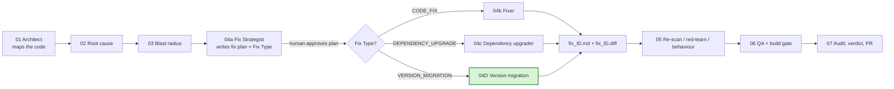
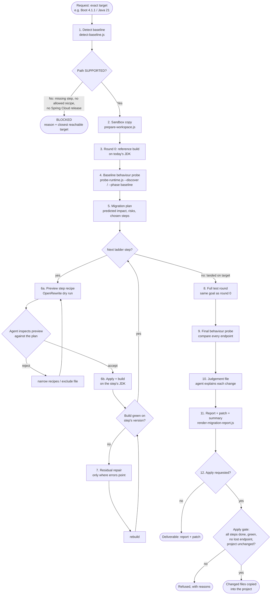
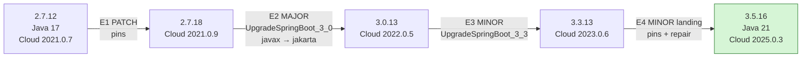
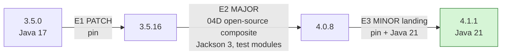
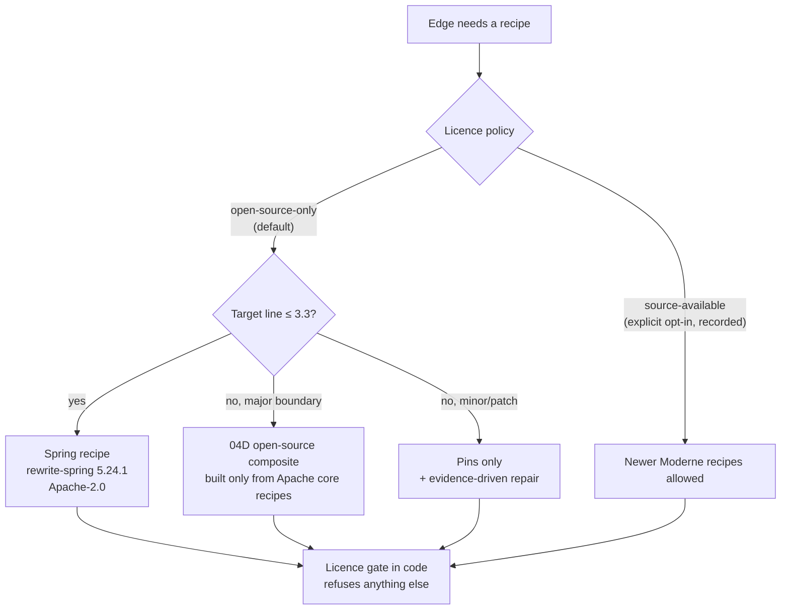
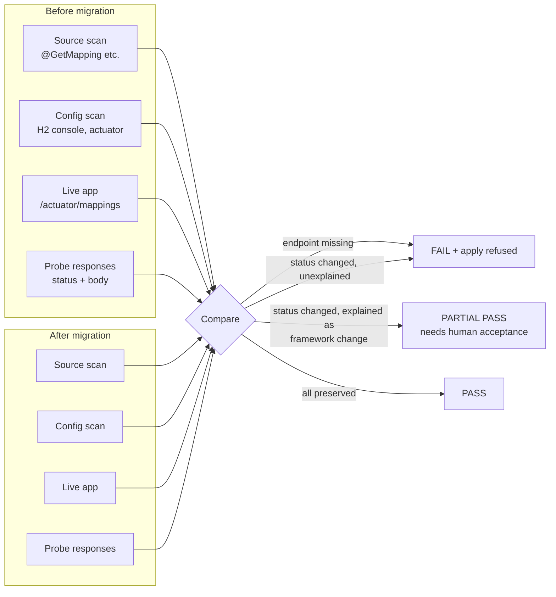
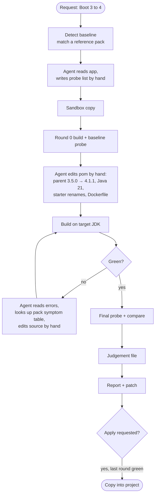
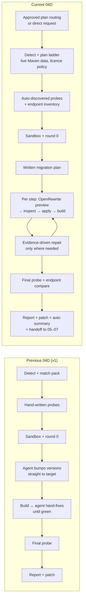

# Agent 04D — Version Migration Skill: Previous vs Current

**Purpose.** This paper explains the current 04D version-migration skill in MARS. It then compares the
current skill with the previous version, published on
[`Udaradg/sample-java-project` · `feature/springboot-3-to-4`](https://github.com/Udaradg/sample-java-project/tree/feature/springboot-3-to-4),
area by area, and says which one is stronger in each and why.

**Basis.** Every statement comes from reading the code of both versions and from real runs:
- **Previous version:** the skill as committed on that branch, and the migration report it produced
  there (`docs/agent_output/04-remediation/migration_spring-boot-3-to-4.md`).
- **Current version:** commit `604c481` on branch `validate/04d-integration`, and the validation runs
  in [`docs/validation/04d-any-version/`](./ANY_VERSION_REPORT.md).

---

## Table of contents

1. [Executive summary](#1-executive-summary)
2. [Where 04D sits in the MARS pipeline](#2-where-04d-sits-in-the-mars-pipeline)
3. [The current 04D skill set in detail](#3-the-current-04d-skill-set-in-detail)
   - 3.1 [What it does, in one paragraph](#31-what-it-does-in-one-paragraph)
   - 3.2 [Design principles](#32-design-principles)
   - 3.3 [End-to-end flow](#33-end-to-end-flow)
   - 3.4 [Step by step](#34-step-by-step)
   - 3.5 [The migration ladder: any version to any version](#35-the-migration-ladder-any-version-to-any-version)
   - 3.6 [OpenRewrite and the open-source licence policy](#36-openrewrite-and-the-open-source-licence-policy)
   - 3.7 [Safety gates](#37-safety-gates)
   - 3.8 [Endpoint and behaviour preservation](#38-endpoint-and-behaviour-preservation)
   - 3.9 [What it produces](#39-what-it-produces)
   - 3.10 [Who does what: AI agent vs scripts](#310-who-does-what-ai-agent-vs-scripts)
   - 3.11 [Building blocks](#311-building-blocks)
4. [The previous version (`feature/springboot-3-to-4`)](#4-the-previous-version-featurespringboot-3-to-4)
5. [Side-by-side comparison](#5-side-by-side-comparison)
   - 5.1 [The two flows](#51-the-two-flows)
   - 5.2 [Category-by-category comparison](#52-category-by-category-comparison)
   - 5.3 [Where the previous version is still the better choice](#53-where-the-previous-version-is-still-the-better-choice)
6. [Same application, both versions: the evidence](#6-same-application-both-versions-the-evidence)
7. [Scorecard](#7-scorecard)
8. [Current limits and risks](#8-current-limits-and-risks)
9. [Recommendation](#9-recommendation)
10. [Glossary](#10-glossary)

---

## 1. Executive summary

**04D** is the part of the MARS remediation pipeline that upgrades a Java application to a newer
Spring Boot and Java version. It records how the application builds and behaves *before* anything
changes, makes the upgrade in a sandbox copy, and proves the result builds and behaves the same
*after*.

| | Previous version (branch `feature/springboot-3-to-4`) | Current version (MARS, `604c481`) |
|---|---|---|
| **Versions it can migrate** | One jump: Spring Boot 3 → 4 | Any published Boot line 1.5 – 4.1 → any later line, planned step by step |
| **How code is changed** | All by the AI agent, by hand, one compiler error at a time | Open-source **OpenRewrite** recipes first (repeatable, previewed); the AI agent only fixes what is left, with evidence |
| **How the route is chosen** | Straight jump (3.5.0 → 4.1.1 in one go) | A planned ladder of small steps (3.5.0 → 3.5.16 → 4.0.8 → 4.1.1), each built green before the next |
| **Licence control** | Not needed (no external recipes) | Open-source-only by default, enforced in code; non-open-source recipes only by explicit choice |
| **Pipeline integration** | An ungated "migration mode" started on request | Also routed from an **approved** fix plan, with a standard handoff to the test and audit agents (05–07) |
| **Endpoint protection** | Hand-written probe list | Automatic endpoint inventory (code + configuration + live app); a lost endpoint fails the run |
| **Self-tests** | None | 50 automated tests |
| **Proven on real apps** | 3.5.0 → 4.1.1 (demo app) | 3.5.0 → 4.1.1 (demo app) **and** 2.7.12 + Spring Cloud → 3.5.16 (MARS employee-service) |

**Bottom line.** The current version is stronger in 11 of 14 categories (Section 7). Its decisive
advantages:
- **Breadth:** any version to any later version, not just 3 → 4.
- **Repeatability:** recipe-driven changes instead of AI-only edits.
- **Governance:** approval routing, licence control and apply gates.
- **Proof of behaviour:** endpoints are inventoried automatically.

On the same demo application, the previous version reported "Passed" while silently losing the
H2 database console (`/h2-console`). The current version caught the same loss and restored it
before finishing (Section 6).

The previous version is still simpler, smaller and quicker to read (Section 5.3).

---

## 2. Where 04D sits in the MARS pipeline

MARS is a seven-agent remediation pipeline. Agent 04 turns a diagnosed issue into a verified change.
It has four specialist skills, and 04D is the one for platform and language upgrades.

- **Current version:** 04D is reached in two ways.
  - From an **approved** fix plan whose *Fix Type* is `VERSION_MIGRATION`. The output then flows to
    agents 05–07 like any other fix.
  - By a direct request such as "upgrade this app to Spring Boot 4.1.1".
- **Previous version:** 04D was only a direct-request "migration mode" of Agent 04. It had no
  approval gate, and agents 05–07 never received its output.

---

## 3. The current 04D skill set in detail

### 3.1 What it does, in one paragraph

Given a Java project and an exact target (for example *Spring Boot 4.1.1 on Java 21*), 04D works in
eight stages:
1. Reads what the project declares today.
2. Plans the safest route to the target as a ladder of steps.
3. Copies the project into a sandbox.
4. Records a reference build and the live behaviour of the application (its HTTP endpoints).
5. Walks the ladder one step at a time: each step runs open-source OpenRewrite recipes, is previewed
   and checked, then built.
6. Repairs whatever the recipes could not, but only where the compiler, tests or probes show a real
   failure.
7. Re-runs the application and compares every endpoint before and after.
8. Writes a report, a patch and an automatic pass/fail summary.

The real project is never touched unless a person explicitly asks for the patch to be applied, and
even then only if every gate passes.

### 3.2 Design principles

| Principle | What it means in practice |
|---|---|
| **Understand before changing** | A baseline build, a baseline behaviour probe and a written migration plan must exist before any file changes. The scripts enforce this order. |
| **Deterministic first, AI second** | Structural changes (renamed packages, moved classes, renamed starters, version pins) are made by OpenRewrite recipes, which produce the same result every time. The AI agent handles only what is left. |
| **Evidence outranks opinion** | A step is done only when the compiler, the tests and the running application agree. The agent's confidence counts for nothing on its own. |
| **Small steps, never a blind jump** | Every major version is crossed on its own step, and each step must build green on its exact version before the next one starts. |
| **Open source by default** | Only Apache-2.0 licensed recipes run unless someone explicitly opts in to others. |
| **Sandbox only** | All edits happen in a throwaway copy with its own git history. Applying to the real project is a separate, gated action. |
| **Nothing hidden** | Every build round, failed or not, every recipe preview and every probe result is kept and shown in the report. |

### 3.3 End-to-end flow

### 3.4 Step by step

| # | Stage | Script / actor | What happens | Evidence it leaves |
|---|---|---|---|---|
| 1 | Detect baseline | `detect-baseline.js` | Reads build tool, Java level, Boot version, Spring Cloud train, dependencies, endpoints, installed JDKs. Plans the ladder from live Maven Central data. Refuses non-exact targets and unsupported paths. | `baseline.json`, printed edge table |
| 2 | Sandbox | `prepare-workspace.js` | Copies the project into a private workspace and commits it to a throwaway git repo | `workspace.json`, `workspace/` |
| 3 | Reference build | `run-migration-build.js --baseline` | Builds the untouched project on today's JDK; records pre-existing test failures so they are not blamed on the migration | `rounds/round-00.json` + log |
| 4 | Reference behaviour | `probe-runtime.js` | Drafts probes for every safe endpoint (`--discover`), starts the app, records each response | `probes.json`, `runtime/baseline.json` |
| 5 | Plan | AI agent | Writes the predicted impact per file, risks, constraints, which probe protects what, and one candidate per ladder step; validated against a schema | `migration-plan.json` |
| 6 | Each ladder step | `run-migration-build.js --edge En` | Generates the step's recipe, previews it, the agent inspects it, then applies and builds it on the step's JDK | `transformations/rewrite-NN.{yml,patch,json,log}`, a build round |
| 7 | Residual repair | AI agent + build script | Fixes only what the build or tests name, checked against the rules pack | more rounds, each labelled |
| 8 | Test round | `run-migration-build.js` | Same test goal as round 0, so before/after counts are comparable | round record |
| 9 | Final probe | `probe-runtime.js --phase final` | Re-runs the app on the target JDK, compares every endpoint, inventories mappings | `runtime/final.json` |
| 10 | Judgement | AI agent | Explains every change, its evidence, and every behaviour difference (expected framework change / non-deterministic / regression) | `migration.json` |
| 11 | Report | `render-migration-report.js` | Renders the report and exports the cumulative patch; writes the Agent 04 handoff when routed from a plan | `migration_<slug>.md/.diff`, `fix_<ID>.md/.diff` |
| — | Summary | every script | Regenerates a PASS / PARTIAL PASS / FAIL / BLOCKED summary from the evidence after *every* command | `MIGRATION_SUMMARY.md`, `migration-summary.json` |
| 12 | Apply (optional) | `apply-migration.js --to-project` | Copies the changed files into the real project only if every gate passes | — |

### 3.5 The migration ladder: any version to any version

The ladder is the core new capability. It never jumps straight to the target. Instead it plans
**edges** (steps) using the rules bootshift uses:

| Edge type | When | What runs |
|---|---|---|
| **PATCH** | Move to the latest patch of the current line first (e.g. 2.7.12 → 2.7.18) | Version pins only |
| **MAJOR_BOUNDARY** | Cross into the next major version, never skipped (e.g. 2.7.18 → 3.0.13) | Spring's upgrade recipe, or 04D's own open-source composite + a rules pack |
| **MINOR** | Move along within a major (e.g. 3.0.13 → 3.3.13) | Spring's upgrade recipe if the licence allows, else pins + repair |

Every edge also pins the right **Java level** and the right **Spring Cloud release train**, verified
against the train's own published files. Each edge must build green on its exact version before the
next one runs.

Example — the real V1 run on MARS `employee-service`:

Example — the real V2c run on the demo application:

When a target cannot be reached safely, the run is **BLOCKED** before anything changes, with a
reason and the closest reachable version. Examples:
- a Boot line with no published Spring Cloud release;
- a version with no recipe rung;
- a boundary that no allowed recipe covers.

### 3.6 OpenRewrite and the open-source licence policy

**OpenRewrite** is a widely used open-source engine that rewrites Java source and build files with
named, repeatable "recipes". 04D runs it through its Maven plugin inside the sandbox.

A licence audit (Maven Central, 2026-10-01) found a hard line:
- Spring's own OpenRewrite upgrade recipes are **Apache-2.0 only up to Boot 3.3** (`rewrite-spring`
  5.24.1).
- Everything newer is under the *Moderne Source Available License*. That licence is free for
  internal use but **not open source**.

04D therefore enforces this decision:

In the V1 run, all 34 OpenRewrite libraries that actually loaded were verified as Apache-2.0.

### 3.7 Safety gates

| Gate | Where | Blocks… |
|---|---|---|
| **Approval** | `detect-baseline.js --issue` | Running from a fix plan that is not `Status: Approved` with `Fix Type: VERSION_MIGRATION` |
| **Exact target** | `detect-baseline.js` | Vague targets ("latest"); unsupported or skipped paths |
| **Order** | `run-migration-build.js` | Any change before round 0 + baseline probe + valid plan exist; a later step before the earlier one is green |
| **Preview-before-apply** | `run-migration-build.js` | Applying a recipe that was not previewed, or that changed files the preview did not show (auto-revert) |
| **Licence** | `lib/openrewrite.js` | Any recipe the session's licence policy does not allow |
| **Status rules** | `lib/summary.js` | A PASS when an endpoint is lost, a step is unfinished, tests regressed, or a status change is unexplained |
| **Apply** | `apply-migration.js` | Writing to the project when the last build is not green, a step is unfinished, an endpoint is lost, a blocking constraint is open, the final version differs from the request, or the project changed since the copy |

In production, the human approval of the fix plan stays the entry gate. The validation runs used a
test-only auto-approval mode, which is clearly labelled in their reports.

### 3.8 Endpoint and behaviour preservation

- **Inventory:** controller mappings from the source, framework endpoints switched on by
  configuration, and the live application's own mapping list (when exposed).
- **Probes:** `--discover` drafts a safe probe for every endpoint. Endpoints that need real data or
  would change data are listed with the reason they need a hand-written request.
- **Credentials:** they never go into files. Probes read them from environment variables.
- **Classification:** every difference is labelled as an expected framework change, a
  non-deterministic value (timestamps), a regression, or unexplained. Raw evidence is kept next to
  the label.

### 3.9 What it produces

| Output | Audience | Content |
|---|---|---|
| `migration_<slug>.md` | Reviewers, managers | Badges and summary; what was predicted vs what happened; the ladder; every round; every file changed and why; behaviour before/after; what needs a human |
| `migration_<slug>.diff` | Engineers | The whole migration as one `git apply`-able patch |
| `MIGRATION_SUMMARY.md` + `.json` | Everyone, automation | Automatic PASS / PARTIAL PASS / FAIL / BLOCKED from the evidence alone; never hand-written |
| `fix_<ID>.md` + `fix_<ID>.diff` | Agents 05–07 | Standard Agent 04 handoff (routed runs only) |
| Session records | Auditors | Baseline, plan, every round, every recipe preview and patch, every probe |

### 3.10 Who does what: AI agent vs scripts

| The AI agent (Claude, following SKILL.md) | The scripts (deterministic Node.js, no AI inside) |
|---|---|
| Reads and understands the application | Detect the project, plan the ladder, read Maven Central |
| Writes the migration plan | Validate the plan against its schema |
| Inspects every recipe preview; accepts or narrows | Generate, preview, apply and auto-revert recipes; enforce licence and order |
| Diagnoses residual failures; makes the smallest fix | Run builds on the right JDK; parse and group errors |
| Classifies behaviour differences | Start the app, replay probes, inventory endpoints |
| Writes the judgement (`migration.json`) | Render report, patch, summary; decide if applying is allowed |

### 3.11 Building blocks

| Kind | Items |
|---|---|
| **Scripts (7)** | `detect-baseline`, `prepare-workspace`, `run-migration-build`, `probe-runtime`, `render-migration-report`, `apply-migration`, `finalize-run` |
| **Libraries (5)** | `migration` (builds, JDKs, Maven data, endpoints), `references` (packs, ladder planner, licence), `openrewrite` (recipe generation, licence gate), `summary` (status rules), `handoff` (Agent 04 integration) |
| **Knowledge (data, not code)** | Ladder file (Boot 1.5 – 4.1, recipes, Java levels, Spring Cloud trains, licence evidence); rules packs **2 → 3** and **3 → 4**; open-source 3 → 4 composite recipe |
| **Templates** | Migration plan and judgement file schemas, with worked examples |
| **Tests** | 9 test files, **50 automated tests** (ladder planning, licence gate, recipe generation, endpoints, gates, report rendering) |
| **Size** | ~12,500 lines including tests and docs (previous version: ~3,850) |

---

## 4. The previous version (`feature/springboot-3-to-4`)

**What the branch contains:**
- the sample Spring Boot 3.5.0 employee application;
- the full MARS agent harness;
- 04D v1 in `.github/skills/04d-version-migration/`;
- a completed golden migration run, with its session records and report
  (`migration_spring-boot-3-to-4.md` and `.diff`).

**How v1 works:**

**Strengths of v1 that the current version kept:**
- sandbox-only edits;
- round 0 before any change;
- the compiler as the authority;
- before/after probes;
- a detailed, honest report;
- separation of out-of-scope changes;
- zero external dependencies for the scripts.

**What v1 did not have:**
- no OpenRewrite, so every change was an AI edit;
- one fixed jump only;
- no route planning;
- no migration plan;
- no approval routing or handoff to agents 05–07;
- no licence control;
- no automatic endpoint inventory;
- no automatic pass/fail summary;
- no tests.

A further weakness: its pack-matching rule accepts a pack if *any* listed coordinate matches,
including the unversioned `spring-boot-starter-web`. So a Boot 2.x application would be wrongly
accepted for a 3 → 4 migration. The current version requires the declared version to match and
blocks otherwise.

**Golden run result (from the branch's report):**

| Item | Result |
|---|---|
| Path | 3.5.0 → 4.1.1 in one jump; Java 17 → 21 |
| Build rounds | 8 (1 baseline, 5 failed and repaired, 2 green) |
| Files changed | 6 (pom, Dockerfile, JacksonConfig, health indicator, 2 tests) |
| Tests | 15 run, 2 failed, 1 error, both before and after (the error: no Docker for Testcontainers) |
| Probes | 9 hand-written: 4 identical, 5 same status with a different body, 0 changed status |
| Reported result | 🟢 Passed |

---

## 5. Side-by-side comparison

### 5.1 The two flows

### 5.2 Category-by-category comparison

| # | Category | Previous 04D (v1) | Current 04D | Better | Why |
|---|---|---|---|---|---|
| 1 | **Version coverage** | Boot 3 → 4 only (one reference pack) | Boot 1.5 – 4.1 → any later line; rules packs for 2 → 3 and 3 → 4 | **Current** | Covers the upgrades MARS actually needs (e.g. 2.7 → 3.x, the Jakarta move), not one jump |
| 2 | **Route planning** | Straight jump to the target | Ladder: latest patch first, every major crossed separately, each step green before the next; Java and Spring Cloud chosen per step | **Current** | Smaller steps mean each failure has one cause; big jumps mix several generations of breakage |
| 3 | **How code is changed** | 100% AI hand edits | OpenRewrite recipes first (previewed, inspected, auto-reverted if they overreach); AI only for the remainder | **Current** | Recipes are repeatable and reviewable; fewer AI edits means less variance between runs |
| 4 | **Licence control** | Not applicable (no recipes) | Open-source-only by default, enforced in code; opt-in recorded | **Current** | Lets MARS use automation without taking on non-open-source licences unknowingly |
| 5 | **Pipeline integration & approval** | Ungated "migration mode" on request; no handoff | Routed from an approved plan (`Fix Type: VERSION_MIGRATION`); standard `fix_<ID>` handoff to agents 05–07 | **Current** | Migrations get the same human approval and downstream verification as every other fix |
| 6 | **Understanding before change** | Probes + round 0 | Probes + round 0 + a written, schema-checked **migration plan** predicting impact per file | **Current** | The report shows prediction vs reality, which is reviewable before any change |
| 7 | **Endpoint & behaviour protection** | Hand-written probe list only | Automatic inventory (code, configuration, live app) + drafted probes; a lost endpoint fails the run | **Current** | Catches what a person forgets to probe (see `/h2-console`, Section 6) |
| 8 | **Safety gates** | Sandbox; apply only if last round green | Order gate, preview gate, licence gate, status rules, and a full apply gate (steps, endpoints, constraints, version, drift) | **Current** | More ways to stop a bad result before it reaches the codebase |
| 9 | **Correct pack selection** | Accepts a pack on any matching coordinate (a Boot 2 app would match 3 → 4) | Requires the declared version; unsupported paths are BLOCKED with the closest reachable target | **Current** | Prevents silently running the wrong migration |
| 10 | **Credential handling** | Probe password stored in the probe file | Credentials read from environment variables only | **Current** | No secrets in evidence files |
| 11 | **Reporting** | Rich report (9 sections) | Same report plus prediction vs observation, ladder table, transformations, provenance, and an automatic per-run summary | **Current** (slightly) | v1's report was already strong; the current one adds an evidence-only status nobody can hand-edit |
| 12 | **Self-verification** | No tests | 50 automated tests | **Current** | Changes to the skill itself are caught before they reach a migration |
| 13 | **Simplicity & footprint** | ~3,850 lines, 6 scripts, offline, no extra tooling | ~12,500 lines, OpenRewrite plugin downloads, Maven Central reads | **Previous** | Easier to read, audit and run without network access |
| 14 | **Speed for a small, easy jump** | 8 rounds, no recipe downloads | 10 rounds plus recipe previews for the same app | **Previous** | For a small app, the straight jump needs less ceremony; the ladder pays off on larger or older apps |

### 5.3 Where the previous version is still the better choice

- **Learning and auditing.** Its whole flow fits in one short SKILL.md and six scripts.
- **Offline or locked-down environments.** It needs no OpenRewrite plugin download and no Maven
  Central metadata. (The current version has an offline mode for planning, but recipes still need
  the plugin.)
- **A tiny app on a single jump.** It reaches the same place with less process.

None of these outweigh the coverage, governance and protection gaps for production use.

---

## 6. Same application, both versions: the evidence

Both versions migrated the same demo employee service from Spring Boot 3.5.0 / Java 17 to 4.1.1 /
Java 21.

| | Previous 04D (branch golden run) | Current 04D (run V2c) |
|---|---|---|
| Route | One jump | 3 steps: 3.5.16 → 4.0.8 → 4.1.1 |
| Who changed the code | Agent, by hand, everything | Recipes: versions, starters, Jackson packages, health classes, test annotations, test modules. Agent: Jackson 3 configuration, H2 module, Dockerfile |
| Build rounds | 8 | 10 |
| Files changed | 6 | 6 |
| Tests | 15 run; 2 failed + 1 error (no Docker) before and after | 19 run; 2 failed before and after; Testcontainers 5/5 on PostgreSQL |
| Probes | 9 hand-written; 0 status changes | 9 (6 auto-drafted); 0 status changes |
| Endpoint inventory | Not available | 11 before / 11 after (7 code + 4 configuration) |
| **`/h2-console`** | **Not probed and not migrated.** The console is enabled in `application.yml`, but Boot 4 moved it into a new module that the v1 patch never adds. The report says "Passed". | **Caught automatically.** The drafted probe went 200 → 404 after the Boot 4 step; the module was added; the probe returned to 200 before the run finished. |
| Licence of automation | n/a | All Apache-2.0 |
| Final status | Passed | PASS (automatic summary) |

> **Why this matters.** Both runs compiled, passed the same tests and returned the same status on
> every *probed* endpoint. Only the current version noticed that an endpoint nobody had listed
> stopped existing. This is the kind of silent regression the endpoint inventory was built to stop.

*Note on the test counts:* the two runs used slightly different snapshots of the demo application's
tests (15 vs 19). In both runs, the pre-existing failures are the same two actuator tests, and
neither migration introduced a new failure.

A second application, which only the current version can migrate: MARS `employee-service`, Boot
2.7.12 + Spring Cloud → 3.5.16 / Java 21, in 4 steps.
- 7/7 tests passed before and after.
- All 5 code endpoints and all 10 live endpoints were preserved.
- One real behaviour change was caught and flagged for human acceptance: a URL with a trailing
  slash now returns 404, as expected under Boot 3.

---

## 7. Scorecard

| Category | Previous | Current |
|---|:---:|:---:|
| Version coverage | ◔ | ● |
| Route planning | ○ | ● |
| Repeatable code changes | ◔ | ● |
| Licence control | — | ● |
| Pipeline integration & approval | ◔ | ● |
| Understanding before change | ◑ | ● |
| Endpoint & behaviour protection | ◑ | ● |
| Safety gates | ◑ | ● |
| Correct pack selection | ◔ | ● |
| Credential handling | ◔ | ● |
| Reporting | ◕ | ● |
| Self-verification (tests) | ○ | ● |
| Simplicity & footprint | ● | ◑ |
| Speed on a small single jump | ● | ◕ |

● strong · ◕ good · ◑ partial · ◔ weak · ○ absent · — not applicable

**Current version stronger in 11 of 14 categories; previous version stronger in 2 (simplicity, speed
on small jumps); 1 not comparable (licence).**

---

## 8. Current limits and risks

| Area | Status |
|---|---|
| Proven by real runs | 2.7 → 3.5 (with Spring Cloud) and 3.5 → 4.1. Other routes are planned and unit-tested, but not yet run on a real app. |
| Boot 1.x → 2.x | Planned; there is no 1 → 2 rules pack yet. |
| Spring Cloud apps going to 4.x | Planned and verified against published releases, but not yet run on a real app. |
| Boot 3.4 and later, open-source only | No open-source Spring recipe exists. 04D uses its own composite, version pins and evidence-driven repair. |
| Gradle projects | Supported in code; unit-tested only. |
| Hand repair still needed | Changes no recipe can make (e.g. Jackson 3 configuration API) remain AI edits. Each must cite build or test evidence. |
| Behaviour coverage | Only as good as the tests and probes. Endpoints that change data need hand-written probes. |
| Applying to the project | Requires a fully green final build, so apps with pre-existing failing tests are refused (deliberate). |

---

## 9. Recommendation

1. **Adopt the current 04D as the migration skill for MARS.** Its coverage, governance and endpoint
   protection make it production-suitable, where the previous version was a single-path proof of
   concept.
2. **Keep the human approval of the fix plan as the entry gate.** Use the test-only auto-approval
   only for validation runs.
3. **Next validation runs**, in priority order:
   - a Spring Cloud application to Boot 4.x;
   - a Gradle project;
   - a Boot 1.x/2.0 application, after writing the 1 → 2 rules pack.
4. **Keep the open-source-only default.** Move to the source-available recipes only as a deliberate,
   recorded business decision, since they are free for internal use but not open source.

---

## 10. Glossary

| Term | Meaning |
|---|---|
| **04D** | Agent 04's version-migration skill in MARS |
| **Ladder / edge** | The planned route to the target, as a series of steps (edges); each must build green before the next |
| **PATCH / MINOR / MAJOR_BOUNDARY** | Edge types: same line latest patch / later line in the same major / crossing into the next major |
| **OpenRewrite** | Open-source engine that rewrites code with named, repeatable recipes |
| **Recipe** | One OpenRewrite transformation, e.g. "rename this package" or "upgrade to Boot 3.0" |
| **Composite** | A recipe made of other recipes; 04D ships an open-source 3 → 4 composite |
| **Rules pack** | A document of version-specific rules and failure symptoms the agent repairs against |
| **Sandbox** | A private copy of the project where all changes happen |
| **Round** | One build, recorded with its errors and outcome |
| **Probe** | One HTTP request replayed before and after the migration |
| **Endpoint inventory** | The list of every URL the application serves, from code, configuration and the live app |
| **Apache-2.0** | A permissive open-source licence |
| **Moderne Source Available License** | Licence of newer Spring recipes; free for internal use, not open source |
| **PASS / PARTIAL PASS / FAIL / BLOCKED** | Automatic run status from evidence; PARTIAL PASS means a framework behaviour change needs human acceptance |
