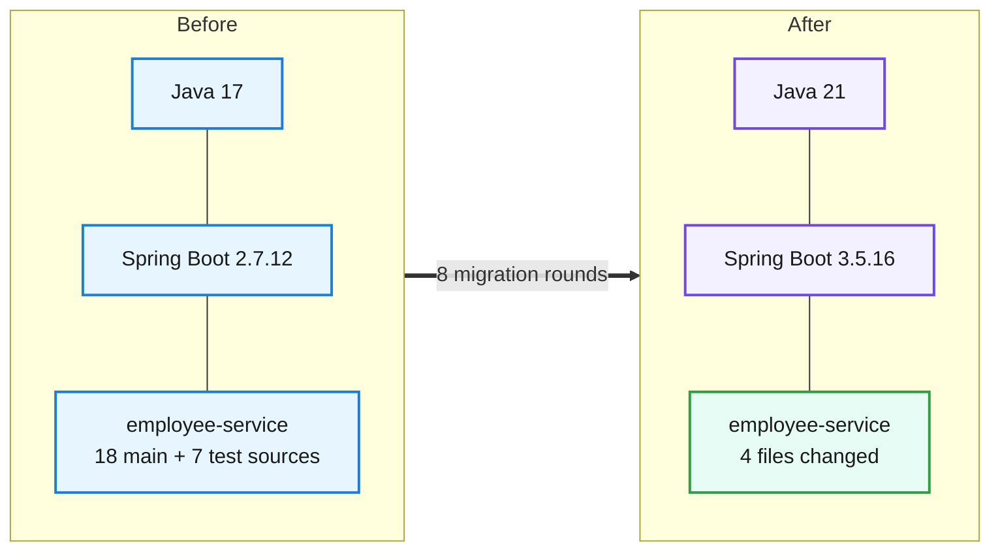
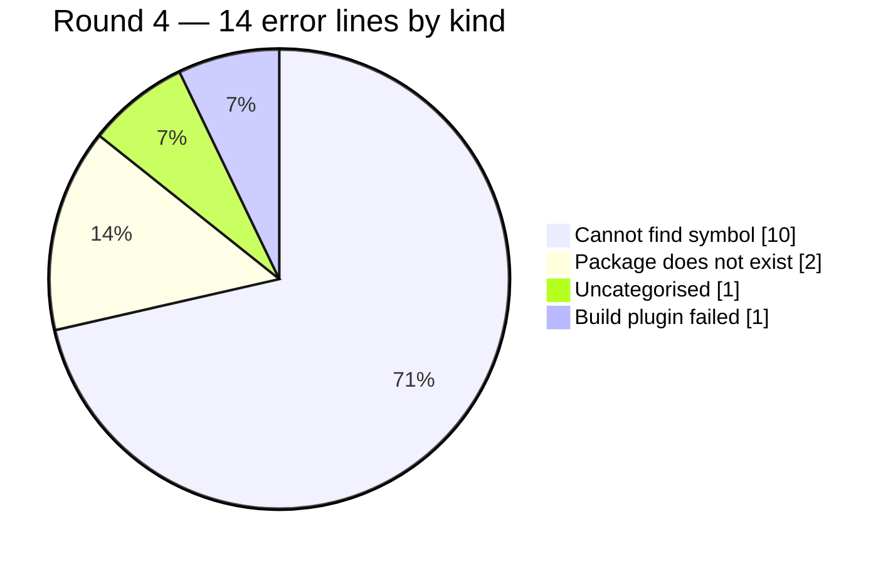

# Migration Report — employee-service: Spring Boot 2.7.12 to 3.5.16 on Java 21 (4-edge ladder, open-source recipes only)

## employee-service

    

> employee-service moved from Spring Boot 2.7.12 on Java 17 (Spring Cloud 2021.0.7) to Spring Boot 3.5.16 on Java 21 (Spring Cloud 2025.0.3), in four edges each built green before the next: 2.7.18, 3.0.13, 3.3.13 and 3.5.16. Only Apache-2.0 OpenRewrite recipes ran; from their previews, the version pins, the Framework 6 exception-handler signature and the javax.ws.rs to jakarta.ws.rs test import were accepted, and every cleanup or unrelated upgrade they proposed was rejected. Two changes were made by hand because a build demanded them: removing the deleted @EnableEurekaClient annotation, and moving the pinned JaCoCo plugin from 0.8.7 to 0.8.11 so it can read Java 21 class files. The same 7 tests pass before and after, every endpoint is still served, and the business responses are byte-identical. Two framework-owned behaviours changed and are reported, not hidden: a URL with a trailing slash now answers 404 instead of 200, and a missing required query parameter now returns a ProblemDetail JSON body instead of an empty 400.

_Generated by the Version Migration skill on 2026-10-01. Every version, error count and response below is read from a recorded run, not from memory._

## At a glance

| | |
|---|---|
| **Result** | 🟢 **Passed** on the final build |
| **Platform** | Spring Boot `2.7.12` → `3.5.16` |
| **Language** | Java `17` → `21` |
| **Build rounds** | 9 recorded — 1 pre-migration baseline, 3 that failed and were read for what to change next, 6 green |
| **Files changed** | 4 — `pom.xml`, `src/main/java/com/aura/vihanga/employeeservice/EmployeeServiceApplication.java`, `src/main/java/com/aura/vihanga/employeeservice/advice/EmployeeAdvice.java`, `src/test/java/com/aura/vihanga/employeeservice/cucumberglue/CucumberConfig.java` |
| **Dependency changes** | 4 |
| **Source changes forced by the upgrade** | 7 |
| **Test suite** | before: 7 run, 0 failed, 0 errors → after: 7 run, 0 failed, 0 errors — 🟢 all green, before and after |
| **Runtime behaviour** | 🔴 1 of 13 probe(s) changed status |
| **Migration plan** | recorded before any change — 13 predicted impacts, 4 deterministic candidates |
| **Deterministic transformations** | 🟢 4 applied · 🔍 4 previewed · 🔴 1 failed / reverted / refused — OpenRewrite |
| **Requested target** | `3.5.16` — final build declares `3.5.16` 🟢 matches |
| **Reference followed** | `references/spring-boot-2-to-3.md` |
| **Build tool** | maven — Apache Maven 3.8.7 (b89d5959fcde851dcb1c8946a785a163f14e1e29) |

## 0. What was understood before anything changed

> Everything in this section was written **before** any version or source changed — it is a prediction, and it is shown next to what the build, the tests and the probes then actually did. A predicted impact is never evidence that something failed.

### 0.1 Target and path

| | |
|---|---|
| **Source** | Spring Boot `2.7.12` · Java `17` |
| **Requested target** | Spring Boot `3.5.16` · Java `21` — _as requested; never "latest", never a recipe's own target_ |
| **Path** | `2.7.12` → `2.7.18` (E1 PATCH, pin-only (core-apache-2.0), JDK 17, Spring Cloud 2021.0.9) · `2.7.18` → `3.0.13` (E2 MAJOR_BOUNDARY, upstream UpgradeSpringBoot_3_0 (rewrite-spring 5.24.1, Apache-2.0), JDK 17, Spring Cloud 2022.0.5, rules pack spring-boot-2-to-3) · `3.0.13` → `3.3.13` (E3 MINOR, upstream UpgradeSpringBoot_3_3 (rewrite-spring 5.24.1, Apache-2.0) - licence-frontier stop, JDK 17, Spring Cloud 2023.0.6) · `3.3.13` → `3.5.16` (E4 MINOR landing edge, pin-only (no Apache-2.0 recipe for 3.4/3.5 under open-source-only), JDK 21, Spring Cloud 2025.0.3; java.version 17 -&gt; 21) |

### 0.2 Constraints and compatibility questions

| | Constraint | Status in the plan | At the end | Evidence |
|---|---|---|---|---|
| 🟢 | **C1** JDK 17 (E1-E3) and JDK 21 (E4) are available | satisfied | — | baseline.json toolchain: 17.0.20.1 and 21.0.11 |
| ❓ | **C2** Spring Boot 3.5.16 and every intermediate edge version resolve from Maven Central _(blocking)_ | unresolved | resolved | Every edge version and train resolved: rounds 1, 3, 5, 6, 8. |
| 🟢 | **C3** A GA Spring Cloud train exists for every Boot line on the path (2021.0.9, 2022.0.5, 2023.0.6, 2025.0.3) | satisfied | — | baseline.json migration_path.edges[].cloud_evidence: each train's spring-cloud-starter-parent POM was read at detect time |
| 🟢 | **C4** Only Apache-2.0 recipe stacks run (licence policy open-source-only) _(blocking)_ | satisfied | resolved | All 9 transformation records carry licence Apache-2.0; the commands name only rewrite-maven-plugin 5.46.1/6.46.1 and rewrite-spring 5.24.1; the POMs of every downloaded OpenRewrite artifact declare Apache-2.0. |
| ❓ | **C5** Pinned third-party versions (poi-ooxml 5.0.0, cucumber 7.11.0, jacoco-maven-plugin 0.8.7) still work on Boot 3.5 / Java 21 | unresolved | resolved | jacoco 0.8.7 broke the Java 21 package goal (round 7) and was moved to 0.8.11; poi-ooxml 5.0.0 and cucumber 7.11.0 compile and the 7 tests pass (round 8). |
| 🟢 | **C6** The application starts without Config Server and Eureka (both disabled by probe arguments, identical before and after) | satisfied | — | runtime/baseline.json started=true |
| ❓ | **C7** No endpoint in the static or actuator inventory is lost _(blocking)_ | unresolved | resolved | runtime/final.json: actuator and static endpoint inventories equal to baseline. |

### 0.3 Predicted impact vs what actually happened

_The build, transformation and patch columns are facts about the **file**; several impact entries can share one file (a build descriptor, say). Whether this particular impact was real is the agent review's column._

| Impact | File | Area · rule | Risk | Predicted handling | File named by a failing build | File changed by a transformation | File in final patch | Agent review |
|---|---|---|---|---|---|---|---|---|
| **I1** | `pom.xml` | [E1] Platform patch + Cloud train · section 0 / section 1 | low | deterministic | never named by a build | rewrite-02, rewrite-04, rewrite-06, rewrite-08 | ✏️ yes | handled-by-transformation — rewrite-02; round 1 green on 2.7.18. |
| **I2** | `pom.xml` | [E2] Boot 3.0 parent + Cloud 2022.0 · section 1 | medium | deterministic | never named by a build | rewrite-02, rewrite-04, rewrite-06, rewrite-08 | ✏️ yes | handled-by-transformation — rewrite-04; 3.0.13 and Cloud 2022.0.5 resolved (round 2/3). |
| **I3** | `src/main/java/com/aura/vihanga/employeeservice/EmployeeServiceApplication.java` | [E2] Spring Cloud 2022.0 · section 8 | medium | either | rounds 2 | — | ✏️ yes | confirmed — Not removed by any recipe in the chain; round 2 named it and it was removed by hand per pack section 8. |
| **I4** | `src/main/java/com/aura/vihanga/employeeservice/advice/EmployeeAdvice.java` | [E2] Spring Framework 6 MVC error handling · section 5.2 | high | either | never named by a build | rewrite-04 | ✏️ yes | handled-by-transformation — UpgradeSpringFramework_6_0 in rewrite-04; the advice probe is byte-identical (400 {code:405}). |
| **I5** | `src/test/java/com/aura/vihanga/employeeservice/cucumberglue/CucumberConfig.java` | [E2] javax -&gt; jakarta (test glue) · section 2 | medium | either | rounds 4 | rewrite-04 | ✏️ yes | handled-by-transformation — JavaxMigrationToJakarta in rewrite-04; jakarta.ws.rs resolved on the test classpath (round 3). |
| **I6** | `src/test/java/com/aura/vihanga/employeeservice/cucumberglue/CucumberSteps.java` | [E2] RestTemplate on HttpClient · section 7.2 | low | residual | rounds 4 | — | no | not-needed — CucumberSteps compiles on Framework 6; HttpClient 5 availability is never exercised because the Cucumber runner does… |
| **I7** | `src/test/java/com/aura/vihanga/employeeservice/controller/EmployeeControllerTest.java` | [E2] ResponseEntity status API · section 5.2 | low | either | never named by a build | — | no | not-needed — getStatusCodeValue() still compiles on Framework 6.2; the controller test passes. |
| **I8** | `src/main/java/com/aura/vihanga/employeeservice/controller/EmployeeController.java` | [E2] Trailing-slash matching off · section 5.1 | medium | residual | never named by a build | — | no | confirmed — Trailing-slash probe 200 -&gt; 404; reported as a behaviour change, not re-enabled. |
| **I9** | `src/main/java/com/aura/vihanga/employeeservice/advice/EmployeeAdvice.java` | [E2] Default error bodies (ResponseEntityExceptionHandler) · section 5.2 (Framework 6 MVC) | low | residual | never named by a build | rewrite-04 | ✏️ yes | confirmed — 400 status kept; body became a ProblemDetail. |
| **I10** | `pom.xml` | [E3] Boot 3.3 parent + Cloud 2023.0 · ladder edge E3 (no rules pack for a MINOR edge) | low | deterministic | never named by a build | rewrite-02, rewrite-04, rewrite-06, rewrite-08 | ✏️ yes | handled-by-transformation — rewrite-06; round 5 green on 3.3.13. |
| **I11** | `pom.xml` | [E4] Boot 3.5 parent + Cloud 2025.0 + Java 21 · ladder edge E4 (pin-only) | medium | deterministic | never named by a build | rewrite-02, rewrite-04, rewrite-06, rewrite-08 | ✏️ yes | handled-by-transformation — rewrite-08; rounds 6 and 8 green on 3.5.16 / JDK 21. |
| **I12** | `pom.xml` | [E4] Pinned jacoco-maven-plugin 0.8.7 on Java 21 · residual (no pack rule; build/test evidence decides) | medium | residual | never named by a build | rewrite-02, rewrite-04, rewrite-06, rewrite-08 | ✏️ yes | confirmed — Round 7 failed in jacoco:report; fixed by hand (0.8.11), round 8 green. |
| **I13** | `src/test/java/com/aura/vihanga/employeeservice/service/EmployeeServiceTest.java` | [E3/E4] @MockBean deprecation · residual (deprecation only, compiles on 3.5) | low | either | never named by a build | — | no | still-open — @MockBean compiles with deprecation-for-removal warnings on 3.5; it must move to @MockitoBean before Boot 4. |

**Every changed file was predicted by the plan.**

### 0.4 Which probes protect which impact

| Probe | Category | Protects | Replayed |
|---|---|---|---|
| create employee | business-api | I2, I10, I11 | 🟢 before and after |
| get employee by id | serialization | I2, I11 | 🟢 before and after |
| get unknown employee is 404 | error-contract | I4 | 🟢 before and after |
| unsupported method handled by advice | error-contract | I4 | 🟢 before and after |
| get employee trailing slash | business-api | I8 | 🟢 before and after |
| search without name is 400 | error-contract | I9 | 🟢 before and after |
| search employees by name | business-api | I2, I11 | 🟢 before and after |
| excel upload non-xlsx part | business-api | I2, I11 | 🟢 before and after |
| employee salary (no department service) | business-api | I3 | 🟢 before and after |
| endpoint inventory (actuator) | actuator | I2, I10, I11 | 🟢 before and after |
| _none_ | test-suite | I5, I6 | ⚪ not observable — Cucumber glue is only compiled: the JUnit4 Cucumber runner is not executed by surefire (round 0 ran 7 JUnit 5 tests) and its steps target a hard-coded port 8500 |
| _none_ | test-suite | I7, I12, I13 | ⚪ not observable — observed by the test suite (same package goal as round 0), not by a runtime probe |
| _none_ | other | I1 | ⚪ not observable — patch edge; observed by the E1 build round only |

### 0.5 Out of scope, and when to stop

**Out of scope:**

- Fixing the injection-prone string query in EmployeeSearchRepository
- Making the Cucumber JUnit4 runner execute (vintage engine / port 8500)
- Moving @MockBean to @MockitoBean or getStatusCodeValue to getStatusCode().value() unless a build fails
- Upgrading poi-ooxml 5.0.0 or cucumber 7.11.0
- Switching packaging from war to jar
- Re-enabling trailing-slash matching
- Any modernisation proposed by recipes (text blocks, pattern matching, formatting, import reordering)

**Stop conditions:**

- An edge version or Spring Cloud train cannot be resolved
- A recipe outside the Apache-2.0 stacks would be needed (policy open-source-only)
- A business or error-contract probe changes status for a cause not within the migration's scope
- An endpoint present at baseline is missing after the migration
- The E4 package round introduces test failures that round 0 did not have and they cannot be traced to the migration


## 0.6 Migration path and endpoint preservation

### Migration path (edges)

Ladder `references/openrewrite/spring-boot-ladder.json` · licence policy **open-source-only** · granularity boundary · versions from maven-metadata https://repo1.maven.org/maven2/org/springframework/boot/spring-boot-starter-parent/maven-metadata.xml

| Edge | From → To | Class | Recipe | Licence | JDK | Cloud train | Previews | Applies | Rounds | Complete |
|---|---|---|---|---|---|---|---|---|---|---|
| E1 | 2.7.12 → 2.7.18 | PATCH | pin-only | Apache-2.0 | 17 | 2021.0.9 | rewrite-00 failed (0 files); rewrite-01 previewed (1 files) | rewrite-02 applied (1 files) | R1 test-compile passed | yes (R1) |
| E2 | 2.7.18 → 3.0.13 | MAJOR_BOUNDARY | upstream: org.openrewrite.java.spring.boot3.UpgradeSpringBoot_3_0 | Apache-2.0 | 17 | 2022.0.5 | rewrite-03 previewed (7 files) | rewrite-04 applied (3 files) | R2 test-compile compile-failed; R3 test-compile passed | yes (R3) |
| E3 | 3.0.13 → 3.3.13 | MINOR | upstream: org.openrewrite.java.spring.boot3.UpgradeSpringBoot_3_3 | Apache-2.0 | 17 | 2023.0.6 | rewrite-05 previewed (6 files) | rewrite-06 applied (1 files) | R4 test-compile compile-failed; R5 test-compile passed | yes (R5) |
| E4 | 3.3.13 → 3.5.16 | MINOR (landing) | pin-only | Apache-2.0 | 21 | 2025.0.3 | rewrite-07 previewed (1 files) | rewrite-08 applied (1 files) | R6 test-compile passed; R7 package compile-failed; R8 package passed | yes (R6) |

Edge notes:

- E1: patch edge within 2.7: pins the platform and Spring Cloud train only — a patch release carries no framework migration
- E4: no open-source-only upstream recipe for 3.5: the edge pins the platform, Spring Cloud train and Java level; compiler-driven repair handles the rest

### Endpoint preservation

| Inventory | Before | After | Preserved | Missing | Added |
|---|---|---|---|---|---|
| Source mappings (static scan) | 5 | 5 | 5 | 0 | 0 |
| Running application (actuator /mappings) | 10 | 10 | 10 | 0 | 0 |

No endpoint observed before the migration is missing after it, in any inventory that was available.

## 1. What moved



| | What | Before | After | Why it moved |
|---|---|---|---|---|
| ⬆️ | `Java (language level)` | `17` | `21` | Runtime baseline required by the new platform version. |
| ⬆️ | `Spring Boot (platform)` | `2.7.12` | `3.5.16` | The version jump this migration is about. |
| ⬆️ | `org.springframework.boot:spring-boot-starter-parent` | `2.7.12` | `3.5.16` | The requested target (line 3.5, resolved to 3.5.16), reached through edges 2.7.18, 3.0.13, 3.3.13 by the generated edge recipes (pack section 1). |
| ⬆️ | `spring-cloud.version` | `2021.0.7` | `2025.0.3` | Spring Cloud train verified per edge (2021.0.9, 2022.0.5, 2023.0.6, 2025.0.3) against each train's spring-cloud-starter-parent POM (pack section 1 / section 8). |
| ⬆️ | `java.version` | `17` | `21` | Java 21 is the requested target; set by the landing edge E4. |
| ⬆️ | `org.jacoco:jacoco-maven-plugin (unitTest profile plugin)` | `0.8.7` | `0.8.11` | Round 7: the report goal failed with 'Unsupported class file major version 65'; 0.8.11 is the first release that officially supports Java 21 (JaCoCo changes.html). |

## 2. How the migration went

**9 build rounds**, 3.8 min of build time in total. Round 0 is the pre-migration reference build on JDK 17; every later round ran on JDK 21. 3 of them came back with errors, 6 came back clean. A red round is not a setback here — it is the output the migration is driven by: each one names the exact files or tests the next change has to touch. Apart from the 4 deterministic transformations in §2.4 — each previewed, inspected and then applied to the sandbox, and each built immediately — nothing was edited that a build, a test or a probe had not first complained about. The migration ends on round 8, 🟢 **Passed**.

```mermaid
flowchart TD
  classDef broken fill:#ffe3e3,stroke:#c92a2a,stroke-width:2px,color:#1a1a1a
  classDef degraded fill:#fff3bf,stroke:#e8590c,stroke-width:2px,color:#1a1a1a
  classDef ok fill:#e6fcf5,stroke:#2f9e44,stroke-width:2px,color:#1a1a1a
  classDef before fill:#e7f5ff,stroke:#1c7ed6,stroke-width:2px,color:#1a1a1a
  classDef after fill:#f3f0ff,stroke:#7048e8,stroke-width:2px,color:#1a1a1a
  classDef neutral fill:#f1f3f5,stroke:#868e96,stroke-width:1px,color:#1a1a1a
  subgraph P0["Phase 0 · Reference build, before anything changed · JDK 17 · round 0"]
    direction TB
    R0["🟢 Round 0 · baseline — Passed<br/>maven package · JDK 17 · 1.0 min<br/>no errors<br/>tests: 7 run · 0 failed · 0 errored"]:::ok
  end
  subgraph P1["Phase 1 · Prove main + test sources compile · JDK 17 · rounds 1-5"]
    direction TB
    R1["🟢 Round 1 — Passed<br/>maven test-compile · JDK 17 · 14.7s<br/>no errors"]:::ok
    R2["🔴 Round 2 — Compile failed<br/>maven test-compile · JDK 17 · 11.3s<br/>5 error lines · 2 distinct problems<br/>Cannot find symbol ×2<br/>EmployeeServiceApplication.java ×2"]:::broken
    R3["🟢 Round 3 — Passed<br/>maven test-compile · JDK 17 · 11.0s<br/>no errors"]:::ok
    R4["🔴 Round 4 — Compile failed<br/>maven test-compile · JDK 17 · 29.5s<br/>14 error lines · 8 distinct problems<br/>Cannot find symbol ×5 · Package does not exist ×2<br/>CucumberIntegrationTest.java ×2 · CucumberConfig.java ×2 +2 more"]:::broken
    R5["🟢 Round 5 — Passed<br/>maven test-compile · JDK 17 · 9.2s<br/>no errors"]:::ok
  end
  subgraph P2["Phase 2 · Prove main + test sources compile · JDK 21 · round 6"]
    direction TB
    R6["🟢 Round 6 — Passed<br/>maven test-compile · JDK 21 · 14.0s<br/>no errors"]:::ok
  end
  subgraph P3["Phase 3 · Prove the test suite runs and the jar builds · JDK 21 · rounds 7-8"]
    direction TB
    R7["🔴 Round 7 — Compile failed<br/>maven package · JDK 21 · 35.7s<br/>1 error line<br/>Java release / toolchain mismatch ×1"]:::broken
    R8["🟢 Round 8 — Passed<br/>maven package · JDK 21 · 38.3s<br/>no errors<br/>tests: 7 run · 0 failed · 0 errored"]:::ok
  end
  R0 -->|"Applied rewrite-02 edge E1, previewed as…"| R1
  R1 -->|"Applied rewrite-04 edge E2, previewed as…"| R2
  R2 -->|"Removed @EnableEurekaClient and its import from… +1 more"| R3
  R3 -->|"Applied rewrite-06 edge E3, previewed as…"| R4
  R4 -->|"Hand-reverted rejected rewrite-06 pom.xml hunks…"| R5
  R5 -->|"Applied rewrite-08 edge E4, previewed as…"| R6
  R6 -->|"same code, next gate: maven package"| R7
  R7 -->|"jacoco-maven-plugin 0.8.7 → 0.8.11 in the unitTest…"| R8
  style P0 fill:#f8f9fa,stroke:#ced4da,stroke-width:1px,color:#495057
  style P1 fill:#f8f9fa,stroke:#ced4da,stroke-width:1px,color:#495057
  style P2 fill:#f8f9fa,stroke:#ced4da,stroke-width:1px,color:#495057
  style P3 fill:#f8f9fa,stroke:#ced4da,stroke-width:1px,color:#495057
```



### 2.1 The round ledger

| Round | Ran on | Goal | Outcome | Errors | Took | What it told us |
|---|---|---|---|---|---|---|
| **0**<br/>_(baseline)_ | JDK 17 | `package`<br/>_the test suite runs and the jar builds_ | 🟢 Passed | — | 1.0 min | **Nothing failed** — the test suite runs and the jar builds on JDK 17.<br/>Pre-migration reference build of the untouched project on JDK 17, goal package: 7 JUnit 5 tests across 4 classes, all passing (the @DataMongoTest class runs against the local MongoDB). The JUnit 4 Cucumber runner is not executed by surefire on the JUnit Platform, so the Cucumber glue is only ever compiled. |
| **1** | JDK 17 | `test-compile`<br/>_main + test sources compile_ | 🟢 Passed | — | 14.7s | **Nothing failed** — main + test sources compile on JDK 17.<br/>Edge E1 (PATCH 2.7.12 -&gt; 2.7.18): the pin-only recipe moved the parent and the Spring Cloud train to 2021.0.9; main and test code compile unchanged on JDK 17. Edge complete. |
| **2** | JDK 17 | `test-compile`<br/>_main + test sources compile_ | 🔴 Compile failed | 5<br/>_2 distinct_ | 11.3s | **Cannot find symbol ×2**<br/>in `EmployeeServiceApplication.java` (2 problems)<br/>Edge E2 apply build (2.7.18 -&gt; 3.0.13, Cloud 2022.0.5). UpgradeSpringBoot_3_0 fixed the advice signature and the javax.ws.rs import, but Spring Cloud 2022.0 deleted @EnableEurekaClient, which no recipe in the chain removed, so main compilation stopped there before any test code was compiled. |
| **3** | JDK 17 | `test-compile`<br/>_main + test sources compile_ | 🟢 Passed | — | 11.0s | **Nothing failed** — main + test sources compile on JDK 17.<br/>With the annotation removed and the rejected hunks reverted, main and test code compile on 3.0.13. jakarta.ws.rs.core.Application resolves on the test classpath (Eureka's Jakarta Jersey), confirming the accepted import move. |
| **4** | JDK 17 | `test-compile`<br/>_main + test sources compile_ | 🔴 Compile failed | 14<br/>_8 distinct_ | 29.5s | **Cannot find symbol ×5 · Package does not exist ×2**<br/>in `CucumberIntegrationTest.java` (2 problems) · `CucumberConfig.java` (2 problems) · `CucumberSteps.java` (2 problems) +1 more<br/>Edge E3 apply build (3.0.13 -&gt; 3.3.13, Cloud 2023.0.6). Every error is JUnit 4 disappearing from the test classpath: the rejected cucumber-junit junit exclusion was still in pom.xml for this round (the hunk is reverted by hand after the apply, per the procedure). |
| **5** | JDK 17 | `test-compile`<br/>_main + test sources compile_ | 🟢 Passed | — | 9.2s | **Nothing failed** — main + test sources compile on JDK 17.<br/>With the rejected pom hunks reverted, everything compiles on 3.3.13 / JDK 17. Edge E3 complete. |
| **6** | JDK 21 | `test-compile`<br/>_main + test sources compile_ | 🟢 Passed | — | 14.0s | **Nothing failed** — main + test sources compile on JDK 21.<br/>Landing edge E4 apply build (3.3.13 -&gt; 3.5.16, Cloud 2025.0.3, java.version 21) on JDK 21: main and test code compile. Only warnings remain: @MockBean is deprecated for removal from Boot 3.4 (plan I13), which still compiles on 3.5. |
| **7** | JDK 21 | `package`<br/>_the test suite runs and the jar builds_ | 🔴 Compile failed | 1 | 35.7s | **Java release / toolchain mismatch ×1**<br/>Same goal as round 0 (package) on JDK 21: the 7 tests all pass, then the pinned JaCoCo 0.8.7 report goal fails because it cannot parse Java 21 (major 65) class files; its agent also logged instrumentation errors during the tests. The script records the outcome as compile-failed, but compilation and tests succeeded; the failure is the reporting plugin. |
| **8** | JDK 21 | `package`<br/>_the test suite runs and the jar builds_ | 🟢 Passed | — | 38.3s | **Nothing failed** — the test suite runs and the jar builds on JDK 21.<br/>With JaCoCo 0.8.11 the package goal is green on JDK 21: 7 tests run, 0 failures, 0 errors, 0 skipped, which are the same counts as round 0, and the executable war is built for Boot 3.5.16 (manifest Build-Jdk-Spec 21). |

### 2.2 Exactly what failed, and why

One block per round that did not come back green: the files or the tests the build named, the message it printed against each one, and what that meant. Paths are as the compiler reported them, relative to the project root, and the line numbers are the lines it pointed at. Everything in the tables is read out of the recorded build; only the **Why it failed** paragraph is the agent's reading of it.

#### Round 2 — 🔴 Compile failed

`maven test-compile` on JDK 17 · 5 error lines · 2 distinct problems across 1 file

**Which files failed**

| File | Problems | At line(s) | What the build said about it | Why this kind of error happens |
|---|---|---|---|---|
| `src/main/java/com/aura/vihanga/employeeservice/EmployeeServiceApplication.java` | 2 | 7, 10 | cannot find symbol — class EnableEurekaClient _(×2)_ | A class, method or field was renamed or removed. Look for a replacement API in the reference pack. |

**Why it failed**

Edge E2 apply build (2.7.18 -&gt; 3.0.13, Cloud 2022.0.5). UpgradeSpringBoot_3_0 fixed the advice signature and the javax.ws.rs import, but Spring Cloud 2022.0 deleted @EnableEurekaClient, which no recipe in the chain removed, so main compilation stopped there before any test code was compiled. The rejected pom hunks were still present in this round.

**What was changed in response** — then re-run as round 3

- Removed @EnableEurekaClient and its import from EmployeeServiceApplication.java (pack section 8).
- Hand-reverted rejected rewrite-04 hunks: cucumber-junit junit exclusion, jacoco 0.8.15 x2, surefire 3.1.2 (pom.xml) and @BeforeEach (CucumberConfig.java).

Reference rule(s) applied: `section 8` · `section 10`

_Every error line, the exact command and the full build log for this round are in **section 3, Round 2**._

#### Round 4 — 🔴 Compile failed

`maven test-compile` on JDK 17 · 14 error lines · 8 distinct problems across 4 files

**Which files failed**

| File | Problems | At line(s) | What the build said about it | Why this kind of error happens |
|---|---|---|---|---|
| `src/test/java/com/aura/vihanga/employeeservice/CucumberIntegrationTest.java` | 2 | 6, 8 | package org.junit.runner does not exist<br/>cannot find symbol — class RunWith | A type moved to a new package or module. Look for a relocation entry in the reference pack. |
| `src/test/java/com/aura/vihanga/employeeservice/cucumberglue/CucumberConfig.java` | 2 | 4, 29 | cannot find symbol — class Before _(×2)_ | A class, method or field was renamed or removed. Look for a replacement API in the reference pack. |
| `src/test/java/com/aura/vihanga/employeeservice/cucumberglue/CucumberSteps.java` | 2 | 18 | cannot find symbol — class Assert<br/>static import only from classes and interfaces | A class, method or field was renamed or removed. Look for a replacement API in the reference pack. |
| `src/test/java/com/aura/vihanga/employeeservice/repository/EmployeeRepositoryTest.java` | 2 | 9, 18 | package org.junit.runner does not exist<br/>cannot find symbol — class RunWith | A type moved to a new package or module. Look for a relocation entry in the reference pack. |

**Why it failed**

Edge E3 apply build (3.0.13 -&gt; 3.3.13, Cloud 2023.0.6). Every error is JUnit 4 disappearing from the test classpath: the rejected cucumber-junit junit exclusion was still in pom.xml for this round (the hunk is reverted by hand after the apply, per the procedure). Nothing here is caused by Boot 3.3.

**What was changed in response** — then re-run as round 5

- Hand-reverted rejected rewrite-06 pom.xml hunks (junit exclusion, jacoco 0.8.15 x2, surefire 3.1.2).

Reference rule(s) applied: `section 10`

_Every error line, the exact command and the full build log for this round are in **section 3, Round 4**._

#### Round 7 — 🔴 Compile failed

`maven package` on JDK 21 · 1 error line

**What the build reported** — no file was named, so this failed before or after compilation:

| Message | Kind |
|---|---|
| Failed to execute goal org.jacoco:jacoco-maven-plugin:0.8.7:report (report) on project employee-service: An error has occurred in JaCoCo report generation. Error while creating report: Error while… | Java release / toolchain mismatch |

**Why it failed**

Same goal as round 0 (package) on JDK 21: the 7 tests all pass, then the pinned JaCoCo 0.8.7 report goal fails because it cannot parse Java 21 (major 65) class files; its agent also logged instrumentation errors during the tests. The script records the outcome as compile-failed, but compilation and tests succeeded; the failure is the reporting plugin. This is the predicted impact I12.

**What was changed in response** — then re-run as round 8

- jacoco-maven-plugin 0.8.7 -&gt; 0.8.11 in the unitTest profile (pom.xml).

_Every error line, the exact command and the full build log for this round are in **section 3, Round 7**._


### 2.3 The mix of breakage in the worst round

Round 4 carried more error lines than any other — 14 of them, in these proportions:



### 2.4 Deterministic transformations

OpenRewrite ran **inside the sandbox only**, as a provider 04D invoked — never as the orchestrator and never as proof. A dry-run is a preview that changes nothing; an apply is only accepted when every file it changed was in the inspected preview, and is built immediately. A transformation that was unavailable, failed or was reverted is listed here as exactly that.

| Record | Mode | Outcome | Recipes | Artifact · plugin | Licence | Files | Built in | Agent decision |
|---|---|---|---|---|---|---|---|---|
| `rewrite-00` | dry-run | 🔴 **ran and failed** | `mars.migration.edge.E1` | —<br/>plugin `6.46.1` | Apache-2.0 | 0 proposed | — | **superseded** — Edge E1 dry-run that the script marked FAILED and void: OpenRewrite itself succeeded, but mvnw re-downloaded .mvn/wrapper/maven-wrapper.jar… |
| `rewrite-01` | dry-run | 🔍 previewed (dry-run, nothing changed) | `mars.migration.edge.E1` | —<br/>plugin `6.46.1` | Apache-2.0 | 1 proposed | — | **superseded** — E1 preview inspected: pom.xml parent 2.7.18 and spring-cloud.version 2021.0.9 only. Applied unchanged as rewrite-02. |
| `rewrite-02` | apply | 🟢 applied to the sandbox | `mars.migration.edge.E1` | —<br/>plugin `6.46.1` | Apache-2.0 | 1 changed | round 1 | **accepted** — Every change maps to impact I1. |
| `rewrite-03` | dry-run | 🔍 previewed (dry-run, nothing changed) | `mars.migration.edge.E2` | `org.openrewrite.recipe:rewrite-spring:5.24.1`<br/>plugin `5.46.1` | Apache-2.0 | 7 proposed | — | **superseded** — E2 preview inspected (7 files). Accepted: parent 3.0.13 + Cloud 2022.0.5, EmployeeAdvice HttpStatusCode signature, javax.ws.rs -&gt;… |
| `rewrite-04` | apply | 🟢 applied to the sandbox | `mars.migration.edge.E2` | `org.openrewrite.recipe:rewrite-spring:5.24.1`<br/>plugin `5.46.1` | Apache-2.0 | 3 changed | round 2 | **accepted** — Accepted in part: 4 whole files excluded at apply, and the rejected hunks in pom.xml and CucumberConfig.java reverted by hand before round… |
| `rewrite-05` | dry-run | 🔍 previewed (dry-run, nothing changed) | `mars.migration.edge.E3` | `org.openrewrite.recipe:rewrite-spring:5.24.1`<br/>plugin `5.46.1` | Apache-2.0 | 6 proposed | — | **superseded** — E3 preview inspected (6 files): the chained 3.x recipes re-proposed the same cleanups and pom upgrades rejected at E2. Accepted only parent… |
| `rewrite-06` | apply | 🟢 applied to the sandbox | `mars.migration.edge.E3` | `org.openrewrite.recipe:rewrite-spring:5.24.1`<br/>plugin `5.46.1` | Apache-2.0 | 1 changed | round 4 | **accepted** — Accepted in part: parent and Cloud train kept; junit exclusion, jacoco and surefire hunks reverted by hand before round 5 (round 4 showed… |
| `rewrite-07` | dry-run | 🔍 previewed (dry-run, nothing changed) | `mars.migration.edge.E4` | —<br/>plugin `6.46.1` | Apache-2.0 | 1 proposed | — | **superseded** — E4 preview inspected: parent 3.5.16, java.version 21, spring-cloud.version 2025.0.3, nothing else. Applied unchanged as rewrite-08. |
| `rewrite-08` | apply | 🟢 applied to the sandbox | `mars.migration.edge.E4` | —<br/>plugin `6.46.1` | Apache-2.0 | 1 changed | round 6 | **accepted** — Every change maps to impact I11. |

<details><summary>rewrite-00 — dry-run, failed</summary>

- dry-run changed sandbox source (it must not); the sandbox was restored and the preview is void
- command (sanitised): `mvnw.cmd -B org.openrewrite.maven:rewrite-maven-plugin:6.46.1:dryRunNoFork -Drewrite.activeRecipes=mars.migration.edge.E1 -Drewrite.configLocation=<session>\transformations\rewrite-00.rewrite.yml`
- log: `../evidence/v3/v1/ctx/version-migration/v1-employee/transformations/rewrite-00.log`

</details>

<details><summary>rewrite-01 — dry-run, previewed</summary>

- command (sanitised): `mvnw.cmd -B org.openrewrite.maven:rewrite-maven-plugin:6.46.1:dryRunNoFork -Drewrite.activeRecipes=mars.migration.edge.E1 -Drewrite.configLocation=<session>\transformations\rewrite-01.rewrite.yml`
- patch: `../evidence/v3/v1/ctx/version-migration/v1-employee/transformations/rewrite-01.patch`
- log: `../evidence/v3/v1/ctx/version-migration/v1-employee/transformations/rewrite-01.log`

</details>

<details><summary>rewrite-02 — apply, applied</summary>

- target reconciliation: recipe target `2.7.18`, declared after apply `2.7.18`, requested `2.7.18` → **matches-request**
- command (sanitised): `mvnw.cmd -B org.openrewrite.maven:rewrite-maven-plugin:6.46.1:runNoFork -Drewrite.activeRecipes=mars.migration.edge.E1 -Drewrite.configLocation=<session>\transformations\rewrite-02.rewrite.yml`
- patch: `../evidence/v3/v1/ctx/version-migration/v1-employee/transformations/rewrite-02.patch`
- log: `../evidence/v3/v1/ctx/version-migration/v1-employee/transformations/rewrite-02.log`

</details>

<details><summary>rewrite-03 — dry-run, previewed</summary>

- command (sanitised): `mvnw.cmd -B org.openrewrite.maven:rewrite-maven-plugin:5.46.1:dryRunNoFork -Drewrite.activeRecipes=mars.migration.edge.E2 -Drewrite.recipeArtifactCoordinates=org.openrewrite.recipe:rewrite-spring:5.24.1 -Drewrite.configLocation=<session>\transformations\rewrite-03.rewrite.yml`
- patch: `../evidence/v3/v1/ctx/version-migration/v1-employee/transformations/rewrite-03.patch`
- log: `../evidence/v3/v1/ctx/version-migration/v1-employee/transformations/rewrite-03.log`

</details>

<details><summary>rewrite-04 — apply, applied</summary>

- target reconciliation: recipe target `3.0.13`, declared after apply `3.0.13`, requested `3.0.13` → **matches-request**
- restored 4 out-of-scope file(s) from the checkpoint: src/main/java/com/aura/vihanga/employeeservice/config/WebClientConfig.java, src/main/java/com/aura/vihanga/employeeservice/controller/EmployeeController.java, src/test/java/com/aura/vihanga/employeeservice/cucumberglue/CucumberSteps.java, src/test/java/com/aura/vihanga/employeeservice/repository/EmployeeRepositoryTest.java
- command (sanitised): `mvnw.cmd -B org.openrewrite.maven:rewrite-maven-plugin:5.46.1:runNoFork -Drewrite.activeRecipes=mars.migration.edge.E2 -Drewrite.recipeArtifactCoordinates=org.openrewrite.recipe:rewrite-spring:5.24.1 -Drewrite.configLocation=<session>\transformations\rewrite-04.rewrite.yml`
- patch: `../evidence/v3/v1/ctx/version-migration/v1-employee/transformations/rewrite-04.patch`
- log: `../evidence/v3/v1/ctx/version-migration/v1-employee/transformations/rewrite-04.log`

</details>

<details><summary>rewrite-05 — dry-run, previewed</summary>

- command (sanitised): `mvnw.cmd -B org.openrewrite.maven:rewrite-maven-plugin:5.46.1:dryRunNoFork -Drewrite.activeRecipes=mars.migration.edge.E3 -Drewrite.recipeArtifactCoordinates=org.openrewrite.recipe:rewrite-spring:5.24.1 -Drewrite.configLocation=<session>\transformations\rewrite-05.rewrite.yml`
- patch: `../evidence/v3/v1/ctx/version-migration/v1-employee/transformations/rewrite-05.patch`
- log: `../evidence/v3/v1/ctx/version-migration/v1-employee/transformations/rewrite-05.log`

</details>

<details><summary>rewrite-06 — apply, applied</summary>

- target reconciliation: recipe target `3.3.13`, declared after apply `3.3.13`, requested `3.3.13` → **matches-request**
- restored 5 out-of-scope file(s) from the checkpoint: src/main/java/com/aura/vihanga/employeeservice/config/WebClientConfig.java, src/main/java/com/aura/vihanga/employeeservice/controller/EmployeeController.java, src/test/java/com/aura/vihanga/employeeservice/cucumberglue/CucumberConfig.java, src/test/java/com/aura/vihanga/employeeservice/cucumberglue/CucumberSteps.java, src/test/java/com/aura/vihanga/employeeservice/repository/EmployeeRepositoryTest.java
- command (sanitised): `mvnw.cmd -B org.openrewrite.maven:rewrite-maven-plugin:5.46.1:runNoFork -Drewrite.activeRecipes=mars.migration.edge.E3 -Drewrite.recipeArtifactCoordinates=org.openrewrite.recipe:rewrite-spring:5.24.1 -Drewrite.configLocation=<session>\transformations\rewrite-06.rewrite.yml`
- patch: `../evidence/v3/v1/ctx/version-migration/v1-employee/transformations/rewrite-06.patch`
- log: `../evidence/v3/v1/ctx/version-migration/v1-employee/transformations/rewrite-06.log`

</details>

<details><summary>rewrite-07 — dry-run, previewed</summary>

- command (sanitised): `mvnw.cmd -B org.openrewrite.maven:rewrite-maven-plugin:6.46.1:dryRunNoFork -Drewrite.activeRecipes=mars.migration.edge.E4 -Drewrite.configLocation=<session>\transformations\rewrite-07.rewrite.yml`
- patch: `../evidence/v3/v1/ctx/version-migration/v1-employee/transformations/rewrite-07.patch`
- log: `../evidence/v3/v1/ctx/version-migration/v1-employee/transformations/rewrite-07.log`

</details>

<details><summary>rewrite-08 — apply, applied</summary>

- target reconciliation: recipe target `3.5.16`, declared after apply `3.5.16`, requested `3.5.16` → **matches-request**
- command (sanitised): `mvnw.cmd -B org.openrewrite.maven:rewrite-maven-plugin:6.46.1:runNoFork -Drewrite.activeRecipes=mars.migration.edge.E4 -Drewrite.configLocation=<session>\transformations\rewrite-08.rewrite.yml`
- patch: `../evidence/v3/v1/ctx/version-migration/v1-employee/transformations/rewrite-08.patch`
- log: `../evidence/v3/v1/ctx/version-migration/v1-employee/transformations/rewrite-08.log`

</details>


### 2.5 How each change was made

| File | How it was changed | Evidence that required it | Rule |
|---|---|---|---|
| `pom.xml` | OpenRewrite (deterministic) (`rewrite-02, rewrite-04, rewrite-06, rewrite-08`) | — | section 1 |
| `src/main/java/com/aura/vihanga/employeeservice/advice/EmployeeAdvice.java` | OpenRewrite (deterministic) (`rewrite-04`) | — | section 5.2 |
| `src/test/java/com/aura/vihanga/employeeservice/cucumberglue/CucumberConfig.java` | OpenRewrite (deterministic) (`rewrite-04`) | — | section 2 |
| `src/main/java/com/aura/vihanga/employeeservice/EmployeeServiceApplication.java` | reference-pack rule, by hand | Round 2 G1: 2x cannot find symbol class EnableEurekaClient at EmployeeServiceApplication.java:7 and :10. | section 8 |
| `pom.xml` | residual repair, evidence-driven | Round 7: 'Failed to execute goal org.jacoco:jacoco-maven-plugin:0.8.7:report ... Unsupported class file major version 65'. Version verified against Maven Central metadata and JaCoCo's release notes (0.8.11, 2023/10/14: officially supports Java 21). | residual (plan I12) |
| `pom.xml` | residual repair, evidence-driven | Rejected at preview inspection (rewrite-03, rewrite-05); round 4 showed the exclusion removes JUnit 4 (org.junit.runner / org.junit.Before / org.junit.Assert not found in 4 test files); round 5 green after the revert. | section 10 |
| `src/test/java/com/aura/vihanga/employeeservice/cucumberglue/CucumberConfig.java` | residual repair, evidence-driven | Rejected at preview inspection of rewrite-03; round 3 green with the revert. | section 10 |

## 3. Round by round

### Round 0 — 🟢 Passed _(pre-migration reference)_

> **Nothing had been changed yet.** This is the reference every later round is read against.

| | |
|---|---|
| **Command** | `mvnw.cmd -B clean package` |
| **JDK** | 17 (17.0.20.1) |
| **Declared in the build** | Java `17` · `spring-boot-starter-parent 2.7.12` |
| **Exit code** | 0 |
| **Duration** | 1.0 min |
| **Workspace at this point** | 1 file changed, 0 insertions(+), 0 deletions(-) |

**What the result meant**

Pre-migration reference build of the untouched project on JDK 17, goal package: 7 JUnit 5 tests across 4 classes, all passing (the @DataMongoTest class runs against the local MongoDB). The JUnit 4 Cucumber runner is not executed by surefire on the JUnit Platform, so the Cucumber glue is only ever compiled. These are the counts the migration is judged against.

<details>
<summary>Build log tail</summary>

```text
… first 24 line(s) omitted — the complete log is at rounds/round-00.log
com.netflix.discovery.shared.transport.TransportException: Cannot execute request on any known server
	at com.netflix.discovery.shared.transport.decorator.RetryableEurekaHttpClient.execute(RetryableEurekaHttpClient.java:112) ~[eureka-client-1.10.17.jar:1.10.17]
	at com.netflix.discovery.shared.transport.decorator.EurekaHttpClientDecorator.cancel(EurekaHttpClientDecorator.java:71) ~[eureka-client-1.10.17.jar:1.10.17]
	at com.netflix.discovery.shared.transport.decorator.EurekaHttpClientDecorator$2.execute(EurekaHttpClientDecorator.java:74) ~[eureka-client-1.10.17.jar:1.10.17]
	at com.netflix.discovery.shared.transport.decorator.SessionedEurekaHttpClient.execute(SessionedEurekaHttpClient.java:77) ~[eureka-client-1.10.17.jar:1.10.17]
	at com.netflix.discovery.shared.transport.decorator.EurekaHttpClientDecorator.cancel(EurekaHttpClientDecorator.java:71) ~[eureka-client-1.10.17.jar:1.10.17]
	at com.netflix.discovery.DiscoveryClient.unregister(DiscoveryClient.java:972) ~[eureka-client-1.10.17.jar:1.10.17]
	at com.netflix.discovery.DiscoveryClient.shutdown(DiscoveryClient.java:948) ~[eureka-client-1.10.17.jar:1.10.17]
	at java.base/jdk.internal.reflect.NativeMethodAccessorImpl.invoke0(Native Method) ~[na:na]
	at java.base/jdk.internal.reflect.NativeMethodAccessorImpl.invoke(NativeMethodAccessorImpl.java:77) ~[na:na]
	at java.base/jdk.internal.reflect.DelegatingMethodAccessorImpl.invoke(DelegatingMethodAccessorImpl.java:43) ~[na:na]
	at java.base/java.lang.reflect.Method.invoke(Method.java:569) ~[na:na]
	at org.springframework.beans.factory.annotation.InitDestroyAnnotationBeanPostProcessor$LifecycleElement.invoke(InitDestroyAnnotationBeanPostProcessor.java:389) ~[spring-beans-5.3.27.jar:5.3.27]
	at org.springframework.beans.factory.annotation.InitDestroyAnnotationBeanPostProcessor$LifecycleMetadata.invokeDestroyMethods(InitDestroyAnnotationBeanPostProcessor.java:347) ~[spring-beans-5.3.27.jar:5.3.27]
	at org.springframework.beans.factory.annotation.InitDestroyAnnotationBeanPostProcessor.postProcessBeforeDestruction(InitDestroyAnnotationBeanPostProcessor.java:177) ~[spring-beans-5.3.27.jar:5.3.27]
	at org.springframework.beans.factory.support.DisposableBeanAdapter.destroy(DisposableBeanAdapter.java:197) ~[spring-beans-5.3.27.jar:5.3.27]
	at org.springframework.beans.factory.support.DisposableBeanAdapter.run(DisposableBeanAdapter.java:190) ~[spring-beans-5.3.27.jar:5.3.27]
	at org.springframework.cloud.context.scope.GenericScope$BeanLifecycleWrapper.destroy(GenericScope.java:390) ~[spring-cloud-context-3.1.6.jar:3.1.6]
	at org.springframework.cloud.context.scope.GenericScope.destroy(GenericScope.java:136) ~[spring-cloud-context-3.1.6.jar:3.1.6]
	at org.springframework.beans.factory.support.DisposableBeanAdapter.destroy(DisposableBeanAdapter.java:213) ~[spring-beans-5.3.27.jar:5.3.27]
	at org.springframework.beans.factory.support.DefaultSingletonBeanRegistry.destroyBean(DefaultSingletonBeanRegistry.java:587) ~[spring-beans-5.3.27.jar:5.3.27]
	at org.springframework.beans.factory.support.DefaultSingletonBeanRegistry.destroySingleton(DefaultSingletonBeanRegistry.java:559) ~[spring-beans-5.3.27.jar:5.3.27]
	at org.springframework.beans.factory.support.DefaultListableBeanFactory.destroySingleton(DefaultListableBeanFactory.java:1163) ~[spring-beans-5.3.27.jar:5.3.27]
	at org.springframework.beans.factory.support.DefaultSingletonBeanRegistry.destroySingletons(DefaultSingletonBeanRegistry.java:520) ~[spring-beans-5.3.27.jar:5.3.27]
	at org.springframework.beans.factory.support.DefaultListableBeanFactory.destroySingletons(DefaultListableBeanFactory.java:1156) ~[spring-beans-5.3.27.jar:5.3.27]
	at org.springframework.context.support.AbstractApplicationContext.destroyBeans(AbstractApplicationContext.java:1108) ~[spring-context-5.3.27.jar:5.3.27]
	at org.springframework.context.support.AbstractApplicationContext.doClose(AbstractApplicationContext.java:1077) ~[spring-context-5.3.27.jar:5.3.27]
	at org.springframework.context.support.AbstractApplicationContext.close(AbstractApplicationContext.java:1023) ~[spring-context-5.3.27.jar:5.3.27]
	at org.springframework.boot.SpringApplicationShutdownHook.closeAndWait(SpringApplicationShutdownHook.java:145) ~[spring-boot-2.7.12.jar:2.7.12]
	at java.base/java.lang.Iterable.forEach(Iterable.java:75) ~[na:na]
	at org.springframework.boot.SpringApplicationShutdownHook.run(SpringApplicationShutdownHook.java:114) ~[spring-boot-2.7.12.jar:2.7.12]
	at java.base/java.lang.Thread.run(Thread.java:840) ~[na:na]

2026-10-01 08:02:10.686  INFO 45936 --- [ionShutdownHook] com.netflix.discovery.DiscoveryClient    : Completed shut down of DiscoveryClient
[INFO] 
[INFO] Results:
[INFO] 
[INFO] Tests run: 7, Failures: 0, Errors: 0, Skipped: 0
[INFO] 
[INFO] 
[INFO] --- jacoco-maven-plugin:0.8.7:report (report) @ employee-service ---
[INFO] Loading execution data file .\target\jacoco.exec
[INFO] Analyzed bundle 'employee-service' with 7 classes
[INFO] 
[INFO] --- maven-war-plugin:3.3.2:war (default-war) @ employee-service ---
[INFO] Packaging webapp
[INFO] Assembling webapp [employee-service] in [.\target\employee-service-0.0.1-SNAPSHOT]
[INFO] Processing war project
[INFO] Building war: .\target\employee-service-0.0.1-SNAPSHOT.war
[INFO] 
[INFO] --- spring-boot-maven-plugin:2.7.12:repackage (repackage) @ employee-service ---
[INFO] Replacing main artifact with repackaged archive
[INFO] ------------------------------------------------------------------------
[INFO] BUILD SUCCESS
[INFO] ------------------------------------------------------------------------
[INFO] Total time:  57.645 s
[INFO] Finished at: 2026-10-01T08:02:16-05:00
[INFO] ------------------------------------------------------------------------


```

</details>

### Round 1 — 🟢 Passed

> **Changed before this round:** Applied rewrite-02 (edge E1, previewed as rewrite-01): parent 2.7.18, spring-cloud.version 2021.0.9.

| | |
|---|---|
| **Command** | `mvnw.cmd -B clean test-compile` |
| **JDK** | 17 (17.0.20.1) |
| **Declared in the build** | Java `17` · `spring-boot-starter-parent 2.7.18` |
| **Exit code** | 0 |
| **Duration** | 14.7s |
| **Workspace at this point** | 2 files changed, 2 insertions(+), 2 deletions(-) |

**What the result meant**

Edge E1 (PATCH 2.7.12 -&gt; 2.7.18): the pin-only recipe moved the parent and the Spring Cloud train to 2021.0.9; main and test code compile unchanged on JDK 17. Edge complete.

**This round built the OpenRewrite apply `rewrite-02`** — see §2.4.

**Reference rules applied:** `section 0` · `section 1`

<details>
<summary>Build log tail</summary>

```text
[INFO] Scanning for projects...
[INFO] 
[INFO] -----------------< com.aura.vihanga:employee-service >------------------
[INFO] Building employee-service 0.0.1-SNAPSHOT
[INFO] --------------------------------[ war ]---------------------------------
[INFO] 
[INFO] --- maven-clean-plugin:3.2.0:clean (default-clean) @ employee-service ---
[INFO] Deleting .\target
[INFO] 
[INFO] --- jacoco-maven-plugin:0.8.7:prepare-agent (default) @ employee-service ---
[INFO] argLine set to -javaagent:C:\\Users\\annav\\.m2\\repository\\org\\jacoco\\org.jacoco.agent\\0.8.7\\org.jacoco.agent-0.8.7-runtime.jar=destfile=E:\\mv\\evidence\\v3\\v1\\ctx\\version-migration\\v1-employee\\workspace\\target\\jacoco.exec,excludes=com/aura/vihanga/employeeservice/dto/**:com/aura/vihanga/employeeservice/model/**:com/aura/vihanga/employeeservice/util/**:com/aura/vihanga/employeeservice/config/**:com/aura/vihanga/employeeservice/utill/**
[INFO] 
[INFO] --- maven-resources-plugin:3.2.0:resources (default-resources) @ employee-service ---
[INFO] Using 'UTF-8' encoding to copy filtered resources.
[INFO] Using 'UTF-8' encoding to copy filtered properties files.
[INFO] Copying 1 resource
[INFO] Copying 1 resource
[INFO] 
[INFO] --- maven-compiler-plugin:3.10.1:compile (default-compile) @ employee-service ---
[INFO] Changes detected - recompiling the module!
[INFO] Compiling 18 source files to .\target\classes
[INFO] 
[INFO] --- maven-resources-plugin:3.2.0:testResources (default-testResources) @ employee-service ---
[INFO] Using 'UTF-8' encoding to copy filtered resources.
[INFO] Using 'UTF-8' encoding to copy filtered properties files.
[INFO] Copying 1 resource
[INFO] 
[INFO] --- maven-compiler-plugin:3.10.1:testCompile (default-testCompile) @ employee-service ---
[INFO] Changes detected - recompiling the module!
[INFO] Compiling 7 source files to .\target\test-classes
[INFO] ------------------------------------------------------------------------
[INFO] BUILD SUCCESS
[INFO] ------------------------------------------------------------------------
[INFO] Total time:  12.745 s
[INFO] Finished at: 2026-10-01T08:09:17-05:00
[INFO] ------------------------------------------------------------------------


```

</details>

### Round 2 — 🔴 Compile failed

> **Changed before this round:** Applied rewrite-04 (edge E2, previewed as rewrite-03) to pom.xml, EmployeeAdvice.java and CucumberConfig.java; WebClientConfig.java, EmployeeController.java, CucumberSteps.java and EmployeeRepositoryTest.java excluded as out of scope.

| | |
|---|---|
| **Command** | `mvnw.cmd -B clean test-compile` |
| **JDK** | 17 (17.0.20.1) |
| **Declared in the build** | Java `17` · `spring-boot-starter-parent 3.0.13` |
| **Exit code** | 1 |
| **Duration** | 11.3s |
| **Workspace at this point** | 4 files changed, 16 insertions(+), 9 deletions(-) |

**What the result meant**

Edge E2 apply build (2.7.18 -&gt; 3.0.13, Cloud 2022.0.5). UpgradeSpringBoot_3_0 fixed the advice signature and the javax.ws.rs import, but Spring Cloud 2022.0 deleted @EnableEurekaClient, which no recipe in the chain removed, so main compilation stopped there before any test code was compiled. The rejected pom hunks were still present in this round.

**Errors by kind**

| Count | Kind | What this kind of error means |
|---|---|---|
| 4 | Cannot find symbol | A class, method or field was renamed or removed. Look for a replacement API in the reference pack. |
| 1 | Build plugin failed | A build plugin is too old for the new platform, or its configuration changed. |

**Which files, and what was wrong with each**

| File | Problems | At line(s) | Dominant kind |
|---|---|---|---|
| `src/main/java/com/aura/vihanga/employeeservice/EmployeeServiceApplication.java` | 2 | 7, 10 | Cannot find symbol |

**Distinct messages**

```text
cannot find symbol
Failed to execute goal org.apache.maven.plugins:maven-compiler-plugin:3.10.1:compile (default-compile) on project employee-service: Compilation failure: Compilation failure:
cannot find symbol — class EnableEurekaClient
```

<details>
<summary>Every error line recorded in this round (5)</summary>

| # | File | Line | Kind | Message |
|---|---|---|---|---|
| 1 | `src/main/java/com/aura/vihanga/employeeservice/EmployeeServiceApplication.java` | 7 | Cannot find symbol | cannot find symbol |
| 2 | `src/main/java/com/aura/vihanga/employeeservice/EmployeeServiceApplication.java` | 10 | Cannot find symbol | cannot find symbol |
| 3 | _build_ | — | Build plugin failed | Failed to execute goal org.apache.maven.plugins:maven-compiler-plugin:3.10.1:compile (default-compile) on project employee-service: Compilation failure: Compilation failure: |
| 4 | `src/main/java/com/aura/vihanga/employeeservice/EmployeeServiceApplication.java` | 7 | Cannot find symbol | cannot find symbol — class EnableEurekaClient |
| 5 | `src/main/java/com/aura/vihanga/employeeservice/EmployeeServiceApplication.java` | 10 | Cannot find symbol | cannot find symbol — class EnableEurekaClient |

</details>

**Errors grouped by shared subject** — parser facts: same category and same subject (a package, a symbol, an artifact)

| Group | Lines | Kind | Subject | Package family | Files | Basis |
|---|---|---|---|---|---|---|
| G1 | 2 | Cannot find symbol | `class EnableEurekaClient` | `org.springframework.cloud` | `EmployeeServiceApplication.java` | parser + source-import |
| G2 | 2 | Cannot find symbol | `message cannot find symbol` | — | `EmployeeServiceApplication.java` | parser |
| G3 | 1 | Build plugin failed | `message Failed to execute goal org.apache.maven.plugins:maven-compiler-plugin:N.N.N:compile (default-compile` | — | — | parser |

_Heuristic correlation with the plan (plan-text-match (heuristic: expected_symptoms substring match, not compiler truth)):_ G1 ↔ I3, I5 · G2 ↔ I5

**Root causes — agent judgement over those groups**

- G1, G2, G3 → One problem: the removed Spring Cloud annotation @EnableEurekaClient (import line and usage); G2/G3 are the same javac error and Maven's wrapper line. _(rule: section 8)_ — confirms I3

**This round built the OpenRewrite apply `rewrite-04`** — see §2.4.

**Reference rules applied:** `section 1` · `section 2` · `section 5.2`

<details>
<summary>Build log tail</summary>

```text
… first 16 line(s) omitted — the complete log is at rounds/round-02.log
[INFO] Downloaded from central: https://repo.maven.apache.org/maven2/org/jacoco/org.jacoco.core/0.8.15/org.jacoco.core-0.8.15.pom (2.1 kB at 28 kB/s)
[INFO] Downloading from central: https://repo.maven.apache.org/maven2/org/ow2/asm/asm-commons/9.10.1/asm-commons-9.10.1.pom
[INFO] Downloaded from central: https://repo.maven.apache.org/maven2/org/ow2/asm/asm-commons/9.10.1/asm-commons-9.10.1.pom (2.8 kB at 35 kB/s)
[INFO] Downloading from central: https://repo.maven.apache.org/maven2/org/jacoco/org.jacoco.report/0.8.15/org.jacoco.report-0.8.15.pom
[INFO] Downloaded from central: https://repo.maven.apache.org/maven2/org/jacoco/org.jacoco.report/0.8.15/org.jacoco.report-0.8.15.pom (1.9 kB at 25 kB/s)
[INFO] Downloading from central: https://repo.maven.apache.org/maven2/commons-io/commons-io/2.19.0/commons-io-2.19.0.jar
[INFO] Downloading from central: https://repo.maven.apache.org/maven2/org/jacoco/org.jacoco.agent/0.8.15/org.jacoco.agent-0.8.15-runtime.jar
[INFO] Downloading from central: https://repo.maven.apache.org/maven2/org/jacoco/org.jacoco.core/0.8.15/org.jacoco.core-0.8.15.jar
[INFO] Downloading from central: https://repo.maven.apache.org/maven2/org/ow2/asm/asm-commons/9.10.1/asm-commons-9.10.1.jar
[INFO] Downloading from central: https://repo.maven.apache.org/maven2/org/jacoco/org.jacoco.report/0.8.15/org.jacoco.report-0.8.15.jar
[INFO] Downloaded from central: https://repo.maven.apache.org/maven2/org/ow2/asm/asm-commons/9.10.1/asm-commons-9.10.1.jar (75 kB at 396 kB/s)
[INFO] Downloaded from central: https://repo.maven.apache.org/maven2/commons-io/commons-io/2.19.0/commons-io-2.19.0.jar (556 kB at 2.8 MB/s)
[INFO] Downloaded from central: https://repo.maven.apache.org/maven2/org/jacoco/org.jacoco.report/0.8.15/org.jacoco.report-0.8.15.jar (131 kB at 656 kB/s)
[INFO] Downloaded from central: https://repo.maven.apache.org/maven2/org/jacoco/org.jacoco.core/0.8.15/org.jacoco.core-0.8.15.jar (235 kB at 1.1 MB/s)
[INFO] Downloaded from central: https://repo.maven.apache.org/maven2/org/jacoco/org.jacoco.agent/0.8.15/org.jacoco.agent-0.8.15-runtime.jar (308 kB at 1.4 MB/s)
[INFO] 
[INFO] --- maven-clean-plugin:3.2.0:clean (default-clean) @ employee-service ---
[INFO] Deleting .\target
[INFO] 
[INFO] --- jacoco-maven-plugin:0.8.15:prepare-agent (default) @ employee-service ---
[INFO] argLine set to -javaagent:C:\\Users\\annav\\.m2\\repository\\org\\jacoco\\org.jacoco.agent\\0.8.15\\org.jacoco.agent-0.8.15-runtime.jar=destfile=E:\\mv\\evidence\\v3\\v1\\ctx\\version-migration\\v1-employee\\workspace\\target\\jacoco.exec,excludes=com/aura/vihanga/employeeservice/dto/**:com/aura/vihanga/employeeservice/model/**:com/aura/vihanga/employeeservice/util/**:com/aura/vihanga/employeeservice/config/**:com/aura/vihanga/employeeservice/utill/**
[INFO] 
[INFO] --- maven-resources-plugin:3.3.1:resources (default-resources) @ employee-service ---
[INFO] Copying 1 resource from src\main\resources to target\classes
[INFO] Copying 1 resource from src\main\resources to target\classes
[INFO] 
[INFO] --- maven-compiler-plugin:3.10.1:compile (default-compile) @ employee-service ---
[INFO] Changes detected - recompiling the module!
[INFO] Compiling 18 source files to .\target\classes
[INFO] -------------------------------------------------------------
[ERROR] COMPILATION ERROR : 
[INFO] -------------------------------------------------------------
[ERROR] ./src/main/java/com/aura/vihanga/employeeservice/EmployeeServiceApplication.java:[7,48] cannot find symbol
  symbol:   class EnableEurekaClient
  location: package org.springframework.cloud.netflix.eureka
[ERROR] ./src/main/java/com/aura/vihanga/employeeservice/EmployeeServiceApplication.java:[10,2] cannot find symbol
  symbol: class EnableEurekaClient
[INFO] 2 errors 
[INFO] -------------------------------------------------------------
[INFO] ------------------------------------------------------------------------
[INFO] BUILD FAILURE
[INFO] ------------------------------------------------------------------------
[INFO] Total time:  9.094 s
[INFO] Finished at: 2026-10-01T08:12:44-05:00
[INFO] ------------------------------------------------------------------------
[ERROR] Failed to execute goal org.apache.maven.plugins:maven-compiler-plugin:3.10.1:compile (default-compile) on project employee-service: Compilation failure: Compilation failure: 
[ERROR] ./src/main/java/com/aura/vihanga/employeeservice/EmployeeServiceApplication.java:[7,48] cannot find symbol
[ERROR]   symbol:   class EnableEurekaClient
[ERROR]   location: package org.springframework.cloud.netflix.eureka
[ERROR] ./src/main/java/com/aura/vihanga/employeeservice/EmployeeServiceApplication.java:[10,2] cannot find symbol
[ERROR]   symbol: class EnableEurekaClient
[ERROR] -> [Help 1]
[ERROR] 
[ERROR] To see the full stack trace of the errors, re-run Maven with the -e switch.
[ERROR] Re-run Maven using the -X switch to enable full debug logging.
[ERROR] 
[ERROR] For more information about the errors and possible solutions, please read the following articles:
[ERROR] [Help 1] http://cwiki.apache.org/confluence/display/MAVEN/MojoFailureException


```

</details>

### Round 3 — 🟢 Passed

> **Changed before this round:** Removed @EnableEurekaClient and its import from EmployeeServiceApplication.java (pack section 8). · Hand-reverted rejected rewrite-04 hunks: cucumber-junit junit exclusion, jacoco 0.8.15 x2, surefire 3.1.2 (pom.xml) and @BeforeEach (CucumberConfig.java).

| | |
|---|---|
| **Command** | `mvnw.cmd -B clean test-compile` |
| **JDK** | 17 (17.0.20.1) |
| **Declared in the build** | Java `17` · `spring-boot-starter-parent 3.0.13` |
| **Exit code** | 0 |
| **Duration** | 11.0s |
| **Workspace at this point** | 5 files changed, 5 insertions(+), 6 deletions(-) |

**What the result meant**

With the annotation removed and the rejected hunks reverted, main and test code compile on 3.0.13. jakarta.ws.rs.core.Application resolves on the test classpath (Eureka's Jakarta Jersey), confirming the accepted import move. Edge E2 complete.

**Reference rules applied:** `section 8` · `section 10`

<details>
<summary>Build log tail</summary>

```text
[INFO] Scanning for projects...
[INFO] 
[INFO] -----------------< com.aura.vihanga:employee-service >------------------
[INFO] Building employee-service 0.0.1-SNAPSHOT
[INFO] --------------------------------[ war ]---------------------------------
[INFO] 
[INFO] --- maven-clean-plugin:3.2.0:clean (default-clean) @ employee-service ---
[INFO] Deleting .\target
[INFO] 
[INFO] --- jacoco-maven-plugin:0.8.7:prepare-agent (default) @ employee-service ---
[INFO] argLine set to -javaagent:C:\\Users\\annav\\.m2\\repository\\org\\jacoco\\org.jacoco.agent\\0.8.7\\org.jacoco.agent-0.8.7-runtime.jar=destfile=E:\\mv\\evidence\\v3\\v1\\ctx\\version-migration\\v1-employee\\workspace\\target\\jacoco.exec,excludes=com/aura/vihanga/employeeservice/dto/**:com/aura/vihanga/employeeservice/model/**:com/aura/vihanga/employeeservice/util/**:com/aura/vihanga/employeeservice/config/**:com/aura/vihanga/employeeservice/utill/**
[INFO] 
[INFO] --- maven-resources-plugin:3.3.1:resources (default-resources) @ employee-service ---
[INFO] Copying 1 resource from src\main\resources to target\classes
[INFO] Copying 1 resource from src\main\resources to target\classes
[INFO] 
[INFO] --- maven-compiler-plugin:3.10.1:compile (default-compile) @ employee-service ---
[INFO] Changes detected - recompiling the module!
[INFO] Compiling 18 source files to .\target\classes
[INFO] 
[INFO] --- maven-resources-plugin:3.3.1:testResources (default-testResources) @ employee-service ---
[INFO] Copying 1 resource from src\test\resources to target\test-classes
[INFO] 
[INFO] --- maven-compiler-plugin:3.10.1:testCompile (default-testCompile) @ employee-service ---
[INFO] Changes detected - recompiling the module!
[INFO] Compiling 7 source files to .\target\test-classes
[INFO] ./src/test/java/com/aura/vihanga/employeeservice/cucumberglue/CucumberSteps.java: Some input files use or override a deprecated API.
[INFO] ./src/test/java/com/aura/vihanga/employeeservice/cucumberglue/CucumberSteps.java: Recompile with -Xlint:deprecation for details.
[INFO] ------------------------------------------------------------------------
[INFO] BUILD SUCCESS
[INFO] ------------------------------------------------------------------------
[INFO] Total time:  8.753 s
[INFO] Finished at: 2026-10-01T08:13:31-05:00
[INFO] ------------------------------------------------------------------------


```

</details>

### Round 4 — 🔴 Compile failed

> **Changed before this round:** Applied rewrite-06 (edge E3, previewed as rewrite-05) to pom.xml only; WebClientConfig.java, EmployeeController.java, CucumberConfig.java, CucumberSteps.java and EmployeeRepositoryTest.java excluded as out of scope.

| | |
|---|---|
| **Command** | `mvnw.cmd -B clean test-compile` |
| **JDK** | 17 (17.0.20.1) |
| **Declared in the build** | Java `17` · `spring-boot-starter-parent 3.3.13` |
| **Exit code** | 1 |
| **Duration** | 29.5s |
| **Workspace at this point** | 5 files changed, 14 insertions(+), 9 deletions(-) |

**What the result meant**

Edge E3 apply build (3.0.13 -&gt; 3.3.13, Cloud 2023.0.6). Every error is JUnit 4 disappearing from the test classpath: the rejected cucumber-junit junit exclusion was still in pom.xml for this round (the hunk is reverted by hand after the apply, per the procedure). Nothing here is caused by Boot 3.3.

**Errors by kind**

| Count | Kind | What this kind of error means |
|---|---|---|
| 10 | Cannot find symbol | A class, method or field was renamed or removed. Look for a replacement API in the reference pack. |
| 2 | Package does not exist | A type moved to a new package or module. Look for a relocation entry in the reference pack. |
| 1 | Uncategorised | Read the raw log — this shape was not recognised. |
| 1 | Build plugin failed | A build plugin is too old for the new platform, or its configuration changed. |

**Which files, and what was wrong with each**

| File | Problems | At line(s) | Dominant kind |
|---|---|---|---|
| `src/test/java/com/aura/vihanga/employeeservice/CucumberIntegrationTest.java` | 2 | 6, 8 | Package does not exist |
| `src/test/java/com/aura/vihanga/employeeservice/cucumberglue/CucumberConfig.java` | 2 | 4, 29 | Cannot find symbol |
| `src/test/java/com/aura/vihanga/employeeservice/cucumberglue/CucumberSteps.java` | 2 | 18 | Cannot find symbol |
| `src/test/java/com/aura/vihanga/employeeservice/repository/EmployeeRepositoryTest.java` | 2 | 9, 18 | Package does not exist |

**Distinct messages**

```text
package org.junit.runner does not exist
cannot find symbol
static import only from classes and interfaces
Failed to execute goal org.apache.maven.plugins:maven-compiler-plugin:3.13.0:testCompile (default-testCompile) on project employee-service: Compilation failure: Compilation failure:
cannot find symbol — class RunWith
cannot find symbol — class Before
cannot find symbol — class Assert
```

<details>
<summary>Every error line recorded in this round (14)</summary>

| # | File | Line | Kind | Message |
|---|---|---|---|---|
| 1 | `src/test/java/com/aura/vihanga/employeeservice/CucumberIntegrationTest.java` | 6 | Package does not exist | package org.junit.runner does not exist |
| 2 | `src/test/java/com/aura/vihanga/employeeservice/CucumberIntegrationTest.java` | 8 | Cannot find symbol | cannot find symbol |
| 3 | `src/test/java/com/aura/vihanga/employeeservice/cucumberglue/CucumberConfig.java` | 4 | Cannot find symbol | cannot find symbol |
| 4 | `src/test/java/com/aura/vihanga/employeeservice/cucumberglue/CucumberSteps.java` | 18 | Cannot find symbol | cannot find symbol |
| 5 | `src/test/java/com/aura/vihanga/employeeservice/cucumberglue/CucumberSteps.java` | 18 | Uncategorised | static import only from classes and interfaces |
| 6 | `src/test/java/com/aura/vihanga/employeeservice/repository/EmployeeRepositoryTest.java` | 9 | Package does not exist | package org.junit.runner does not exist |
| 7 | `src/test/java/com/aura/vihanga/employeeservice/repository/EmployeeRepositoryTest.java` | 18 | Cannot find symbol | cannot find symbol |
| 8 | `src/test/java/com/aura/vihanga/employeeservice/cucumberglue/CucumberConfig.java` | 29 | Cannot find symbol | cannot find symbol |
| 9 | _build_ | — | Build plugin failed | Failed to execute goal org.apache.maven.plugins:maven-compiler-plugin:3.13.0:testCompile (default-testCompile) on project employee-service: Compilation failure: Compilation failure: |
| 10 | `src/test/java/com/aura/vihanga/employeeservice/CucumberIntegrationTest.java` | 8 | Cannot find symbol | cannot find symbol — class RunWith |
| 11 | `src/test/java/com/aura/vihanga/employeeservice/cucumberglue/CucumberConfig.java` | 4 | Cannot find symbol | cannot find symbol — class Before |
| 12 | `src/test/java/com/aura/vihanga/employeeservice/cucumberglue/CucumberSteps.java` | 18 | Cannot find symbol | cannot find symbol — class Assert |
| 13 | `src/test/java/com/aura/vihanga/employeeservice/repository/EmployeeRepositoryTest.java` | 18 | Cannot find symbol | cannot find symbol — class RunWith |
| 14 | `src/test/java/com/aura/vihanga/employeeservice/cucumberglue/CucumberConfig.java` | 29 | Cannot find symbol | cannot find symbol — class Before |

</details>

**Errors grouped by shared subject** — parser facts: same category and same subject (a package, a symbol, an artifact)

| Group | Lines | Kind | Subject | Package family | Files | Basis |
|---|---|---|---|---|---|---|
| G1 | 5 | Cannot find symbol | `message cannot find symbol` | — | `CucumberIntegrationTest.java`, `CucumberConfig.java`, `CucumberSteps.java`, `EmployeeRepositoryTest.java` | parser |
| G2 | 2 | Cannot find symbol | `class Before` | `org.junit` | `CucumberConfig.java` | parser + source-import |
| G3 | 2 | Cannot find symbol | `class RunWith` | `org.junit.runner` | `CucumberIntegrationTest.java`, `EmployeeRepositoryTest.java` | parser + source-import |
| G4 | 2 | Package does not exist | `package org.junit.runner` | `org.junit.runner` | `CucumberIntegrationTest.java`, `EmployeeRepositoryTest.java` | parser |
| G5 | 1 | Cannot find symbol | `class Assert` | — | `CucumberSteps.java` | parser |
| G6 | 1 | Build plugin failed | `message Failed to execute goal org.apache.maven.plugins:maven-compiler-plugin:N.N.N:testCompile (default-tes` | — | — | parser |
| G7 | 1 | Uncategorised | `message static import only from classes and interfaces` | — | `CucumberSteps.java` | parser |

**Root causes — agent judgement over those groups**

- G1, G2, G3, G4, G5, G6, G7 → All seven groups are one cause: the recipe's &lt;exclusion&gt; of junit:junit from cucumber-junit removed JUnit 4 (org.junit.runner.RunWith, org.junit.Before, org.junit.Assert) still used by the Cucumber runner, its glue and EmployeeRepositoryTest. Recipe-introduced, not a framework change. _(rule: section 10)_

**This round built the OpenRewrite apply `rewrite-06`** — see §2.4.

<details>
<summary>Build log tail</summary>

```text
… first 33 line(s) omitted — the complete log is at rounds/round-04.log
[INFO] 
[INFO] --- maven-resources-plugin:3.3.1:testResources (default-testResources) @ employee-service ---
[INFO] Copying 1 resource from src\test\resources to target\test-classes
[INFO] 
[INFO] --- maven-compiler-plugin:3.13.0:testCompile (default-testCompile) @ employee-service ---
[INFO] Recompiling the module because of changed dependency.
[INFO] Compiling 7 source files with javac [debug parameters release 17] to target\test-classes
[INFO] -------------------------------------------------------------
[ERROR] COMPILATION ERROR : 
[INFO] -------------------------------------------------------------
[ERROR] ./src/test/java/com/aura/vihanga/employeeservice/CucumberIntegrationTest.java:[6,24] package org.junit.runner does not exist
[ERROR] ./src/test/java/com/aura/vihanga/employeeservice/CucumberIntegrationTest.java:[8,6] cannot find symbol
  symbol: class RunWith
[ERROR] ./src/test/java/com/aura/vihanga/employeeservice/cucumberglue/CucumberConfig.java:[4,17] cannot find symbol
  symbol:   class Before
  location: package org.junit
[ERROR] ./src/test/java/com/aura/vihanga/employeeservice/cucumberglue/CucumberSteps.java:[18,24] cannot find symbol
  symbol:   class Assert
  location: package org.junit
[ERROR] ./src/test/java/com/aura/vihanga/employeeservice/cucumberglue/CucumberSteps.java:[18,1] static import only from classes and interfaces
[ERROR] ./src/test/java/com/aura/vihanga/employeeservice/repository/EmployeeRepositoryTest.java:[9,24] package org.junit.runner does not exist
[ERROR] ./src/test/java/com/aura/vihanga/employeeservice/repository/EmployeeRepositoryTest.java:[18,2] cannot find symbol
  symbol: class RunWith
[ERROR] ./src/test/java/com/aura/vihanga/employeeservice/cucumberglue/CucumberConfig.java:[29,6] cannot find symbol
  symbol:   class Before
  location: class com.aura.vihanga.employeeservice.cucumberglue.CucumberConfig
[INFO] 8 errors 
[INFO] -------------------------------------------------------------
[INFO] ------------------------------------------------------------------------
[INFO] BUILD FAILURE
[INFO] ------------------------------------------------------------------------
[INFO] Total time:  28.058 s
[INFO] Finished at: 2026-10-01T08:16:01-05:00
[INFO] ------------------------------------------------------------------------
[ERROR] Failed to execute goal org.apache.maven.plugins:maven-compiler-plugin:3.13.0:testCompile (default-testCompile) on project employee-service: Compilation failure: Compilation failure: 
[ERROR] ./src/test/java/com/aura/vihanga/employeeservice/CucumberIntegrationTest.java:[6,24] package org.junit.runner does not exist
[ERROR] ./src/test/java/com/aura/vihanga/employeeservice/CucumberIntegrationTest.java:[8,6] cannot find symbol
[ERROR]   symbol: class RunWith
[ERROR] ./src/test/java/com/aura/vihanga/employeeservice/cucumberglue/CucumberConfig.java:[4,17] cannot find symbol
[ERROR]   symbol:   class Before
[ERROR]   location: package org.junit
[ERROR] ./src/test/java/com/aura/vihanga/employeeservice/cucumberglue/CucumberSteps.java:[18,24] cannot find symbol
[ERROR]   symbol:   class Assert
[ERROR]   location: package org.junit
[ERROR] ./src/test/java/com/aura/vihanga/employeeservice/cucumberglue/CucumberSteps.java:[18,1] static import only from classes and interfaces
[ERROR] ./src/test/java/com/aura/vihanga/employeeservice/repository/EmployeeRepositoryTest.java:[9,24] package org.junit.runner does not exist
[ERROR] ./src/test/java/com/aura/vihanga/employeeservice/repository/EmployeeRepositoryTest.java:[18,2] cannot find symbol
[ERROR]   symbol: class RunWith
[ERROR] ./src/test/java/com/aura/vihanga/employeeservice/cucumberglue/CucumberConfig.java:[29,6] cannot find symbol
[ERROR]   symbol:   class Before
[ERROR]   location: class com.aura.vihanga.employeeservice.cucumberglue.CucumberConfig
[ERROR] -> [Help 1]
[ERROR] 
[ERROR] To see the full stack trace of the errors, re-run Maven with the -e switch.
[ERROR] Re-run Maven using the -X switch to enable full debug logging.
[ERROR] 
[ERROR] For more information about the errors and possible solutions, please read the following articles:
[ERROR] [Help 1] http://cwiki.apache.org/confluence/display/MAVEN/MojoFailureException


```

</details>

### Round 5 — 🟢 Passed

> **Changed before this round:** Hand-reverted rejected rewrite-06 pom.xml hunks (junit exclusion, jacoco 0.8.15 x2, surefire 3.1.2).

| | |
|---|---|
| **Command** | `mvnw.cmd -B clean test-compile` |
| **JDK** | 17 (17.0.20.1) |
| **Declared in the build** | Java `17` · `spring-boot-starter-parent 3.3.13` |
| **Exit code** | 0 |
| **Duration** | 9.2s |
| **Workspace at this point** | 5 files changed, 5 insertions(+), 6 deletions(-) |

**What the result meant**

With the rejected pom hunks reverted, everything compiles on 3.3.13 / JDK 17. Edge E3 complete.

**Reference rules applied:** `section 10`

<details>
<summary>Build log tail</summary>

```text
[INFO] Scanning for projects...
[INFO] 
[INFO] -----------------< com.aura.vihanga:employee-service >------------------
[INFO] Building employee-service 0.0.1-SNAPSHOT
[INFO] --------------------------------[ war ]---------------------------------
[INFO] 
[INFO] --- maven-clean-plugin:3.3.2:clean (default-clean) @ employee-service ---
[INFO] Deleting .\target
[INFO] 
[INFO] --- jacoco-maven-plugin:0.8.7:prepare-agent (default) @ employee-service ---
[INFO] argLine set to -javaagent:C:\\Users\\annav\\.m2\\repository\\org\\jacoco\\org.jacoco.agent\\0.8.7\\org.jacoco.agent-0.8.7-runtime.jar=destfile=E:\\mv\\evidence\\v3\\v1\\ctx\\version-migration\\v1-employee\\workspace\\target\\jacoco.exec,excludes=com/aura/vihanga/employeeservice/dto/**:com/aura/vihanga/employeeservice/model/**:com/aura/vihanga/employeeservice/util/**:com/aura/vihanga/employeeservice/config/**:com/aura/vihanga/employeeservice/utill/**
[INFO] 
[INFO] --- maven-resources-plugin:3.3.1:resources (default-resources) @ employee-service ---
[INFO] Copying 1 resource from src\main\resources to target\classes
[INFO] Copying 1 resource from src\main\resources to target\classes
[INFO] 
[INFO] --- maven-compiler-plugin:3.13.0:compile (default-compile) @ employee-service ---
[INFO] Recompiling the module because of changed source code.
[INFO] Compiling 18 source files with javac [debug parameters release 17] to target\classes
[INFO] 
[INFO] --- maven-resources-plugin:3.3.1:testResources (default-testResources) @ employee-service ---
[INFO] Copying 1 resource from src\test\resources to target\test-classes
[INFO] 
[INFO] --- maven-compiler-plugin:3.13.0:testCompile (default-testCompile) @ employee-service ---
[INFO] Recompiling the module because of changed dependency.
[INFO] Compiling 7 source files with javac [debug parameters release 17] to target\test-classes
[INFO] ./src/test/java/com/aura/vihanga/employeeservice/controller/EmployeeControllerTest.java: Some input files use or override a deprecated API.
[INFO] ./src/test/java/com/aura/vihanga/employeeservice/controller/EmployeeControllerTest.java: Recompile with -Xlint:deprecation for details.
[INFO] ------------------------------------------------------------------------
[INFO] BUILD SUCCESS
[INFO] ------------------------------------------------------------------------
[INFO] Total time:  7.967 s
[INFO] Finished at: 2026-10-01T08:16:25-05:00
[INFO] ------------------------------------------------------------------------


```

</details>

### Round 6 — 🟢 Passed

> **Changed before this round:** Applied rewrite-08 (edge E4, previewed as rewrite-07): parent 3.5.16, java.version 21, spring-cloud.version 2025.0.3.

| | |
|---|---|
| **Command** | `mvnw.cmd -B clean test-compile` |
| **JDK** | 21 (21.0.11) |
| **Declared in the build** | Java `21` · `spring-boot-starter-parent 3.5.16` |
| **Exit code** | 0 |
| **Duration** | 14.0s |
| **Workspace at this point** | 5 files changed, 6 insertions(+), 7 deletions(-) |

**What the result meant**

Landing edge E4 apply build (3.3.13 -&gt; 3.5.16, Cloud 2025.0.3, java.version 21) on JDK 21: main and test code compile. Only warnings remain: @MockBean is deprecated for removal from Boot 3.4 (plan I13), which still compiles on 3.5. Edge E4 complete.

**This round built the OpenRewrite apply `rewrite-08`** — see §2.4.

<details>
<summary>Build log tail</summary>

```text
… first 11 line(s) omitted — the complete log is at rounds/round-06.log
[INFO] Downloaded from central: https://repo.maven.apache.org/maven2/io/netty/netty-handler-proxy/4.1.135.Final/netty-handler-proxy-4.1.135.Final.jar (26 kB at 31 kB/s)
[INFO] Downloaded from central: https://repo.maven.apache.org/maven2/io/netty/netty-transport-classes-epoll/4.1.135.Final/netty-transport-classes-epoll-4.1.135.Final.jar (148 kB at 179 kB/s)
[INFO] Downloaded from central: https://repo.maven.apache.org/maven2/org/springframework/spring-webflux/6.2.19/spring-webflux-6.2.19.jar (1.0 MB at 1.2 MB/s)
[INFO] Downloaded from central: https://repo.maven.apache.org/maven2/org/slf4j/jcl-over-slf4j/2.0.18/jcl-over-slf4j-2.0.18.jar (18 kB at 21 kB/s)
[INFO] Downloaded from central: https://repo.maven.apache.org/maven2/io/projectreactor/reactor-core/3.7.19/reactor-core-3.7.19.jar (1.9 MB at 2.1 MB/s)
[INFO] 
[INFO] --- maven-clean-plugin:3.4.1:clean (default-clean) @ employee-service ---
[INFO] Deleting .\target
[INFO] 
[INFO] --- jacoco-maven-plugin:0.8.7:prepare-agent (default) @ employee-service ---
[INFO] argLine set to -javaagent:C:\\Users\\annav\\.m2\\repository\\org\\jacoco\\org.jacoco.agent\\0.8.7\\org.jacoco.agent-0.8.7-runtime.jar=destfile=E:\\mv\\evidence\\v3\\v1\\ctx\\version-migration\\v1-employee\\workspace\\target\\jacoco.exec,excludes=com/aura/vihanga/employeeservice/dto/**:com/aura/vihanga/employeeservice/model/**:com/aura/vihanga/employeeservice/util/**:com/aura/vihanga/employeeservice/config/**:com/aura/vihanga/employeeservice/utill/**
[INFO] 
[INFO] --- maven-resources-plugin:3.3.1:resources (default-resources) @ employee-service ---
[INFO] Copying 1 resource from src\main\resources to target\classes
[INFO] Copying 1 resource from src\main\resources to target\classes
[INFO] 
[INFO] --- maven-compiler-plugin:3.14.1:compile (default-compile) @ employee-service ---
[INFO] Recompiling the module because of changed dependency.
[INFO] Compiling 18 source files with javac [debug parameters release 21] to target\classes
[INFO] Annotation processing is enabled because one or more processors were found
  on the class path. A future release of javac may disable annotation processing
  unless at least one processor is specified by name (-processor), or a search
  path is specified (--processor-path, --processor-module-path), or annotation
  processing is enabled explicitly (-proc:only, -proc:full).
  Use -Xlint:-options to suppress this message.
  Use -proc:none to disable annotation processing.
[INFO] 
[INFO] --- maven-resources-plugin:3.3.1:testResources (default-testResources) @ employee-service ---
[INFO] Copying 1 resource from src\test\resources to target\test-classes
[INFO] 
[INFO] --- maven-compiler-plugin:3.14.1:testCompile (default-testCompile) @ employee-service ---
[INFO] Recompiling the module because of changed dependency.
[INFO] Compiling 7 source files with javac [debug parameters release 21] to target\test-classes
[INFO] Annotation processing is enabled because one or more processors were found
  on the class path. A future release of javac may disable annotation processing
  unless at least one processor is specified by name (-processor), or a search
  path is specified (--processor-path, --processor-module-path), or annotation
  processing is enabled explicitly (-proc:only, -proc:full).
  Use -Xlint:-options to suppress this message.
  Use -proc:none to disable annotation processing.
[WARNING] ./src/test/java/com/aura/vihanga/employeeservice/controller/EmployeeControllerTest.java:[28,6] org.springframework.boot.test.mock.mockito.MockBean in org.springframework.boot.test.mock.mockito has been deprecated and marked for removal
[WARNING] ./src/test/java/com/aura/vihanga/employeeservice/controller/EmployeeControllerTest.java:[28,6] org.springframework.boot.test.mock.mockito.MockBean in org.springframework.boot.test.mock.mockito has been deprecated and marked for removal
[WARNING] ./src/test/java/com/aura/vihanga/employeeservice/controller/EmployeeControllerTest.java:[28,6] org.springframework.boot.test.mock.mockito.MockBean in org.springframework.boot.test.mock.mockito has been deprecated and marked for removal
[WARNING] ./src/test/java/com/aura/vihanga/employeeservice/controller/EmployeeControllerTest.java:[28,6] org.springframework.boot.test.mock.mockito.MockBean in org.springframework.boot.test.mock.mockito has been deprecated and marked for removal
[WARNING] ./src/test/java/com/aura/vihanga/employeeservice/controller/EmployeeControllerTest.java:[28,6] org.springframework.boot.test.mock.mockito.MockBean in org.springframework.boot.test.mock.mockito has been deprecated and marked for removal
[WARNING] ./src/test/java/com/aura/vihanga/employeeservice/service/EmployeeServiceTest.java:[30,6] org.springframework.boot.test.mock.mockito.MockBean in org.springframework.boot.test.mock.mockito has been deprecated and marked for removal
[WARNING] ./src/test/java/com/aura/vihanga/employeeservice/service/EmployeeServiceTest.java:[30,6] org.springframework.boot.test.mock.mockito.MockBean in org.springframework.boot.test.mock.mockito has been deprecated and marked for removal
[WARNING] ./src/test/java/com/aura/vihanga/employeeservice/service/EmployeeServiceTest.java:[30,6] org.springframework.boot.test.mock.mockito.MockBean in org.springframework.boot.test.mock.mockito has been deprecated and marked for removal
[WARNING] ./src/test/java/com/aura/vihanga/employeeservice/service/EmployeeServiceTest.java:[30,6] org.springframework.boot.test.mock.mockito.MockBean in org.springframework.boot.test.mock.mockito has been deprecated and marked for removal
[WARNING] ./src/test/java/com/aura/vihanga/employeeservice/service/EmployeeServiceTest.java:[30,6] org.springframework.boot.test.mock.mockito.MockBean in org.springframework.boot.test.mock.mockito has been deprecated and marked for removal
[INFO] ./src/test/java/com/aura/vihanga/employeeservice/controller/EmployeeControllerTest.java: Some input files use or override a deprecated API.
[INFO] ./src/test/java/com/aura/vihanga/employeeservice/controller/EmployeeControllerTest.java: Recompile with -Xlint:deprecation for details.
[INFO] ------------------------------------------------------------------------
[INFO] BUILD SUCCESS
[INFO] ------------------------------------------------------------------------
[INFO] Total time:  12.536 s
[INFO] Finished at: 2026-10-01T08:17:40-05:00
[INFO] ------------------------------------------------------------------------


```

</details>

### Round 7 — 🔴 Compile failed

> **Changed before this round:** Same goal as round 0 (package, tests run) on JDK 21; no source change

| | |
|---|---|
| **Command** | `mvnw.cmd -B clean package` |
| **JDK** | 21 (21.0.11) |
| **Declared in the build** | Java `21` · `spring-boot-starter-parent 3.5.16` |
| **Exit code** | 1 |
| **Duration** | 35.7s |
| **Workspace at this point** | 5 files changed, 6 insertions(+), 7 deletions(-) |

**What the result meant**

Same goal as round 0 (package) on JDK 21: the 7 tests all pass, then the pinned JaCoCo 0.8.7 report goal fails because it cannot parse Java 21 (major 65) class files; its agent also logged instrumentation errors during the tests. The script records the outcome as compile-failed, but compilation and tests succeeded; the failure is the reporting plugin. This is the predicted impact I12.

**Errors by kind**

| Count | Kind | What this kind of error means |
|---|---|---|
| 1 | Java release / toolchain mismatch | The JDK running the build does not match what the build declares. |

**Distinct messages**

```text
Failed to execute goal org.jacoco:jacoco-maven-plugin:0.8.7:report (report) on project employee-service: An error has occurred in JaCoCo report generation. Error while creating report: Error while analyzing E:\mv\evidenc…
```

<details>
<summary>Every error line recorded in this round (1)</summary>

| # | File | Line | Kind | Message |
|---|---|---|---|---|
| 1 | _build_ | — | Java release / toolchain mismatch | Failed to execute goal org.jacoco:jacoco-maven-plugin:0.8.7:report (report) on project employee-service: An error has occurred in JaCoCo report generation. Error while creating report: Error while analyzing E:\mv\evidence\v3\v1\ctx\version-migration\v1-employee\workspace\target\classes\com\aura\vihanga\employeeservice\advice\EmployeeAdvice.class. Unsupported class file major version 65 -&gt; [Help 1] |

</details>

**Errors grouped by shared subject** — parser facts: same category and same subject (a package, a symbol, an artifact)

| Group | Lines | Kind | Subject | Package family | Files | Basis |
|---|---|---|---|---|---|---|
| G1 | 1 | Java release / toolchain mismatch | `message Failed to execute goal org.jacoco:jacoco-maven-plugin:N.N.N:report (report) on project employee-serv` | — | — | parser |

_Heuristic correlation with the plan (plan-text-match (heuristic: expected_symptoms substring match, not compiler truth)):_ G1 ↔ I12

**Root causes — agent judgement over those groups**

- G1 → jacoco-maven-plugin 0.8.7 predates Java 21 class-file support (Unsupported class file major version 65). — confirms I12

<details>
<summary>Build log tail</summary>

```text
… first 26 line(s) omitted — the complete log is at rounds/round-07.log
	at org.apache.maven.surefire.booter.ForkedBooter.execute(ForkedBooter.java:162)
	at org.apache.maven.surefire.booter.ForkedBooter.run(ForkedBooter.java:507)
	at org.apache.maven.surefire.booter.ForkedBooter.main(ForkedBooter.java:495)
Caused by: java.io.IOException: Error while instrumenting com/aura/vihanga/employeeservice/repository/EmployeeRepository$MockitoMock$7nikUPSG$auxiliary$BfXxQPDO.
	at org.jacoco.agent.rt.internal_3570298.core.instr.Instrumenter.instrumentError(Instrumenter.java:160)
	at org.jacoco.agent.rt.internal_3570298.core.instr.Instrumenter.instrument(Instrumenter.java:110)
	at org.jacoco.agent.rt.internal_3570298.CoverageTransformer.transform(CoverageTransformer.java:92)
	... 142 more
Caused by: java.lang.IllegalArgumentException: Unsupported class file major version 65
	at org.jacoco.agent.rt.internal_3570298.asm.ClassReader.<init>(ClassReader.java:196)
	at org.jacoco.agent.rt.internal_3570298.asm.ClassReader.<init>(ClassReader.java:177)
	at org.jacoco.agent.rt.internal_3570298.asm.ClassReader.<init>(ClassReader.java:163)
	at org.jacoco.agent.rt.internal_3570298.core.internal.instr.InstrSupport.classReaderFor(InstrSupport.java:280)
	at org.jacoco.agent.rt.internal_3570298.core.instr.Instrumenter.instrument(Instrumenter.java:76)
	at org.jacoco.agent.rt.internal_3570298.core.instr.Instrumenter.instrument(Instrumenter.java:108)
	... 143 more
java.lang.instrument.IllegalClassFormatException: Error while instrumenting reactor/core/scheduler/BoundedElasticSchedulerSupplier.
	at org.jacoco.agent.rt.internal_3570298.CoverageTransformer.transform(CoverageTransformer.java:94)
	at java.instrument/java.lang.instrument.ClassFileTransformer.transform(ClassFileTransformer.java:244)
	at java.instrument/sun.instrument.TransformerManager.transform(TransformerManager.java:188)
	at java.instrument/sun.instrument.InstrumentationImpl.transform(InstrumentationImpl.java:610)
	at java.base/java.lang.ClassLoader.defineClass1(Native Method)
	at java.base/java.lang.ClassLoader.defineClass(ClassLoader.java:1027)
	at java.base/java.security.SecureClassLoader.defineClass(SecureClassLoader.java:150)
	at java.base/jdk.internal.loader.BuiltinClassLoader.defineClass(BuiltinClassLoader.java:862)
	at java.base/jdk.internal.loader.BuiltinClassLoader.findClassOnClassPathOrNull(BuiltinClassLoader.java:760)
	at java.base/jdk.internal.loader.BuiltinClassLoader.loadClassOrNull(BuiltinClassLoader.java:681)
	at java.base/jdk.internal.loader.BuiltinClassLoader.loadClass(BuiltinClassLoader.java:639)
	at java.base/jdk.internal.loader.ClassLoaders$AppClassLoader.loadClass(ClassLoaders.java:188)
	at java.base/java.lang.ClassLoader.loadClass(ClassLoader.java:526)
	at reactor.core.scheduler.Schedulers.<clinit>(Schedulers.java:1222)
	at reactor.core.publisher.BlockingSingleSubscriber.blockingGet(BlockingSingleSubscriber.java:86)
	at reactor.core.publisher.Mono.block(Mono.java:1779)
	at org.springframework.http.client.ReactorResourceFactory.stop(ReactorResourceFactory.java:307)
	at org.springframework.context.SmartLifecycle.stop(SmartLifecycle.java:120)
	at org.springframework.context.support.DefaultLifecycleProcessor.doStop(DefaultLifecycleProcessor.java:463)
	at org.springframework.context.support.DefaultLifecycleProcessor$LifecycleGroup.stop(DefaultLifecycleProcessor.java:618)
	at java.base/java.lang.Iterable.forEach(Iterable.java:75)
	at org.springframework.context.support.DefaultLifecycleProcessor.stopBeans(DefaultLifecycleProcessor.java:432)
	at org.springframework.context.support.DefaultLifecycleProcessor.onClose(DefaultLifecycleProcessor.java:323)
	at org.springframework.context.support.AbstractApplicationContext.doClose(AbstractApplicationContext.java:1196)
	at org.springframework.context.support.AbstractApplicationContext.close(AbstractApplicationContext.java:1150)
	at org.springframework.boot.SpringApplicationShutdownHook.closeAndWait(SpringApplicationShutdownHook.java:147)
	at java.base/java.lang.Iterable.forEach(Iterable.java:75)
	at org.springframework.boot.SpringApplicationShutdownHook.run(SpringApplicationShutdownHook.java:116)
	at java.base/java.lang.Thread.run(Thread.java:1583)
Caused by: java.io.IOException: Error while instrumenting reactor/core/scheduler/BoundedElasticSchedulerSupplier.
	at org.jacoco.agent.rt.internal_3570298.core.instr.Instrumenter.instrumentError(Instrumenter.java:160)
	at org.jacoco.agent.rt.internal_3570298.core.instr.Instrumenter.instrument(Instrumenter.java:110)
	at org.jacoco.agent.rt.internal_3570298.CoverageTransformer.transform(CoverageTransformer.java:92)
	... 28 more
Caused by: java.lang.IllegalArgumentException: Unsupported class file major version 65
	at org.jacoco.agent.rt.internal_3570298.asm.ClassReader.<init>(ClassReader.java:196)
	at org.jacoco.agent.rt.internal_3570298.asm.ClassReader.<init>(ClassReader.java:177)
	at org.jacoco.agent.rt.internal_3570298.asm.ClassReader.<init>(ClassReader.java:163)
	at org.jacoco.agent.rt.internal_3570298.core.internal.instr.InstrSupport.classReaderFor(InstrSupport.java:280)
	at org.jacoco.agent.rt.internal_3570298.core.instr.Instrumenter.instrument(Instrumenter.java:76)
	at org.jacoco.agent.rt.internal_3570298.core.instr.Instrumenter.instrument(Instrumenter.java:108)
	... 29 more

```

</details>

### Round 8 — 🟢 Passed

> **Changed before this round:** jacoco-maven-plugin 0.8.7 -&gt; 0.8.11 in the unitTest profile (pom.xml).

| | |
|---|---|
| **Command** | `mvnw.cmd -B clean package` |
| **JDK** | 21 (21.0.11) |
| **Declared in the build** | Java `21` · `spring-boot-starter-parent 3.5.16` |
| **Exit code** | 0 |
| **Duration** | 38.3s |
| **Workspace at this point** | 5 files changed, 7 insertions(+), 8 deletions(-) |

**What the result meant**

With JaCoCo 0.8.11 the package goal is green on JDK 21: 7 tests run, 0 failures, 0 errors, 0 skipped, which are the same counts as round 0, and the executable war is built for Boot 3.5.16 (manifest Build-Jdk-Spec 21).

<details>
<summary>Build log tail</summary>

```text
… first 14 line(s) omitted — the complete log is at rounds/round-08.log
2026-10-01T08:19:32.198-05:00  INFO 37708 --- [employee] [ionShutdownHook] com.netflix.discovery.DiscoveryClient    : Shutting down DiscoveryClient ...
[INFO] 
[INFO] Results:
[INFO] 
[INFO] Tests run: 7, Failures: 0, Errors: 0, Skipped: 0
[INFO] 
[INFO] 
[INFO] --- jacoco-maven-plugin:0.8.11:report (report) @ employee-service ---
[INFO] Loading execution data file .\target\jacoco.exec
[INFO] Analyzed bundle 'employee-service' with 7 classes
[INFO] 
[INFO] --- maven-war-plugin:3.4.0:war (default-war) @ employee-service ---
[INFO] Downloading from central: https://repo.maven.apache.org/maven2/org/apache/maven/maven-archiver/3.6.0/maven-archiver-3.6.0.pom
[INFO] Downloaded from central: https://repo.maven.apache.org/maven2/org/apache/maven/maven-archiver/3.6.0/maven-archiver-3.6.0.pom (3.9 kB at 47 kB/s)
[INFO] Downloading from central: https://repo.maven.apache.org/maven2/org/codehaus/plexus/plexus-io/3.4.0/plexus-io-3.4.0.pom
[INFO] Downloaded from central: https://repo.maven.apache.org/maven2/org/codehaus/plexus/plexus-io/3.4.0/plexus-io-3.4.0.pom (6.0 kB at 90 kB/s)
[INFO] Downloading from central: https://repo.maven.apache.org/maven2/org/codehaus/plexus/plexus-archiver/4.4.0/plexus-archiver-4.4.0.pom
[INFO] Downloaded from central: https://repo.maven.apache.org/maven2/org/codehaus/plexus/plexus-archiver/4.4.0/plexus-archiver-4.4.0.pom (6.3 kB at 95 kB/s)
[INFO] Downloading from central: https://repo.maven.apache.org/maven2/org/codehaus/plexus/plexus-archiver/4.7.1/plexus-archiver-4.7.1.pom
[INFO] Downloaded from central: https://repo.maven.apache.org/maven2/org/codehaus/plexus/plexus-archiver/4.7.1/plexus-archiver-4.7.1.pom (6.5 kB at 85 kB/s)
[INFO] Downloading from central: https://repo.maven.apache.org/maven2/com/github/luben/zstd-jni/1.5.5-2/zstd-jni-1.5.5-2.pom
[INFO] Downloaded from central: https://repo.maven.apache.org/maven2/com/github/luben/zstd-jni/1.5.5-2/zstd-jni-1.5.5-2.pom (1.9 kB at 19 kB/s)
[INFO] Downloading from central: https://repo.maven.apache.org/maven2/org/apache/maven/maven-archiver/3.6.0/maven-archiver-3.6.0.jar
[INFO] Downloading from central: https://repo.maven.apache.org/maven2/org/codehaus/plexus/plexus-io/3.4.0/plexus-io-3.4.0.jar
[INFO] Downloading from central: https://repo.maven.apache.org/maven2/org/codehaus/plexus/plexus-archiver/4.7.1/plexus-archiver-4.7.1.jar
[INFO] Downloading from central: https://repo.maven.apache.org/maven2/com/github/luben/zstd-jni/1.5.5-2/zstd-jni-1.5.5-2.jar
[INFO] Downloaded from central: https://repo.maven.apache.org/maven2/org/codehaus/plexus/plexus-io/3.4.0/plexus-io-3.4.0.jar (79 kB at 979 kB/s)
[INFO] Downloaded from central: https://repo.maven.apache.org/maven2/org/apache/maven/maven-archiver/3.6.0/maven-archiver-3.6.0.jar (26 kB at 230 kB/s)
[INFO] Downloaded from central: https://repo.maven.apache.org/maven2/org/codehaus/plexus/plexus-archiver/4.7.1/plexus-archiver-4.7.1.jar (221 kB at 1.6 MB/s)
[INFO] Downloaded from central: https://repo.maven.apache.org/maven2/com/github/luben/zstd-jni/1.5.5-2/zstd-jni-1.5.5-2.jar (5.9 MB at 22 MB/s)
[INFO] Packaging webapp
[INFO] Assembling webapp [employee-service] in [.\target\employee-service-0.0.1-SNAPSHOT]
[INFO] Processing war project
[INFO] Building war: .\target\employee-service-0.0.1-SNAPSHOT.war
[INFO] 
[INFO] --- spring-boot-maven-plugin:3.5.16:repackage (repackage) @ employee-service ---
[INFO] Downloading from central: https://repo.maven.apache.org/maven2/org/springframework/boot/spring-boot-buildpack-platform/3.5.16/spring-boot-buildpack-platform-3.5.16.pom
[INFO] Downloaded from central: https://repo.maven.apache.org/maven2/org/springframework/boot/spring-boot-buildpack-platform/3.5.16/spring-boot-buildpack-platform-3.5.16.pom (3.2 kB at 32 kB/s)
[INFO] Downloading from central: https://repo.maven.apache.org/maven2/org/springframework/boot/spring-boot-loader-tools/3.5.16/spring-boot-loader-tools-3.5.16.pom
[INFO] Downloaded from central: https://repo.maven.apache.org/maven2/org/springframework/boot/spring-boot-loader-tools/3.5.16/spring-boot-loader-tools-3.5.16.pom (2.2 kB at 27 kB/s)
[INFO] Downloading from central: https://repo.maven.apache.org/maven2/org/springframework/boot/spring-boot-loader-tools/3.5.16/spring-boot-loader-tools-3.5.16.jar
[INFO] Downloading from central: https://repo.maven.apache.org/maven2/org/springframework/boot/spring-boot-buildpack-platform/3.5.16/spring-boot-buildpack-platform-3.5.16.jar
[INFO] Downloaded from central: https://repo.maven.apache.org/maven2/org/springframework/boot/spring-boot-buildpack-platform/3.5.16/spring-boot-buildpack-platform-3.5.16.jar (325 kB at 3.7 MB/s)
[INFO] Downloaded from central: https://repo.maven.apache.org/maven2/org/springframework/boot/spring-boot-loader-tools/3.5.16/spring-boot-loader-tools-3.5.16.jar (468 kB at 4.2 MB/s)
[INFO] Replacing main artifact .\target\employee-service-0.0.1-SNAPSHOT.war with repackaged archive, adding nested dependencies in BOOT-INF/.
[INFO] The original artifact has been renamed to .\target\employee-service-0.0.1-SNAPSHOT.war.original
[INFO] ------------------------------------------------------------------------
[INFO] BUILD SUCCESS
[INFO] ------------------------------------------------------------------------
[INFO] Total time:  37.027 s
[INFO] Finished at: 2026-10-01T08:19:36-05:00
[INFO] ------------------------------------------------------------------------

Mockito is currently self-attaching to enable the inline-mock-maker. This will no longer work in future releases of the JDK. Please add Mockito as an agent to your build as described in Mockito's documentation: https://javadoc.io/doc/org.mockito/mockito-core/latest/org.mockito/org/mockito/Mockito.html#0.3
OpenJDK 64-Bit Server VM warning: Sharing is only supported for boot loader classes because bootstrap classpath has been appended
WARNING: A Java agent has been loaded dynamically (C:\Users\annav\.m2\repository\net\bytebuddy\byte-buddy-agent\1.17.8\byte-buddy-agent-1.17.8.jar)
WARNING: If a serviceability tool is in use, please run with -XX:+EnableDynamicAgentLoading to hide this warning
WARNING: If a serviceability tool is not in use, please run with -Djdk.instrument.traceUsage for more information
WARNING: Dynamic loading of agents will be disallowed by default in a future release

```

</details>

## 4. Source changes the upgrade forced

| Category | Files | Forced by |
|---|---|---|
| **Platform versions** | 1 | The migration path's four edges, each pinned by its generated recipe. |
| **Web error handling** | 1 | Spring Framework 6 changed ResponseEntityExceptionHandler's handler signatures to HttpStatusCode; the old override would no longer override anything. |
| **Test glue** | 1 | Jakarta EE 9 namespace; Eureka's Jersey moved to jakarta.ws.rs, which round 3 resolved on the test classpath. |
| **Spring Cloud** | 1 | Spring Cloud 2022.0 removed the annotation; the Eureka client starter on the classpath registers the service. |
| **Build plugins** | 1 | JaCoCo 0.8.7 cannot read Java 21 (major 65) class files, so the report goal failed after the tests passed. |
| **Rejected recipe hunks (reverted)** | 2 | Unrelated upgrades and a JUnit 4 removal the jump does not require; the exclusion actively broke test compilation (round 4). |

### Platform versions

**`pom.xml`**

Parent 2.7.12 -&gt; 2.7.18 -&gt; 3.0.13 -&gt; 3.3.13 -&gt; 3.5.16, spring-cloud.version per edge, java.version 17 -&gt; 21. The migration path's four edges, each pinned by its generated recipe.

_Reference rule: section 1_

### Web error handling

**`src/main/java/com/aura/vihanga/employeeservice/advice/EmployeeAdvice.java`**

handleHttpRequestMethodNotSupported now overrides the Framework 6 signature taking HttpStatusCode instead of HttpStatus. Spring Framework 6 changed ResponseEntityExceptionHandler's handler signatures to HttpStatusCode; the old override would no longer override anything.

_Reference rule: section 5.2_

```diff
- protected ResponseEntity<Object> handleHttpRequestMethodNotSupported(HttpRequestMethodNotSupportedException ex, HttpHeaders headers, HttpStatus status, WebRequest request)
+ protected ResponseEntity<Object> handleHttpRequestMethodNotSupported(HttpRequestMethodNotSupportedException ex, HttpHeaders headers, HttpStatusCode status, WebRequest request)
```

### Test glue

**`src/test/java/com/aura/vihanga/employeeservice/cucumberglue/CucumberConfig.java`**

import javax.ws.rs.core.Application became import jakarta.ws.rs.core.Application. Jakarta EE 9 namespace; Eureka's Jersey moved to jakarta.ws.rs, which round 3 resolved on the test classpath.

_Reference rule: section 2_

```diff
- import javax.ws.rs.core.Application;
+ import jakarta.ws.rs.core.Application;
```

### Spring Cloud

**`src/main/java/com/aura/vihanga/employeeservice/EmployeeServiceApplication.java`** — surfaced by round 2

Removed the @EnableEurekaClient annotation and its import. Spring Cloud 2022.0 removed the annotation; the Eureka client starter on the classpath registers the service.

_Reference rule: section 8_

```diff
- import org.springframework.cloud.netflix.eureka.EnableEurekaClient;
- @EnableEurekaClient
+ (removed)
```

### Build plugins

**`pom.xml`** — surfaced by round 7

jacoco-maven-plugin in the unitTest profile 0.8.7 -&gt; 0.8.11 (the unused test-scope dependency declaration left at 0.8.7). JaCoCo 0.8.7 cannot read Java 21 (major 65) class files, so the report goal failed after the tests passed.

_Reference rule: residual (plan I12)_

```diff
- <artifactId>jacoco-maven-plugin</artifactId>
- <version>0.8.7</version>
+ <artifactId>jacoco-maven-plugin</artifactId>
+ <version>0.8.11</version>
```

### Rejected recipe hunks (reverted)

**`pom.xml`**

After rewrite-04 and rewrite-06, hand-reverted the junit exclusion on cucumber-junit, jacoco 0.8.7 -&gt; 0.8.15 (x2) and maven-surefire-plugin 2.19.1 -&gt; 3.1.2 in the inactive cucumberTest profile. Unrelated upgrades and a JUnit 4 removal the jump does not require; the exclusion actively broke test compilation (round 4).

_Reference rule: section 10_

**`src/test/java/com/aura/vihanga/employeeservice/cucumberglue/CucumberConfig.java`**

After rewrite-04, hand-reverted org.junit.Before -&gt; org.junit.jupiter.api.BeforeEach (kept the jakarta import from the same file). A JUnit 4 -&gt; 5 migration of Cucumber glue is not required by the Boot jump.

_Reference rule: section 10_


## 5. Every file that changed

All **4** file(s) below differ from the project as it stood before round 0. Line counts are from the patch itself.

| | File | + | − | What changed |
|---|---|---|---|---|
| ✏️ | `pom.xml` | +4 | −4 | Parent 2.7.12 -&gt; 2.7.18 -&gt; 3.0.13 -&gt; 3.3.13 -&gt; 3.5.16, spring-cloud.version per edge, java.version 17 -&gt; 21. |
| ✏️ | `src/main/java/com/aura/vihanga/employeeservice/EmployeeServiceApplication.java` | +0 | −2 | Removed the @EnableEurekaClient annotation and its import. |
| ✏️ | `src/main/java/com/aura/vihanga/employeeservice/advice/EmployeeAdvice.java` | +2 | −1 | handleHttpRequestMethodNotSupported now overrides the Framework 6 signature taking HttpStatusCode instead of HttpStatus. |
| ✏️ | `src/test/java/com/aura/vihanga/employeeservice/cucumberglue/CucumberConfig.java` | +1 | −1 | import javax.ws.rs.core.Application became import jakarta.ws.rs.core.Application. |

### Every change, file by file

<details>
<summary><b>pom.xml</b> — modified (+4 −4)</summary>

Parent 2.7.12 -&gt; 2.7.18 -&gt; 3.0.13 -&gt; 3.3.13 -&gt; 3.5.16, spring-cloud.version per edge, java.version 17 -&gt; 21.

```diff
diff --git a/pom.xml b/pom.xml
index 81349ea..6cb757c 100644
--- a/pom.xml
+++ b/pom.xml
@@ -5,7 +5,7 @@
 	<parent>
 		<groupId>org.springframework.boot</groupId>
 		<artifactId>spring-boot-starter-parent</artifactId>
-		<version>2.7.12</version>
+		<version>3.5.16</version>
 		<relativePath/> <!-- lookup parent from repository -->
 	</parent>
 	<groupId>com.aura.vihanga</groupId>
@@ -15,8 +15,8 @@
 	<name>employee-service</name>
 	<description>Employee Service for assignment</description>
 	<properties>
-		<java.version>17</java.version>
-		<spring-cloud.version>2021.0.7</spring-cloud.version>
+		<java.version>21</java.version>
+		<spring-cloud.version>2025.0.3</spring-cloud.version>
 	</properties>
 	<dependencies>
 		<dependency>
@@ -127,7 +127,7 @@
 					<plugin>
 						<groupId>org.jacoco</groupId>
 						<artifactId>jacoco-maven-plugin</artifactId>
-						<version>0.8.7</version>
+						<version>0.8.11</version>
 						<executions>
 							<execution>
 								<goals>
```

</details>

<details>
<summary><b>src/main/java/com/aura/vihanga/employeeservice/EmployeeServiceApplication.java</b> — modified (+0 −2)</summary>

Removed the @EnableEurekaClient annotation and its import.

```diff
diff --git a/src/main/java/com/aura/vihanga/employeeservice/EmployeeServiceApplication.java b/src/main/java/com/aura/vihanga/employeeservice/EmployeeServiceApplication.java
index d46e5ce..d7b30cf 100644
--- a/src/main/java/com/aura/vihanga/employeeservice/EmployeeServiceApplication.java
+++ b/src/main/java/com/aura/vihanga/employeeservice/EmployeeServiceApplication.java
@@ -4,10 +4,8 @@ import org.springframework.boot.SpringApplication;
 import org.springframework.boot.autoconfigure.SpringBootApplication;
 import org.springframework.boot.builder.SpringApplicationBuilder;
 import org.springframework.boot.web.servlet.support.SpringBootServletInitializer;
-import org.springframework.cloud.netflix.eureka.EnableEurekaClient;
 
 @SpringBootApplication
-@EnableEurekaClient
 public class EmployeeServiceApplication extends SpringBootServletInitializer {
 
 	public static void main(String[] args) {
```

</details>

<details>
<summary><b>src/main/java/com/aura/vihanga/employeeservice/advice/EmployeeAdvice.java</b> — modified (+2 −1)</summary>

handleHttpRequestMethodNotSupported now overrides the Framework 6 signature taking HttpStatusCode instead of HttpStatus.

```diff
diff --git a/src/main/java/com/aura/vihanga/employeeservice/advice/EmployeeAdvice.java b/src/main/java/com/aura/vihanga/employeeservice/advice/EmployeeAdvice.java
index 5b8ef80..2acf178 100644
--- a/src/main/java/com/aura/vihanga/employeeservice/advice/EmployeeAdvice.java
+++ b/src/main/java/com/aura/vihanga/employeeservice/advice/EmployeeAdvice.java
@@ -4,6 +4,7 @@ import com.aura.vihanga.employeeservice.exception.EmployeeNotFoundException;
 import com.aura.vihanga.employeeservice.utill.StandardResponse;
 import org.springframework.http.HttpHeaders;
 import org.springframework.http.HttpStatus;
+import org.springframework.http.HttpStatusCode;
 import org.springframework.http.ResponseEntity;
 import org.springframework.web.HttpRequestMethodNotSupportedException;
 import org.springframework.web.bind.annotation.ExceptionHandler;
@@ -15,7 +16,7 @@ import org.springframework.web.servlet.mvc.method.annotation.ResponseEntityExcep
 @RestControllerAdvice
 public class EmployeeAdvice extends ResponseEntityExceptionHandler {
     @Override
-    protected ResponseEntity<Object> handleHttpRequestMethodNotSupported(HttpRequestMethodNotSupportedException ex, HttpHeaders headers, HttpStatus status, WebRequest request) {
+    protected ResponseEntity<Object> handleHttpRequestMethodNotSupported(HttpRequestMethodNotSupportedException ex, HttpHeaders headers, HttpStatusCode status, WebRequest request) {
         return new ResponseEntity<Object>(
                 new StandardResponse(405, "HTTP  Method Not Suitable", null), HttpStatus.BAD_REQUEST
         );
```

</details>

<details>
<summary><b>src/test/java/com/aura/vihanga/employeeservice/cucumberglue/CucumberConfig.java</b> — modified (+1 −1)</summary>

import javax.ws.rs.core.Application became import jakarta.ws.rs.core.Application.

```diff
diff --git a/src/test/java/com/aura/vihanga/employeeservice/cucumberglue/CucumberConfig.java b/src/test/java/com/aura/vihanga/employeeservice/cucumberglue/CucumberConfig.java
index 79d1c61..c336480 100644
--- a/src/test/java/com/aura/vihanga/employeeservice/cucumberglue/CucumberConfig.java
+++ b/src/test/java/com/aura/vihanga/employeeservice/cucumberglue/CucumberConfig.java
@@ -10,7 +10,7 @@ import org.springframework.boot.test.web.server.LocalServerPort;
 import org.springframework.test.context.ContextConfiguration;
 import org.springframework.http.HttpHeaders;
 
-import javax.ws.rs.core.Application;
+import jakarta.ws.rs.core.Application;
 
 @ContextConfiguration(classes = Application.class, loader = SpringBootContextLoader.class)
 @SpringBootTest(classes = EmployeeServiceApplication.class, webEnvironment = SpringBootTest.WebEnvironment.RANDOM_PORT)
```

</details>


## 6. Does it still behave the same?

| | Before | After |
|---|---|---|
| **Ran on** | JDK 17 (17.0.20.1) | JDK 21 (21.0.11) |
| **Application started** | 🟢 yes | 🟢 yes |
| **Startup time** | 15.486s | 7.485s |
| **Probes replayed** | 13 | 13 |

| | Request | Before | After | Same response? (raw) | Extra observation | Agent classification |
|---|---|---|---|---|---|---|
| 🟢 | actuator health _(actuator)_<br/>`GET /actuator/health` | `200` · `647a83cca85203d6` | `200` · `647a83cca85203d6` | identical | — | — |
| 🟡 | endpoint inventory (actuator) _(actuator)_<br/>`GET /actuator/mappings` | `200` · `e49d360a5b9a1a6d` | `200` · `df3b9dd6b74e40a0` | same status, **body differs** | JSON content differs | 🟡 expected framework change<br/>The /actuator/mappings document is framework-owned and describes handlers and conditions in a Boot 3.5 format; the set of request mappings extracted from it is… |
| 🟢 | create employee _(business-api)_<br/>`POST /api/v1/employee` | `201` · `9e41a8ab25a6e1ce` | `201` · `9e41a8ab25a6e1ce` | identical | — | — |
| 🟢 | get employee by id _(serialization)_<br/>`GET /api/v1/employee/V1PROBE01` | `200` · `9c5fdeb943e3e1ba` | `200` · `9c5fdeb943e3e1ba` | identical | — | — |
| 🟢 | get unknown employee is 404 _(error-contract)_<br/>`GET /api/v1/employee/V1-NO-SUCH-ID` | `404` · `4f9685faa40608d9` | `404` · `4f9685faa40608d9` | identical | — | — |
| 🔴 | get employee trailing slash _(business-api)_<br/>`GET /api/v1/employee/V1PROBE01/` | `200` · `9c5fdeb943e3e1ba` | `404` · `80d161982515cdb9` | **status changed** | — | 🟡 expected framework change<br/>Spring Framework 6 turned trailing-slash matching off (pack section 5.1): GET /api/v1/employee/V1PROBE01/ answered 200 with the employee at baseline and now… |
| 🟢 | search employees by name _(business-api)_<br/>`GET /api/v1/employee/search?name=V1Probe` | `200` · `06effb14c8923c0a` | `200` · `06effb14c8923c0a` | identical | — | — |
| 🟢 | search by name and department _(business-api)_<br/>`GET /api/v1/employee/search?name=V1Probe&department=DEP01` | `200` · `06effb14c8923c0a` | `200` · `06effb14c8923c0a` | identical | — | — |
| 🟡 | search without name is 400 _(error-contract)_<br/>`GET /api/v1/employee/search` | `400` · `e3b0c44298fc1c14` | `400` · `a09bdb6ba3d5d33b` | same status, **body differs** | JSON content differs | 🟡 expected framework change<br/>Same 400 status. EmployeeAdvice extends ResponseEntityExceptionHandler, whose Framework 6 version writes an RFC 7807 ProblemDetail body (type, title, status,… |
| 🟢 | unsupported method handled by advice _(error-contract)_<br/>`PUT /api/v1/employee` | `400` · `8be6b3302c2d66af` | `400` · `8be6b3302c2d66af` | identical | — | — |
| 🟢 | excel upload non-xlsx part _(business-api)_<br/>`POST /api/v1/employee/excelUpload` | `200` · `99329a81934cea59` | `200` · `99329a81934cea59` | identical | — | — |
| 🟢 | employee salary (no department service) _(business-api)_<br/>`GET /api/v1/employee/salary/V1PROBE01` | `503` · `a7ad73564c8b3517` | `503` · `a7ad73564c8b3517` | identical | — | — |
| 🟢 | salary of unknown employee _(error-contract)_<br/>`GET /api/v1/employee/salary/V1-NO-SUCH-ID` | `503` · `a7ad73564c8b3517` | `503` · `a7ad73564c8b3517` | identical | — | — |

🟢 10 identical · 🟡 2 same status with a different body · 🔴 1 changed status

_Responses are compared by HTTP status and a hash of the whitespace-normalised body. A body that embeds a timestamp or an unordered collection can differ between two runs of the same build — check such a row against the excerpts in the runtime records before treating it as a migration effect._

_The **raw** column is the evidence and is never overridden. "Extra observation" is a second, order-insensitive (or explicitly-configured-path-insensitive) hash recorded alongside it; "Agent classification" is judgement from `migration.json`, not measurement._

**Verdict:** changed — Same 13-request probe file (probes_sha 695fd59113f06848) and same application arguments on both sides. 10 probes are byte-identical (health, create, get, unknown 404, both searches, the advice's 405-as-400 contract, excel upload, both salary fallbacks). 3 differ: /actuator/mappings (body only; the endpoint inventory is identical), the trailing-slash GET (200 -&gt; 404) and the missing-parameter 400 (empty body -&gt; ProblemDetail). The endpoint inventory is unchanged: actuator 10 mappings before and after, static 5 endpoints before and after.

**Security boundary (agent):** not-observed

**Not observed — so not claimed as preserved:**

- Config Server and Eureka integration (both disabled by probe arguments on both sides; the app could not reach them in this environment)
- The department-service call inside the salary endpoint: only the circuit-breaker fallback (503) was observed, never a successful WebClient call
- Excel parsing of a real .xlsx workbook (only the non-xlsx branch was probed, to avoid writing bulk data)
- The Cucumber scenarios (the JUnit 4 runner is not executed by surefire and targets a hard-coded port 8500)
- War deployment to an external servlet container (only java -jar on the executable war was exercised)

### The test suite, before and after

| | Round | Tests run | Failures | Errors | Skipped |
|---|---|---|---|---|---|
| **Before** 🟢 | 0 | 7 | 0 | 0 | 0 |
| **After** 🟢 | 8 | 7 | 0 | 0 | 0 |

**🟢 all green, before and after**

_Both rows come from the same build goal on the same suite, so the counts are directly comparable. A failure present on both sides was already failing before the migration started._

## 7. Changes that were *not* caused by the upgrade

Made or noticed along the way, and listed separately so the migration record stays honest — none of them is required by the version jump, and each should be reviewed on its own merits.

| Change | Why it is separate |
|---|---|
| Recipes proposed removing 'public' from the @Bean method in WebClientConfig. | Visibility cleanup, not required by Boot 3. Excluded at apply (rewrite-04, rewrite-06). |
| Recipes proposed dropping the explicit names in @RequestParam("name") / @RequestParam(value = "department", ...) in EmployeeController. | Cleanup that makes the binding depend on -parameters; not required. Excluded at apply. |
| Recipes proposed JUnit 4 -&gt; 5 changes in CucumberConfig, CucumberSteps and EmployeeRepositoryTest and excluding junit:junit from cucumber-junit. | Test-framework migration, not required by the Boot jump; the exclusion broke compilation of the JUnit 4 Cucumber runner (round 4). Excluded or reverted. |
| Recipes proposed jacoco 0.8.15 (both declarations) and maven-surefire-plugin 3.1.2 in the inactive cucumberTest profile. | Unrelated upgrades at the edges where they were proposed. Jacoco was later moved to 0.8.11 only for the plugin, and only once the Java 21 build demanded it. |
| Noticed, not changed: EmployeeSearchRepository builds a Mongo query by string concatenation of user input. | A pre-existing injection risk, not caused by the version jump. |

## 8. What still needs a human

**Follow-ups**

- Decide on trailing-slash URLs: if any client calls /api/v1/employee/{id}/ (with a trailing slash), add an explicit, reviewed configuration or fix the client; Boot 3 answers 404 there now.
- Tell API clients that framework-generated 400 bodies (e.g. a missing required query parameter) are now RFC 7807 ProblemDetail JSON instead of empty.
- Verify Config Server and Eureka registration in a real environment: both were disabled for the probes.
- Move @MockBean to @MockitoBean before any Boot 4 move (deprecated for removal since 3.4).
- Update the build and runtime images/pipelines to a Java 21 JDK.
- The unused test-scope dependency on org.jacoco:jacoco-maven-plugin:0.8.7 was left as is; consider removing it separately.

**Residual risk**

- Only the 13 probed requests and 7 JUnit tests were exercised; the Cucumber scenarios never run.
- The salary endpoint's successful path (WebClient + load-balanced Eureka lookup to department-service) was never observed, only its fallback.
- The war was only run as an executable war (java -jar); deployment to an external Servlet 6 container is unverified.

## 9. The patch

The whole migration is one cumulative patch against the project as it stood before round 0. It was produced and built inside a sandbox copy — **the project directory itself was never modified**.

```text
pom.xml                                                           | 8 ++++----
 .../aura/vihanga/employeeservice/EmployeeServiceApplication.java  | 2 --
 .../com/aura/vihanga/employeeservice/advice/EmployeeAdvice.java   | 3 ++-
 .../aura/vihanga/employeeservice/cucumberglue/CucumberConfig.java | 2 +-
 4 files changed, 7 insertions(+), 8 deletions(-)
```

Patch file: [`migration_v1-employee.diff`](./migration_v1-employee.diff)

Applying it, from `.github/skills/04d-version-migration/`. This copies the migrated files
out of the sandbox, works whether or not the project is version-controlled, and refuses
unless the final round was green:

```powershell
node scripts/apply-migration.js --slug v1-employee                # dry run: lists what would change
node scripts/apply-migration.js --slug v1-employee --to-project   # writes the project
```

Or, if the project is a git repository and you would rather apply the patch itself:

```powershell
cd "E:/mv/C/src/employee-service"
git apply --check "E:/mv/evidence/v3/v1/reports/migration_v1-employee.diff"   # dry run first
git apply "E:/mv/evidence/v3/v1/reports/migration_v1-employee.diff"
```

## 10. Evidence and provenance

| Kind | What it covers here | Source |
|---|---|---|
| **Predicted** | 13 impact entries, 7 constraints | `migration-plan.json` |
| **Observed** | 9 build rounds; 13 probe(s) before and after | `rounds/` · `runtime/` |
| **Transformed** | 4 OpenRewrite apply(ies) accepted, 0 unavailable, 1 failed/reverted | `transformations/` |
| **Verified** | final round 8 🟢 Passed; runtime 🔴 1 of 13 probe(s) changed status; 4 files in the patch | round records, runtime records, the patch |
| **Unresolved** | nothing recorded as unresolved | `baseline.json` · plan · `migration.json` |

**Session state:** `EVIDENCE_READY` · reached `BASELINE_DETECTED` → `WORKSPACE_PREPARED` → `BASELINE_BUILT` → `BASELINE_PROBED` → `PLAN_READY` → `TRANSFORMATION_PREVIEWED` → `TRANSFORMATION_APPLIED` → `TARGET_COMPILED` → `TARGET_TESTED` → `FINAL_PROBED` → `EVIDENCE_READY`

**Reference pack provenance:** reviewed 2026-10-01

- https://github.com/spring-projects/spring-boot/wiki/Spring-Boot-3.0-Migration-Guide
- https://github.com/spring-projects/spring-boot/wiki/Spring-Boot-3.0-Release-Notes
- https://docs.spring.io/spring-security/reference/6.0/migration/index.html
- https://github.com/spring-projects/spring-data-commons/wiki/Spring-Data-2022.0-%28Turing%29-Release-Notes
- https://github.com/spring-cloud/spring-cloud-release/wiki/Spring-Cloud-2022.0-Release-Notes

**Additional sources the agent relied on:**

- references/spring-boot-2-to-3.md
- references/openrewrite/spring-boot-ladder.json
- https://raw.githubusercontent.com/jacoco/jacoco/master/org.jacoco.doc/docroot/doc/changes.html
- https://repo1.maven.org/maven2/org/jacoco/jacoco-maven-plugin/maven-metadata.xml


---

<details>
<summary>Where each fact in this report came from</summary>

| Fact | Source | Produced by |
|---|---|---|
| Declared versions, dependency list, JDKs available, source-surface scan | `../evidence/v3/v1/ctx/version-migration/v1-employee/baseline.json` | `detect-baseline.js` |
| Sandbox and baseline commit | `../evidence/v3/v1/ctx/version-migration/v1-employee/workspace.json` | `prepare-workspace.js` |
| Every round's outcome, errors, error groups and timings | `../evidence/v3/v1/ctx/version-migration/v1-employee/rounds/round-NN.json` | `run-migration-build.js` |
| OpenRewrite previews and applies — command, recipes, licence, patch, log | `../evidence/v3/v1/ctx/version-migration/v1-employee/transformations/rewrite-NN.json` | `run-migration-build.js` → `lib/openrewrite.js` |
| Before/after runtime responses | `../evidence/v3/v1/ctx/version-migration/v1-employee/runtime/{baseline,final}.json` | `probe-runtime.js` |
| Predicted impact, constraints, selected transformations | `../evidence/v3/v1/ctx/version-migration/v1-employee/migration-plan.json` | the agent, before any change |
| Diagnoses, reasons, classifications, risks, follow-ups | `../evidence/v3/v1/ctx/version-migration/v1-employee/migration.json` | the agent |
| Session progress | `../evidence/v3/v1/ctx/version-migration/v1-employee/state.json` (or inferred from the files above) | every script |

Sandbox: `../evidence/v3/v1/ctx/version-migration/v1-employee/workspace` · baseline commit `cdb0aeba6d`

</details>
