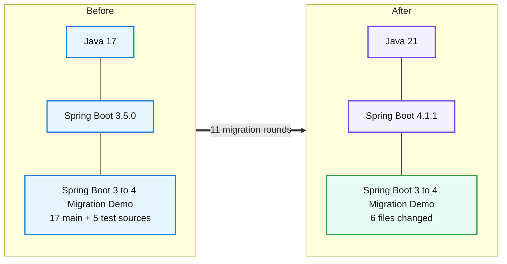
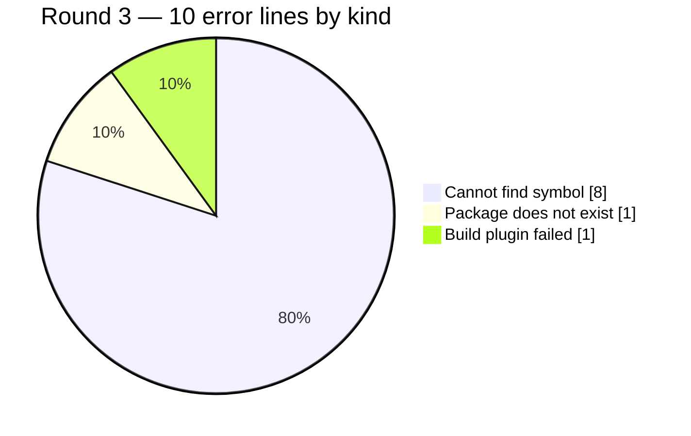

# Migration Report — Spring Boot 3.5.0 to 4.1.1 on Java 21 (open-source-only ladder: 3.5.16, 4.0.8, 4.1.1)

## Spring Boot 3 to 4 Migration Demo

    

> The application moved from Spring Boot 3.5.0 on Java 17 to Spring Boot 4.1.1 on Java 21 in three edges (3.5.16, 4.0.8, 4.1.1), using only Apache-2.0 OpenRewrite recipes. The 04D open-source composite made the Boot 4 package and type moves (Jackson databind, actuator health, MockitoBean, test slices) and the two starter renames; it did not add the modular test starters, and it cannot touch the Jackson 3 configuration API, so the hand-built Jackson mapper, the two test starters and an H2 console module were repaired by hand from build and probe evidence. The final build compiles at release 21 and runs the same 19 tests with the same 2 pre-existing failures as before. Every endpoint still answers with the same status; framework-owned payloads changed shape (error timestamps, ProblemDetail bodies, health document, metrics list), which is reported below. One endpoint (/h2-console) disappeared after the move to Boot 4 and was restored before the final probe.

_Generated by the Version Migration skill on 2026-10-01. Every version, error count and response below is read from a recorded run, not from memory._

## At a glance

| | |
|---|---|
| **Result** | 🟢 **Passed** on the final build |
| **Platform** | Spring Boot `3.5.0` → `4.1.1` |
| **Language** | Java `17` → `21` |
| **Build rounds** | 12 recorded — 1 pre-migration baseline, 5 that failed and were read for what to change next, 6 green |
| **Files changed** | 6 — `Dockerfile`, `pom.xml`, `src/main/java/com/example/migrationdemo/config/JacksonConfig.java`, `src/main/java/com/example/migrationdemo/health/DatabaseHealthIndicator.java`, `src/test/java/com/example/migrationdemo/controller/EmployeeControllerTest.java`, `src/test/java/com/example/migrationdemo/integration/EmployeeRepositoryIntegrationTest.java` |
| **Dependency changes** | 7 |
| **Source changes forced by the upgrade** | 10 |
| **Test suite** | before: 19 run, 2 failed, 0 errors → after: 19 run, 2 failed, 0 errors — 🟡 the same 2 pre-existing failures — none introduced |
| **Runtime behaviour** | 🟡 same status on all 20, body differs on 18 |
| **Migration plan** | recorded before any change — 16 predicted impacts, 3 deterministic candidates |
| **Deterministic transformations** | 🟢 3 applied · 🔍 3 previewed · ⚪ 1 with no change — OpenRewrite |
| **Requested target** | `4.1.1` — final build declares `4.1.1` 🟢 matches |
| **Reference followed** | `references/spring-boot-3-to-4.md` |
| **Build tool** | maven — Apache Maven 3.9.9 (8e8579a9e76f7d015ee5ec7bfcdc97d260186937) |

## 0. What was understood before anything changed

> Everything in this section was written **before** any version or source changed — it is a prediction, and it is shown next to what the build, the tests and the probes then actually did. A predicted impact is never evidence that something failed.

### 0.1 Target and path

| | |
|---|---|
| **Source** | Spring Boot `3.5.0` · Java `17` |
| **Requested target** | Spring Boot `4.1.1` · Java `21` — _as requested; never "latest", never a recipe's own target_ |
| **Path** | `3.5.0` → `3.5.16` (E1 PATCH, pin-only (core-apache-2.0), JDK 17) · `3.5.16` → `4.0.8` (E2 MAJOR_BOUNDARY, 04D open-source composite openrewrite/spring-boot-3-to-4.oss.yml + parent pin (core-apache-2.0), JDK 17, rules pack spring-boot-3-to-4) · `4.0.8` → `4.1.1` (E3 MINOR (landing), pin-only parent + java.version 21 (core-apache-2.0), JDK 21) |

### 0.2 Constraints and compatibility questions

| | Constraint | Status in the plan | At the end | Evidence |
|---|---|---|---|---|
| 🟢 | **C1** JDK 17 and JDK 21 are available | satisfied | — | baseline.json toolchain: 17.0.20.1 and 21.0.11 |
| ❓ | **C2** Spring Boot 3.5.16, 4.0.8 and 4.1.1 parents resolve from the configured repositories _(blocking)_ | unresolved | resolved | Rounds 1, 3 and 7 resolved parents 3.5.16, 4.0.8 and 4.1.1. |
| 🟢 | **C3** Only Apache-2.0 recipes run (licence policy open-source-only) _(blocking)_ | satisfied | — | baseline.json license_policy open-source-only; every edge stack core-apache-2.0 |
| ❓ | **C4** Testcontainers 1.20.1 (explicitly pinned, three artifacts) still works with the Boot 4 test stack | unresolved | resolved | Rounds 6, 8 and 10: EmployeeRepositoryIntegrationTest 5/5 on postgres:16 with Testcontainers 1.20.1 on Boot 4. |
| 🟢 | **C5** No Spring Cloud or other platform BOM is imported | satisfied | — | baseline.json observations.platform_boms lists only the Boot parent |
| ❓ | **C6** Spring Framework 7 / Security 7 / Hibernate 7 arrive managed by the Boot 4 BOM | unresolved | resolved | dependency:tree on the final sandbox: spring-core 7.0.9, spring-security 7.1.1, hibernate-core 7.4.5.Final, jackson-databind 3.1.5. |
| ❓ | **C7** The final build declares and compiles at Java 21 (property and compiler configuration) _(blocking)_ | unresolved | resolved | Round 7 and later: javac [debug parameters release 21]; MigrationDemoApplication.class major version 65. |
| ❓ | **C8** No endpoint is lost (7 static request mappings) _(blocking)_ | unresolved | resolved | Final probe static_endpoints lists the same 7 mappings; every endpoint was probed with the same status; /h2-console restored. |

### 0.3 Predicted impact vs what actually happened

_The build, transformation and patch columns are facts about the **file**; several impact entries can share one file (a build descriptor, say). Whether this particular impact was real is the agent review's column._

| Impact | File | Area · rule | Risk | Predicted handling | File named by a failing build | File changed by a transformation | File in final patch | Agent review |
|---|---|---|---|---|---|---|---|---|
| **I1** | `pom.xml` | Platform parent · section 1.1 | low | deterministic | never named by a build | rewrite-01, rewrite-03, rewrite-06 | ✏️ yes | handled-by-transformation — ChangeParentPom per edge: 3.5.16 (rewrite-01), 4.0.8 (rewrite-03), 4.1.1 (rewrite-06). |
| **I2** | `pom.xml` | Language level property · section 1.2 | low | deterministic | never named by a build | rewrite-01, rewrite-03, rewrite-06 | ✏️ yes | handled-by-transformation — ChangePropertyValue java.version 21 in rewrite-06. |
| **I3** | `pom.xml` | Compiler configuration · section 1.2 | medium | residual | never named by a build | rewrite-01, rewrite-03, rewrite-06 | ✏️ yes | not-needed — javac ran with release 21 (parent's maven.compiler.release); class major 65. The stale &lt;source&gt;/&lt;target&gt;17 is inert and… |
| **I4** | `pom.xml` | Starter rename · section 1.3 | low | deterministic | never named by a build | rewrite-01, rewrite-03, rewrite-06 | ✏️ yes | handled-by-transformation — Composite ChangeDependencyGroupIdAndArtifactId (rewrite-03). |
| **I5** | `pom.xml` | Security test starter · section 4.4 | high | deterministic | never named by a build | rewrite-01, rewrite-03, rewrite-06 | ✏️ yes | handled-by-transformation — Composite rename (rewrite-03); @WithMockUser tests pass in rounds 6, 8 and 10. |
| **I6** | `pom.xml` | Modular test starters · section 4.3 | medium | deterministic | never named by a build | rewrite-01, rewrite-03, rewrite-06 | ✏️ yes | confirmed — The composite's AddDependency steps did not fire (rewrite-03, rewrite-04); added by hand after round 4. |
| **I7** | `src/main/java/com/example/migrationdemo/config/JacksonConfig.java` | JSON handling · section 2.1, 2.2 | high | either | rounds 3 | rewrite-03 | ✏️ yes | confirmed — Package move by the composite, configuration API by hand after round 3; serialization probes match apart from the… |
| **I8** | `src/main/java/com/example/migrationdemo/health/DatabaseHealthIndicator.java` | Actuator health · section 3 | low | deterministic | never named by a build | rewrite-03 | ✏️ yes | handled-by-transformation — ChangeType x2 (rewrite-03); custom 'database' health component still present. |
| **I9** | `src/test/java/com/example/migrationdemo/controller/EmployeeControllerTest.java` | Test layer (web slice) · section 4.1, 4.2, 4.3, 4.4 | high | either | rounds 4 | rewrite-03 | ✏️ yes | handled-by-transformation — MockitoBean, WebMvcTest relocation and the Jackson import by the composite; the module dependency came from I6. |
| **I10** | `src/test/java/com/example/migrationdemo/integration/EmployeeRepositoryIntegrationTest.java` | Test layer (JPA slice) · section 4.3 | medium | deterministic | rounds 4 | rewrite-03 | ✏️ yes | handled-by-transformation — DataJpaTest relocation by the composite; the module dependency came from I6. |
| **I11** | `src/main/java/com/example/migrationdemo/exception/ErrorResponse.java` | Error contract · section 2.1 (annotations unchanged) | low | residual | never named by a build | — | no | not-needed — com.fasterxml.jackson.annotation is unchanged in Jackson 3; ErrorResponse timestamp shape identical. |
| **I12** | `src/main/java/com/example/migrationdemo/config/SecurityConfig.java` | Security 7 · section 5 | low | residual | never named by a build | — | no | not-needed — Lambda DSL compiled unchanged on Security 7.1.1; security-boundary probes identical in status. |
| **I13** | `src/main/java/com/example/migrationdemo/repository/EmployeeRepository.java` | Hibernate 7 / Spring Data JPA · section 6 | medium | residual | never named by a build | — | no | not-needed — Hibernate 7.4.5: JPQL and native queries pass the PostgreSQL integration tests and the H2 probes. |
| **I14** | `src/main/resources/application.yml` | Configuration properties · section 7 | medium | residual | never named by a build | — | no | confirmed — spring.h2.console.* had no effect without the new spring-boot-h2console module; restored. Other properties behaved the… |
| **I15** | `Dockerfile` | Runtime image · section 8 | medium | residual | never named by a build | — | ✏️ yes | confirmed — Dockerfile edited by hand; not built here. |
| **I16** | `pom.xml` | Pinned Testcontainers · section 1.4, section 14 | medium | residual | never named by a build | rewrite-01, rewrite-03, rewrite-06 | ✏️ yes | confirmed — Pinned 1.20.1 kept (three hand-reverts of ChangeParentPom's version removal); integration tests pass on Boot 4.1.1. |

**Every changed file was predicted by the plan.**

### 0.4 Which probes protect which impact

| Probe | Category | Protects | Replayed |
|---|---|---|---|
| list all employees | business-api | I1, I7, I13 | 🟢 before and after |
| get employee 1 | serialization | I7 | 🟢 before and after |
| create without department omits null field | serialization | I7, I14 | 🟢 before and after |
| employee not found is 404 | error-contract | I11 | 🟢 before and after |
| search without department is 400 | error-contract | I11 | 🟢 before and after |
| invalid create is 400 | error-contract | I11 | 🟢 before and after |
| duplicate employee number is 409 | error-contract | I11 | 🟢 before and after |
| high earners above 80000 (native query) | business-api | I13 | 🟢 before and after |
| search by department | business-api | I13 | 🟢 before and after |
| unauthenticated list is 401 | security-boundary | I12 | 🟢 before and after |
| bad credentials is 401 | security-boundary | I12 | 🟢 before and after |
| health is public | actuator | I8, I12, I14 | 🟢 before and after |
| metrics index | actuator | I14 | 🟢 before and after |
| h2 console (configured in application.yml) | other | I14 | 🟢 before and after |
| _none_ | test-suite | I5, I6, I9, I10, I16 | ⚪ not observable — Test-layer impact is observed by the same-goal package round's test counts, not by an HTTP probe. |
| _none_ | other | I15 | ⚪ not observable — No container image is built or run in this validation. |
| _none_ | other | I3 | ⚪ not observable — Compiler level is observed in the build log and the class-file version, not over HTTP. |

### 0.5 Out of scope, and when to stop

**Out of scope:**

- Fixing the 2 pre-existing EmployeeControllerTest actuator failures (404 under @WebMvcTest)
- EmployeeService duplicate-email check that queries findByEmployeeNumber (pre-existing bug)
- Testcontainers 2 migration unless a build demands it
- Switching to the Moderne Source Available recipe stack (user decision; policy is open-source-only)
- docker-compose.yml (postgres only, no Java reference)
- Any refactor, formatting or import reordering

**Stop conditions:**

- A Boot parent on the path cannot be resolved
- A recipe outside Apache-2.0 would be needed to proceed
- A business or security-boundary probe changes status and the cause is outside the migration's scope
- An endpoint present at baseline is missing after the migration and cannot be restored
- New test failures compared with round 0 that cannot be attributed and repaired


## 0.6 Migration path and endpoint preservation

### Migration path (edges)

Ladder `references/openrewrite/spring-boot-ladder.json` · licence policy **open-source-only** · granularity boundary · versions from maven-metadata https://repo1.maven.org/maven2/org/springframework/boot/spring-boot-starter-parent/maven-metadata.xml

| Edge | From → To | Class | Recipe | Licence | JDK | Cloud train | Previews | Applies | Rounds | Complete |
|---|---|---|---|---|---|---|---|---|---|---|
| E1 | 3.5.0 → 3.5.16 | PATCH | pin-only | Apache-2.0 | 17 | — | rewrite-00 previewed (1 files) | rewrite-01 applied (1 files) | R1 test-compile passed; R2 test-compile passed | yes (R1) |
| E2 | 3.5.16 → 4.0.8 | MAJOR_BOUNDARY | oss-composite: openrewrite/spring-boot-3-to-4.oss.yml | Apache-2.0 | 17 | — | rewrite-02 previewed (5 files); rewrite-04 no-changes (0 files) | rewrite-03 applied (5 files) | R3 test-compile compile-failed; R4 test-compile compile-failed; R5 test-compile passed; R6 package tests-failed | yes (R5) |
| E3 | 4.0.8 → 4.1.1 | MINOR (landing) | pin-only | Apache-2.0 | 21 | — | rewrite-05 previewed (1 files) | rewrite-06 applied (1 files) | R7 test-compile passed; R8 package tests-failed; R9 package-skip-tests passed; R10 package tests-failed; R11 package-skip-tests passed | yes (R7) |

Edge notes:

- E1: patch edge within 3.5: pins the platform only — a patch release carries no framework migration
- E3: no open-source-only upstream recipe for 4.1: the edge pins the platform and Java level; compiler-driven repair handles the rest

### Endpoint preservation

| Inventory | Before | After | Preserved | Missing | Added |
|---|---|---|---|---|---|
| Source mappings (static scan) | 7 | 7 | 7 | 0 | 0 |
| Running application (actuator /mappings) | — | — | — | — | — |

- /actuator/mappings not exposed or not probed — static inventory only

No endpoint observed before the migration is missing after it, in any inventory that was available.

## 1. What moved



| | What | Before | After | Why it moved |
|---|---|---|---|---|
| ⬆️ | `Java (language level)` | `17` | `21` | Runtime baseline required by the new platform version. |
| ⬆️ | `Spring Boot (platform)` | `3.5.0` | `4.1.1` | The version jump this migration is about. |
| ⬆️ | `org.springframework.boot:spring-boot-starter-parent` | `3.5.0` | `4.1.1` | Pinned per edge by the generated edge recipes (E1 3.5.16, E2 4.0.8, E3 4.1.1), pack section 1.1. |
| ⬆️ | `java.version` | `17` | `21` | Java 21 is the requested target; set by the E3 edge recipe (pack section 1.2). |
| 🔀 | `org.springframework.boot:spring-boot-starter-web` | `spring-boot-starter-web` | `org.springframework.boot:spring-boot-starter-webmvc` | Boot 4 names the servlet starter for its stack; renamed by the open-source composite (pack section 1.3). |
| 🔀 | `org.springframework.security:spring-security-test` | `spring-security-test` | `org.springframework.boot:spring-boot-starter-security-test` | Boot 4 carries the MockMvc security test auto-configuration in its own starter; renamed by the open-source composite (pack section 4.4). |
| ➕ | `org.springframework.boot:spring-boot-starter-webmvc-test` | `absent` | `managed (4.0.8, then 4.1.1)` | @WebMvcTest/@AutoConfigureMockMvc moved to this module (pack section 4.3); added by hand because the composite's AddDependency did not fire. |
| ➕ | `org.springframework.boot:spring-boot-starter-data-jpa-test` | `absent` | `managed (4.0.8, then 4.1.1)` | @DataJpaTest moved to this module (pack section 4.3); added by hand because the composite's AddDependency did not fire. |
| ➕ | `org.springframework.boot:spring-boot-h2console` | `absent` | `managed 4.1.1 (runtime)` | Boot 4 moved H2ConsoleAutoConfiguration out of spring-boot-autoconfigure into this module; without it /h2-console (enabled in application.yml) returned 404. |

## 2. How the migration went

**12 build rounds**, 3.5 min of build time in total. Round 0 is the pre-migration reference build on JDK 17; every later round ran on JDK 21. 6 of them came back with errors, 6 came back clean. A red round is not a setback here — it is the output the migration is driven by: each one names the exact files or tests the next change has to touch. Apart from the 3 deterministic transformations in §2.4 — each previewed, inspected and then applied to the sandbox, and each built immediately — nothing was edited that a build, a test or a probe had not first complained about. The migration ends on round 11, 🟢 **Passed**.

```mermaid
flowchart TD
  classDef broken fill:#ffe3e3,stroke:#c92a2a,stroke-width:2px,color:#1a1a1a
  classDef degraded fill:#fff3bf,stroke:#e8590c,stroke-width:2px,color:#1a1a1a
  classDef ok fill:#e6fcf5,stroke:#2f9e44,stroke-width:2px,color:#1a1a1a
  classDef before fill:#e7f5ff,stroke:#1c7ed6,stroke-width:2px,color:#1a1a1a
  classDef after fill:#f3f0ff,stroke:#7048e8,stroke-width:2px,color:#1a1a1a
  classDef neutral fill:#f1f3f5,stroke:#868e96,stroke-width:1px,color:#1a1a1a
  subgraph P0["Phase 0 · Reference build, before anything changed · JDK 17 · round 0"]
    direction TB
    R0["🟠 Round 0 · baseline — Tests failed<br/>maven package · JDK 17 · 34.7s<br/>7 error lines<br/>tests: 19 run · 2 failed · 0 errored<br/>EmployeeControllerTest.testActuatorHealth_Public · EmployeeControllerTest.testActuatorInfo_Public"]:::degraded
  end
  subgraph P1["Phase 1 · Prove main + test sources compile · JDK 17 · rounds 1-5"]
    direction TB
    R1["🟢 Round 1 — Passed<br/>maven test-compile · JDK 17 · 15.6s<br/>no errors"]:::ok
    R2["🟢 Round 2 — Passed<br/>maven test-compile · JDK 17 · 8.5s<br/>no errors"]:::ok
    R3["🔴 Round 3 — Compile failed<br/>maven test-compile · JDK 17 · 13.9s<br/>10 error lines · 5 distinct problems<br/>Cannot find symbol ×4 · Package does not exist ×1<br/>JacksonConfig.java ×5"]:::broken
    R4["🔴 Round 4 — Compile failed<br/>maven test-compile · JDK 17 · 9.3s<br/>7 error lines · 4 distinct problems<br/>Package does not exist ×2 · Cannot find symbol ×2<br/>EmployeeControllerTest.java ×2 · EmployeeRepositoryIntegrationTest.java ×2"]:::broken
    R5["🟢 Round 5 — Passed<br/>maven test-compile · JDK 17 · 20.7s<br/>no errors"]:::ok
  end
  subgraph P2["Phase 2 · Prove the test suite runs and the jar builds · JDK 17 · round 6"]
    direction TB
    R6["🟠 Round 6 — Tests failed<br/>maven package · JDK 17 · 36.9s<br/>7 error lines<br/>tests: 19 run · 2 failed · 0 errored<br/>EmployeeControllerTest.testActuatorHealth_Public · EmployeeControllerTest.testActuatorInfo_Public"]:::degraded
  end
  subgraph P3["Phase 3 · Prove main + test sources compile · JDK 21 · round 7"]
    direction TB
    R7["🟢 Round 7 — Passed<br/>maven test-compile · JDK 21 · 6.4s<br/>no errors"]:::ok
  end
  subgraph P4["Phase 4 · Prove the test suite runs and the jar builds · JDK 21 · round 8"]
    direction TB
    R8["🟠 Round 8 — Tests failed<br/>maven package · JDK 21 · 23.9s<br/>7 error lines<br/>tests: 19 run · 2 failed · 0 errored<br/>EmployeeControllerTest.testActuatorHealth_Public · EmployeeControllerTest.testActuatorInfo_Public"]:::degraded
  end
  subgraph P5["Phase 5 · Prove the jar builds, tests skipped · JDK 21 · round 9"]
    direction TB
    R9["🟢 Round 9 — Passed<br/>maven package-skip-tests · JDK 21 · 8.0s<br/>no errors"]:::ok
  end
  subgraph P6["Phase 6 · Prove the test suite runs and the jar builds · JDK 21 · round 10"]
    direction TB
    R10["🟠 Round 10 — Tests failed<br/>maven package · JDK 21 · 23.6s<br/>7 error lines<br/>tests: 19 run · 2 failed · 0 errored<br/>EmployeeControllerTest.testActuatorHealth_Public · EmployeeControllerTest.testActuatorInfo_Public"]:::degraded
  end
  subgraph P7["Phase 7 · Prove the jar builds, tests skipped · JDK 21 · round 11"]
    direction TB
    R11["🟢 Round 11 — Passed<br/>maven package-skip-tests · JDK 21 · 6.7s<br/>no errors"]:::ok
  end
  R0 -->|"Applied rewrite-01 edge E1 recipe, previewed as…"| R1
  R1 -->|"Restored ‹version›1.20.1‹/version› on the three…"| R2
  R2 -->|"Applied rewrite-03 edge E2 recipe:…"| R3
  R3 -->|"JacksonConfig: Jackson 2 ObjectMapper bean replaced… +1 more"| R4
  R4 -->|"Added test-scope spring-boot-starter-webmvc-test…"| R5
  R5 -->|"same code, next gate: maven package"| R6
  R6 -->|"Applied rewrite-06 edge E3 recipe, previewed as…"| R7
  R7 -->|"Restored ‹version›1.20.1‹/version› on… +1 more"| R8
  R8 -->|"same code, next gate: maven package-skip-tests"| R9
  R9 -->|"Added runtime-scope org.springframework.boot:spring-…"| R10
  R10 -->|"same code, next gate: maven package-skip-tests"| R11
  style P0 fill:#f8f9fa,stroke:#ced4da,stroke-width:1px,color:#495057
  style P1 fill:#f8f9fa,stroke:#ced4da,stroke-width:1px,color:#495057
  style P2 fill:#f8f9fa,stroke:#ced4da,stroke-width:1px,color:#495057
  style P3 fill:#f8f9fa,stroke:#ced4da,stroke-width:1px,color:#495057
  style P4 fill:#f8f9fa,stroke:#ced4da,stroke-width:1px,color:#495057
  style P5 fill:#f8f9fa,stroke:#ced4da,stroke-width:1px,color:#495057
  style P6 fill:#f8f9fa,stroke:#ced4da,stroke-width:1px,color:#495057
  style P7 fill:#f8f9fa,stroke:#ced4da,stroke-width:1px,color:#495057
```



### 2.1 The round ledger

| Round | Ran on | Goal | Outcome | Errors | Took | What it told us |
|---|---|---|---|---|---|---|
| **0**<br/>_(baseline)_ | JDK 17 | `package`<br/>_the test suite runs and the jar builds_ | 🟠 Tests failed | 7 | 34.7s | **2 tests failed an assertion**<br/>failing tests: `EmployeeControllerTest.testActuatorHealth_Public` · `EmployeeControllerTest.testActuatorInfo_Public`<br/>Pre-migration reference build on JDK 17, package goal: 19 tests, 2 failures. Both failures are EmployeeControllerTest actuator tests that expect 200 from /actuator/health and /actuator/info inside a @WebMvcTest slice, which does not load the actuator endpoints, so they get 404. |
| **1** | JDK 17 | `test-compile`<br/>_main + test sources compile_ | 🟢 Passed | — | 15.6s | **Nothing failed** — main + test sources compile on JDK 17.<br/>Edge E1 (3.5.0 -&gt; 3.5.16, pin-only) verified on JDK 17: test-compile is green. The applied recipe also stripped the explicit Testcontainers versions, which the preview had shown and which was rejected for the next round. |
| **2** | JDK 17 | `test-compile`<br/>_main + test sources compile_ | 🟢 Passed | — | 8.5s | **Nothing failed** — main + test sources compile on JDK 17.<br/>Same edge after reverting the rejected hunk: still green, so the patch release needed nothing else. |
| **3** | JDK 17 | `test-compile`<br/>_main + test sources compile_ | 🔴 Compile failed | 10<br/>_5 distinct_ | 13.9s | **Cannot find symbol ×4 · Package does not exist ×1**<br/>in `JacksonConfig.java` (5 problems)<br/>Edge E2 (3.5.16 -&gt; 4.0.8, open-source composite) on JDK 17. Main code fails only in JacksonConfig. |
| **4** | JDK 17 | `test-compile`<br/>_main + test sources compile_ | 🔴 Compile failed | 7<br/>_4 distinct_ | 9.3s | **Package does not exist ×2 · Cannot find symbol ×2**<br/>in `EmployeeControllerTest.java` (2 problems) · `EmployeeRepositoryIntegrationTest.java` (2 problems)<br/>Main code now compiles; the failure moved to the test layer, which only compiles once main does. Both test classes import the relocated slice annotations, but the modules that contain them are not on the classpath: the composite's AddDependency steps did not add them. |
| **5** | JDK 17 | `test-compile`<br/>_main + test sources compile_ | 🟢 Passed | — | 20.7s | **Nothing failed** — main + test sources compile on JDK 17.<br/>Test-compile is green on Boot 4.0.8 with JDK 17, so edge E2 is complete. Before this round the composite's own deterministic step was retried (rewrite-04 dry-run) and proposed no change, so the starters were added by hand. |
| **6** | JDK 17 | `package`<br/>_the test suite runs and the jar builds_ | 🟠 Tests failed | 7 | 36.9s | **2 tests failed an assertion**<br/>failing tests: `EmployeeControllerTest.testActuatorHealth_Public` · `EmployeeControllerTest.testActuatorInfo_Public`<br/>The same package goal as round 0, run on the boundary edge to catch Boot 4 test-time breaks before the next edge: 19 tests, the same 2 pre-existing actuator failures, no new ones. @WithMockUser tests still pass, so the security-test starter rename covered pack 4.4, and the 5 PostgreSQL integration tests pass with Hibernate 7 and the pinned Testcontainers 1.20.1. |
| **7** | JDK 21 | `test-compile`<br/>_main + test sources compile_ | 🟢 Passed | — | 6.4s | **Nothing failed** — main + test sources compile on JDK 21.<br/>Edge E3 (4.0.8 -&gt; 4.1.1 plus java.version 21) on JDK 21: test-compile is green. The log shows javac running with 'release 21', and the classes are major version 65. |
| **8** | JDK 21 | `package`<br/>_the test suite runs and the jar builds_ | 🟠 Tests failed | 7 | 23.9s | **2 tests failed an assertion**<br/>failing tests: `EmployeeControllerTest.testActuatorHealth_Public` · `EmployeeControllerTest.testActuatorInfo_Public`<br/>Same goal as round 0, on the landing version and JDK 21: 19 tests, the same 2 pre-existing failures, no new failures. |
| **9** | JDK 21 | `package-skip-tests`<br/>_the jar builds, tests skipped_ | 🟢 Passed | — | 8.0s | **Nothing failed** — the jar builds, tests skipped on JDK 21.<br/>Package without tests produced the runnable jar on JDK 21. The first final probe ran on this jar and found /h2-console returning 404. |
| **10** | JDK 21 | `package`<br/>_the test suite runs and the jar builds_ | 🟠 Tests failed | 7 | 23.6s | **2 tests failed an assertion**<br/>failing tests: `EmployeeControllerTest.testActuatorHealth_Public` · `EmployeeControllerTest.testActuatorInfo_Public`<br/>After the H2 console module was added, the same goal as round 0 gives the same 19 tests and the same 2 pre-existing failures, so the added runtime module changed nothing in the suite. |
| **11** | JDK 21 | `package-skip-tests`<br/>_the jar builds, tests skipped_ | 🟢 Passed | — | 6.7s | **Nothing failed** — the jar builds, tests skipped on JDK 21.<br/>Final packaging round on JDK 21 is green. The final runtime probe was re-run on this jar. |

### 2.2 Exactly what failed, and why

One block per round that did not come back green: the files or the tests the build named, the message it printed against each one, and what that meant. Paths are as the compiler reported them, relative to the project root, and the line numbers are the lines it pointed at. Everything in the tables is read out of the recorded build; only the **Why it failed** paragraph is the agent's reading of it.

#### Round 0 — 🟠 Tests failed _(pre-migration reference, not migration damage)_

`maven package` on JDK 17 · 7 error lines · 19 tests run · 2 failed · 0 errored

**Which tests failed**

| Test | Source file | Why it failed | What kind of problem | Was it already failing? |
|---|---|---|---|---|
| `EmployeeControllerTest.testActuatorHealth_Public` | `src/test/java/com/example/migrationdemo/controller/EmployeeControllerTest.java`<br/>line 145 | Status expected:&lt;200&gt; but was:&lt;404&gt; | Test failure — The code compiled but behaviour or test wiring changed. | _this is the baseline_ |
| `EmployeeControllerTest.testActuatorInfo_Public` | `src/test/java/com/example/migrationdemo/controller/EmployeeControllerTest.java`<br/>line 151 | Status expected:&lt;200&gt; but was:&lt;404&gt; | Test failure — The code compiled but behaviour or test wiring changed. | _this is the baseline_ |

**Why it failed**

Pre-migration reference build on JDK 17, package goal: 19 tests, 2 failures. Both failures are EmployeeControllerTest actuator tests that expect 200 from /actuator/health and /actuator/info inside a @WebMvcTest slice, which does not load the actuator endpoints, so they get 404. They are pre-existing and are the comparison baseline. Docker was available, so the 5 Testcontainers PostgreSQL integration tests ran and passed.

**What was changed in response** — then re-run as round 1

- Applied rewrite-01 (edge E1 recipe, previewed as rewrite-00).

Reference rule(s) applied: `section 1.1`

_Every error line, the exact command and the full build log for this round are in **section 3, Round 0**._

#### Round 3 — 🔴 Compile failed

`maven test-compile` on JDK 17 · 10 error lines · 5 distinct problems across 1 file

**Which files failed**

| File | Problems | At line(s) | What the build said about it | Why this kind of error happens |
|---|---|---|---|---|
| `src/main/java/com/example/migrationdemo/config/JacksonConfig.java` | 5 | 5, 26, 29, 32, 36 | package com.fasterxml.jackson.datatype.jsr310 does not exist<br/>cannot find symbol — class JavaTimeModule<br/>cannot find symbol — variable WRITE_DATES_AS_TIMESTAMPS<br/>cannot find symbol — method setDefaultPropertyInclusion(com.fasterxml.jackson.annotation.JsonInclude.Include)<br/>_…and 1 more_ | A class, method or field was renamed or removed. Look for a replacement API in the reference pack. |

**Why it failed**

Edge E2 (3.5.16 -&gt; 4.0.8, open-source composite) on JDK 17. Main code fails only in JacksonConfig. The composite moved the databind package, but the hand-built mapper uses the Jackson 2 mutable API and the jsr310 module, none of which a package move can fix. Test code did not get compiled yet because main failed first.

**What was changed in response** — then re-run as round 4

- JacksonConfig: Jackson 2 ObjectMapper bean replaced by a JsonMapper built with the Jackson 3 builder (pack 2.2).
- Restored &lt;version&gt;1.20.1&lt;/version&gt; on org.testcontainers:testcontainers (rejected hunk of rewrite-03).

Reference rule(s) applied: `section 2.2`

_Every error line, the exact command and the full build log for this round are in **section 3, Round 3**._

#### Round 4 — 🔴 Compile failed

`maven test-compile` on JDK 17 · 7 error lines · 4 distinct problems across 2 files

**Which files failed**

| File | Problems | At line(s) | What the build said about it | Why this kind of error happens |
|---|---|---|---|---|
| `src/test/java/com/example/migrationdemo/controller/EmployeeControllerTest.java` | 2 | 11, 27 | package org.springframework.boot.webmvc.test.autoconfigure does not exist<br/>cannot find symbol — class WebMvcTest | A type moved to a new package or module. Look for a relocation entry in the reference pack. |
| `src/test/java/com/example/migrationdemo/integration/EmployeeRepositoryIntegrationTest.java` | 2 | 8, 30 | package org.springframework.boot.data.jpa.test.autoconfigure does not exist<br/>cannot find symbol — class DataJpaTest | A type moved to a new package or module. Look for a relocation entry in the reference pack. |

**Why it failed**

Main code now compiles; the failure moved to the test layer, which only compiles once main does. Both test classes import the relocated slice annotations, but the modules that contain them are not on the classpath: the composite's AddDependency steps did not add them.

**What was changed in response** — then re-run as round 5

- Added test-scope spring-boot-starter-webmvc-test and spring-boot-starter-data-jpa-test (pack 4.3).

Reference rule(s) applied: `section 4.3`

_Every error line, the exact command and the full build log for this round are in **section 3, Round 4**._

#### Round 6 — 🟠 Tests failed

`maven package` on JDK 17 · 7 error lines · 19 tests run · 2 failed · 0 errored

**Which tests failed**

| Test | Source file | Why it failed | What kind of problem | Was it already failing? |
|---|---|---|---|---|
| `EmployeeControllerTest.testActuatorHealth_Public` | `src/test/java/com/example/migrationdemo/controller/EmployeeControllerTest.java`<br/>line 145 | Status expected:&lt;200&gt; but was:&lt;404&gt; | Test failure — The code compiled but behaviour or test wiring changed. | ⚪ yes — already failing in the reference build |
| `EmployeeControllerTest.testActuatorInfo_Public` | `src/test/java/com/example/migrationdemo/controller/EmployeeControllerTest.java`<br/>line 151 | Status expected:&lt;200&gt; but was:&lt;404&gt; | Test failure — The code compiled but behaviour or test wiring changed. | ⚪ yes — already failing in the reference build |

**Why it failed**

The same package goal as round 0, run on the boundary edge to catch Boot 4 test-time breaks before the next edge: 19 tests, the same 2 pre-existing actuator failures, no new ones. @WithMockUser tests still pass, so the security-test starter rename covered pack 4.4, and the 5 PostgreSQL integration tests pass with Hibernate 7 and the pinned Testcontainers 1.20.1. The log also shows a new warning, "Parameter 'executable' is unknown for plugin spring-boot-maven-plugin:4.0.8:repackage": Boot 4 dropped the fully-executable jar option, which the build ignores rather than failing on.

**What was changed in response** — then re-run as round 7

- Applied rewrite-06 (edge E3 recipe, previewed as rewrite-05).

Reference rule(s) applied: `section 1.1` · `section 1.2`

_Every error line, the exact command and the full build log for this round are in **section 3, Round 6**._

#### Round 8 — 🟠 Tests failed

`maven package` on JDK 21 · 7 error lines · 19 tests run · 2 failed · 0 errored

**Which tests failed**

| Test | Source file | Why it failed | What kind of problem | Was it already failing? |
|---|---|---|---|---|
| `EmployeeControllerTest.testActuatorHealth_Public` | `src/test/java/com/example/migrationdemo/controller/EmployeeControllerTest.java`<br/>line 145 | Status expected:&lt;200&gt; but was:&lt;404&gt; | Test failure — The code compiled but behaviour or test wiring changed. | ⚪ yes — already failing in the reference build |
| `EmployeeControllerTest.testActuatorInfo_Public` | `src/test/java/com/example/migrationdemo/controller/EmployeeControllerTest.java`<br/>line 151 | Status expected:&lt;200&gt; but was:&lt;404&gt; | Test failure — The code compiled but behaviour or test wiring changed. | ⚪ yes — already failing in the reference build |

**Why it failed**

Same goal as round 0, on the landing version and JDK 21: 19 tests, the same 2 pre-existing failures, no new failures.

**No source change was needed** — round 9 re-ran `maven package-skip-tests` on the same code.

_Every error line, the exact command and the full build log for this round are in **section 3, Round 8**._

#### Round 10 — 🟠 Tests failed

`maven package` on JDK 21 · 7 error lines · 19 tests run · 2 failed · 0 errored

**Which tests failed**

| Test | Source file | Why it failed | What kind of problem | Was it already failing? |
|---|---|---|---|---|
| `EmployeeControllerTest.testActuatorHealth_Public` | `src/test/java/com/example/migrationdemo/controller/EmployeeControllerTest.java`<br/>line 145 | Status expected:&lt;200&gt; but was:&lt;404&gt; | Test failure — The code compiled but behaviour or test wiring changed. | ⚪ yes — already failing in the reference build |
| `EmployeeControllerTest.testActuatorInfo_Public` | `src/test/java/com/example/migrationdemo/controller/EmployeeControllerTest.java`<br/>line 151 | Status expected:&lt;200&gt; but was:&lt;404&gt; | Test failure — The code compiled but behaviour or test wiring changed. | ⚪ yes — already failing in the reference build |

**Why it failed**

After the H2 console module was added, the same goal as round 0 gives the same 19 tests and the same 2 pre-existing failures, so the added runtime module changed nothing in the suite.

**No source change was needed** — round 11 re-ran `maven package-skip-tests` on the same code.

_Every error line, the exact command and the full build log for this round are in **section 3, Round 10**._


### 2.3 The mix of breakage in the worst round

Round 3 carried more error lines than any other — 10 of them, in these proportions:



### 2.4 Deterministic transformations

OpenRewrite ran **inside the sandbox only**, as a provider 04D invoked — never as the orchestrator and never as proof. A dry-run is a preview that changes nothing; an apply is only accepted when every file it changed was in the inspected preview, and is built immediately. A transformation that was unavailable, failed or was reverted is listed here as exactly that.

| Record | Mode | Outcome | Recipes | Artifact · plugin | Licence | Files | Built in | Agent decision |
|---|---|---|---|---|---|---|---|---|
| `rewrite-00` | dry-run | 🔍 previewed (dry-run, nothing changed) | `mars.migration.edge.E1` | —<br/>plugin `6.46.1` | Apache-2.0 | 1 proposed | — | **superseded** — E1 preview. Parent 3.5.0 -&gt; 3.5.16 accepted; the removal of &lt;version&gt;1.20.1&lt;/version&gt; from the three Testcontainers dependencies rejected… |
| `rewrite-01` | apply | 🟢 applied to the sandbox | `mars.migration.edge.E1` | —<br/>plugin `6.46.1` | Apache-2.0 | 1 changed | round 1 | **accepted** — Applied exactly what rewrite-00 previewed; the rejected Testcontainers hunk was reverted before round 2. |
| `rewrite-02` | dry-run | 🔍 previewed (dry-run, nothing changed) | `mars.migration.edge.E2` | —<br/>plugin `6.46.1` | Apache-2.0 | 5 proposed | — | **superseded** — E2 preview of the open-source composite. Accepted: parent 4.0.8, web -&gt; webmvc, spring-security-test -&gt; spring-boot-starter-security-test,… |
| `rewrite-03` | apply | 🟢 applied to the sandbox | `mars.migration.edge.E2` | —<br/>plugin `6.46.1` | Apache-2.0 | 5 changed | round 3 | **accepted** — Applied what rewrite-02 previewed; the testcontainers version removal was reverted by hand before round 4. |
| `rewrite-04` | dry-run | ⚪ ran, proposed no change | `mars.migration.edge.E2` | —<br/>plugin `6.46.1` | Apache-2.0 | 0 proposed | — | **not-run** — A re-preview of the E2 recipe after round 4, to see whether the composite's AddDependency(onlyIfUsing) would add the test starters now that… |
| `rewrite-05` | dry-run | 🔍 previewed (dry-run, nothing changed) | `mars.migration.edge.E3` | —<br/>plugin `6.46.1` | Apache-2.0 | 1 proposed | — | **superseded** — E3 preview. Parent 4.0.8 -&gt; 4.1.1 and java.version 17 -&gt; 21 accepted; removal of the testcontainers core version rejected. |
| `rewrite-06` | apply | 🟢 applied to the sandbox | `mars.migration.edge.E3` | —<br/>plugin `6.46.1` | Apache-2.0 | 1 changed | round 7 | **accepted** — Applied what rewrite-05 previewed; the testcontainers version removal was reverted by hand before round 8. |

<details><summary>rewrite-00 — dry-run, previewed</summary>

- command (sanitised): `E:/mv/tools/apache-maven-3.9.9/bin/mvn.cmd -B org.openrewrite.maven:rewrite-maven-plugin:6.46.1:dryRunNoFork -Drewrite.activeRecipes=mars.migration.edge.E1 -Drewrite.configLocation=<session>\transformations\rewrite-00.rewrite.yml`
- patch: `../evidence/v3/v2/ctx/version-migration/v2-golden/transformations/rewrite-00.patch`
- log: `../evidence/v3/v2/ctx/version-migration/v2-golden/transformations/rewrite-00.log`

</details>

<details><summary>rewrite-01 — apply, applied</summary>

- target reconciliation: recipe target `3.5.16`, declared after apply `3.5.16`, requested `3.5.16` → **matches-request**
- command (sanitised): `E:/mv/tools/apache-maven-3.9.9/bin/mvn.cmd -B org.openrewrite.maven:rewrite-maven-plugin:6.46.1:runNoFork -Drewrite.activeRecipes=mars.migration.edge.E1 -Drewrite.configLocation=<session>\transformations\rewrite-01.rewrite.yml`
- patch: `../evidence/v3/v2/ctx/version-migration/v2-golden/transformations/rewrite-01.patch`
- log: `../evidence/v3/v2/ctx/version-migration/v2-golden/transformations/rewrite-01.log`

</details>

<details><summary>rewrite-02 — dry-run, previewed</summary>

- command (sanitised): `E:/mv/tools/apache-maven-3.9.9/bin/mvn.cmd -B org.openrewrite.maven:rewrite-maven-plugin:6.46.1:dryRunNoFork -Drewrite.activeRecipes=mars.migration.edge.E2 -Drewrite.configLocation=<session>\transformations\rewrite-02.rewrite.yml`
- patch: `../evidence/v3/v2/ctx/version-migration/v2-golden/transformations/rewrite-02.patch`
- log: `../evidence/v3/v2/ctx/version-migration/v2-golden/transformations/rewrite-02.log`

</details>

<details><summary>rewrite-03 — apply, applied</summary>

- target reconciliation: recipe target `4.0.8`, declared after apply `4.0.8`, requested `4.0.8` → **matches-request**
- command (sanitised): `E:/mv/tools/apache-maven-3.9.9/bin/mvn.cmd -B org.openrewrite.maven:rewrite-maven-plugin:6.46.1:runNoFork -Drewrite.activeRecipes=mars.migration.edge.E2 -Drewrite.configLocation=<session>\transformations\rewrite-03.rewrite.yml`
- patch: `../evidence/v3/v2/ctx/version-migration/v2-golden/transformations/rewrite-03.patch`
- log: `../evidence/v3/v2/ctx/version-migration/v2-golden/transformations/rewrite-03.log`

</details>

<details><summary>rewrite-04 — dry-run, no-changes</summary>

- command (sanitised): `E:/mv/tools/apache-maven-3.9.9/bin/mvn.cmd -B org.openrewrite.maven:rewrite-maven-plugin:6.46.1:dryRunNoFork -Drewrite.activeRecipes=mars.migration.edge.E2 -Drewrite.configLocation=<session>\transformations\rewrite-04.rewrite.yml`
- log: `../evidence/v3/v2/ctx/version-migration/v2-golden/transformations/rewrite-04.log`

</details>

<details><summary>rewrite-05 — dry-run, previewed</summary>

- command (sanitised): `E:/mv/tools/apache-maven-3.9.9/bin/mvn.cmd -B org.openrewrite.maven:rewrite-maven-plugin:6.46.1:dryRunNoFork -Drewrite.activeRecipes=mars.migration.edge.E3 -Drewrite.configLocation=<session>\transformations\rewrite-05.rewrite.yml`
- patch: `../evidence/v3/v2/ctx/version-migration/v2-golden/transformations/rewrite-05.patch`
- log: `../evidence/v3/v2/ctx/version-migration/v2-golden/transformations/rewrite-05.log`

</details>

<details><summary>rewrite-06 — apply, applied</summary>

- target reconciliation: recipe target `4.1.1`, declared after apply `4.1.1`, requested `4.1.1` → **matches-request**
- command (sanitised): `E:/mv/tools/apache-maven-3.9.9/bin/mvn.cmd -B org.openrewrite.maven:rewrite-maven-plugin:6.46.1:runNoFork -Drewrite.activeRecipes=mars.migration.edge.E3 -Drewrite.configLocation=<session>\transformations\rewrite-06.rewrite.yml`
- patch: `../evidence/v3/v2/ctx/version-migration/v2-golden/transformations/rewrite-06.patch`
- log: `../evidence/v3/v2/ctx/version-migration/v2-golden/transformations/rewrite-06.log`

</details>


### 2.5 How each change was made

| File | How it was changed | Evidence that required it | Rule |
|---|---|---|---|
| `pom.xml` | OpenRewrite (deterministic) (`rewrite-01, rewrite-03, rewrite-06`) | — | section 1.1, 1.2, 1.3, 4.4 |
| `pom.xml` | residual repair, evidence-driven | Inspected previews rewrite-00/02/05 show the version removals; mvn dependency:tree after rewrite-03 showed org.testcontainers:testcontainers:2.0.5 next to postgresql/junit-jupiter 1.20.1. Plan out_of_scope: Testcontainers 2 migration. | section 15 (reject out-of-scope recipe changes) |
| `src/main/java/com/example/migrationdemo/config/JacksonConfig.java` | residual repair, evidence-driven | Round 3 errors G2/G4/G5/G6/G7 (JavaTimeModule, disable(SerializationFeature), setDefaultPropertyInclusion, package com.fasterxml.jackson.datatype.jsr310, WRITE_DATES_AS_TIMESTAMPS). javap: spring-boot-jackson-4.0.8 JacksonAutoConfiguration.jsonMapper is @Primary @ConditionalOnMissingBean(JsonMapper); jackson-databind 3.1.5 has DateTimeFeature and MapperBuilder.changeDefaultPropertyInclusion(UnaryOperator). | section 2.1, 2.2 |
| `src/main/java/com/example/migrationdemo/config/JacksonConfig.java` | OpenRewrite (deterministic) (`rewrite-03`) | — | section 2.1 |
| `src/main/java/com/example/migrationdemo/health/DatabaseHealthIndicator.java` | OpenRewrite (deterministic) (`rewrite-03`) | — | section 3 |
| `src/test/java/com/example/migrationdemo/controller/EmployeeControllerTest.java` | OpenRewrite (deterministic) (`rewrite-03`) | — | section 4.1, 4.3, 2.3 |
| `src/test/java/com/example/migrationdemo/integration/EmployeeRepositoryIntegrationTest.java` | OpenRewrite (deterministic) (`rewrite-03`) | — | section 4.3 |
| `pom.xml` | reference-pack rule, by hand | Round 4: package org.springframework.boot.webmvc.test.autoconfigure / data.jpa.test.autoconfigure does not exist. mvn dependency:get of both starters at 4.0.8 succeeded; jars contain WebMvcTest, AutoConfigureMockMvc and DataJpaTest in the new packages. | section 4.3 |
| `pom.xml` | residual repair, evidence-driven | First final probe: 'h2 console (configured in application.yml)' 200 -&gt; 404 ('No static resource h2-console'). H2ConsoleAutoConfiguration present in spring-boot-autoconfigure-3.5.0, absent from 4.1.1, present in spring-boot-h2console-4.1.1 (BOM-managed). After the change the probe returned 200 again. | not in the pack (section 11 verification) |
| `Dockerfile` | residual repair, evidence-driven | Plan impact I15; baseline observations.container_runtime; no recipe in the pack or ladder changes a Dockerfile. | section 8 |

## 3. Round by round

### Round 0 — 🟠 Tests failed _(pre-migration reference)_

> **Nothing had been changed yet.** This is the reference every later round is read against.

| | |
|---|---|
| **Command** | `E:/mv/tools/apache-maven-3.9.9/bin/mvn.cmd -B clean package` |
| **JDK** | 17 (17.0.20.1) |
| **Declared in the build** | Java `17` · `spring-boot-starter-parent 3.5.0` |
| **Exit code** | 1 |
| **Duration** | 34.7s |
| **Workspace at this point** | no changes yet |

**What the result meant**

Pre-migration reference build on JDK 17, package goal: 19 tests, 2 failures. Both failures are EmployeeControllerTest actuator tests that expect 200 from /actuator/health and /actuator/info inside a @WebMvcTest slice, which does not load the actuator endpoints, so they get 404. They are pre-existing and are the comparison baseline. Docker was available, so the 5 Testcontainers PostgreSQL integration tests ran and passed.

**Errors by kind**

| Count | Kind | What this kind of error means |
|---|---|---|
| 6 | Test failure | The code compiled but behaviour or test wiring changed. |
| 1 | Build plugin failed | A build plugin is too old for the new platform, or its configuration changed. |

**Which tests failed**

| Test | Source file | Line | Why it failed |
|---|---|---|---|
| `EmployeeControllerTest.testActuatorHealth_Public` | `src/test/java/com/example/migrationdemo/controller/EmployeeControllerTest.java` | 145 | Status expected:&lt;200&gt; but was:&lt;404&gt; |
| `EmployeeControllerTest.testActuatorInfo_Public` | `src/test/java/com/example/migrationdemo/controller/EmployeeControllerTest.java` | 151 | Status expected:&lt;200&gt; but was:&lt;404&gt; |

**Distinct messages**

```text
Tests run: 9, Failures: 2, Errors: 0, Skipped: 0, Time elapsed: 8.865 s <<< FAILURE! -- in com.example.migrationdemo.controller.EmployeeControllerTest
com.example.migrationdemo.controller.EmployeeControllerTest.testActuatorHealth_Public -- Time elapsed: 0.067 s <<< FAILURE!
com.example.migrationdemo.controller.EmployeeControllerTest.testActuatorInfo_Public -- Time elapsed: 0.017 s <<< FAILURE!
EmployeeControllerTest.testActuatorHealth_Public:145 Status expected:<200> but was:<404>
EmployeeControllerTest.testActuatorInfo_Public:151 Status expected:<200> but was:<404>
Tests run: 19, Failures: 2, Errors: 0, Skipped: 0
Failed to execute goal org.apache.maven.plugins:maven-surefire-plugin:3.5.3:test (default-test) on project spring-boot-migration-demo: There are test failures.
```

<details>
<summary>Every error line recorded in this round (7)</summary>

| # | File | Line | Kind | Message |
|---|---|---|---|---|
| 1 | _build_ | — | Test failure | Tests run: 9, Failures: 2, Errors: 0, Skipped: 0, Time elapsed: 8.865 s &lt;&lt;&lt; FAILURE! -- in com.example.migrationdemo.controller.EmployeeControllerTest |
| 2 | _build_ | — | Test failure | com.example.migrationdemo.controller.EmployeeControllerTest.testActuatorHealth_Public -- Time elapsed: 0.067 s &lt;&lt;&lt; FAILURE! |
| 3 | _build_ | — | Test failure | com.example.migrationdemo.controller.EmployeeControllerTest.testActuatorInfo_Public -- Time elapsed: 0.017 s &lt;&lt;&lt; FAILURE! |
| 4 | _build_ | — | Test failure | EmployeeControllerTest.testActuatorHealth_Public:145 Status expected:&lt;200&gt; but was:&lt;404&gt; |
| 5 | _build_ | — | Test failure | EmployeeControllerTest.testActuatorInfo_Public:151 Status expected:&lt;200&gt; but was:&lt;404&gt; |
| 6 | _build_ | — | Test failure | Tests run: 19, Failures: 2, Errors: 0, Skipped: 0 |
| 7 | _build_ | — | Build plugin failed | Failed to execute goal org.apache.maven.plugins:maven-surefire-plugin:3.5.3:test (default-test) on project spring-boot-migration-demo: There are test failures. |

</details>

**Errors grouped by shared subject** — parser facts: same category and same subject (a package, a symbol, an artifact)

| Group | Lines | Kind | Subject | Package family | Files | Basis |
|---|---|---|---|---|---|---|
| G1 | 5 | Test failure | `test EmployeeControllerTest` | — | — | parser |
| G2 | 1 | Build plugin failed | `message Failed to execute goal org.apache.maven.plugins:maven-surefire-plugin:N.N.N:test (default-test) on p` | — | — | parser |
| G3 | 1 | Test failure | `message Tests run: N, Failures: N, Errors: N, Skipped: N` | — | — | parser |

<details>
<summary>Build log tail</summary>

```text
… first 176 line(s) omitted — the complete log is at rounds/round-00.log
        e1_0.email,
        e1_0.employee_number,
        e1_0.first_name,
        e1_0.last_name,
        e1_0.salary,
        e1_0.updated_at 
    from
        employees e1_0 
    where
        upper(e1_0.department)=upper(?)
Hibernate: 
    select
        e1_0.id,
        e1_0.active,
        e1_0.created_at,
        e1_0.department,
        e1_0.email,
        e1_0.employee_number,
        e1_0.first_name,
        e1_0.last_name,
        e1_0.salary,
        e1_0.updated_at 
    from
        employees e1_0 
    where
        upper(e1_0.department)=upper(?)
[INFO] Tests run: 5, Failures: 0, Errors: 0, Skipped: 0, Time elapsed: 13.40 s -- in com.example.migrationdemo.integration.EmployeeRepositoryIntegrationTest
[INFO] Running com.example.migrationdemo.mapper.EmployeeMapperTest
[INFO] Tests run: 2, Failures: 0, Errors: 0, Skipped: 0, Time elapsed: 0.007 s -- in com.example.migrationdemo.mapper.EmployeeMapperTest
[INFO] Running com.example.migrationdemo.service.EmployeeServiceTest
[INFO] Tests run: 3, Failures: 0, Errors: 0, Skipped: 0, Time elapsed: 0.314 s -- in com.example.migrationdemo.service.EmployeeServiceTest
[INFO] 
[INFO] Results:
[INFO] 
[ERROR] Failures: 
[ERROR]   EmployeeControllerTest.testActuatorHealth_Public:145 Status expected:<200> but was:<404>
[ERROR]   EmployeeControllerTest.testActuatorInfo_Public:151 Status expected:<200> but was:<404>
[INFO] 
[ERROR] Tests run: 19, Failures: 2, Errors: 0, Skipped: 0
[INFO] 
[INFO] ------------------------------------------------------------------------
[INFO] BUILD FAILURE
[INFO] ------------------------------------------------------------------------
[INFO] Total time:  32.294 s
[INFO] Finished at: 2026-10-01T08:01:25-05:00
[INFO] ------------------------------------------------------------------------
[ERROR] Failed to execute goal org.apache.maven.plugins:maven-surefire-plugin:3.5.3:test (default-test) on project spring-boot-migration-demo: There are test failures.
[ERROR] 
[ERROR] See .\target\surefire-reports for the individual test results.
[ERROR] See dump files (if any exist) [date].dump, [date]-jvmRun[N].dump and [date].dumpstream.
[ERROR] -> [Help 1]
[ERROR] 
[ERROR] To see the full stack trace of the errors, re-run Maven with the -e switch.
[ERROR] Re-run Maven using the -X switch to enable full debug logging.
[ERROR] 
[ERROR] For more information about the errors and possible solutions, please read the following articles:
[ERROR] [Help 1] http://cwiki.apache.org/confluence/display/MAVEN/MojoFailureException

OpenJDK 64-Bit Server VM warning: Sharing is only supported for boot loader classes because bootstrap classpath has been appended

```

</details>

### Round 1 — 🟢 Passed

> **Changed before this round:** Applied rewrite-01 (edge E1 recipe, previewed as rewrite-00).

| | |
|---|---|
| **Command** | `E:/mv/tools/apache-maven-3.9.9/bin/mvn.cmd -B clean test-compile` |
| **JDK** | 17 (17.0.20.1) |
| **Declared in the build** | Java `17` · `spring-boot-starter-parent 3.5.16` |
| **Exit code** | 0 |
| **Duration** | 15.6s |
| **Workspace at this point** | 1 file changed, 1 insertion(+), 4 deletions(-) |

**What the result meant**

Edge E1 (3.5.0 -&gt; 3.5.16, pin-only) verified on JDK 17: test-compile is green. The applied recipe also stripped the explicit Testcontainers versions, which the preview had shown and which was rejected for the next round.

**This round built the OpenRewrite apply `rewrite-01`** — see §2.4.

**Reference rules applied:** `section 1.1`

<details>
<summary>Build log tail</summary>

```text
… first 11 line(s) omitted — the complete log is at rounds/round-01.log
[INFO] Downloaded from central: https://repo.maven.apache.org/maven2/org/springframework/boot/spring-boot-starter-test/3.5.16/spring-boot-starter-test-3.5.16.jar (4.8 kB at 4.9 kB/s)
[INFO] Downloading from central: https://repo.maven.apache.org/maven2/net/bytebuddy/byte-buddy-agent/1.17.8/byte-buddy-agent-1.17.8.jar
[INFO] Downloaded from central: https://repo.maven.apache.org/maven2/org/springframework/spring-core/6.2.19/spring-core-6.2.19.jar (2.0 MB at 2.0 MB/s)
[INFO] Downloading from central: https://repo.maven.apache.org/maven2/org/xmlunit/xmlunit-core/2.10.4/xmlunit-core-2.10.4.jar
[INFO] Downloaded from central: https://repo.maven.apache.org/maven2/org/springframework/boot/spring-boot-test/3.5.16/spring-boot-test-3.5.16.jar (258 kB at 259 kB/s)
[INFO] Downloading from central: https://repo.maven.apache.org/maven2/org/testcontainers/testcontainers/1.21.4/testcontainers-1.21.4.jar
[INFO] Downloaded from central: https://repo.maven.apache.org/maven2/net/bytebuddy/byte-buddy-agent/1.17.8/byte-buddy-agent-1.17.8.jar (367 kB at 354 kB/s)
[INFO] Downloading from central: https://repo.maven.apache.org/maven2/com/github/docker-java/docker-java-api/3.4.2/docker-java-api-3.4.2.jar
[INFO] Downloaded from central: https://repo.maven.apache.org/maven2/org/springframework/boot/spring-boot-test-autoconfigure/3.5.16/spring-boot-test-autoconfigure-3.5.16.jar (230 kB at 222 kB/s)
[INFO] Downloading from central: https://repo.maven.apache.org/maven2/com/github/docker-java/docker-java-transport-zerodep/3.4.2/docker-java-transport-zerodep-3.4.2.jar
[INFO] Downloaded from central: https://repo.maven.apache.org/maven2/org/awaitility/awaitility/4.2.2/awaitility-4.2.2.jar (97 kB at 94 kB/s)
[INFO] Downloading from central: https://repo.maven.apache.org/maven2/com/github/docker-java/docker-java-transport/3.4.2/docker-java-transport-3.4.2.jar
[INFO] Downloaded from central: https://repo.maven.apache.org/maven2/org/xmlunit/xmlunit-core/2.10.4/xmlunit-core-2.10.4.jar (178 kB at 171 kB/s)
[INFO] Downloading from central: https://repo.maven.apache.org/maven2/org/testcontainers/postgresql/1.21.4/postgresql-1.21.4.jar
[INFO] Downloaded from central: https://repo.maven.apache.org/maven2/com/github/docker-java/docker-java-transport/3.4.2/docker-java-transport-3.4.2.jar (39 kB at 36 kB/s)
[INFO] Downloading from central: https://repo.maven.apache.org/maven2/org/testcontainers/jdbc/1.21.4/jdbc-1.21.4.jar
[INFO] Downloaded from central: https://repo.maven.apache.org/maven2/com/github/docker-java/docker-java-api/3.4.2/docker-java-api-3.4.2.jar (487 kB at 448 kB/s)
[INFO] Downloading from central: https://repo.maven.apache.org/maven2/org/testcontainers/database-commons/1.21.4/database-commons-1.21.4.jar
[INFO] Downloaded from central: https://repo.maven.apache.org/maven2/org/testcontainers/postgresql/1.21.4/postgresql-1.21.4.jar (11 kB at 9.8 kB/s)
[INFO] Downloading from central: https://repo.maven.apache.org/maven2/org/testcontainers/junit-jupiter/1.21.4/junit-jupiter-1.21.4.jar
[INFO] Downloaded from central: https://repo.maven.apache.org/maven2/org/testcontainers/jdbc/1.21.4/jdbc-1.21.4.jar (30 kB at 26 kB/s)
[INFO] Downloaded from central: https://repo.maven.apache.org/maven2/org/testcontainers/database-commons/1.21.4/database-commons-1.21.4.jar (15 kB at 13 kB/s)
[INFO] Downloaded from central: https://repo.maven.apache.org/maven2/com/github/docker-java/docker-java-transport-zerodep/3.4.2/docker-java-transport-zerodep-3.4.2.jar (2.3 MB at 2.0 MB/s)
[INFO] Downloaded from central: https://repo.maven.apache.org/maven2/org/testcontainers/junit-jupiter/1.21.4/junit-jupiter-1.21.4.jar (15 kB at 13 kB/s)
[INFO] Downloaded from central: https://repo.maven.apache.org/maven2/org/testcontainers/testcontainers/1.21.4/testcontainers-1.21.4.jar (18 MB at 13 MB/s)
[INFO] 
[INFO] --- clean:3.4.1:clean (default-clean) @ spring-boot-migration-demo ---
[INFO] Deleting .\target
[INFO] 
[INFO] --- resources:3.3.1:resources (default-resources) @ spring-boot-migration-demo ---
[INFO] Copying 1 resource from src\main\resources to target\classes
[INFO] Copying 0 resource from src\main\resources to target\classes
[INFO] 
[INFO] --- compiler:3.14.1:compile (default-compile) @ spring-boot-migration-demo ---
[INFO] Downloading from central: https://repo.maven.apache.org/maven2/org/codehaus/plexus/plexus-java/1.5.0/plexus-java-1.5.0.pom
[INFO] Downloaded from central: https://repo.maven.apache.org/maven2/org/codehaus/plexus/plexus-java/1.5.0/plexus-java-1.5.0.pom (4.1 kB at 91 kB/s)
[INFO] Downloading from central: https://repo.maven.apache.org/maven2/org/codehaus/plexus/plexus-languages/1.5.0/plexus-languages-1.5.0.pom
[INFO] Downloaded from central: https://repo.maven.apache.org/maven2/org/codehaus/plexus/plexus-languages/1.5.0/plexus-languages-1.5.0.pom (3.9 kB at 88 kB/s)
[INFO] Downloading from central: https://repo.maven.apache.org/maven2/org/ow2/asm/asm/9.8/asm-9.8.jar
[INFO] Downloaded from central: https://repo.maven.apache.org/maven2/org/ow2/asm/asm/9.8/asm-9.8.jar (126 kB at 2.6 MB/s)
[INFO] Downloading from central: https://repo.maven.apache.org/maven2/org/codehaus/plexus/plexus-java/1.5.0/plexus-java-1.5.0.jar
[INFO] Downloaded from central: https://repo.maven.apache.org/maven2/org/codehaus/plexus/plexus-java/1.5.0/plexus-java-1.5.0.jar (57 kB at 1.0 MB/s)
[INFO] Recompiling the module because of changed dependency.
[INFO] Compiling 17 source files with javac [debug parameters release 17] to target\classes
[INFO] 
[INFO] --- resources:3.3.1:testResources (default-testResources) @ spring-boot-migration-demo ---
[INFO] Copying 1 resource from src\test\resources to target\test-classes
[INFO] 
[INFO] --- compiler:3.14.1:testCompile (default-testCompile) @ spring-boot-migration-demo ---
[INFO] Recompiling the module because of changed dependency.
[INFO] Compiling 5 source files with javac [debug parameters release 17] to target\test-classes
[WARNING] ./src/test/java/com/example/migrationdemo/controller/EmployeeControllerTest.java:[34,6] org.springframework.boot.test.mock.mockito.MockBean in org.springframework.boot.test.mock.mockito has been deprecated and marked for removal
[INFO] ------------------------------------------------------------------------
[INFO] BUILD SUCCESS
[INFO] ------------------------------------------------------------------------
[INFO] Total time:  13.364 s
[INFO] Finished at: 2026-10-01T08:05:40-05:00
[INFO] ------------------------------------------------------------------------


```

</details>

### Round 2 — 🟢 Passed

> **Changed before this round:** Restored &lt;version&gt;1.20.1&lt;/version&gt; on the three org.testcontainers dependencies (rejected hunk of rewrite-01).

| | |
|---|---|
| **Command** | `E:/mv/tools/apache-maven-3.9.9/bin/mvn.cmd -B clean test-compile` |
| **JDK** | 17 (17.0.20.1) |
| **Declared in the build** | Java `17` · `spring-boot-starter-parent 3.5.16` |
| **Exit code** | 0 |
| **Duration** | 8.5s |
| **Workspace at this point** | 1 file changed, 1 insertion(+), 1 deletion(-) |

**What the result meant**

Same edge after reverting the rejected hunk: still green, so the patch release needed nothing else.

<details>
<summary>Build log tail</summary>

```text
[INFO] Scanning for projects...
[INFO] 
[INFO] ---------------< com.example:spring-boot-migration-demo >---------------
[INFO] Building Spring Boot 3 to 4 Migration Demo 1.0.0
[INFO]   from pom.xml
[INFO] --------------------------------[ jar ]---------------------------------
[INFO] 
[INFO] --- clean:3.4.1:clean (default-clean) @ spring-boot-migration-demo ---
[INFO] Deleting .\target
[INFO] 
[INFO] --- resources:3.3.1:resources (default-resources) @ spring-boot-migration-demo ---
[INFO] Copying 1 resource from src\main\resources to target\classes
[INFO] Copying 0 resource from src\main\resources to target\classes
[INFO] 
[INFO] --- compiler:3.14.1:compile (default-compile) @ spring-boot-migration-demo ---
[INFO] Recompiling the module because of changed source code.
[INFO] Compiling 17 source files with javac [debug parameters release 17] to target\classes
[INFO] 
[INFO] --- resources:3.3.1:testResources (default-testResources) @ spring-boot-migration-demo ---
[INFO] Copying 1 resource from src\test\resources to target\test-classes
[INFO] 
[INFO] --- compiler:3.14.1:testCompile (default-testCompile) @ spring-boot-migration-demo ---
[INFO] Recompiling the module because of changed dependency.
[INFO] Compiling 5 source files with javac [debug parameters release 17] to target\test-classes
[WARNING] ./src/test/java/com/example/migrationdemo/controller/EmployeeControllerTest.java:[34,6] org.springframework.boot.test.mock.mockito.MockBean in org.springframework.boot.test.mock.mockito has been deprecated and marked for removal
[INFO] ------------------------------------------------------------------------
[INFO] BUILD SUCCESS
[INFO] ------------------------------------------------------------------------
[INFO] Total time:  6.062 s
[INFO] Finished at: 2026-10-01T08:06:17-05:00
[INFO] ------------------------------------------------------------------------


```

</details>

### Round 3 — 🔴 Compile failed

> **Changed before this round:** Applied rewrite-03 (edge E2 recipe: mars.migration.oss.SpringBoot3To4 + parent 4.0.8, previewed as rewrite-02).

| | |
|---|---|
| **Command** | `E:/mv/tools/apache-maven-3.9.9/bin/mvn.cmd -B clean test-compile` |
| **JDK** | 17 (17.0.20.1) |
| **Declared in the build** | Java `17` · `spring-boot-starter-parent 4.0.8` |
| **Exit code** | 1 |
| **Duration** | 13.9s |
| **Workspace at this point** | 5 files changed, 13 insertions(+), 14 deletions(-) |

**What the result meant**

Edge E2 (3.5.16 -&gt; 4.0.8, open-source composite) on JDK 17. Main code fails only in JacksonConfig. The composite moved the databind package, but the hand-built mapper uses the Jackson 2 mutable API and the jsr310 module, none of which a package move can fix. Test code did not get compiled yet because main failed first.

**Errors by kind**

| Count | Kind | What this kind of error means |
|---|---|---|
| 8 | Cannot find symbol | A class, method or field was renamed or removed. Look for a replacement API in the reference pack. |
| 1 | Package does not exist | A type moved to a new package or module. Look for a relocation entry in the reference pack. |
| 1 | Build plugin failed | A build plugin is too old for the new platform, or its configuration changed. |

**Which files, and what was wrong with each**

| File | Problems | At line(s) | Dominant kind |
|---|---|---|---|
| `src/main/java/com/example/migrationdemo/config/JacksonConfig.java` | 5 | 5, 26, 29, 32, 36 | Cannot find symbol |

**Distinct messages**

```text
package com.fasterxml.jackson.datatype.jsr310 does not exist
cannot find symbol
Failed to execute goal org.apache.maven.plugins:maven-compiler-plugin:3.14.1:compile (default-compile) on project spring-boot-migration-demo: Compilation failure: Compilation failure:
cannot find symbol — class JavaTimeModule
cannot find symbol — variable WRITE_DATES_AS_TIMESTAMPS
cannot find symbol — method setDefaultPropertyInclusion(com.fasterxml.jackson.annotation.JsonInclude.Include)
cannot find symbol — method disable(tools.jackson.databind.SerializationFeature)
```

<details>
<summary>Every error line recorded in this round (10)</summary>

| # | File | Line | Kind | Message |
|---|---|---|---|---|
| 1 | `src/main/java/com/example/migrationdemo/config/JacksonConfig.java` | 5 | Package does not exist | package com.fasterxml.jackson.datatype.jsr310 does not exist |
| 2 | `src/main/java/com/example/migrationdemo/config/JacksonConfig.java` | 26 | Cannot find symbol | cannot find symbol |
| 3 | `src/main/java/com/example/migrationdemo/config/JacksonConfig.java` | 29 | Cannot find symbol | cannot find symbol |
| 4 | `src/main/java/com/example/migrationdemo/config/JacksonConfig.java` | 32 | Cannot find symbol | cannot find symbol |
| 5 | `src/main/java/com/example/migrationdemo/config/JacksonConfig.java` | 36 | Cannot find symbol | cannot find symbol |
| 6 | _build_ | — | Build plugin failed | Failed to execute goal org.apache.maven.plugins:maven-compiler-plugin:3.14.1:compile (default-compile) on project spring-boot-migration-demo: Compilation failure: Compilation failure: |
| 7 | `src/main/java/com/example/migrationdemo/config/JacksonConfig.java` | 26 | Cannot find symbol | cannot find symbol — class JavaTimeModule |
| 8 | `src/main/java/com/example/migrationdemo/config/JacksonConfig.java` | 29 | Cannot find symbol | cannot find symbol — variable WRITE_DATES_AS_TIMESTAMPS |
| 9 | `src/main/java/com/example/migrationdemo/config/JacksonConfig.java` | 32 | Cannot find symbol | cannot find symbol — method setDefaultPropertyInclusion(com.fasterxml.jackson.annotation.JsonInclude.Include) |
| 10 | `src/main/java/com/example/migrationdemo/config/JacksonConfig.java` | 36 | Cannot find symbol | cannot find symbol — method disable(tools.jackson.databind.SerializationFeature) |

</details>

**Errors grouped by shared subject** — parser facts: same category and same subject (a package, a symbol, an artifact)

| Group | Lines | Kind | Subject | Package family | Files | Basis |
|---|---|---|---|---|---|---|
| G1 | 4 | Cannot find symbol | `message cannot find symbol` | — | `JacksonConfig.java` | parser |
| G2 | 1 | Cannot find symbol | `class JavaTimeModule` | `com.fasterxml.jackson` | `JacksonConfig.java` | parser + source-import |
| G3 | 1 | Build plugin failed | `message Failed to execute goal org.apache.maven.plugins:maven-compiler-plugin:N.N.N:compile (default-compile` | — | — | parser |
| G4 | 1 | Cannot find symbol | `method disable` | — | `JacksonConfig.java` | parser |
| G5 | 1 | Cannot find symbol | `method setDefaultPropertyInclusion` | — | `JacksonConfig.java` | parser |
| G6 | 1 | Package does not exist | `package com.fasterxml.jackson.datatype.jsr310` | `com.fasterxml.jackson` | `JacksonConfig.java` | parser |
| G7 | 1 | Cannot find symbol | `variable WRITE_DATES_AS_TIMESTAMPS` | — | `JacksonConfig.java` | parser |

_Heuristic correlation with the plan (plan-text-match (heuristic: expected_symptoms substring match, not compiler truth)):_ G2 ↔ I7 · G5 ↔ I7, I11 · G6 ↔ I7 · G7 ↔ I7

**Root causes — agent judgement over those groups**

- G2, G6 → com.fasterxml.jackson.datatype.jsr310.JavaTimeModule is a Jackson 2 module; Jackson 3 has java.time support built in and no such package. _(rule: section 2.1)_ — confirms I7
- G4, G5, G7 → Jackson 3 mappers are immutable: disable(...)/setDefaultPropertyInclusion(...) are builder methods, and WRITE_DATES_AS_TIMESTAMPS moved to DateTimeFeature. _(rule: section 2.2)_ — confirms I7
- G1, G3 → Generic cannot-find-symbol lines and the compiler plugin failure line restating the same errors. — confirms I7

**This round built the OpenRewrite apply `rewrite-03`** — see §2.4.

**Reference rules applied:** `section 1.1` · `section 1.3` · `section 2.1` · `section 3` · `section 4.1` · `section 4.3` · `section 4.4`

<details>
<summary>Build log tail</summary>

```text
… first 24 line(s) omitted — the complete log is at rounds/round-03.log
[INFO] Downloaded from central: https://repo.maven.apache.org/maven2/org/mockito/mockito-core/5.20.0/mockito-core-5.20.0.jar (711 kB at 849 kB/s)
[INFO] Downloaded from central: https://repo.maven.apache.org/maven2/org/apache/commons/commons-lang3/3.19.0/commons-lang3-3.19.0.jar (709 kB at 827 kB/s)
[INFO] 
[INFO] --- clean:3.5.0:clean (default-clean) @ spring-boot-migration-demo ---
[INFO] Deleting .\target
[INFO] 
[INFO] --- resources:3.3.1:resources (default-resources) @ spring-boot-migration-demo ---
[INFO] Copying 1 resource from src\main\resources to target\classes
[INFO] Copying 0 resource from src\main\resources to target\classes
[INFO] 
[INFO] --- compiler:3.14.1:compile (default-compile) @ spring-boot-migration-demo ---
[INFO] Recompiling the module because of changed dependency.
[INFO] Compiling 17 source files with javac [debug parameters release 17] to target\classes
[INFO] -------------------------------------------------------------
[ERROR] COMPILATION ERROR : 
[INFO] -------------------------------------------------------------
[ERROR] ./src/main/java/com/example/migrationdemo/config/JacksonConfig.java:[5,45] package com.fasterxml.jackson.datatype.jsr310 does not exist
[ERROR] ./src/main/java/com/example/migrationdemo/config/JacksonConfig.java:[26,35] cannot find symbol
  symbol:   class JavaTimeModule
  location: class com.example.migrationdemo.config.JacksonConfig
[ERROR] ./src/main/java/com/example/migrationdemo/config/JacksonConfig.java:[29,44] cannot find symbol
  symbol:   variable WRITE_DATES_AS_TIMESTAMPS
  location: class tools.jackson.databind.SerializationFeature
[ERROR] ./src/main/java/com/example/migrationdemo/config/JacksonConfig.java:[32,15] cannot find symbol
  symbol:   method setDefaultPropertyInclusion(com.fasterxml.jackson.annotation.JsonInclude.Include)
  location: variable mapper of type tools.jackson.databind.ObjectMapper
[ERROR] ./src/main/java/com/example/migrationdemo/config/JacksonConfig.java:[36,15] cannot find symbol
  symbol:   method disable(tools.jackson.databind.SerializationFeature)
  location: variable mapper of type tools.jackson.databind.ObjectMapper
[INFO] 5 errors 
[INFO] -------------------------------------------------------------
[INFO] ------------------------------------------------------------------------
[INFO] BUILD FAILURE
[INFO] ------------------------------------------------------------------------
[INFO] Total time:  11.416 s
[INFO] Finished at: 2026-10-01T08:08:18-05:00
[INFO] ------------------------------------------------------------------------
[ERROR] Failed to execute goal org.apache.maven.plugins:maven-compiler-plugin:3.14.1:compile (default-compile) on project spring-boot-migration-demo: Compilation failure: Compilation failure: 
[ERROR] ./src/main/java/com/example/migrationdemo/config/JacksonConfig.java:[5,45] package com.fasterxml.jackson.datatype.jsr310 does not exist
[ERROR] ./src/main/java/com/example/migrationdemo/config/JacksonConfig.java:[26,35] cannot find symbol
[ERROR]   symbol:   class JavaTimeModule
[ERROR]   location: class com.example.migrationdemo.config.JacksonConfig
[ERROR] ./src/main/java/com/example/migrationdemo/config/JacksonConfig.java:[29,44] cannot find symbol
[ERROR]   symbol:   variable WRITE_DATES_AS_TIMESTAMPS
[ERROR]   location: class tools.jackson.databind.SerializationFeature
[ERROR] ./src/main/java/com/example/migrationdemo/config/JacksonConfig.java:[32,15] cannot find symbol
[ERROR]   symbol:   method setDefaultPropertyInclusion(com.fasterxml.jackson.annotation.JsonInclude.Include)
[ERROR]   location: variable mapper of type tools.jackson.databind.ObjectMapper
[ERROR] ./src/main/java/com/example/migrationdemo/config/JacksonConfig.java:[36,15] cannot find symbol
[ERROR]   symbol:   method disable(tools.jackson.databind.SerializationFeature)
[ERROR]   location: variable mapper of type tools.jackson.databind.ObjectMapper
[ERROR] -> [Help 1]
[ERROR] 
[ERROR] To see the full stack trace of the errors, re-run Maven with the -e switch.
[ERROR] Re-run Maven using the -X switch to enable full debug logging.
[ERROR] 
[ERROR] For more information about the errors and possible solutions, please read the following articles:
[ERROR] [Help 1] http://cwiki.apache.org/confluence/display/MAVEN/MojoFailureException


```

</details>

### Round 4 — 🔴 Compile failed

> **Changed before this round:** JacksonConfig: Jackson 2 ObjectMapper bean replaced by a JsonMapper built with the Jackson 3 builder (pack 2.2). · Restored &lt;version&gt;1.20.1&lt;/version&gt; on org.testcontainers:testcontainers (rejected hunk of rewrite-03).

| | |
|---|---|
| **Command** | `E:/mv/tools/apache-maven-3.9.9/bin/mvn.cmd -B clean test-compile` |
| **JDK** | 17 (17.0.20.1) |
| **Declared in the build** | Java `17` · `spring-boot-starter-parent 4.0.8` |
| **Exit code** | 1 |
| **Duration** | 9.3s |
| **Workspace at this point** | 5 files changed, 25 insertions(+), 31 deletions(-) |

**What the result meant**

Main code now compiles; the failure moved to the test layer, which only compiles once main does. Both test classes import the relocated slice annotations, but the modules that contain them are not on the classpath: the composite's AddDependency steps did not add them.

**Errors by kind**

| Count | Kind | What this kind of error means |
|---|---|---|
| 4 | Cannot find symbol | A class, method or field was renamed or removed. Look for a replacement API in the reference pack. |
| 2 | Package does not exist | A type moved to a new package or module. Look for a relocation entry in the reference pack. |
| 1 | Build plugin failed | A build plugin is too old for the new platform, or its configuration changed. |

**Which files, and what was wrong with each**

| File | Problems | At line(s) | Dominant kind |
|---|---|---|---|
| `src/test/java/com/example/migrationdemo/controller/EmployeeControllerTest.java` | 2 | 11, 27 | Package does not exist |
| `src/test/java/com/example/migrationdemo/integration/EmployeeRepositoryIntegrationTest.java` | 2 | 8, 30 | Package does not exist |

**Distinct messages**

```text
package org.springframework.boot.webmvc.test.autoconfigure does not exist
cannot find symbol
package org.springframework.boot.data.jpa.test.autoconfigure does not exist
Failed to execute goal org.apache.maven.plugins:maven-compiler-plugin:3.14.1:testCompile (default-testCompile) on project spring-boot-migration-demo: Compilation failure: Compilation failure:
cannot find symbol — class WebMvcTest
cannot find symbol — class DataJpaTest
```

<details>
<summary>Every error line recorded in this round (7)</summary>

| # | File | Line | Kind | Message |
|---|---|---|---|---|
| 1 | `src/test/java/com/example/migrationdemo/controller/EmployeeControllerTest.java` | 11 | Package does not exist | package org.springframework.boot.webmvc.test.autoconfigure does not exist |
| 2 | `src/test/java/com/example/migrationdemo/controller/EmployeeControllerTest.java` | 27 | Cannot find symbol | cannot find symbol |
| 3 | `src/test/java/com/example/migrationdemo/integration/EmployeeRepositoryIntegrationTest.java` | 8 | Package does not exist | package org.springframework.boot.data.jpa.test.autoconfigure does not exist |
| 4 | `src/test/java/com/example/migrationdemo/integration/EmployeeRepositoryIntegrationTest.java` | 30 | Cannot find symbol | cannot find symbol |
| 5 | _build_ | — | Build plugin failed | Failed to execute goal org.apache.maven.plugins:maven-compiler-plugin:3.14.1:testCompile (default-testCompile) on project spring-boot-migration-demo: Compilation failure: Compilation failure: |
| 6 | `src/test/java/com/example/migrationdemo/controller/EmployeeControllerTest.java` | 27 | Cannot find symbol | cannot find symbol — class WebMvcTest |
| 7 | `src/test/java/com/example/migrationdemo/integration/EmployeeRepositoryIntegrationTest.java` | 30 | Cannot find symbol | cannot find symbol — class DataJpaTest |

</details>

**Errors grouped by shared subject** — parser facts: same category and same subject (a package, a symbol, an artifact)

| Group | Lines | Kind | Subject | Package family | Files | Basis |
|---|---|---|---|---|---|---|
| G1 | 2 | Cannot find symbol | `message cannot find symbol` | — | `EmployeeControllerTest.java`, `EmployeeRepositoryIntegrationTest.java` | parser |
| G2 | 1 | Cannot find symbol | `class DataJpaTest` | `org.springframework.boot` | `EmployeeRepositoryIntegrationTest.java` | parser + source-import |
| G3 | 1 | Cannot find symbol | `class WebMvcTest` | `org.springframework.boot` | `EmployeeControllerTest.java` | parser + source-import |
| G4 | 1 | Build plugin failed | `message Failed to execute goal org.apache.maven.plugins:maven-compiler-plugin:N.N.N:testCompile (default-tes` | — | — | parser |
| G5 | 1 | Package does not exist | `package org.springframework.boot.data.jpa.test.autoconfigure` | `org.springframework.boot` | `EmployeeRepositoryIntegrationTest.java` | parser |
| G6 | 1 | Package does not exist | `package org.springframework.boot.webmvc.test.autoconfigure` | `org.springframework.boot` | `EmployeeControllerTest.java` | parser |

_Heuristic correlation with the plan (plan-text-match (heuristic: expected_symptoms substring match, not compiler truth)):_ G2 ↔ I6 · G3 ↔ I6 · G5 ↔ I6 · G6 ↔ I6

**Root causes — agent judgement over those groups**

- G3, G6 → @WebMvcTest is in org.springframework.boot.webmvc.test.autoconfigure, shipped by spring-boot-starter-webmvc-test, which is not declared. _(rule: section 4.3)_ — confirms I6, I9
- G2, G5 → @DataJpaTest is in org.springframework.boot.data.jpa.test.autoconfigure, shipped by spring-boot-starter-data-jpa-test, which is not declared. _(rule: section 4.3)_ — confirms I6, I10
- G1, G4 → Generic cannot-find-symbol lines and the testCompile plugin failure restating the same two missing modules. — confirms I6

**Reference rules applied:** `section 2.2`

<details>
<summary>Build log tail</summary>

```text
[INFO] Scanning for projects...
[INFO] 
[INFO] ---------------< com.example:spring-boot-migration-demo >---------------
[INFO] Building Spring Boot 3 to 4 Migration Demo 1.0.0
[INFO]   from pom.xml
[INFO] --------------------------------[ jar ]---------------------------------
[INFO] 
[INFO] --- clean:3.5.0:clean (default-clean) @ spring-boot-migration-demo ---
[INFO] Deleting .\target
[INFO] 
[INFO] --- resources:3.3.1:resources (default-resources) @ spring-boot-migration-demo ---
[INFO] Copying 1 resource from src\main\resources to target\classes
[INFO] Copying 0 resource from src\main\resources to target\classes
[INFO] 
[INFO] --- compiler:3.14.1:compile (default-compile) @ spring-boot-migration-demo ---
[INFO] Recompiling the module because of changed source code.
[INFO] Compiling 17 source files with javac [debug parameters release 17] to target\classes
[INFO] 
[INFO] --- resources:3.3.1:testResources (default-testResources) @ spring-boot-migration-demo ---
[INFO] Copying 1 resource from src\test\resources to target\test-classes
[INFO] 
[INFO] --- compiler:3.14.1:testCompile (default-testCompile) @ spring-boot-migration-demo ---
[INFO] Recompiling the module because of changed dependency.
[INFO] Compiling 5 source files with javac [debug parameters release 17] to target\test-classes
[INFO] -------------------------------------------------------------
[ERROR] COMPILATION ERROR : 
[INFO] -------------------------------------------------------------
[ERROR] ./src/test/java/com/example/migrationdemo/controller/EmployeeControllerTest.java:[11,58] package org.springframework.boot.webmvc.test.autoconfigure does not exist
[ERROR] ./src/test/java/com/example/migrationdemo/controller/EmployeeControllerTest.java:[27,2] cannot find symbol
  symbol: class WebMvcTest
[ERROR] ./src/test/java/com/example/migrationdemo/integration/EmployeeRepositoryIntegrationTest.java:[8,60] package org.springframework.boot.data.jpa.test.autoconfigure does not exist
[ERROR] ./src/test/java/com/example/migrationdemo/integration/EmployeeRepositoryIntegrationTest.java:[30,2] cannot find symbol
  symbol: class DataJpaTest
[INFO] 4 errors 
[INFO] -------------------------------------------------------------
[INFO] ------------------------------------------------------------------------
[INFO] BUILD FAILURE
[INFO] ------------------------------------------------------------------------
[INFO] Total time:  6.753 s
[INFO] Finished at: 2026-10-01T08:10:05-05:00
[INFO] ------------------------------------------------------------------------
[ERROR] Failed to execute goal org.apache.maven.plugins:maven-compiler-plugin:3.14.1:testCompile (default-testCompile) on project spring-boot-migration-demo: Compilation failure: Compilation failure: 
[ERROR] ./src/test/java/com/example/migrationdemo/controller/EmployeeControllerTest.java:[11,58] package org.springframework.boot.webmvc.test.autoconfigure does not exist
[ERROR] ./src/test/java/com/example/migrationdemo/controller/EmployeeControllerTest.java:[27,2] cannot find symbol
[ERROR]   symbol: class WebMvcTest
[ERROR] ./src/test/java/com/example/migrationdemo/integration/EmployeeRepositoryIntegrationTest.java:[8,60] package org.springframework.boot.data.jpa.test.autoconfigure does not exist
[ERROR] ./src/test/java/com/example/migrationdemo/integration/EmployeeRepositoryIntegrationTest.java:[30,2] cannot find symbol
[ERROR]   symbol: class DataJpaTest
[ERROR] -> [Help 1]
[ERROR] 
[ERROR] To see the full stack trace of the errors, re-run Maven with the -e switch.
[ERROR] Re-run Maven using the -X switch to enable full debug logging.
[ERROR] 
[ERROR] For more information about the errors and possible solutions, please read the following articles:
[ERROR] [Help 1] http://cwiki.apache.org/confluence/display/MAVEN/MojoFailureException


```

</details>

### Round 5 — 🟢 Passed

> **Changed before this round:** Added test-scope spring-boot-starter-webmvc-test and spring-boot-starter-data-jpa-test (pack 4.3).

| | |
|---|---|
| **Command** | `E:/mv/tools/apache-maven-3.9.9/bin/mvn.cmd -B clean test-compile` |
| **JDK** | 17 (17.0.20.1) |
| **Declared in the build** | Java `17` · `spring-boot-starter-parent 4.0.8` |
| **Exit code** | 0 |
| **Duration** | 20.7s |
| **Workspace at this point** | 5 files changed, 37 insertions(+), 31 deletions(-) |

**What the result meant**

Test-compile is green on Boot 4.0.8 with JDK 17, so edge E2 is complete. Before this round the composite's own deterministic step was retried (rewrite-04 dry-run) and proposed no change, so the starters were added by hand.

**Reference rules applied:** `section 4.3`

<details>
<summary>Build log tail</summary>

```text
[INFO] Scanning for projects...
[INFO] 
[INFO] ---------------< com.example:spring-boot-migration-demo >---------------
[INFO] Building Spring Boot 3 to 4 Migration Demo 1.0.0
[INFO]   from pom.xml
[INFO] --------------------------------[ jar ]---------------------------------
[INFO] 
[INFO] --- clean:3.5.0:clean (default-clean) @ spring-boot-migration-demo ---
[INFO] Deleting .\target
[INFO] 
[INFO] --- resources:3.3.1:resources (default-resources) @ spring-boot-migration-demo ---
[INFO] Copying 1 resource from src\main\resources to target\classes
[INFO] Copying 0 resource from src\main\resources to target\classes
[INFO] 
[INFO] --- compiler:3.14.1:compile (default-compile) @ spring-boot-migration-demo ---
[INFO] Recompiling the module because of changed source code.
[INFO] Compiling 17 source files with javac [debug parameters release 17] to target\classes
[INFO] 
[INFO] --- resources:3.3.1:testResources (default-testResources) @ spring-boot-migration-demo ---
[INFO] Copying 1 resource from src\test\resources to target\test-classes
[INFO] 
[INFO] --- compiler:3.14.1:testCompile (default-testCompile) @ spring-boot-migration-demo ---
[INFO] Recompiling the module because of changed dependency.
[INFO] Compiling 5 source files with javac [debug parameters release 17] to target\test-classes
[INFO] ------------------------------------------------------------------------
[INFO] BUILD SUCCESS
[INFO] ------------------------------------------------------------------------
[INFO] Total time:  18.503 s
[INFO] Finished at: 2026-10-01T08:11:56-05:00
[INFO] ------------------------------------------------------------------------


```

</details>

### Round 6 — 🟠 Tests failed

> **Changed before this round:** Same code as round 5; goal raised to package to run the suite on the boundary edge

| | |
|---|---|
| **Command** | `E:/mv/tools/apache-maven-3.9.9/bin/mvn.cmd -B clean package` |
| **JDK** | 17 (17.0.20.1) |
| **Declared in the build** | Java `17` · `spring-boot-starter-parent 4.0.8` |
| **Exit code** | 1 |
| **Duration** | 36.9s |
| **Workspace at this point** | 5 files changed, 37 insertions(+), 31 deletions(-) |

**What the result meant**

The same package goal as round 0, run on the boundary edge to catch Boot 4 test-time breaks before the next edge: 19 tests, the same 2 pre-existing actuator failures, no new ones. @WithMockUser tests still pass, so the security-test starter rename covered pack 4.4, and the 5 PostgreSQL integration tests pass with Hibernate 7 and the pinned Testcontainers 1.20.1. The log also shows a new warning, "Parameter 'executable' is unknown for plugin spring-boot-maven-plugin:4.0.8:repackage": Boot 4 dropped the fully-executable jar option, which the build ignores rather than failing on.

**Errors by kind**

| Count | Kind | What this kind of error means |
|---|---|---|
| 6 | Test failure | The code compiled but behaviour or test wiring changed. |
| 1 | Build plugin failed | A build plugin is too old for the new platform, or its configuration changed. |

**Which tests failed**

| Test | Source file | Line | Why it failed |
|---|---|---|---|
| `EmployeeControllerTest.testActuatorHealth_Public` | `src/test/java/com/example/migrationdemo/controller/EmployeeControllerTest.java` | 145 | Status expected:&lt;200&gt; but was:&lt;404&gt; |
| `EmployeeControllerTest.testActuatorInfo_Public` | `src/test/java/com/example/migrationdemo/controller/EmployeeControllerTest.java` | 151 | Status expected:&lt;200&gt; but was:&lt;404&gt; |

**Distinct messages**

```text
Tests run: 9, Failures: 2, Errors: 0, Skipped: 0, Time elapsed: 10.80 s <<< FAILURE! -- in com.example.migrationdemo.controller.EmployeeControllerTest
com.example.migrationdemo.controller.EmployeeControllerTest.testActuatorHealth_Public -- Time elapsed: 0.103 s <<< FAILURE!
com.example.migrationdemo.controller.EmployeeControllerTest.testActuatorInfo_Public -- Time elapsed: 0.023 s <<< FAILURE!
EmployeeControllerTest.testActuatorHealth_Public:145 Status expected:<200> but was:<404>
EmployeeControllerTest.testActuatorInfo_Public:151 Status expected:<200> but was:<404>
Tests run: 19, Failures: 2, Errors: 0, Skipped: 0
Failed to execute goal org.apache.maven.plugins:maven-surefire-plugin:3.5.6:test (default-test) on project spring-boot-migration-demo: There are test failures.
```

<details>
<summary>Every error line recorded in this round (7)</summary>

| # | File | Line | Kind | Message |
|---|---|---|---|---|
| 1 | _build_ | — | Test failure | Tests run: 9, Failures: 2, Errors: 0, Skipped: 0, Time elapsed: 10.80 s &lt;&lt;&lt; FAILURE! -- in com.example.migrationdemo.controller.EmployeeControllerTest |
| 2 | _build_ | — | Test failure | com.example.migrationdemo.controller.EmployeeControllerTest.testActuatorHealth_Public -- Time elapsed: 0.103 s &lt;&lt;&lt; FAILURE! |
| 3 | _build_ | — | Test failure | com.example.migrationdemo.controller.EmployeeControllerTest.testActuatorInfo_Public -- Time elapsed: 0.023 s &lt;&lt;&lt; FAILURE! |
| 4 | _build_ | — | Test failure | EmployeeControllerTest.testActuatorHealth_Public:145 Status expected:&lt;200&gt; but was:&lt;404&gt; |
| 5 | _build_ | — | Test failure | EmployeeControllerTest.testActuatorInfo_Public:151 Status expected:&lt;200&gt; but was:&lt;404&gt; |
| 6 | _build_ | — | Test failure | Tests run: 19, Failures: 2, Errors: 0, Skipped: 0 |
| 7 | _build_ | — | Build plugin failed | Failed to execute goal org.apache.maven.plugins:maven-surefire-plugin:3.5.6:test (default-test) on project spring-boot-migration-demo: There are test failures. |

</details>

**Errors grouped by shared subject** — parser facts: same category and same subject (a package, a symbol, an artifact)

| Group | Lines | Kind | Subject | Package family | Files | Basis |
|---|---|---|---|---|---|---|
| G1 | 5 | Test failure | `test EmployeeControllerTest` | — | — | parser |
| G2 | 1 | Build plugin failed | `message Failed to execute goal org.apache.maven.plugins:maven-surefire-plugin:N.N.N:test (default-test) on p` | — | — | parser |
| G3 | 1 | Test failure | `message Tests run: N, Failures: N, Errors: N, Skipped: N` | — | — | parser |

**Reference rules applied:** `section 4.4` · `section 6`

<details>
<summary>Build log tail</summary>

```text
… first 164 line(s) omitted — the complete log is at rounds/round-06.log
        e1_0.employee_number,
        e1_0.first_name,
        e1_0.last_name,
        e1_0.salary,
        e1_0.updated_at 
    from
        employees e1_0 
    where
        upper(e1_0.department)=upper(?)
Hibernate: 
    select
        e1_0.id,
        e1_0.active,
        e1_0.created_at,
        e1_0.department,
        e1_0.email,
        e1_0.employee_number,
        e1_0.first_name,
        e1_0.last_name,
        e1_0.salary,
        e1_0.updated_at 
    from
        employees e1_0 
    where
        upper(e1_0.department)=upper(?)
2026-10-01T08:12:41.714-05:00  WARN 65432 --- [spring-boot-migration-demo] [           main] o.j.j.e.d.AbstractExtensionContext       : Type implements CloseableResource but not AutoCloseable: org.testcontainers.junit.jupiter.TestcontainersExtension$StoreAdapter
[INFO] Tests run: 5, Failures: 0, Errors: 0, Skipped: 0, Time elapsed: 12.91 s -- in com.example.migrationdemo.integration.EmployeeRepositoryIntegrationTest
[INFO] Running com.example.migrationdemo.mapper.EmployeeMapperTest
[INFO] Tests run: 2, Failures: 0, Errors: 0, Skipped: 0, Time elapsed: 0.005 s -- in com.example.migrationdemo.mapper.EmployeeMapperTest
[INFO] Running com.example.migrationdemo.service.EmployeeServiceTest
[INFO] Tests run: 3, Failures: 0, Errors: 0, Skipped: 0, Time elapsed: 0.255 s -- in com.example.migrationdemo.service.EmployeeServiceTest
[INFO] 
[INFO] Results:
[INFO] 
[ERROR] Failures: 
[ERROR]   EmployeeControllerTest.testActuatorHealth_Public:145 Status expected:<200> but was:<404>
[ERROR]   EmployeeControllerTest.testActuatorInfo_Public:151 Status expected:<200> but was:<404>
[INFO] 
[ERROR] Tests run: 19, Failures: 2, Errors: 0, Skipped: 0
[INFO] 
[INFO] ------------------------------------------------------------------------
[INFO] BUILD FAILURE
[INFO] ------------------------------------------------------------------------
[INFO] Total time:  34.495 s
[INFO] Finished at: 2026-10-01T08:12:43-05:00
[INFO] ------------------------------------------------------------------------
[ERROR] Failed to execute goal org.apache.maven.plugins:maven-surefire-plugin:3.5.6:test (default-test) on project spring-boot-migration-demo: There are test failures.
[ERROR] 
[ERROR] See .\target\surefire-reports for the individual test results.
[ERROR] See dump files (if any exist) [date].dump, [date]-jvmRun[N].dump and [date].dumpstream.
[ERROR] -> [Help 1]
[ERROR] 
[ERROR] To see the full stack trace of the errors, re-run Maven with the -e switch.
[ERROR] Re-run Maven using the -X switch to enable full debug logging.
[ERROR] 
[ERROR] For more information about the errors and possible solutions, please read the following articles:
[ERROR] [Help 1] http://cwiki.apache.org/confluence/display/MAVEN/MojoFailureException

OpenJDK 64-Bit Server VM warning: Sharing is only supported for boot loader classes because bootstrap classpath has been appended

```

</details>

### Round 7 — 🟢 Passed

> **Changed before this round:** Applied rewrite-06 (edge E3 recipe, previewed as rewrite-05).

| | |
|---|---|
| **Command** | `E:/mv/tools/apache-maven-3.9.9/bin/mvn.cmd -B clean test-compile` |
| **JDK** | 21 (21.0.11) |
| **Declared in the build** | Java `21` · `spring-boot-starter-parent 4.1.1` |
| **Exit code** | 0 |
| **Duration** | 6.4s |
| **Workspace at this point** | 5 files changed, 38 insertions(+), 33 deletions(-) |

**What the result meant**

Edge E3 (4.0.8 -&gt; 4.1.1 plus java.version 21) on JDK 21: test-compile is green. The log shows javac running with 'release 21', and the classes are major version 65. The Boot parent's maven.compiler.release=${java.version} wins over the stale &lt;source&gt;17&lt;/source&gt;/&lt;target&gt;17&lt;/target&gt;, so the pack 1.2 symptom (silently compiling at 17) did not happen.

**This round built the OpenRewrite apply `rewrite-06`** — see §2.4.

**Reference rules applied:** `section 1.1` · `section 1.2`

<details>
<summary>Build log tail</summary>

```text
[INFO] Scanning for projects...
[INFO] 
[INFO] ---------------< com.example:spring-boot-migration-demo >---------------
[INFO] Building Spring Boot 3 to 4 Migration Demo 1.0.0
[INFO]   from pom.xml
[INFO] --------------------------------[ jar ]---------------------------------
[INFO] 
[INFO] --- clean:3.5.0:clean (default-clean) @ spring-boot-migration-demo ---
[INFO] Deleting .\target
[INFO] 
[INFO] --- resources:3.5.0:resources (default-resources) @ spring-boot-migration-demo ---
[INFO] Copying 1 resource from src\main\resources to target\classes
[INFO] Copying 0 resource from src\main\resources to target\classes
[INFO] 
[INFO] --- compiler:3.15.0:compile (default-compile) @ spring-boot-migration-demo ---
[INFO] Recompiling the module because of changed source code.
[INFO] Compiling 17 source files with javac [debug parameters release 21] to target\classes
[INFO] 
[INFO] --- resources:3.5.0:testResources (default-testResources) @ spring-boot-migration-demo ---
[INFO] Copying 1 resource from src\test\resources to target\test-classes
[INFO] 
[INFO] --- compiler:3.15.0:testCompile (default-testCompile) @ spring-boot-migration-demo ---
[INFO] Recompiling the module because of changed dependency.
[INFO] Compiling 5 source files with javac [debug parameters release 21] to target\test-classes
[INFO] ------------------------------------------------------------------------
[INFO] BUILD SUCCESS
[INFO] ------------------------------------------------------------------------
[INFO] Total time:  4.715 s
[INFO] Finished at: 2026-10-01T08:13:58-05:00
[INFO] ------------------------------------------------------------------------


```

</details>

### Round 8 — 🟠 Tests failed

> **Changed before this round:** Restored &lt;version&gt;1.20.1&lt;/version&gt; on org.testcontainers:testcontainers (rejected hunk of rewrite-06). · Dockerfile base image eclipse-temurin:17-jre -&gt; eclipse-temurin:21-jre (pack 8).

| | |
|---|---|
| **Command** | `E:/mv/tools/apache-maven-3.9.9/bin/mvn.cmd -B clean package` |
| **JDK** | 21 (21.0.11) |
| **Declared in the build** | Java `21` · `spring-boot-starter-parent 4.1.1` |
| **Exit code** | 1 |
| **Duration** | 23.9s |
| **Workspace at this point** | 6 files changed, 39 insertions(+), 33 deletions(-) |

**What the result meant**

Same goal as round 0, on the landing version and JDK 21: 19 tests, the same 2 pre-existing failures, no new failures.

**Errors by kind**

| Count | Kind | What this kind of error means |
|---|---|---|
| 6 | Test failure | The code compiled but behaviour or test wiring changed. |
| 1 | Build plugin failed | A build plugin is too old for the new platform, or its configuration changed. |

**Which tests failed**

| Test | Source file | Line | Why it failed |
|---|---|---|---|
| `EmployeeControllerTest.testActuatorHealth_Public` | `src/test/java/com/example/migrationdemo/controller/EmployeeControllerTest.java` | 145 | Status expected:&lt;200&gt; but was:&lt;404&gt; |
| `EmployeeControllerTest.testActuatorInfo_Public` | `src/test/java/com/example/migrationdemo/controller/EmployeeControllerTest.java` | 151 | Status expected:&lt;200&gt; but was:&lt;404&gt; |

**Distinct messages**

```text
Tests run: 9, Failures: 2, Errors: 0, Skipped: 0, Time elapsed: 7.686 s <<< FAILURE! -- in com.example.migrationdemo.controller.EmployeeControllerTest
com.example.migrationdemo.controller.EmployeeControllerTest.testActuatorHealth_Public -- Time elapsed: 0.114 s <<< FAILURE!
com.example.migrationdemo.controller.EmployeeControllerTest.testActuatorInfo_Public -- Time elapsed: 0.019 s <<< FAILURE!
EmployeeControllerTest.testActuatorHealth_Public:145 Status expected:<200> but was:<404>
EmployeeControllerTest.testActuatorInfo_Public:151 Status expected:<200> but was:<404>
Tests run: 19, Failures: 2, Errors: 0, Skipped: 0
Failed to execute goal org.apache.maven.plugins:maven-surefire-plugin:3.5.6:test (default-test) on project spring-boot-migration-demo: There are test failures.
```

<details>
<summary>Every error line recorded in this round (7)</summary>

| # | File | Line | Kind | Message |
|---|---|---|---|---|
| 1 | _build_ | — | Test failure | Tests run: 9, Failures: 2, Errors: 0, Skipped: 0, Time elapsed: 7.686 s &lt;&lt;&lt; FAILURE! -- in com.example.migrationdemo.controller.EmployeeControllerTest |
| 2 | _build_ | — | Test failure | com.example.migrationdemo.controller.EmployeeControllerTest.testActuatorHealth_Public -- Time elapsed: 0.114 s &lt;&lt;&lt; FAILURE! |
| 3 | _build_ | — | Test failure | com.example.migrationdemo.controller.EmployeeControllerTest.testActuatorInfo_Public -- Time elapsed: 0.019 s &lt;&lt;&lt; FAILURE! |
| 4 | _build_ | — | Test failure | EmployeeControllerTest.testActuatorHealth_Public:145 Status expected:&lt;200&gt; but was:&lt;404&gt; |
| 5 | _build_ | — | Test failure | EmployeeControllerTest.testActuatorInfo_Public:151 Status expected:&lt;200&gt; but was:&lt;404&gt; |
| 6 | _build_ | — | Test failure | Tests run: 19, Failures: 2, Errors: 0, Skipped: 0 |
| 7 | _build_ | — | Build plugin failed | Failed to execute goal org.apache.maven.plugins:maven-surefire-plugin:3.5.6:test (default-test) on project spring-boot-migration-demo: There are test failures. |

</details>

**Errors grouped by shared subject** — parser facts: same category and same subject (a package, a symbol, an artifact)

| Group | Lines | Kind | Subject | Package family | Files | Basis |
|---|---|---|---|---|---|---|
| G1 | 5 | Test failure | `test EmployeeControllerTest` | — | — | parser |
| G2 | 1 | Build plugin failed | `message Failed to execute goal org.apache.maven.plugins:maven-surefire-plugin:N.N.N:test (default-test) on p` | — | — | parser |
| G3 | 1 | Test failure | `message Tests run: N, Failures: N, Errors: N, Skipped: N` | — | — | parser |

**Reference rules applied:** `section 8`

<details>
<summary>Build log tail</summary>

```text
… first 140 line(s) omitted — the complete log is at rounds/round-08.log
    from
        employees e1_0 
    where
        upper(e1_0.department)=upper(?)
Hibernate: 
    select
        e1_0.id,
        e1_0.active,
        e1_0.created_at,
        e1_0.department,
        e1_0.email,
        e1_0.employee_number,
        e1_0.first_name,
        e1_0.last_name,
        e1_0.salary,
        e1_0.updated_at 
    from
        employees e1_0 
    where
        upper(e1_0.department)=upper(?)
2026-10-01T08:15:09.423-05:00  WARN 67544 --- [spring-boot-migration-demo] [           main] o.j.j.e.d.AbstractExtensionContext       : Type implements CloseableResource but not AutoCloseable: org.testcontainers.junit.jupiter.TestcontainersExtension$StoreAdapter
[INFO] Tests run: 5, Failures: 0, Errors: 0, Skipped: 0, Time elapsed: 8.768 s -- in com.example.migrationdemo.integration.EmployeeRepositoryIntegrationTest
[INFO] Running com.example.migrationdemo.mapper.EmployeeMapperTest
[INFO] Tests run: 2, Failures: 0, Errors: 0, Skipped: 0, Time elapsed: 0.004 s -- in com.example.migrationdemo.mapper.EmployeeMapperTest
[INFO] Running com.example.migrationdemo.service.EmployeeServiceTest
[INFO] Tests run: 3, Failures: 0, Errors: 0, Skipped: 0, Time elapsed: 0.188 s -- in com.example.migrationdemo.service.EmployeeServiceTest
[INFO] 
[INFO] Results:
[INFO] 
[ERROR] Failures: 
[ERROR]   EmployeeControllerTest.testActuatorHealth_Public:145 Status expected:<200> but was:<404>
[ERROR]   EmployeeControllerTest.testActuatorInfo_Public:151 Status expected:<200> but was:<404>
[INFO] 
[ERROR] Tests run: 19, Failures: 2, Errors: 0, Skipped: 0
[INFO] 
[INFO] ------------------------------------------------------------------------
[INFO] BUILD FAILURE
[INFO] ------------------------------------------------------------------------
[INFO] Total time:  22.474 s
[INFO] Finished at: 2026-10-01T08:15:10-05:00
[INFO] ------------------------------------------------------------------------
[ERROR] Failed to execute goal org.apache.maven.plugins:maven-surefire-plugin:3.5.6:test (default-test) on project spring-boot-migration-demo: There are test failures.
[ERROR] 
[ERROR] See .\target\surefire-reports for the individual test results.
[ERROR] See dump files (if any exist) [date].dump, [date]-jvmRun[N].dump and [date].dumpstream.
[ERROR] -> [Help 1]
[ERROR] 
[ERROR] To see the full stack trace of the errors, re-run Maven with the -e switch.
[ERROR] Re-run Maven using the -X switch to enable full debug logging.
[ERROR] 
[ERROR] For more information about the errors and possible solutions, please read the following articles:
[ERROR] [Help 1] http://cwiki.apache.org/confluence/display/MAVEN/MojoFailureException

Mockito is currently self-attaching to enable the inline-mock-maker. This will no longer work in future releases of the JDK. Please add Mockito as an agent to your build as described in Mockito's documentation: https://javadoc.io/doc/org.mockito/mockito-core/latest/org.mockito/org/mockito/Mockito.html#0.3
WARNING: A Java agent has been loaded dynamically (C:\Users\annav\.m2\repository\net\bytebuddy\byte-buddy-agent\1.18.11\byte-buddy-agent-1.18.11.jar)
WARNING: If a serviceability tool is in use, please run with -XX:+EnableDynamicAgentLoading to hide this warning
WARNING: If a serviceability tool is not in use, please run with -Djdk.instrument.traceUsage for more information
WARNING: Dynamic loading of agents will be disallowed by default in a future release
OpenJDK 64-Bit Server VM warning: Sharing is only supported for boot loader classes because bootstrap classpath has been appended

```

</details>

### Round 9 — 🟢 Passed

> **Changed before this round:** Same code as round 8; package without tests to produce the runnable jar on JDK 21

| | |
|---|---|
| **Command** | `E:/mv/tools/apache-maven-3.9.9/bin/mvn.cmd -B clean package -DskipTests` |
| **JDK** | 21 (21.0.11) |
| **Declared in the build** | Java `21` · `spring-boot-starter-parent 4.1.1` |
| **Exit code** | 0 |
| **Duration** | 8.0s |
| **Workspace at this point** | 6 files changed, 39 insertions(+), 33 deletions(-) |

**What the result meant**

Package without tests produced the runnable jar on JDK 21. The first final probe ran on this jar and found /h2-console returning 404.

<details>
<summary>Build log tail</summary>

```text
[INFO] Scanning for projects...
[INFO] 
[INFO] ---------------< com.example:spring-boot-migration-demo >---------------
[INFO] Building Spring Boot 3 to 4 Migration Demo 1.0.0
[INFO]   from pom.xml
[INFO] --------------------------------[ jar ]---------------------------------
[WARNING] Parameter 'executable' is unknown for plugin 'spring-boot-maven-plugin:4.1.1:repackage (repackage)'
[INFO] 
[INFO] --- clean:3.5.0:clean (default-clean) @ spring-boot-migration-demo ---
[INFO] Deleting .\target
[INFO] 
[INFO] --- resources:3.5.0:resources (default-resources) @ spring-boot-migration-demo ---
[INFO] Copying 1 resource from src\main\resources to target\classes
[INFO] Copying 0 resource from src\main\resources to target\classes
[INFO] 
[INFO] --- compiler:3.15.0:compile (default-compile) @ spring-boot-migration-demo ---
[INFO] Recompiling the module because of changed source code.
[INFO] Compiling 17 source files with javac [debug parameters release 21] to target\classes
[INFO] 
[INFO] --- resources:3.5.0:testResources (default-testResources) @ spring-boot-migration-demo ---
[INFO] Copying 1 resource from src\test\resources to target\test-classes
[INFO] 
[INFO] --- compiler:3.15.0:testCompile (default-testCompile) @ spring-boot-migration-demo ---
[INFO] Recompiling the module because of changed dependency.
[INFO] Compiling 5 source files with javac [debug parameters release 21] to target\test-classes
[INFO] 
[INFO] --- surefire:3.5.6:test (default-test) @ spring-boot-migration-demo ---
[INFO] Tests are skipped.
[INFO] 
[INFO] --- jar:3.5.1:jar (default-jar) @ spring-boot-migration-demo ---
[INFO] Building jar: .\target\spring-boot-migration-demo-1.0.0.jar
[INFO] 
[INFO] --- spring-boot:4.1.1:repackage (repackage) @ spring-boot-migration-demo ---
[INFO] Replacing main artifact .\target\spring-boot-migration-demo-1.0.0.jar with repackaged archive, adding nested dependencies in BOOT-INF/.
[INFO] The original artifact has been renamed to .\target\spring-boot-migration-demo-1.0.0.jar.original
[INFO] ------------------------------------------------------------------------
[INFO] BUILD SUCCESS
[INFO] ------------------------------------------------------------------------
[INFO] Total time:  6.058 s
[INFO] Finished at: 2026-10-01T08:15:27-05:00
[INFO] ------------------------------------------------------------------------


```

</details>

### Round 10 — 🟠 Tests failed

> **Changed before this round:** Added runtime-scope org.springframework.boot:spring-boot-h2console (Boot 4 moved H2ConsoleAutoConfiguration out of spring-boot-autoconfigure).

| | |
|---|---|
| **Command** | `E:/mv/tools/apache-maven-3.9.9/bin/mvn.cmd -B clean package` |
| **JDK** | 21 (21.0.11) |
| **Declared in the build** | Java `21` · `spring-boot-starter-parent 4.1.1` |
| **Exit code** | 1 |
| **Duration** | 23.6s |
| **Workspace at this point** | 6 files changed, 45 insertions(+), 33 deletions(-) |

**What the result meant**

After the H2 console module was added, the same goal as round 0 gives the same 19 tests and the same 2 pre-existing failures, so the added runtime module changed nothing in the suite.

**Errors by kind**

| Count | Kind | What this kind of error means |
|---|---|---|
| 6 | Test failure | The code compiled but behaviour or test wiring changed. |
| 1 | Build plugin failed | A build plugin is too old for the new platform, or its configuration changed. |

**Which tests failed**

| Test | Source file | Line | Why it failed |
|---|---|---|---|
| `EmployeeControllerTest.testActuatorHealth_Public` | `src/test/java/com/example/migrationdemo/controller/EmployeeControllerTest.java` | 145 | Status expected:&lt;200&gt; but was:&lt;404&gt; |
| `EmployeeControllerTest.testActuatorInfo_Public` | `src/test/java/com/example/migrationdemo/controller/EmployeeControllerTest.java` | 151 | Status expected:&lt;200&gt; but was:&lt;404&gt; |

**Distinct messages**

```text
Tests run: 9, Failures: 2, Errors: 0, Skipped: 0, Time elapsed: 6.663 s <<< FAILURE! -- in com.example.migrationdemo.controller.EmployeeControllerTest
com.example.migrationdemo.controller.EmployeeControllerTest.testActuatorHealth_Public -- Time elapsed: 0.070 s <<< FAILURE!
com.example.migrationdemo.controller.EmployeeControllerTest.testActuatorInfo_Public -- Time elapsed: 0.032 s <<< FAILURE!
EmployeeControllerTest.testActuatorHealth_Public:145 Status expected:<200> but was:<404>
EmployeeControllerTest.testActuatorInfo_Public:151 Status expected:<200> but was:<404>
Tests run: 19, Failures: 2, Errors: 0, Skipped: 0
Failed to execute goal org.apache.maven.plugins:maven-surefire-plugin:3.5.6:test (default-test) on project spring-boot-migration-demo: There are test failures.
```

<details>
<summary>Every error line recorded in this round (7)</summary>

| # | File | Line | Kind | Message |
|---|---|---|---|---|
| 1 | _build_ | — | Test failure | Tests run: 9, Failures: 2, Errors: 0, Skipped: 0, Time elapsed: 6.663 s &lt;&lt;&lt; FAILURE! -- in com.example.migrationdemo.controller.EmployeeControllerTest |
| 2 | _build_ | — | Test failure | com.example.migrationdemo.controller.EmployeeControllerTest.testActuatorHealth_Public -- Time elapsed: 0.070 s &lt;&lt;&lt; FAILURE! |
| 3 | _build_ | — | Test failure | com.example.migrationdemo.controller.EmployeeControllerTest.testActuatorInfo_Public -- Time elapsed: 0.032 s &lt;&lt;&lt; FAILURE! |
| 4 | _build_ | — | Test failure | EmployeeControllerTest.testActuatorHealth_Public:145 Status expected:&lt;200&gt; but was:&lt;404&gt; |
| 5 | _build_ | — | Test failure | EmployeeControllerTest.testActuatorInfo_Public:151 Status expected:&lt;200&gt; but was:&lt;404&gt; |
| 6 | _build_ | — | Test failure | Tests run: 19, Failures: 2, Errors: 0, Skipped: 0 |
| 7 | _build_ | — | Build plugin failed | Failed to execute goal org.apache.maven.plugins:maven-surefire-plugin:3.5.6:test (default-test) on project spring-boot-migration-demo: There are test failures. |

</details>

**Errors grouped by shared subject** — parser facts: same category and same subject (a package, a symbol, an artifact)

| Group | Lines | Kind | Subject | Package family | Files | Basis |
|---|---|---|---|---|---|---|
| G1 | 5 | Test failure | `test EmployeeControllerTest` | — | — | parser |
| G2 | 1 | Build plugin failed | `message Failed to execute goal org.apache.maven.plugins:maven-surefire-plugin:N.N.N:test (default-test) on p` | — | — | parser |
| G3 | 1 | Test failure | `message Tests run: N, Failures: N, Errors: N, Skipped: N` | — | — | parser |

**Reference rules applied:** `section 11`

<details>
<summary>Build log tail</summary>

```text
… first 140 line(s) omitted — the complete log is at rounds/round-10.log
    from
        employees e1_0 
    where
        upper(e1_0.department)=upper(?)
Hibernate: 
    select
        e1_0.id,
        e1_0.active,
        e1_0.created_at,
        e1_0.department,
        e1_0.email,
        e1_0.employee_number,
        e1_0.first_name,
        e1_0.last_name,
        e1_0.salary,
        e1_0.updated_at 
    from
        employees e1_0 
    where
        upper(e1_0.department)=upper(?)
2026-10-01T08:18:13.599-05:00  WARN 11208 --- [spring-boot-migration-demo] [           main] o.j.j.e.d.AbstractExtensionContext       : Type implements CloseableResource but not AutoCloseable: org.testcontainers.junit.jupiter.TestcontainersExtension$StoreAdapter
[INFO] Tests run: 5, Failures: 0, Errors: 0, Skipped: 0, Time elapsed: 8.091 s -- in com.example.migrationdemo.integration.EmployeeRepositoryIntegrationTest
[INFO] Running com.example.migrationdemo.mapper.EmployeeMapperTest
[INFO] Tests run: 2, Failures: 0, Errors: 0, Skipped: 0, Time elapsed: 0.006 s -- in com.example.migrationdemo.mapper.EmployeeMapperTest
[INFO] Running com.example.migrationdemo.service.EmployeeServiceTest
[INFO] Tests run: 3, Failures: 0, Errors: 0, Skipped: 0, Time elapsed: 0.199 s -- in com.example.migrationdemo.service.EmployeeServiceTest
[INFO] 
[INFO] Results:
[INFO] 
[ERROR] Failures: 
[ERROR]   EmployeeControllerTest.testActuatorHealth_Public:145 Status expected:<200> but was:<404>
[ERROR]   EmployeeControllerTest.testActuatorInfo_Public:151 Status expected:<200> but was:<404>
[INFO] 
[ERROR] Tests run: 19, Failures: 2, Errors: 0, Skipped: 0
[INFO] 
[INFO] ------------------------------------------------------------------------
[INFO] BUILD FAILURE
[INFO] ------------------------------------------------------------------------
[INFO] Total time:  22.127 s
[INFO] Finished at: 2026-10-01T08:18:14-05:00
[INFO] ------------------------------------------------------------------------
[ERROR] Failed to execute goal org.apache.maven.plugins:maven-surefire-plugin:3.5.6:test (default-test) on project spring-boot-migration-demo: There are test failures.
[ERROR] 
[ERROR] See .\target\surefire-reports for the individual test results.
[ERROR] See dump files (if any exist) [date].dump, [date]-jvmRun[N].dump and [date].dumpstream.
[ERROR] -> [Help 1]
[ERROR] 
[ERROR] To see the full stack trace of the errors, re-run Maven with the -e switch.
[ERROR] Re-run Maven using the -X switch to enable full debug logging.
[ERROR] 
[ERROR] For more information about the errors and possible solutions, please read the following articles:
[ERROR] [Help 1] http://cwiki.apache.org/confluence/display/MAVEN/MojoFailureException

Mockito is currently self-attaching to enable the inline-mock-maker. This will no longer work in future releases of the JDK. Please add Mockito as an agent to your build as described in Mockito's documentation: https://javadoc.io/doc/org.mockito/mockito-core/latest/org.mockito/org/mockito/Mockito.html#0.3
WARNING: A Java agent has been loaded dynamically (C:\Users\annav\.m2\repository\net\bytebuddy\byte-buddy-agent\1.18.11\byte-buddy-agent-1.18.11.jar)
WARNING: If a serviceability tool is in use, please run with -XX:+EnableDynamicAgentLoading to hide this warning
WARNING: If a serviceability tool is not in use, please run with -Djdk.instrument.traceUsage for more information
WARNING: Dynamic loading of agents will be disallowed by default in a future release
OpenJDK 64-Bit Server VM warning: Sharing is only supported for boot loader classes because bootstrap classpath has been appended

```

</details>

### Round 11 — 🟢 Passed

> **Changed before this round:** Same code as round 10; package without tests for the runnable jar

| | |
|---|---|
| **Command** | `E:/mv/tools/apache-maven-3.9.9/bin/mvn.cmd -B clean package -DskipTests` |
| **JDK** | 21 (21.0.11) |
| **Declared in the build** | Java `21` · `spring-boot-starter-parent 4.1.1` |
| **Exit code** | 0 |
| **Duration** | 6.7s |
| **Workspace at this point** | 6 files changed, 45 insertions(+), 33 deletions(-) |

**What the result meant**

Final packaging round on JDK 21 is green. The final runtime probe was re-run on this jar.

<details>
<summary>Build log tail</summary>

```text
[INFO] Scanning for projects...
[INFO] 
[INFO] ---------------< com.example:spring-boot-migration-demo >---------------
[INFO] Building Spring Boot 3 to 4 Migration Demo 1.0.0
[INFO]   from pom.xml
[INFO] --------------------------------[ jar ]---------------------------------
[WARNING] Parameter 'executable' is unknown for plugin 'spring-boot-maven-plugin:4.1.1:repackage (repackage)'
[INFO] 
[INFO] --- clean:3.5.0:clean (default-clean) @ spring-boot-migration-demo ---
[INFO] Deleting .\target
[INFO] 
[INFO] --- resources:3.5.0:resources (default-resources) @ spring-boot-migration-demo ---
[INFO] Copying 1 resource from src\main\resources to target\classes
[INFO] Copying 0 resource from src\main\resources to target\classes
[INFO] 
[INFO] --- compiler:3.15.0:compile (default-compile) @ spring-boot-migration-demo ---
[INFO] Recompiling the module because of changed source code.
[INFO] Compiling 17 source files with javac [debug parameters release 21] to target\classes
[INFO] 
[INFO] --- resources:3.5.0:testResources (default-testResources) @ spring-boot-migration-demo ---
[INFO] Copying 1 resource from src\test\resources to target\test-classes
[INFO] 
[INFO] --- compiler:3.15.0:testCompile (default-testCompile) @ spring-boot-migration-demo ---
[INFO] Recompiling the module because of changed dependency.
[INFO] Compiling 5 source files with javac [debug parameters release 21] to target\test-classes
[INFO] 
[INFO] --- surefire:3.5.6:test (default-test) @ spring-boot-migration-demo ---
[INFO] Tests are skipped.
[INFO] 
[INFO] --- jar:3.5.1:jar (default-jar) @ spring-boot-migration-demo ---
[INFO] Building jar: .\target\spring-boot-migration-demo-1.0.0.jar
[INFO] 
[INFO] --- spring-boot:4.1.1:repackage (repackage) @ spring-boot-migration-demo ---
[INFO] Replacing main artifact .\target\spring-boot-migration-demo-1.0.0.jar with repackaged archive, adding nested dependencies in BOOT-INF/.
[INFO] The original artifact has been renamed to .\target\spring-boot-migration-demo-1.0.0.jar.original
[INFO] ------------------------------------------------------------------------
[INFO] BUILD SUCCESS
[INFO] ------------------------------------------------------------------------
[INFO] Total time:  5.107 s
[INFO] Finished at: 2026-10-01T08:18:30-05:00
[INFO] ------------------------------------------------------------------------


```

</details>

## 4. Source changes the upgrade forced

| Category | Files | Forced by |
|---|---|---|
| **Build file** | 2 | The requested Boot 4.1.1 / Java 21 target, walked as the ladder's three edges. |
| **JSON handling** | 2 | Jackson 3 mappers are immutable (no registerModule/disable/setDefaultPropertyInclusion on the instance), WRITE_DATES_AS_TIMESTAMPS moved to DateTimeFeature, java.time support is built in, and Boot 4's own @Primary JsonMapper backs off only for a bean typed JsonMapper. |
| **Health monitoring** | 1 | Boot 4 relocated the health contributor types. |
| **Test wiring** | 3 | Boot 4 removed @MockBean, moved the web slice to its own module, and ships Jackson 3. |
| **Developer tooling** | 1 | Boot 4 split the H2 console auto-configuration out of spring-boot-autoconfigure; application.yml still enables the console. |
| **Runtime image** | 1 | The jar now targets Java 21 (class file major 65) and would not start on a 17 runtime. |

### Build file

**`pom.xml`**

Parent moved 3.5.0 -&gt; 3.5.16 -&gt; 4.0.8 -&gt; 4.1.1 and java.version 17 -&gt; 21 by the edge recipes; web and security-test starters renamed by the composite. The requested Boot 4.1.1 / Java 21 target, walked as the ladder's three edges.

_Reference rule: section 1.1, 1.2, 1.3, 4.4_

**`pom.xml`**

Restored &lt;version&gt;1.20.1&lt;/version&gt; on the pinned Testcontainers artifacts after each edge apply (3 artifacts after rewrite-01, testcontainers core after rewrite-03 and rewrite-06). ChangeParentPom removed explicit versions that the new parent manages; on 4.x this would have moved only the core artifact to Testcontainers 2.0.5 while postgresql/junit-jupiter stayed 1.20.1.

_Reference rule: section 15 (reject out-of-scope recipe changes)_

```diff
- <artifactId>testcontainers</artifactId>
- <scope>test</scope>
+ <artifactId>testcontainers</artifactId>
+ <version>1.20.1</version>
+ <scope>test</scope>
```

### JSON handling

**`src/main/java/com/example/migrationdemo/config/JacksonConfig.java`** — surfaced by round 3

The mutable Jackson 2 ObjectMapper bean became a JsonMapper built with JsonMapper.builder(): DateTimeFeature.WRITE_DATES_AS_TIMESTAMPS disabled, default inclusion NON_NULL (value and content), INDENT_OUTPUT disabled; JavaTimeModule registration dropped. Jackson 3 mappers are immutable (no registerModule/disable/setDefaultPropertyInclusion on the instance), WRITE_DATES_AS_TIMESTAMPS moved to DateTimeFeature, java.time support is built in, and Boot 4's own @Primary JsonMapper backs off only for a bean typed JsonMapper.

_Reference rule: section 2.1, 2.2_

```diff
- public ObjectMapper objectMapper() {
-     ObjectMapper mapper = new ObjectMapper();
-     mapper.registerModule(new JavaTimeModule());
-     mapper.disable(SerializationFeature.WRITE_DATES_AS_TIMESTAMPS);
-     mapper.setDefaultPropertyInclusion(JsonInclude.Include.NON_NULL);
+ public JsonMapper objectMapper() {
+     return JsonMapper.builder()
+             .disable(DateTimeFeature.WRITE_DATES_AS_TIMESTAMPS)
+             .changeDefaultPropertyInclusion(inclusion -> JsonInclude.Value.construct(NON_NULL, NON_NULL))
+             .disable(SerializationFeature.INDENT_OUTPUT)
+             .build();
```

**`src/main/java/com/example/migrationdemo/config/JacksonConfig.java`**

Imports com.fasterxml.jackson.databind.{ObjectMapper,SerializationFeature} moved to tools.jackson.databind. Jackson 3 package root.

_Reference rule: section 2.1_

### Health monitoring

**`src/main/java/com/example/migrationdemo/health/DatabaseHealthIndicator.java`**

Health and HealthIndicator imports moved to org.springframework.boot.health.contributor. Boot 4 relocated the health contributor types.

_Reference rule: section 3_

### Test wiring

**`src/test/java/com/example/migrationdemo/controller/EmployeeControllerTest.java`**

@MockBean became @MockitoBean, @WebMvcTest import moved to org.springframework.boot.webmvc.test.autoconfigure, ObjectMapper import moved to tools.jackson.databind. Boot 4 removed @MockBean, moved the web slice to its own module, and ships Jackson 3.

_Reference rule: section 4.1, 4.3, 2.3_

**`src/test/java/com/example/migrationdemo/integration/EmployeeRepositoryIntegrationTest.java`**

@DataJpaTest import moved to org.springframework.boot.data.jpa.test.autoconfigure. Boot 4 moved the JPA slice to its own module.

_Reference rule: section 4.3_

**`pom.xml`** — surfaced by round 4

Added test-scope spring-boot-starter-webmvc-test and spring-boot-starter-data-jpa-test. The relocated slice annotations live in these modules; the composite's AddDependency(onlyIfUsing) proposed nothing, in rewrite-03 and again in the re-preview rewrite-04.

_Reference rule: section 4.3_

### Developer tooling

**`pom.xml`** — surfaced by round 9

Added runtime-scope org.springframework.boot:spring-boot-h2console. Boot 4 split the H2 console auto-configuration out of spring-boot-autoconfigure; application.yml still enables the console.

_Reference rule: not in the pack (section 11 verification)_

### Runtime image

**`Dockerfile`**

Base image moved from eclipse-temurin:17-jre to eclipse-temurin:21-jre. The jar now targets Java 21 (class file major 65) and would not start on a 17 runtime.

_Reference rule: section 8_


## 5. Every file that changed

All **6** file(s) below differ from the project as it stood before round 0. Line counts are from the patch itself.

| | File | + | − | What changed |
|---|---|---|---|---|
| ✏️ | `Dockerfile` | +1 | −1 | Base image moved from eclipse-temurin:17-jre to eclipse-temurin:21-jre. |
| ✏️ | `pom.xml` | +23 | −5 | Parent moved 3.5.0 -&gt; 3.5.16 -&gt; 4.0.8 -&gt; 4.1.1 and java.version 17 -&gt; 21 by the edge recipes; web and security-test starters renamed by the composite. |
| ✏️ | `src/main/java/com/example/migrationdemo/config/JacksonConfig.java` | +14 | −20 | The mutable Jackson 2 ObjectMapper bean became a JsonMapper built with JsonMapper.builder(): DateTimeFeature.WRITE_DATES_AS_TIMESTAMPS disabled, default inclusion NON_NULL (value and content), INDENT_OUTPUT disabled; JavaTimeModule registration dropped. |
| ✏️ | `src/main/java/com/example/migrationdemo/health/DatabaseHealthIndicator.java` | +2 | −2 | Health and HealthIndicator imports moved to org.springframework.boot.health.contributor. |
| ✏️ | `src/test/java/com/example/migrationdemo/controller/EmployeeControllerTest.java` | +4 | −4 | @MockBean became @MockitoBean, @WebMvcTest import moved to org.springframework.boot.webmvc.test.autoconfigure, ObjectMapper import moved to tools.jackson.databind. |
| ✏️ | `src/test/java/com/example/migrationdemo/integration/EmployeeRepositoryIntegrationTest.java` | +1 | −1 | @DataJpaTest import moved to org.springframework.boot.data.jpa.test.autoconfigure. |

### Every change, file by file

<details>
<summary><b>Dockerfile</b> — modified (+1 −1)</summary>

Base image moved from eclipse-temurin:17-jre to eclipse-temurin:21-jre.

```diff
diff --git a/Dockerfile b/Dockerfile
index 92097cc..723cc39 100644
--- a/Dockerfile
+++ b/Dockerfile
@@ -1,7 +1,7 @@
 # MIGRATION-DEMO: Java 17 base image
 # During Spring Boot 4 migration, this will be updated to Java 21
 # This demonstrates the JDK version upgrade path
-FROM eclipse-temurin:17-jre
+FROM eclipse-temurin:21-jre
 
 # Set working directory
 WORKDIR /app
```

</details>

<details>
<summary><b>pom.xml</b> — modified (+23 −5)</summary>

Parent moved 3.5.0 -&gt; 3.5.16 -&gt; 4.0.8 -&gt; 4.1.1 and java.version 17 -&gt; 21 by the edge recipes; web and security-test starters renamed by the composite.

```diff
diff --git a/pom.xml b/pom.xml
index f8bdfa0..23dca35 100644
--- a/pom.xml
+++ b/pom.xml
@@ -16,12 +16,12 @@
     <parent>
         <groupId>org.springframework.boot</groupId>
         <artifactId>spring-boot-starter-parent</artifactId>
-        <version>3.5.0</version>
+        <version>4.1.1</version>
         <relativePath/>
     </parent>
 
     <properties>
-        <java.version>17</java.version>
+        <java.version>21</java.version>
         <project.build.sourceEncoding>UTF-8</project.build.sourceEncoding>
         <project.reporting.outputEncoding>UTF-8</project.reporting.outputEncoding>
     </properties>
@@ -30,7 +30,7 @@
         <!-- MIGRATION-DEMO: Spring Boot Web Starter (Spring MVC) -->
         <dependency>
             <groupId>org.springframework.boot</groupId>
-            <artifactId>spring-boot-starter-web</artifactId>
+            <artifactId>spring-boot-starter-webmvc</artifactId>
         </dependency>
 
         <!-- MIGRATION-DEMO: Spring Data JPA with Hibernate ORM -->
@@ -71,10 +71,16 @@
             <scope>runtime</scope>
         </dependency>
 
+        <dependency>
+            <groupId>org.springframework.boot</groupId>
+            <artifactId>spring-boot-h2console</artifactId>
+            <scope>runtime</scope>
+        </dependency>
+
         <!-- Spring Security Test -->
         <dependency>
-            <groupId>org.springframework.security</groupId>
-            <artifactId>spring-security-test</artifactId>
+            <groupId>org.springframework.boot</groupId>
+            <artifactId>spring-boot-starter-security-test</artifactId>
             <scope>test</scope>
         </dependency>
 
@@ -85,6 +91,18 @@
             <scope>test</scope>
         </dependency>
 
+        <dependency>
+            <groupId>org.springframework.boot</groupId>
+            <artifactId>spring-boot-starter-webmvc-test</artifactId>
+            <scope>test</scope>
+        </dependency>
+
+        <dependency>
+            <groupId>org.springframework.boot</groupId>
+            <artifactId>spring-boot-starter-data-jpa-test</artifactId>
+            <scope>test</scope>
+        </dependency>
+
         <!-- Testcontainers for PostgreSQL integration testing -->
         <dependency>
             <groupId>org.testcontainers</groupId>
```

</details>

<details>
<summary><b>src/main/java/com/example/migrationdemo/config/JacksonConfig.java</b> — modified (+14 −20)</summary>

The mutable Jackson 2 ObjectMapper bean became a JsonMapper built with JsonMapper.builder(): DateTimeFeature.WRITE_DATES_AS_TIMESTAMPS disabled, default inclusion NON_NULL (value and content), INDENT_OUTPUT disabled; JavaTimeModule registration dropped.

```diff
diff --git a/src/main/java/com/example/migrationdemo/config/JacksonConfig.java b/src/main/java/com/example/migrationdemo/config/JacksonConfig.java
index 1f4baf3..bdf7a7f 100644
--- a/src/main/java/com/example/migrationdemo/config/JacksonConfig.java
+++ b/src/main/java/com/example/migrationdemo/config/JacksonConfig.java
@@ -1,8 +1,8 @@
 package com.example.migrationdemo.config;
 
-import com.fasterxml.jackson.databind.ObjectMapper;
-import com.fasterxml.jackson.databind.SerializationFeature;
-import com.fasterxml.jackson.datatype.jsr310.JavaTimeModule;
+import tools.jackson.databind.SerializationFeature;
+import tools.jackson.databind.cfg.DateTimeFeature;
+import tools.jackson.databind.json.JsonMapper;
 import org.springframework.context.annotation.Bean;
 import org.springframework.context.annotation.Configuration;
 
@@ -19,23 +19,17 @@ import org.springframework.context.annotation.Configuration;
 public class JacksonConfig {
 
     @Bean
-    public ObjectMapper objectMapper() {
-        ObjectMapper mapper = new ObjectMapper();
-
-        // Support LocalDateTime serialization
-        mapper.registerModule(new JavaTimeModule());
-
-        // Use ISO 8601 date/time formatting
-        mapper.disable(SerializationFeature.WRITE_DATES_AS_TIMESTAMPS);
-
-        // Do not serialize null values
-        mapper.setDefaultPropertyInclusion(
-                com.fasterxml.jackson.annotation.JsonInclude.Include.NON_NULL);
-
-        // Disable pretty printing for production
-        mapper.disable(SerializationFeature.INDENT_OUTPUT);
-
-        return mapper;
+    public JsonMapper objectMapper() {
+        return JsonMapper.builder()
+                // Use ISO 8601 date/time formatting (java.time support is built into Jackson 3)
+                .disable(DateTimeFeature.WRITE_DATES_AS_TIMESTAMPS)
+                // Do not serialize null values
+                .changeDefaultPropertyInclusion(inclusion -> com.fasterxml.jackson.annotation.JsonInclude.Value.construct(
+                        com.fasterxml.jackson.annotation.JsonInclude.Include.NON_NULL,
+                        com.fasterxml.jackson.annotation.JsonInclude.Include.NON_NULL))
+                // Disable pretty printing for production
+                .disable(SerializationFeature.INDENT_OUTPUT)
+                .build();
     }
 
 }
```

</details>

<details>
<summary><b>src/main/java/com/example/migrationdemo/health/DatabaseHealthIndicator.java</b> — modified (+2 −2)</summary>

Health and HealthIndicator imports moved to org.springframework.boot.health.contributor.

```diff
diff --git a/src/main/java/com/example/migrationdemo/health/DatabaseHealthIndicator.java b/src/main/java/com/example/migrationdemo/health/DatabaseHealthIndicator.java
index 453b95d..f04e474 100644
--- a/src/main/java/com/example/migrationdemo/health/DatabaseHealthIndicator.java
+++ b/src/main/java/com/example/migrationdemo/health/DatabaseHealthIndicator.java
@@ -1,7 +1,7 @@
 package com.example.migrationdemo.health;
 
-import org.springframework.boot.actuate.health.Health;
-import org.springframework.boot.actuate.health.HealthIndicator;
+import org.springframework.boot.health.contributor.Health;
+import org.springframework.boot.health.contributor.HealthIndicator;
 import org.springframework.stereotype.Component;
 import javax.sql.DataSource;
 import java.sql.Connection;
```

</details>

<details>
<summary><b>src/test/java/com/example/migrationdemo/controller/EmployeeControllerTest.java</b> — modified (+4 −4)</summary>

@MockBean became @MockitoBean, @WebMvcTest import moved to org.springframework.boot.webmvc.test.autoconfigure, ObjectMapper import moved to tools.jackson.databind.

```diff
diff --git a/src/test/java/com/example/migrationdemo/controller/EmployeeControllerTest.java b/src/test/java/com/example/migrationdemo/controller/EmployeeControllerTest.java
index e66a416..812b5f3 100644
--- a/src/test/java/com/example/migrationdemo/controller/EmployeeControllerTest.java
+++ b/src/test/java/com/example/migrationdemo/controller/EmployeeControllerTest.java
@@ -5,14 +5,14 @@ import com.example.migrationdemo.dto.EmployeeCreateRequest;
 import com.example.migrationdemo.dto.EmployeeResponse;
 import com.example.migrationdemo.exception.EmployeeNotFoundException;
 import com.example.migrationdemo.service.EmployeeService;
-import com.fasterxml.jackson.databind.ObjectMapper;
+import tools.jackson.databind.ObjectMapper;
 import org.junit.jupiter.api.Test;
 import org.springframework.beans.factory.annotation.Autowired;
-import org.springframework.boot.test.autoconfigure.web.servlet.WebMvcTest;
-import org.springframework.boot.test.mock.mockito.MockBean;
+import org.springframework.boot.webmvc.test.autoconfigure.WebMvcTest;
 import org.springframework.context.annotation.Import;
 import org.springframework.http.MediaType;
 import org.springframework.security.test.context.support.WithMockUser;
+import org.springframework.test.context.bean.override.mockito.MockitoBean;
 import org.springframework.test.web.servlet.MockMvc;
 
 import java.math.BigDecimal;
@@ -31,7 +31,7 @@ class EmployeeControllerTest {
     @Autowired
     private MockMvc mockMvc;
 
-    @MockBean
+    @MockitoBean
     private EmployeeService employeeService;
 
     @Autowired
```

</details>

<details>
<summary><b>src/test/java/com/example/migrationdemo/integration/EmployeeRepositoryIntegrationTest.java</b> — modified (+1 −1)</summary>

@DataJpaTest import moved to org.springframework.boot.data.jpa.test.autoconfigure.

```diff
diff --git a/src/test/java/com/example/migrationdemo/integration/EmployeeRepositoryIntegrationTest.java b/src/test/java/com/example/migrationdemo/integration/EmployeeRepositoryIntegrationTest.java
index cd75684..04e8be8 100644
--- a/src/test/java/com/example/migrationdemo/integration/EmployeeRepositoryIntegrationTest.java
+++ b/src/test/java/com/example/migrationdemo/integration/EmployeeRepositoryIntegrationTest.java
@@ -5,7 +5,7 @@ import com.example.migrationdemo.repository.EmployeeRepository;
 import org.junit.jupiter.api.BeforeEach;
 import org.junit.jupiter.api.Test;
 import org.springframework.beans.factory.annotation.Autowired;
-import org.springframework.boot.test.autoconfigure.orm.jpa.DataJpaTest;
+import org.springframework.boot.data.jpa.test.autoconfigure.DataJpaTest;
 import org.springframework.test.context.DynamicPropertyRegistry;
 import org.springframework.test.context.DynamicPropertySource;
 import org.testcontainers.containers.PostgreSQLContainer;
```

</details>


## 6. Does it still behave the same?

| | Before | After |
|---|---|---|
| **Ran on** | JDK 17 (17.0.20.1) | JDK 21 (21.0.11) |
| **Application started** | 🟢 yes | 🟢 yes |
| **Startup time** | 14.434s | 8.262s |
| **Probes replayed** | 20 | 20 |

| | Request | Before | After | Same response? (raw) | Extra observation | Agent classification |
|---|---|---|---|---|---|---|
| 🟡 | endpoint inventory (actuator) _(endpoint-inventory)_<br/>`GET /actuator/mappings` | `404` · `1a125556e64039f1` | `404` · `be829778665fcaa7` | same status, **body differs** | JSON content differs | 🟡 expected framework change<br/>404 on both sides (mappings is not exposed); the 404 ProblemDetail body changed exactly as in the 400 row (no type, alphabetical keys). |
| 🟡 | list all employees _(business-api)_<br/>`GET /api/v1/employees` | `200` · `60ca140ab7b5e8ce` | `200` · `ffb1ca17aa76a81f` | same status, **body differs** | same JSON once the configured paths are ignored | ⚪ non-deterministic between runs<br/>Only createdAt/updatedAt differ, because the DataInitializer seeds rows with LocalDateTime.now() each start; ignored_paths_hash is identical before and after,… |
| 🟡 | get employee 1 _(serialization)_<br/>`GET /api/v1/employees/1` | `200` · `1a9df9e642de6fb7` | `200` · `60cec4542e73f778` | same status, **body differs** | same JSON once the configured paths are ignored | ⚪ non-deterministic between runs<br/>Only createdAt/updatedAt differ (run-time stamps); ignored_paths_hash identical. |
| 🟡 | employee not found is 404 _(error-contract)_<br/>`GET /api/v1/employees/99999` | `404` · `bc579dcc8b3d1d32` | `404` · `3095fa7e2098e173` | same status, **body differs** | same JSON once the configured paths are ignored | ⚪ non-deterministic between runs<br/>Application ErrorResponse: only the second-resolution timestamp differs; its @JsonFormat pattern and field order are unchanged. |
| 🟡 | search by department _(business-api)_<br/>`GET /api/v1/employees/search?department=Technology` | `200` · `0e067ce3ee634ad6` | `200` · `438c113ae626e544` | same status, **body differs** | same JSON once the configured paths are ignored | ⚪ non-deterministic between runs<br/>Only createdAt/updatedAt differ; ignored_paths_hash identical. |
| 🟡 | search without department is 400 _(error-contract)_<br/>`GET /api/v1/employees/search` | `400` · `7557d1bb49e505e2` | `400` · `5edf59993ecef482` | same status, **body differs** | JSON content differs | 🟡 expected framework change<br/>Spring MVC ProblemDetail body: '"type":"about:blank"' is no longer serialized and the keys are in alphabetical order (detail, instance, status, title).… |
| 🟡 | high earners above 80000 (native query) _(business-api)_<br/>`GET /api/v1/employees/high-earners?salary=80000` | `200` · `947a79095c3fb747` | `200` · `933428307ab121f8` | same status, **body differs** | same JSON once the configured paths are ignored | ⚪ non-deterministic between runs<br/>Only createdAt/updatedAt differ; ignored_paths_hash identical, so the native query returns the same rows in the same order. |
| 🟡 | unauthenticated list is 401 _(security-boundary)_<br/>`GET /api/v1/employees` | `401` · `cb17810167b11719` | `401` · `33ff0f7f5d9d5877` | same status, **body differs** | JSON content differs | 🟡 expected framework change<br/>Same 401 and same fields; the Boot default error body timestamp changed from '2026-10-01T13:02:09.315+00:00' to '2026-10-01T13:15:52.762Z' (pack section 13).… |
| 🟡 | bad credentials is 401 _(security-boundary)_<br/>`GET /api/v1/employees` | `401` · `5ddcc77125ea96b5` | `401` · `a80d1d9d0a9b3a9c` | same status, **body differs** | JSON content differs | 🟡 expected framework change<br/>Same as the unauthenticated row: offset '+00:00' rendered as 'Z' in the default error body. |
| 🟡 | create employee is 201 _(business-api)_<br/>`POST /api/v1/employees` | `201` · `6c9018df0c04ccc6` | `201` · `81e559748236fd0f` | same status, **body differs** | same JSON once the configured paths are ignored | ⚪ non-deterministic between runs<br/>Only createdAt/updatedAt differ; ignored_paths_hash identical (same id 6, same salary rendering). |
| 🟡 | create without department omits null field _(serialization)_<br/>`POST /api/v1/employees` | `201` · `380905edae260cf6` | `201` · `88f53f81b7a72950` | same status, **body differs** | same JSON once the configured paths are ignored | ⚪ non-deterministic between runs<br/>Only createdAt/updatedAt differ; department is still omitted, so NON_NULL inclusion survived the Jackson 3 rewrite. |
| 🟡 | duplicate employee number is 409 _(error-contract)_<br/>`POST /api/v1/employees` | `409` · `39e03202bff3e0ae` | `409` · `a55709edd3ae18d3` | same status, **body differs** | same JSON once the configured paths are ignored | ⚪ non-deterministic between runs<br/>Only the ErrorResponse timestamp differs. |
| 🟡 | invalid create is 400 _(error-contract)_<br/>`POST /api/v1/employees` | `400` · `b98eb3d4f03ab2ea` | `400` · `319ec4b3d030b38b` | same status, **body differs** | same JSON once the configured paths are ignored | ⚪ non-deterministic between runs<br/>Timestamp differs. The order of field errors in 'message' is not stable on either version (the first final probe listed employeeNumber first, the second email… |
| 🟡 | update employee 6 is 200 _(business-api)_<br/>`PUT /api/v1/employees/6` | `200` · `b18abfd5a393437a` | `200` · `7d80a9aa102465f2` | same status, **body differs** | same JSON once the configured paths are ignored | ⚪ non-deterministic between runs<br/>Only createdAt/updatedAt differ; ignored_paths_hash identical. |
| 🟢 | delete employee 6 is 204 _(business-api)_<br/>`DELETE /api/v1/employees/6` | `204` · `e3b0c44298fc1c14` | `204` · `e3b0c44298fc1c14` | identical | — | — |
| 🟡 | deleted employee 6 is 404 _(error-contract)_<br/>`GET /api/v1/employees/6` | `404` · `3c77cd7aab6291d5` | `404` · `1ef6208092b8af58` | same status, **body differs** | same JSON once the configured paths are ignored | ⚪ non-deterministic between runs<br/>Only the ErrorResponse timestamp differs. |
| 🟡 | health is public _(actuator)_<br/>`GET /actuator/health` | `200` · `e9b69ace6e710500` | `200` · `a345b2e5b0a4fbe5` | same status, **body differs** | JSON content differs | 🟡 expected framework change<br/>Still UP with the same database/db/diskSpace/ping/ssl components and the custom 'database' indicator. Keys are now alphabetical (details before status), Boot 4… |
| 🟢 | info is public _(actuator)_<br/>`GET /actuator/info` | `200` · `44136fa355b3678a` | `200` · `44136fa355b3678a` | identical | — | — |
| 🟡 | metrics index _(actuator)_<br/>`GET /actuator/metrics` | `200` · `117809ef12b113da` | `200` · `0ea95e5c49818d05` | same status, **body differs** | JSON content differs | 🟡 expected framework change<br/>The visible part of the name list adds jvm.classes.loaded.count (Micrometer upgraded with Boot 4). The excerpt is cut at 1500 characters, so the remainder of… |
| 🟡 | h2 console (configured in application.yml) _(other)_<br/>`GET /h2-console/` | `200` · `8b549767eef45667` | `200` · `e58dda91b5d624b1` | same status, **body differs** | — | 🟡 expected framework change<br/>Back to 200 with the same page after spring-boot-h2console was added; the only byte difference is the copyright line 2004-2024 -&gt; 2004-2025 from the H2 version… |

🟢 2 identical · 🟡 18 same status with a different body · 🔴 0 changed status

_Responses are compared by HTTP status and a hash of the whitespace-normalised body. A body that embeds a timestamp or an unordered collection can differ between two runs of the same build — check such a row against the excerpts in the runtime records before treating it as a migration effect._

_The **raw** column is the evidence and is never overridden. "Extra observation" is a second, order-insensitive (or explicitly-configured-path-insensitive) hash recorded alongside it; "Agent classification" is judgement from `migration.json`, not measurement._

**Security boundary** — 🟢 every security-boundary probe returned the same status before and after: unauthenticated list is 401 `401`→`401` · bad credentials is 401 `401`→`401`

**Verdict:** changed — All 20 probes return the same status before and after, including the restored /h2-console. The business payloads differ only in the createdAt/updatedAt values the application stamps with LocalDateTime.now() on every run; with those paths ignored (the extra observation) they match exactly, including omitting null fields. Framework-owned payloads changed shape: the Spring Security 401 body timestamp, Spring MVC ProblemDetail bodies, the actuator health document and the metrics name list. Unknown-JSON-property handling and other Jackson defaults are not probed.

**Security boundary (agent):** preserved

**Not observed — so not claimed as preserved:**

- /actuator/mappings is not exposed by the application, so the runtime endpoint inventory is unavailable on both sides. Endpoint preservation rests on the static scan (7/7 mappings before and after) and on probes covering all 7 endpoints.
- Jackson deserialization defaults (unknown properties, coercion) under the rebuilt JsonMapper; no probe sends unexpected fields.
- PostgreSQL behaviour at runtime: the app was probed on H2 only. The 5 PostgreSQL integration tests passed under Hibernate 7.
- The container image (Dockerfile) was not built or run.

### The test suite, before and after

| | Round | Tests run | Failures | Errors | Skipped |
|---|---|---|---|---|---|
| **Before** 🔴 | 0 | 19 | 2 | 0 | 0 |
| **After** 🔴 | 10 | 19 | 2 | 0 | 0 |

**🟡 the same 2 pre-existing failures — none introduced**

_Both rows come from the same build goal on the same suite, so the counts are directly comparable. A failure present on both sides was already failing before the migration started._

## 7. Changes that were *not* caused by the upgrade

Made or noticed along the way, and listed separately so the migration record stays honest — none of them is required by the version jump, and each should be reviewed on its own merits.

| Change | Why it is separate |
|---|---|
| ChangeParentPom's removal of the explicit Testcontainers versions (all three edges). | A library upgrade (to Testcontainers 2.0.5 for the core artifact only on Boot 4) that the migration does not need; rejected and reverted, recorded here. |
| Not fixed: the 2 pre-existing EmployeeControllerTest actuator failures. | They fail identically on Boot 3.5.0 (the @WebMvcTest slice does not load actuator endpoints). |
| Not fixed: EmployeeService checks a duplicate email with findByEmployeeNumber. | A business-logic bug that existed before the upgrade (pack section 10). |
| Not changed: the stale maven-compiler-plugin &lt;source&gt;17&lt;/source&gt;/&lt;target&gt;17&lt;/target&gt;. | Inert under the parent's maven.compiler.release=21 (verified in the build log); removing it would be cleanup, not a migration requirement. |

## 8. What still needs a human

**Follow-ups**

- Consider removing the inert &lt;source&gt;17&lt;/source&gt;/&lt;target&gt;17&lt;/target&gt; from maven-compiler-plugin so the pom states the real level.
- Plan the Testcontainers 2 move separately: Boot 4.1.1 manages Testcontainers 2.x with renamed modules, and this project still pins 1.20.1.
- Check clients of ProblemDetail error bodies (400/404 from Spring MVC) that read the 'type' field, and any client that matches the 401 timestamp text or parses the health document by field order.
- Build and run the Docker image on eclipse-temurin:21-jre.
- Decide whether /actuator/mappings should be exposed; without it the runtime endpoint inventory is unavailable.
- spring-boot-maven-plugin &lt;executable&gt;true&lt;/executable&gt; is ignored from Boot 4.0.8 on (rounds 6, 8-11 log: "Parameter 'executable' is unknown for plugin spring-boot-maven-plugin:4.x:repackage"); the jar no longer carries the fully-executable launch script (final jar starts with PK). Any deployment that runs the jar directly as a service script must switch to java -jar or another launcher; the stale configuration can then be removed.

**Residual risk**

- The rebuilt JsonMapper uses Jackson 3 defaults wherever the old ObjectMapper relied on Jackson 2 defaults (for example alphabetical property order for classes without a creator, and deserialization strictness); only the probed DTOs and error bodies were compared.
- Only the 20 probed requests were exercised; the metrics name list beyond the first 1500 characters is compared by hash only.
- Runtime was probed on H2 only; PostgreSQL is covered by the integration tests, not by the running application.
- The fully-executable jar launch script is gone (Boot 4 no longer supports &lt;executable&gt;); the probes start the jar with java -jar and would not notice.

## 9. The patch

The whole migration is one cumulative patch against the project as it stood before round 0. It was produced and built inside a sandbox copy — **the project directory itself was never modified**.

```text
Dockerfile                                         |  2 +-
 pom.xml                                            | 28 ++++++++++++++----
 .../migrationdemo/config/JacksonConfig.java        | 34 +++++++++-------------
 .../health/DatabaseHealthIndicator.java            |  4 +--
 .../controller/EmployeeControllerTest.java         |  8 ++---
 .../EmployeeRepositoryIntegrationTest.java         |  2 +-
 6 files changed, 45 insertions(+), 33 deletions(-)
```

Patch file: [`migration_v2-golden.diff`](./migration_v2-golden.diff)

Applying it, from `.github/skills/04d-version-migration/`. This copies the migrated files
out of the sandbox, works whether or not the project is version-controlled, and refuses
unless the final round was green:

```powershell
node scripts/apply-migration.js --slug v2-golden                # dry run: lists what would change
node scripts/apply-migration.js --slug v2-golden --to-project   # writes the project
```

Or, if the project is a git repository and you would rather apply the patch itself:

```powershell
cd "E:/mv/golden"
git apply --check "E:/mv/evidence/v3/v2/reports/migration_v2-golden.diff"   # dry run first
git apply "E:/mv/evidence/v3/v2/reports/migration_v2-golden.diff"
```

## 10. Evidence and provenance

| Kind | What it covers here | Source |
|---|---|---|
| **Predicted** | 16 impact entries, 8 constraints | `migration-plan.json` |
| **Observed** | 12 build rounds; 20 probe(s) before and after | `rounds/` · `runtime/` |
| **Transformed** | 3 OpenRewrite apply(ies) accepted, 0 unavailable, 0 failed/reverted | `transformations/` |
| **Verified** | final round 11 🟢 Passed; runtime 🟡 same status on all 20, body differs on 18; 6 files in the patch | round records, runtime records, the patch |
| **Unresolved** | nothing recorded as unresolved | `baseline.json` · plan · `migration.json` |

**Session state:** `EVIDENCE_READY` · reached `BASELINE_DETECTED` → `WORKSPACE_PREPARED` → `BASELINE_BUILT` → `BASELINE_PROBED` → `PLAN_READY` → `TRANSFORMATION_PREVIEWED` → `TRANSFORMATION_APPLIED` → `TARGET_COMPILED` → `TARGET_TESTED` → `FINAL_PROBED` → `EVIDENCE_READY`

**Reference pack provenance:** reviewed 2026-09-30 · observed run: Rounds 0-7 of a recorded Boot 3.5.0 to 4.1.1 migration (sections 12 and 13)

- https://github.com/spring-projects/spring-boot/wiki/Spring-Boot-4.0-Migration-Guide
- https://docs.openrewrite.org/recipes/java/spring/boot4/upgradespringboot_4_0
- rewrite-spring 6.37.1 recipe catalogue (META-INF/rewrite/spring-boot-40.yml, spring-boot-40-modular-starters.yml, recipes.csv)

**Additional sources the agent relied on:**

- references/spring-boot-3-to-4.md
- references/openrewrite/spring-boot-3-to-4.oss.yml
- references/openrewrite/spring-boot-ladder.json


---

<details>
<summary>Where each fact in this report came from</summary>

| Fact | Source | Produced by |
|---|---|---|
| Declared versions, dependency list, JDKs available, source-surface scan | `../evidence/v3/v2/ctx/version-migration/v2-golden/baseline.json` | `detect-baseline.js` |
| Sandbox and baseline commit | `../evidence/v3/v2/ctx/version-migration/v2-golden/workspace.json` | `prepare-workspace.js` |
| Every round's outcome, errors, error groups and timings | `../evidence/v3/v2/ctx/version-migration/v2-golden/rounds/round-NN.json` | `run-migration-build.js` |
| OpenRewrite previews and applies — command, recipes, licence, patch, log | `../evidence/v3/v2/ctx/version-migration/v2-golden/transformations/rewrite-NN.json` | `run-migration-build.js` → `lib/openrewrite.js` |
| Before/after runtime responses | `../evidence/v3/v2/ctx/version-migration/v2-golden/runtime/{baseline,final}.json` | `probe-runtime.js` |
| Predicted impact, constraints, selected transformations | `../evidence/v3/v2/ctx/version-migration/v2-golden/migration-plan.json` | the agent, before any change |
| Diagnoses, reasons, classifications, risks, follow-ups | `../evidence/v3/v2/ctx/version-migration/v2-golden/migration.json` | the agent |
| Session progress | `../evidence/v3/v2/ctx/version-migration/v2-golden/state.json` (or inferred from the files above) | every script |

Sandbox: `../evidence/v3/v2/ctx/version-migration/v2-golden/workspace` · baseline commit `7e9874b597`

</details>
