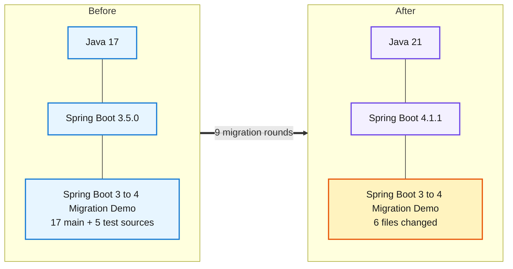
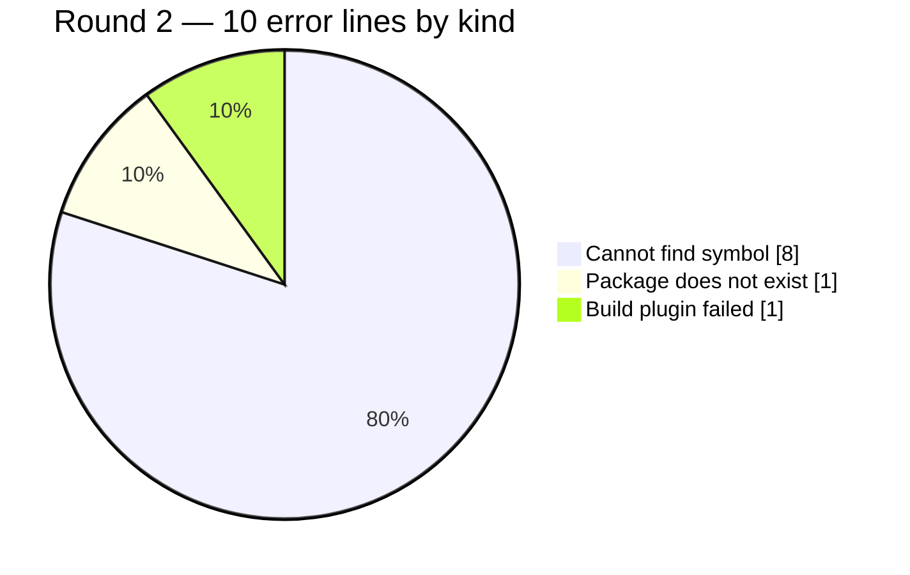

# Migration Report — Spring Boot 3.5.0 to 4.1.1 on Java 21 (open-source-only ladder, re-run with the V2/V2b fixes)

## Spring Boot 3 to 4 Migration Demo

     

> A clean re-run of the golden 3.5.0 -> 4.1.1 migration after the fixes found in V2 and V2b. The three ladder edges (3.5.16, 4.0.8, 4.1.1) ran only Apache-2.0 OpenRewrite recipes. Compared with V2, the parent pin no longer touches the pinned Testcontainers versions, the open-source composite now adds the two Boot 4 test-slice starters itself, the repair round after E2 was tagged with its edge automatically, and the E3 edge moved the composite's explicitly versioned starters along with the platform. The only hand edits left are the ones no recipe can make: the Jackson 3 mapper configuration, the spring-boot-h2console module, and the Dockerfile base image. Endpoint discovery now includes framework endpoints that configuration enables. As a result, the /h2-console loss after the Boot 4 move was caught by a drafted probe, with no hand-written probe for it, and was restored. The final build runs the same 19 tests with the same 2 pre-existing failures, and all 9 probes return the same status as before.

> **Migration status: PASS** — green on the requested target, no new test failures, behaviour compared with no status changes

_Generated by the Version Migration skill on 2026-10-01. Every version, error count and response below is read from a recorded run, not from memory._

## At a glance

| | |
|---|---|
| **Result** | 🟠 **Tests failed** on the final build |
| **Platform** | Spring Boot `3.5.0` → `4.1.1` |
| **Language** | Java `17` → `21` |
| **Build rounds** | 10 recorded — 1 pre-migration baseline, 6 that failed and were read for what to change next, 3 green |
| **Files changed** | 6 — `Dockerfile`, `pom.xml`, `src/main/java/com/example/migrationdemo/config/JacksonConfig.java`, `src/main/java/com/example/migrationdemo/health/DatabaseHealthIndicator.java`, `src/test/java/com/example/migrationdemo/controller/EmployeeControllerTest.java`, `src/test/java/com/example/migrationdemo/integration/EmployeeRepositoryIntegrationTest.java` |
| **Dependency changes** | 7 |
| **Source changes forced by the upgrade** | 8 |
| **Test suite** | before: 19 run, 2 failed, 0 errors → after: 19 run, 2 failed, 0 errors — 🟡 the same 2 pre-existing failures — none introduced |
| **Runtime behaviour** | 🟡 same status on all 9, body differs on 7 |
| **Migration plan** | recorded before any change — 3 predicted impacts, 3 deterministic candidates |
| **Deterministic transformations** | 🟢 3 applied · 🔍 3 previewed — OpenRewrite |
| **Requested target** | `4.1.1` — final build declares `4.1.1` 🟢 matches |
| **Reference followed** | `references/spring-boot-3-to-4.md` |
| **Build tool** | maven — Apache Maven 3.9.9 (8e8579a9e76f7d015ee5ec7bfcdc97d260186937) |

## 0. What was understood before anything changed

> Everything in this section was written **before** any version or source changed — it is a prediction, and it is shown next to what the build, the tests and the probes then actually did. A predicted impact is never evidence that something failed.

### 0.1 Target and path

| | |
|---|---|
| **Source** | Spring Boot `3.5.0` · Java `17` |
| **Requested target** | Spring Boot `4.1.1` · Java `21` — _as requested; never "latest", never a recipe's own target_ |
| **Path** | `3.5.0` → `4.1.1` (single hop — the source is on the 3.5.x preparation line) |

### 0.2 Constraints and compatibility questions

| | Constraint | Status in the plan | At the end | Evidence |
|---|---|---|---|---|
| 🟢 | **C1** A JDK 21 is available | satisfied | — | baseline.json toolchain |
| ❓ | **C2** Spring Boot 4.1.1 resolves from the configured repositories _(blocking)_ | unresolved | resolved | Rounds 1, 2/3 and 4 resolved and built against parents 3.5.16, 4.0.8 and 4.1.1 from Maven Central; round 9 packaged on 4.1.1. |
| ❓ | **C3** Testcontainers 1.20.1 (pinned) still works with the Boot 4 test stack | unresolved | resolved | Round 9 (package, JDK 21): EmployeeRepositoryIntegrationTest ran on Testcontainers 1.20.1 against postgres:16 under Boot 4.1.1. |

### 0.3 Predicted impact vs what actually happened

_The build, transformation and patch columns are facts about the **file**; several impact entries can share one file (a build descriptor, say). Whether this particular impact was real is the agent review's column._

| Impact | File | Area · rule | Risk | Predicted handling | File named by a failing build | File changed by a transformation | File in final patch | Agent review |
|---|---|---|---|---|---|---|---|---|
| **I1** | `pom.xml` | Platform parent · section 1.1 | low | deterministic | never named by a build | rewrite-01, rewrite-03, rewrite-05 | ✏️ yes | handled-by-transformation — Parent pins by the edge recipes rewrite-01/03/05. |
| **I4** | `src/main/java/com/example/migrationdemo/config/JacksonConfig.java` | JSON handling · section 2 | high | either | rounds 2 | rewrite-03 | ✏️ yes | handled-by-transformation — Composite rename and moves (rewrite-03); Jackson configuration API repaired by hand. |
| **I9** | `Dockerfile` | Runtime image · section 8 | medium | residual | never named by a build | — | ✏️ yes | handled-by-transformation — Test annotations moved and the test-slice starters added by the composite; test-compile green in round 3 with no… |

**Changed but not predicted:** `src/main/java/com/example/migrationdemo/health/DatabaseHealthIndicator.java`, `src/test/java/com/example/migrationdemo/controller/EmployeeControllerTest.java`, `src/test/java/com/example/migrationdemo/integration/EmployeeRepositoryIntegrationTest.java` — each is explained in §4/§5 or flagged there.

### 0.4 Which probes protect which impact

| Probe | Category | Protects | Replayed |
|---|---|---|---|
| GET /api/v1/employees | business-api | I1 | 🟢 before and after |
| high earners | serialization | I1 | 🟢 before and after |
| GET /h2-console | other | I1 | 🟢 before and after |
| unauthenticated is 401 | security-boundary | I1 | 🟢 before and after |

### 0.5 Out of scope, and when to stop

**Out of scope:**

- Testcontainers 2 migration
- Fixing pre-existing test failures

**Stop conditions:**

- Spring Boot 4.1.1 cannot be resolved
- A business or security probe changes status


## 0.6 Migration path and endpoint preservation

### Migration path (edges)

Ladder `references/openrewrite/spring-boot-ladder.json` · licence policy **open-source-only** · granularity boundary · versions from maven-metadata https://repo1.maven.org/maven2/org/springframework/boot/spring-boot-starter-parent/maven-metadata.xml

| Edge | From → To | Class | Recipe | Licence | JDK | Cloud train | Previews | Applies | Rounds | Complete |
|---|---|---|---|---|---|---|---|---|---|---|
| E1 | 3.5.0 → 3.5.16 | PATCH | pin-only | Apache-2.0 | 17 | — | rewrite-00 previewed (1 files) | rewrite-01 applied (1 files) | R1 compile passed | yes (R1) |
| E2 | 3.5.16 → 4.0.8 | MAJOR_BOUNDARY | oss-composite: openrewrite/spring-boot-3-to-4.oss.yml | Apache-2.0 | 17 | — | rewrite-02 previewed (5 files) | rewrite-03 applied (5 files) | R2 compile compile-failed; R3 test-compile passed | yes (R3) |
| E3 | 4.0.8 → 4.1.1 | MINOR (landing) | pin-only | Apache-2.0 | 21 | — | rewrite-04 previewed (1 files) | rewrite-05 applied (1 files) | R4 compile passed | yes (R4) |

Edge notes:

- E1: patch edge within 3.5: pins the platform only — a patch release carries no framework migration
- E3: no open-source-only upstream recipe for 4.1: the edge pins the platform and Java level; compiler-driven repair handles the rest

### Endpoint preservation

| Inventory | Before | After | Preserved | Missing | Added |
|---|---|---|---|---|---|
| Source mappings (static scan) | 11 | 11 | 11 | 0 | 0 |
| Running application (actuator /mappings) | — | — | — | — | — |

- /actuator/mappings not exposed or not probed — static inventory only

No endpoint observed before the migration is missing after it, in any inventory that was available.

## 1. What moved



| | What | Before | After | Why it moved |
|---|---|---|---|---|
| ⬆️ | `Java (language level)` | `17` | `21` | Runtime baseline required by the new platform version. |
| ⬆️ | `Spring Boot (platform)` | `3.5.0` | `4.1.1` | The version jump this migration is about. |
| ⬆️ | `org.springframework.boot:spring-boot-starter-parent` | `3.5.0` | `4.1.1` | Pinned per edge by the generated edge recipes (E1 3.5.16, E2 4.0.8, E3 4.1.1) with a plain XML edit of /project/parent/version. |
| ⬆️ | `java.version` | `17` | `21` | Requested target; set by the E3 edge recipe. |
| 🔀 | `org.springframework.boot:spring-boot-starter-web` | `spring-boot-starter-web` | `org.springframework.boot:spring-boot-starter-webmvc` | Boot 4 servlet starter name; open-source composite (pack 1.3). |
| 🔀 | `org.springframework.security:spring-security-test` | `spring-security-test` | `org.springframework.boot:spring-boot-starter-security-test` | Boot 4 security test starter; open-source composite (pack 4.4). |
| ➕ | `org.springframework.boot:spring-boot-starter-webmvc-test` | `absent` | `managed (written 4.0.8 by E2, version tag removed by E3)` | @WebMvcTest moved to this module (pack 4.3); added by the composite's AddDependency (rewrite-03). |
| ➕ | `org.springframework.boot:spring-boot-starter-data-jpa-test` | `absent` | `managed (written 4.0.8 by E2, version tag removed by E3)` | @DataJpaTest moved to this module (pack 4.3); added by the composite's AddDependency (rewrite-03). |
| ➕ | `org.springframework.boot:spring-boot-h2console` | `absent` | `managed 4.1.1 (runtime)` | Boot 4 moved the H2 console auto-configuration into this module (pack 7.1); the drafted /h2-console probe returned 404 without it. |

## 2. How the migration went

**10 build rounds**, 2.3 min of build time in total. Round 0 is the pre-migration reference build on JDK 17; every later round ran on JDK 21. 7 of them came back with errors, 3 came back clean. A red round is not a setback here — it is the output the migration is driven by: each one names the exact files or tests the next change has to touch. Apart from the 3 deterministic transformations in §2.4 — each previewed, inspected and then applied to the sandbox, and each built immediately — nothing was edited that a build, a test or a probe had not first complained about. The migration ends on round 9, 🟠 **Tests failed**.

```mermaid
flowchart TD
  classDef broken fill:#ffe3e3,stroke:#c92a2a,stroke-width:2px,color:#1a1a1a
  classDef degraded fill:#fff3bf,stroke:#e8590c,stroke-width:2px,color:#1a1a1a
  classDef ok fill:#e6fcf5,stroke:#2f9e44,stroke-width:2px,color:#1a1a1a
  classDef before fill:#e7f5ff,stroke:#1c7ed6,stroke-width:2px,color:#1a1a1a
  classDef after fill:#f3f0ff,stroke:#7048e8,stroke-width:2px,color:#1a1a1a
  classDef neutral fill:#f1f3f5,stroke:#868e96,stroke-width:1px,color:#1a1a1a
  subgraph P0["Phase 0 · Reference build, before anything changed · JDK 17 · round 0"]
    direction TB
    R0["🟠 Round 0 · baseline — Tests failed<br/>maven test · JDK 17 · 18.9s<br/>7 error lines<br/>tests: 19 run · 2 failed · 0 errored<br/>EmployeeControllerTest.testActuatorHealth_Public · EmployeeControllerTest.testActuatorInfo_Public"]:::degraded
  end
  subgraph P1["Phase 1 · Prove main sources compile · JDK 17 · rounds 1-2"]
    direction TB
    R1["🟢 Round 1 — Passed<br/>maven compile · JDK 17 · 4.5s<br/>no errors"]:::ok
    R2["🔴 Round 2 — Compile failed<br/>maven compile · JDK 17 · 4.7s<br/>10 error lines · 5 distinct problems<br/>Cannot find symbol ×4 · Package does not exist ×1<br/>JacksonConfig.java ×5"]:::broken
  end
  subgraph P2["Phase 2 · Prove main + test sources compile · JDK 17 · round 3"]
    direction TB
    R3["🟢 Round 3 — Passed<br/>maven test-compile · JDK 17 · 5.4s<br/>no errors"]:::ok
  end
  subgraph P3["Phase 3 · Prove main sources compile · JDK 21 · round 4"]
    direction TB
    R4["🟢 Round 4 — Passed<br/>maven compile · JDK 21 · 5.0s<br/>no errors"]:::ok
  end
  subgraph P4["Phase 4 · Prove the test suite runs · JDK 21 · rounds 5-8"]
    direction TB
    R5["🟠 Round 5 — Tests failed<br/>maven test · JDK 21 · 23.5s<br/>7 error lines<br/>tests: 19 run · 2 failed · 0 errored<br/>EmployeeControllerTest.testActuatorHealth_Public · EmployeeControllerTest.testActuatorInfo_Public"]:::degraded
    R6["🟠 Round 6 — Tests failed<br/>maven test · JDK 21 · 18.8s<br/>7 error lines<br/>tests: 19 run · 2 failed · 0 errored<br/>EmployeeControllerTest.testActuatorHealth_Public · EmployeeControllerTest.testActuatorInfo_Public"]:::degraded
    R7["🟠 Round 7 — Tests failed<br/>maven test · JDK 21 · 18.4s<br/>7 error lines<br/>tests: 19 run · 2 failed · 0 errored<br/>EmployeeControllerTest.testActuatorHealth_Public · EmployeeControllerTest.testActuatorInfo_Public"]:::degraded
    R8["🟠 Round 8 — Tests failed<br/>maven test · JDK 21 · 18.1s<br/>7 error lines<br/>tests: 19 run · 2 failed · 0 errored<br/>EmployeeControllerTest.testActuatorHealth_Public · EmployeeControllerTest.testActuatorInfo_Public"]:::degraded
  end
  subgraph P5["Phase 5 · Prove the test suite runs and the jar builds · JDK 21 · round 9"]
    direction TB
    R9["🟠 Round 9 — Tests failed<br/>maven package · JDK 21 · 17.9s<br/>7 error lines<br/>tests: 19 run · 2 failed · 0 errored<br/>EmployeeControllerTest.testActuatorHealth_Public · EmployeeControllerTest.testActuatorInfo_Public"]:::degraded
  end
  R0 -->|"Applied rewrite-01 previewed as rewrite-00."| R1
  R1 -->|"Applied rewrite-03 previewed as rewrite-02:…"| R2
  R2 -->|"JacksonConfig rebuilt with JsonMapper.builder."| R3
  R3 -->|"Applied rewrite-05 previewed as rewrite-04."| R4
  R4 -->|"same code, next gate: maven test"| R5
  R5 -->|"Added runtime spring-boot-h2console."| R6
  R6 -->|"Dockerfile eclipse-temurin:21-jre line endings…"| R7
  R7 -->|"Dockerfile re-edited preserving CRLF."| R8
  R8 -->|"same code, next gate: maven package"| R9
  style P0 fill:#f8f9fa,stroke:#ced4da,stroke-width:1px,color:#495057
  style P1 fill:#f8f9fa,stroke:#ced4da,stroke-width:1px,color:#495057
  style P2 fill:#f8f9fa,stroke:#ced4da,stroke-width:1px,color:#495057
  style P3 fill:#f8f9fa,stroke:#ced4da,stroke-width:1px,color:#495057
  style P4 fill:#f8f9fa,stroke:#ced4da,stroke-width:1px,color:#495057
  style P5 fill:#f8f9fa,stroke:#ced4da,stroke-width:1px,color:#495057
```



### 2.1 The round ledger

| Round | Ran on | Goal | Outcome | Errors | Took | What it told us |
|---|---|---|---|---|---|---|
| **0**<br/>_(baseline)_ | JDK 17 | `test`<br/>_the test suite runs_ | 🟠 Tests failed | 7 | 18.9s | **2 tests failed an assertion**<br/>failing tests: `EmployeeControllerTest.testActuatorHealth_Public` · `EmployeeControllerTest.testActuatorInfo_Public`<br/>Pre-migration reference build on JDK 17, test goal: 19 tests, 2 failures. testActuatorHealth_Public and testActuatorInfo_Public expect 200 inside a @WebMvcTest slice, which loads no actuator endpoints, so they get 404. |
| **1** | JDK 17 | `compile`<br/>_main sources compile_ | 🟢 Passed | — | 4.5s | **Nothing failed** — main sources compile on JDK 17.<br/>Edge E1 (3.5.0 -&gt; 3.5.16, pin-only) compiles. The preview changed only the parent version, so the Testcontainers pins survive (V2 defect A fixed). |
| **2** | JDK 17 | `compile`<br/>_main sources compile_ | 🔴 Compile failed | 10<br/>_5 distinct_ | 4.7s | **Cannot find symbol ×4 · Package does not exist ×1**<br/>in `JacksonConfig.java` (5 problems)<br/>Edge E2 (3.5.16 -&gt; 4.0.8, open-source composite). Only JacksonConfig fails, on the Jackson 2 mutable mapper API and the jsr310 module. |
| **3** | JDK 17 | `test-compile`<br/>_main + test sources compile_ | 🟢 Passed | — | 5.4s | **Nothing failed** — main + test sources compile on JDK 17.<br/>test-compile is green after the Jackson 3 mapper repair, with no hand-added test starters. The round was tagged E2 automatically from the declared platform, so the edge completed and E3 was offered (V2b defect fixed). |
| **4** | JDK 21 | `compile`<br/>_main sources compile_ | 🟢 Passed | — | 5.0s | **Nothing failed** — main sources compile on JDK 21.<br/>Edge E3 (4.0.8 -&gt; 4.1.1, pin-only) compiles on JDK 21. The edge recipe's UpgradeDependencyVersion found that the two composite-added test starters were pinned at the managed version and removed the tags, so they follow the 4.1.1 parent (V2b version-skew defect fixed). |
| **5** | JDK 21 | `test`<br/>_the test suite runs_ | 🟠 Tests failed | 7 | 23.5s | **2 tests failed an assertion**<br/>failing tests: `EmployeeControllerTest.testActuatorHealth_Public` · `EmployeeControllerTest.testActuatorInfo_Public`<br/>Landing test suite on JDK 21: 19 tests, the same 2 pre-existing failures. The first final probe then showed GET /h2-console 404 (baseline 200). |
| **6** | JDK 21 | `test`<br/>_the test suite runs_ | 🟠 Tests failed | 7 | 18.8s | **2 tests failed an assertion**<br/>failing tests: `EmployeeControllerTest.testActuatorHealth_Public` · `EmployeeControllerTest.testActuatorInfo_Public`<br/>After adding spring-boot-h2console the suite is unchanged (19/2 pre-existing), and the second final probe shows /h2-console 200. |
| **7** | JDK 21 | `test`<br/>_the test suite runs_ | 🟠 Tests failed | 7 | 18.4s | **2 tests failed an assertion**<br/>failing tests: `EmployeeControllerTest.testActuatorHealth_Public` · `EmployeeControllerTest.testActuatorInfo_Public`<br/>Dockerfile base image moved to Java 21. The edit tool rewrote the file's line endings, so the change was redone in round 8. |
| **8** | JDK 21 | `test`<br/>_the test suite runs_ | 🟠 Tests failed | 7 | 18.1s | **2 tests failed an assertion**<br/>failing tests: `EmployeeControllerTest.testActuatorHealth_Public` · `EmployeeControllerTest.testActuatorInfo_Public`<br/>Final source state: a one-line Dockerfile diff with CRLF preserved; 19 tests, the same 2 pre-existing failures. |
| **9** | JDK 21 | `package`<br/>_the test suite runs and the jar builds_ | 🟠 Tests failed | 7 | 17.9s | **2 tests failed an assertion**<br/>failing tests: `EmployeeControllerTest.testActuatorHealth_Public` · `EmployeeControllerTest.testActuatorInfo_Public`<br/>Final package on JDK 21: the same 19 tests and 2 pre-existing failures, with no source change since round 8. |

### 2.2 Exactly what failed, and why

One block per round that did not come back green: the files or the tests the build named, the message it printed against each one, and what that meant. Paths are as the compiler reported them, relative to the project root, and the line numbers are the lines it pointed at. Everything in the tables is read out of the recorded build; only the **Why it failed** paragraph is the agent's reading of it.

#### Round 0 — 🟠 Tests failed _(pre-migration reference, not migration damage)_

`maven test` on JDK 17 · 7 error lines · 19 tests run · 2 failed · 0 errored

**Which tests failed**

| Test | Source file | Why it failed | What kind of problem | Was it already failing? |
|---|---|---|---|---|
| `EmployeeControllerTest.testActuatorHealth_Public` | `src/test/java/com/example/migrationdemo/controller/EmployeeControllerTest.java`<br/>line 145 | Status expected:&lt;200&gt; but was:&lt;404&gt; | Test failure — The code compiled but behaviour or test wiring changed. | _this is the baseline_ |
| `EmployeeControllerTest.testActuatorInfo_Public` | `src/test/java/com/example/migrationdemo/controller/EmployeeControllerTest.java`<br/>line 151 | Status expected:&lt;200&gt; but was:&lt;404&gt; | Test failure — The code compiled but behaviour or test wiring changed. | _this is the baseline_ |

**Why it failed**

Pre-migration reference build on JDK 17, test goal: 19 tests, 2 failures. testActuatorHealth_Public and testActuatorInfo_Public expect 200 inside a @WebMvcTest slice, which loads no actuator endpoints, so they get 404. Pre-existing.

**What was changed in response** — then re-run as round 1

- Applied rewrite-01 (previewed as rewrite-00).

Reference rule(s) applied: `section 1.1`

_Every error line, the exact command and the full build log for this round are in **section 3, Round 0**._

#### Round 2 — 🔴 Compile failed

`maven compile` on JDK 17 · 10 error lines · 5 distinct problems across 1 file

**Which files failed**

| File | Problems | At line(s) | What the build said about it | Why this kind of error happens |
|---|---|---|---|---|
| `src/main/java/com/example/migrationdemo/config/JacksonConfig.java` | 5 | 5, 26, 29, 32, 36 | package com.fasterxml.jackson.datatype.jsr310 does not exist<br/>cannot find symbol — class JavaTimeModule<br/>cannot find symbol — variable WRITE_DATES_AS_TIMESTAMPS<br/>cannot find symbol — method setDefaultPropertyInclusion(com.fasterxml.jackson.annotation.JsonInclude.Include)<br/>_…and 1 more_ | A class, method or field was renamed or removed. Look for a replacement API in the reference pack. |

**Why it failed**

Edge E2 (3.5.16 -&gt; 4.0.8, open-source composite). Only JacksonConfig fails, on the Jackson 2 mutable mapper API and the jsr310 module.

**What was changed in response** — then re-run as round 3

- JacksonConfig rebuilt with JsonMapper.builder().

Reference rule(s) applied: `section 2.1` · `section 2.2`

_Every error line, the exact command and the full build log for this round are in **section 3, Round 2**._

#### Round 5 — 🟠 Tests failed

`maven test` on JDK 21 · 7 error lines · 19 tests run · 2 failed · 0 errored

**Which tests failed**

| Test | Source file | Why it failed | What kind of problem | Was it already failing? |
|---|---|---|---|---|
| `EmployeeControllerTest.testActuatorHealth_Public` | `src/test/java/com/example/migrationdemo/controller/EmployeeControllerTest.java`<br/>line 145 | Status expected:&lt;200&gt; but was:&lt;404&gt; | Test failure — The code compiled but behaviour or test wiring changed. | ⚪ yes — already failing in the reference build |
| `EmployeeControllerTest.testActuatorInfo_Public` | `src/test/java/com/example/migrationdemo/controller/EmployeeControllerTest.java`<br/>line 151 | Status expected:&lt;200&gt; but was:&lt;404&gt; | Test failure — The code compiled but behaviour or test wiring changed. | ⚪ yes — already failing in the reference build |

**Why it failed**

Landing test suite on JDK 21: 19 tests, the same 2 pre-existing failures. The first final probe then showed GET /h2-console 404 (baseline 200).

**What was changed in response** — then re-run as round 6

- Added runtime spring-boot-h2console.

Reference rule(s) applied: `section 7.1`

_Every error line, the exact command and the full build log for this round are in **section 3, Round 5**._

#### Round 6 — 🟠 Tests failed

`maven test` on JDK 21 · 7 error lines · 19 tests run · 2 failed · 0 errored

**Which tests failed**

| Test | Source file | Why it failed | What kind of problem | Was it already failing? |
|---|---|---|---|---|
| `EmployeeControllerTest.testActuatorHealth_Public` | `src/test/java/com/example/migrationdemo/controller/EmployeeControllerTest.java`<br/>line 145 | Status expected:&lt;200&gt; but was:&lt;404&gt; | Test failure — The code compiled but behaviour or test wiring changed. | ⚪ yes — already failing in the reference build |
| `EmployeeControllerTest.testActuatorInfo_Public` | `src/test/java/com/example/migrationdemo/controller/EmployeeControllerTest.java`<br/>line 151 | Status expected:&lt;200&gt; but was:&lt;404&gt; | Test failure — The code compiled but behaviour or test wiring changed. | ⚪ yes — already failing in the reference build |

**Why it failed**

After adding spring-boot-h2console the suite is unchanged (19/2 pre-existing), and the second final probe shows /h2-console 200.

**What was changed in response** — then re-run as round 7

- Dockerfile eclipse-temurin:21-jre (line endings damaged).

Reference rule(s) applied: `section 8`

_Every error line, the exact command and the full build log for this round are in **section 3, Round 6**._

#### Round 7 — 🟠 Tests failed

`maven test` on JDK 21 · 7 error lines · 19 tests run · 2 failed · 0 errored

**Which tests failed**

| Test | Source file | Why it failed | What kind of problem | Was it already failing? |
|---|---|---|---|---|
| `EmployeeControllerTest.testActuatorHealth_Public` | `src/test/java/com/example/migrationdemo/controller/EmployeeControllerTest.java`<br/>line 145 | Status expected:&lt;200&gt; but was:&lt;404&gt; | Test failure — The code compiled but behaviour or test wiring changed. | ⚪ yes — already failing in the reference build |
| `EmployeeControllerTest.testActuatorInfo_Public` | `src/test/java/com/example/migrationdemo/controller/EmployeeControllerTest.java`<br/>line 151 | Status expected:&lt;200&gt; but was:&lt;404&gt; | Test failure — The code compiled but behaviour or test wiring changed. | ⚪ yes — already failing in the reference build |

**Why it failed**

Dockerfile base image moved to Java 21. The edit tool rewrote the file's line endings, so the change was redone in round 8.

**What was changed in response** — then re-run as round 8

- Dockerfile re-edited preserving CRLF.

Reference rule(s) applied: `section 8`

_Every error line, the exact command and the full build log for this round are in **section 3, Round 7**._

#### Round 8 — 🟠 Tests failed

`maven test` on JDK 21 · 7 error lines · 19 tests run · 2 failed · 0 errored

**Which tests failed**

| Test | Source file | Why it failed | What kind of problem | Was it already failing? |
|---|---|---|---|---|
| `EmployeeControllerTest.testActuatorHealth_Public` | `src/test/java/com/example/migrationdemo/controller/EmployeeControllerTest.java`<br/>line 145 | Status expected:&lt;200&gt; but was:&lt;404&gt; | Test failure — The code compiled but behaviour or test wiring changed. | ⚪ yes — already failing in the reference build |
| `EmployeeControllerTest.testActuatorInfo_Public` | `src/test/java/com/example/migrationdemo/controller/EmployeeControllerTest.java`<br/>line 151 | Status expected:&lt;200&gt; but was:&lt;404&gt; | Test failure — The code compiled but behaviour or test wiring changed. | ⚪ yes — already failing in the reference build |

**Why it failed**

Final source state: a one-line Dockerfile diff with CRLF preserved; 19 tests, the same 2 pre-existing failures.

**No source change was needed** — round 9 re-ran `maven package` on the same code.

_Every error line, the exact command and the full build log for this round are in **section 3, Round 8**._

#### Round 9 — 🟠 Tests failed

`maven package` on JDK 21 · 7 error lines · 19 tests run · 2 failed · 0 errored

**Which tests failed**

| Test | Source file | Why it failed | What kind of problem | Was it already failing? |
|---|---|---|---|---|
| `EmployeeControllerTest.testActuatorHealth_Public` | `src/test/java/com/example/migrationdemo/controller/EmployeeControllerTest.java`<br/>line 145 | Status expected:&lt;200&gt; but was:&lt;404&gt; | Test failure — The code compiled but behaviour or test wiring changed. | ⚪ yes — already failing in the reference build |
| `EmployeeControllerTest.testActuatorInfo_Public` | `src/test/java/com/example/migrationdemo/controller/EmployeeControllerTest.java`<br/>line 151 | Status expected:&lt;200&gt; but was:&lt;404&gt; | Test failure — The code compiled but behaviour or test wiring changed. | ⚪ yes — already failing in the reference build |

**Why it failed**

Final package on JDK 21: the same 19 tests and 2 pre-existing failures, with no source change since round 8.

⚠️ **This was the last round recorded, and it was not green.** Nothing was changed after it.

_Every error line, the exact command and the full build log for this round are in **section 3, Round 9**._


### 2.3 The mix of breakage in the worst round

Round 2 carried more error lines than any other — 10 of them, in these proportions:



### 2.4 Deterministic transformations

OpenRewrite ran **inside the sandbox only**, as a provider 04D invoked — never as the orchestrator and never as proof. A dry-run is a preview that changes nothing; an apply is only accepted when every file it changed was in the inspected preview, and is built immediately. A transformation that was unavailable, failed or was reverted is listed here as exactly that.

| Record | Mode | Outcome | Recipes | Artifact · plugin | Licence | Files | Built in | Agent decision |
|---|---|---|---|---|---|---|---|---|
| `rewrite-00` | dry-run | 🔍 previewed (dry-run, nothing changed) | `mars.migration.edge.E1` | —<br/>plugin `6.46.1` | Apache-2.0 | 1 proposed | — | **superseded** — E1 preview: parent 3.5.0 -&gt; 3.5.16 only. Accepted. |
| `rewrite-01` | apply | 🟢 applied to the sandbox | `mars.migration.edge.E1` | —<br/>plugin `6.46.1` | Apache-2.0 | 1 changed | round 1 | **accepted** — Applied what rewrite-00 previewed. |
| `rewrite-02` | dry-run | 🔍 previewed (dry-run, nothing changed) | `mars.migration.edge.E2` | —<br/>plugin `6.46.1` | Apache-2.0 | 5 proposed | — | **superseded** — E2 preview: everything within the plan's scope. The two '~~(No version provided ...)~~' lines are OpenRewrite preview markers, and the… |
| `rewrite-03` | apply | 🟢 applied to the sandbox | `mars.migration.edge.E2` | —<br/>plugin `6.46.1` | Apache-2.0 | 5 changed | round 2 | **accepted** — Applied what rewrite-02 previewed. |
| `rewrite-04` | dry-run | 🔍 previewed (dry-run, nothing changed) | `mars.migration.edge.E3` | —<br/>plugin `6.46.1` | Apache-2.0 | 1 proposed | — | **superseded** — E3 preview: parent 4.1.1, java.version 21, and the redundant 4.0.8 version tags removed from the two test-slice starters. Accepted. |
| `rewrite-05` | apply | 🟢 applied to the sandbox | `mars.migration.edge.E3` | —<br/>plugin `6.46.1` | Apache-2.0 | 1 changed | round 4 | **accepted** — Applied what rewrite-04 previewed. |

<details><summary>rewrite-00 — dry-run, previewed</summary>

- command (sanitised): `E:/mv/tools/apache-maven-3.9.9/bin/mvn.cmd -B org.openrewrite.maven:rewrite-maven-plugin:6.46.1:dryRunNoFork -Drewrite.activeRecipes=mars.migration.edge.E1 -Drewrite.configLocation=<session>\transformations\rewrite-00.rewrite.yml`
- patch: `../evidence/v3/v2c/ctx/version-migration/v2c/transformations/rewrite-00.patch`
- log: `../evidence/v3/v2c/ctx/version-migration/v2c/transformations/rewrite-00.log`

</details>

<details><summary>rewrite-01 — apply, applied</summary>

- target reconciliation: recipe target `3.5.16`, declared after apply `3.5.16`, requested `3.5.16` → **matches-request**
- command (sanitised): `E:/mv/tools/apache-maven-3.9.9/bin/mvn.cmd -B org.openrewrite.maven:rewrite-maven-plugin:6.46.1:runNoFork -Drewrite.activeRecipes=mars.migration.edge.E1 -Drewrite.configLocation=<session>\transformations\rewrite-01.rewrite.yml`
- patch: `../evidence/v3/v2c/ctx/version-migration/v2c/transformations/rewrite-01.patch`
- log: `../evidence/v3/v2c/ctx/version-migration/v2c/transformations/rewrite-01.log`

</details>

<details><summary>rewrite-02 — dry-run, previewed</summary>

- command (sanitised): `E:/mv/tools/apache-maven-3.9.9/bin/mvn.cmd -B org.openrewrite.maven:rewrite-maven-plugin:6.46.1:dryRunNoFork -Drewrite.activeRecipes=mars.migration.edge.E2 -Drewrite.configLocation=<session>\transformations\rewrite-02.rewrite.yml`
- patch: `../evidence/v3/v2c/ctx/version-migration/v2c/transformations/rewrite-02.patch`
- log: `../evidence/v3/v2c/ctx/version-migration/v2c/transformations/rewrite-02.log`

</details>

<details><summary>rewrite-03 — apply, applied</summary>

- target reconciliation: recipe target `4.0.8`, declared after apply `4.0.8`, requested `4.0.8` → **matches-request**
- command (sanitised): `E:/mv/tools/apache-maven-3.9.9/bin/mvn.cmd -B org.openrewrite.maven:rewrite-maven-plugin:6.46.1:runNoFork -Drewrite.activeRecipes=mars.migration.edge.E2 -Drewrite.configLocation=<session>\transformations\rewrite-03.rewrite.yml`
- patch: `../evidence/v3/v2c/ctx/version-migration/v2c/transformations/rewrite-03.patch`
- log: `../evidence/v3/v2c/ctx/version-migration/v2c/transformations/rewrite-03.log`

</details>

<details><summary>rewrite-04 — dry-run, previewed</summary>

- command (sanitised): `E:/mv/tools/apache-maven-3.9.9/bin/mvn.cmd -B org.openrewrite.maven:rewrite-maven-plugin:6.46.1:dryRunNoFork -Drewrite.activeRecipes=mars.migration.edge.E3 -Drewrite.configLocation=<session>\transformations\rewrite-04.rewrite.yml`
- patch: `../evidence/v3/v2c/ctx/version-migration/v2c/transformations/rewrite-04.patch`
- log: `../evidence/v3/v2c/ctx/version-migration/v2c/transformations/rewrite-04.log`

</details>

<details><summary>rewrite-05 — apply, applied</summary>

- target reconciliation: recipe target `4.1.1`, declared after apply `4.1.1`, requested `4.1.1` → **matches-request**
- command (sanitised): `E:/mv/tools/apache-maven-3.9.9/bin/mvn.cmd -B org.openrewrite.maven:rewrite-maven-plugin:6.46.1:runNoFork -Drewrite.activeRecipes=mars.migration.edge.E3 -Drewrite.configLocation=<session>\transformations\rewrite-05.rewrite.yml`
- patch: `../evidence/v3/v2c/ctx/version-migration/v2c/transformations/rewrite-05.patch`
- log: `../evidence/v3/v2c/ctx/version-migration/v2c/transformations/rewrite-05.log`

</details>


### 2.5 How each change was made

| File | How it was changed | Evidence that required it | Rule |
|---|---|---|---|
| `pom.xml` | OpenRewrite (deterministic) (`rewrite-01, rewrite-03, rewrite-05`) | — | section 1.1, 1.2, 1.3, 4.3, 4.4 |
| `src/main/java/com/example/migrationdemo/config/JacksonConfig.java` | residual repair, evidence-driven | Round 2 groups G2/G4/G5/G6/G7: JavaTimeModule, disable, setDefaultPropertyInclusion, jsr310 package, WRITE_DATES_AS_TIMESTAMPS. | section 2.1, 2.2 |
| `src/main/java/com/example/migrationdemo/config/JacksonConfig.java` | OpenRewrite (deterministic) (`rewrite-03`) | — | section 2.1 |
| `src/main/java/com/example/migrationdemo/health/DatabaseHealthIndicator.java` | OpenRewrite (deterministic) (`rewrite-03`) | — | section 3 |
| `src/test/java/com/example/migrationdemo/controller/EmployeeControllerTest.java` | OpenRewrite (deterministic) (`rewrite-03`) | — | section 4.1, 4.3, 2.3 |
| `src/test/java/com/example/migrationdemo/integration/EmployeeRepositoryIntegrationTest.java` | OpenRewrite (deterministic) (`rewrite-03`) | — | section 4.3 |
| `pom.xml` | reference-pack rule, by hand | First final probe: GET /h2-console 404 (baseline 200). After the edit (round 6), the second final probe returned 200. | section 7.1 |
| `Dockerfile` | residual repair, evidence-driven | No recipe in the ladder changes a Dockerfile. The first attempt (round 7) rewrote the file's CRLF line endings; it was redone preserving them, and round 8 is the final state. | section 8 |

## 3. Round by round

### Round 0 — 🟠 Tests failed _(pre-migration reference)_

> **Nothing had been changed yet.** This is the reference every later round is read against.

| | |
|---|---|
| **Command** | `E:/mv/tools/apache-maven-3.9.9/bin/mvn.cmd -B clean test` |
| **JDK** | 17 (17.0.20.1) |
| **Declared in the build** | Java `17` · `spring-boot-starter-parent 3.5.0` |
| **Exit code** | 1 |
| **Duration** | 18.9s |
| **Workspace at this point** | no changes yet |

**What the result meant**

Pre-migration reference build on JDK 17, test goal: 19 tests, 2 failures. testActuatorHealth_Public and testActuatorInfo_Public expect 200 inside a @WebMvcTest slice, which loads no actuator endpoints, so they get 404. Pre-existing.

**Errors by kind**

| Count | Kind | What this kind of error means |
|---|---|---|
| 6 | Test failure | The code compiled but behaviour or test wiring changed. |
| 1 | Build plugin failed | A build plugin is too old for the new platform, or its configuration changed. |

**Which tests failed**

| Test | Source file | Line | Why it failed |
|---|---|---|---|
| `EmployeeControllerTest.testActuatorHealth_Public` | `src/test/java/com/example/migrationdemo/controller/EmployeeControllerTest.java` | 145 | Status expected:&lt;200&gt; but was:&lt;404&gt; |
| `EmployeeControllerTest.testActuatorInfo_Public` | `src/test/java/com/example/migrationdemo/controller/EmployeeControllerTest.java` | 151 | Status expected:&lt;200&gt; but was:&lt;404&gt; |

**Distinct messages**

```text
Tests run: 9, Failures: 2, Errors: 0, Skipped: 0, Time elapsed: 5.294 s <<< FAILURE! -- in com.example.migrationdemo.controller.EmployeeControllerTest
com.example.migrationdemo.controller.EmployeeControllerTest.testActuatorHealth_Public -- Time elapsed: 0.049 s <<< FAILURE!
com.example.migrationdemo.controller.EmployeeControllerTest.testActuatorInfo_Public -- Time elapsed: 0.011 s <<< FAILURE!
EmployeeControllerTest.testActuatorHealth_Public:145 Status expected:<200> but was:<404>
EmployeeControllerTest.testActuatorInfo_Public:151 Status expected:<200> but was:<404>
Tests run: 19, Failures: 2, Errors: 0, Skipped: 0
Failed to execute goal org.apache.maven.plugins:maven-surefire-plugin:3.5.3:test (default-test) on project spring-boot-migration-demo: There are test failures.
```

<details>
<summary>Every error line recorded in this round (7)</summary>

| # | File | Line | Kind | Message |
|---|---|---|---|---|
| 1 | _build_ | — | Test failure | Tests run: 9, Failures: 2, Errors: 0, Skipped: 0, Time elapsed: 5.294 s &lt;&lt;&lt; FAILURE! -- in com.example.migrationdemo.controller.EmployeeControllerTest |
| 2 | _build_ | — | Test failure | com.example.migrationdemo.controller.EmployeeControllerTest.testActuatorHealth_Public -- Time elapsed: 0.049 s &lt;&lt;&lt; FAILURE! |
| 3 | _build_ | — | Test failure | com.example.migrationdemo.controller.EmployeeControllerTest.testActuatorInfo_Public -- Time elapsed: 0.011 s &lt;&lt;&lt; FAILURE! |
| 4 | _build_ | — | Test failure | EmployeeControllerTest.testActuatorHealth_Public:145 Status expected:&lt;200&gt; but was:&lt;404&gt; |
| 5 | _build_ | — | Test failure | EmployeeControllerTest.testActuatorInfo_Public:151 Status expected:&lt;200&gt; but was:&lt;404&gt; |
| 6 | _build_ | — | Test failure | Tests run: 19, Failures: 2, Errors: 0, Skipped: 0 |
| 7 | _build_ | — | Build plugin failed | Failed to execute goal org.apache.maven.plugins:maven-surefire-plugin:3.5.3:test (default-test) on project spring-boot-migration-demo: There are test failures. |

</details>

**Errors grouped by shared subject** — parser facts: same category and same subject (a package, a symbol, an artifact)

| Group | Lines | Kind | Subject | Package family | Files | Basis |
|---|---|---|---|---|---|---|
| G1 | 5 | Test failure | `test EmployeeControllerTest` | — | — | parser |
| G2 | 1 | Build plugin failed | `message Failed to execute goal org.apache.maven.plugins:maven-surefire-plugin:N.N.N:test (default-test) on p` | — | — | parser |
| G3 | 1 | Test failure | `message Tests run: N, Failures: N, Errors: N, Skipped: N` | — | — | parser |

<details>
<summary>Build log tail</summary>

```text
… first 176 line(s) omitted — the complete log is at rounds/round-00.log
        e1_0.email,
        e1_0.employee_number,
        e1_0.first_name,
        e1_0.last_name,
        e1_0.salary,
        e1_0.updated_at 
    from
        employees e1_0 
    where
        upper(e1_0.department)=upper(?)
Hibernate: 
    select
        e1_0.id,
        e1_0.active,
        e1_0.created_at,
        e1_0.department,
        e1_0.email,
        e1_0.employee_number,
        e1_0.first_name,
        e1_0.last_name,
        e1_0.salary,
        e1_0.updated_at 
    from
        employees e1_0 
    where
        upper(e1_0.department)=upper(?)
[INFO] Tests run: 5, Failures: 0, Errors: 0, Skipped: 0, Time elapsed: 7.157 s -- in com.example.migrationdemo.integration.EmployeeRepositoryIntegrationTest
[INFO] Running com.example.migrationdemo.mapper.EmployeeMapperTest
[INFO] Tests run: 2, Failures: 0, Errors: 0, Skipped: 0, Time elapsed: 0.001 s -- in com.example.migrationdemo.mapper.EmployeeMapperTest
[INFO] Running com.example.migrationdemo.service.EmployeeServiceTest
[INFO] Tests run: 3, Failures: 0, Errors: 0, Skipped: 0, Time elapsed: 0.158 s -- in com.example.migrationdemo.service.EmployeeServiceTest
[INFO] 
[INFO] Results:
[INFO] 
[ERROR] Failures: 
[ERROR]   EmployeeControllerTest.testActuatorHealth_Public:145 Status expected:<200> but was:<404>
[ERROR]   EmployeeControllerTest.testActuatorInfo_Public:151 Status expected:<200> but was:<404>
[INFO] 
[ERROR] Tests run: 19, Failures: 2, Errors: 0, Skipped: 0
[INFO] 
[INFO] ------------------------------------------------------------------------
[INFO] BUILD FAILURE
[INFO] ------------------------------------------------------------------------
[INFO] Total time:  17.575 s
[INFO] Finished at: 2026-10-01T08:48:33-05:00
[INFO] ------------------------------------------------------------------------
[ERROR] Failed to execute goal org.apache.maven.plugins:maven-surefire-plugin:3.5.3:test (default-test) on project spring-boot-migration-demo: There are test failures.
[ERROR] 
[ERROR] See .\target\surefire-reports for the individual test results.
[ERROR] See dump files (if any exist) [date].dump, [date]-jvmRun[N].dump and [date].dumpstream.
[ERROR] -> [Help 1]
[ERROR] 
[ERROR] To see the full stack trace of the errors, re-run Maven with the -e switch.
[ERROR] Re-run Maven using the -X switch to enable full debug logging.
[ERROR] 
[ERROR] For more information about the errors and possible solutions, please read the following articles:
[ERROR] [Help 1] http://cwiki.apache.org/confluence/display/MAVEN/MojoFailureException

OpenJDK 64-Bit Server VM warning: Sharing is only supported for boot loader classes because bootstrap classpath has been appended

```

</details>

### Round 1 — 🟢 Passed

> **Changed before this round:** Applied rewrite-01 (previewed as rewrite-00).

| | |
|---|---|
| **Command** | `E:/mv/tools/apache-maven-3.9.9/bin/mvn.cmd -B clean compile` |
| **JDK** | 17 (17.0.20.1) |
| **Declared in the build** | Java `17` · `spring-boot-starter-parent 3.5.16` |
| **Exit code** | 0 |
| **Duration** | 4.5s |
| **Workspace at this point** | 1 file changed, 1 insertion(+), 1 deletion(-) |

**What the result meant**

Edge E1 (3.5.0 -&gt; 3.5.16, pin-only) compiles. The preview changed only the parent version, so the Testcontainers pins survive (V2 defect A fixed).

**This round built the OpenRewrite apply `rewrite-01`** — see §2.4.

**Reference rules applied:** `section 1.1`

<details>
<summary>Build log tail</summary>

```text
[INFO] Scanning for projects...
[INFO] 
[INFO] ---------------< com.example:spring-boot-migration-demo >---------------
[INFO] Building Spring Boot 3 to 4 Migration Demo 1.0.0
[INFO]   from pom.xml
[INFO] --------------------------------[ jar ]---------------------------------
[INFO] 
[INFO] --- clean:3.4.1:clean (default-clean) @ spring-boot-migration-demo ---
[INFO] Deleting .\target
[INFO] 
[INFO] --- resources:3.3.1:resources (default-resources) @ spring-boot-migration-demo ---
[INFO] Copying 1 resource from src\main\resources to target\classes
[INFO] Copying 0 resource from src\main\resources to target\classes
[INFO] 
[INFO] --- compiler:3.14.1:compile (default-compile) @ spring-boot-migration-demo ---
[INFO] Recompiling the module because of changed source code.
[INFO] Compiling 17 source files with javac [debug parameters release 17] to target\classes
[INFO] ------------------------------------------------------------------------
[INFO] BUILD SUCCESS
[INFO] ------------------------------------------------------------------------
[INFO] Total time:  3.057 s
[INFO] Finished at: 2026-10-01T08:50:04-05:00
[INFO] ------------------------------------------------------------------------


```

</details>

### Round 2 — 🔴 Compile failed

> **Changed before this round:** Applied rewrite-03 (previewed as rewrite-02): composite moves, starter renames, both test-slice starters added (V2 defect B fixed), parent 4.0.8.

| | |
|---|---|
| **Command** | `E:/mv/tools/apache-maven-3.9.9/bin/mvn.cmd -B clean compile` |
| **JDK** | 17 (17.0.20.1) |
| **Declared in the build** | Java `17` · `spring-boot-starter-parent 4.0.8` |
| **Exit code** | 1 |
| **Duration** | 4.7s |
| **Workspace at this point** | 5 files changed, 25 insertions(+), 13 deletions(-) |

**What the result meant**

Edge E2 (3.5.16 -&gt; 4.0.8, open-source composite). Only JacksonConfig fails, on the Jackson 2 mutable mapper API and the jsr310 module.

**Errors by kind**

| Count | Kind | What this kind of error means |
|---|---|---|
| 8 | Cannot find symbol | A class, method or field was renamed or removed. Look for a replacement API in the reference pack. |
| 1 | Package does not exist | A type moved to a new package or module. Look for a relocation entry in the reference pack. |
| 1 | Build plugin failed | A build plugin is too old for the new platform, or its configuration changed. |

**Which files, and what was wrong with each**

| File | Problems | At line(s) | Dominant kind |
|---|---|---|---|
| `src/main/java/com/example/migrationdemo/config/JacksonConfig.java` | 5 | 5, 26, 29, 32, 36 | Cannot find symbol |

**Distinct messages**

```text
package com.fasterxml.jackson.datatype.jsr310 does not exist
cannot find symbol
Failed to execute goal org.apache.maven.plugins:maven-compiler-plugin:3.14.1:compile (default-compile) on project spring-boot-migration-demo: Compilation failure: Compilation failure:
cannot find symbol — class JavaTimeModule
cannot find symbol — variable WRITE_DATES_AS_TIMESTAMPS
cannot find symbol — method setDefaultPropertyInclusion(com.fasterxml.jackson.annotation.JsonInclude.Include)
cannot find symbol — method disable(tools.jackson.databind.SerializationFeature)
```

<details>
<summary>Every error line recorded in this round (10)</summary>

| # | File | Line | Kind | Message |
|---|---|---|---|---|
| 1 | `src/main/java/com/example/migrationdemo/config/JacksonConfig.java` | 5 | Package does not exist | package com.fasterxml.jackson.datatype.jsr310 does not exist |
| 2 | `src/main/java/com/example/migrationdemo/config/JacksonConfig.java` | 26 | Cannot find symbol | cannot find symbol |
| 3 | `src/main/java/com/example/migrationdemo/config/JacksonConfig.java` | 29 | Cannot find symbol | cannot find symbol |
| 4 | `src/main/java/com/example/migrationdemo/config/JacksonConfig.java` | 32 | Cannot find symbol | cannot find symbol |
| 5 | `src/main/java/com/example/migrationdemo/config/JacksonConfig.java` | 36 | Cannot find symbol | cannot find symbol |
| 6 | _build_ | — | Build plugin failed | Failed to execute goal org.apache.maven.plugins:maven-compiler-plugin:3.14.1:compile (default-compile) on project spring-boot-migration-demo: Compilation failure: Compilation failure: |
| 7 | `src/main/java/com/example/migrationdemo/config/JacksonConfig.java` | 26 | Cannot find symbol | cannot find symbol — class JavaTimeModule |
| 8 | `src/main/java/com/example/migrationdemo/config/JacksonConfig.java` | 29 | Cannot find symbol | cannot find symbol — variable WRITE_DATES_AS_TIMESTAMPS |
| 9 | `src/main/java/com/example/migrationdemo/config/JacksonConfig.java` | 32 | Cannot find symbol | cannot find symbol — method setDefaultPropertyInclusion(com.fasterxml.jackson.annotation.JsonInclude.Include) |
| 10 | `src/main/java/com/example/migrationdemo/config/JacksonConfig.java` | 36 | Cannot find symbol | cannot find symbol — method disable(tools.jackson.databind.SerializationFeature) |

</details>

**Errors grouped by shared subject** — parser facts: same category and same subject (a package, a symbol, an artifact)

| Group | Lines | Kind | Subject | Package family | Files | Basis |
|---|---|---|---|---|---|---|
| G1 | 4 | Cannot find symbol | `message cannot find symbol` | — | `JacksonConfig.java` | parser |
| G2 | 1 | Cannot find symbol | `class JavaTimeModule` | `com.fasterxml.jackson` | `JacksonConfig.java` | parser + source-import |
| G3 | 1 | Build plugin failed | `message Failed to execute goal org.apache.maven.plugins:maven-compiler-plugin:N.N.N:compile (default-compile` | — | — | parser |
| G4 | 1 | Cannot find symbol | `method disable` | — | `JacksonConfig.java` | parser |
| G5 | 1 | Cannot find symbol | `method setDefaultPropertyInclusion` | — | `JacksonConfig.java` | parser |
| G6 | 1 | Package does not exist | `package com.fasterxml.jackson.datatype.jsr310` | `com.fasterxml.jackson` | `JacksonConfig.java` | parser |
| G7 | 1 | Cannot find symbol | `variable WRITE_DATES_AS_TIMESTAMPS` | — | `JacksonConfig.java` | parser |

**This round built the OpenRewrite apply `rewrite-03`** — see §2.4.

**Reference rules applied:** `section 1.1` · `section 1.3` · `section 2.1` · `section 3` · `section 4.1` · `section 4.3` · `section 4.4`

<details>
<summary>Build log tail</summary>

```text
… first 4 line(s) omitted — the complete log is at rounds/round-02.log
[INFO]   from pom.xml
[INFO] --------------------------------[ jar ]---------------------------------
[INFO] 
[INFO] --- clean:3.5.0:clean (default-clean) @ spring-boot-migration-demo ---
[INFO] Deleting .\target
[INFO] 
[INFO] --- resources:3.3.1:resources (default-resources) @ spring-boot-migration-demo ---
[INFO] Copying 1 resource from src\main\resources to target\classes
[INFO] Copying 0 resource from src\main\resources to target\classes
[INFO] 
[INFO] --- compiler:3.14.1:compile (default-compile) @ spring-boot-migration-demo ---
[INFO] Recompiling the module because of changed source code.
[INFO] Compiling 17 source files with javac [debug parameters release 17] to target\classes
[INFO] -------------------------------------------------------------
[ERROR] COMPILATION ERROR : 
[INFO] -------------------------------------------------------------
[ERROR] ./src/main/java/com/example/migrationdemo/config/JacksonConfig.java:[5,45] package com.fasterxml.jackson.datatype.jsr310 does not exist
[ERROR] ./src/main/java/com/example/migrationdemo/config/JacksonConfig.java:[26,35] cannot find symbol
  symbol:   class JavaTimeModule
  location: class com.example.migrationdemo.config.JacksonConfig
[ERROR] ./src/main/java/com/example/migrationdemo/config/JacksonConfig.java:[29,44] cannot find symbol
  symbol:   variable WRITE_DATES_AS_TIMESTAMPS
  location: class tools.jackson.databind.SerializationFeature
[ERROR] ./src/main/java/com/example/migrationdemo/config/JacksonConfig.java:[32,15] cannot find symbol
  symbol:   method setDefaultPropertyInclusion(com.fasterxml.jackson.annotation.JsonInclude.Include)
  location: variable mapper of type tools.jackson.databind.ObjectMapper
[ERROR] ./src/main/java/com/example/migrationdemo/config/JacksonConfig.java:[36,15] cannot find symbol
  symbol:   method disable(tools.jackson.databind.SerializationFeature)
  location: variable mapper of type tools.jackson.databind.ObjectMapper
[INFO] 5 errors 
[INFO] -------------------------------------------------------------
[INFO] ------------------------------------------------------------------------
[INFO] BUILD FAILURE
[INFO] ------------------------------------------------------------------------
[INFO] Total time:  3.301 s
[INFO] Finished at: 2026-10-01T08:50:53-05:00
[INFO] ------------------------------------------------------------------------
[ERROR] Failed to execute goal org.apache.maven.plugins:maven-compiler-plugin:3.14.1:compile (default-compile) on project spring-boot-migration-demo: Compilation failure: Compilation failure: 
[ERROR] ./src/main/java/com/example/migrationdemo/config/JacksonConfig.java:[5,45] package com.fasterxml.jackson.datatype.jsr310 does not exist
[ERROR] ./src/main/java/com/example/migrationdemo/config/JacksonConfig.java:[26,35] cannot find symbol
[ERROR]   symbol:   class JavaTimeModule
[ERROR]   location: class com.example.migrationdemo.config.JacksonConfig
[ERROR] ./src/main/java/com/example/migrationdemo/config/JacksonConfig.java:[29,44] cannot find symbol
[ERROR]   symbol:   variable WRITE_DATES_AS_TIMESTAMPS
[ERROR]   location: class tools.jackson.databind.SerializationFeature
[ERROR] ./src/main/java/com/example/migrationdemo/config/JacksonConfig.java:[32,15] cannot find symbol
[ERROR]   symbol:   method setDefaultPropertyInclusion(com.fasterxml.jackson.annotation.JsonInclude.Include)
[ERROR]   location: variable mapper of type tools.jackson.databind.ObjectMapper
[ERROR] ./src/main/java/com/example/migrationdemo/config/JacksonConfig.java:[36,15] cannot find symbol
[ERROR]   symbol:   method disable(tools.jackson.databind.SerializationFeature)
[ERROR]   location: variable mapper of type tools.jackson.databind.ObjectMapper
[ERROR] -> [Help 1]
[ERROR] 
[ERROR] To see the full stack trace of the errors, re-run Maven with the -e switch.
[ERROR] Re-run Maven using the -X switch to enable full debug logging.
[ERROR] 
[ERROR] For more information about the errors and possible solutions, please read the following articles:
[ERROR] [Help 1] http://cwiki.apache.org/confluence/display/MAVEN/MojoFailureException


```

</details>

### Round 3 — 🟢 Passed

> **Changed before this round:** JacksonConfig rebuilt with JsonMapper.builder().

| | |
|---|---|
| **Command** | `E:/mv/tools/apache-maven-3.9.9/bin/mvn.cmd -B clean test-compile` |
| **JDK** | 17 (17.0.20.1) |
| **Declared in the build** | Java `17` · `spring-boot-starter-parent 4.0.8` |
| **Exit code** | 0 |
| **Duration** | 5.4s |
| **Workspace at this point** | 5 files changed, 37 insertions(+), 31 deletions(-) |

**What the result meant**

test-compile is green after the Jackson 3 mapper repair, with no hand-added test starters. The round was tagged E2 automatically from the declared platform, so the edge completed and E3 was offered (V2b defect fixed).

**Reference rules applied:** `section 2.1` · `section 2.2`

<details>
<summary>Build log tail</summary>

```text
[INFO] Scanning for projects...
[INFO] 
[INFO] ---------------< com.example:spring-boot-migration-demo >---------------
[INFO] Building Spring Boot 3 to 4 Migration Demo 1.0.0
[INFO]   from pom.xml
[INFO] --------------------------------[ jar ]---------------------------------
[INFO] 
[INFO] --- clean:3.5.0:clean (default-clean) @ spring-boot-migration-demo ---
[INFO] Deleting .\target
[INFO] 
[INFO] --- resources:3.3.1:resources (default-resources) @ spring-boot-migration-demo ---
[INFO] Copying 1 resource from src\main\resources to target\classes
[INFO] Copying 0 resource from src\main\resources to target\classes
[INFO] 
[INFO] --- compiler:3.14.1:compile (default-compile) @ spring-boot-migration-demo ---
[INFO] Recompiling the module because of changed source code.
[INFO] Compiling 17 source files with javac [debug parameters release 17] to target\classes
[INFO] 
[INFO] --- resources:3.3.1:testResources (default-testResources) @ spring-boot-migration-demo ---
[INFO] Copying 1 resource from src\test\resources to target\test-classes
[INFO] 
[INFO] --- compiler:3.14.1:testCompile (default-testCompile) @ spring-boot-migration-demo ---
[INFO] Recompiling the module because of changed dependency.
[INFO] Compiling 5 source files with javac [debug parameters release 17] to target\test-classes
[INFO] ------------------------------------------------------------------------
[INFO] BUILD SUCCESS
[INFO] ------------------------------------------------------------------------
[INFO] Total time:  4.089 s
[INFO] Finished at: 2026-10-01T08:50:59-05:00
[INFO] ------------------------------------------------------------------------


```

</details>

### Round 4 — 🟢 Passed

> **Changed before this round:** Applied rewrite-05 (previewed as rewrite-04).

| | |
|---|---|
| **Command** | `E:/mv/tools/apache-maven-3.9.9/bin/mvn.cmd -B clean compile` |
| **JDK** | 21 (21.0.11) |
| **Declared in the build** | Java `21` · `spring-boot-starter-parent 4.1.1` |
| **Exit code** | 0 |
| **Duration** | 5.0s |
| **Workspace at this point** | 5 files changed, 36 insertions(+), 32 deletions(-) |

**What the result meant**

Edge E3 (4.0.8 -&gt; 4.1.1, pin-only) compiles on JDK 21. The edge recipe's UpgradeDependencyVersion found that the two composite-added test starters were pinned at the managed version and removed the tags, so they follow the 4.1.1 parent (V2b version-skew defect fixed).

**This round built the OpenRewrite apply `rewrite-05`** — see §2.4.

**Reference rules applied:** `section 1.1` · `section 1.2`

<details>
<summary>Build log tail</summary>

```text
[INFO] Scanning for projects...
[INFO] 
[INFO] ---------------< com.example:spring-boot-migration-demo >---------------
[INFO] Building Spring Boot 3 to 4 Migration Demo 1.0.0
[INFO]   from pom.xml
[INFO] --------------------------------[ jar ]---------------------------------
[INFO] 
[INFO] --- clean:3.5.0:clean (default-clean) @ spring-boot-migration-demo ---
[INFO] Deleting .\target
[INFO] 
[INFO] --- resources:3.5.0:resources (default-resources) @ spring-boot-migration-demo ---
[INFO] Copying 1 resource from src\main\resources to target\classes
[INFO] Copying 0 resource from src\main\resources to target\classes
[INFO] 
[INFO] --- compiler:3.15.0:compile (default-compile) @ spring-boot-migration-demo ---
[INFO] Recompiling the module because of changed source code.
[INFO] Compiling 17 source files with javac [debug parameters release 21] to target\classes
[INFO] ------------------------------------------------------------------------
[INFO] BUILD SUCCESS
[INFO] ------------------------------------------------------------------------
[INFO] Total time:  3.370 s
[INFO] Finished at: 2026-10-01T08:51:52-05:00
[INFO] ------------------------------------------------------------------------


```

</details>

### Round 5 — 🟠 Tests failed

> **Changed before this round:** Landing 4.1.1 test suite

| | |
|---|---|
| **Command** | `E:/mv/tools/apache-maven-3.9.9/bin/mvn.cmd -B clean test` |
| **JDK** | 21 (21.0.11) |
| **Declared in the build** | Java `21` · `spring-boot-starter-parent 4.1.1` |
| **Exit code** | 1 |
| **Duration** | 23.5s |
| **Workspace at this point** | 5 files changed, 36 insertions(+), 32 deletions(-) |

**What the result meant**

Landing test suite on JDK 21: 19 tests, the same 2 pre-existing failures. The first final probe then showed GET /h2-console 404 (baseline 200).

**Errors by kind**

| Count | Kind | What this kind of error means |
|---|---|---|
| 6 | Test failure | The code compiled but behaviour or test wiring changed. |
| 1 | Build plugin failed | A build plugin is too old for the new platform, or its configuration changed. |

**Which tests failed**

| Test | Source file | Line | Why it failed |
|---|---|---|---|
| `EmployeeControllerTest.testActuatorHealth_Public` | `src/test/java/com/example/migrationdemo/controller/EmployeeControllerTest.java` | 145 | Status expected:&lt;200&gt; but was:&lt;404&gt; |
| `EmployeeControllerTest.testActuatorInfo_Public` | `src/test/java/com/example/migrationdemo/controller/EmployeeControllerTest.java` | 151 | Status expected:&lt;200&gt; but was:&lt;404&gt; |

**Distinct messages**

```text
Tests run: 9, Failures: 2, Errors: 0, Skipped: 0, Time elapsed: 6.390 s <<< FAILURE! -- in com.example.migrationdemo.controller.EmployeeControllerTest
com.example.migrationdemo.controller.EmployeeControllerTest.testActuatorHealth_Public -- Time elapsed: 0.091 s <<< FAILURE!
com.example.migrationdemo.controller.EmployeeControllerTest.testActuatorInfo_Public -- Time elapsed: 0.029 s <<< FAILURE!
EmployeeControllerTest.testActuatorHealth_Public:145 Status expected:<200> but was:<404>
EmployeeControllerTest.testActuatorInfo_Public:151 Status expected:<200> but was:<404>
Tests run: 19, Failures: 2, Errors: 0, Skipped: 0
Failed to execute goal org.apache.maven.plugins:maven-surefire-plugin:3.5.6:test (default-test) on project spring-boot-migration-demo: There are test failures.
```

<details>
<summary>Every error line recorded in this round (7)</summary>

| # | File | Line | Kind | Message |
|---|---|---|---|---|
| 1 | _build_ | — | Test failure | Tests run: 9, Failures: 2, Errors: 0, Skipped: 0, Time elapsed: 6.390 s &lt;&lt;&lt; FAILURE! -- in com.example.migrationdemo.controller.EmployeeControllerTest |
| 2 | _build_ | — | Test failure | com.example.migrationdemo.controller.EmployeeControllerTest.testActuatorHealth_Public -- Time elapsed: 0.091 s &lt;&lt;&lt; FAILURE! |
| 3 | _build_ | — | Test failure | com.example.migrationdemo.controller.EmployeeControllerTest.testActuatorInfo_Public -- Time elapsed: 0.029 s &lt;&lt;&lt; FAILURE! |
| 4 | _build_ | — | Test failure | EmployeeControllerTest.testActuatorHealth_Public:145 Status expected:&lt;200&gt; but was:&lt;404&gt; |
| 5 | _build_ | — | Test failure | EmployeeControllerTest.testActuatorInfo_Public:151 Status expected:&lt;200&gt; but was:&lt;404&gt; |
| 6 | _build_ | — | Test failure | Tests run: 19, Failures: 2, Errors: 0, Skipped: 0 |
| 7 | _build_ | — | Build plugin failed | Failed to execute goal org.apache.maven.plugins:maven-surefire-plugin:3.5.6:test (default-test) on project spring-boot-migration-demo: There are test failures. |

</details>

**Errors grouped by shared subject** — parser facts: same category and same subject (a package, a symbol, an artifact)

| Group | Lines | Kind | Subject | Package family | Files | Basis |
|---|---|---|---|---|---|---|
| G1 | 5 | Test failure | `test EmployeeControllerTest` | — | — | parser |
| G2 | 1 | Build plugin failed | `message Failed to execute goal org.apache.maven.plugins:maven-surefire-plugin:N.N.N:test (default-test) on p` | — | — | parser |
| G3 | 1 | Test failure | `message Tests run: N, Failures: N, Errors: N, Skipped: N` | — | — | parser |

<details>
<summary>Build log tail</summary>

```text
… first 140 line(s) omitted — the complete log is at rounds/round-05.log
    from
        employees e1_0 
    where
        upper(e1_0.department)=upper(?)
Hibernate: 
    select
        e1_0.id,
        e1_0.active,
        e1_0.created_at,
        e1_0.department,
        e1_0.email,
        e1_0.employee_number,
        e1_0.first_name,
        e1_0.last_name,
        e1_0.salary,
        e1_0.updated_at 
    from
        employees e1_0 
    where
        upper(e1_0.department)=upper(?)
2026-10-01T08:52:15.116-05:00  WARN 10692 --- [spring-boot-migration-demo] [           main] o.j.j.e.d.AbstractExtensionContext       : Type implements CloseableResource but not AutoCloseable: org.testcontainers.junit.jupiter.TestcontainersExtension$StoreAdapter
[INFO] Tests run: 5, Failures: 0, Errors: 0, Skipped: 0, Time elapsed: 7.539 s -- in com.example.migrationdemo.integration.EmployeeRepositoryIntegrationTest
[INFO] Running com.example.migrationdemo.mapper.EmployeeMapperTest
[INFO] Tests run: 2, Failures: 0, Errors: 0, Skipped: 0, Time elapsed: 0.005 s -- in com.example.migrationdemo.mapper.EmployeeMapperTest
[INFO] Running com.example.migrationdemo.service.EmployeeServiceTest
[INFO] Tests run: 3, Failures: 0, Errors: 0, Skipped: 0, Time elapsed: 0.155 s -- in com.example.migrationdemo.service.EmployeeServiceTest
[INFO] 
[INFO] Results:
[INFO] 
[ERROR] Failures: 
[ERROR]   EmployeeControllerTest.testActuatorHealth_Public:145 Status expected:<200> but was:<404>
[ERROR]   EmployeeControllerTest.testActuatorInfo_Public:151 Status expected:<200> but was:<404>
[INFO] 
[ERROR] Tests run: 19, Failures: 2, Errors: 0, Skipped: 0
[INFO] 
[INFO] ------------------------------------------------------------------------
[INFO] BUILD FAILURE
[INFO] ------------------------------------------------------------------------
[INFO] Total time:  21.250 s
[INFO] Finished at: 2026-10-01T08:52:16-05:00
[INFO] ------------------------------------------------------------------------
[ERROR] Failed to execute goal org.apache.maven.plugins:maven-surefire-plugin:3.5.6:test (default-test) on project spring-boot-migration-demo: There are test failures.
[ERROR] 
[ERROR] See .\target\surefire-reports for the individual test results.
[ERROR] See dump files (if any exist) [date].dump, [date]-jvmRun[N].dump and [date].dumpstream.
[ERROR] -> [Help 1]
[ERROR] 
[ERROR] To see the full stack trace of the errors, re-run Maven with the -e switch.
[ERROR] Re-run Maven using the -X switch to enable full debug logging.
[ERROR] 
[ERROR] For more information about the errors and possible solutions, please read the following articles:
[ERROR] [Help 1] http://cwiki.apache.org/confluence/display/MAVEN/MojoFailureException

Mockito is currently self-attaching to enable the inline-mock-maker. This will no longer work in future releases of the JDK. Please add Mockito as an agent to your build as described in Mockito's documentation: https://javadoc.io/doc/org.mockito/mockito-core/latest/org.mockito/org/mockito/Mockito.html#0.3
OpenJDK 64-Bit Server VM warning: Sharing is only supported for boot loader classes because bootstrap classpath has been appended
WARNING: A Java agent has been loaded dynamically (C:\Users\annav\.m2\repository\net\bytebuddy\byte-buddy-agent\1.18.11\byte-buddy-agent-1.18.11.jar)
WARNING: If a serviceability tool is in use, please run with -XX:+EnableDynamicAgentLoading to hide this warning
WARNING: If a serviceability tool is not in use, please run with -Djdk.instrument.traceUsage for more information
WARNING: Dynamic loading of agents will be disallowed by default in a future release

```

</details>

### Round 6 — 🟠 Tests failed

> **Changed before this round:** Added runtime spring-boot-h2console.

| | |
|---|---|
| **Command** | `E:/mv/tools/apache-maven-3.9.9/bin/mvn.cmd -B clean test` |
| **JDK** | 21 (21.0.11) |
| **Declared in the build** | Java `21` · `spring-boot-starter-parent 4.1.1` |
| **Exit code** | 1 |
| **Duration** | 18.8s |
| **Workspace at this point** | 5 files changed, 41 insertions(+), 32 deletions(-) |

**What the result meant**

After adding spring-boot-h2console the suite is unchanged (19/2 pre-existing), and the second final probe shows /h2-console 200.

**Errors by kind**

| Count | Kind | What this kind of error means |
|---|---|---|
| 6 | Test failure | The code compiled but behaviour or test wiring changed. |
| 1 | Build plugin failed | A build plugin is too old for the new platform, or its configuration changed. |

**Which tests failed**

| Test | Source file | Line | Why it failed |
|---|---|---|---|
| `EmployeeControllerTest.testActuatorHealth_Public` | `src/test/java/com/example/migrationdemo/controller/EmployeeControllerTest.java` | 145 | Status expected:&lt;200&gt; but was:&lt;404&gt; |
| `EmployeeControllerTest.testActuatorInfo_Public` | `src/test/java/com/example/migrationdemo/controller/EmployeeControllerTest.java` | 151 | Status expected:&lt;200&gt; but was:&lt;404&gt; |

**Distinct messages**

```text
Tests run: 9, Failures: 2, Errors: 0, Skipped: 0, Time elapsed: 5.223 s <<< FAILURE! -- in com.example.migrationdemo.controller.EmployeeControllerTest
com.example.migrationdemo.controller.EmployeeControllerTest.testActuatorHealth_Public -- Time elapsed: 0.054 s <<< FAILURE!
com.example.migrationdemo.controller.EmployeeControllerTest.testActuatorInfo_Public -- Time elapsed: 0.017 s <<< FAILURE!
EmployeeControllerTest.testActuatorHealth_Public:145 Status expected:<200> but was:<404>
EmployeeControllerTest.testActuatorInfo_Public:151 Status expected:<200> but was:<404>
Tests run: 19, Failures: 2, Errors: 0, Skipped: 0
Failed to execute goal org.apache.maven.plugins:maven-surefire-plugin:3.5.6:test (default-test) on project spring-boot-migration-demo: There are test failures.
```

<details>
<summary>Every error line recorded in this round (7)</summary>

| # | File | Line | Kind | Message |
|---|---|---|---|---|
| 1 | _build_ | — | Test failure | Tests run: 9, Failures: 2, Errors: 0, Skipped: 0, Time elapsed: 5.223 s &lt;&lt;&lt; FAILURE! -- in com.example.migrationdemo.controller.EmployeeControllerTest |
| 2 | _build_ | — | Test failure | com.example.migrationdemo.controller.EmployeeControllerTest.testActuatorHealth_Public -- Time elapsed: 0.054 s &lt;&lt;&lt; FAILURE! |
| 3 | _build_ | — | Test failure | com.example.migrationdemo.controller.EmployeeControllerTest.testActuatorInfo_Public -- Time elapsed: 0.017 s &lt;&lt;&lt; FAILURE! |
| 4 | _build_ | — | Test failure | EmployeeControllerTest.testActuatorHealth_Public:145 Status expected:&lt;200&gt; but was:&lt;404&gt; |
| 5 | _build_ | — | Test failure | EmployeeControllerTest.testActuatorInfo_Public:151 Status expected:&lt;200&gt; but was:&lt;404&gt; |
| 6 | _build_ | — | Test failure | Tests run: 19, Failures: 2, Errors: 0, Skipped: 0 |
| 7 | _build_ | — | Build plugin failed | Failed to execute goal org.apache.maven.plugins:maven-surefire-plugin:3.5.6:test (default-test) on project spring-boot-migration-demo: There are test failures. |

</details>

**Errors grouped by shared subject** — parser facts: same category and same subject (a package, a symbol, an artifact)

| Group | Lines | Kind | Subject | Package family | Files | Basis |
|---|---|---|---|---|---|---|
| G1 | 5 | Test failure | `test EmployeeControllerTest` | — | — | parser |
| G2 | 1 | Build plugin failed | `message Failed to execute goal org.apache.maven.plugins:maven-surefire-plugin:N.N.N:test (default-test) on p` | — | — | parser |
| G3 | 1 | Test failure | `message Tests run: N, Failures: N, Errors: N, Skipped: N` | — | — | parser |

**Reference rules applied:** `section 7.1`

<details>
<summary>Build log tail</summary>

```text
… first 140 line(s) omitted — the complete log is at rounds/round-06.log
    from
        employees e1_0 
    where
        upper(e1_0.department)=upper(?)
Hibernate: 
    select
        e1_0.id,
        e1_0.active,
        e1_0.created_at,
        e1_0.department,
        e1_0.email,
        e1_0.employee_number,
        e1_0.first_name,
        e1_0.last_name,
        e1_0.salary,
        e1_0.updated_at 
    from
        employees e1_0 
    where
        upper(e1_0.department)=upper(?)
2026-10-01T08:53:09.369-05:00  WARN 30640 --- [spring-boot-migration-demo] [           main] o.j.j.e.d.AbstractExtensionContext       : Type implements CloseableResource but not AutoCloseable: org.testcontainers.junit.jupiter.TestcontainersExtension$StoreAdapter
[INFO] Tests run: 5, Failures: 0, Errors: 0, Skipped: 0, Time elapsed: 6.539 s -- in com.example.migrationdemo.integration.EmployeeRepositoryIntegrationTest
[INFO] Running com.example.migrationdemo.mapper.EmployeeMapperTest
[INFO] Tests run: 2, Failures: 0, Errors: 0, Skipped: 0, Time elapsed: 0.007 s -- in com.example.migrationdemo.mapper.EmployeeMapperTest
[INFO] Running com.example.migrationdemo.service.EmployeeServiceTest
[INFO] Tests run: 3, Failures: 0, Errors: 0, Skipped: 0, Time elapsed: 0.145 s -- in com.example.migrationdemo.service.EmployeeServiceTest
[INFO] 
[INFO] Results:
[INFO] 
[ERROR] Failures: 
[ERROR]   EmployeeControllerTest.testActuatorHealth_Public:145 Status expected:<200> but was:<404>
[ERROR]   EmployeeControllerTest.testActuatorInfo_Public:151 Status expected:<200> but was:<404>
[INFO] 
[ERROR] Tests run: 19, Failures: 2, Errors: 0, Skipped: 0
[INFO] 
[INFO] ------------------------------------------------------------------------
[INFO] BUILD FAILURE
[INFO] ------------------------------------------------------------------------
[INFO] Total time:  17.416 s
[INFO] Finished at: 2026-10-01T08:53:10-05:00
[INFO] ------------------------------------------------------------------------
[ERROR] Failed to execute goal org.apache.maven.plugins:maven-surefire-plugin:3.5.6:test (default-test) on project spring-boot-migration-demo: There are test failures.
[ERROR] 
[ERROR] See .\target\surefire-reports for the individual test results.
[ERROR] See dump files (if any exist) [date].dump, [date]-jvmRun[N].dump and [date].dumpstream.
[ERROR] -> [Help 1]
[ERROR] 
[ERROR] To see the full stack trace of the errors, re-run Maven with the -e switch.
[ERROR] Re-run Maven using the -X switch to enable full debug logging.
[ERROR] 
[ERROR] For more information about the errors and possible solutions, please read the following articles:
[ERROR] [Help 1] http://cwiki.apache.org/confluence/display/MAVEN/MojoFailureException

Mockito is currently self-attaching to enable the inline-mock-maker. This will no longer work in future releases of the JDK. Please add Mockito as an agent to your build as described in Mockito's documentation: https://javadoc.io/doc/org.mockito/mockito-core/latest/org.mockito/org/mockito/Mockito.html#0.3
WARNING: A Java agent has been loaded dynamically (C:\Users\annav\.m2\repository\net\bytebuddy\byte-buddy-agent\1.18.11\byte-buddy-agent-1.18.11.jar)
WARNING: If a serviceability tool is in use, please run with -XX:+EnableDynamicAgentLoading to hide this warning
WARNING: If a serviceability tool is not in use, please run with -Djdk.instrument.traceUsage for more information
WARNING: Dynamic loading of agents will be disallowed by default in a future release
OpenJDK 64-Bit Server VM warning: Sharing is only supported for boot loader classes because bootstrap classpath has been appended

```

</details>

### Round 7 — 🟠 Tests failed

> **Changed before this round:** Dockerfile eclipse-temurin:21-jre (line endings damaged).

| | |
|---|---|
| **Command** | `E:/mv/tools/apache-maven-3.9.9/bin/mvn.cmd -B clean test` |
| **JDK** | 21 (21.0.11) |
| **Declared in the build** | Java `21` · `spring-boot-starter-parent 4.1.1` |
| **Exit code** | 1 |
| **Duration** | 18.4s |
| **Workspace at this point** | 6 files changed, 57 insertions(+), 48 deletions(-) |

**What the result meant**

Dockerfile base image moved to Java 21. The edit tool rewrote the file's line endings, so the change was redone in round 8.

**Errors by kind**

| Count | Kind | What this kind of error means |
|---|---|---|
| 6 | Test failure | The code compiled but behaviour or test wiring changed. |
| 1 | Build plugin failed | A build plugin is too old for the new platform, or its configuration changed. |

**Which tests failed**

| Test | Source file | Line | Why it failed |
|---|---|---|---|
| `EmployeeControllerTest.testActuatorHealth_Public` | `src/test/java/com/example/migrationdemo/controller/EmployeeControllerTest.java` | 145 | Status expected:&lt;200&gt; but was:&lt;404&gt; |
| `EmployeeControllerTest.testActuatorInfo_Public` | `src/test/java/com/example/migrationdemo/controller/EmployeeControllerTest.java` | 151 | Status expected:&lt;200&gt; but was:&lt;404&gt; |

**Distinct messages**

```text
Tests run: 9, Failures: 2, Errors: 0, Skipped: 0, Time elapsed: 5.112 s <<< FAILURE! -- in com.example.migrationdemo.controller.EmployeeControllerTest
com.example.migrationdemo.controller.EmployeeControllerTest.testActuatorHealth_Public -- Time elapsed: 0.040 s <<< FAILURE!
com.example.migrationdemo.controller.EmployeeControllerTest.testActuatorInfo_Public -- Time elapsed: 0.013 s <<< FAILURE!
EmployeeControllerTest.testActuatorHealth_Public:145 Status expected:<200> but was:<404>
EmployeeControllerTest.testActuatorInfo_Public:151 Status expected:<200> but was:<404>
Tests run: 19, Failures: 2, Errors: 0, Skipped: 0
Failed to execute goal org.apache.maven.plugins:maven-surefire-plugin:3.5.6:test (default-test) on project spring-boot-migration-demo: There are test failures.
```

<details>
<summary>Every error line recorded in this round (7)</summary>

| # | File | Line | Kind | Message |
|---|---|---|---|---|
| 1 | _build_ | — | Test failure | Tests run: 9, Failures: 2, Errors: 0, Skipped: 0, Time elapsed: 5.112 s &lt;&lt;&lt; FAILURE! -- in com.example.migrationdemo.controller.EmployeeControllerTest |
| 2 | _build_ | — | Test failure | com.example.migrationdemo.controller.EmployeeControllerTest.testActuatorHealth_Public -- Time elapsed: 0.040 s &lt;&lt;&lt; FAILURE! |
| 3 | _build_ | — | Test failure | com.example.migrationdemo.controller.EmployeeControllerTest.testActuatorInfo_Public -- Time elapsed: 0.013 s &lt;&lt;&lt; FAILURE! |
| 4 | _build_ | — | Test failure | EmployeeControllerTest.testActuatorHealth_Public:145 Status expected:&lt;200&gt; but was:&lt;404&gt; |
| 5 | _build_ | — | Test failure | EmployeeControllerTest.testActuatorInfo_Public:151 Status expected:&lt;200&gt; but was:&lt;404&gt; |
| 6 | _build_ | — | Test failure | Tests run: 19, Failures: 2, Errors: 0, Skipped: 0 |
| 7 | _build_ | — | Build plugin failed | Failed to execute goal org.apache.maven.plugins:maven-surefire-plugin:3.5.6:test (default-test) on project spring-boot-migration-demo: There are test failures. |

</details>

**Errors grouped by shared subject** — parser facts: same category and same subject (a package, a symbol, an artifact)

| Group | Lines | Kind | Subject | Package family | Files | Basis |
|---|---|---|---|---|---|---|
| G1 | 5 | Test failure | `test EmployeeControllerTest` | — | — | parser |
| G2 | 1 | Build plugin failed | `message Failed to execute goal org.apache.maven.plugins:maven-surefire-plugin:N.N.N:test (default-test) on p` | — | — | parser |
| G3 | 1 | Test failure | `message Tests run: N, Failures: N, Errors: N, Skipped: N` | — | — | parser |

**Reference rules applied:** `section 8`

<details>
<summary>Build log tail</summary>

```text
… first 140 line(s) omitted — the complete log is at rounds/round-07.log
    from
        employees e1_0 
    where
        upper(e1_0.department)=upper(?)
Hibernate: 
    select
        e1_0.id,
        e1_0.active,
        e1_0.created_at,
        e1_0.department,
        e1_0.email,
        e1_0.employee_number,
        e1_0.first_name,
        e1_0.last_name,
        e1_0.salary,
        e1_0.updated_at 
    from
        employees e1_0 
    where
        upper(e1_0.department)=upper(?)
2026-10-01T08:54:29.071-05:00  WARN 58352 --- [spring-boot-migration-demo] [           main] o.j.j.e.d.AbstractExtensionContext       : Type implements CloseableResource but not AutoCloseable: org.testcontainers.junit.jupiter.TestcontainersExtension$StoreAdapter
[INFO] Tests run: 5, Failures: 0, Errors: 0, Skipped: 0, Time elapsed: 6.586 s -- in com.example.migrationdemo.integration.EmployeeRepositoryIntegrationTest
[INFO] Running com.example.migrationdemo.mapper.EmployeeMapperTest
[INFO] Tests run: 2, Failures: 0, Errors: 0, Skipped: 0, Time elapsed: 0.008 s -- in com.example.migrationdemo.mapper.EmployeeMapperTest
[INFO] Running com.example.migrationdemo.service.EmployeeServiceTest
[INFO] Tests run: 3, Failures: 0, Errors: 0, Skipped: 0, Time elapsed: 0.158 s -- in com.example.migrationdemo.service.EmployeeServiceTest
[INFO] 
[INFO] Results:
[INFO] 
[ERROR] Failures: 
[ERROR]   EmployeeControllerTest.testActuatorHealth_Public:145 Status expected:<200> but was:<404>
[ERROR]   EmployeeControllerTest.testActuatorInfo_Public:151 Status expected:<200> but was:<404>
[INFO] 
[ERROR] Tests run: 19, Failures: 2, Errors: 0, Skipped: 0
[INFO] 
[INFO] ------------------------------------------------------------------------
[INFO] BUILD FAILURE
[INFO] ------------------------------------------------------------------------
[INFO] Total time:  17.026 s
[INFO] Finished at: 2026-10-01T08:54:30-05:00
[INFO] ------------------------------------------------------------------------
[ERROR] Failed to execute goal org.apache.maven.plugins:maven-surefire-plugin:3.5.6:test (default-test) on project spring-boot-migration-demo: There are test failures.
[ERROR] 
[ERROR] See .\target\surefire-reports for the individual test results.
[ERROR] See dump files (if any exist) [date].dump, [date]-jvmRun[N].dump and [date].dumpstream.
[ERROR] -> [Help 1]
[ERROR] 
[ERROR] To see the full stack trace of the errors, re-run Maven with the -e switch.
[ERROR] Re-run Maven using the -X switch to enable full debug logging.
[ERROR] 
[ERROR] For more information about the errors and possible solutions, please read the following articles:
[ERROR] [Help 1] http://cwiki.apache.org/confluence/display/MAVEN/MojoFailureException

Mockito is currently self-attaching to enable the inline-mock-maker. This will no longer work in future releases of the JDK. Please add Mockito as an agent to your build as described in Mockito's documentation: https://javadoc.io/doc/org.mockito/mockito-core/latest/org.mockito/org/mockito/Mockito.html#0.3
WARNING: A Java agent has been loaded dynamically (C:\Users\annav\.m2\repository\net\bytebuddy\byte-buddy-agent\1.18.11\byte-buddy-agent-1.18.11.jar)
WARNING: If a serviceability tool is in use, please run with -XX:+EnableDynamicAgentLoading to hide this warning
WARNING: If a serviceability tool is not in use, please run with -Djdk.instrument.traceUsage for more information
WARNING: Dynamic loading of agents will be disallowed by default in a future release
OpenJDK 64-Bit Server VM warning: Sharing is only supported for boot loader classes because bootstrap classpath has been appended

```

</details>

### Round 8 — 🟠 Tests failed

> **Changed before this round:** Dockerfile re-edited preserving CRLF.

| | |
|---|---|
| **Command** | `E:/mv/tools/apache-maven-3.9.9/bin/mvn.cmd -B clean test` |
| **JDK** | 21 (21.0.11) |
| **Declared in the build** | Java `21` · `spring-boot-starter-parent 4.1.1` |
| **Exit code** | 1 |
| **Duration** | 18.1s |
| **Workspace at this point** | 6 files changed, 42 insertions(+), 33 deletions(-) |

**What the result meant**

Final source state: a one-line Dockerfile diff with CRLF preserved; 19 tests, the same 2 pre-existing failures.

**Errors by kind**

| Count | Kind | What this kind of error means |
|---|---|---|
| 6 | Test failure | The code compiled but behaviour or test wiring changed. |
| 1 | Build plugin failed | A build plugin is too old for the new platform, or its configuration changed. |

**Which tests failed**

| Test | Source file | Line | Why it failed |
|---|---|---|---|
| `EmployeeControllerTest.testActuatorHealth_Public` | `src/test/java/com/example/migrationdemo/controller/EmployeeControllerTest.java` | 145 | Status expected:&lt;200&gt; but was:&lt;404&gt; |
| `EmployeeControllerTest.testActuatorInfo_Public` | `src/test/java/com/example/migrationdemo/controller/EmployeeControllerTest.java` | 151 | Status expected:&lt;200&gt; but was:&lt;404&gt; |

**Distinct messages**

```text
Tests run: 9, Failures: 2, Errors: 0, Skipped: 0, Time elapsed: 5.165 s <<< FAILURE! -- in com.example.migrationdemo.controller.EmployeeControllerTest
com.example.migrationdemo.controller.EmployeeControllerTest.testActuatorHealth_Public -- Time elapsed: 0.043 s <<< FAILURE!
com.example.migrationdemo.controller.EmployeeControllerTest.testActuatorInfo_Public -- Time elapsed: 0.031 s <<< FAILURE!
EmployeeControllerTest.testActuatorHealth_Public:145 Status expected:<200> but was:<404>
EmployeeControllerTest.testActuatorInfo_Public:151 Status expected:<200> but was:<404>
Tests run: 19, Failures: 2, Errors: 0, Skipped: 0
Failed to execute goal org.apache.maven.plugins:maven-surefire-plugin:3.5.6:test (default-test) on project spring-boot-migration-demo: There are test failures.
```

<details>
<summary>Every error line recorded in this round (7)</summary>

| # | File | Line | Kind | Message |
|---|---|---|---|---|
| 1 | _build_ | — | Test failure | Tests run: 9, Failures: 2, Errors: 0, Skipped: 0, Time elapsed: 5.165 s &lt;&lt;&lt; FAILURE! -- in com.example.migrationdemo.controller.EmployeeControllerTest |
| 2 | _build_ | — | Test failure | com.example.migrationdemo.controller.EmployeeControllerTest.testActuatorHealth_Public -- Time elapsed: 0.043 s &lt;&lt;&lt; FAILURE! |
| 3 | _build_ | — | Test failure | com.example.migrationdemo.controller.EmployeeControllerTest.testActuatorInfo_Public -- Time elapsed: 0.031 s &lt;&lt;&lt; FAILURE! |
| 4 | _build_ | — | Test failure | EmployeeControllerTest.testActuatorHealth_Public:145 Status expected:&lt;200&gt; but was:&lt;404&gt; |
| 5 | _build_ | — | Test failure | EmployeeControllerTest.testActuatorInfo_Public:151 Status expected:&lt;200&gt; but was:&lt;404&gt; |
| 6 | _build_ | — | Test failure | Tests run: 19, Failures: 2, Errors: 0, Skipped: 0 |
| 7 | _build_ | — | Build plugin failed | Failed to execute goal org.apache.maven.plugins:maven-surefire-plugin:3.5.6:test (default-test) on project spring-boot-migration-demo: There are test failures. |

</details>

**Errors grouped by shared subject** — parser facts: same category and same subject (a package, a symbol, an artifact)

| Group | Lines | Kind | Subject | Package family | Files | Basis |
|---|---|---|---|---|---|---|
| G1 | 5 | Test failure | `test EmployeeControllerTest` | — | — | parser |
| G2 | 1 | Build plugin failed | `message Failed to execute goal org.apache.maven.plugins:maven-surefire-plugin:N.N.N:test (default-test) on p` | — | — | parser |
| G3 | 1 | Test failure | `message Tests run: N, Failures: N, Errors: N, Skipped: N` | — | — | parser |

**Reference rules applied:** `section 8`

<details>
<summary>Build log tail</summary>

```text
… first 140 line(s) omitted — the complete log is at rounds/round-08.log
    from
        employees e1_0 
    where
        upper(e1_0.department)=upper(?)
Hibernate: 
    select
        e1_0.id,
        e1_0.active,
        e1_0.created_at,
        e1_0.department,
        e1_0.email,
        e1_0.employee_number,
        e1_0.first_name,
        e1_0.last_name,
        e1_0.salary,
        e1_0.updated_at 
    from
        employees e1_0 
    where
        upper(e1_0.department)=upper(?)
2026-10-01T08:55:12.676-05:00  WARN 4244 --- [spring-boot-migration-demo] [           main] o.j.j.e.d.AbstractExtensionContext       : Type implements CloseableResource but not AutoCloseable: org.testcontainers.junit.jupiter.TestcontainersExtension$StoreAdapter
[INFO] Tests run: 5, Failures: 0, Errors: 0, Skipped: 0, Time elapsed: 6.411 s -- in com.example.migrationdemo.integration.EmployeeRepositoryIntegrationTest
[INFO] Running com.example.migrationdemo.mapper.EmployeeMapperTest
[INFO] Tests run: 2, Failures: 0, Errors: 0, Skipped: 0, Time elapsed: 0.004 s -- in com.example.migrationdemo.mapper.EmployeeMapperTest
[INFO] Running com.example.migrationdemo.service.EmployeeServiceTest
[INFO] Tests run: 3, Failures: 0, Errors: 0, Skipped: 0, Time elapsed: 0.122 s -- in com.example.migrationdemo.service.EmployeeServiceTest
[INFO] 
[INFO] Results:
[INFO] 
[ERROR] Failures: 
[ERROR]   EmployeeControllerTest.testActuatorHealth_Public:145 Status expected:<200> but was:<404>
[ERROR]   EmployeeControllerTest.testActuatorInfo_Public:151 Status expected:<200> but was:<404>
[INFO] 
[ERROR] Tests run: 19, Failures: 2, Errors: 0, Skipped: 0
[INFO] 
[INFO] ------------------------------------------------------------------------
[INFO] BUILD FAILURE
[INFO] ------------------------------------------------------------------------
[INFO] Total time:  16.719 s
[INFO] Finished at: 2026-10-01T08:55:13-05:00
[INFO] ------------------------------------------------------------------------
[ERROR] Failed to execute goal org.apache.maven.plugins:maven-surefire-plugin:3.5.6:test (default-test) on project spring-boot-migration-demo: There are test failures.
[ERROR] 
[ERROR] See .\target\surefire-reports for the individual test results.
[ERROR] See dump files (if any exist) [date].dump, [date]-jvmRun[N].dump and [date].dumpstream.
[ERROR] -> [Help 1]
[ERROR] 
[ERROR] To see the full stack trace of the errors, re-run Maven with the -e switch.
[ERROR] Re-run Maven using the -X switch to enable full debug logging.
[ERROR] 
[ERROR] For more information about the errors and possible solutions, please read the following articles:
[ERROR] [Help 1] http://cwiki.apache.org/confluence/display/MAVEN/MojoFailureException

Mockito is currently self-attaching to enable the inline-mock-maker. This will no longer work in future releases of the JDK. Please add Mockito as an agent to your build as described in Mockito's documentation: https://javadoc.io/doc/org.mockito/mockito-core/latest/org.mockito/org/mockito/Mockito.html#0.3
WARNING: A Java agent has been loaded dynamically (C:\Users\annav\.m2\repository\net\bytebuddy\byte-buddy-agent\1.18.11\byte-buddy-agent-1.18.11.jar)
WARNING: If a serviceability tool is in use, please run with -XX:+EnableDynamicAgentLoading to hide this warning
WARNING: If a serviceability tool is not in use, please run with -Djdk.instrument.traceUsage for more information
WARNING: Dynamic loading of agents will be disallowed by default in a future release
OpenJDK 64-Bit Server VM warning: Sharing is only supported for boot loader classes because bootstrap classpath has been appended

```

</details>

### Round 9 — 🟠 Tests failed

> **Changed before this round:** Final package on JDK 21

| | |
|---|---|
| **Command** | `E:/mv/tools/apache-maven-3.9.9/bin/mvn.cmd -B clean package` |
| **JDK** | 21 (21.0.11) |
| **Declared in the build** | Java `21` · `spring-boot-starter-parent 4.1.1` |
| **Exit code** | 1 |
| **Duration** | 17.9s |
| **Workspace at this point** | 6 files changed, 42 insertions(+), 33 deletions(-) |

**What the result meant**

Final package on JDK 21: the same 19 tests and 2 pre-existing failures, with no source change since round 8.

**Errors by kind**

| Count | Kind | What this kind of error means |
|---|---|---|
| 6 | Test failure | The code compiled but behaviour or test wiring changed. |
| 1 | Build plugin failed | A build plugin is too old for the new platform, or its configuration changed. |

**Which tests failed**

| Test | Source file | Line | Why it failed |
|---|---|---|---|
| `EmployeeControllerTest.testActuatorHealth_Public` | `src/test/java/com/example/migrationdemo/controller/EmployeeControllerTest.java` | 145 | Status expected:&lt;200&gt; but was:&lt;404&gt; |
| `EmployeeControllerTest.testActuatorInfo_Public` | `src/test/java/com/example/migrationdemo/controller/EmployeeControllerTest.java` | 151 | Status expected:&lt;200&gt; but was:&lt;404&gt; |

**Distinct messages**

```text
Tests run: 9, Failures: 2, Errors: 0, Skipped: 0, Time elapsed: 4.848 s <<< FAILURE! -- in com.example.migrationdemo.controller.EmployeeControllerTest
com.example.migrationdemo.controller.EmployeeControllerTest.testActuatorHealth_Public -- Time elapsed: 0.032 s <<< FAILURE!
com.example.migrationdemo.controller.EmployeeControllerTest.testActuatorInfo_Public -- Time elapsed: 0.010 s <<< FAILURE!
EmployeeControllerTest.testActuatorHealth_Public:145 Status expected:<200> but was:<404>
EmployeeControllerTest.testActuatorInfo_Public:151 Status expected:<200> but was:<404>
Tests run: 19, Failures: 2, Errors: 0, Skipped: 0
Failed to execute goal org.apache.maven.plugins:maven-surefire-plugin:3.5.6:test (default-test) on project spring-boot-migration-demo: There are test failures.
```

<details>
<summary>Every error line recorded in this round (7)</summary>

| # | File | Line | Kind | Message |
|---|---|---|---|---|
| 1 | _build_ | — | Test failure | Tests run: 9, Failures: 2, Errors: 0, Skipped: 0, Time elapsed: 4.848 s &lt;&lt;&lt; FAILURE! -- in com.example.migrationdemo.controller.EmployeeControllerTest |
| 2 | _build_ | — | Test failure | com.example.migrationdemo.controller.EmployeeControllerTest.testActuatorHealth_Public -- Time elapsed: 0.032 s &lt;&lt;&lt; FAILURE! |
| 3 | _build_ | — | Test failure | com.example.migrationdemo.controller.EmployeeControllerTest.testActuatorInfo_Public -- Time elapsed: 0.010 s &lt;&lt;&lt; FAILURE! |
| 4 | _build_ | — | Test failure | EmployeeControllerTest.testActuatorHealth_Public:145 Status expected:&lt;200&gt; but was:&lt;404&gt; |
| 5 | _build_ | — | Test failure | EmployeeControllerTest.testActuatorInfo_Public:151 Status expected:&lt;200&gt; but was:&lt;404&gt; |
| 6 | _build_ | — | Test failure | Tests run: 19, Failures: 2, Errors: 0, Skipped: 0 |
| 7 | _build_ | — | Build plugin failed | Failed to execute goal org.apache.maven.plugins:maven-surefire-plugin:3.5.6:test (default-test) on project spring-boot-migration-demo: There are test failures. |

</details>

**Errors grouped by shared subject** — parser facts: same category and same subject (a package, a symbol, an artifact)

| Group | Lines | Kind | Subject | Package family | Files | Basis |
|---|---|---|---|---|---|---|
| G1 | 5 | Test failure | `test EmployeeControllerTest` | — | — | parser |
| G2 | 1 | Build plugin failed | `message Failed to execute goal org.apache.maven.plugins:maven-surefire-plugin:N.N.N:test (default-test) on p` | — | — | parser |
| G3 | 1 | Test failure | `message Tests run: N, Failures: N, Errors: N, Skipped: N` | — | — | parser |

<details>
<summary>Build log tail</summary>

```text
… first 140 line(s) omitted — the complete log is at rounds/round-09.log
    from
        employees e1_0 
    where
        upper(e1_0.department)=upper(?)
Hibernate: 
    select
        e1_0.id,
        e1_0.active,
        e1_0.created_at,
        e1_0.department,
        e1_0.email,
        e1_0.employee_number,
        e1_0.first_name,
        e1_0.last_name,
        e1_0.salary,
        e1_0.updated_at 
    from
        employees e1_0 
    where
        upper(e1_0.department)=upper(?)
2026-10-01T08:56:38.414-05:00  WARN 47480 --- [spring-boot-migration-demo] [           main] o.j.j.e.d.AbstractExtensionContext       : Type implements CloseableResource but not AutoCloseable: org.testcontainers.junit.jupiter.TestcontainersExtension$StoreAdapter
[INFO] Tests run: 5, Failures: 0, Errors: 0, Skipped: 0, Time elapsed: 6.547 s -- in com.example.migrationdemo.integration.EmployeeRepositoryIntegrationTest
[INFO] Running com.example.migrationdemo.mapper.EmployeeMapperTest
[INFO] Tests run: 2, Failures: 0, Errors: 0, Skipped: 0, Time elapsed: 0.010 s -- in com.example.migrationdemo.mapper.EmployeeMapperTest
[INFO] Running com.example.migrationdemo.service.EmployeeServiceTest
[INFO] Tests run: 3, Failures: 0, Errors: 0, Skipped: 0, Time elapsed: 0.172 s -- in com.example.migrationdemo.service.EmployeeServiceTest
[INFO] 
[INFO] Results:
[INFO] 
[ERROR] Failures: 
[ERROR]   EmployeeControllerTest.testActuatorHealth_Public:145 Status expected:<200> but was:<404>
[ERROR]   EmployeeControllerTest.testActuatorInfo_Public:151 Status expected:<200> but was:<404>
[INFO] 
[ERROR] Tests run: 19, Failures: 2, Errors: 0, Skipped: 0
[INFO] 
[INFO] ------------------------------------------------------------------------
[INFO] BUILD FAILURE
[INFO] ------------------------------------------------------------------------
[INFO] Total time:  16.505 s
[INFO] Finished at: 2026-10-01T08:56:39-05:00
[INFO] ------------------------------------------------------------------------
[ERROR] Failed to execute goal org.apache.maven.plugins:maven-surefire-plugin:3.5.6:test (default-test) on project spring-boot-migration-demo: There are test failures.
[ERROR] 
[ERROR] See .\target\surefire-reports for the individual test results.
[ERROR] See dump files (if any exist) [date].dump, [date]-jvmRun[N].dump and [date].dumpstream.
[ERROR] -> [Help 1]
[ERROR] 
[ERROR] To see the full stack trace of the errors, re-run Maven with the -e switch.
[ERROR] Re-run Maven using the -X switch to enable full debug logging.
[ERROR] 
[ERROR] For more information about the errors and possible solutions, please read the following articles:
[ERROR] [Help 1] http://cwiki.apache.org/confluence/display/MAVEN/MojoFailureException

Mockito is currently self-attaching to enable the inline-mock-maker. This will no longer work in future releases of the JDK. Please add Mockito as an agent to your build as described in Mockito's documentation: https://javadoc.io/doc/org.mockito/mockito-core/latest/org.mockito/org/mockito/Mockito.html#0.3
WARNING: A Java agent has been loaded dynamically (C:\Users\annav\.m2\repository\net\bytebuddy\byte-buddy-agent\1.18.11\byte-buddy-agent-1.18.11.jar)
WARNING: If a serviceability tool is in use, please run with -XX:+EnableDynamicAgentLoading to hide this warning
WARNING: If a serviceability tool is not in use, please run with -Djdk.instrument.traceUsage for more information
WARNING: Dynamic loading of agents will be disallowed by default in a future release
OpenJDK 64-Bit Server VM warning: Sharing is only supported for boot loader classes because bootstrap classpath has been appended

```

</details>

## 4. Source changes the upgrade forced

| Category | Files | Forced by |
|---|---|---|
| **Build file** | 2 | The ladder's three edges to the requested Boot 4.1.1 / Java 21 target. |
| **JSON handling** | 2 | Jackson 3 mappers are immutable, WRITE_DATES_AS_TIMESTAMPS moved to DateTimeFeature, and java.time support is built in. A package move cannot fix any of these. |
| **Health monitoring** | 1 | Boot 4 relocated the health contributor types. |
| **Test wiring** | 2 | Boot 4 removed @MockBean and moved the web slice; Jackson 3. |
| **Runtime image** | 1 | The jar targets Java 21 (class file major 65). |

### Build file

**`pom.xml`**

Parent 3.5.0 -&gt; 3.5.16 -&gt; 4.0.8 -&gt; 4.1.1, java.version 17 -&gt; 21, starter renames, the two test-slice starters added. The three Testcontainers &lt;version&gt;1.20.1&lt;/version&gt; pins are unchanged. The ladder's three edges to the requested Boot 4.1.1 / Java 21 target.

_Reference rule: section 1.1, 1.2, 1.3, 4.3, 4.4_

**`pom.xml`** — surfaced by round 5

Added runtime-scope org.springframework.boot:spring-boot-h2console (managed). spring.h2.console.enabled=true no longer serves /h2-console on Boot 4 without the module.

_Reference rule: section 7.1_

### JSON handling

**`src/main/java/com/example/migrationdemo/config/JacksonConfig.java`** — surfaced by round 2

The mutable Jackson 2 ObjectMapper bean became a JsonMapper built with JsonMapper.builder() (DateTimeFeature.WRITE_DATES_AS_TIMESTAMPS disabled, NON_NULL inclusion, INDENT_OUTPUT disabled). This is the same reviewed edit V2 made. Jackson 3 mappers are immutable, WRITE_DATES_AS_TIMESTAMPS moved to DateTimeFeature, and java.time support is built in. A package move cannot fix any of these.

_Reference rule: section 2.1, 2.2_

**`src/main/java/com/example/migrationdemo/config/JacksonConfig.java`**

com.fasterxml.jackson.databind imports moved to tools.jackson.databind. Jackson 3 package root.

_Reference rule: section 2.1_

### Health monitoring

**`src/main/java/com/example/migrationdemo/health/DatabaseHealthIndicator.java`**

Health and HealthIndicator moved to org.springframework.boot.health.contributor. Boot 4 relocated the health contributor types.

_Reference rule: section 3_

### Test wiring

**`src/test/java/com/example/migrationdemo/controller/EmployeeControllerTest.java`**

@MockBean became @MockitoBean; the @WebMvcTest and ObjectMapper imports moved. Boot 4 removed @MockBean and moved the web slice; Jackson 3.

_Reference rule: section 4.1, 4.3, 2.3_

**`src/test/java/com/example/migrationdemo/integration/EmployeeRepositoryIntegrationTest.java`**

@DataJpaTest import moved to org.springframework.boot.data.jpa.test.autoconfigure. Boot 4 moved the JPA slice.

_Reference rule: section 4.3_

### Runtime image

**`Dockerfile`**

Base image eclipse-temurin:17-jre -&gt; eclipse-temurin:21-jre. The jar targets Java 21 (class file major 65).

_Reference rule: section 8_


## 5. Every file that changed

All **6** file(s) below differ from the project as it stood before round 0. Line counts are from the patch itself.

| | File | + | − | What changed |
|---|---|---|---|---|
| ✏️ | `Dockerfile` | +1 | −1 | Base image eclipse-temurin:17-jre -&gt; eclipse-temurin:21-jre. |
| ✏️ | `pom.xml` | +20 | −5 | Parent 3.5.0 -&gt; 3.5.16 -&gt; 4.0.8 -&gt; 4.1.1, java.version 17 -&gt; 21, starter renames, the two test-slice starters added. The three Testcontainers &lt;version&gt;1.20.1&lt;/version&gt; pins are unchanged. |
| ✏️ | `src/main/java/com/example/migrationdemo/config/JacksonConfig.java` | +14 | −20 | The mutable Jackson 2 ObjectMapper bean became a JsonMapper built with JsonMapper.builder() (DateTimeFeature.WRITE_DATES_AS_TIMESTAMPS disabled, NON_NULL inclusion, INDENT_OUTPUT disabled). This is the same reviewed edit V2 made. |
| ✏️ | `src/main/java/com/example/migrationdemo/health/DatabaseHealthIndicator.java` | +2 | −2 | Health and HealthIndicator moved to org.springframework.boot.health.contributor. |
| ✏️ | `src/test/java/com/example/migrationdemo/controller/EmployeeControllerTest.java` | +4 | −4 | @MockBean became @MockitoBean; the @WebMvcTest and ObjectMapper imports moved. |
| ✏️ | `src/test/java/com/example/migrationdemo/integration/EmployeeRepositoryIntegrationTest.java` | +1 | −1 | @DataJpaTest import moved to org.springframework.boot.data.jpa.test.autoconfigure. |

### Every change, file by file

<details>
<summary><b>Dockerfile</b> — modified (+1 −1)</summary>

Base image eclipse-temurin:17-jre -&gt; eclipse-temurin:21-jre.

```diff
diff --git a/Dockerfile b/Dockerfile
index 92097cc..723cc39 100644
--- a/Dockerfile
+++ b/Dockerfile
@@ -1,7 +1,7 @@
 # MIGRATION-DEMO: Java 17 base image
 # During Spring Boot 4 migration, this will be updated to Java 21
 # This demonstrates the JDK version upgrade path
-FROM eclipse-temurin:17-jre
+FROM eclipse-temurin:21-jre
 
 # Set working directory
 WORKDIR /app
```

</details>

<details>
<summary><b>pom.xml</b> — modified (+20 −5)</summary>

Parent 3.5.0 -&gt; 3.5.16 -&gt; 4.0.8 -&gt; 4.1.1, java.version 17 -&gt; 21, starter renames, the two test-slice starters added. The three Testcontainers &lt;version&gt;1.20.1&lt;/version&gt; pins are unchanged.

```diff
diff --git a/pom.xml b/pom.xml
index f8bdfa0..6837d67 100644
--- a/pom.xml
+++ b/pom.xml
@@ -16,12 +16,12 @@
     <parent>
         <groupId>org.springframework.boot</groupId>
         <artifactId>spring-boot-starter-parent</artifactId>
-        <version>3.5.0</version>
+        <version>4.1.1</version>
         <relativePath/>
     </parent>
 
     <properties>
-        <java.version>17</java.version>
+        <java.version>21</java.version>
         <project.build.sourceEncoding>UTF-8</project.build.sourceEncoding>
         <project.reporting.outputEncoding>UTF-8</project.reporting.outputEncoding>
     </properties>
@@ -30,7 +30,7 @@
         <!-- MIGRATION-DEMO: Spring Boot Web Starter (Spring MVC) -->
         <dependency>
             <groupId>org.springframework.boot</groupId>
-            <artifactId>spring-boot-starter-web</artifactId>
+            <artifactId>spring-boot-starter-webmvc</artifactId>
         </dependency>
 
         <!-- MIGRATION-DEMO: Spring Data JPA with Hibernate ORM -->
@@ -63,6 +63,11 @@
             <artifactId>postgresql</artifactId>
             <scope>test</scope>
         </dependency>
+        <dependency>
+            <groupId>org.springframework.boot</groupId>
+            <artifactId>spring-boot-starter-data-jpa-test</artifactId>
+            <scope>test</scope>
+        </dependency>
 
         <!-- H2 database for local runtime and tests -->
         <dependency>
@@ -70,11 +75,16 @@
             <artifactId>h2</artifactId>
             <scope>runtime</scope>
         </dependency>
+        <dependency>
+            <groupId>org.springframework.boot</groupId>
+            <artifactId>spring-boot-h2console</artifactId>
+            <scope>runtime</scope>
+        </dependency>
 
         <!-- Spring Security Test -->
         <dependency>
-            <groupId>org.springframework.security</groupId>
-            <artifactId>spring-security-test</artifactId>
+            <groupId>org.springframework.boot</groupId>
+            <artifactId>spring-boot-starter-security-test</artifactId>
             <scope>test</scope>
         </dependency>
 
@@ -84,6 +94,11 @@
             <artifactId>spring-boot-starter-test</artifactId>
             <scope>test</scope>
         </dependency>
+        <dependency>
+            <groupId>org.springframework.boot</groupId>
+            <artifactId>spring-boot-starter-webmvc-test</artifactId>
+            <scope>test</scope>
+        </dependency>
 
         <!-- Testcontainers for PostgreSQL integration testing -->
         <dependency>
```

</details>

<details>
<summary><b>src/main/java/com/example/migrationdemo/config/JacksonConfig.java</b> — modified (+14 −20)</summary>

The mutable Jackson 2 ObjectMapper bean became a JsonMapper built with JsonMapper.builder() (DateTimeFeature.WRITE_DATES_AS_TIMESTAMPS disabled, NON_NULL inclusion, INDENT_OUTPUT disabled). This is the same reviewed edit V2 made.

```diff
diff --git a/src/main/java/com/example/migrationdemo/config/JacksonConfig.java b/src/main/java/com/example/migrationdemo/config/JacksonConfig.java
index 1f4baf3..bdf7a7f 100644
--- a/src/main/java/com/example/migrationdemo/config/JacksonConfig.java
+++ b/src/main/java/com/example/migrationdemo/config/JacksonConfig.java
@@ -1,8 +1,8 @@
 package com.example.migrationdemo.config;
 
-import com.fasterxml.jackson.databind.ObjectMapper;
-import com.fasterxml.jackson.databind.SerializationFeature;
-import com.fasterxml.jackson.datatype.jsr310.JavaTimeModule;
+import tools.jackson.databind.SerializationFeature;
+import tools.jackson.databind.cfg.DateTimeFeature;
+import tools.jackson.databind.json.JsonMapper;
 import org.springframework.context.annotation.Bean;
 import org.springframework.context.annotation.Configuration;
 
@@ -19,23 +19,17 @@ import org.springframework.context.annotation.Configuration;
 public class JacksonConfig {
 
     @Bean
-    public ObjectMapper objectMapper() {
-        ObjectMapper mapper = new ObjectMapper();
-
-        // Support LocalDateTime serialization
-        mapper.registerModule(new JavaTimeModule());
-
-        // Use ISO 8601 date/time formatting
-        mapper.disable(SerializationFeature.WRITE_DATES_AS_TIMESTAMPS);
-
-        // Do not serialize null values
-        mapper.setDefaultPropertyInclusion(
-                com.fasterxml.jackson.annotation.JsonInclude.Include.NON_NULL);
-
-        // Disable pretty printing for production
-        mapper.disable(SerializationFeature.INDENT_OUTPUT);
-
-        return mapper;
+    public JsonMapper objectMapper() {
+        return JsonMapper.builder()
+                // Use ISO 8601 date/time formatting (java.time support is built into Jackson 3)
+                .disable(DateTimeFeature.WRITE_DATES_AS_TIMESTAMPS)
+                // Do not serialize null values
+                .changeDefaultPropertyInclusion(inclusion -> com.fasterxml.jackson.annotation.JsonInclude.Value.construct(
+                        com.fasterxml.jackson.annotation.JsonInclude.Include.NON_NULL,
+                        com.fasterxml.jackson.annotation.JsonInclude.Include.NON_NULL))
+                // Disable pretty printing for production
+                .disable(SerializationFeature.INDENT_OUTPUT)
+                .build();
     }
 
 }
```

</details>

<details>
<summary><b>src/main/java/com/example/migrationdemo/health/DatabaseHealthIndicator.java</b> — modified (+2 −2)</summary>

Health and HealthIndicator moved to org.springframework.boot.health.contributor.

```diff
diff --git a/src/main/java/com/example/migrationdemo/health/DatabaseHealthIndicator.java b/src/main/java/com/example/migrationdemo/health/DatabaseHealthIndicator.java
index 453b95d..f04e474 100644
--- a/src/main/java/com/example/migrationdemo/health/DatabaseHealthIndicator.java
+++ b/src/main/java/com/example/migrationdemo/health/DatabaseHealthIndicator.java
@@ -1,7 +1,7 @@
 package com.example.migrationdemo.health;
 
-import org.springframework.boot.actuate.health.Health;
-import org.springframework.boot.actuate.health.HealthIndicator;
+import org.springframework.boot.health.contributor.Health;
+import org.springframework.boot.health.contributor.HealthIndicator;
 import org.springframework.stereotype.Component;
 import javax.sql.DataSource;
 import java.sql.Connection;
```

</details>

<details>
<summary><b>src/test/java/com/example/migrationdemo/controller/EmployeeControllerTest.java</b> — modified (+4 −4)</summary>

@MockBean became @MockitoBean; the @WebMvcTest and ObjectMapper imports moved.

```diff
diff --git a/src/test/java/com/example/migrationdemo/controller/EmployeeControllerTest.java b/src/test/java/com/example/migrationdemo/controller/EmployeeControllerTest.java
index e66a416..812b5f3 100644
--- a/src/test/java/com/example/migrationdemo/controller/EmployeeControllerTest.java
+++ b/src/test/java/com/example/migrationdemo/controller/EmployeeControllerTest.java
@@ -5,14 +5,14 @@ import com.example.migrationdemo.dto.EmployeeCreateRequest;
 import com.example.migrationdemo.dto.EmployeeResponse;
 import com.example.migrationdemo.exception.EmployeeNotFoundException;
 import com.example.migrationdemo.service.EmployeeService;
-import com.fasterxml.jackson.databind.ObjectMapper;
+import tools.jackson.databind.ObjectMapper;
 import org.junit.jupiter.api.Test;
 import org.springframework.beans.factory.annotation.Autowired;
-import org.springframework.boot.test.autoconfigure.web.servlet.WebMvcTest;
-import org.springframework.boot.test.mock.mockito.MockBean;
+import org.springframework.boot.webmvc.test.autoconfigure.WebMvcTest;
 import org.springframework.context.annotation.Import;
 import org.springframework.http.MediaType;
 import org.springframework.security.test.context.support.WithMockUser;
+import org.springframework.test.context.bean.override.mockito.MockitoBean;
 import org.springframework.test.web.servlet.MockMvc;
 
 import java.math.BigDecimal;
@@ -31,7 +31,7 @@ class EmployeeControllerTest {
     @Autowired
     private MockMvc mockMvc;
 
-    @MockBean
+    @MockitoBean
     private EmployeeService employeeService;
 
     @Autowired
```

</details>

<details>
<summary><b>src/test/java/com/example/migrationdemo/integration/EmployeeRepositoryIntegrationTest.java</b> — modified (+1 −1)</summary>

@DataJpaTest import moved to org.springframework.boot.data.jpa.test.autoconfigure.

```diff
diff --git a/src/test/java/com/example/migrationdemo/integration/EmployeeRepositoryIntegrationTest.java b/src/test/java/com/example/migrationdemo/integration/EmployeeRepositoryIntegrationTest.java
index cd75684..04e8be8 100644
--- a/src/test/java/com/example/migrationdemo/integration/EmployeeRepositoryIntegrationTest.java
+++ b/src/test/java/com/example/migrationdemo/integration/EmployeeRepositoryIntegrationTest.java
@@ -5,7 +5,7 @@ import com.example.migrationdemo.repository.EmployeeRepository;
 import org.junit.jupiter.api.BeforeEach;
 import org.junit.jupiter.api.Test;
 import org.springframework.beans.factory.annotation.Autowired;
-import org.springframework.boot.test.autoconfigure.orm.jpa.DataJpaTest;
+import org.springframework.boot.data.jpa.test.autoconfigure.DataJpaTest;
 import org.springframework.test.context.DynamicPropertyRegistry;
 import org.springframework.test.context.DynamicPropertySource;
 import org.testcontainers.containers.PostgreSQLContainer;
```

</details>


## 6. Does it still behave the same?

| | Before | After |
|---|---|---|
| **Ran on** | JDK 17 (17.0.20.1) | JDK 21 (21.0.11) |
| **Application started** | 🟢 yes | 🟢 yes |
| **Startup time** | 8.997s | 7.712s |
| **Probes replayed** | 9 | 9 |

| | Request | Before | After | Same response? (raw) | Extra observation | Agent classification |
|---|---|---|---|---|---|---|
| 🟡 | endpoint inventory (actuator) _(endpoint-inventory)_<br/>`GET /actuator/mappings` | `404` · `1a125556e64039f1` | `404` · `be829778665fcaa7` | same status, **body differs** | JSON content differs | 🟡 expected framework change<br/>404 before and after (mappings not exposed); the ProblemDetail body is alphabetically ordered and omits type=about:blank. |
| 🟡 | GET /actuator/health _(actuator)_<br/>`GET /actuator/health` | `200` · `73832c14e795acef` | `200` · `be19414e89b8b153` | same status, **body differs** | JSON content differs | 🟡 expected framework change<br/>Same components and states; the document is alphabetically ordered under Jackson 3, and the disk-space numbers change between runs. |
| 🟢 | GET /actuator/info _(actuator)_<br/>`GET /actuator/info` | `200` · `44136fa355b3678a` | `200` · `44136fa355b3678a` | identical | — | — |
| 🟡 | GET /actuator/metrics _(actuator)_<br/>`GET /actuator/metrics` | `200` · `e996851ef9cbaf11` | `200` · `cc1398a536b4b3e2` | same status, **body differs** | JSON content differs | 🟡 expected framework change<br/>Same document shape; the meter name list changed with the Boot 4.1 instrumentation. |
| 🟡 | GET /api/v1/employees _(endpoint-inventory)_<br/>`GET /api/v1/employees` | `200` · `2b4c6a376e90c618` | `200` · `3f47c7cbea7745f9` | same status, **body differs** | JSON content differs | ⚪ non-deterministic between runs<br/>Only createdAt/updatedAt differ; the DataInitializer stamps rows with LocalDateTime.now() on each start. |
| 🟡 | GET /h2-console _(framework-endpoint)_<br/>`GET /h2-console` | `200` · `622b0d55f2ec035a` | `200` · `46a5f3246d578544` | same status, **body differs** | — | 🟡 expected framework change<br/>Same login page; only the H2 copyright year in the HTML comment differs. |
| 🟡 | unauthenticated is 401 _(security-boundary)_<br/>`GET /api/v1/employees` | `401` · `aa3e96b1108cf9bd` | `401` · `9270f22fe42c7b5f` | same status, **body differs** | JSON content differs | 🟡 expected framework change<br/>Same status and fields; the timestamp is now rendered with a Z offset by Jackson 3. |
| 🟢 | search by department _(business-api)_<br/>`GET /api/v1/employees/search?department=Engineering` | `200` · `4f53cda18c2baa0c` | `200` · `4f53cda18c2baa0c` | identical | — | — |
| 🟡 | high earners _(serialization)_<br/>`GET /api/v1/employees/high-earners?salary=50000` | `200` · `d3d9d673381df975` | `200` · `5465987c49a74367` | same status, **body differs** | JSON content differs | ⚪ non-deterministic between runs<br/>Only createdAt/updatedAt differ; same rows in the same order. |

🟢 2 identical · 🟡 7 same status with a different body · 🔴 0 changed status

_Responses are compared by HTTP status and a hash of the whitespace-normalised body. A body that embeds a timestamp or an unordered collection can differ between two runs of the same build — check such a row against the excerpts in the runtime records before treating it as a migration effect._

_The **raw** column is the evidence and is never overridden. "Extra observation" is a second, order-insensitive (or explicitly-configured-path-insensitive) hash recorded alongside it; "Agent classification" is judgement from `migration.json`, not measurement._

**Security boundary** — 🟢 every security-boundary probe returned the same status before and after: unauthenticated is 401 `401`→`401`

**Verdict:** changed — All 9 probes return the same status before and after, including /h2-console after the restore. The business payloads (list, high earners) are identical once the run-time createdAt/updatedAt stamps are removed. Framework-owned bodies changed shape: properties are ordered alphabetically, ProblemDetail omits type=about:blank, and the Spring Security 401 timestamp moved from +00:00 to Z. The H2 console page differs only in its copyright year (H2 2.3 -&gt; 2.4).

**Security boundary (agent):** preserved

### The test suite, before and after

| | Round | Tests run | Failures | Errors | Skipped |
|---|---|---|---|---|---|
| **Before** 🔴 | 0 | 19 | 2 | 0 | 0 |
| **After** 🔴 | 9 | 19 | 2 | 0 | 0 |

**🟡 the same 2 pre-existing failures — none introduced**

_Both rows come from the same build goal on the same suite, so the counts are directly comparable. A failure present on both sides was already failing before the migration started._

## 7. Changes that were *not* caused by the upgrade

Made or noticed along the way, and listed separately so the migration record stays honest — none of them is required by the version jump, and each should be reviewed on its own merits.

| Change | Why it is separate |
|---|---|
| Not fixed: the 2 pre-existing EmployeeControllerTest actuator failures. | They fail identically on Boot 3.5.0. |
| Not changed: the stale maven-compiler-plugin &lt;source&gt;/&lt;target&gt; 17. | Inert under the parent's maven.compiler.release=21 (pack 1.2). |

## 8. What still needs a human

**Follow-ups**

- Plan the Testcontainers 2 move separately (the project still pins 1.20.1).
- Check clients of the ProblemDetail and 401 bodies, which are now alphabetically ordered with a Z timestamp.
- Build and run the Docker image on eclipse-temurin:21-jre.
- spring-boot-maven-plugin &lt;executable&gt;true&lt;/executable&gt; no longer produces a launch script on Boot 4 (pack 7.2).

**Residual risk**

- Only the 9 probed requests were exercised at runtime. Mutating endpoints are covered by the unit tests, not by probes.
- Runtime was probed on H2 only.

## 9. The patch

The whole migration is one cumulative patch against the project as it stood before round 0. It was produced and built inside a sandbox copy — **the project directory itself was never modified**.

```text
Dockerfile                                         |  2 +-
 pom.xml                                            | 25 ++++++++++++----
 .../migrationdemo/config/JacksonConfig.java        | 34 +++++++++-------------
 .../health/DatabaseHealthIndicator.java            |  4 +--
 .../controller/EmployeeControllerTest.java         |  8 ++---
 .../EmployeeRepositoryIntegrationTest.java         |  2 +-
 6 files changed, 42 insertions(+), 33 deletions(-)
```

Patch file: [`migration_v2c.diff`](./migration_v2c.diff)

Applying it, from `.github/skills/04d-version-migration/`. This copies the migrated files
out of the sandbox, works whether or not the project is version-controlled, and refuses
unless the final round was green:

```powershell
node scripts/apply-migration.js --slug v2c                # dry run: lists what would change
node scripts/apply-migration.js --slug v2c --to-project   # writes the project
```

Or, if the project is a git repository and you would rather apply the patch itself:

```powershell
cd "E:/mv/golden"
git apply --check "E:/mv/evidence/v3/v2c/reports/migration_v2c.diff"   # dry run first
git apply "E:/mv/evidence/v3/v2c/reports/migration_v2c.diff"
```

## 10. Evidence and provenance

| Kind | What it covers here | Source |
|---|---|---|
| **Predicted** | 3 impact entries, 3 constraints | `migration-plan.json` |
| **Observed** | 10 build rounds; 9 probe(s) before and after | `rounds/` · `runtime/` |
| **Transformed** | 3 OpenRewrite apply(ies) accepted, 0 unavailable, 0 failed/reverted | `transformations/` |
| **Verified** | final round 9 🟠 Tests failed; runtime 🟡 same status on all 9, body differs on 7; 6 files in the patch | round records, runtime records, the patch |
| **Unresolved** | nothing recorded as unresolved | `baseline.json` · plan · `migration.json` |

**Session state:** `EVIDENCE_READY` · reached `BASELINE_DETECTED` → `WORKSPACE_PREPARED` → `BASELINE_BUILT` → `BASELINE_PROBED` → `PLAN_READY` → `TRANSFORMATION_PREVIEWED` → `TRANSFORMATION_APPLIED` → `TARGET_COMPILED` → `TARGET_TESTED` → `FINAL_PROBED` → `EVIDENCE_READY`

**Reference pack provenance:** reviewed 2026-09-30 · observed run: Rounds 0-7 of a recorded Boot 3.5.0 to 4.1.1 migration (sections 12 and 13)

- https://github.com/spring-projects/spring-boot/wiki/Spring-Boot-4.0-Migration-Guide
- https://docs.openrewrite.org/recipes/java/spring/boot4/upgradespringboot_4_0
- rewrite-spring 6.37.1 recipe catalogue (META-INF/rewrite/spring-boot-40.yml, spring-boot-40-modular-starters.yml, recipes.csv)

**Additional sources the agent relied on:**

- references/spring-boot-3-to-4.md
- references/openrewrite/spring-boot-3-to-4.oss.yml
- references/openrewrite/spring-boot-ladder.json


---

<details>
<summary>Where each fact in this report came from</summary>

| Fact | Source | Produced by |
|---|---|---|
| Declared versions, dependency list, JDKs available, source-surface scan | `../evidence/v3/v2c/ctx/version-migration/v2c/baseline.json` | `detect-baseline.js` |
| Sandbox and baseline commit | `../evidence/v3/v2c/ctx/version-migration/v2c/workspace.json` | `prepare-workspace.js` |
| Every round's outcome, errors, error groups and timings | `../evidence/v3/v2c/ctx/version-migration/v2c/rounds/round-NN.json` | `run-migration-build.js` |
| OpenRewrite previews and applies — command, recipes, licence, patch, log | `../evidence/v3/v2c/ctx/version-migration/v2c/transformations/rewrite-NN.json` | `run-migration-build.js` → `lib/openrewrite.js` |
| Before/after runtime responses | `../evidence/v3/v2c/ctx/version-migration/v2c/runtime/{baseline,final}.json` | `probe-runtime.js` |
| Predicted impact, constraints, selected transformations | `../evidence/v3/v2c/ctx/version-migration/v2c/migration-plan.json` | the agent, before any change |
| Diagnoses, reasons, classifications, risks, follow-ups | `../evidence/v3/v2c/ctx/version-migration/v2c/migration.json` | the agent |
| Session progress | `../evidence/v3/v2c/ctx/version-migration/v2c/state.json` (or inferred from the files above) | every script |

Sandbox: `../evidence/v3/v2c/ctx/version-migration/v2c/workspace` · baseline commit `dfbbdf2e81`

</details>
