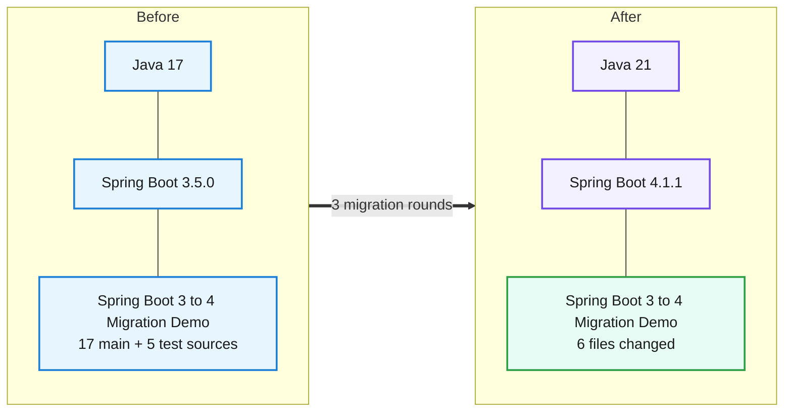
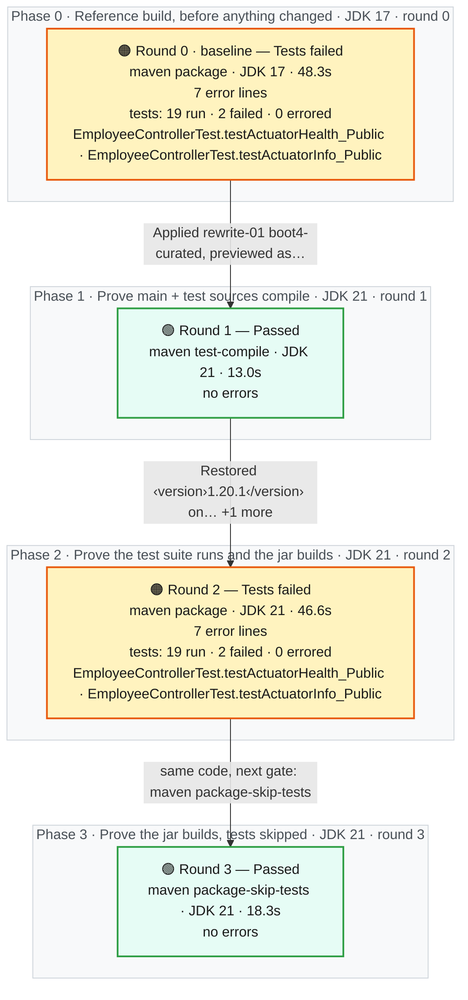
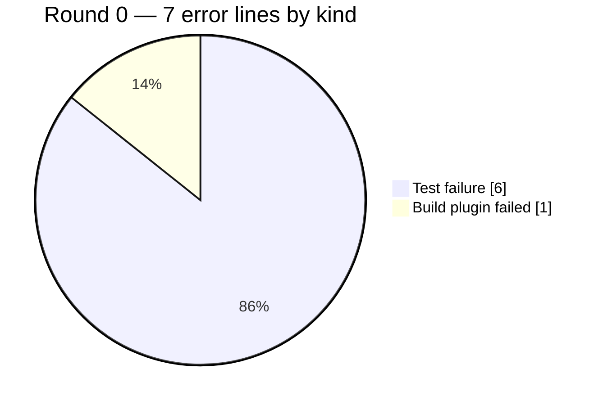

# Migration Report — Spring Boot 3.5.0 to 4.1.1 on Java 21

## Spring Boot 3 to 4 Migration Demo

    

> The demo employee service moved from Spring Boot 3.5.0 on Java 17 to Spring Boot 4.1.1 on Java 21. A previewed OpenRewrite recipe made the mechanical changes: the parent, the Java level, the modular test starters, Jackson 3, the actuator health package, the mocking annotation and the Docker base image. Two of its proposals were rejected: removing the error timestamp format, and unpinning Testcontainers. One starter rename was made by hand. The test suite shows the same result as before the upgrade (19 run, the same 2 pre-existing failures), and every business endpoint returns byte-identical responses. Framework-owned payloads did change shape: the health document, the default 401 error body and header, and the Spring ProblemDetail body for a bad path variable. These are reported below as findings for clients, not as regressions.

_Generated by the Version Migration skill on 2026-10-01. Every version, error count and response below is read from a recorded run, not from memory._

## At a glance

| | |
|---|---|
| **Result** | 🟢 **Passed** on the final build |
| **Platform** | Spring Boot `3.5.0` → `4.1.1` |
| **Language** | Java `17` → `21` |
| **Build rounds** | 4 recorded — 1 pre-migration baseline, 1 that failed and were read for what to change next, 2 green |
| **Files changed** | 6 — `Dockerfile`, `pom.xml`, `src/main/java/com/example/migrationdemo/config/JacksonConfig.java`, `src/main/java/com/example/migrationdemo/health/DatabaseHealthIndicator.java`, `src/test/java/com/example/migrationdemo/controller/EmployeeControllerTest.java`, `src/test/java/com/example/migrationdemo/integration/EmployeeRepositoryIntegrationTest.java` |
| **Dependency changes** | 8 |
| **Source changes forced by the upgrade** | 8 |
| **Test suite** | before: 19 run, 2 failed, 0 errors → after: 19 run, 2 failed, 0 errors — 🟡 the same 2 pre-existing failures — none introduced |
| **Runtime behaviour** | 🟡 same status on all 13, body differs on 8 |
| **Migration plan** | recorded before any change — 13 predicted impacts, 1 deterministic candidate |
| **Deterministic transformations** | 🟢 1 applied · 🔍 1 previewed — OpenRewrite |
| **Requested target** | `4.1.1` — final build declares `4.1.1` 🟢 matches |
| **Reference followed** | `references/spring-boot-3-to-4.md` |
| **Build tool** | maven — Apache Maven 3.9.9 (8e8579a9e76f7d015ee5ec7bfcdc97d260186937) |

## 0. What was understood before anything changed

> Everything in this section was written **before** any version or source changed — it is a prediction, and it is shown next to what the build, the tests and the probes then actually did. A predicted impact is never evidence that something failed.

### 0.1 Target and path

| | |
|---|---|
| **Source** | Spring Boot `3.5.0` · Java `17` |
| **Requested target** | Spring Boot `4.1.1` · Java `21` — _as requested; never "latest", never a recipe's own target_ |
| **Path** | `3.5.0` → `4.1.1` (Single hop: baseline.json migration_path.on_preparation_line is true (3.5.x).) |
| **Preparation line** | `3.5.x` — 🟢 the source is on it<br/>Source is on the 3.5.x preparation line, so the pack's boot35-preparation transformation is not selected (the pack says it proposes only modernisations on a 3.5.x project). boot4-composite is not selected either: it targets 4.0.x and carries unrelated ecosystem upgrades. |

### 0.2 Constraints and compatibility questions

| | Constraint | Status in the plan | At the end | Evidence |
|---|---|---|---|---|
| 🟢 | **C1** A JDK 21 is available to build and run the target | satisfied | — | baseline.json toolchain: 21.0.11 via MIGRATION_JDK_21 |
| ❓ | **C2** Spring Boot 4.1.1 (spring-boot-starter-parent) resolves from the configured repositories _(blocking)_ | unresolved | resolved | Round 1 resolved and compiled against spring-boot-starter-parent 4.1.1. |
| ❓ | **C3** Spring Boot 4.1.1's minimum Java level is satisfied by Java 21 _(blocking)_ | unresolved | resolved | Rounds 1-3 compiled at release 21 on JDK 21.0.11, and the jar started on JDK 21. |
| ❓ | **C4** Spring Framework 7 / Security 7 / Hibernate 7 are the versions the 4.1.1 BOM manages | unresolved | resolved | dependency:tree after round 2: spring-core 7.0.9, spring-security-core 7.1.1, hibernate-core 7.4.5.Final, tools.jackson databind 3.1.5. |
| ❓ | **C5** Pinned Testcontainers 1.20.1 (testcontainers, postgresql, junit-jupiter) still works with the Boot 4.1.1 test stack | unresolved | resolved | Round 2: EmployeeRepositoryIntegrationTest passes 5/5 with Testcontainers 1.20.1 on Boot 4.1.1. |
| ⚪ | **C6** No Spring Cloud or other ecosystem platform BOM needs a compatible release train | not-applicable | — | baseline.json migration_path.ecosystem_boms_present is empty; observations.platform_boms lists only the Boot parent |
| ⚪ | **C7** springdoc-openapi is not used, so no unmanaged springdoc version must move | not-applicable | — | pom.xml declares no springdoc dependency |
| ❓ | **C8** The rewrite-spring 6.37.1 recipe artifact licence (Moderne Source Available License) is acceptable for this use | unresolved | unresolved | The rewrite-spring 6.37.1 Moderne Source Available License is recorded, not judged. A human must confirm it is acceptable. |
| 🟢 | **C9** A Docker daemon is available so the Testcontainers tests run on both sides | satisfied | — | Round 0 log: Testcontainers connected to Docker, EmployeeRepositoryIntegrationTest 5 run, 0 failed |

### 0.3 Predicted impact vs what actually happened

_The build, transformation and patch columns are facts about the **file**; several impact entries can share one file (a build descriptor, say). Whether this particular impact was real is the agent review's column._

| Impact | File | Area · rule | Risk | Predicted handling | File named by a failing build | File changed by a transformation | File in final patch | Agent review |
|---|---|---|---|---|---|---|---|---|
| **I1** | `pom.xml` | Platform parent · section 1.1 | low | deterministic | never named by a build | rewrite-01 | ✏️ yes | handled-by-transformation — Parent 4.1.1 from rewrite-01; reconciliation matches-request. |
| **I2** | `pom.xml` | Language level · section 1.2 | medium | either | never named by a build | rewrite-01 | ✏️ yes | handled-by-transformation — java.version 21 and the compiler &lt;release&gt;${java.version}&lt;/release&gt; came from the recipe, so no residual was needed. |
| **I3** | `pom.xml` | Starter rename · section 1.3 | medium | deterministic | never named by a build | rewrite-01 | ✏️ yes | confirmed — The recipe did not rename the starter, so it was renamed by hand. The pack's predicted symptom (a resolution failure)… |
| **I4** | `pom.xml` | Test starters · section 4.3 | medium | deterministic | never named by a build | rewrite-01 | ✏️ yes | handled-by-transformation — webmvc-test and data-jpa-test starters were added and the imports repointed. Test-compile is green in round 1. |
| **I5** | `pom.xml` | Security test starter · section 4.4 | high | deterministic | never named by a build | rewrite-01 | ✏️ yes | handled-by-transformation — The swap to spring-boot-starter-security-test came before any test ran. All @WithMockUser tests pass in round 2. |
| **I6** | `src/main/java/com/example/migrationdemo/config/JacksonConfig.java` | JSON handling · section 2.1, 2.2 | high | either | never named by a build | rewrite-01 | ✏️ yes | handled-by-transformation — The mapper was rewritten to Jackson 3. The serialization probes (employee by id, list all) are byte-identical, and the… |
| **I7** | `src/main/java/com/example/migrationdemo/health/DatabaseHealthIndicator.java` | Actuator health · section 3 | medium | deterministic | never named by a build | rewrite-01 | ✏️ yes | handled-by-transformation — Health contributor package moved. The custom 'database' indicator is still UP in the final health probe. |
| **I8** | `src/test/java/com/example/migrationdemo/controller/EmployeeControllerTest.java` | Test layer (MVC slice) · section 4.1, 4.2, 4.3 | high | either | never named by a build | rewrite-01 | ✏️ yes | handled-by-transformation — Same 9 tests and the same 2 pre-existing failures in round 2. |
| **I9** | `src/test/java/com/example/migrationdemo/integration/EmployeeRepositoryIntegrationTest.java` | Test layer (JPA slice + Testcontainers) · section 4.3, section 12 round 0 | medium | either | never named by a build | rewrite-01 | ✏️ yes | handled-by-transformation — 5/5 integration tests pass on PostgreSQL 16 in round 2. |
| **I10** | `Dockerfile` | Runtime image · section 8 | medium | residual | never named by a build | rewrite-01 | ✏️ yes | handled-by-transformation — The plan expected a residual edit, but UpgradeJavaVersion/UpgradeDockerImageVersion changed the Dockerfile. The image… |
| **I11** | `src/main/resources/application.yml` | Configuration properties · section 7 | medium | deterministic | never named by a build | — | no | not-needed — No property rename was proposed, and the yml settings still take effect: show-details always, metrics exposure,… |
| **I12** | `src/main/java/com/example/migrationdemo/repository/EmployeeRepository.java` | Persistence (Hibernate 7) · section 6 | medium | residual | never named by a build | — | no | not-needed — No change was required. Integration tests (PostgreSQL) and probes (H2) for the JPQL and native queries are unchanged. |
| **I13** | `src/main/java/com/example/migrationdemo/config/SecurityConfig.java` | Security 7 · section 5 | low | residual | never named by a build | — | no | not-needed — The lambda DSL compiled unchanged on Security 7.1.1. The security boundary is preserved. |

**Every changed file was predicted by the plan.**

### 0.4 Which probes protect which impact

| Probe | Category | Protects | Replayed |
|---|---|---|---|
| list all employees | business-api | I1, I6, I12 | 🟢 before and after |
| employee by id | serialization | I6 | 🟢 before and after |
| search by department | business-api | I12 | 🟢 before and after |
| high earners (native query) | business-api | I12 | 🟢 before and after |
| employee not found is 404 | error-contract | I6 | 🟢 before and after |
| create invalid is 400 | error-contract | I6 | 🟢 before and after |
| create duplicate is 409 | error-contract | I6 | 🟢 before and after |
| bad path variable type | error-contract | I1 | 🟢 before and after |
| unauthenticated is 401 | security-boundary | I13 | 🟢 before and after |
| bad credentials is 401 | security-boundary | I13 | 🟢 before and after |
| health is public | actuator | I7, I11, I13 | 🟢 before and after |
| info is public | actuator | I11, I13 | 🟢 before and after |
| metrics endpoint | actuator | I11 | 🟢 before and after |
| _none_ | test-suite | I4, I5, I8, I9 | ⚪ not observable — Test-layer impact is observed by the project's own suite: a package round compared with round 0 (19 run, 2 failed) |
| _none_ | other | I10 | ⚪ not observable — The container image is not built or run in this session |
| _none_ | persistence | I12 | ⚪ not observable — PostgreSQL behaviour is observed only through EmployeeRepositoryIntegrationTest (Testcontainers); the running app uses its default H2 file datasource because the PostgreSQL driver is test-scoped |

### 0.5 Out of scope, and when to stop

**Out of scope:**

- Fixing the two pre-existing EmployeeControllerTest actuator slice failures (404 in @WebMvcTest)
- Testcontainers 2 migration or any Testcontainers version change
- Removing @JsonFormat from ErrorResponse (would change the error-contract timestamp format)
- Business bug: EmployeeService checks duplicate email via findByEmployeeNumber(request.getEmail())
- Changing the PostgreSQL driver scope or the default datasource
- H2 console / frame-options security rules, formatting, import reordering, refactors
- Widening @WebMvcTest to @SpringBootTest unless a build proves the slice cannot work

**Stop conditions:**

- Spring Boot 4.1.1 cannot be resolved (C2)
- Round on JDK 21 cannot compile at release 21 for a reason outside the pack (C3)
- A business or security-boundary probe changes status and the cause is not within the migration's scope
- A package round shows a new test failure that cannot be traced to a pack rule
- The only available transformation output would require accepting out-of-scope changes


## 1. What moved



| | What | Before | After | Why it moved |
|---|---|---|---|---|
| ⬆️ | `Java (language level)` | `17` | `21` | Runtime baseline required by the new platform version. |
| ⬆️ | `Spring Boot (platform)` | `3.5.0` | `4.1.1` | The version jump this migration is about. |
| ⬆️ | `org.springframework.boot:spring-boot-starter-parent` | `3.5.0` | `4.1.1` | Requested target; set by the curated recipe pinned to the request (section 1.1). |
| ⬆️ | `java.version` | `17` | `21` | Requested Java 21 (section 1.2), set by UpgradeJavaVersion. |
| ⬆️ | `maven-compiler-plugin source/target` | `<source>17</source><target>17</target>` | `<release>${java.version}</release>` | A stale explicit source/target would keep compiling at 17 (section 1.2); normalised by UseMavenCompilerPluginReleaseConfiguration. |
| 🔀 | `org.springframework.boot:spring-boot-starter-web` | `spring-boot-starter-web` | `org.springframework.boot:spring-boot-starter-webmvc` | Section 1.3 starter rename; the recipe did not make it, and the 4.1.1 web starter declares itself deprecated in favour of webmvc. |
| 🔀 | `org.springframework.security:spring-security-test` | `spring-security-test` | `org.springframework.boot:spring-boot-starter-security-test` | Boot 4 carries the MockMvc security test auto-configuration in its own starter (section 4.4). |
| ➕ | `org.springframework.boot:spring-boot-starter-webmvc-test` | `absent` | `managed (4.1.1)` | @WebMvcTest moved module and package (section 4.3). |
| ➕ | `org.springframework.boot:spring-boot-starter-data-jpa-test` | `absent` | `managed (4.1.1)` | @DataJpaTest moved module and package (section 4.3). |
| ⬆️ | `Dockerfile base image` | `eclipse-temurin:17-jre` | `eclipse-temurin:21-jre` | The jar targets Java 21 and would not start on a 17 runtime (section 8); changed by UpgradeJavaVersion/UpgradeDockerImageVersion. |

## 2. How the migration went

**4 build rounds**, 2.1 min of build time in total. Round 0 is the pre-migration reference build on JDK 17; every later round ran on JDK 21. 2 of them came back with errors, 2 came back clean. A red round is not a setback here — it is the output the migration is driven by: each one names the exact files or tests the next change has to touch. Apart from the 1 deterministic transformation in §2.4 — each previewed, inspected and then applied to the sandbox, and each built immediately — nothing was edited that a build, a test or a probe had not first complained about. The migration ends on round 3, 🟢 **Passed**.



### 2.1 The round ledger

| Round | Ran on | Goal | Outcome | Errors | Took | What it told us |
|---|---|---|---|---|---|---|
| **0**<br/>_(baseline)_ | JDK 17 | `package`<br/>_the test suite runs and the jar builds_ | 🟠 Tests failed | 7 | 48.3s | **2 tests failed an assertion**<br/>failing tests: `EmployeeControllerTest.testActuatorHealth_Public` · `EmployeeControllerTest.testActuatorInfo_Public`<br/>Pre-migration reference on JDK 17 with Boot 3.5.0. The Docker daemon was up, so Testcontainers ran: 19 tests run, 0 errors. |
| **1** | JDK 21 | `test-compile`<br/>_main + test sources compile_ | 🟢 Passed | — | 13.0s | **Nothing failed** — main + test sources compile on JDK 21.<br/>This round built the OpenRewrite apply straight away. Main and test code compile on JDK 21 at release 21 against Boot 4.1.1 (Framework 7, Security 7, Hibernate 7, Jackson 3), so the recipe left no compile-level residual. |
| **2** | JDK 21 | `package`<br/>_the test suite runs and the jar builds_ | 🟠 Tests failed | 7 | 46.6s | **2 tests failed an assertion**<br/>failing tests: `EmployeeControllerTest.testActuatorHealth_Public` · `EmployeeControllerTest.testActuatorInfo_Public`<br/>This round used the same package goal as round 0, so its test counts are comparable. It has the same 19 tests and the same 2 failures (the actuator slice tests, 404), with 0 errors. |
| **3** | JDK 21 | `package-skip-tests`<br/>_the jar builds, tests skipped_ | 🟢 Passed | — | 18.3s | **Nothing failed** — the jar builds, tests skipped on JDK 21.<br/>Packaging gate on JDK 21 with tests skipped, because round 2 already ran the suite. A runnable Boot 4.1.1 jar was produced, and the final runtime probe ran against it. |

### 2.2 Exactly what failed, and why

One block per round that did not come back green: the files or the tests the build named, the message it printed against each one, and what that meant. Paths are as the compiler reported them, relative to the project root, and the line numbers are the lines it pointed at. Everything in the tables is read out of the recorded build; only the **Why it failed** paragraph is the agent's reading of it.

#### Round 0 — 🟠 Tests failed _(pre-migration reference, not migration damage)_

`maven package` on JDK 17 · 7 error lines · 19 tests run · 2 failed · 0 errored

**Which tests failed**

| Test | Source file | Why it failed | What kind of problem | Was it already failing? |
|---|---|---|---|---|
| `EmployeeControllerTest.testActuatorHealth_Public` | `src/test/java/com/example/migrationdemo/controller/EmployeeControllerTest.java`<br/>line 145 | Status expected:&lt;200&gt; but was:&lt;404&gt; | Test failure — The code compiled but behaviour or test wiring changed. | _this is the baseline_ |
| `EmployeeControllerTest.testActuatorInfo_Public` | `src/test/java/com/example/migrationdemo/controller/EmployeeControllerTest.java`<br/>line 151 | Status expected:&lt;200&gt; but was:&lt;404&gt; | Test failure — The code compiled but behaviour or test wiring changed. | _this is the baseline_ |

**Why it failed**

Pre-migration reference on JDK 17 with Boot 3.5.0. The Docker daemon was up, so Testcontainers ran: 19 tests run, 0 errors. The only failures are EmployeeControllerTest.testActuatorHealth_Public and testActuatorInfo_Public. They return 404 because a @WebMvcTest slice does not load the actuator endpoints. Both are pre-existing, they were not fixed, and they are the comparison point for the target rounds.

**What was changed in response** — then re-run as round 1

- Applied rewrite-01 (boot4-curated, previewed as rewrite-00) with src/main/java/com/example/migrationdemo/exception/ErrorResponse.java excluded as out of scope

Reference rule(s) applied: `section 1.1` · `section 1.2` · `section 2` · `section 3` · `section 4.1` · `section 4.3` · `section 4.4` · `section 8`

_Every error line, the exact command and the full build log for this round are in **section 3, Round 0**._

#### Round 2 — 🟠 Tests failed

`maven package` on JDK 21 · 7 error lines · 19 tests run · 2 failed · 0 errored

**Which tests failed**

| Test | Source file | Why it failed | What kind of problem | Was it already failing? |
|---|---|---|---|---|
| `EmployeeControllerTest.testActuatorHealth_Public` | `src/test/java/com/example/migrationdemo/controller/EmployeeControllerTest.java`<br/>line 145 | Status expected:&lt;200&gt; but was:&lt;404&gt; | Test failure — The code compiled but behaviour or test wiring changed. | ⚪ yes — already failing in the reference build |
| `EmployeeControllerTest.testActuatorInfo_Public` | `src/test/java/com/example/migrationdemo/controller/EmployeeControllerTest.java`<br/>line 151 | Status expected:&lt;200&gt; but was:&lt;404&gt; | Test failure — The code compiled but behaviour or test wiring changed. | ⚪ yes — already failing in the reference build |

**Why it failed**

This round used the same package goal as round 0, so its test counts are comparable. It has the same 19 tests and the same 2 failures (the actuator slice tests, 404), with 0 errors. The 6 @WithMockUser tests still pass, so the section 4.4 regression did not occur: the security-test starter was swapped before the first test run. The 5 Testcontainers tests pass on PostgreSQL 16 with Testcontainers 1.20.1, which proves constraint C5 and shows the JPQL and native queries work under Hibernate 7.4.5. Nothing was introduced.

**No source change was needed** — round 3 re-ran `maven package-skip-tests` on the same code.

_Every error line, the exact command and the full build log for this round are in **section 3, Round 2**._


### 2.3 The mix of breakage in the worst round

Round 0 carried more error lines than any other — 7 of them, in these proportions:



### 2.4 Deterministic transformations

OpenRewrite ran **inside the sandbox only**, as a provider 04D invoked — never as the orchestrator and never as proof. A dry-run is a preview that changes nothing; an apply is only accepted when every file it changed was in the inspected preview, and is built immediately. A transformation that was unavailable, failed or was reverted is listed here as exactly that.

| Record | Mode | Outcome | Recipes | Artifact · plugin | Licence | Files | Built in | Agent decision |
|---|---|---|---|---|---|---|---|---|
| `rewrite-00` | dry-run | 🔍 previewed (dry-run, nothing changed) | `mars.migration.SpringBoot3To4Curated` | `org.openrewrite.recipe:rewrite-spring:6.37.1`<br/>plugin `6.46.1` | Moderne Source Available License | 7 proposed | — | **superseded** — The dry-run preview was inspected against the plan and applied as rewrite-01, with ErrorResponse.java excluded and the Testcontainers pin… |
| `rewrite-01` | apply | 🟢 applied to the sandbox | `mars.migration.SpringBoot3To4Curated` | `org.openrewrite.recipe:rewrite-spring:6.37.1`<br/>plugin `6.46.1` | Moderne Source Available License | 6 changed | round 1 | **accepted** — Every applied file maps to a plan impact (I1, I2, I4-I10). ErrorResponse.java was excluded at apply time, because removing its @JsonFormat… |

<details><summary>rewrite-00 — dry-run, previewed</summary>

- command (sanitised): `E:/mv/tools/apache-maven-3.9.9/bin/mvn.cmd -B org.openrewrite.maven:rewrite-maven-plugin:6.46.1:dryRunNoFork -Drewrite.activeRecipes=mars.migration.SpringBoot3To4Curated -Drewrite.recipeArtifactCoordinates=org.openrewrite.recipe:rewrite-spring:6.37.1 -Drewrite.configLocation=<session>\transformations\rewrite-00.rewrite.yml`
- patch: `../evidence/roundB/ctx/version-migration/b2-golden/transformations/rewrite-00.patch`
- log: `../evidence/roundB/ctx/version-migration/b2-golden/transformations/rewrite-00.log`

</details>

<details><summary>rewrite-01 — apply, applied</summary>

- target reconciliation: recipe target `requested`, declared after apply `4.1.1`, requested `4.1.1` → **matches-request**
- restored 1 out-of-scope file(s) from the checkpoint: src/main/java/com/example/migrationdemo/exception/ErrorResponse.java
- command (sanitised): `E:/mv/tools/apache-maven-3.9.9/bin/mvn.cmd -B org.openrewrite.maven:rewrite-maven-plugin:6.46.1:runNoFork -Drewrite.activeRecipes=mars.migration.SpringBoot3To4Curated -Drewrite.recipeArtifactCoordinates=org.openrewrite.recipe:rewrite-spring:6.37.1 -Drewrite.configLocation=<session>\transformations\rewrite-01.rewrite.yml`
- patch: `../evidence/roundB/ctx/version-migration/b2-golden/transformations/rewrite-01.patch`
- log: `../evidence/roundB/ctx/version-migration/b2-golden/transformations/rewrite-01.log`

</details>


### 2.5 How each change was made

| File | How it was changed | Evidence that required it | Rule |
|---|---|---|---|
| `pom.xml` | OpenRewrite (deterministic) (`rewrite-01`) | — | sections 1.1, 1.2, 4.3, 4.4 |
| `pom.xml` | residual repair, evidence-driven | Preview rewrite-00.patch removes the pin. spring-boot-dependencies-4.1.1.pom sets testcontainers.version 2.0.5. Plan out_of_scope: no Testcontainers version change. The rejected hunk shared pom.xml with wanted hunks, so it was reverted by hand before round 2. | — |
| `pom.xml` | declared-version edit | Plan impact I3 is a verified pack rule that the recipe did not apply: rewrite-01 left the web starter in place. spring-boot-starter-web-4.1.1.pom describes itself as 'deprecated in favor of spring-boot-starter-webmvc'. spring-boot-starter-webmvc 4.1.1 resolves, and the dependency tree after round 2 shows the same jackson/tomcat/http-converter/webmvc modules. No build failure demanded it, because the deprecated starter still resolves in 4.1.1. | section 1.3 |
| `src/main/java/com/example/migrationdemo/config/JacksonConfig.java` | OpenRewrite (deterministic) (`rewrite-01`) | — | sections 2.1, 2.2 |
| `src/main/java/com/example/migrationdemo/health/DatabaseHealthIndicator.java` | OpenRewrite (deterministic) (`rewrite-01`) | — | section 3 |
| `src/test/java/com/example/migrationdemo/controller/EmployeeControllerTest.java` | OpenRewrite (deterministic) (`rewrite-01`) | — | sections 4.1, 4.2, 4.3 |
| `src/test/java/com/example/migrationdemo/integration/EmployeeRepositoryIntegrationTest.java` | OpenRewrite (deterministic) (`rewrite-01`) | — | section 4.3 |
| `Dockerfile` | OpenRewrite (deterministic) (`rewrite-01`) | — | section 8 |

## 3. Round by round

### Round 0 — 🟠 Tests failed _(pre-migration reference)_

> **Nothing had been changed yet.** This is the reference every later round is read against.

| | |
|---|---|
| **Command** | `E:/mv/tools/apache-maven-3.9.9/bin/mvn.cmd -B clean package` |
| **JDK** | 17 (17.0.20.1) |
| **Declared in the build** | Java `17` · `spring-boot-starter-parent 3.5.0` |
| **Exit code** | 1 |
| **Duration** | 48.3s |
| **Workspace at this point** | no changes yet |

**What the result meant**

Pre-migration reference on JDK 17 with Boot 3.5.0. The Docker daemon was up, so Testcontainers ran: 19 tests run, 0 errors. The only failures are EmployeeControllerTest.testActuatorHealth_Public and testActuatorInfo_Public. They return 404 because a @WebMvcTest slice does not load the actuator endpoints. Both are pre-existing, they were not fixed, and they are the comparison point for the target rounds.

**Errors by kind**

| Count | Kind | What this kind of error means |
|---|---|---|
| 6 | Test failure | The code compiled but behaviour or test wiring changed. |
| 1 | Build plugin failed | A build plugin is too old for the new platform, or its configuration changed. |

**Which tests failed**

| Test | Source file | Line | Why it failed |
|---|---|---|---|
| `EmployeeControllerTest.testActuatorHealth_Public` | `src/test/java/com/example/migrationdemo/controller/EmployeeControllerTest.java` | 145 | Status expected:&lt;200&gt; but was:&lt;404&gt; |
| `EmployeeControllerTest.testActuatorInfo_Public` | `src/test/java/com/example/migrationdemo/controller/EmployeeControllerTest.java` | 151 | Status expected:&lt;200&gt; but was:&lt;404&gt; |

**Distinct messages**

```text
Tests run: 9, Failures: 2, Errors: 0, Skipped: 0, Time elapsed: 8.794 s <<< FAILURE! -- in com.example.migrationdemo.controller.EmployeeControllerTest
com.example.migrationdemo.controller.EmployeeControllerTest.testActuatorHealth_Public -- Time elapsed: 0.063 s <<< FAILURE!
com.example.migrationdemo.controller.EmployeeControllerTest.testActuatorInfo_Public -- Time elapsed: 0.018 s <<< FAILURE!
EmployeeControllerTest.testActuatorHealth_Public:145 Status expected:<200> but was:<404>
EmployeeControllerTest.testActuatorInfo_Public:151 Status expected:<200> but was:<404>
Tests run: 19, Failures: 2, Errors: 0, Skipped: 0
Failed to execute goal org.apache.maven.plugins:maven-surefire-plugin:3.5.3:test (default-test) on project spring-boot-migration-demo: There are test failures.
```

<details>
<summary>Every error line recorded in this round (7)</summary>

| # | File | Line | Kind | Message |
|---|---|---|---|---|
| 1 | _build_ | — | Test failure | Tests run: 9, Failures: 2, Errors: 0, Skipped: 0, Time elapsed: 8.794 s &lt;&lt;&lt; FAILURE! -- in com.example.migrationdemo.controller.EmployeeControllerTest |
| 2 | _build_ | — | Test failure | com.example.migrationdemo.controller.EmployeeControllerTest.testActuatorHealth_Public -- Time elapsed: 0.063 s &lt;&lt;&lt; FAILURE! |
| 3 | _build_ | — | Test failure | com.example.migrationdemo.controller.EmployeeControllerTest.testActuatorInfo_Public -- Time elapsed: 0.018 s &lt;&lt;&lt; FAILURE! |
| 4 | _build_ | — | Test failure | EmployeeControllerTest.testActuatorHealth_Public:145 Status expected:&lt;200&gt; but was:&lt;404&gt; |
| 5 | _build_ | — | Test failure | EmployeeControllerTest.testActuatorInfo_Public:151 Status expected:&lt;200&gt; but was:&lt;404&gt; |
| 6 | _build_ | — | Test failure | Tests run: 19, Failures: 2, Errors: 0, Skipped: 0 |
| 7 | _build_ | — | Build plugin failed | Failed to execute goal org.apache.maven.plugins:maven-surefire-plugin:3.5.3:test (default-test) on project spring-boot-migration-demo: There are test failures. |

</details>

**Errors grouped by shared subject** — parser facts: same category and same subject (a package, a symbol, an artifact)

| Group | Lines | Kind | Subject | Package family | Files | Basis |
|---|---|---|---|---|---|---|
| G1 | 5 | Test failure | `test EmployeeControllerTest` | — | — | parser |
| G2 | 1 | Build plugin failed | `message Failed to execute goal org.apache.maven.plugins:maven-surefire-plugin:N.N.N:test (default-test) on p` | — | — | parser |
| G3 | 1 | Test failure | `message Tests run: N, Failures: N, Errors: N, Skipped: N` | — | — | parser |

**Root causes — agent judgement over those groups**

- G1, G2, G3 → All three groups are the same two pre-existing slice-test failures and the Maven/surefire summary lines they produce. Nothing in them is environmental: the Testcontainers tests passed against PostgreSQL 16.

<details>
<summary>Build log tail</summary>

```text
… first 176 line(s) omitted — the complete log is at rounds/round-00.log
        e1_0.email,
        e1_0.employee_number,
        e1_0.first_name,
        e1_0.last_name,
        e1_0.salary,
        e1_0.updated_at 
    from
        employees e1_0 
    where
        upper(e1_0.department)=upper(?)
Hibernate: 
    select
        e1_0.id,
        e1_0.active,
        e1_0.created_at,
        e1_0.department,
        e1_0.email,
        e1_0.employee_number,
        e1_0.first_name,
        e1_0.last_name,
        e1_0.salary,
        e1_0.updated_at 
    from
        employees e1_0 
    where
        upper(e1_0.department)=upper(?)
[INFO] Tests run: 5, Failures: 0, Errors: 0, Skipped: 0, Time elapsed: 27.74 s -- in com.example.migrationdemo.integration.EmployeeRepositoryIntegrationTest
[INFO] Running com.example.migrationdemo.mapper.EmployeeMapperTest
[INFO] Tests run: 2, Failures: 0, Errors: 0, Skipped: 0, Time elapsed: 0.007 s -- in com.example.migrationdemo.mapper.EmployeeMapperTest
[INFO] Running com.example.migrationdemo.service.EmployeeServiceTest
[INFO] Tests run: 3, Failures: 0, Errors: 0, Skipped: 0, Time elapsed: 0.288 s -- in com.example.migrationdemo.service.EmployeeServiceTest
[INFO] 
[INFO] Results:
[INFO] 
[ERROR] Failures: 
[ERROR]   EmployeeControllerTest.testActuatorHealth_Public:145 Status expected:<200> but was:<404>
[ERROR]   EmployeeControllerTest.testActuatorInfo_Public:151 Status expected:<200> but was:<404>
[INFO] 
[ERROR] Tests run: 19, Failures: 2, Errors: 0, Skipped: 0
[INFO] 
[INFO] ------------------------------------------------------------------------
[INFO] BUILD FAILURE
[INFO] ------------------------------------------------------------------------
[INFO] Total time:  46.048 s
[INFO] Finished at: 2026-09-30T21:53:30-05:00
[INFO] ------------------------------------------------------------------------
[ERROR] Failed to execute goal org.apache.maven.plugins:maven-surefire-plugin:3.5.3:test (default-test) on project spring-boot-migration-demo: There are test failures.
[ERROR] 
[ERROR] See .\target\surefire-reports for the individual test results.
[ERROR] See dump files (if any exist) [date].dump, [date]-jvmRun[N].dump and [date].dumpstream.
[ERROR] -> [Help 1]
[ERROR] 
[ERROR] To see the full stack trace of the errors, re-run Maven with the -e switch.
[ERROR] Re-run Maven using the -X switch to enable full debug logging.
[ERROR] 
[ERROR] For more information about the errors and possible solutions, please read the following articles:
[ERROR] [Help 1] http://cwiki.apache.org/confluence/display/MAVEN/MojoFailureException

OpenJDK 64-Bit Server VM warning: Sharing is only supported for boot loader classes because bootstrap classpath has been appended

```

</details>

### Round 1 — 🟢 Passed

> **Changed before this round:** Applied rewrite-01 (boot4-curated, previewed as rewrite-00) with src/main/java/com/example/migrationdemo/exception/ErrorResponse.java excluded as out of scope

| | |
|---|---|
| **Command** | `E:/mv/tools/apache-maven-3.9.9/bin/mvn.cmd -B clean test-compile` |
| **JDK** | 21 (21.0.11) |
| **Declared in the build** | Java `21` · `spring-boot-starter-parent 4.1.1` |
| **Exit code** | 0 |
| **Duration** | 13.0s |
| **Workspace at this point** | 6 files changed, 33 insertions(+), 34 deletions(-) |

**What the result meant**

This round built the OpenRewrite apply straight away. Main and test code compile on JDK 21 at release 21 against Boot 4.1.1 (Framework 7, Security 7, Hibernate 7, Jackson 3), so the recipe left no compile-level residual. The parent, java.version and compiler release resolved, which proves constraints C2 and C3. The one rejected hunk (the Testcontainers pin removal) was still in the tree for this round. It cannot affect a test-compile, and it was reverted before round 2.

**This round built the OpenRewrite apply `rewrite-01`** — see §2.4.

**Reference rules applied:** `section 1.1` · `section 1.2` · `section 2` · `section 3` · `section 4.1` · `section 4.3` · `section 4.4` · `section 8`

<details>
<summary>Build log tail</summary>

```text
[INFO] Scanning for projects...
[INFO] 
[INFO] ---------------< com.example:spring-boot-migration-demo >---------------
[INFO] Building Spring Boot 3 to 4 Migration Demo 1.0.0
[INFO]   from pom.xml
[INFO] --------------------------------[ jar ]---------------------------------
[INFO] 
[INFO] --- clean:3.5.0:clean (default-clean) @ spring-boot-migration-demo ---
[INFO] Deleting .\target
[INFO] 
[INFO] --- resources:3.5.0:resources (default-resources) @ spring-boot-migration-demo ---
[INFO] Copying 1 resource from src\main\resources to target\classes
[INFO] Copying 0 resource from src\main\resources to target\classes
[INFO] 
[INFO] --- compiler:3.15.0:compile (default-compile) @ spring-boot-migration-demo ---
[INFO] Recompiling the module because of changed source code.
[INFO] Compiling 17 source files with javac [debug parameters release 21] to target\classes
[INFO] 
[INFO] --- resources:3.5.0:testResources (default-testResources) @ spring-boot-migration-demo ---
[INFO] Copying 1 resource from src\test\resources to target\test-classes
[INFO] 
[INFO] --- compiler:3.15.0:testCompile (default-testCompile) @ spring-boot-migration-demo ---
[INFO] Recompiling the module because of changed dependency.
[INFO] Compiling 5 source files with javac [debug parameters release 21] to target\test-classes
[INFO] ------------------------------------------------------------------------
[INFO] BUILD SUCCESS
[INFO] ------------------------------------------------------------------------
[INFO] Total time:  10.738 s
[INFO] Finished at: 2026-09-30T21:59:32-05:00
[INFO] ------------------------------------------------------------------------


```

</details>

### Round 2 — 🟠 Tests failed

> **Changed before this round:** Restored &lt;version&gt;1.20.1&lt;/version&gt; on org.testcontainers:testcontainers (reverts the rejected rewrite-01 hunk) · spring-boot-starter-web renamed to spring-boot-starter-webmvc (pack section 1.3, build-file edit)

| | |
|---|---|
| **Command** | `E:/mv/tools/apache-maven-3.9.9/bin/mvn.cmd -B clean package` |
| **JDK** | 21 (21.0.11) |
| **Declared in the build** | Java `21` · `spring-boot-starter-parent 4.1.1` |
| **Exit code** | 1 |
| **Duration** | 46.6s |
| **Workspace at this point** | 6 files changed, 34 insertions(+), 34 deletions(-) |

**What the result meant**

This round used the same package goal as round 0, so its test counts are comparable. It has the same 19 tests and the same 2 failures (the actuator slice tests, 404), with 0 errors. The 6 @WithMockUser tests still pass, so the section 4.4 regression did not occur: the security-test starter was swapped before the first test run. The 5 Testcontainers tests pass on PostgreSQL 16 with Testcontainers 1.20.1, which proves constraint C5 and shows the JPQL and native queries work under Hibernate 7.4.5. Nothing was introduced.

**Errors by kind**

| Count | Kind | What this kind of error means |
|---|---|---|
| 6 | Test failure | The code compiled but behaviour or test wiring changed. |
| 1 | Build plugin failed | A build plugin is too old for the new platform, or its configuration changed. |

**Which tests failed**

| Test | Source file | Line | Why it failed |
|---|---|---|---|
| `EmployeeControllerTest.testActuatorHealth_Public` | `src/test/java/com/example/migrationdemo/controller/EmployeeControllerTest.java` | 145 | Status expected:&lt;200&gt; but was:&lt;404&gt; |
| `EmployeeControllerTest.testActuatorInfo_Public` | `src/test/java/com/example/migrationdemo/controller/EmployeeControllerTest.java` | 151 | Status expected:&lt;200&gt; but was:&lt;404&gt; |

**Distinct messages**

```text
Tests run: 9, Failures: 2, Errors: 0, Skipped: 0, Time elapsed: 14.01 s <<< FAILURE! -- in com.example.migrationdemo.controller.EmployeeControllerTest
com.example.migrationdemo.controller.EmployeeControllerTest.testActuatorHealth_Public -- Time elapsed: 0.098 s <<< FAILURE!
com.example.migrationdemo.controller.EmployeeControllerTest.testActuatorInfo_Public -- Time elapsed: 0.048 s <<< FAILURE!
EmployeeControllerTest.testActuatorHealth_Public:145 Status expected:<200> but was:<404>
EmployeeControllerTest.testActuatorInfo_Public:151 Status expected:<200> but was:<404>
Tests run: 19, Failures: 2, Errors: 0, Skipped: 0
Failed to execute goal org.apache.maven.plugins:maven-surefire-plugin:3.5.6:test (default-test) on project spring-boot-migration-demo: There are test failures.
```

<details>
<summary>Every error line recorded in this round (7)</summary>

| # | File | Line | Kind | Message |
|---|---|---|---|---|
| 1 | _build_ | — | Test failure | Tests run: 9, Failures: 2, Errors: 0, Skipped: 0, Time elapsed: 14.01 s &lt;&lt;&lt; FAILURE! -- in com.example.migrationdemo.controller.EmployeeControllerTest |
| 2 | _build_ | — | Test failure | com.example.migrationdemo.controller.EmployeeControllerTest.testActuatorHealth_Public -- Time elapsed: 0.098 s &lt;&lt;&lt; FAILURE! |
| 3 | _build_ | — | Test failure | com.example.migrationdemo.controller.EmployeeControllerTest.testActuatorInfo_Public -- Time elapsed: 0.048 s &lt;&lt;&lt; FAILURE! |
| 4 | _build_ | — | Test failure | EmployeeControllerTest.testActuatorHealth_Public:145 Status expected:&lt;200&gt; but was:&lt;404&gt; |
| 5 | _build_ | — | Test failure | EmployeeControllerTest.testActuatorInfo_Public:151 Status expected:&lt;200&gt; but was:&lt;404&gt; |
| 6 | _build_ | — | Test failure | Tests run: 19, Failures: 2, Errors: 0, Skipped: 0 |
| 7 | _build_ | — | Build plugin failed | Failed to execute goal org.apache.maven.plugins:maven-surefire-plugin:3.5.6:test (default-test) on project spring-boot-migration-demo: There are test failures. |

</details>

**Errors grouped by shared subject** — parser facts: same category and same subject (a package, a symbol, an artifact)

| Group | Lines | Kind | Subject | Package family | Files | Basis |
|---|---|---|---|---|---|---|
| G1 | 5 | Test failure | `test EmployeeControllerTest` | — | — | parser |
| G2 | 1 | Build plugin failed | `message Failed to execute goal org.apache.maven.plugins:maven-surefire-plugin:N.N.N:test (default-test) on p` | — | — | parser |
| G3 | 1 | Test failure | `message Tests run: N, Failures: N, Errors: N, Skipped: N` | — | — | parser |

**Root causes — agent judgement over those groups**

- G1, G2, G3 → These are the same pre-existing failures as round 0 (testActuatorHealth_Public and testActuatorInfo_Public, 404 instead of 200 in the MVC slice). The migration did not cause them, and they were not fixed (out of scope).

**Reference rules applied:** `section 1.3` · `section 4.4`

<details>
<summary>Build log tail</summary>

```text
… first 140 line(s) omitted — the complete log is at rounds/round-02.log
    from
        employees e1_0 
    where
        upper(e1_0.department)=upper(?)
Hibernate: 
    select
        e1_0.id,
        e1_0.active,
        e1_0.created_at,
        e1_0.department,
        e1_0.email,
        e1_0.employee_number,
        e1_0.first_name,
        e1_0.last_name,
        e1_0.salary,
        e1_0.updated_at 
    from
        employees e1_0 
    where
        upper(e1_0.department)=upper(?)
2026-09-30T22:00:48.117-05:00  WARN 45692 --- [spring-boot-migration-demo] [           main] o.j.j.e.d.AbstractExtensionContext       : Type implements CloseableResource but not AutoCloseable: org.testcontainers.junit.jupiter.TestcontainersExtension$StoreAdapter
[INFO] Tests run: 5, Failures: 0, Errors: 0, Skipped: 0, Time elapsed: 15.98 s -- in com.example.migrationdemo.integration.EmployeeRepositoryIntegrationTest
[INFO] Running com.example.migrationdemo.mapper.EmployeeMapperTest
[INFO] Tests run: 2, Failures: 0, Errors: 0, Skipped: 0, Time elapsed: 0.013 s -- in com.example.migrationdemo.mapper.EmployeeMapperTest
[INFO] Running com.example.migrationdemo.service.EmployeeServiceTest
[INFO] Tests run: 3, Failures: 0, Errors: 0, Skipped: 0, Time elapsed: 0.491 s -- in com.example.migrationdemo.service.EmployeeServiceTest
[INFO] 
[INFO] Results:
[INFO] 
[ERROR] Failures: 
[ERROR]   EmployeeControllerTest.testActuatorHealth_Public:145 Status expected:<200> but was:<404>
[ERROR]   EmployeeControllerTest.testActuatorInfo_Public:151 Status expected:<200> but was:<404>
[INFO] 
[ERROR] Tests run: 19, Failures: 2, Errors: 0, Skipped: 0
[INFO] 
[INFO] ------------------------------------------------------------------------
[INFO] BUILD FAILURE
[INFO] ------------------------------------------------------------------------
[INFO] Total time:  44.365 s
[INFO] Finished at: 2026-09-30T22:00:49-05:00
[INFO] ------------------------------------------------------------------------
[ERROR] Failed to execute goal org.apache.maven.plugins:maven-surefire-plugin:3.5.6:test (default-test) on project spring-boot-migration-demo: There are test failures.
[ERROR] 
[ERROR] See .\target\surefire-reports for the individual test results.
[ERROR] See dump files (if any exist) [date].dump, [date]-jvmRun[N].dump and [date].dumpstream.
[ERROR] -> [Help 1]
[ERROR] 
[ERROR] To see the full stack trace of the errors, re-run Maven with the -e switch.
[ERROR] Re-run Maven using the -X switch to enable full debug logging.
[ERROR] 
[ERROR] For more information about the errors and possible solutions, please read the following articles:
[ERROR] [Help 1] http://cwiki.apache.org/confluence/display/MAVEN/MojoFailureException

Mockito is currently self-attaching to enable the inline-mock-maker. This will no longer work in future releases of the JDK. Please add Mockito as an agent to your build as described in Mockito's documentation: https://javadoc.io/doc/org.mockito/mockito-core/latest/org.mockito/org/mockito/Mockito.html#0.3
WARNING: A Java agent has been loaded dynamically (C:\Users\annav\.m2\repository\net\bytebuddy\byte-buddy-agent\1.18.11\byte-buddy-agent-1.18.11.jar)
WARNING: If a serviceability tool is in use, please run with -XX:+EnableDynamicAgentLoading to hide this warning
WARNING: If a serviceability tool is not in use, please run with -Djdk.instrument.traceUsage for more information
WARNING: Dynamic loading of agents will be disallowed by default in a future release
OpenJDK 64-Bit Server VM warning: Sharing is only supported for boot loader classes because bootstrap classpath has been appended

```

</details>

### Round 3 — 🟢 Passed

> **Changed before this round:** Packaging gate: runnable jar on JDK 21 (no source change)

| | |
|---|---|
| **Command** | `E:/mv/tools/apache-maven-3.9.9/bin/mvn.cmd -B clean package -DskipTests` |
| **JDK** | 21 (21.0.11) |
| **Declared in the build** | Java `21` · `spring-boot-starter-parent 4.1.1` |
| **Exit code** | 0 |
| **Duration** | 18.3s |
| **Workspace at this point** | 6 files changed, 34 insertions(+), 34 deletions(-) |

**What the result meant**

Packaging gate on JDK 21 with tests skipped, because round 2 already ran the suite. A runnable Boot 4.1.1 jar was produced, and the final runtime probe ran against it.

<details>
<summary>Build log tail</summary>

```text
[INFO] Scanning for projects...
[INFO] 
[INFO] ---------------< com.example:spring-boot-migration-demo >---------------
[INFO] Building Spring Boot 3 to 4 Migration Demo 1.0.0
[INFO]   from pom.xml
[INFO] --------------------------------[ jar ]---------------------------------
[WARNING] Parameter 'executable' is unknown for plugin 'spring-boot-maven-plugin:4.1.1:repackage (repackage)'
[INFO] 
[INFO] --- clean:3.5.0:clean (default-clean) @ spring-boot-migration-demo ---
[INFO] Deleting .\target
[INFO] 
[INFO] --- resources:3.5.0:resources (default-resources) @ spring-boot-migration-demo ---
[INFO] Copying 1 resource from src\main\resources to target\classes
[INFO] Copying 0 resource from src\main\resources to target\classes
[INFO] 
[INFO] --- compiler:3.15.0:compile (default-compile) @ spring-boot-migration-demo ---
[INFO] Recompiling the module because of changed source code.
[INFO] Compiling 17 source files with javac [debug parameters release 21] to target\classes
[INFO] 
[INFO] --- resources:3.5.0:testResources (default-testResources) @ spring-boot-migration-demo ---
[INFO] Copying 1 resource from src\test\resources to target\test-classes
[INFO] 
[INFO] --- compiler:3.15.0:testCompile (default-testCompile) @ spring-boot-migration-demo ---
[INFO] Recompiling the module because of changed dependency.
[INFO] Compiling 5 source files with javac [debug parameters release 21] to target\test-classes
[INFO] 
[INFO] --- surefire:3.5.6:test (default-test) @ spring-boot-migration-demo ---
[INFO] Tests are skipped.
[INFO] 
[INFO] --- jar:3.5.1:jar (default-jar) @ spring-boot-migration-demo ---
[INFO] Building jar: .\target\spring-boot-migration-demo-1.0.0.jar
[INFO] 
[INFO] --- spring-boot:4.1.1:repackage (repackage) @ spring-boot-migration-demo ---
[INFO] Replacing main artifact .\target\spring-boot-migration-demo-1.0.0.jar with repackaged archive, adding nested dependencies in BOOT-INF/.
[INFO] The original artifact has been renamed to .\target\spring-boot-migration-demo-1.0.0.jar.original
[INFO] ------------------------------------------------------------------------
[INFO] BUILD SUCCESS
[INFO] ------------------------------------------------------------------------
[INFO] Total time:  15.141 s
[INFO] Finished at: 2026-09-30T22:01:42-05:00
[INFO] ------------------------------------------------------------------------


```

</details>

## 4. Source changes the upgrade forced

| Category | Files | Forced by |
|---|---|---|
| **Build** | 3 | Boot 4 platform and its modularised test starters. |
| **JSON handling** | 1 | Boot 4 ships Jackson 3, which moves the databind package and replaces the mapper configuration API. |
| **Health monitoring** | 1 | Boot 4 relocated the health contributor types. |
| **Test wiring** | 2 | @MockBean was removed, the slice moved package, and Jackson 3 replaced Jackson 2. |
| **Runtime image** | 1 | The jar now targets Java 21. |

### Build

**`pom.xml`**

Parent 4.1.1, java.version 21, compiler release, security-test starter, webmvc-test and data-jpa-test starters. Boot 4 platform and its modularised test starters.

_Reference rule: sections 1.1, 1.2, 4.3, 4.4_

**`pom.xml`** — surfaced by round 1

Restored &lt;version&gt;1.20.1&lt;/version&gt; on org.testcontainers:testcontainers after the apply removed it. The recipe dropped the pin, which would let the Boot 4.1.1 BOM move Testcontainers core to 2.0.5 while the postgresql and junit-jupiter modules stay at 1.20.1. That is a Testcontainers 2 move, which this migration does not require.


```diff
- <artifactId>testcontainers</artifactId>
- <scope>test</scope>
+ <artifactId>testcontainers</artifactId>
+ <version>1.20.1</version>
+ <scope>test</scope>
```

**`pom.xml`** — surfaced by round 1

spring-boot-starter-web renamed to spring-boot-starter-webmvc. Boot 4 names the servlet starter after its stack, and the old name is deprecated.

_Reference rule: section 1.3_

```diff
- <artifactId>spring-boot-starter-web</artifactId>
+ <artifactId>spring-boot-starter-webmvc</artifactId>
```

### JSON handling

**`src/main/java/com/example/migrationdemo/config/JacksonConfig.java`**

The hand-built Jackson 2 ObjectMapper bean became a tools.jackson ObjectMapper built with JsonMapper.builder(), with NON_NULL value and content inclusion and INDENT_OUTPUT disabled. The JavaTimeModule registration and the WRITE_DATES_AS_TIMESTAMPS disable were dropped as Jackson 3 defaults. Boot 4 ships Jackson 3, which moves the databind package and replaces the mapper configuration API.

_Reference rule: sections 2.1, 2.2_

### Health monitoring

**`src/main/java/com/example/migrationdemo/health/DatabaseHealthIndicator.java`**

Health/HealthIndicator imports moved to org.springframework.boot.health.contributor. Boot 4 relocated the health contributor types.

_Reference rule: section 3_

### Test wiring

**`src/test/java/com/example/migrationdemo/controller/EmployeeControllerTest.java`**

@MockBean became @MockitoBean, @WebMvcTest was imported from org.springframework.boot.webmvc.test.autoconfigure, and ObjectMapper from tools.jackson.databind. The slice was kept: there is no widening to @SpringBootTest. @MockBean was removed, the slice moved package, and Jackson 3 replaced Jackson 2.

_Reference rule: sections 4.1, 4.2, 4.3_

**`src/test/java/com/example/migrationdemo/integration/EmployeeRepositoryIntegrationTest.java`**

@DataJpaTest imported from org.springframework.boot.data.jpa.test.autoconfigure. The JPA slice moved module and package.

_Reference rule: section 4.3_

### Runtime image

**`Dockerfile`**

Base image eclipse-temurin:17-jre to eclipse-temurin:21-jre. The jar now targets Java 21.

_Reference rule: section 8_


## 5. Every file that changed

All **6** file(s) below differ from the project as it stood before round 0. Line counts are from the patch itself.

| | File | + | − | What changed |
|---|---|---|---|---|
| ✏️ | `Dockerfile` | +1 | −1 | Base image eclipse-temurin:17-jre to eclipse-temurin:21-jre. |
| ✏️ | `pom.xml` | +16 | −7 | Parent 4.1.1, java.version 21, compiler release, security-test starter, webmvc-test and data-jpa-test starters. |
| ✏️ | `src/main/java/com/example/migrationdemo/config/JacksonConfig.java` | +10 | −19 | The hand-built Jackson 2 ObjectMapper bean became a tools.jackson ObjectMapper built with JsonMapper.builder(), with NON_NULL value and content inclusion and INDENT_OUTPUT disabled. The JavaTimeModule registration and the WRITE_DATES_AS_TIMESTAMPS disable were dropped as Jackson 3 defaults. |
| ✏️ | `src/main/java/com/example/migrationdemo/health/DatabaseHealthIndicator.java` | +2 | −2 | Health/HealthIndicator imports moved to org.springframework.boot.health.contributor. |
| ✏️ | `src/test/java/com/example/migrationdemo/controller/EmployeeControllerTest.java` | +4 | −4 | @MockBean became @MockitoBean, @WebMvcTest was imported from org.springframework.boot.webmvc.test.autoconfigure, and ObjectMapper from tools.jackson.databind. The slice was kept: there is no widening to @SpringBootTest. |
| ✏️ | `src/test/java/com/example/migrationdemo/integration/EmployeeRepositoryIntegrationTest.java` | +1 | −1 | @DataJpaTest imported from org.springframework.boot.data.jpa.test.autoconfigure. |

### Every change, file by file

<details>
<summary><b>Dockerfile</b> — modified (+1 −1)</summary>

Base image eclipse-temurin:17-jre to eclipse-temurin:21-jre.

```diff
diff --git a/Dockerfile b/Dockerfile
index 92097cc..723cc39 100644
--- a/Dockerfile
+++ b/Dockerfile
@@ -1,7 +1,7 @@
 # MIGRATION-DEMO: Java 17 base image
 # During Spring Boot 4 migration, this will be updated to Java 21
 # This demonstrates the JDK version upgrade path
-FROM eclipse-temurin:17-jre
+FROM eclipse-temurin:21-jre
 
 # Set working directory
 WORKDIR /app
```

</details>

<details>
<summary><b>pom.xml</b> — modified (+16 −7)</summary>

Parent 4.1.1, java.version 21, compiler release, security-test starter, webmvc-test and data-jpa-test starters.

```diff
diff --git a/pom.xml b/pom.xml
index f8bdfa0..7616e1c 100644
--- a/pom.xml
+++ b/pom.xml
@@ -16,12 +16,12 @@
     <parent>
         <groupId>org.springframework.boot</groupId>
         <artifactId>spring-boot-starter-parent</artifactId>
-        <version>3.5.0</version>
+        <version>4.1.1</version>
         <relativePath/>
     </parent>
 
     <properties>
-        <java.version>17</java.version>
+        <java.version>21</java.version>
         <project.build.sourceEncoding>UTF-8</project.build.sourceEncoding>
         <project.reporting.outputEncoding>UTF-8</project.reporting.outputEncoding>
     </properties>
@@ -30,7 +30,7 @@
         <!-- MIGRATION-DEMO: Spring Boot Web Starter (Spring MVC) -->
         <dependency>
             <groupId>org.springframework.boot</groupId>
-            <artifactId>spring-boot-starter-web</artifactId>
+            <artifactId>spring-boot-starter-webmvc</artifactId>
         </dependency>
 
         <!-- MIGRATION-DEMO: Spring Data JPA with Hibernate ORM -->
@@ -63,6 +63,11 @@
             <artifactId>postgresql</artifactId>
             <scope>test</scope>
         </dependency>
+        <dependency>
+            <groupId>org.springframework.boot</groupId>
+            <artifactId>spring-boot-starter-data-jpa-test</artifactId>
+            <scope>test</scope>
+        </dependency>
 
         <!-- H2 database for local runtime and tests -->
         <dependency>
@@ -73,8 +78,8 @@
 
         <!-- Spring Security Test -->
         <dependency>
-            <groupId>org.springframework.security</groupId>
-            <artifactId>spring-security-test</artifactId>
+            <groupId>org.springframework.boot</groupId>
+            <artifactId>spring-boot-starter-security-test</artifactId>
             <scope>test</scope>
         </dependency>
 
@@ -84,6 +89,11 @@
             <artifactId>spring-boot-starter-test</artifactId>
             <scope>test</scope>
         </dependency>
+        <dependency>
+            <groupId>org.springframework.boot</groupId>
+            <artifactId>spring-boot-starter-webmvc-test</artifactId>
+            <scope>test</scope>
+        </dependency>
 
         <!-- Testcontainers for PostgreSQL integration testing -->
         <dependency>
@@ -122,9 +132,8 @@
                 <groupId>org.apache.maven.plugins</groupId>
                 <artifactId>maven-compiler-plugin</artifactId>
                 <configuration>
-                    <source>17</source>
-                    <target>17</target>
                     <encoding>UTF-8</encoding>
+                    <release>${java.version}</release>
                 </configuration>
             </plugin>
```

</details>

<details>
<summary><b>src/main/java/com/example/migrationdemo/config/JacksonConfig.java</b> — modified (+10 −19)</summary>

The hand-built Jackson 2 ObjectMapper bean became a tools.jackson ObjectMapper built with JsonMapper.builder(), with NON_NULL value and content inclusion and INDENT_OUTPUT disabled. The JavaTimeModule registration and the WRITE_DATES_AS_TIMESTAMPS disable were dropped as Jackson 3 defaults.

```diff
diff --git a/src/main/java/com/example/migrationdemo/config/JacksonConfig.java b/src/main/java/com/example/migrationdemo/config/JacksonConfig.java
index 1f4baf3..93f5517 100644
--- a/src/main/java/com/example/migrationdemo/config/JacksonConfig.java
+++ b/src/main/java/com/example/migrationdemo/config/JacksonConfig.java
@@ -1,8 +1,9 @@
 package com.example.migrationdemo.config;
 
-import com.fasterxml.jackson.databind.ObjectMapper;
-import com.fasterxml.jackson.databind.SerializationFeature;
-import com.fasterxml.jackson.datatype.jsr310.JavaTimeModule;
+import com.fasterxml.jackson.annotation.JsonInclude;
+import tools.jackson.databind.ObjectMapper;
+import tools.jackson.databind.SerializationFeature;
+import tools.jackson.databind.json.JsonMapper;
 import org.springframework.context.annotation.Bean;
 import org.springframework.context.annotation.Configuration;
 
@@ -20,22 +21,12 @@ public class JacksonConfig {
 
     @Bean
     public ObjectMapper objectMapper() {
-        ObjectMapper mapper = new ObjectMapper();
-
-        // Support LocalDateTime serialization
-        mapper.registerModule(new JavaTimeModule());
-
-        // Use ISO 8601 date/time formatting
-        mapper.disable(SerializationFeature.WRITE_DATES_AS_TIMESTAMPS);
-
-        // Do not serialize null values
-        mapper.setDefaultPropertyInclusion(
-                com.fasterxml.jackson.annotation.JsonInclude.Include.NON_NULL);
-
-        // Disable pretty printing for production
-        mapper.disable(SerializationFeature.INDENT_OUTPUT);
-
-        return mapper;
+        return JsonMapper.builder()
+                // Do not serialize null values
+                .changeDefaultPropertyInclusion(incl -> incl.withContentInclusion(JsonInclude.Include.NON_NULL).withValueInclusion(JsonInclude.Include.NON_NULL))
+                // Disable pretty printing for production
+                .disable(SerializationFeature.INDENT_OUTPUT)
+                .build();
     }
 
 }
```

</details>

<details>
<summary><b>src/main/java/com/example/migrationdemo/health/DatabaseHealthIndicator.java</b> — modified (+2 −2)</summary>

Health/HealthIndicator imports moved to org.springframework.boot.health.contributor.

```diff
diff --git a/src/main/java/com/example/migrationdemo/health/DatabaseHealthIndicator.java b/src/main/java/com/example/migrationdemo/health/DatabaseHealthIndicator.java
index 453b95d..f04e474 100644
--- a/src/main/java/com/example/migrationdemo/health/DatabaseHealthIndicator.java
+++ b/src/main/java/com/example/migrationdemo/health/DatabaseHealthIndicator.java
@@ -1,7 +1,7 @@
 package com.example.migrationdemo.health;
 
-import org.springframework.boot.actuate.health.Health;
-import org.springframework.boot.actuate.health.HealthIndicator;
+import org.springframework.boot.health.contributor.Health;
+import org.springframework.boot.health.contributor.HealthIndicator;
 import org.springframework.stereotype.Component;
 import javax.sql.DataSource;
 import java.sql.Connection;
```

</details>

<details>
<summary><b>src/test/java/com/example/migrationdemo/controller/EmployeeControllerTest.java</b> — modified (+4 −4)</summary>

@MockBean became @MockitoBean, @WebMvcTest was imported from org.springframework.boot.webmvc.test.autoconfigure, and ObjectMapper from tools.jackson.databind. The slice was kept: there is no widening to @SpringBootTest.

```diff
diff --git a/src/test/java/com/example/migrationdemo/controller/EmployeeControllerTest.java b/src/test/java/com/example/migrationdemo/controller/EmployeeControllerTest.java
index e66a416..812b5f3 100644
--- a/src/test/java/com/example/migrationdemo/controller/EmployeeControllerTest.java
+++ b/src/test/java/com/example/migrationdemo/controller/EmployeeControllerTest.java
@@ -5,14 +5,14 @@ import com.example.migrationdemo.dto.EmployeeCreateRequest;
 import com.example.migrationdemo.dto.EmployeeResponse;
 import com.example.migrationdemo.exception.EmployeeNotFoundException;
 import com.example.migrationdemo.service.EmployeeService;
-import com.fasterxml.jackson.databind.ObjectMapper;
+import tools.jackson.databind.ObjectMapper;
 import org.junit.jupiter.api.Test;
 import org.springframework.beans.factory.annotation.Autowired;
-import org.springframework.boot.test.autoconfigure.web.servlet.WebMvcTest;
-import org.springframework.boot.test.mock.mockito.MockBean;
+import org.springframework.boot.webmvc.test.autoconfigure.WebMvcTest;
 import org.springframework.context.annotation.Import;
 import org.springframework.http.MediaType;
 import org.springframework.security.test.context.support.WithMockUser;
+import org.springframework.test.context.bean.override.mockito.MockitoBean;
 import org.springframework.test.web.servlet.MockMvc;
 
 import java.math.BigDecimal;
@@ -31,7 +31,7 @@ class EmployeeControllerTest {
     @Autowired
     private MockMvc mockMvc;
 
-    @MockBean
+    @MockitoBean
     private EmployeeService employeeService;
 
     @Autowired
```

</details>

<details>
<summary><b>src/test/java/com/example/migrationdemo/integration/EmployeeRepositoryIntegrationTest.java</b> — modified (+1 −1)</summary>

@DataJpaTest imported from org.springframework.boot.data.jpa.test.autoconfigure.

```diff
diff --git a/src/test/java/com/example/migrationdemo/integration/EmployeeRepositoryIntegrationTest.java b/src/test/java/com/example/migrationdemo/integration/EmployeeRepositoryIntegrationTest.java
index cd75684..04e8be8 100644
--- a/src/test/java/com/example/migrationdemo/integration/EmployeeRepositoryIntegrationTest.java
+++ b/src/test/java/com/example/migrationdemo/integration/EmployeeRepositoryIntegrationTest.java
@@ -5,7 +5,7 @@ import com.example.migrationdemo.repository.EmployeeRepository;
 import org.junit.jupiter.api.BeforeEach;
 import org.junit.jupiter.api.Test;
 import org.springframework.beans.factory.annotation.Autowired;
-import org.springframework.boot.test.autoconfigure.orm.jpa.DataJpaTest;
+import org.springframework.boot.data.jpa.test.autoconfigure.DataJpaTest;
 import org.springframework.test.context.DynamicPropertyRegistry;
 import org.springframework.test.context.DynamicPropertySource;
 import org.testcontainers.containers.PostgreSQLContainer;
```

</details>


## 6. Does it still behave the same?

| | Before | After |
|---|---|---|
| **Ran on** | JDK 17 (17.0.20.1) | JDK 21 (21.0.11) |
| **Application started** | 🟢 yes | 🟢 yes |
| **Startup time** | 14.601s | 20.101s |
| **Probes replayed** | 13 | 13 |

| | Request | Before | After | Same response? (raw) | Extra observation | Agent classification |
|---|---|---|---|---|---|---|
| 🟢 | list all employees _(business-api)_<br/>`GET /api/v1/employees` | `200` · `d596a3256333be49` | `200` · `d596a3256333be49` | identical | — | — |
| 🟢 | employee by id _(serialization)_<br/>`GET /api/v1/employees/1` | `200` · `2ba4f020f5245a4b` | `200` · `2ba4f020f5245a4b` | identical | — | — |
| 🟡 | employee not found is 404 _(error-contract)_<br/>`GET /api/v1/employees/99999` | `404` · `96cb91deac5ae139` | `404` · `b72aefcc205c8df5` | same status, **body differs** | same JSON once the configured paths are ignored | ⚪ non-deterministic between runs<br/>Only the application's ErrorResponse timestamp differs: the ignored-paths hash with 'timestamp' removed is equal. The yyyy-MM-dd'T'HH:mm:ss format is unchanged… |
| 🟢 | search by department _(business-api)_<br/>`GET /api/v1/employees/search?department=Technology` | `200` · `69e409eba050981d` | `200` · `69e409eba050981d` | identical | — | — |
| 🟢 | high earners (native query) _(business-api)_<br/>`GET /api/v1/employees/high-earners?salary=80000` | `200` · `75b81d106ecfcc05` | `200` · `75b81d106ecfcc05` | identical | — | — |
| 🟡 | bad path variable type _(error-contract)_<br/>`GET /api/v1/employees/abc` | `400` · `48d92d75c3f62b75` | `400` · `f4960d3a8c5a9a32` | same status, **body differs** | JSON content differs | 🟡 expected framework change<br/>Spring's ProblemDetail body for a type mismatch lost "type":"about:blank", and its keys are now alphabetical. Verified against the jars: spring-web 6.2.7… |
| 🟡 | create invalid is 400 _(error-contract)_<br/>`POST /api/v1/employees` | `400` · `4226a2ac856f244d` | `400` · `1ee54cce70fbc26d` | same status, **body differs** | JSON content differs | ⚪ non-deterministic between runs<br/>The timestamp differs, and the two field errors are joined in the opposite order (email first before, employeeNumber first after). The order comes from the… |
| 🟡 | create duplicate is 409 _(error-contract)_<br/>`POST /api/v1/employees` | `409` · `1bdb23e9522e57f2` | `409` · `7c3dde9db5171b36` | same status, **body differs** | same JSON once the configured paths are ignored | ⚪ non-deterministic between runs<br/>Only the timestamp differs (the ignored-paths hash is equal). The message and the format are unchanged. |
| 🟡 | unauthenticated is 401 _(security-boundary)_<br/>`GET /api/v1/employees` | `401` · `d08561853b805f3d` | `401` · `015cf7314b4bd0db` | same status, **body differs** | JSON content differs | 🟡 expected framework change<br/>The status is unchanged at 401. Boot's default error body timestamp changed from +00:00 to Z, as the pack's section 13 also observed. The WWW-Authenticate… |
| 🟡 | bad credentials is 401 _(security-boundary)_<br/>`GET /api/v1/employees` | `401` · `95217de0d203d57f` | `401` · `508e188430ca7e2d` | same status, **body differs** | JSON content differs | 🟡 expected framework change<br/>Same as the unauthenticated probe: still 401, with the timestamp format changed to Z and charset="UTF-8" added to WWW-Authenticate. |
| 🟡 | health is public _(actuator)_<br/>`GET /actuator/health` | `200` · `6a80eac8b041ae6a` | `200` · `f986189be79b79df` | same status, **body differs** | JSON content differs | 🟡 expected framework change<br/>All components are still UP with the same details, including the custom 'database' indicator. The keys are now alphabetical (Jackson 3 default). The health… |
| 🟢 | info is public _(actuator)_<br/>`GET /actuator/info` | `200` · `44136fa355b3678a` | `200` · `44136fa355b3678a` | identical | — | — |
| 🟡 | metrics endpoint _(actuator)_<br/>`GET /actuator/metrics` | `200` · `117809ef12b113da` | `200` · `0ea95e5c49818d05` | same status, **body differs** | JSON content differs | 🟡 expected framework change<br/>The metric-name list is 27 bytes longer. In the recorded 1500-character excerpt the only real addition is jvm.classes.loaded.count, which comes from the newer… |

🟢 5 identical · 🟡 8 same status with a different body · 🔴 0 changed status

_Responses are compared by HTTP status and a hash of the whitespace-normalised body. A body that embeds a timestamp or an unordered collection can differ between two runs of the same build — check such a row against the excerpts in the runtime records before treating it as a migration effect._

_The **raw** column is the evidence and is never overridden. "Extra observation" is a second, order-insensitive (or explicitly-configured-path-insensitive) hash recorded alongside it; "Agent classification" is judgement from `migration.json`, not measurement._

**Security boundary** — 🟢 every security-boundary probe returned the same status before and after: unauthenticated is 401 `401`→`401` · bad credentials is 401 `401`→`401`

**Verdict:** changed — 13 probes on each side, with the same probe file (probes_sha matches). No status changed. 5 responses are byte-identical: all four business reads and /actuator/info. The other 8 differ in body or header only. Three of them (404, 409, 400 validation) are explained by the per-run error timestamp, plus the validation field-error order. The rest are framework-owned shape changes: health, the 401 bodies and header, the ProblemDetail for a type mismatch, and the metrics names.

**Security boundary (agent):** preserved

**Not observed — so not claimed as preserved:**

- Create, update and delete happy paths at runtime: they are covered only by the mocked controller tests, because the H2 file database persists between the two probe runs
- PostgreSQL behaviour of the running application: the driver is test-scoped, so the app runs on H2. PostgreSQL is exercised only by EmployeeRepositoryIntegrationTest via Testcontainers
- The container image built from the Dockerfile on eclipse-temurin:21-jre
- Metric names beyond the first 1500 characters of /actuator/metrics

### The test suite, before and after

| | Round | Tests run | Failures | Errors | Skipped |
|---|---|---|---|---|---|
| **Before** 🔴 | 0 | 19 | 2 | 0 | 0 |
| **After** 🔴 | 2 | 19 | 2 | 0 | 0 |

**🟡 the same 2 pre-existing failures — none introduced**

_Both rows come from the same build goal on the same suite, so the counts are directly comparable. A failure present on both sides was already failing before the migration started._

## 7. Changes that were *not* caused by the upgrade

Made or noticed along the way, and listed separately so the migration record stays honest — none of them is required by the version jump, and each should be reviewed on its own merits.

| Change | Why it is separate |
|---|---|
| Rejected: OpenRewrite's removal of @JsonFormat(pattern yyyy-MM-dd'T'HH:mm:ss) from ErrorResponse. | Boot 4 does not require it (the annotation still works under Jackson 3), and it would change the error-contract timestamp format. |
| Rejected: OpenRewrite's removal of the org.testcontainers:testcontainers 1.20.1 pin. | It would move Testcontainers core to the BOM-managed 2.0.5. A Testcontainers 2 migration is separate work. |
| Not fixed: the pre-existing EmployeeControllerTest actuator slice failures (404). | They fail identically on Boot 3.5.0 and are a test-design issue, not an upgrade issue. |
| Noticed, not fixed: EmployeeService checks for a duplicate email with findByEmployeeNumber(request.getEmail()). | A business-logic bug that predates the upgrade (pack section 10). |

## 8. What still needs a human

**Follow-ups**

- Build and run the Docker image on eclipse-temurin:21-jre; it was not built here.
- Tell API consumers about the framework-owned payload changes: the health document (new components and groups, key order), the 401 body timestamp format and the WWW-Authenticate charset parameter, and the ProblemDetail body (no 'type', alphabetical keys).
- Confirm that the rewrite-spring licence (Moderne Source Available License) is acceptable.
- Plan the Testcontainers 2 move separately. Boot 4.1.1 manages 2.0.5, while the project still pins 1.20.1.
- Optionally replace the hand-built mapper bean with a JsonMapperBuilderCustomizer (pack section 2.2). The evidence did not demand it here.

**Residual risk**

- Only the 13 probed requests were exercised at runtime. The create/update/delete happy paths were verified only through mocked controller tests.
- The running application used H2 (2.4.240 opening a file created by 2.3.232). PostgreSQL was exercised only by the Testcontainers repository tests.
- JacksonConfig still defines its own ObjectMapper bean, as before. Which mapper Spring MVC uses on Boot 4 was not inspected; the byte-identical business payloads are the evidence that serialization is preserved.

## 9. The patch

The whole migration is one cumulative patch against the project as it stood before round 0. It was produced and built inside a sandbox copy — **the project directory itself was never modified**.

```text
Dockerfile                                         |  2 +-
 pom.xml                                            | 23 +++++++++++------
 .../migrationdemo/config/JacksonConfig.java        | 29 ++++++++--------------
 .../health/DatabaseHealthIndicator.java            |  4 +--
 .../controller/EmployeeControllerTest.java         |  8 +++---
 .../EmployeeRepositoryIntegrationTest.java         |  2 +-
 6 files changed, 34 insertions(+), 34 deletions(-)
```

Patch file: [`migration_b2-golden.diff`](./migration_b2-golden.diff)

Applying it, from `.github/skills/04d-version-migration/`. This copies the migrated files
out of the sandbox, works whether or not the project is version-controlled, and refuses
unless the final round was green:

```powershell
node scripts/apply-migration.js --slug b2-golden                # dry run: lists what would change
node scripts/apply-migration.js --slug b2-golden --to-project   # writes the project
```

Or, if the project is a git repository and you would rather apply the patch itself:

```powershell
cd "E:/mv/golden"
git apply --check "E:/mv/evidence/roundB/reports/migration_b2-golden.diff"   # dry run first
git apply "E:/mv/evidence/roundB/reports/migration_b2-golden.diff"
```

## 10. Evidence and provenance

| Kind | What it covers here | Source |
|---|---|---|
| **Predicted** | 13 impact entries, 9 constraints | `migration-plan.json` |
| **Observed** | 4 build rounds; 13 probe(s) before and after | `rounds/` · `runtime/` |
| **Transformed** | 1 OpenRewrite apply(ies) accepted, 0 unavailable, 0 failed/reverted | `transformations/` |
| **Verified** | final round 3 🟢 Passed; runtime 🟡 same status on all 13, body differs on 8; 6 files in the patch | round records, runtime records, the patch |
| **Unresolved** | C8: The rewrite-spring 6.37.1 recipe artifact licence (Moderne Source Available License) is acceptable for this use | `baseline.json` · plan · `migration.json` |

**Session state:** `EVIDENCE_READY` · reached `BASELINE_DETECTED` → `WORKSPACE_PREPARED` → `BASELINE_BUILT` → `BASELINE_PROBED` → `PLAN_READY` → `TRANSFORMATION_PREVIEWED` → `TRANSFORMATION_APPLIED` → `TARGET_COMPILED` → `TARGET_TESTED` → `FINAL_PROBED` → `EVIDENCE_READY`

**Reference pack provenance:** reviewed 2026-09-30 · observed run: Rounds 0-7 of a recorded Boot 3.5.0 to 4.1.1 migration (sections 12 and 13)

- https://github.com/spring-projects/spring-boot/wiki/Spring-Boot-4.0-Migration-Guide
- https://docs.openrewrite.org/recipes/java/spring/boot4/upgradespringboot_4_0
- rewrite-spring 6.37.1 recipe catalogue (META-INF/rewrite/spring-boot-40.yml, spring-boot-40-modular-starters.yml, recipes.csv)

**Additional sources the agent relied on:**

- references/spring-boot-3-to-4.md
- references/openrewrite/spring-boot-3-to-4.curated.yml
- spring-boot-dependencies-4.1.1.pom (local Maven repository)
- spring-web 6.2.7 / 7.0.9 and spring-security-web 7.1.1 jars (javap)
- jackson-databind 3.1.5 (jshell)


---

<details>
<summary>Where each fact in this report came from</summary>

| Fact | Source | Produced by |
|---|---|---|
| Declared versions, dependency list, JDKs available, source-surface scan | `../evidence/roundB/ctx/version-migration/b2-golden/baseline.json` | `detect-baseline.js` |
| Sandbox and baseline commit | `../evidence/roundB/ctx/version-migration/b2-golden/workspace.json` | `prepare-workspace.js` |
| Every round's outcome, errors, error groups and timings | `../evidence/roundB/ctx/version-migration/b2-golden/rounds/round-NN.json` | `run-migration-build.js` |
| OpenRewrite previews and applies — command, recipes, licence, patch, log | `../evidence/roundB/ctx/version-migration/b2-golden/transformations/rewrite-NN.json` | `run-migration-build.js` → `lib/openrewrite.js` |
| Before/after runtime responses | `../evidence/roundB/ctx/version-migration/b2-golden/runtime/{baseline,final}.json` | `probe-runtime.js` |
| Predicted impact, constraints, selected transformations | `../evidence/roundB/ctx/version-migration/b2-golden/migration-plan.json` | the agent, before any change |
| Diagnoses, reasons, classifications, risks, follow-ups | `../evidence/roundB/ctx/version-migration/b2-golden/migration.json` | the agent |
| Session progress | `../evidence/roundB/ctx/version-migration/b2-golden/state.json` (or inferred from the files above) | every script |

Sandbox: `../evidence/roundB/ctx/version-migration/b2-golden/workspace` · baseline commit `ab9d312e2b`

</details>
