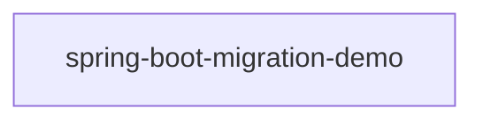

# Architecture Overview

_Generated by the Architect agent (Blueprint Scribe) from a scan on 2026-10-01T03:18:38.265Z._

For a per-class, per-method breakdown (signatures, source locations, resolved call graph, and full source text), see [function-reference.md](./function-reference.md).

## Modules

This workspace is a single-module Maven build: one independently deployable Spring Boot 3.5.0 / Java 17 application (`src/spring-boot-migration-demo/pom.xml`). There is no config server, no discovery server and no service-to-service HTTP traffic. _(Sentence corrected by the Architect agent; the generator's default text described a multi-service Spring Cloud workspace that does not apply here.)_

| Module | Packaging | Key Spring dependencies |
|---|---|---|
| `spring-boot-migration-demo` | jar | spring-boot-starter-web, spring-boot-starter-data-jpa, spring-boot-starter-validation, spring-boot-starter-security, spring-boot-starter-actuator, spring-boot-starter-test |

## Service Map

## Type Breakdown by Layer

Counts are heuristic, based on annotations and naming conventions (e.g. `@RestController` → Controller, `@Repository`/`*Repository` interfaces → Repository).

| Module | Controller | Service | Repository | Entity/Document | DTO | Configuration | Exception Handler | Exception | Other |
|---|---|---|---|---|---|---|---|---|---|
| `spring-boot-migration-demo` | 1 | 1 | 1 | 1 | 3 | 2 | 1 | 2 | 5 |

## REST API Surface

| Method | Path | Handler | Module |
|---|---|---|---|
| `POST` | `/api/v1/employees` | EmployeeController.createEmployee() | `spring-boot-migration-demo` |
| `GET` | `/api/v1/employees` | EmployeeController.getAllEmployees() | `spring-boot-migration-demo` |
| `GET` | `/api/v1/employees/{id}` | EmployeeController.getEmployeeById() | `spring-boot-migration-demo` |
| `PUT` | `/api/v1/employees/{id}` | EmployeeController.updateEmployee() | `spring-boot-migration-demo` |
| `DELETE` | `/api/v1/employees/{id}` | EmployeeController.deleteEmployee() | `spring-boot-migration-demo` |
| `GET` | `/api/v1/employees/high-earners` | EmployeeController.getHighEarners() | `spring-boot-migration-demo` |
| `GET` | `/api/v1/employees/search` | EmployeeController.searchByDepartment() | `spring-boot-migration-demo` |

## Frameworks & External Types in Play

Base classes/interfaces referenced by this codebase that are not defined in it (a proxy for the frameworks the code depends on):

- `RuntimeException` — referenced by 2 type(s)
- `JpaRepository` — referenced by 1 type(s)
- `CommandLineRunner` — referenced by 1 type(s)
- `HealthIndicator` — referenced by 1 type(s)
- `ResponseEntityExceptionHandler` — referenced by 1 type(s)

_Live Neo4j snapshot unavailable (graph-forge/.env not configured or instance unreachable) — showing static artifact analysis only._

## Ideas & Observations

_The Architect agent wrote this section from the source. It is interpretation, not parser output. Per-node context with confidence levels is in `.claude/.pipeline-context/context/descriptions.json` (read it with `.claude/skills/01b-context-weaver/scripts/lookup-context.js`)._

- **Layering:** `EmployeeController` → `EmployeeService` (a concrete class with no interface) → `EmployeeRepository` (Spring Data JPA) → `Employee` entity on the `employees` table. `EmployeeMapper` converts between DTOs and the entity. `GlobalExceptionHandler` maps domain exceptions to 404/409/400/500.
- **Persistence:** the default datasource is an H2 file DB (`jdbc:h2:file:./data/employee_db`, `ddl-auto: update`). The PostgreSQL driver has **test scope only**, so PostgreSQL is exercised only by the Testcontainers-based `EmployeeRepositoryIntegrationTest` (postgres:16); a runtime `DB_URL=jdbc:postgresql:...` would fail at startup.
- **Known defect (high confidence):** `EmployeeService.createEmployee` and `updateEmployee` check email uniqueness with `findByEmployeeNumber(email)` (`EmployeeService.java:37,68`). Duplicate emails are therefore not caught and hit the DB unique constraint, which the catch-all handler returns as 500 instead of 409.
- **Security posture:** HTTP Basic is required for `/api/**` only, with one hard-coded in-memory user (`demo`/`demo123`) and CSRF disabled. Every other path is `permitAll`, including `/actuator/metrics` and the enabled `/h2-console`. `/actuator/health` shows details to anonymous callers. Any authenticated user may perform all CRUD operations, because there are no roles.
- **Serialization:** `JacksonConfig` defines its own `ObjectMapper` bean, so Boot's auto-configured mapper backs off. Null fields are omitted, and Jackson's default `FAIL_ON_UNKNOWN_PROPERTIES=true` likely applies to request bodies (medium confidence).
- **Error shape is not uniform:** domain and validation errors return the app's `ErrorResponse`, while Spring MVC binding errors inherited from `ResponseEntityExceptionHandler` return `ProblemDetail`.
- **Spring Boot 4 migration hotspots** (the code's own MIGRATION-DEMO markers): `JacksonConfig` (Jackson 2→3), `SecurityConfig` (Security 6→7), the JPQL and native queries in `EmployeeRepository`, and the Hibernate settings in `application.yml`. The tests also use the deprecated `@MockBean`.
- **Startup seed:** `DataInitializer` inserts EMP001–EMP005 into any empty DB on every full context start, including `@SpringBootTest`.
- **Graph:** Neo4j was not configured for this run, so Graph Forge did not load a graph and there are no live graph counts above.
