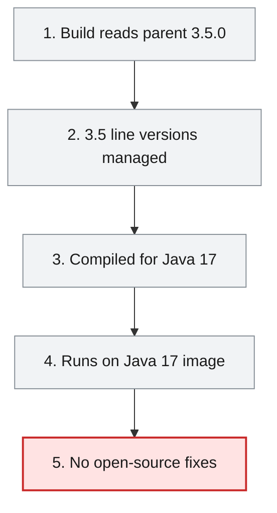
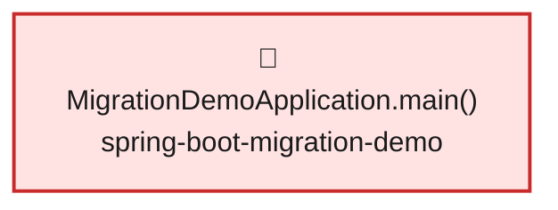

# Root Cause Analysis — ISSUE-001

## Service runs on Spring Boot 3.5.0 / Java 17, a platform line past its open-source support window — must move to Spring Boot 4.1.1 on Java 21

> The employee service is still built on an older generation of its web framework and of Java that no longer gets free security fixes, so any future security hole found in that generation would stay open in this service until it is moved to the supported versions.

_Generated by the Root Cause Analyst agent on 2026-10-01. Evidence collected 2026-10-01T03:25:03.698Z._

## At a glance

| | |
|---|---|
| **What breaks** | `GET /api/v1/employees`, `GET /actuator/health` |
| **Root cause** | The service's build files declare an out-of-support platform baseline — Spring Boot parent 3.5.0 with a Java 17 language level and a Java 17 runtime image — instead of the required Spring Boot 4.1.1 on Java 21. |
| **Where** | `src/spring-boot-migration-demo/pom.xml:19` |
| **Service** | `spring-boot-migration-demo` |
| **Severity** | Medium (Vulnerability) |
| **Confidence** | High |

Issue: [docs/agent_output/00-issues/issue-register.xlsx](../../../docs/agent_output/00-issues/issue-register.xlsx) · Reported 2026-09-30 by Platform dependency review (MARS 04D integration validation fixture) · Status Open

<details><summary>Technical summary</summary>

The spring-boot-migration-demo build pins its platform baseline to an end-of-support line: pom.xml:19 declares spring-boot-starter-parent 3.5.0, pom.xml:24 sets java.version 17, pom.xml:125-126 hard-code maven-compiler-plugin source/target 17, and Dockerfile:4 runs the jar on eclipse-temurin:17-jre. Because the parent BOM manages every Spring and third-party version, the whole service resolves the 3.5 line (mvn dependency:tree: spring-boot-starter 3.5.0, spring-core 6.2.7, spring-security-core 6.5.0, hibernate-core 6.6.15.Final, jackson-databind 2.19.0). The defect is the declared platform baseline in the build files, not any runtime code path; the organisation's standard requires Spring Boot 4.1.1 on Java 21.

</details>

## 1. What was reported

`mvn dependency:tree` resolves Spring Boot 3.5.0 artifacts throughout; the build compiles with `<source>17</source>`/`java.version` 17 and the image runs on a Java 17 JRE.

Source: [docs/agent_output/00-issues/issue-register.xlsx](../../../docs/agent_output/00-issues/issue-register.xlsx)

## 2. What should happen — and what happens instead

```mermaid
flowchart TB
  classDef broken fill:#ffe3e3,stroke:#c92a2a,stroke-width:2px,color:#1a1a1a
  classDef warn fill:#fff3bf,stroke:#e8590c,stroke-width:2px,color:#1a1a1a
  classDef ok fill:#e6fcf5,stroke:#2f9e44,stroke-width:1px,color:#1a1a1a
  classDef neutral fill:#f1f3f5,stroke:#868e96,stroke-width:1px,color:#1a1a1a
  subgraph EXPECTED["✅ What should happen"]
    direction LR
    E0["Build declares a supported<br/>platform"]:::ok
    E1["Parent manages supported<br/>versions"]:::ok
    E0 --> E1
    E2["Code compiles and runs on<br/>Java 21"]:::ok
    E1 --> E2
    E3["Endpoints behave exactly<br/>as before"]:::ok
    E2 --> E3
  end
  subgraph ACTUAL["❌ What actually happens"]
    direction LR
    A0["Build reads parent 3.5.0"]:::neutral
    A1["3.5 line versions managed"]:::neutral
    A0 --> A1
    A2["Compiled for Java 17"]:::neutral
    A1 --> A2
    A3["Runs on Java 17 image"]:::neutral
    A2 --> A3
    A4["No open-source fixes"]:::broken
    A3 --> A4
  end
```



## 3. How it fails, step by step

1. **Build reads parent 3.5.0** — Maven resolves spring-boot-starter-parent 3.5.0 declared at pom.xml:19 as the platform BOM for the module.
2. **3.5 line versions managed** — Every version-less starter resolves to the 3.5 line: Spring Framework 6.2.7, Spring Security 6.5.0, Hibernate 6.6.15.Final, Jackson 2.19.0.
3. **Compiled for Java 17** — java.version 17 (pom.xml:24) and the compiler plugin's source/target 17 (pom.xml:125-126) fix the bytecode level at Java 17.
4. **Runs on Java 17 image** — Dockerfile:4 starts the packaged jar on eclipse-temurin:17-jre, and MigrationDemoApplication.main() boots the 3.5 stack.
5. **No open-source fixes** — Every endpoint and the HTTP Basic security filter chain run on a platform line that, per the issue, no longer receives open-source security fixes.



## 4. Where the defect is

> **The service's build files declare an out-of-support platform baseline — Spring Boot parent 3.5.0 with a Java 17 language level and a Java 17 runtime image — instead of the required Spring Boot 4.1.1 on Java 21.**

**Location:** `src/spring-boot-migration-demo/pom.xml:19`



pom.xml:16-21 makes spring-boot-starter-parent 3.5.0 the parent of the only module, so its dependency management fixes the version of every starter declared without a version (web, data-jpa, validation, security, actuator, test at pom.xml:31-86) and of spring-security-test and the H2/PostgreSQL drivers. Running the issue's reproduction confirmed this: `mvn help:evaluate -Dexpression=project.parent.version` returned 3.5.0 and the filtered `mvn dependency:tree` resolved spring-boot-starter 3.5.0, spring-core 6.2.7, spring-security-core 6.5.0, hibernate-core 6.6.15.Final and jackson-databind 2.19.0. The language level is pinned twice — `<java.version>17</java.version>` at pom.xml:24 and an explicit `<source>17</source>`/`<target>17</target>` on maven-compiler-plugin at pom.xml:125-126 — and the runtime is pinned a third time by `FROM eclipse-temurin:17-jre` at Dockerfile:4. The evidence bundle resolves the issue's symbol to MigrationDemoApplication.main() (MigrationDemoApplication.java:9-11), the SpringApplication.run entry point that boots everything on top of that platform, and places GET /api/v1/employees and GET /actuator/health on the reaching path; the runtime code itself is not defective — it simply executes on whatever platform the build files select. The reported symptom (security fixes no longer published in open source for the 3.5 line) follows directly from that version selection.

**The code involved**

| Method | Service | File | Calls | Called by |
|---|---|---|---|---|
| `MigrationDemoApplication.main()` | `spring-boot-migration-demo` | [MigrationDemoApplication.java:9-11](../../../src/spring-boot-migration-demo/src/main/java/com/example/migrationdemo/MigrationDemoApplication.java#L9-L11) | _none_ | _entry point_ |

<details><summary>Show the source of each method</summary>

**`MigrationDemoApplication.main()`** — `src/spring-boot-migration-demo/src/main/java/com/example/migrationdemo/MigrationDemoApplication.java` lines 9-11

```java
public static void main(String[] args) {
        SpringApplication.run(MigrationDemoApplication.class, args);
    }
```

</details>

## 5. What it means

The defect is not a functional failure: the service builds (dependency:tree ended in BUILD SUCCESS) and its endpoints work today. The consequence is exposure over time — the single module spring-boot-migration-demo, including GET /api/v1/employees behind HTTP Basic and the anonymous GET /actuator/health, runs entirely on the Spring Boot 3.5 / Spring Framework 6.2 / Spring Security 6.5 stack, so a security advisory published against that line would have no open-source patch to pull in, and the authentication boundary itself depends on the unmaintained Spring Security version. It also places the service outside the organisation's platform standard (Spring Boot 4.1.1 on Java 21).

**Why Medium severity:** Medium is appropriate. No specific exploitable CVE against the resolved 3.5.0 artifacts was identified in the evidence, so this is not High/Critical today; but the platform underpins every endpoint and the authentication boundary, and the risk grows with every advisory published after support ends, so it is more than Low.

## 6. Why it happened

- The Java level is declared in three independent places (pom.xml:24, pom.xml:125-126, Dockerfile:4), so a partial bump would leave the build and runtime inconsistent.
- Testcontainers is pinned explicitly to 1.20.1 at pom.xml:92,99,106 outside the parent's dependency management, so it will not move with the platform upgrade and must be reconciled by hand.
- The code carries known Spring Boot 4 migration hotspots marked MIGRATION-DEMO and listed in architecture.md: a hand-built Jackson 2 ObjectMapper bean (JacksonConfig.java), the Spring Security 6 filter chain (SecurityConfig.java), the JPQL and native queries in EmployeeRepository.java, the Hibernate settings in application.yml, and the deprecated @MockBean in EmployeeControllerTest.java:12,34. These make the upgrade more than a version bump, which is a plausible reason it was deferred.
- No build-time check (e.g. an enforcer rule or dependency-currency gate) flags an end-of-support platform parent.

## 7. How to fix it

Move the platform baseline itself rather than patching individual libraries: change the parent to spring-boot-starter-parent 4.1.1 and the language/runtime level to Java 21 in every place it is declared, then repair the compile, configuration and test breakages the new generation introduces (Jackson 3, Spring Security 7, Hibernate under Boot 4, test-annotation changes) until the build is green on JDK 21. This resolves the cause because the parent BOM is what selects every managed version; bumping individual artifacts under a 3.5.0 parent would leave the unsupported platform in place. The acceptance bar from the issue is unchanged API behaviour — same endpoints, status codes, payloads and authentication boundary — so the migration must be followed by a before/after behavioural comparison, not just a compile.

| File | Change |
|---|---|
| [pom.xml](../../../src/spring-boot-migration-demo/pom.xml) | Line 19: parent version 3.5.0 -> 4.1.1. Line 24: java.version 17 -> 21. Lines 125-126: compiler source/target 17 -> 21 (or replace with release driven by java.version). Lines 92/99/106: reconcile the explicit Testcontainers 1.20.1 pins with what Boot 4.1.1 manages. |
| [Dockerfile](../../../src/spring-boot-migration-demo/Dockerfile) | Line 4: FROM eclipse-temurin:17-jre -> eclipse-temurin:21-jre. |
| [JacksonConfig.java](../../../src/spring-boot-migration-demo/src/main/java/com/example/migrationdemo/config/JacksonConfig.java) | Port the hand-built com.fasterxml.jackson ObjectMapper bean to the Jackson generation Boot 4 uses, preserving ISO-8601 dates and NON_NULL inclusion so response payloads do not change. |
| [SecurityConfig.java](../../../src/spring-boot-migration-demo/src/main/java/com/example/migrationdemo/config/SecurityConfig.java) | Re-validate the filter chain against Spring Security 7 so /api/** stays HTTP-Basic-authenticated and /actuator/health and /actuator/info stay permitAll. |
| [EmployeeControllerTest.java](../../../src/spring-boot-migration-demo/src/test/java/com/example/migrationdemo/controller/EmployeeControllerTest.java) | Replace the deprecated @MockBean (lines 12, 34) with the supported Spring test mock annotation and fix any moved test-slice imports. |

<details><summary>Sketch of the change</summary>

```java
<!-- illustrative only, not an applied patch -->
<parent>
    <groupId>org.springframework.boot</groupId>
    <artifactId>spring-boot-starter-parent</artifactId>
    <version>4.1.1</version>
    <relativePath/>
</parent>
<properties>
    <java.version>21</java.version>
</properties>
```

</details>

## 8. How to check the fix worked

1. In src/spring-boot-migration-demo run `mvn -q help:evaluate -Dexpression=project.parent.version -DforceStdout` and expect 4.1.1.
2. Run `mvn dependency:tree` and confirm no org.springframework.boot artifact resolves at 3.5.x.
3. Check the Detection Notes markers are gone: grep pom.xml and Dockerfile for `<version>3.5.0`, `<java.version>17`, `<source>17` and `eclipse-temurin:17-jre` and expect no matches.
4. Run `mvn verify` on JDK 21 (including the Testcontainers-based EmployeeRepositoryIntegrationTest with Docker available) and expect a green build.
5. Compare behaviour before and after: GET /api/v1/employees returns 401 without credentials and 200 with demo/demo123, GET /actuator/health returns 200 anonymously, and create/read payloads (ISO-8601 dates, null fields omitted) and error status codes are identical to the 3.5.0 baseline.

## 9. How to stop it happening again

- Add a CI gate (e.g. maven-enforcer or a dependency-currency check) that fails when the Spring Boot parent is on a line outside its open-source support window.
- Declare the Java level once (java.version) and derive the compiler release and container base image from it, so the three declarations cannot drift.
- Let the platform BOM manage Testcontainers instead of pinning it explicitly, so it moves with platform upgrades.
- Schedule platform upgrades before each line's support end date rather than after it.

## 10. Open questions

- The exact open-source support end date for Spring Boot 3.5.x was not verified in this run (no network lookup to spring.io); the issue itself asks for it to be confirmed.
- Whether specific published CVEs already affect the resolved 3.5.0 artifacts was not checked; the evidence only establishes the version line.
- The full set of Boot 4 compile breaks (e.g. whether DatabaseHealthIndicator's org.springframework.boot.actuate.health imports or the @WebMvcTest import in EmployeeControllerTest moved packages) can only be settled by building against 4.1.1 on JDK 21.
- Which Testcontainers version Spring Boot 4.1.1 manages, and whether the 1.20.1 pins must change, is not in the evidence.
- Neo4j was not configured, so caller/endpoint facts come from the static artifacts.json call graph only; no live graph cross-check was possible.

## Appendix — how this was determined

| Input | Detail |
|---|---|
| Issue report | [docs/agent_output/00-issues/issue-register.xlsx](../../../docs/agent_output/00-issues/issue-register.xlsx) |
| Architecture document | [docs/agent_output/01-architecture/architecture.md](../../../docs/agent_output/01-architecture/architecture.md) |
| Function reference | [docs/agent_output/01-architecture/function-reference.md](../../../docs/agent_output/01-architecture/function-reference.md) |
| Code scan | `.claude/.pipeline-context/artifacts.json` (generated 2026-10-01T03:18:38.265Z) |
| Knowledge graph | not used — No Neo4j credentials found (looked for .env). Falling back to artifacts.json. |

<details><summary>Architecture observations considered</summary>

- **Layering:** `EmployeeController` → `EmployeeService` (a concrete class with no interface) → `EmployeeRepository` (Spring Data JPA) → `Employee` entity on the `employees` table. `EmployeeMapper` converts between DTOs and the entity. `GlobalExceptionHandler` maps domain exceptions to 404/409/400/500.
- **Persistence:** the default datasource is an H2 file DB (`jdbc:h2:file:./data/employee_db`, `ddl-auto: update`). The PostgreSQL driver has **test scope only**, so PostgreSQL is exercised only by the Testcontainers-based `EmployeeRepositoryIntegrationTest` (postgres:16); a runtime `DB_URL=jdbc:postgresql:...` would fail at startup.
- **Known defect (high confidence):** `EmployeeService.createEmployee` and `updateEmployee` check email uniqueness with `findByEmployeeNumber(email)` (`EmployeeService.java:37,68`). Duplicate emails are therefore not caught and hit the DB unique constraint, which the catch-all handler returns as 500 instead of 409.
- **Security posture:** HTTP Basic is required for `/api/**` only, with one hard-coded in-memory user (`demo`/`demo123`) and CSRF disabled. Every other path is `permitAll`, including `/actuator/metrics` and the enabled `/h2-console`. `/actuator/health` shows details to anonymous callers. Any authenticated user may perform all CRUD operations, because there are no roles.
- **Serialization:** `JacksonConfig` defines its own `ObjectMapper` bean, so Boot's auto-configured mapper backs off. Null fields are omitted, and Jackson's default `FAIL_ON_UNKNOWN_PROPERTIES=true` likely applies to request bodies (medium confidence).
- **Error shape is not uniform:** domain and validation errors return the app's `ErrorResponse`, while Spring MVC binding errors inherited from `ResponseEntityExceptionHandler` return `ProblemDetail`.
- **Spring Boot 4 migration hotspots** (the code's own MIGRATION-DEMO markers): `JacksonConfig` (Jackson 2→3), `SecurityConfig` (Security 6→7), the JPQL and native queries in `EmployeeRepository`, and the Hibernate settings in `application.yml`. The tests also use the deprecated `@MockBean`.
- **Startup seed:** `DataInitializer` inserts EMP001–EMP005 into any empty DB on every full context start, including `@SpringBootTest`.
- **Graph:** Neo4j was not configured for this run, so Graph Forge did not load a graph and there are no live graph counts above.

</details>

_No Cypher was run: No Neo4j credentials found (looked for .env). Falling back to artifacts.json._ Call-graph facts came from the code scan, using the same resolution rules Graph Forge applies when it builds the graph.

---

The reported symptom, the code table, the source and the call paths are rendered verbatim from the issue, the code scan and the knowledge graph. The plain-language summary, the causal chain, the root cause, what it means, why it happened, the fix, the verification steps and the prevention measures are the judgement of the Root Cause Analyst agent.
