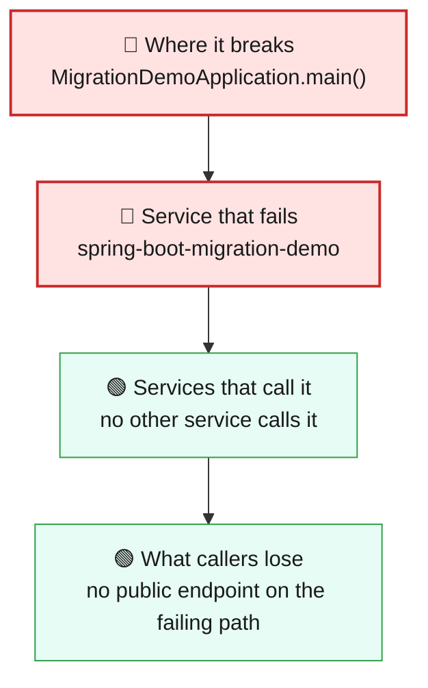
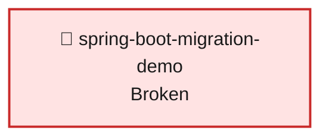

# Blast Radius — ISSUE-001

## Service runs on Spring Boot 3.5.0 / Java 17, a platform line past its open-source support window — must move to Spring Boot 4.1.1 on Java 21

> Nothing stops working today, but the whole employee service sits on a framework and Java generation that no longer gets free security fixes, so every part of it stays exposed to any future security flaw found in that generation.

_Generated by the Blast Radius Analyst on 2026-10-01. Reach measured 2026-10-01T03:27:45.595Z._

## At a glance

| | |
|---|---|
| **Priority** | P3 — no outage or data loss today; a time-boxed platform exposure that grows with each new advisory, so schedule it for the next release rather than as an emergency |
| **Severity** | Medium |
| **How far it spreads** | One endpoint |
| **Services broken** | `spring-boot-migration-demo` |
| **Services degraded** | none |
| **Endpoints down** | 0 of 7 |
| **Scheduled jobs hit** | 0 |
| **Confidence** | Medium |

Root cause: [docs/agent_output/02-root-cause/root_cause_ISSUE-001.md](../../../docs/agent_output/02-root-cause/root_cause_ISSUE-001.md) · Issue: [docs/agent_output/00-issues/issue-register.xlsx](../../../docs/agent_output/00-issues/issue-register.xlsx)

## 1. What is broken

No request fails because of this issue. The employee service builds, starts and answers all of its requests normally. What is wrong is the foundation it is built on: the web framework and the Java version it is compiled for and run on are an older generation that is outside its free (open-source) support window. That makes this an exposure problem rather than an outage: the risk is the same for every request the service handles, and it grows each time a new security advisory is published against that older generation, because no free patch will follow. In the tables below the service is marked red only because it carries the defect; its endpoints are marked as still working because none of them fails.

## 2. How far it spreads

| Ring | What it means |
|---|---|
| 🔴 Where it breaks | `MigrationDemoApplication.main()` |
| 🔴 Service that fails | Every capability of the employee service — listing, searching, viewing, creating, updating and deleting employee records, plus the high-earner report — runs on the same out-of-support foundation, including the sign-in check that guards them. None of them fails today; all of them share the same exposure, because the foundation is chosen once for the whole service. |
| 🟢 Services that call it | No other service in this workspace calls the employee service over the network, and this workspace contains only this one service, so nothing downstream is degraded. |
| 🟢 Wider platform | No shared discovery server, configuration server or shared data store was detected, so no neighbouring service is put at risk through shared infrastructure. |

## 3. Which services are affected

| Service | Status | What happens to it |
|---|---|---|
| `spring-boot-migration-demo` | 🔴 Broken | Contains the defect. This is where the failure starts. |

## 4. Which endpoints are affected

_No endpoint is affected — the defect is not reachable from the REST surface._

## 6. Who feels it

| Who | What they experience | Status |
|---|---|---|
| Any API client or person using the employee records service | Nothing different today: every employee request works as before. The risk is invisible until a security flaw is published for the old framework generation, at which point there is no free patch to apply. | At risk |
| HR staff whose employee records (names, departments, salaries) are held by the service | No change in day-to-day use, but the data sits behind a sign-in check whose underlying security library no longer receives free fixes. | At risk |
| Security, compliance and platform owners | The service is outside the organisation's platform standard and will show up on version-currency and vulnerability reviews until it is moved to the supported generation. | At risk |

## 7. What is NOT affected

Scoping the damage matters as much as describing it.

- All seven employee endpoints keep working: listing, searching by department, the high-earner report, viewing, creating, updating and deleting employees return the same results as before.
- Stored employee data is not damaged, lost or altered by this issue.
- The sign-in requirement on the employee endpoints still applies; this issue does not open or weaken access today.
- The service still builds and starts; this is not an outage and nothing needs to be switched off.
- No other service is affected: nothing else in the workspace calls this service, and no shared data store, discovery or configuration server was found.
- No scheduled or background jobs run through the defect.

## 8. Containment and priority

**Priority:** P3 — no outage or data loss today; a time-boxed platform exposure that grows with each new advisory, so schedule it for the next release rather than as an emergency

**If it is not fixed:** Each security advisory published against the old framework, security library or Java generation after its support ends becomes a permanent open hole in this service with no free patch. The gap to the supported generation also widens, making the eventual upgrade larger and riskier, and the service stays outside the organisation's platform standard.

**Containment steps**

- Do not take the service offline — there is no functional failure to contain.
- Subscribe the owning team to security advisories for the framework generation in use and review each one against this service until the upgrade lands.
- Keep the service's network exposure as narrow as possible (internal network only, behind the existing sign-in) while it remains on the out-of-support generation.
- Record the service as an accepted, time-boxed exception to the platform standard and plan the upgrade into the next release window; the corrective change is described in the root cause report.

The fix itself is in the root cause report: [Recommended Fix](../../../docs/agent_output/02-root-cause/root_cause_ISSUE-001.md).

## 9. Open questions

- The root cause report also names the anonymous health-check endpoint and states that the employee listing endpoint is on the reaching path; the measured reach lists neither a health-check endpoint nor any endpoint whose handler reaches the defect site (the defect is in the build files, not in a request path). Both views agree no request fails; whether the health-check endpoint should be counted in the inventory is unresolved.
- Whether specific published security advisories already affect the resolved framework versions was not checked, so the exposure today may be higher than 'at risk'.
- The exact end date of free support for the framework generation in use was not verified in this run.
- How widely the service is exposed on the network (internal only or reachable from outside) is not visible in the code and changes how urgent the exposure is.
- The knowledge graph was not available for this run (Neo4j not configured), so reach comes from the static code scan only, with no live cross-check.

## Appendix — how this was measured

| Input | Detail |
|---|---|
| Root cause report | [docs/agent_output/02-root-cause/root_cause_ISSUE-001.md](../../../docs/agent_output/02-root-cause/root_cause_ISSUE-001.md) |
| Issue report | [docs/agent_output/00-issues/issue-register.xlsx](../../../docs/agent_output/00-issues/issue-register.xlsx) |
| Architecture document | [docs/agent_output/01-architecture/architecture.md](../../../docs/agent_output/01-architecture/architecture.md) |
| Function reference | [docs/agent_output/01-architecture/function-reference.md](../../../docs/agent_output/01-architecture/function-reference.md) |
| Code scan | `.claude/.pipeline-context/artifacts.json` |
| Knowledge graph | not used — No Neo4j credentials found (looked for .env). Reach computed from artifacts.json. |

**Rules used to assign status**

- 🔴 **Broken** — the service contains the defect, or an endpoint whose handler reaches it
- 🟠 **Degraded** — the service calls a broken service over HTTP; its own code is sound
- 🟡 **At risk** — shares infrastructure with a broken service
- 🟢 **Unaffected** — no code path and no HTTP call to anything broken

Scope for this issue is **endpoint**, so only endpoints whose handler reaches the defect are marked down.

---

Sections 3, 4, 5 and 7 (service lists) are measured from the code scan and the knowledge graph. Sections 1, 2 (ring descriptions), 6 and 8 are the analyst's judgement, scoped to that measurement.
