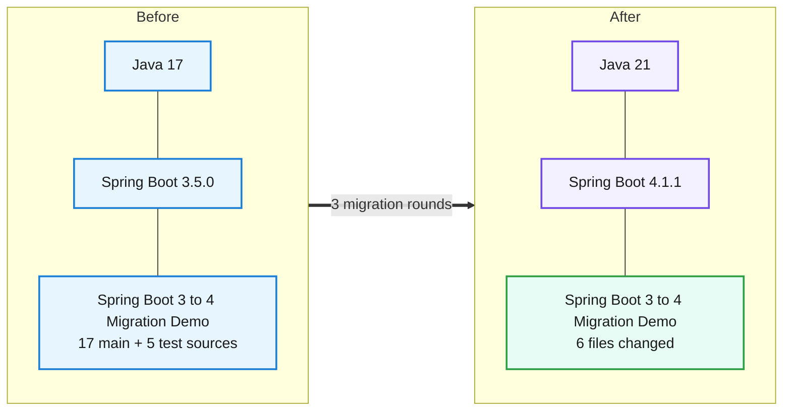
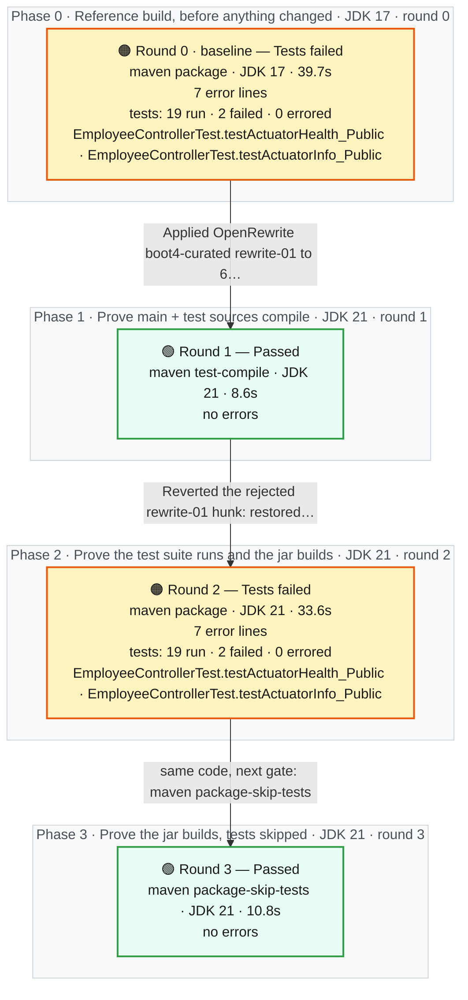
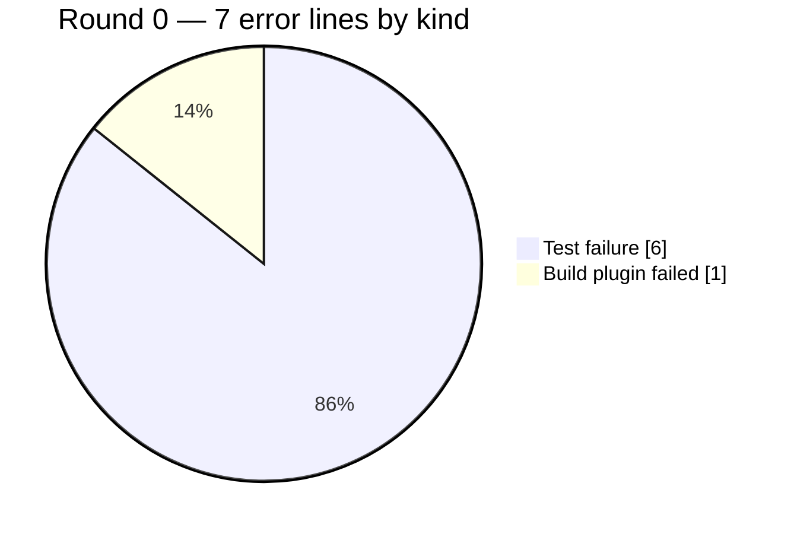

# Migration Report — Spring Boot 3.5.0 to 4.1.1 on Java 21 (ISSUE-001)

## Spring Boot 3 to 4 Migration Demo

    

> The employee service moved from Spring Boot 3.5.0 on Java 17 to Spring Boot 4.1.1 on Java 21 in a sandbox copy; the real project was not touched. Every source change was made by one previewed and inspected OpenRewrite recipe (parent, Java level, test starters, Jackson 3, actuator health package, mocking annotation, test-slice imports, container base image); two of its proposals were rejected (removing the error-timestamp format and un-pinning only one Testcontainers artifact). The test suite has exactly the same result as before the upgrade (19 run, the same 2 pre-existing failures), and all 19 runtime probes return the same HTTP status before and after, with identical application payloads apart from generated timestamps. Some framework-owned responses did change shape — the default 401 error timestamp, the WWW-Authenticate header, the malformed-JSON problem body (no more "type":"about:blank") and the health document (two new components) — and a human must confirm API consumers accept these before the migration is applied. Approval was programmatically granted for controlled pipeline validation; this does not replace the production human approval requirement.

_Generated by the Version Migration skill on 2026-10-01. Every version, error count and response below is read from a recorded run, not from memory._

## At a glance

| | |
|---|---|
| **Result** | 🟢 **Passed** on the final build |
| **Platform** | Spring Boot `3.5.0` → `4.1.1` |
| **Language** | Java `17` → `21` |
| **Build rounds** | 4 recorded — 1 pre-migration baseline, 1 that failed and were read for what to change next, 2 green |
| **Files changed** | 6 — `Dockerfile`, `pom.xml`, `src/main/java/com/example/migrationdemo/config/JacksonConfig.java`, `src/main/java/com/example/migrationdemo/health/DatabaseHealthIndicator.java`, `src/test/java/com/example/migrationdemo/controller/EmployeeControllerTest.java`, `src/test/java/com/example/migrationdemo/integration/EmployeeRepositoryIntegrationTest.java` |
| **Dependency changes** | 7 |
| **Source changes forced by the upgrade** | 7 |
| **Test suite** | before: 19 run, 2 failed, 0 errors → after: 19 run, 2 failed, 0 errors — 🟡 the same 2 pre-existing failures — none introduced |
| **Runtime behaviour** | 🟡 same status on all 19, body differs on 17 |
| **Migration plan** | recorded before any change — 13 predicted impacts, 1 deterministic candidate |
| **Deterministic transformations** | 🟢 1 applied · 🔍 1 previewed — OpenRewrite |
| **Requested target** | `4.1.1` — final build declares `4.1.1` 🟢 matches |
| **Reference followed** | `references/spring-boot-3-to-4.md` |
| **Build tool** | maven — Apache Maven 3.9.9 (8e8579a9e76f7d015ee5ec7bfcdc97d260186937) |

## 0. What was understood before anything changed

> Everything in this section was written **before** any version or source changed — it is a prediction, and it is shown next to what the build, the tests and the probes then actually did. A predicted impact is never evidence that something failed.

### 0.1 Target and path

| | |
|---|---|
| **Source** | Spring Boot `3.5.0` · Java `17` |
| **Requested target** | Spring Boot `4.1.1` · Java `21` — _as requested; never "latest", never a recipe's own target_ |
| **Path** | `3.5.0` → `4.1.1` (single hop — baseline.json migration_path.status SUPPORTED, one eligible pack (spring-boot-3-to-4)) |
| **Preparation line** | `3.5.x` — 🟢 the source is on it<br/>baseline.json migration_path.on_preparation_line = true (source line 3.5 = pack preparation line 3.5); no preparation hop, so boot35-preparation is not selected (the pack says it proposes only modernisations on a 3.5.x project). |

### 0.2 Constraints and compatibility questions

| | Constraint | Status in the plan | At the end | Evidence |
|---|---|---|---|---|
| 🟢 | **C1** A JDK 21 is available for every target round and the final probe | satisfied | — | baseline.json toolchain: JDK 21.0.11 (MIGRATION_JDK_21) and JDK 17.0.20.1 |
| ❓ | **C2** spring-boot-starter-parent 4.1.1 and the artifacts it manages resolve from the configured repositories _(blocking)_ | unresolved | resolved | Rounds 1-3 resolved and built against spring-boot-starter-parent 4.1.1. |
| ❓ | **C3** The explicitly pinned Testcontainers 1.20.1 artifacts still work with the Boot 4.1.1 test stack (JUnit/Spring test versions managed by the new BOM) | unresolved | resolved | Round 2: EmployeeRepositoryIntegrationTest 5/5 pass with Testcontainers 1.20.1 under the Boot 4.1.1 test stack (JUnit Jupiter 6.0.3). |
| ❓ | **C4** Spring Framework 7, Spring Security 7, Hibernate ORM 7 and Jackson 3 are what Boot 4.1.1 manages | unresolved | resolved | dependency:tree: spring-core 7.0.9, spring-security-core 7.1.1, hibernate-core 7.4.5.Final, tools.jackson.core:jackson-databind 3.1.5. |
| ⚪ | **C5** No ecosystem platform BOM (Spring Cloud, springdoc) needs a compatible release train | not-applicable | — | baseline.json migration_path.ecosystem_boms_present = [] and observations.platform_boms lists only the Boot parent |
| 🟢 | **C6** The source is on the pack's 3.5.x preparation line | satisfied | — | baseline.json migration_path.on_preparation_line = true |
| ❓ | **C7** The container image runs the Java level the build targets | unresolved | resolved | Dockerfile declares eclipse-temurin:21-jre; the image itself was not built in the sandbox (manual follow-up). |
| ❓ | **C8** The REST contract (endpoints, status codes, payload shape, authentication boundary) is unchanged _(blocking)_ | unresolved | unresolved | Endpoints, status codes, authentication boundary and application-owned payloads are unchanged, but framework-owned responses changed shape (401 default error timestamp, WWW-Authenticate charset, ProblemDetail type omission, health components). Whether that meets the issue's 'unchanged payloads' bar is a consumer-facing decision for a human. |

### 0.3 Predicted impact vs what actually happened

_The build, transformation and patch columns are facts about the **file**; several impact entries can share one file (a build descriptor, say). Whether this particular impact was real is the agent review's column._

| Impact | File | Area · rule | Risk | Predicted handling | File named by a failing build | File changed by a transformation | File in final patch | Agent review |
|---|---|---|---|---|---|---|---|---|
| **I1** | `pom.xml` | Platform parent · section 1.1 | low | deterministic | never named by a build | rewrite-01 | ✏️ yes | handled-by-transformation — Parent 4.1.1 by UpgradeParentVersion; help:evaluate = 4.1.1; dependency:tree has no 3.5.x Boot artifact. |
| **I2** | `pom.xml` | Language level · section 1.2 | medium | either | never named by a build | rewrite-01 | ✏️ yes | handled-by-transformation — UpgradeJavaVersion moved java.version and normalised the compiler to &lt;release&gt;${java.version}&lt;/release&gt;; no residual… |
| **I3** | `pom.xml` | Starters · sections 1.3, 4.3, 4.4 | medium | deterministic | never named by a build | rewrite-01 | ✏️ yes | handled-by-transformation — Security-test, webmvc-test and data-jpa-test starters by MigrateToModularStarters. spring-boot-starter-web was not… |
| **I4** | `pom.xml` | Pinned third-party test libraries · sections 1.4, 14 (pinned libraries) | low | residual | never named by a build | rewrite-01 | ✏️ yes | not-needed — Testcontainers 1.20.1 pins work under Boot 4.1.1 (5/5 integration tests pass); the recipe's partial un-pinning was… |
| **I5** | `src/main/java/com/example/migrationdemo/config/JacksonConfig.java` | JSON handling · sections 2.1, 2.2 | high | either | never named by a build | rewrite-01 | ✏️ yes | handled-by-transformation — Jackson 3 JsonMapper builder; serialization probes keep ISO-8601 dates and NON_NULL. |
| **I6** | `src/main/java/com/example/migrationdemo/health/DatabaseHealthIndicator.java` | Actuator health · section 3 | medium | either | never named by a build | rewrite-01 | ✏️ yes | handled-by-transformation — Health imports relocated; health probe still UP with the custom 'database' component. |
| **I7** | `src/test/java/com/example/migrationdemo/controller/EmployeeControllerTest.java` | Test layer · sections 4.1, 4.2, 4.3, 4.4 | high | either | never named by a build | rewrite-01 | ✏️ yes | handled-by-transformation — Same 9 tests / same 2 pre-existing failures as round 0; @WithMockUser tests pass. |
| **I8** | `src/test/java/com/example/migrationdemo/integration/EmployeeRepositoryIntegrationTest.java` | Test layer (JPA slice) · section 4.3 | medium | either | never named by a build | rewrite-01 | ✏️ yes | handled-by-transformation — 5/5 integration tests pass on postgres:16. |
| **I9** | `src/main/java/com/example/migrationdemo/config/SecurityConfig.java` | Spring Security 7 · section 5 | low | residual | never named by a build | — | no | not-needed — Lambda DSL compiled unchanged on Spring Security 7.1.1; security-boundary probes keep 401/401/200 and anonymous… |
| **I10** | `src/main/java/com/example/migrationdemo/repository/EmployeeRepository.java` | Hibernate 7 queries · section 6 | low | residual | never named by a build | — | no | not-needed — JPQL and native queries unchanged on Hibernate 7.4.5; integration tests and query probes match. |
| **I11** | `src/main/resources/application.yml` | Configuration properties · section 7 | low | either | never named by a build | — | no | not-needed — No property needed renaming; actuator exposure and NON_NULL output unchanged. The health document gained probe… |
| **I12** | `Dockerfile` | Runtime image · section 8 | medium | residual | never named by a build | rewrite-01 | ✏️ yes | handled-by-transformation — Predicted residual, but the recipe's UpgradeJavaVersion/UpgradeDockerImageVersion changed the base image; image not… |
| **I13** | `src/main/java/com/example/migrationdemo/exception/GlobalExceptionHandler.java` | Web error handling · section 9 (compile symptoms) / agent judgement | low | residual | never named by a build | — | no | not-needed — handleMethodArgumentNotValid override compiled unchanged on Framework 7; 400 validation body unchanged apart from… |

**Every changed file was predicted by the plan.**

### 0.4 Which probes protect which impact

| Probe | Category | Protects | Replayed |
|---|---|---|---|
| list employees unauthenticated is 401 | security-boundary | I3, I9 | 🟢 before and after |
| list employees bad credentials is 401 | security-boundary | I9 | 🟢 before and after |
| list employees authenticated | business-api | I1, I5, I9 | 🟢 before and after |
| get employee 1 | serialization | I5 | 🟢 before and after |
| create employee | serialization | I5, I10 | 🟢 before and after |
| create employee without department omits null | serialization | I5, I11 | 🟢 before and after |
| actuator health anonymous | actuator | I6, I9, I11 | 🟢 before and after |
| actuator info anonymous | actuator | I9, I11 | 🟢 before and after |
| actuator metrics anonymous | actuator | I11 | 🟢 before and after |
| high earners native query | business-api | I10 | 🟢 before and after |
| search by department | business-api | I10 | 🟢 before and after |
| get employee not found is 404 | error-contract | I13 | 🟢 before and after |
| create duplicate employee number is 409 | error-contract | I13 | 🟢 before and after |
| create invalid is 400 | error-contract | I13 | 🟢 before and after |
| malformed json is 400 | error-contract | I5, I13 | 🟢 before and after |
| update employee 2 | business-api | I10 | 🟢 before and after |
| delete employee 5 | business-api | I10 | 🟢 before and after |
| _none_ | test-suite | I4, I7, I8 | ⚪ not observable — test-layer and Testcontainers impact is observed by the project's own suite (package goal, same as round 0), not by an HTTP probe |
| _none_ | other | I12 | ⚪ not observable — no container image is built or run in the sandbox; the Dockerfile change is verified by file review only |
| _none_ | other | I2 | ⚪ not observable — language level is proven by the target rounds running on JDK 21 and the final probe running the jar on JDK 21 |

### 0.5 Out of scope, and when to stop

**Out of scope:**

- The pre-existing EmployeeService defect that checks email uniqueness with findByEmployeeNumber(email) — behaviour must stay identical, defects included
- The two pre-existing round-0 failures EmployeeControllerTest.testActuatorHealth_Public / testActuatorInfo_Public (404 in the @WebMvcTest slice) — not fixed by the migration
- Testcontainers 2.x migration
- Changing the error timestamp format (@JsonFormat on ErrorResponse) or any DTO/entity shape
- H2 console security rules, frame options or CORS
- Replacing @WithMockUser with real credentials, or any other test-quality improvement
- docker-compose.yml postgres image version
- Formatting, import ordering, refactoring

**Stop conditions:**

- spring-boot-starter-parent 4.1.1 cannot be resolved (C2)
- A business-api or security-boundary probe changes status between baseline and final and the cause is not within the migration's scope
- A required transformation is unavailable (none is required: boot4-curated is optional)
- The test suite shows new failures against round 0 that cannot be traced to a pack rule


## 1. What moved



| | What | Before | After | Why it moved |
|---|---|---|---|---|
| ⬆️ | `Java (language level)` | `17` | `21` | Runtime baseline required by the new platform version. |
| ⬆️ | `Spring Boot (platform)` | `3.5.0` | `4.1.1` | The version jump this migration is about. |
| ⬆️ | `org.springframework.boot:spring-boot-starter-parent` | `3.5.0` | `4.1.1` | The parent BOM selects every managed version; set to the exactly requested 4.1.1 by the curated recipe (section 1.1). |
| ⬆️ | `java.version` | `17` | `21` | Java 21 is the requested target language level (section 1.2). |
| ⬆️ | `maven-compiler-plugin <source>/<target>` | `17 / 17` | `<release>${java.version}</release> (21)` | A stale explicit &lt;source&gt;17 would override java.version and keep compiling at 17 (section 1.2). |
| 🔀 | `org.springframework.security:spring-security-test` | `spring-security-test` | `org.springframework.boot:spring-boot-starter-security-test` | Boot 4 carries the MockMvc security-test auto-configuration that @WithMockUser needs in its own starter (section 4.4). |
| ➕ | `org.springframework.boot:spring-boot-starter-webmvc-test` | `absent` | `4.1.1 (managed)` | @WebMvcTest moved module and package in Boot 4 (section 4.3). |
| ➕ | `org.springframework.boot:spring-boot-starter-data-jpa-test` | `absent` | `4.1.1 (managed)` | @DataJpaTest moved module and package in Boot 4 (section 4.3). |
| ⬆️ | `Dockerfile FROM eclipse-temurin` | `17-jre` | `21-jre` | The container must run the Java level the build targets (section 8). |

## 2. How the migration went

**4 build rounds**, 1.5 min of build time in total. Round 0 is the pre-migration reference build on JDK 17; every later round ran on JDK 21. 2 of them came back with errors, 2 came back clean. A red round is not a setback here — it is the output the migration is driven by: each one names the exact files or tests the next change has to touch. Apart from the 1 deterministic transformation in §2.4 — each previewed, inspected and then applied to the sandbox, and each built immediately — nothing was edited that a build, a test or a probe had not first complained about. The migration ends on round 3, 🟢 **Passed**.



### 2.1 The round ledger

| Round | Ran on | Goal | Outcome | Errors | Took | What it told us |
|---|---|---|---|---|---|---|
| **0**<br/>_(baseline)_ | JDK 17 | `package`<br/>_the test suite runs and the jar builds_ | 🟠 Tests failed | 7 | 39.7s | **2 tests failed an assertion**<br/>failing tests: `EmployeeControllerTest.testActuatorHealth_Public` · `EmployeeControllerTest.testActuatorInfo_Public`<br/>The untouched project on JDK 17 compiles and packages up to the test phase; 19 tests ran, 17 passed. The two failures (EmployeeControllerTest actuator health/info expecting 200 but getting 404) are pre-existing: a @WebMvcTest slice does not register actuator endpoints. |
| **1** | JDK 21 | `test-compile`<br/>_main + test sources compile_ | 🟢 Passed | — | 8.6s | **Nothing failed** — main + test sources compile on JDK 21.<br/>The previewed boot4-curated recipe (rewrite-00 inspected, applied as rewrite-01 with ErrorResponse.java excluded) moved the parent, Java level, test starters, Jackson 3, health package, mocking annotation and slice imports in one step, so main and test code compiled on JDK 21 at the first attempt — none of the section 2/3/4 compile symptoms the plan predicted surfaced because the recipe pre-empted them. |
| **2** | JDK 21 | `package`<br/>_the test suite runs and the jar builds_ | 🟠 Tests failed | 7 | 33.6s | **2 tests failed an assertion**<br/>failing tests: `EmployeeControllerTest.testActuatorHealth_Public` · `EmployeeControllerTest.testActuatorInfo_Public`<br/>Raised to the same goal as round 0 (package with tests). The result is identical to round 0: 19 run, the same 2 pre-existing actuator-slice failures, no new failures. |
| **3** | JDK 21 | `package-skip-tests`<br/>_the jar builds, tests skipped_ | 🟢 Passed | — | 10.8s | **Nothing failed** — the jar builds, tests skipped on JDK 21.<br/>Packaging goal with tests skipped, to produce the runnable Java 21 jar for the final runtime probe; the test comparison is carried by round 2. Green. |

### 2.2 Exactly what failed, and why

One block per round that did not come back green: the files or the tests the build named, the message it printed against each one, and what that meant. Paths are as the compiler reported them, relative to the project root, and the line numbers are the lines it pointed at. Everything in the tables is read out of the recorded build; only the **Why it failed** paragraph is the agent's reading of it.

#### Round 0 — 🟠 Tests failed _(pre-migration reference, not migration damage)_

`maven package` on JDK 17 · 7 error lines · 19 tests run · 2 failed · 0 errored

**Which tests failed**

| Test | Source file | Why it failed | What kind of problem | Was it already failing? |
|---|---|---|---|---|
| `EmployeeControllerTest.testActuatorHealth_Public` | `src/test/java/com/example/migrationdemo/controller/EmployeeControllerTest.java`<br/>line 145 | Status expected:&lt;200&gt; but was:&lt;404&gt; | Test failure — The code compiled but behaviour or test wiring changed. | _this is the baseline_ |
| `EmployeeControllerTest.testActuatorInfo_Public` | `src/test/java/com/example/migrationdemo/controller/EmployeeControllerTest.java`<br/>line 151 | Status expected:&lt;200&gt; but was:&lt;404&gt; | Test failure — The code compiled but behaviour or test wiring changed. | _this is the baseline_ |

**Why it failed**

The untouched project on JDK 17 compiles and packages up to the test phase; 19 tests ran, 17 passed. The two failures (EmployeeControllerTest actuator health/info expecting 200 but getting 404) are pre-existing: a @WebMvcTest slice does not register actuator endpoints. EmployeeRepositoryIntegrationTest ran for real against a Testcontainers postgres:16. This round is the reference: a later round 'passes' when it shows no new failures against these two.

**What was changed in response** — then re-run as round 1

- Applied OpenRewrite boot4-curated (rewrite-01) to 6 files; ErrorResponse.java excluded and restored (would have removed the @JsonFormat error-timestamp pattern)

Reference rule(s) applied: `section 1.1` · `section 1.2` · `section 2` · `section 3` · `section 4.1` · `section 4.3` · `section 4.4` · `section 8`

_Every error line, the exact command and the full build log for this round are in **section 3, Round 0**._

#### Round 2 — 🟠 Tests failed

`maven package` on JDK 21 · 7 error lines · 19 tests run · 2 failed · 0 errored

**Which tests failed**

| Test | Source file | Why it failed | What kind of problem | Was it already failing? |
|---|---|---|---|---|
| `EmployeeControllerTest.testActuatorHealth_Public` | `src/test/java/com/example/migrationdemo/controller/EmployeeControllerTest.java`<br/>line 145 | Status expected:&lt;200&gt; but was:&lt;404&gt; | Test failure — The code compiled but behaviour or test wiring changed. | ⚪ yes — already failing in the reference build |
| `EmployeeControllerTest.testActuatorInfo_Public` | `src/test/java/com/example/migrationdemo/controller/EmployeeControllerTest.java`<br/>line 151 | Status expected:&lt;200&gt; but was:&lt;404&gt; | Test failure — The code compiled but behaviour or test wiring changed. | ⚪ yes — already failing in the reference build |

**Why it failed**

Raised to the same goal as round 0 (package with tests). The result is identical to round 0: 19 run, the same 2 pre-existing actuator-slice failures, no new failures. The four @WithMockUser tests pass, confirming the spring-boot-starter-security-test swap covered the section 4.4 trap, and the 5 Testcontainers integration tests pass against postgres:16 with the 1.20.1 pins under the Boot 4.1.1 BOM (JUnit Jupiter 6.0.3).

**No source change was needed** — round 3 re-ran `maven package-skip-tests` on the same code.

_Every error line, the exact command and the full build log for this round are in **section 3, Round 2**._


### 2.3 The mix of breakage in the worst round

Round 0 carried more error lines than any other — 7 of them, in these proportions:



### 2.4 Deterministic transformations

OpenRewrite ran **inside the sandbox only**, as a provider 04D invoked — never as the orchestrator and never as proof. A dry-run is a preview that changes nothing; an apply is only accepted when every file it changed was in the inspected preview, and is built immediately. A transformation that was unavailable, failed or was reverted is listed here as exactly that.

| Record | Mode | Outcome | Recipes | Artifact · plugin | Licence | Files | Built in | Agent decision |
|---|---|---|---|---|---|---|---|---|
| `rewrite-00` | dry-run | 🔍 previewed (dry-run, nothing changed) | `mars.migration.SpringBoot3To4Curated` | `org.openrewrite.recipe:rewrite-spring:6.37.1`<br/>plugin `6.46.1` | Moderne Source Available License | 7 proposed | — | **accepted** — Dry-run preview inspected hunk by hunk against plan impacts I1-I3, I5-I8, I12. Accepted everything except two proposals: ErrorResponse.java… |
| `rewrite-01` | apply | 🟢 applied to the sandbox | `mars.migration.SpringBoot3To4Curated` | `org.openrewrite.recipe:rewrite-spring:6.37.1`<br/>plugin `6.46.1` | Moderne Source Available License | 6 changed | round 1 | **accepted** — Applied exactly the inspected preview with --rewrite-exclude ErrorResponse.java (restored by the script); 6 files changed, all inside the… |

<details><summary>rewrite-00 — dry-run, previewed</summary>

- command (sanitised): `E:/mv/tools/apache-maven-3.9.9/bin/mvn.cmd -B org.openrewrite.maven:rewrite-maven-plugin:6.46.1:dryRunNoFork -Drewrite.activeRecipes=mars.migration.SpringBoot3To4Curated -Drewrite.recipeArtifactCoordinates=org.openrewrite.recipe:rewrite-spring:6.37.1 -Drewrite.configLocation=<session>\transformations\rewrite-00.rewrite.yml`
- patch: `.github/.pipeline-context/version-migration/issue-001/transformations/rewrite-00.patch`
- log: `.github/.pipeline-context/version-migration/issue-001/transformations/rewrite-00.log`

</details>

<details><summary>rewrite-01 — apply, applied</summary>

- target reconciliation: recipe target `requested`, declared after apply `4.1.1`, requested `4.1.1` → **matches-request**
- restored 1 out-of-scope file(s) from the checkpoint: src/main/java/com/example/migrationdemo/exception/ErrorResponse.java
- command (sanitised): `E:/mv/tools/apache-maven-3.9.9/bin/mvn.cmd -B org.openrewrite.maven:rewrite-maven-plugin:6.46.1:runNoFork -Drewrite.activeRecipes=mars.migration.SpringBoot3To4Curated -Drewrite.recipeArtifactCoordinates=org.openrewrite.recipe:rewrite-spring:6.37.1 -Drewrite.configLocation=<session>\transformations\rewrite-01.rewrite.yml`
- patch: `.github/.pipeline-context/version-migration/issue-001/transformations/rewrite-01.patch`
- log: `.github/.pipeline-context/version-migration/issue-001/transformations/rewrite-01.log`

</details>


### 2.5 How each change was made

| File | How it was changed | Evidence that required it | Rule |
|---|---|---|---|
| `pom.xml` | residual repair, evidence-driven (`rewrite-01`) | mvn dependency:tree -Dincludes=org.testcontainers on the sandbox after rewrite-01: org.testcontainers:testcontainers:2.0.5 with org.testcontainers:postgresql:1.20.1, jdbc:1.20.1, database-commons:1.20.1, junit-jupiter:1.20.1 (mixed generations). | section 15 (reject out-of-scope recipe hunks); plan I4 |
| `pom.xml` | OpenRewrite (deterministic) (`rewrite-01`) | — | sections 1.1, 1.2, 4.3, 4.4 |
| `src/main/java/com/example/migrationdemo/config/JacksonConfig.java` | OpenRewrite (deterministic) (`rewrite-01`) | — | sections 2.1, 2.2 |
| `src/main/java/com/example/migrationdemo/health/DatabaseHealthIndicator.java` | OpenRewrite (deterministic) (`rewrite-01`) | — | section 3 |
| `src/test/java/com/example/migrationdemo/controller/EmployeeControllerTest.java` | OpenRewrite (deterministic) (`rewrite-01`) | — | sections 4.1, 4.2, 4.3 |
| `src/test/java/com/example/migrationdemo/integration/EmployeeRepositoryIntegrationTest.java` | OpenRewrite (deterministic) (`rewrite-01`) | — | section 4.3 |
| `Dockerfile` | OpenRewrite (deterministic) (`rewrite-01`) | — | section 8 |

## 3. Round by round

### Round 0 — 🟠 Tests failed _(pre-migration reference)_

> **Nothing had been changed yet.** This is the reference every later round is read against.

| | |
|---|---|
| **Command** | `E:/mv/tools/apache-maven-3.9.9/bin/mvn.cmd -B clean package` |
| **JDK** | 17 (17.0.20.1) |
| **Declared in the build** | Java `17` · `spring-boot-starter-parent 3.5.0` |
| **Exit code** | 1 |
| **Duration** | 39.7s |
| **Workspace at this point** | no changes yet |

**What the result meant**

The untouched project on JDK 17 compiles and packages up to the test phase; 19 tests ran, 17 passed. The two failures (EmployeeControllerTest actuator health/info expecting 200 but getting 404) are pre-existing: a @WebMvcTest slice does not register actuator endpoints. EmployeeRepositoryIntegrationTest ran for real against a Testcontainers postgres:16. This round is the reference: a later round 'passes' when it shows no new failures against these two.

**Errors by kind**

| Count | Kind | What this kind of error means |
|---|---|---|
| 6 | Test failure | The code compiled but behaviour or test wiring changed. |
| 1 | Build plugin failed | A build plugin is too old for the new platform, or its configuration changed. |

**Which tests failed**

| Test | Source file | Line | Why it failed |
|---|---|---|---|
| `EmployeeControllerTest.testActuatorHealth_Public` | `src/test/java/com/example/migrationdemo/controller/EmployeeControllerTest.java` | 145 | Status expected:&lt;200&gt; but was:&lt;404&gt; |
| `EmployeeControllerTest.testActuatorInfo_Public` | `src/test/java/com/example/migrationdemo/controller/EmployeeControllerTest.java` | 151 | Status expected:&lt;200&gt; but was:&lt;404&gt; |

**Distinct messages**

```text
Tests run: 9, Failures: 2, Errors: 0, Skipped: 0, Time elapsed: 8.645 s <<< FAILURE! -- in com.example.migrationdemo.controller.EmployeeControllerTest
com.example.migrationdemo.controller.EmployeeControllerTest.testActuatorHealth_Public -- Time elapsed: 0.090 s <<< FAILURE!
com.example.migrationdemo.controller.EmployeeControllerTest.testActuatorInfo_Public -- Time elapsed: 0.019 s <<< FAILURE!
EmployeeControllerTest.testActuatorHealth_Public:145 Status expected:<200> but was:<404>
EmployeeControllerTest.testActuatorInfo_Public:151 Status expected:<200> but was:<404>
Tests run: 19, Failures: 2, Errors: 0, Skipped: 0
Failed to execute goal org.apache.maven.plugins:maven-surefire-plugin:3.5.3:test (default-test) on project spring-boot-migration-demo: There are test failures.
```

<details>
<summary>Every error line recorded in this round (7)</summary>

| # | File | Line | Kind | Message |
|---|---|---|---|---|
| 1 | _build_ | — | Test failure | Tests run: 9, Failures: 2, Errors: 0, Skipped: 0, Time elapsed: 8.645 s &lt;&lt;&lt; FAILURE! -- in com.example.migrationdemo.controller.EmployeeControllerTest |
| 2 | _build_ | — | Test failure | com.example.migrationdemo.controller.EmployeeControllerTest.testActuatorHealth_Public -- Time elapsed: 0.090 s &lt;&lt;&lt; FAILURE! |
| 3 | _build_ | — | Test failure | com.example.migrationdemo.controller.EmployeeControllerTest.testActuatorInfo_Public -- Time elapsed: 0.019 s &lt;&lt;&lt; FAILURE! |
| 4 | _build_ | — | Test failure | EmployeeControllerTest.testActuatorHealth_Public:145 Status expected:&lt;200&gt; but was:&lt;404&gt; |
| 5 | _build_ | — | Test failure | EmployeeControllerTest.testActuatorInfo_Public:151 Status expected:&lt;200&gt; but was:&lt;404&gt; |
| 6 | _build_ | — | Test failure | Tests run: 19, Failures: 2, Errors: 0, Skipped: 0 |
| 7 | _build_ | — | Build plugin failed | Failed to execute goal org.apache.maven.plugins:maven-surefire-plugin:3.5.3:test (default-test) on project spring-boot-migration-demo: There are test failures. |

</details>

**Errors grouped by shared subject** — parser facts: same category and same subject (a package, a symbol, an artifact)

| Group | Lines | Kind | Subject | Package family | Files | Basis |
|---|---|---|---|---|---|---|
| G1 | 5 | Test failure | `test EmployeeControllerTest` | — | — | parser |
| G2 | 1 | Build plugin failed | `message Failed to execute goal org.apache.maven.plugins:maven-surefire-plugin:N.N.N:test (default-test) on p` | — | — | parser |
| G3 | 1 | Test failure | `message Tests run: N, Failures: N, Errors: N, Skipped: N` | — | — | parser |

**Root causes — agent judgement over those groups**

- G1, G2, G3 → Pre-existing test wiring defect (actuator endpoints are not part of the MVC slice), not migration-related; kept as the comparison baseline and deliberately not fixed.

<details>
<summary>Build log tail</summary>

```text
… first 176 line(s) omitted — the complete log is at rounds/round-00.log
        e1_0.email,
        e1_0.employee_number,
        e1_0.first_name,
        e1_0.last_name,
        e1_0.salary,
        e1_0.updated_at 
    from
        employees e1_0 
    where
        upper(e1_0.department)=upper(?)
Hibernate: 
    select
        e1_0.id,
        e1_0.active,
        e1_0.created_at,
        e1_0.department,
        e1_0.email,
        e1_0.employee_number,
        e1_0.first_name,
        e1_0.last_name,
        e1_0.salary,
        e1_0.updated_at 
    from
        employees e1_0 
    where
        upper(e1_0.department)=upper(?)
[INFO] Tests run: 5, Failures: 0, Errors: 0, Skipped: 0, Time elapsed: 13.46 s -- in com.example.migrationdemo.integration.EmployeeRepositoryIntegrationTest
[INFO] Running com.example.migrationdemo.mapper.EmployeeMapperTest
[INFO] Tests run: 2, Failures: 0, Errors: 0, Skipped: 0, Time elapsed: 0.005 s -- in com.example.migrationdemo.mapper.EmployeeMapperTest
[INFO] Running com.example.migrationdemo.service.EmployeeServiceTest
[INFO] Tests run: 3, Failures: 0, Errors: 0, Skipped: 0, Time elapsed: 0.341 s -- in com.example.migrationdemo.service.EmployeeServiceTest
[INFO] 
[INFO] Results:
[INFO] 
[ERROR] Failures: 
[ERROR]   EmployeeControllerTest.testActuatorHealth_Public:145 Status expected:<200> but was:<404>
[ERROR]   EmployeeControllerTest.testActuatorInfo_Public:151 Status expected:<200> but was:<404>
[INFO] 
[ERROR] Tests run: 19, Failures: 2, Errors: 0, Skipped: 0
[INFO] 
[INFO] ------------------------------------------------------------------------
[INFO] BUILD FAILURE
[INFO] ------------------------------------------------------------------------
[INFO] Total time:  37.419 s
[INFO] Finished at: 2026-09-30T22:35:54-05:00
[INFO] ------------------------------------------------------------------------
[ERROR] Failed to execute goal org.apache.maven.plugins:maven-surefire-plugin:3.5.3:test (default-test) on project spring-boot-migration-demo: There are test failures.
[ERROR] 
[ERROR] See .\target\surefire-reports for the individual test results.
[ERROR] See dump files (if any exist) [date].dump, [date]-jvmRun[N].dump and [date].dumpstream.
[ERROR] -> [Help 1]
[ERROR] 
[ERROR] To see the full stack trace of the errors, re-run Maven with the -e switch.
[ERROR] Re-run Maven using the -X switch to enable full debug logging.
[ERROR] 
[ERROR] For more information about the errors and possible solutions, please read the following articles:
[ERROR] [Help 1] http://cwiki.apache.org/confluence/display/MAVEN/MojoFailureException

OpenJDK 64-Bit Server VM warning: Sharing is only supported for boot loader classes because bootstrap classpath has been appended

```

</details>

### Round 1 — 🟢 Passed

> **Changed before this round:** Applied OpenRewrite boot4-curated (rewrite-01) to 6 files; ErrorResponse.java excluded and restored (would have removed the @JsonFormat error-timestamp pattern)

| | |
|---|---|
| **Command** | `E:/mv/tools/apache-maven-3.9.9/bin/mvn.cmd -B clean test-compile` |
| **JDK** | 21 (21.0.11) |
| **Declared in the build** | Java `21` · `spring-boot-starter-parent 4.1.1` |
| **Exit code** | 0 |
| **Duration** | 8.6s |
| **Workspace at this point** | 6 files changed, 33 insertions(+), 34 deletions(-) |

**What the result meant**

The previewed boot4-curated recipe (rewrite-00 inspected, applied as rewrite-01 with ErrorResponse.java excluded) moved the parent, Java level, test starters, Jackson 3, health package, mocking annotation and slice imports in one step, so main and test code compiled on JDK 21 at the first attempt — none of the section 2/3/4 compile symptoms the plan predicted surfaced because the recipe pre-empted them.

**This round built the OpenRewrite apply `rewrite-01`** — see §2.4.

**Reference rules applied:** `section 1.1` · `section 1.2` · `section 2` · `section 3` · `section 4.1` · `section 4.3` · `section 4.4` · `section 8`

<details>
<summary>Build log tail</summary>

```text
[INFO] Scanning for projects...
[INFO] 
[INFO] ---------------< com.example:spring-boot-migration-demo >---------------
[INFO] Building Spring Boot 3 to 4 Migration Demo 1.0.0
[INFO]   from pom.xml
[INFO] --------------------------------[ jar ]---------------------------------
[INFO] 
[INFO] --- clean:3.5.0:clean (default-clean) @ spring-boot-migration-demo ---
[INFO] Deleting .\target
[INFO] 
[INFO] --- resources:3.5.0:resources (default-resources) @ spring-boot-migration-demo ---
[INFO] Copying 1 resource from src\main\resources to target\classes
[INFO] Copying 0 resource from src\main\resources to target\classes
[INFO] 
[INFO] --- compiler:3.15.0:compile (default-compile) @ spring-boot-migration-demo ---
[INFO] Recompiling the module because of changed source code.
[INFO] Compiling 17 source files with javac [debug parameters release 21] to target\classes
[INFO] 
[INFO] --- resources:3.5.0:testResources (default-testResources) @ spring-boot-migration-demo ---
[INFO] Copying 1 resource from src\test\resources to target\test-classes
[INFO] 
[INFO] --- compiler:3.15.0:testCompile (default-testCompile) @ spring-boot-migration-demo ---
[INFO] Recompiling the module because of changed dependency.
[INFO] Compiling 5 source files with javac [debug parameters release 21] to target\test-classes
[INFO] ------------------------------------------------------------------------
[INFO] BUILD SUCCESS
[INFO] ------------------------------------------------------------------------
[INFO] Total time:  6.337 s
[INFO] Finished at: 2026-09-30T22:40:59-05:00
[INFO] ------------------------------------------------------------------------


```

</details>

### Round 2 — 🟠 Tests failed

> **Changed before this round:** Reverted the rejected rewrite-01 hunk: restored &lt;version&gt;1.20.1&lt;/version&gt; on org.testcontainers:testcontainers (dependency:tree had shown testcontainers 2.0.5 mixed with 1.20.1 modules)

| | |
|---|---|
| **Command** | `E:/mv/tools/apache-maven-3.9.9/bin/mvn.cmd -B clean package` |
| **JDK** | 21 (21.0.11) |
| **Declared in the build** | Java `21` · `spring-boot-starter-parent 4.1.1` |
| **Exit code** | 1 |
| **Duration** | 33.6s |
| **Workspace at this point** | 6 files changed, 33 insertions(+), 33 deletions(-) |

**What the result meant**

Raised to the same goal as round 0 (package with tests). The result is identical to round 0: 19 run, the same 2 pre-existing actuator-slice failures, no new failures. The four @WithMockUser tests pass, confirming the spring-boot-starter-security-test swap covered the section 4.4 trap, and the 5 Testcontainers integration tests pass against postgres:16 with the 1.20.1 pins under the Boot 4.1.1 BOM (JUnit Jupiter 6.0.3).

**Errors by kind**

| Count | Kind | What this kind of error means |
|---|---|---|
| 6 | Test failure | The code compiled but behaviour or test wiring changed. |
| 1 | Build plugin failed | A build plugin is too old for the new platform, or its configuration changed. |

**Which tests failed**

| Test | Source file | Line | Why it failed |
|---|---|---|---|
| `EmployeeControllerTest.testActuatorHealth_Public` | `src/test/java/com/example/migrationdemo/controller/EmployeeControllerTest.java` | 145 | Status expected:&lt;200&gt; but was:&lt;404&gt; |
| `EmployeeControllerTest.testActuatorInfo_Public` | `src/test/java/com/example/migrationdemo/controller/EmployeeControllerTest.java` | 151 | Status expected:&lt;200&gt; but was:&lt;404&gt; |

**Distinct messages**

```text
Tests run: 9, Failures: 2, Errors: 0, Skipped: 0, Time elapsed: 9.256 s <<< FAILURE! -- in com.example.migrationdemo.controller.EmployeeControllerTest
com.example.migrationdemo.controller.EmployeeControllerTest.testActuatorHealth_Public -- Time elapsed: 0.067 s <<< FAILURE!
com.example.migrationdemo.controller.EmployeeControllerTest.testActuatorInfo_Public -- Time elapsed: 0.024 s <<< FAILURE!
EmployeeControllerTest.testActuatorHealth_Public:145 Status expected:<200> but was:<404>
EmployeeControllerTest.testActuatorInfo_Public:151 Status expected:<200> but was:<404>
Tests run: 19, Failures: 2, Errors: 0, Skipped: 0
Failed to execute goal org.apache.maven.plugins:maven-surefire-plugin:3.5.6:test (default-test) on project spring-boot-migration-demo: There are test failures.
```

<details>
<summary>Every error line recorded in this round (7)</summary>

| # | File | Line | Kind | Message |
|---|---|---|---|---|
| 1 | _build_ | — | Test failure | Tests run: 9, Failures: 2, Errors: 0, Skipped: 0, Time elapsed: 9.256 s &lt;&lt;&lt; FAILURE! -- in com.example.migrationdemo.controller.EmployeeControllerTest |
| 2 | _build_ | — | Test failure | com.example.migrationdemo.controller.EmployeeControllerTest.testActuatorHealth_Public -- Time elapsed: 0.067 s &lt;&lt;&lt; FAILURE! |
| 3 | _build_ | — | Test failure | com.example.migrationdemo.controller.EmployeeControllerTest.testActuatorInfo_Public -- Time elapsed: 0.024 s &lt;&lt;&lt; FAILURE! |
| 4 | _build_ | — | Test failure | EmployeeControllerTest.testActuatorHealth_Public:145 Status expected:&lt;200&gt; but was:&lt;404&gt; |
| 5 | _build_ | — | Test failure | EmployeeControllerTest.testActuatorInfo_Public:151 Status expected:&lt;200&gt; but was:&lt;404&gt; |
| 6 | _build_ | — | Test failure | Tests run: 19, Failures: 2, Errors: 0, Skipped: 0 |
| 7 | _build_ | — | Build plugin failed | Failed to execute goal org.apache.maven.plugins:maven-surefire-plugin:3.5.6:test (default-test) on project spring-boot-migration-demo: There are test failures. |

</details>

**Errors grouped by shared subject** — parser facts: same category and same subject (a package, a symbol, an artifact)

| Group | Lines | Kind | Subject | Package family | Files | Basis |
|---|---|---|---|---|---|---|
| G1 | 5 | Test failure | `test EmployeeControllerTest` | — | — | parser |
| G2 | 1 | Build plugin failed | `message Failed to execute goal org.apache.maven.plugins:maven-surefire-plugin:N.N.N:test (default-test) on p` | — | — | parser |
| G3 | 1 | Test failure | `message Tests run: N, Failures: N, Errors: N, Skipped: N` | — | — | parser |

**Root causes — agent judgement over those groups**

- G1, G2, G3 → The same two pre-existing EmployeeControllerTest actuator 404s as round 0 — not introduced by the migration. — confirms I7

**Reference rules applied:** `section 15`

<details>
<summary>Build log tail</summary>

```text
… first 140 line(s) omitted — the complete log is at rounds/round-02.log
    from
        employees e1_0 
    where
        upper(e1_0.department)=upper(?)
Hibernate: 
    select
        e1_0.id,
        e1_0.active,
        e1_0.created_at,
        e1_0.department,
        e1_0.email,
        e1_0.employee_number,
        e1_0.first_name,
        e1_0.last_name,
        e1_0.salary,
        e1_0.updated_at 
    from
        employees e1_0 
    where
        upper(e1_0.department)=upper(?)
2026-09-30T22:42:08.656-05:00  WARN 15852 --- [spring-boot-migration-demo] [           main] o.j.j.e.d.AbstractExtensionContext       : Type implements CloseableResource but not AutoCloseable: org.testcontainers.junit.jupiter.TestcontainersExtension$StoreAdapter
[INFO] Tests run: 5, Failures: 0, Errors: 0, Skipped: 0, Time elapsed: 11.82 s -- in com.example.migrationdemo.integration.EmployeeRepositoryIntegrationTest
[INFO] Running com.example.migrationdemo.mapper.EmployeeMapperTest
[INFO] Tests run: 2, Failures: 0, Errors: 0, Skipped: 0, Time elapsed: 0.008 s -- in com.example.migrationdemo.mapper.EmployeeMapperTest
[INFO] Running com.example.migrationdemo.service.EmployeeServiceTest
[INFO] Tests run: 3, Failures: 0, Errors: 0, Skipped: 0, Time elapsed: 0.321 s -- in com.example.migrationdemo.service.EmployeeServiceTest
[INFO] 
[INFO] Results:
[INFO] 
[ERROR] Failures: 
[ERROR]   EmployeeControllerTest.testActuatorHealth_Public:145 Status expected:<200> but was:<404>
[ERROR]   EmployeeControllerTest.testActuatorInfo_Public:151 Status expected:<200> but was:<404>
[INFO] 
[ERROR] Tests run: 19, Failures: 2, Errors: 0, Skipped: 0
[INFO] 
[INFO] ------------------------------------------------------------------------
[INFO] BUILD FAILURE
[INFO] ------------------------------------------------------------------------
[INFO] Total time:  31.246 s
[INFO] Finished at: 2026-09-30T22:42:10-05:00
[INFO] ------------------------------------------------------------------------
[ERROR] Failed to execute goal org.apache.maven.plugins:maven-surefire-plugin:3.5.6:test (default-test) on project spring-boot-migration-demo: There are test failures.
[ERROR] 
[ERROR] See .\target\surefire-reports for the individual test results.
[ERROR] See dump files (if any exist) [date].dump, [date]-jvmRun[N].dump and [date].dumpstream.
[ERROR] -> [Help 1]
[ERROR] 
[ERROR] To see the full stack trace of the errors, re-run Maven with the -e switch.
[ERROR] Re-run Maven using the -X switch to enable full debug logging.
[ERROR] 
[ERROR] For more information about the errors and possible solutions, please read the following articles:
[ERROR] [Help 1] http://cwiki.apache.org/confluence/display/MAVEN/MojoFailureException

Mockito is currently self-attaching to enable the inline-mock-maker. This will no longer work in future releases of the JDK. Please add Mockito as an agent to your build as described in Mockito's documentation: https://javadoc.io/doc/org.mockito/mockito-core/latest/org.mockito/org/mockito/Mockito.html#0.3
OpenJDK 64-Bit Server VM warning: Sharing is only supported for boot loader classes because bootstrap classpath has been appended
WARNING: A Java agent has been loaded dynamically (C:\Users\annav\.m2\repository\net\bytebuddy\byte-buddy-agent\1.18.11\byte-buddy-agent-1.18.11.jar)
WARNING: If a serviceability tool is in use, please run with -XX:+EnableDynamicAgentLoading to hide this warning
WARNING: If a serviceability tool is not in use, please run with -Djdk.instrument.traceUsage for more information
WARNING: Dynamic loading of agents will be disallowed by default in a future release

```

</details>

### Round 3 — 🟢 Passed

> **Changed before this round:** no source change; package the runnable jar on JDK 21 for the final probe

| | |
|---|---|
| **Command** | `E:/mv/tools/apache-maven-3.9.9/bin/mvn.cmd -B clean package -DskipTests` |
| **JDK** | 21 (21.0.11) |
| **Declared in the build** | Java `21` · `spring-boot-starter-parent 4.1.1` |
| **Exit code** | 0 |
| **Duration** | 10.8s |
| **Workspace at this point** | 6 files changed, 33 insertions(+), 33 deletions(-) |

**What the result meant**

Packaging goal with tests skipped, to produce the runnable Java 21 jar for the final runtime probe; the test comparison is carried by round 2. Green.

<details>
<summary>Build log tail</summary>

```text
[INFO] Scanning for projects...
[INFO] 
[INFO] ---------------< com.example:spring-boot-migration-demo >---------------
[INFO] Building Spring Boot 3 to 4 Migration Demo 1.0.0
[INFO]   from pom.xml
[INFO] --------------------------------[ jar ]---------------------------------
[WARNING] Parameter 'executable' is unknown for plugin 'spring-boot-maven-plugin:4.1.1:repackage (repackage)'
[INFO] 
[INFO] --- clean:3.5.0:clean (default-clean) @ spring-boot-migration-demo ---
[INFO] Deleting .\target
[INFO] 
[INFO] --- resources:3.5.0:resources (default-resources) @ spring-boot-migration-demo ---
[INFO] Copying 1 resource from src\main\resources to target\classes
[INFO] Copying 0 resource from src\main\resources to target\classes
[INFO] 
[INFO] --- compiler:3.15.0:compile (default-compile) @ spring-boot-migration-demo ---
[INFO] Recompiling the module because of changed source code.
[INFO] Compiling 17 source files with javac [debug parameters release 21] to target\classes
[INFO] 
[INFO] --- resources:3.5.0:testResources (default-testResources) @ spring-boot-migration-demo ---
[INFO] Copying 1 resource from src\test\resources to target\test-classes
[INFO] 
[INFO] --- compiler:3.15.0:testCompile (default-testCompile) @ spring-boot-migration-demo ---
[INFO] Recompiling the module because of changed dependency.
[INFO] Compiling 5 source files with javac [debug parameters release 21] to target\test-classes
[INFO] 
[INFO] --- surefire:3.5.6:test (default-test) @ spring-boot-migration-demo ---
[INFO] Tests are skipped.
[INFO] 
[INFO] --- jar:3.5.1:jar (default-jar) @ spring-boot-migration-demo ---
[INFO] Building jar: .\target\spring-boot-migration-demo-1.0.0.jar
[INFO] 
[INFO] --- spring-boot:4.1.1:repackage (repackage) @ spring-boot-migration-demo ---
[INFO] Replacing main artifact .\target\spring-boot-migration-demo-1.0.0.jar with repackaged archive, adding nested dependencies in BOOT-INF/.
[INFO] The original artifact has been renamed to .\target\spring-boot-migration-demo-1.0.0.jar.original
[INFO] ------------------------------------------------------------------------
[INFO] BUILD SUCCESS
[INFO] ------------------------------------------------------------------------
[INFO] Total time:  8.315 s
[INFO] Finished at: 2026-09-30T22:42:34-05:00
[INFO] ------------------------------------------------------------------------


```

</details>

## 4. Source changes the upgrade forced

| Category | Files | Forced by |
|---|---|---|
| **Build descriptor** | 2 | The removal is a Testcontainers-generation move the plan keeps out of scope; un-pinning only the core artifact resolved testcontainers 2.0.5 beside postgresql/junit-jupiter/jdbc 1.20.1. |
| **JSON handling** | 1 | Boot 4 ships Jackson 3 (tools.jackson), which has java.time support built in and writes dates as ISO-8601 by default; the mapper configuration API changed. |
| **Health monitoring** | 1 | Boot 4 relocated the health contributor types. |
| **Test wiring** | 2 | @MockBean was removed in Boot 4; the MVC test slice and Jackson databind moved package. |
| **Container** | 1 | The jar is now compiled for Java 21 and will not start on a Java 17 JRE. |

### Build descriptor

**`pom.xml`**

Restored &lt;version&gt;1.20.1&lt;/version&gt; on org.testcontainers:testcontainers after the recipe removed it (net: Testcontainers pins unchanged from the project). The removal is a Testcontainers-generation move the plan keeps out of scope; un-pinning only the core artifact resolved testcontainers 2.0.5 beside postgresql/junit-jupiter/jdbc 1.20.1.

_Reference rule: section 15 (reject out-of-scope recipe hunks); plan I4_

```diff
- <artifactId>testcontainers</artifactId>
- <scope>test</scope>
+ <artifactId>testcontainers</artifactId>
+ <version>1.20.1</version>
+ <scope>test</scope>
```

**`pom.xml`**

Parent 3.5.0 -&gt; 4.1.1, java.version 17 -&gt; 21, compiler source/target replaced by release ${java.version}, spring-security-test replaced by spring-boot-starter-security-test, spring-boot-starter-webmvc-test and spring-boot-starter-data-jpa-test added. Boot 4 generation jump plus the modularised test starters.

_Reference rule: sections 1.1, 1.2, 4.3, 4.4_

### JSON handling

**`src/main/java/com/example/migrationdemo/config/JacksonConfig.java`**

The hand-built Jackson 2 ObjectMapper bean became a Jackson 3 JsonMapper.builder() bean with NON_NULL value and content inclusion and INDENT_OUTPUT disabled; JavaTimeModule registration and the WRITE_DATES_AS_TIMESTAMPS disable were dropped. Boot 4 ships Jackson 3 (tools.jackson), which has java.time support built in and writes dates as ISO-8601 by default; the mapper configuration API changed.

_Reference rule: sections 2.1, 2.2_

```diff
- import com.fasterxml.jackson.databind.ObjectMapper;
- mapper.registerModule(new JavaTimeModule());
- mapper.setDefaultPropertyInclusion(JsonInclude.Include.NON_NULL);
+ import tools.jackson.databind.json.JsonMapper;
+ return JsonMapper.builder()
+     .changeDefaultPropertyInclusion(incl -> incl.withContentInclusion(NON_NULL).withValueInclusion(NON_NULL))
+     .disable(SerializationFeature.INDENT_OUTPUT).build();
```

### Health monitoring

**`src/main/java/com/example/migrationdemo/health/DatabaseHealthIndicator.java`**

Health and HealthIndicator imports moved to org.springframework.boot.health.contributor. Boot 4 relocated the health contributor types.

_Reference rule: section 3_

```diff
- import org.springframework.boot.actuate.health.Health;
+ import org.springframework.boot.health.contributor.Health;
```

### Test wiring

**`src/test/java/com/example/migrationdemo/controller/EmployeeControllerTest.java`**

@MockBean became @MockitoBean, @WebMvcTest and ObjectMapper imports repointed to their Boot 4 / Jackson 3 packages; assertions unchanged. @MockBean was removed in Boot 4; the MVC test slice and Jackson databind moved package.

_Reference rule: sections 4.1, 4.2, 4.3_

**`src/test/java/com/example/migrationdemo/integration/EmployeeRepositoryIntegrationTest.java`**

@DataJpaTest import repointed to org.springframework.boot.data.jpa.test.autoconfigure. The JPA test slice moved module and package in Boot 4.

_Reference rule: section 4.3_

### Container

**`Dockerfile`**

Base image eclipse-temurin:17-jre -&gt; eclipse-temurin:21-jre (comments unchanged). The jar is now compiled for Java 21 and will not start on a Java 17 JRE.

_Reference rule: section 8_


## 5. Every file that changed

All **6** file(s) below differ from the project as it stood before round 0. Line counts are from the patch itself.

| | File | + | − | What changed |
|---|---|---|---|---|
| ✏️ | `Dockerfile` | +1 | −1 | Base image eclipse-temurin:17-jre -&gt; eclipse-temurin:21-jre (comments unchanged). |
| ✏️ | `pom.xml` | +15 | −6 | Restored &lt;version&gt;1.20.1&lt;/version&gt; on org.testcontainers:testcontainers after the recipe removed it (net: Testcontainers pins unchanged from the project). |
| ✏️ | `src/main/java/com/example/migrationdemo/config/JacksonConfig.java` | +10 | −19 | The hand-built Jackson 2 ObjectMapper bean became a Jackson 3 JsonMapper.builder() bean with NON_NULL value and content inclusion and INDENT_OUTPUT disabled; JavaTimeModule registration and the WRITE_DATES_AS_TIMESTAMPS disable were dropped. |
| ✏️ | `src/main/java/com/example/migrationdemo/health/DatabaseHealthIndicator.java` | +2 | −2 | Health and HealthIndicator imports moved to org.springframework.boot.health.contributor. |
| ✏️ | `src/test/java/com/example/migrationdemo/controller/EmployeeControllerTest.java` | +4 | −4 | @MockBean became @MockitoBean, @WebMvcTest and ObjectMapper imports repointed to their Boot 4 / Jackson 3 packages; assertions unchanged. |
| ✏️ | `src/test/java/com/example/migrationdemo/integration/EmployeeRepositoryIntegrationTest.java` | +1 | −1 | @DataJpaTest import repointed to org.springframework.boot.data.jpa.test.autoconfigure. |

### Every change, file by file

<details>
<summary><b>Dockerfile</b> — modified (+1 −1)</summary>

Base image eclipse-temurin:17-jre -&gt; eclipse-temurin:21-jre (comments unchanged).

```diff
diff --git a/Dockerfile b/Dockerfile
index 92097cc..723cc39 100644
--- a/Dockerfile
+++ b/Dockerfile
@@ -1,7 +1,7 @@
 # MIGRATION-DEMO: Java 17 base image
 # During Spring Boot 4 migration, this will be updated to Java 21
 # This demonstrates the JDK version upgrade path
-FROM eclipse-temurin:17-jre
+FROM eclipse-temurin:21-jre
 
 # Set working directory
 WORKDIR /app
```

</details>

<details>
<summary><b>pom.xml</b> — modified (+15 −6)</summary>

Restored &lt;version&gt;1.20.1&lt;/version&gt; on org.testcontainers:testcontainers after the recipe removed it (net: Testcontainers pins unchanged from the project).

```diff
diff --git a/pom.xml b/pom.xml
index f8bdfa0..e0246e3 100644
--- a/pom.xml
+++ b/pom.xml
@@ -16,12 +16,12 @@
     <parent>
         <groupId>org.springframework.boot</groupId>
         <artifactId>spring-boot-starter-parent</artifactId>
-        <version>3.5.0</version>
+        <version>4.1.1</version>
         <relativePath/>
     </parent>
 
     <properties>
-        <java.version>17</java.version>
+        <java.version>21</java.version>
         <project.build.sourceEncoding>UTF-8</project.build.sourceEncoding>
         <project.reporting.outputEncoding>UTF-8</project.reporting.outputEncoding>
     </properties>
@@ -63,6 +63,11 @@
             <artifactId>postgresql</artifactId>
             <scope>test</scope>
         </dependency>
+        <dependency>
+            <groupId>org.springframework.boot</groupId>
+            <artifactId>spring-boot-starter-data-jpa-test</artifactId>
+            <scope>test</scope>
+        </dependency>
 
         <!-- H2 database for local runtime and tests -->
         <dependency>
@@ -73,8 +78,8 @@
 
         <!-- Spring Security Test -->
         <dependency>
-            <groupId>org.springframework.security</groupId>
-            <artifactId>spring-security-test</artifactId>
+            <groupId>org.springframework.boot</groupId>
+            <artifactId>spring-boot-starter-security-test</artifactId>
             <scope>test</scope>
         </dependency>
 
@@ -84,6 +89,11 @@
             <artifactId>spring-boot-starter-test</artifactId>
             <scope>test</scope>
         </dependency>
+        <dependency>
+            <groupId>org.springframework.boot</groupId>
+            <artifactId>spring-boot-starter-webmvc-test</artifactId>
+            <scope>test</scope>
+        </dependency>
 
         <!-- Testcontainers for PostgreSQL integration testing -->
         <dependency>
@@ -122,9 +132,8 @@
                 <groupId>org.apache.maven.plugins</groupId>
                 <artifactId>maven-compiler-plugin</artifactId>
                 <configuration>
-                    <source>17</source>
-                    <target>17</target>
                     <encoding>UTF-8</encoding>
+                    <release>${java.version}</release>
                 </configuration>
             </plugin>
```

</details>

<details>
<summary><b>src/main/java/com/example/migrationdemo/config/JacksonConfig.java</b> — modified (+10 −19)</summary>

The hand-built Jackson 2 ObjectMapper bean became a Jackson 3 JsonMapper.builder() bean with NON_NULL value and content inclusion and INDENT_OUTPUT disabled; JavaTimeModule registration and the WRITE_DATES_AS_TIMESTAMPS disable were dropped.

```diff
diff --git a/src/main/java/com/example/migrationdemo/config/JacksonConfig.java b/src/main/java/com/example/migrationdemo/config/JacksonConfig.java
index 1f4baf3..93f5517 100644
--- a/src/main/java/com/example/migrationdemo/config/JacksonConfig.java
+++ b/src/main/java/com/example/migrationdemo/config/JacksonConfig.java
@@ -1,8 +1,9 @@
 package com.example.migrationdemo.config;
 
-import com.fasterxml.jackson.databind.ObjectMapper;
-import com.fasterxml.jackson.databind.SerializationFeature;
-import com.fasterxml.jackson.datatype.jsr310.JavaTimeModule;
+import com.fasterxml.jackson.annotation.JsonInclude;
+import tools.jackson.databind.ObjectMapper;
+import tools.jackson.databind.SerializationFeature;
+import tools.jackson.databind.json.JsonMapper;
 import org.springframework.context.annotation.Bean;
 import org.springframework.context.annotation.Configuration;
 
@@ -20,22 +21,12 @@ public class JacksonConfig {
 
     @Bean
     public ObjectMapper objectMapper() {
-        ObjectMapper mapper = new ObjectMapper();
-
-        // Support LocalDateTime serialization
-        mapper.registerModule(new JavaTimeModule());
-
-        // Use ISO 8601 date/time formatting
-        mapper.disable(SerializationFeature.WRITE_DATES_AS_TIMESTAMPS);
-
-        // Do not serialize null values
-        mapper.setDefaultPropertyInclusion(
-                com.fasterxml.jackson.annotation.JsonInclude.Include.NON_NULL);
-
-        // Disable pretty printing for production
-        mapper.disable(SerializationFeature.INDENT_OUTPUT);
-
-        return mapper;
+        return JsonMapper.builder()
+                // Do not serialize null values
+                .changeDefaultPropertyInclusion(incl -> incl.withContentInclusion(JsonInclude.Include.NON_NULL).withValueInclusion(JsonInclude.Include.NON_NULL))
+                // Disable pretty printing for production
+                .disable(SerializationFeature.INDENT_OUTPUT)
+                .build();
     }
 
 }
```

</details>

<details>
<summary><b>src/main/java/com/example/migrationdemo/health/DatabaseHealthIndicator.java</b> — modified (+2 −2)</summary>

Health and HealthIndicator imports moved to org.springframework.boot.health.contributor.

```diff
diff --git a/src/main/java/com/example/migrationdemo/health/DatabaseHealthIndicator.java b/src/main/java/com/example/migrationdemo/health/DatabaseHealthIndicator.java
index 453b95d..f04e474 100644
--- a/src/main/java/com/example/migrationdemo/health/DatabaseHealthIndicator.java
+++ b/src/main/java/com/example/migrationdemo/health/DatabaseHealthIndicator.java
@@ -1,7 +1,7 @@
 package com.example.migrationdemo.health;
 
-import org.springframework.boot.actuate.health.Health;
-import org.springframework.boot.actuate.health.HealthIndicator;
+import org.springframework.boot.health.contributor.Health;
+import org.springframework.boot.health.contributor.HealthIndicator;
 import org.springframework.stereotype.Component;
 import javax.sql.DataSource;
 import java.sql.Connection;
```

</details>

<details>
<summary><b>src/test/java/com/example/migrationdemo/controller/EmployeeControllerTest.java</b> — modified (+4 −4)</summary>

@MockBean became @MockitoBean, @WebMvcTest and ObjectMapper imports repointed to their Boot 4 / Jackson 3 packages; assertions unchanged.

```diff
diff --git a/src/test/java/com/example/migrationdemo/controller/EmployeeControllerTest.java b/src/test/java/com/example/migrationdemo/controller/EmployeeControllerTest.java
index e66a416..812b5f3 100644
--- a/src/test/java/com/example/migrationdemo/controller/EmployeeControllerTest.java
+++ b/src/test/java/com/example/migrationdemo/controller/EmployeeControllerTest.java
@@ -5,14 +5,14 @@ import com.example.migrationdemo.dto.EmployeeCreateRequest;
 import com.example.migrationdemo.dto.EmployeeResponse;
 import com.example.migrationdemo.exception.EmployeeNotFoundException;
 import com.example.migrationdemo.service.EmployeeService;
-import com.fasterxml.jackson.databind.ObjectMapper;
+import tools.jackson.databind.ObjectMapper;
 import org.junit.jupiter.api.Test;
 import org.springframework.beans.factory.annotation.Autowired;
-import org.springframework.boot.test.autoconfigure.web.servlet.WebMvcTest;
-import org.springframework.boot.test.mock.mockito.MockBean;
+import org.springframework.boot.webmvc.test.autoconfigure.WebMvcTest;
 import org.springframework.context.annotation.Import;
 import org.springframework.http.MediaType;
 import org.springframework.security.test.context.support.WithMockUser;
+import org.springframework.test.context.bean.override.mockito.MockitoBean;
 import org.springframework.test.web.servlet.MockMvc;
 
 import java.math.BigDecimal;
@@ -31,7 +31,7 @@ class EmployeeControllerTest {
     @Autowired
     private MockMvc mockMvc;
 
-    @MockBean
+    @MockitoBean
     private EmployeeService employeeService;
 
     @Autowired
```

</details>

<details>
<summary><b>src/test/java/com/example/migrationdemo/integration/EmployeeRepositoryIntegrationTest.java</b> — modified (+1 −1)</summary>

@DataJpaTest import repointed to org.springframework.boot.data.jpa.test.autoconfigure.

```diff
diff --git a/src/test/java/com/example/migrationdemo/integration/EmployeeRepositoryIntegrationTest.java b/src/test/java/com/example/migrationdemo/integration/EmployeeRepositoryIntegrationTest.java
index cd75684..04e8be8 100644
--- a/src/test/java/com/example/migrationdemo/integration/EmployeeRepositoryIntegrationTest.java
+++ b/src/test/java/com/example/migrationdemo/integration/EmployeeRepositoryIntegrationTest.java
@@ -5,7 +5,7 @@ import com.example.migrationdemo.repository.EmployeeRepository;
 import org.junit.jupiter.api.BeforeEach;
 import org.junit.jupiter.api.Test;
 import org.springframework.beans.factory.annotation.Autowired;
-import org.springframework.boot.test.autoconfigure.orm.jpa.DataJpaTest;
+import org.springframework.boot.data.jpa.test.autoconfigure.DataJpaTest;
 import org.springframework.test.context.DynamicPropertyRegistry;
 import org.springframework.test.context.DynamicPropertySource;
 import org.testcontainers.containers.PostgreSQLContainer;
```

</details>


## 6. Does it still behave the same?

| | Before | After |
|---|---|---|
| **Ran on** | JDK 17 (17.0.20.1) | JDK 21 (21.0.11) |
| **Application started** | 🟢 yes | 🟢 yes |
| **Startup time** | 13.551s | 13.981s |
| **Probes replayed** | 19 | 19 |

| | Request | Before | After | Same response? (raw) | Extra observation | Agent classification |
|---|---|---|---|---|---|---|
| 🟡 | actuator health anonymous _(actuator)_<br/>`GET /actuator/health` | `200` · `3724899787c27c92` | `200` · `1f5369a3fbb5c4e1` | same status, **body differs** | JSON content differs | 🟡 expected framework change<br/>Overall status still UP with the same database/db/diskSpace/ping/ssl components; Boot 4 adds livenessState and readinessState components and a 'groups' list,… |
| 🟢 | actuator info anonymous _(actuator)_<br/>`GET /actuator/info` | `200` · `44136fa355b3678a` | `200` · `44136fa355b3678a` | identical | — | — |
| 🟡 | actuator metrics anonymous _(actuator)_<br/>`GET /actuator/metrics` | `200` · `e996851ef9cbaf11` | `200` · `0ea95e5c49818d05` | same status, **body differs** | JSON content differs | 🟡 expected framework change<br/>The meter-name list differs (e.g. jvm.classes.loaded.count appears with the Boot 4 / Micrometer line; jvm.gc.pause only appears once a GC has run, which is… |
| 🟡 | list employees unauthenticated is 401 _(security-boundary)_<br/>`GET /api/v1/employees` | `401` · `c6cac8f140f28a44` | `401` · `a5d81528ce61a39c` | same status, **body differs** | JSON content differs | 🟡 expected framework change<br/>Same 401 and same fields; Boot's default error body timestamp changed from '+00:00' offset to 'Z' (pack section 13), and the WWW-Authenticate header now… |
| 🟡 | list employees bad credentials is 401 _(security-boundary)_<br/>`GET /api/v1/employees` | `401` · `96332be0e1b5ea03` | `401` · `fb858994ea29b1ca` | same status, **body differs** | JSON content differs | 🟡 expected framework change<br/>As the unauthenticated probe: default error timestamp '+00:00' -&gt; 'Z' and WWW-Authenticate charset parameter added; still 401. |
| 🟡 | list employees authenticated _(business-api)_<br/>`GET /api/v1/employees` | `200` · `75d3e9072a4fc0ec` | `200` · `29ead58ab9932530` | same status, **body differs** | same JSON once the configured paths are ignored | ⚪ non-deterministic between runs<br/>Only createdAt/updatedAt differ (seeded at startup); ignored-path hash identical. |
| 🟡 | get employee 1 _(serialization)_<br/>`GET /api/v1/employees/1` | `200` · `c5ef672f03b3807c` | `200` · `e0d9a19434b17ca8` | same status, **body differs** | same JSON once the configured paths are ignored | ⚪ non-deterministic between runs<br/>Only createdAt/updatedAt differ; ignored-path hash identical; ISO-8601 date format unchanged. |
| 🟡 | get employee not found is 404 _(error-contract)_<br/>`GET /api/v1/employees/99999` | `404` · `117f79affec6ac34` | `404` · `e9cfa61d94455b70` | same status, **body differs** | same JSON once the configured paths are ignored | ⚪ non-deterministic between runs<br/>Only the request-time timestamp differs; format yyyy-MM-ddTHH:mm:ss preserved because the @JsonFormat removal was rejected. |
| 🟡 | search by department _(business-api)_<br/>`GET /api/v1/employees/search?department=technology` | `200` · `7505e4eb22e5c48b` | `200` · `ff35659ff46c923b` | same status, **body differs** | same JSON once the configured paths are ignored | ⚪ non-deterministic between runs<br/>Only createdAt/updatedAt differ; ignored-path hash identical. |
| 🟡 | high earners native query _(business-api)_<br/>`GET /api/v1/employees/high-earners?salary=80000` | `200` · `1ab5f75c706564f3` | `200` · `94835a8ff0472ddc` | same status, **body differs** | same JSON once the configured paths are ignored | ⚪ non-deterministic between runs<br/>Only createdAt/updatedAt differ; the native query returns the same rows in the same order. |
| 🟡 | create employee _(serialization)_<br/>`POST /api/v1/employees` | `201` · `c1e845d9f574562d` | `201` · `00995c2c25056728` | same status, **body differs** | same JSON once the configured paths are ignored | ⚪ non-deterministic between runs<br/>Only createdAt/updatedAt differ; same id 6 and fields. |
| 🟡 | create employee without department omits null _(serialization)_<br/>`POST /api/v1/employees` | `201` · `388c191be6cd9b0b` | `201` · `969181f926a5e77c` | same status, **body differs** | same JSON once the configured paths are ignored | ⚪ non-deterministic between runs<br/>Only createdAt/updatedAt differ; department and salary still omitted (NON_NULL preserved). |
| 🟡 | create duplicate employee number is 409 _(error-contract)_<br/>`POST /api/v1/employees` | `409` · `b7a12f70babb1308` | `409` · `0ce83fec6b59d9de` | same status, **body differs** | same JSON once the configured paths are ignored | ⚪ non-deterministic between runs<br/>Only the error timestamp differs. |
| 🟡 | create invalid is 400 _(error-contract)_<br/>`POST /api/v1/employees` | `400` · `81322504371b2de1` | `400` · `a676100eab514bb8` | same status, **body differs** | same JSON once the configured paths are ignored | ⚪ non-deterministic between runs<br/>Timestamp differs and the two field errors in 'message' are joined in a different order; field-error order is not stable between runs on either version (pack… |
| 🟡 | malformed json is 400 _(error-contract)_<br/>`POST /api/v1/employees` | `400` · `6248b50410bc01fb` | `400` · `ad3b9659c9fbcf41` | same status, **body differs** | JSON content differs | 🟡 expected framework change<br/>Still 400 with title/status/detail/instance unchanged, but "type":"about:blank" is no longer emitted and keys are ordered differently. Verified against the… |
| 🟡 | update employee 2 _(business-api)_<br/>`PUT /api/v1/employees/2` | `200` · `d52e4c8bc50e0404` | `200` · `fa1bd43996401a3a` | same status, **body differs** | same JSON once the configured paths are ignored | ⚪ non-deterministic between runs<br/>Only createdAt/updatedAt differ; department updated to Treasury on both sides. |
| 🟡 | update missing employee is 404 _(error-contract)_<br/>`PUT /api/v1/employees/99999` | `404` · `2ee578cbaac07cdf` | `404` · `08a105c0de9ed584` | same status, **body differs** | same JSON once the configured paths are ignored | ⚪ non-deterministic between runs<br/>Only the error timestamp differs. |
| 🟢 | delete employee 5 _(business-api)_<br/>`DELETE /api/v1/employees/5` | `204` · `e3b0c44298fc1c14` | `204` · `e3b0c44298fc1c14` | identical | — | — |
| 🟡 | get deleted employee is 404 _(error-contract)_<br/>`GET /api/v1/employees/5` | `404` · `77d1b619d6ea6477` | `404` · `7841d1888c60de67` | same status, **body differs** | same JSON once the configured paths are ignored | ⚪ non-deterministic between runs<br/>Only the error timestamp differs. |

🟢 2 identical · 🟡 17 same status with a different body · 🔴 0 changed status

_Responses are compared by HTTP status and a hash of the whitespace-normalised body. A body that embeds a timestamp or an unordered collection can differ between two runs of the same build — check such a row against the excerpts in the runtime records before treating it as a migration effect._

_The **raw** column is the evidence and is never overridden. "Extra observation" is a second, order-insensitive (or explicitly-configured-path-insensitive) hash recorded alongside it; "Agent classification" is judgement from `migration.json`, not measurement._

**Security boundary** — 🟢 every security-boundary probe returned the same status before and after: list employees unauthenticated is 401 `401`→`401` · list employees bad credentials is 401 `401`→`401`

**Verdict:** changed — All 19 probes kept their HTTP status. Application-owned payloads (employee list/get/search/high-earners/create/update, and the app's own 404/409/400 ErrorResponse bodies) are identical once the explicitly ignored generated fields (createdAt/updatedAt, error timestamp, validation message order) are removed, and ISO-8601 dates plus NON_NULL omission are preserved. Framework-owned output changed: the default 401 error body timestamp format, the WWW-Authenticate header (charset parameter added), the ProblemDetail body for malformed JSON ("type":"about:blank" omitted, keys reordered) and the actuator health/metrics documents.

**Security boundary (agent):** preserved

**Not observed — so not claimed as preserved:**

- Container image: the Dockerfile now declares eclipse-temurin:21-jre but no image was built or run in the sandbox
- Runtime against PostgreSQL: probes ran on in-memory H2 (--spring.datasource.url=jdbc:h2:mem:probedb on both phases); PostgreSQL behaviour is covered only by EmployeeRepositoryIntegrationTest (Testcontainers)
- H2 console (/h2-console) and the default file-based datasource were not probed
- Which ObjectMapper/JsonMapper bean Spring MVC actually uses on Boot 4 was not instrumented; equivalence is inferred from identical application payloads

### The test suite, before and after

| | Round | Tests run | Failures | Errors | Skipped |
|---|---|---|---|---|---|
| **Before** 🔴 | 0 | 19 | 2 | 0 | 0 |
| **After** 🔴 | 2 | 19 | 2 | 0 | 0 |

**🟡 the same 2 pre-existing failures — none introduced**

_Both rows come from the same build goal on the same suite, so the counts are directly comparable. A failure present on both sides was already failing before the migration started._

## 7. Changes that were *not* caused by the upgrade

Made or noticed along the way, and listed separately so the migration record stays honest — none of them is required by the version jump, and each should be reviewed on its own merits.

| Change | Why it is separate |
|---|---|
| EmployeeService checks email uniqueness with findByEmployeeNumber(email) (noticed, not changed) | A business-logic defect that existed on Boot 3.5.0 too; the migration must keep behaviour identical, defects included (pack section 10). |
| EmployeeControllerTest.testActuatorHealth_Public / testActuatorInfo_Public fail with 404 in the @WebMvcTest slice (noticed, not fixed) | Pre-existing in round 0; a test wiring issue unrelated to the version jump. |
| Testcontainers 2.x move proposed by the recipe (rejected) | Not required for Boot 4.1.1: the 1.20.1 pins pass the integration tests. |
| Removal of the @JsonFormat error-timestamp pattern proposed by the recipe (rejected) | Would change the application's own error payload format; not required by Jackson 3, whose annotation package is unchanged. |

## 8. What still needs a human

**Follow-ups**

- Confirm API consumers and monitors accept the framework-owned response changes listed under blocking_conditions (especially anything parsing /actuator/health components, the ProblemDetail 'type' field, or the 401 timestamp format)
- Build and run the container image (eclipse-temurin:21-jre) and update any CI/deployment descriptors outside this project that pin a Java 17 runtime
- Run the service once against PostgreSQL (docker-compose) on Java 21 — runtime probes used in-memory H2
- Plan the Testcontainers 2.x move separately (Boot 4.1.1 manages testcontainers 2.0.5; the project still pins 1.20.1)
- Confirm the Spring Boot 3.5.x open-source support end date and the rewrite-spring Moderne Source Available License use (recorded, not judged)

**Residual risk**

- The JacksonConfig bean is declared as tools.jackson ObjectMapper built from JsonMapper.builder(); whether Boot 4's HTTP message converters use it or the auto-configured JsonMapper was not instrumented — payload equivalence is inferred from identical probe bodies, and spring.jackson.default-property-inclusion: non_null also enforces NON_NULL either way
- Jackson 3 defaults differ from Jackson 2 in places no probe exercised (e.g. unknown-property handling, Map key ordering); request bodies with unknown fields were not probed
- Testcontainers 1.20.1 is now outside the BOM-managed 2.0.5 line; future Boot patch upgrades may surface conflicts
- spring-boot-starter-web still resolves in 4.1.1 but is the Boot 3 name; a later Boot release may drop it (section 1.3)

## 9. The patch

The whole migration is one cumulative patch against the project as it stood before round 0. It was produced and built inside a sandbox copy — **the project directory itself was never modified**.

```text
Dockerfile                                         |  2 +-
 pom.xml                                            | 21 +++++++++++-----
 .../migrationdemo/config/JacksonConfig.java        | 29 ++++++++--------------
 .../health/DatabaseHealthIndicator.java            |  4 +--
 .../controller/EmployeeControllerTest.java         |  8 +++---
 .../EmployeeRepositoryIntegrationTest.java         |  2 +-
 6 files changed, 33 insertions(+), 33 deletions(-)
```

Patch file: [`migration_issue-001.diff`](./migration_issue-001.diff)

Applying it, from `.github/skills/04d-version-migration/`. This copies the migrated files
out of the sandbox, works whether or not the project is version-controlled, and refuses
unless the final round was green:

```powershell
node scripts/apply-migration.js --slug issue-001                # dry run: lists what would change
node scripts/apply-migration.js --slug issue-001 --to-project   # writes the project
```

Or, if the project is a git repository and you would rather apply the patch itself:

```powershell
cd "E:/mv/R/src/spring-boot-migration-demo"
git apply --check "E:/mv/R/docs/agent_output/04-remediation/migration_issue-001.diff"   # dry run first
git apply "E:/mv/R/docs/agent_output/04-remediation/migration_issue-001.diff"
```

## 10. Evidence and provenance

| Kind | What it covers here | Source |
|---|---|---|
| **Predicted** | 13 impact entries, 8 constraints | `migration-plan.json` |
| **Observed** | 4 build rounds; 19 probe(s) before and after | `rounds/` · `runtime/` |
| **Transformed** | 1 OpenRewrite apply(ies) accepted, 0 unavailable, 0 failed/reverted | `transformations/` |
| **Verified** | final round 3 🟢 Passed; runtime 🟡 same status on all 19, body differs on 17; 6 files in the patch | round records, runtime records, the patch |
| **Unresolved** | C8: The REST contract (endpoints, status codes, payload shape, authentication boundary) is unchanged | `baseline.json` · plan · `migration.json` |

**Session state:** `EVIDENCE_READY` · reached `BASELINE_DETECTED` → `WORKSPACE_PREPARED` → `BASELINE_BUILT` → `BASELINE_PROBED` → `PLAN_READY` → `TRANSFORMATION_PREVIEWED` → `TRANSFORMATION_APPLIED` → `TARGET_COMPILED` → `TARGET_TESTED` → `FINAL_PROBED` → `EVIDENCE_READY`

**Reference pack provenance:** reviewed 2026-09-30 · observed run: Rounds 0-7 of a recorded Boot 3.5.0 to 4.1.1 migration (sections 12 and 13)

- https://github.com/spring-projects/spring-boot/wiki/Spring-Boot-4.0-Migration-Guide
- https://docs.openrewrite.org/recipes/java/spring/boot4/upgradespringboot_4_0
- rewrite-spring 6.37.1 recipe catalogue (META-INF/rewrite/spring-boot-40.yml, spring-boot-40-modular-starters.yml, recipes.csv)

**Additional sources the agent relied on:**

- references/spring-boot-3-to-4.md (sections 1-4, 8, 13-15)
- javap of spring-web 6.2.7 vs 7.0.9 org.springframework.http.ProblemDetail(int)
- mvn dependency:tree on the sandbox (JDK 21)


---

<details>
<summary>Where each fact in this report came from</summary>

| Fact | Source | Produced by |
|---|---|---|
| Declared versions, dependency list, JDKs available, source-surface scan | `.github/.pipeline-context/version-migration/issue-001/baseline.json` | `detect-baseline.js` |
| Sandbox and baseline commit | `.github/.pipeline-context/version-migration/issue-001/workspace.json` | `prepare-workspace.js` |
| Every round's outcome, errors, error groups and timings | `.github/.pipeline-context/version-migration/issue-001/rounds/round-NN.json` | `run-migration-build.js` |
| OpenRewrite previews and applies — command, recipes, licence, patch, log | `.github/.pipeline-context/version-migration/issue-001/transformations/rewrite-NN.json` | `run-migration-build.js` → `lib/openrewrite.js` |
| Before/after runtime responses | `.github/.pipeline-context/version-migration/issue-001/runtime/{baseline,final}.json` | `probe-runtime.js` |
| Predicted impact, constraints, selected transformations | `.github/.pipeline-context/version-migration/issue-001/migration-plan.json` | the agent, before any change |
| Diagnoses, reasons, classifications, risks, follow-ups | `.github/.pipeline-context/version-migration/issue-001/migration.json` | the agent |
| Session progress | `.github/.pipeline-context/version-migration/issue-001/state.json` (or inferred from the files above) | every script |

Sandbox: `.github/.pipeline-context/version-migration/issue-001/workspace` · baseline commit `d24d154165`

</details>
