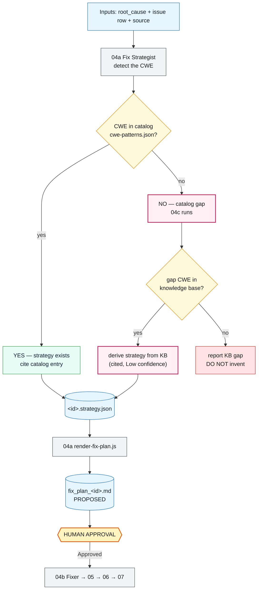
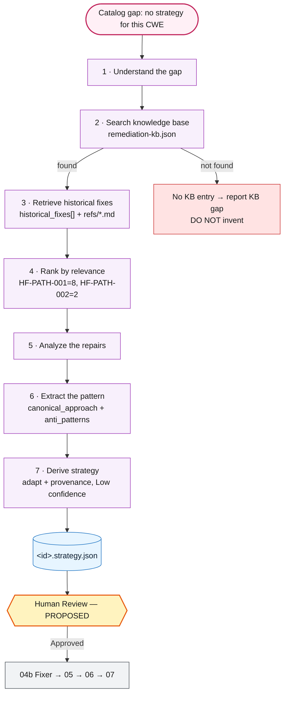

# Agent 4 · 3rd Skill (04c) · The "NO" Case — When There Is No Remediation Strategy

This note explains **only** the part we just built: inside **Agent 4 (Fix Generator)**, what happens
when the diagnosed vulnerability has **no remediation strategy available** — i.e. its CWE is **not in
the catalog** (a "catalog gap"). That is the **NO branch**, handled by the new third skill
**`04c-remediation-intelligence`**.

> **About the diagrams:** every diagram below appears **twice** — first as an **ASCII diagram** (shows
> in any viewer, including VS Code's default preview), then as **Mermaid** (renders on GitHub, or in
> VS Code with the *"Markdown Preview Mermaid Support"* extension). They show the same thing.

> **Point-in-time note:** this note predates a later upgrade to the ranking step described below —
> "Rank by relevance" now means a hybrid of keyword/synonym overlap and TF-IDF cosine similarity, not
> raw keyword-overlap counts alone. See
> [`04c`'s `SKILL.md`](../.github/skills/04c-remediation-intelligence/SKILL.md#ranking-algorithm--hybrid-keywordsynonym--tf-idf-cosine)
> for the current algorithm.

---

## 1. The one question that creates the NO case

When Agent 4 starts planning a fix, skill **04a** detects the CWE for the issue and asks one question:

> **Is this CWE in the remediation catalog (`cwe-patterns.json`)?**

- **YES** → there *is* a known strategy → 04a writes the plan from the catalog. (normal path)
- **NO**  → there is **no remediation strategy** for it → **catalog gap** → the new **04c** skill runs.

Before 04c existed, the **NO** answer was a dead-end: 04a would write an empty "catalog gap" plan and
stop. **04c turns that NO into a real, grounded, cited plan** — without skipping any safety step.

### ASCII — the YES/NO fork inside Agent 4

```
        Inputs: root_cause_<id>.md  +  issue row  +  current source code
                                  |
                                  v
                    +-----------------------------+
                    |     04a Fix Strategist       |
                    |  collect context, detect CWE |
                    +--------------+--------------+
                                   |
                     Is the CWE in the catalog?
                    (cwe-patterns.json, 10 CWEs)
                       |                     |
                 YES   |                     |   NO  = no strategy available
              (strategy|exists)              |       (CATALOG GAP)
                       v                     v
        +----------------------+   +--------------------------------+
        | 04a happy path       |   |  04c Remediation Intelligence  |
        | cite catalog entry   |   |  (the NEW 3rd skill)           |
        +----------+-----------+   +---------------+----------------+
                   |                               |
                   |                 Is the gap CWE in the
                   |                 knowledge base (KB)?
                   |                   |                 |
                   |              YES  |                 |  NO
                   |                   v                 v
                   |        +-------------------+  +------------------+
                   |        | derive strategy   |  | report KB gap    |
                   |        | from KB (cited)   |  | DO NOT invent    |
                   |        +---------+---------+  +------------------+
                   |                  |
                   +--------+---------+
                            |   <id>.strategy.json  (same shape either way)
                            v
              +-------------------------------+
              | 04a render-fix-plan.js         |
              | -> fix_plan_<id>.md            |
              |    Status: PROPOSED            |
              +---------------+---------------+
                              v
                 +----------------------------+
                 |   HUMAN APPROVAL required    |
                 |  (edit Status -> Approved)   |
                 +--------------+-------------+
                                v
                     04b Fixer -> 05 -> 06 -> 07
```

### Mermaid — same fork



---

## 2. Inside the NO branch — what 04c actually does (7 steps)

Once the answer is **NO** (catalog gap), 04c runs these seven steps. This is the heart of the new
skill.

### ASCII — the 04c NO-branch flow

```
  NO branch (no catalog strategy) — inside 04c
  ===========================================================================
   [1] Understand the gap          which CWE? why is there no catalog entry?
         |
         v
   [2] Search the knowledge base   knowledge/remediation-kb.json
         |                         (LOCAL, version-controlled, citable —
         |                          never the web, never model memory)
         v
   [3] Retrieve historical fixes   historical_fixes[]  +  knowledge/refs/*.md
         |
         v
   [4] Rank by relevance           keyword overlap with the root cause
         |                         e.g.  HF-PATH-001 = 8   HF-PATH-002 = 2
         v
   [5] Analyze the repairs         how were similar issues actually fixed?
         |
         v
   [6] Extract the pattern         canonical_approach  +  anti_patterns
         |
         v
   [7] Derive the strategy         adapt the pattern to THIS defect site,
         |                         attach provenance (sources), set
         |                         confidence = Low, catalog title = null
         v
    <id>.strategy.json  -->  render-fix-plan.js  -->  fix_plan_<id>.md (PROPOSED)
                                                            |
                                                     HUMAN APPROVAL
                                                            |
                                                04b Fixer -> 05 -> 06 -> 07

   Special case: if the gap CWE is not in the KB either  -> report a "KB gap"
                 and STOP. 04c never invents a pattern.
```

### Mermaid — same 7-step flow



### The 7 steps in words

| Step | What happens | In → Out |
|------|--------------|----------|
| 1 · Understand the gap | Identify the uncatalogued CWE and confirm nothing catalogued covers it | context bundle → gap statement |
| 2 · Search | Look the CWE up in the **local** knowledge base | `remediation-kb.json` → candidate entry |
| 3 · Retrieve | Pull the concrete prior fixes for that weakness | KB entry → `historical_fixes[]` + `refs/*.md` |
| 4 · Rank | Score each fix by keyword overlap with the root cause (deterministic) | fixes → ranked list |
| 5 · Analyze | Read the top fixes; understand the mechanism they close | ranked list → mechanism notes |
| 6 · Extract | Distill a reusable pattern (approach + what to avoid) | notes → `canonical_approach`, `anti_patterns` |
| 7 · Derive | Adapt the pattern to this defect site; attach sources; mark Low confidence | pattern → `<id>.strategy.json` |

---

## 3. Why the NO plan is still safe

Even though it comes from outside the vetted catalog, a 04c plan cannot cut any corner:

- **It never invents.** Every recommendation cites a real file under `knowledge/`. A CWE missing from
  the KB is reported as a *KB gap*, not guessed.
- **It is honestly labelled.** `Confidence: Low`, `catalog_reference.title: null`, and a
  `derived_pattern` provenance block naming its sources — so a reviewer scrutinises the *source*.
- **It never approves itself.** The plan lands at `Status: Proposed`; only a human editing that cell
  moves it forward — exactly like a catalogued plan.
- **It still faces every gate.** After approval it goes 04b (diff) → 05 (re-scan/red-team/behavior) →
  06 (test + build) → 07 (scored verdict). A weak derived plan fails loudly there; it can't sneak
  through.

---

## 4. Proof — the real Agent 4 run on a NO issue (ISSUE-004)

We registered a real gap issue — **ISSUE-004** (path traversal, **CWE-22**, which is *not* in the
catalog) — and ran the **actual** `04-fix-generator` agent with **no hint** to use 04c. It found the
gap and used the skill on its own.

### ASCII — what actually happened

```
 Operator          04 Fix Generator     04a          04c        Knowledge Base
    |  plan ISSUE-004     |               |            |               |
    |-------------------->|               |            |               |
    |                     |-- collect --->|            |               |
    |                     |<-- CWE-22, NOT in catalog (gap) ---        |
    |                     |-- detect-gap: GAP -------->|               |
    |                     |-- run-fallback ----------->|               |
    |                     |                            |-- search ---->|
    |                     |                            |<-- entry+fixes|
    |                     |                            |-- rank+derive |
    |                     |<-- ISSUE-004.strategy.json (Low, cited) ---|
    |                     |-- render-fix-plan -------->|               |
    |                     |<-- fix_plan_ISSUE-004.md @ PROPOSED        |
    |<-- awaiting approval|               |            |               |
```

### Verified result

- `docs/agent_output/04-remediation/fix_plan_ISSUE-004.md` — `Status: Proposed`, `CWE-22 — catalog gap`, `Confidence: Low`.
- Provenance in the plan: `Derived remediation | 04c fallback (expanded-catalog); sources: knowledge/remediation-kb.json, knowledge/refs/path-traversal.md#L1, …`
- Ranked fixes recorded: `HF-PATH-001 (8), HF-PATH-002 (2)`.
- ISSUE-001/002/003 untouched.

> ISSUE-004 is a **declared test fixture** (the real export uses a fixed filename). It proves the
> agent-to-skill wiring, not a live defect.

---

## 5. How to see the Mermaid diagrams

If the Mermaid blocks above look like plain text in your editor:

1. **On GitHub** — they render automatically when you open the file in the repo.
2. **In VS Code** — install the extension **"Markdown Preview Mermaid Support"**, then open the
   preview (`Ctrl+Shift+V`).
3. **Anywhere else** — use the **ASCII** diagrams; they always display.
