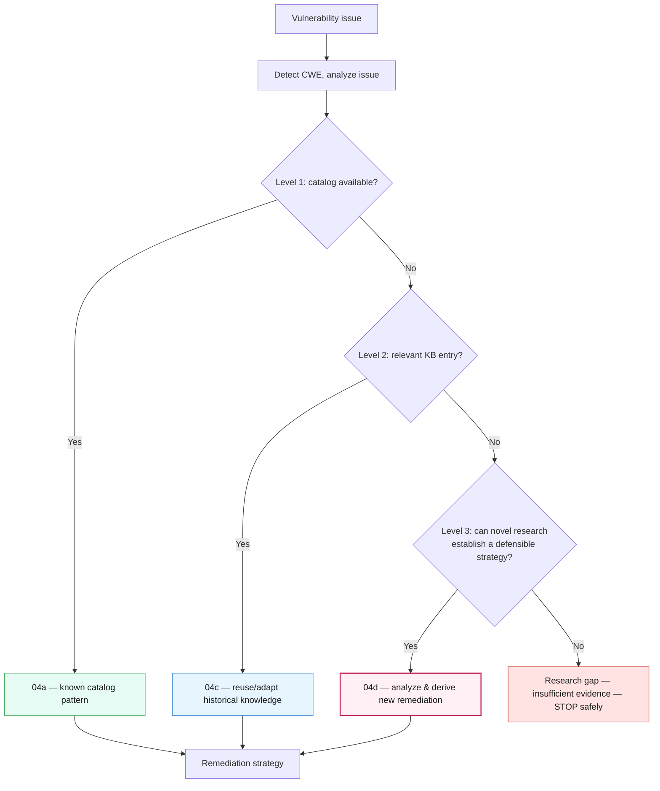
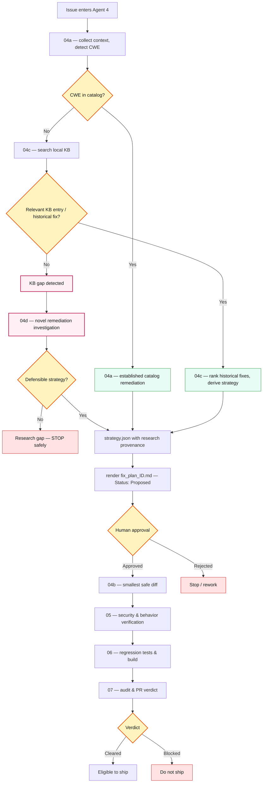
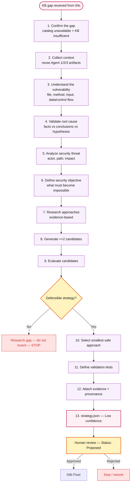
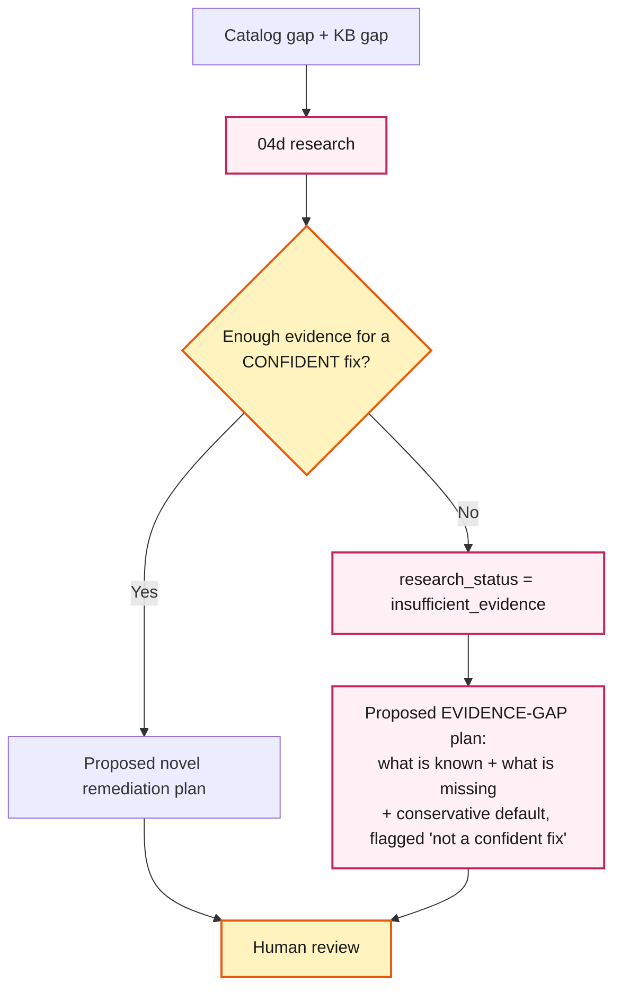
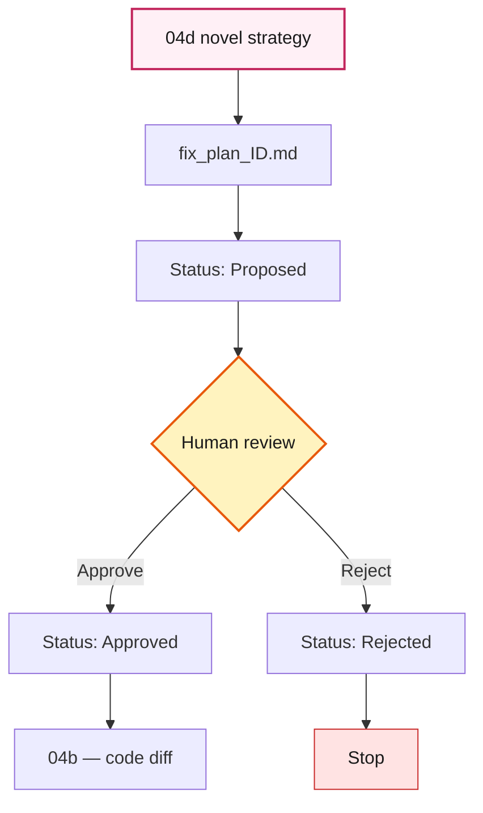
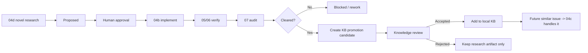

# 04d Novel Remediation Research — Pipeline Flow

`04d-remediation-research` is the third skill under **Agent 4 — Fix Generator**. It handles the case
where a diagnosed CWE is in **neither** the remediation catalog (`04a`) **nor** the local knowledge
base (`04c`). Instead of stopping at a **KB gap**, the pipeline performs a structured security
investigation and generates a **novel remediation proposal** for human review.

> Diagrams below are Mermaid — they render on GitHub. In VS Code, install *"Markdown Preview Mermaid
> Support"* or view the file on GitHub.

---

## 1. Remediation knowledge hierarchy

| Level | Skill | Knowledge source | Meaning |
|---|---|---|---|
| 1 | `04a-fix-strategist` | CWE catalog | We already know the remediation pattern |
| 2 | `04c-remediation-intelligence` | Local KB / historical fixes | We have relevant prior knowledge |
| 3 | `04d-remediation-research` | Structured security investigation | No existing remediation — develop a new proposal |

---

## 2. Overall decision flow

---

## 3. 04d internal flow (only after a genuine KB gap)

The deterministic parts (steps 1–3, and the assembly/validation of 10–13) are scripts
(`research-context.js`, `generate-strategy.js`). The judgment parts (steps 4–11) are authored by the
agent into schema-checked JSON. Nothing is invented; provenance is honest.

---

## 4. Evidence gap — 04d never dead-ends; it always hands the human something

04d will not fabricate a **confident** fix — but it never silently stops either. Thin evidence
produces a **Proposed evidence-gap plan** (what is known + what is missing + a conservative default),
routed to a human.

Both outcomes end at a **human-reviewed Proposed plan** — a targeted fix when evidence is good, an
evidence-gap plan when it is thin. 04d never invents a confident fix it cannot back up, and never
dead-ends.

---

## 5. Human approval is unchanged

Responsibilities: **04d** researches & plans · **human** approves or rejects · **04b** implements ·
**05** security-verifies · **06** regression & build · **07** final audit / ship decision.

---

## 6. Knowledge learning loop (KB promotion)

A successfully-shipped 04d remediation can become reusable knowledge — but only through human review,
never automatically.

Over time, 04d shrinks the KB's blind spots: what it researches once and that ships cleanly becomes a
04c-reusable entry, so the same class of vulnerability no longer needs novel research.

---

## 7. Core principle

> `04a` uses **known** remediation knowledge. `04c` uses **existing historical** knowledge. `04d`
> **investigates and derives new** knowledge. The **human** approves. `04b` implements. `05`/`06`/`07`
> verify whether it is safe to ship. If no defensible strategy exists, **04d stops safely** rather
> than inventing a fix.
