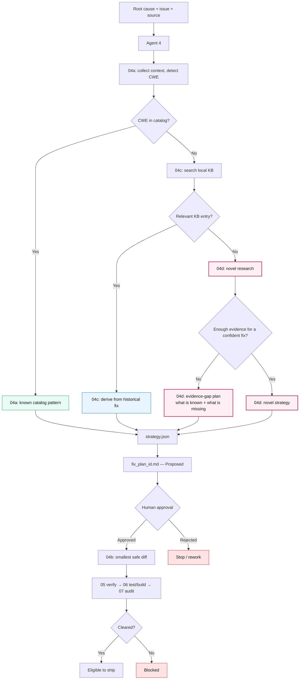

# Agent 4 — Fix Generator: Complete Flow

This document explains **everything Agent 4 does**, skill by skill, with diagrams.

> **Diagrams:** the ASCII diagrams below show in *any* viewer (including VS Code's default preview).
> A Mermaid version of the master diagram is at the end for GitHub.

---

## 1. What Agent 4 is

Agent 4 turns a **diagnosed vulnerability** into a **remediation plan**, and (after a human approves)
into a **verified code diff**. It runs in **two stages**, has **four skills**, and one **human gate**
sits between the stages.

| Skill | Stage | Role in one line |
|---|---|---|
| `04a-fix-strategist` | 1 (plan) | Write the plan from the **known CWE catalog** |
| `04c-remediation-intelligence` | 1 (plan) | Write the plan from the **local knowledge base** (when catalog has nothing) |
| `04d-remediation-research` | 1 (plan) | **Research a new plan** (when catalog AND KB have nothing) |
| `04b-fixer` | 2 (implement) | Turn an **Approved** plan into the smallest verified diff |

```
   ┌──────────────────────────── AGENT 4 ────────────────────────────┐
   │                                                                  │
   │  STAGE 1 — PLAN  (choose a remediation; produce a suggestion)    │
   │     04a  →  04c  →  04d      (whichever the routing picks)       │
   │                    │                                             │
   │              strategy.json                                       │
   │                    │                                             │
   │              fix_plan_<id>.md   =   Status: PROPOSED             │
   │                    │                                             │
   │   ════════════════▼════════════════                             │
   │      HUMAN APPROVAL  (a person edits Status → Approved)          │
   │   ═════════════════════════════════                             │
   │                    │  (only if Approved)                        │
   │  STAGE 2 — IMPLEMENT                                             │
   │     04b Fixer  →  smallest verified code diff                   │
   └────────────────────┬─────────────────────────────────────────────┘
                        ▼
            05 (verify) → 06 (test/build) → 07 (audit → ship?)
```

**Key point:** Human approval is **not part of any skill** — it is a manual step *between* Stage 1
(04a/04c/04d) and Stage 2 (04b). 04b only *checks* "is it Approved?" and refuses if not.

---

## 2. The routing decision — which Stage-1 skill runs?

Agent 4 picks exactly one Stage-1 skill based on where a remediation is available. Think of it as
three levels of knowledge:

```
                    A vulnerability is diagnosed (CWE known)
                                   │
                                   ▼
                   Is the CWE in the catalog (cwe-patterns.json)?
                        │                             │
                       YES                            NO  (catalog gap)
                        │                             │
                        ▼                             ▼
                  ┌───────────┐            Is the CWE in the KB (remediation-kb.json)?
                  │   04a     │                 │                        │
                  │ (Level 1) │                YES                       NO  (KB gap)
                  └───────────┘                 │                        │
                                                ▼                        ▼
                                          ┌───────────┐          ┌───────────┐
                                          │   04c     │          │   04d     │
                                          │ (Level 2) │          │ (Level 3) │
                                          └───────────┘          └─────┬─────┘
                                                                       │
                                                          Is the evidence enough for
                                                          a CONFIDENT fix?
                                                             │            │
                                                            YES           NO
                                                             │            │
                                                             ▼            ▼
                                                    novel remediation   EVIDENCE-GAP plan
                                                     plan (Proposed)    (Proposed → human)
                                                             │            │
                                                             └─────┬──────┘
                                                        both go to a human — 04d never dead-ends
```

| Level | Skill | Knowledge source | Meaning |
|---|---|---|---|
| 1 | `04a` | CWE catalog | "We already know the fix pattern" |
| 2 | `04c` | Local KB / historical fixes | "We have relevant prior knowledge" |
| 3 | `04d` | Structured investigation | "No existing fix — research a new one" |

Whatever level runs, it produces the **same** `strategy.json`, which the **same** renderer turns into
the **same** `fix_plan_<id>.md` at `Status: Proposed`. Everything downstream is identical.

---

## 3. The four skills, explained

### 04a — Fix Strategist (Level 1: the catalog)

- **When:** the detected CWE **is** in `cwe-patterns.json`.
- **What:** cites the catalog's canonical remediation pattern, adapted to this defect.
- **Reads:** root-cause report + issue row + source + `catalog/cwe-patterns.json`.
- **Writes:** `<id>.strategy.json` → rendered to `fix_plan_<id>.md` (Proposed).
- **Confidence:** established (the pattern is vetted).

### 04c — Remediation Intelligence (Level 2: the knowledge base)

- **When:** the CWE is **not** in the catalog, **but is** in `remediation-kb.json` (a catalog gap).
- **What:** searches the local KB, ranks historical fixes by relevance, derives a cited strategy.
- **Reads:** the 04a context + `knowledge/remediation-kb.json` + `knowledge/refs/*.md`.
- **Writes:** `<id>.strategy.json` (with a `derived_pattern` provenance block) → Proposed plan.
- **Confidence:** Low (derived, not catalogued).
- **If the CWE is not in the KB either →** it reports a **KB gap** → hands off to 04d.

### 04d — Remediation Research (Level 3: novel research)

- **When:** the CWE is in **neither** the catalog **nor** the KB (a KB gap).
- **What:** runs a structured security investigation and derives a **new** remediation proposal.
- **Confidence:** Low, always. Never fabricates a citation. **Stops safely** if evidence is too thin.
- (Full file-by-file flow in section 4.)

### 04b — Fixer (Stage 2: implementation)

- **When:** a human has set the plan's Status to exactly `Approved`.
- **What:** turns the approved plan into the **smallest verified code diff**, built in a throwaway
  git worktree. Refuses any plan that is not `Approved`.
- **Reads:** the Approved `fix_plan_<id>.md` + current source.
- **Writes:** `fix_<id>.md` + `fix_<id>.diff`.

---

## 4. Deep dive — 04d file-by-file flow

04d runs only after a **KB gap** (no plan in catalog or KB). It never jumps straight to a fix — it
investigates first. Four steps, each reading one file and writing the next:

```
  docs/agent_output/02-root-cause/root_cause_<id>.md      ← STEP 1 reads this FIRST (Agent 2's diagnosis)
        │
        │  STEP 1  research-context.js   (DETERMINISTIC script — just extracts facts)
        │          also reads: issue row, catalog, KB, vulnerable source
        ▼
  .github/.pipeline-context/research/<id>.understanding.json
        │
        │  STEP 2  the AGENT reasons   (judgment — NOT a script)
        │          writes threat, objective, >=2 candidates, evaluation,
        │          recommendation, validation tests, provenance, research_status
        ▼
  .github/.pipeline-context/research/<id>.analysis.json
        │
        │  STEP 3  generate-strategy.js   (DETERMINISTIC script — validate + assemble)
        │          OR safe-stop if research_status = insufficient_evidence
        ▼
  .github/.pipeline-context/fix-strategy/<id>.strategy.json   (+ <id>.promotion-candidate.json)
        │
        │  STEP 4  render-fix-plan.js   (04a's EXISTING renderer)
        ▼
  docs/agent_output/04-remediation/fix_plan_<id>.md     Status: PROPOSED
        │
        ▼
   HUMAN APPROVAL  →  04b  →  05 → 06 → 07
```

### What each file holds

| File | Written by | Contains |
|---|---|---|
| `root_cause_<id>.md` | Agent 2 (upstream) | The diagnosis: what's broken, where, the CWE |
| `<id>.understanding.json` | `research-context.js` (deterministic) | Extracted facts: CWE, gap status, defect location, source snippet, data flow — **no invention** |
| `<id>.analysis.json` | **the agent** (reasoning) | Threat model, security objective, ≥2 candidates, evaluation, recommendation, validation, provenance |
| `<id>.strategy.json` | `generate-strategy.js` (deterministic) | The assembled, contract-compatible strategy (Low confidence, `remediation_source: 04d`) |
| `fix_plan_<id>.md` | `render-fix-plan.js` (deterministic) | The human-readable plan at `Status: Proposed` |

> The two `.pipeline-context/…` files are **working files** (gitignored, regeneratable). Only
> `fix_plan_<id>.md` is the durable, committed output.

### The 13 research stages (what the agent authors in Step 2)

1. Confirm the gap · 2. Collect context (Agents 1/2/3) · 3. Understand the vulnerability ·
4. Validate root cause (**facts vs conclusions vs hypotheses**, kept apart) · 5. Threat model ·
6. Security objective (the invariant) · 7. Research approaches · 8. Generate **≥2 candidates** ·
9. Evaluate them · 10. Select smallest-safe · 11. Validation tests · 12. Evidence + provenance ·
13. Emit `strategy.json` (Low, Proposed).

---

## 5. Evidence gap — 04d never dead-ends; it always hands the human something

04d will not fabricate a **confident** fix — but it never silently stops either. If the evidence
can't support a targeted remediation, it still produces a **Proposed evidence-gap plan** and routes
it to a human:

```
   KB gap  →  04d research  →  research_status = "insufficient_evidence"
                                        │
                                        ▼
              Proposed EVIDENCE-GAP plan  →  Human review
              ─────────────────────────
              • what IS known (from the evidence)
              • what evidence is MISSING (the specific gaps to fill)
              • a conservative default hardening for the CWE class
              • flagged loudly: "NOT a confident fix — gather evidence and re-run 04d"
```

So there are exactly **two** ways a 04d run ends, and **both go to a human** — a *targeted* novel
remediation (evidence good), or an *evidence-gap* plan (evidence thin). It never fabricates a
confident fix, and it never dead-ends.

> A confident fix is offered only when the evidence backs it; otherwise 04d says exactly what it
> knows and what it still needs — and still hands it to the human.

---

## 6. Knowledge learning loop (KB promotion)

A 04d remediation that ships cleanly can become reusable knowledge — but only via human review:

```
04d research → Proposed → Human approves → 04b implements → 05/06 verify → 07 Cleared
      → KB promotion candidate → human review → added to remediation-kb.json
      → next similar issue is handled by 04c (no more novel research needed)
```

04d writes a **promotion candidate**; it is **never** auto-written to the KB.

---

## 7. Everything on one table

| Skill | Runs when | Reads | Writes | Confidence |
|---|---|---|---|---|
| 04a | CWE in catalog | catalog + context | `strategy.json` → plan | established |
| 04c | catalog gap, CWE in KB | KB + refs + context | `strategy.json` (+derived_pattern) → plan | Low |
| 04d | catalog gap + KB gap | root cause → understanding → analysis | `strategy.json` (+research) → plan | Low |
| — | plan rendered | — | `fix_plan_<id>.md` (Proposed) | — |
| **Human** | plan is Proposed | the plan | edits Status → Approved/Rejected | — |
| 04b | Status = Approved | Approved plan + source | `fix_<id>.diff` | — |

---

## 8. Master diagram (Mermaid — renders on GitHub)



---

## In one sentence

> **04a** uses known catalog knowledge, **04c** uses existing KB knowledge, **04d** researches new
> knowledge when neither exists (and when evidence is thin it hands over an *evidence-gap* plan
> instead of dead-ending). All three always produce a **Proposed** plan, a **human** approves it, and
> **04b** implements it — then 05/06/07 decide if it ships.
