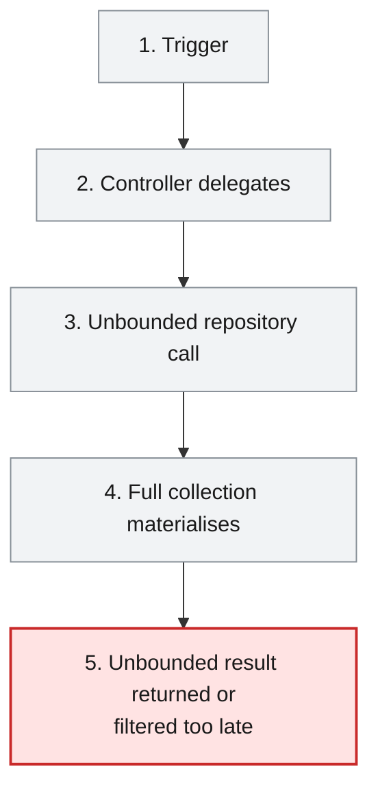
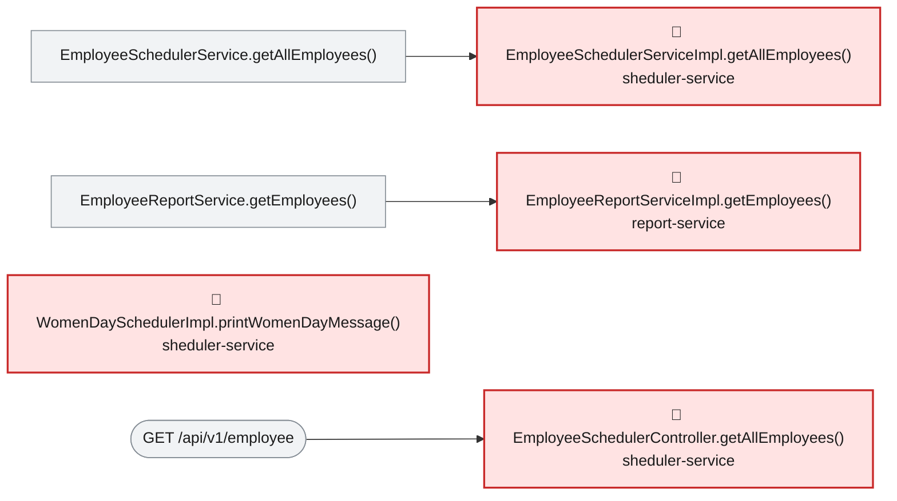

# Root Cause Analysis — ISSUE-001

## Unbounded repository findAll() reads whole collections into memory across multiple services

> Two services load their entire employee list out of the database on every request instead of a page at a time, so a normal-looking request can force a service to hold the whole workforce dataset in memory at once and run out of memory under load.

_Generated by the Root Cause Analyst agent on 2026-08-17. Evidence collected 2026-08-17T12:43:30.344Z._

## At a glance

| | |
|---|---|
| **What breaks** | Unbounded repository findAll() reads whole collections into memory across multiple services |
| **Root cause** | EmployeeSchedulerServiceImpl.getAllEmployees() and EmployeeReportServiceImpl.getEmployees() call their repository's inherited findAll() with no Pageable, Sort, Limit or query filter, so every call pulls the entire MongoDB collection into the JVM heap and returns it (or joins it) as-is. |
| **Where** | `sheduler-service/src/main/java/com/aura/vihanga/shedulerservice/service/implementation/EmployeeSchedulerServiceImpl.java:18 (mirrored at report-service/src/main/java/com/aura/vihanga/reportservice/service/implementation/EmployeeReportServiceImpl.java:40)` |
| **Service** | `sheduler-service`, `report-service` |
| **Severity** | High (Vulnerability) |
| **Confidence** | High |

Issue: [docs/agent_output/00-issues/issue-register.xlsx](../../../docs/agent_output/00-issues/issue-register.xlsx) · Reported 2026-08-06 by Architecture review (performance and availability) · Status Open

<details><summary>Technical summary</summary>

EmployeeSchedulerServiceImpl.getAllEmployees() (sheduler-service) and EmployeeReportServiceImpl.getEmployees() (report-service) both call their Spring Data MongoDB repository's inherited findAll() with zero arguments — no Pageable, Sort, Limit or query filter — and hand the full result back as raw Employee entities. Two public GET endpoints and one cron job sit directly on top of these calls, so every hit re-materialises the entire collection, and in report-service the result is additionally joined against the full department list in a nested Java loop before being buffered into an XLSX workbook in memory.

</details>

## 1. What was reported

Call site 1 - sheduler-service

- GET /api/v1/employee returns every employee document in the collection, serialised in full, with no page size, no limit parameter and no filtering. The entity is returned directly, so every persisted field is exposed to the caller.
- The scheduled job WomenDaySchedulerImpl.printWomenDayMessage() calls the same method and then filters for GenderType.FEMALE in Java, after the entire collection has already been transferred and mapped. The filter is never pushed down to the database.

Call site 2 - report-service

- GET /api/v1/export loads every employee via findAll(), then performs an outbound HTTP call to department-service for the department list, and then joins the two lists with a nested for loop (employees x departments) purely in memory.
- The complete joined result and the generated XLSX workbook are both held in the heap at the same time, and the workbook is buffered into a ByteArrayOutputStream before a single byte is written to the response.

Source: [docs/agent_output/00-issues/issue-register.xlsx](../../../docs/agent_output/00-issues/issue-register.xlsx)

## 2. What should happen — and what happens instead

```mermaid
flowchart TB
  classDef broken fill:#ffe3e3,stroke:#c92a2a,stroke-width:2px,color:#1a1a1a
  classDef warn fill:#fff3bf,stroke:#e8590c,stroke-width:2px,color:#1a1a1a
  classDef ok fill:#e6fcf5,stroke:#2f9e44,stroke-width:1px,color:#1a1a1a
  classDef neutral fill:#f1f3f5,stroke:#868e96,stroke-width:1px,color:#1a1a1a
  subgraph EXPECTED["✅ What should happen"]
    direction LR
    E0["Caller requests a<br/>page/filtered slice"]:::ok
    E1["Service builds a bounded<br/>Pageable/query"]:::ok
    E0 --> E1
    E2["Repository returns only<br/>that slice"]:::ok
    E1 --> E2
    E3["Bounded DTO response<br/>returned"]:::ok
    E2 --> E3
  end
  subgraph ACTUAL["❌ What actually happens"]
    direction LR
    A0["Trigger"]:::neutral
    A1["Controller delegates"]:::neutral
    A0 --> A1
    A2["Unbounded repository call"]:::neutral
    A1 --> A2
    A3["Full collection<br/>materialises"]:::neutral
    A2 --> A3
    A4["Unbounded result returned<br/>or filtered too late"]:::broken
    A3 --> A4
  end
```



## 3. How it fails, step by step

1. **Trigger** — A client calls GET /api/v1/employee or GET /api/v1/export, or the annual cron `0 0 0 8 3 *` fires WomenDaySchedulerImpl.printWomenDayMessage().
2. **Controller delegates** — EmployeeSchedulerController.getAllEmployees() / EmployeeReportController.exportToExcel() pass straight through to the service layer with no page, size or filter argument to carry.
3. **Unbounded repository call** — EmployeeSchedulerServiceImpl.getAllEmployees() (line 18) and EmployeeReportServiceImpl.getEmployees() (line 40) call the repository's inherited findAll() with zero arguments.
4. **Full collection materialises** — MongoDB returns every Employee document into the heap; report-service additionally fetches the full department list over WebClient and joins both lists with a nested for-loop before buffering an XSSFWorkbook in a ByteArrayOutputStream.
5. **Unbounded result returned or filtered too late** — The full result set is serialised back to the caller (or, for the scheduled job, filtered to FEMALE employees in Java only after the whole collection is already in memory), so heap usage and MongoDB load scale directly with collection size and concurrent callers rather than with what was actually requested.



## 4. Where the defect is

> **EmployeeSchedulerServiceImpl.getAllEmployees() and EmployeeReportServiceImpl.getEmployees() call their repository's inherited findAll() with no Pageable, Sort, Limit or query filter, so every call pulls the entire MongoDB collection into the JVM heap and returns it (or joins it) as-is.**

**Location:** `sheduler-service/src/main/java/com/aura/vihanga/shedulerservice/service/implementation/EmployeeSchedulerServiceImpl.java:18 (mirrored at report-service/src/main/java/com/aura/vihanga/reportservice/service/implementation/EmployeeReportServiceImpl.java:40)`



Evidence bundle section 2 shows both call sites verbatim: EmployeeSchedulerServiceImpl.getAllEmployees() (lines 16-19) does nothing but `return employeeSchedulerRepository.findAll();`, and EmployeeReportServiceImpl.getEmployees() (lines 38-72) opens with `List<Employee> employeesList = employeeReportRepository.findAll();` before joining it against a full department list fetched over WebClient. Section 2's reaching-path traces confirm three independent paths converge on these two findAll() calls: GET /api/v1/employee -> EmployeeSchedulerController.getAllEmployees() -> EmployeeSchedulerServiceImpl.getAllEmployees(); the cron job WomenDaySchedulerImpl.printWomenDayMessage() (`@Scheduled(cron = "0 0 0 8 3 *")`) -> the same EmployeeSchedulerService.getAllEmployees(); and GET /api/v1/export -> EmployeeReportController.exportToExcel() -> EmployeeReportServiceImpl.getEmployees(). None of the three passes a page size, limit or query predicate — confirmed by the evidence collector's Detection Notes: a source-wide search for `findAll(` returns exactly these two call sites, and no endpoint on the REST surface (section 4) accepts a page or size parameter, so a caller has no way to bound the result even if it wanted to. WomenDaySchedulerImpl additionally proves the pattern's cost is compounded, not avoided: its GenderType.FEMALE filter (lines 22-23) is applied in Java after employeeSchedulerService.getAllEmployees() has already transferred and deserialised the full collection, so the filter is pure waste from a DB/network perspective.

**The code involved**

| Method | Service | File | Calls | Called by |
|---|---|---|---|---|
| `EmployeeSchedulerServiceImpl.getAllEmployees()` | `sheduler-service` | [EmployeeSchedulerServiceImpl.java:16-19](../../../sheduler-service/src/main/java/com/aura/vihanga/shedulerservice/service/implementation/EmployeeSchedulerServiceImpl.java#L16-L19) | _none_ | `EmployeeSchedulerService.getAllEmployees()` |
| `EmployeeReportServiceImpl.getEmployees()` | `report-service` | [EmployeeReportServiceImpl.java:38-72](../../../report-service/src/main/java/com/aura/vihanga/reportservice/service/implementation/EmployeeReportServiceImpl.java#L38-L72) | `DepartmentConfigUrl.getDepartmentUrl()` | `EmployeeReportService.getEmployees()` |
| `WomenDaySchedulerImpl.printWomenDayMessage()` | `sheduler-service` | [WomenDaySchedulerImpl.java:19-29](../../../sheduler-service/src/main/java/com/aura/vihanga/shedulerservice/service/implementation/WomenDaySchedulerImpl.java#L19-L29) | `EmployeeSchedulerService.getAllEmployees()` | _entry point_ |
| `EmployeeSchedulerController.getAllEmployees()` | `sheduler-service` | [EmployeeSchedulerController.java:18-21](../../../sheduler-service/src/main/java/com/aura/vihanga/shedulerservice/controller/EmployeeSchedulerController.java#L18-L21) | `EmployeeSchedulerService.getAllEmployees()` | _entry point_ |
| `EmployeeReportController.exportToExcel()` | `report-service` | [EmployeeReportController.java:25-39](../../../report-service/src/main/java/com/aura/vihanga/reportservice/controller/EmployeeReportController.java#L25-L39) | `EmployeeReportService.getEmployees()`, `EmployeeReportService.generateExcelFile()` | _entry point_ |

<details><summary>Show the source of each method</summary>

**`EmployeeSchedulerServiceImpl.getAllEmployees()`** — `sheduler-service/src/main/java/com/aura/vihanga/shedulerservice/service/implementation/EmployeeSchedulerServiceImpl.java` lines 16-19

```java
@Override
    public List<Employee> getAllEmployees() {
        return employeeSchedulerRepository.findAll();
    }
```

Reaching paths:

- `EmployeeSchedulerController.getAllEmployees()` → `EmployeeSchedulerService.getAllEmployees()` → `EmployeeSchedulerServiceImpl.getAllEmployees()`
- `WomenDaySchedulerImpl.printWomenDayMessage()` → `EmployeeSchedulerService.getAllEmployees()` → `EmployeeSchedulerServiceImpl.getAllEmployees()`

**`EmployeeReportServiceImpl.getEmployees()`** — `report-service/src/main/java/com/aura/vihanga/reportservice/service/implementation/EmployeeReportServiceImpl.java` lines 38-72

```java
public List<EmployeeSalaryResponse> getEmployees() {
        log.info("Report Service");
        List<Employee> employeesList = employeeReportRepository.findAll();

//        List<String> employeeDepartmentId = employees.stream().map(employee -> employee.getDepartment()).toList();

        DepartmentResponse[] departmentResponses = builder.build().get()
                .uri(departmentConfigUrl.getDepartmentUrl(), 10000)
                .retrieve()
                .bodyToMono(DepartmentResponse[].class)
                .block();
        List<DepartmentResponse> departmentResponseList = Arrays.asList(departmentResponses);

        List<EmployeeSalaryResponse> employeeSalaryResponseList = new ArrayList<>();

        for (Employee employee : employeesList) {
            for (DepartmentResponse department : departmentResponseList) {
                if (employee.getDepartment().equals(department.getDepartmentId())) {
                    EmployeeSalaryResponse employeeSalaryResponse = EmployeeSalaryResponse.builder()
                            .employeeId(employee.getEmployeeId())
                            .name(employee.getName())
                            .departmentName(department.getDepartmentName())
                            .salary(department.getSalary())
                            .build();

                    log.info("employee Salary {}",employeeSalaryResponse);

                    employeeSalaryResponseList.add(employeeSalaryResponse);
                }
            }
        }

        return employeeSalaryResponseList;

    }
```

Reaching paths:

- `EmployeeReportController.exportToExcel()` → `EmployeeReportService.getEmployees()` → `EmployeeReportServiceImpl.getEmployees()`

**`WomenDaySchedulerImpl.printWomenDayMessage()`** — `sheduler-service/src/main/java/com/aura/vihanga/shedulerservice/service/implementation/WomenDaySchedulerImpl.java` lines 19-29

```java
@Scheduled(cron = "0 0 0 8 3 *")
    public void printWomenDayMessage() {
        List<Employee> womenEmployees = employeeSchedulerService.getAllEmployees().stream()
                .filter(employee -> employee.getGender() == GenderType.FEMALE)
                .collect(Collectors.toList());

        System.out.println("Happy Women's Day!");
        for (Employee employee : womenEmployees) {
            System.out.println("Employee Name: " + employee.getName());
        }
    }
```

**`EmployeeSchedulerController.getAllEmployees()`** — `sheduler-service/src/main/java/com/aura/vihanga/shedulerservice/controller/EmployeeSchedulerController.java` lines 18-21

```java
@GetMapping("employee")
    public List<Employee> getAllEmployees() {
        return schedulerService.getAllEmployees();
    }
```

**`EmployeeReportController.exportToExcel()`** — `report-service/src/main/java/com/aura/vihanga/reportservice/controller/EmployeeReportController.java` lines 25-39

```java
@GetMapping("export")
    public void exportToExcel(HttpServletResponse response) throws IOException {
        List<EmployeeSalaryResponse> employeeSalaryResponseList = reportService.getEmployees();

//        List<Employee> employees = new ArrayList<>();
//
        byte[] excelBytes = reportService.generateExcelFile(employeeSalaryResponseList);

        response.setContentType("application/vnd.openxmlformats-officedocument.spreadsheetml.sheet");
        response.setHeader("Content-Disposition", "attachment; filename=employees.xlsx");
        response.getOutputStream().write(excelBytes);
        response.getOutputStream().flush();

        log.info("Report Controller");
    }
```

</details>

## 5. What it means

GET /api/v1/employee (sheduler-service) and GET /api/v1/export (report-service) each hold the full employee collection in heap on every single call; report-service additionally holds the full department list and a fully-built XSSFWorkbook in memory at the same time before writing a single byte to the response. A handful of concurrent calls against a production-sized collection is enough to raise GC pressure sharply and exhaust the heap, degrading or crashing either service — and because both endpoints are unauthenticated (ISSUE-002), any caller can trigger this repeatedly at will. The same unbounded findAll() also backs the WomenDaySchedulerImpl cron job, so the identical full-collection cost recurs on every 8 March even though only a filtered subset of employees is ever used. Because EmployeeSchedulerController returns the Employee entity as-is rather than a capped DTO, every persisted field is also serialised on each unbounded call, not just the fields a caller needs.

**Why High severity:** High is appropriate: this is primarily an availability/denial-of-service defect (heap exhaustion, sustained MongoDB load shared with other services) with a secondary over-exposure component (whole entities returned unfiltered), matching the issue's own Impact section. It is not rated Critical on its own because, unlike ISSUE-002/ISSUE-003, it requires no injection and its worst-case outcome is degradation/outage of these two services rather than direct unauthorized data disclosure or write access — though the register correctly notes it compounds ISSUE-002 and ISSUE-003 by removing any cap on what an attacker can pull in one call.

## 6. Why it happened

- No module in the affected area declares a pagination convention (no Pageable parameter on any controller method, no `page`/`size` query parameter anywhere on the REST surface per the evidence collector's Detection Notes), so there was no existing pattern to copy.
- Both services return persistence entities/derived DTOs built from the entity directly rather than projecting through a repository-level field-limited query, which removes an easy opportunity to also cap the query at the same time.
- The pattern is duplicated independently in two services (sheduler-service, report-service), indicating no shared base-repository or code-review checklist currently catches an unbounded findAll() before it ships.

## 7. How to fix it

Replace the bare findAll() calls with bounded, server-controlled reads: use Spring Data's Pageable-based findAll(Pageable) (or a paginated derived/@Query method) for EmployeeSchedulerServiceImpl.getAllEmployees(), thread a page/size parameter (with a hard maximum) from EmployeeSchedulerController through to the repository, and project the response into a DTO instead of returning the Employee entity directly. For WomenDaySchedulerImpl, replace the in-Java gender filter with a derived query (e.g. findByGender(GenderType.FEMALE)) so MongoDB does the filtering. For report-service, either paginate the export or, if a full export is a genuine business requirement, stream employees and the workbook in bounded chunks (e.g. write rows incrementally rather than buffering the full joined list and the full workbook in memory at once) and change the department join from an O(n*m) nested loop to a map lookup keyed by departmentId.

| File | Change |
|---|---|
| [EmployeeSchedulerServiceImpl.java](../../../sheduler-service/src/main/java/com/aura/vihanga/shedulerservice/service/implementation/EmployeeSchedulerServiceImpl.java) | Replace `employeeSchedulerRepository.findAll()` with a Pageable-based or field-projected query; return a bounded page. |
| [EmployeeSchedulerController.java](../../../sheduler-service/src/main/java/com/aura/vihanga/shedulerservice/controller/EmployeeSchedulerController.java) | Accept page/size request parameters and pass them through to the service instead of calling getAllEmployees() unconditionally. |
| [WomenDaySchedulerImpl.java](../../../sheduler-service/src/main/java/com/aura/vihanga/shedulerservice/service/implementation/WomenDaySchedulerImpl.java) | Replace the post-fetch `.filter(employee -> employee.getGender() == GenderType.FEMALE)` with a derived repository query that pushes the filter to MongoDB. |
| [EmployeeReportServiceImpl.java](../../../report-service/src/main/java/com/aura/vihanga/reportservice/service/implementation/EmployeeReportServiceImpl.java) | Replace `employeeReportRepository.findAll()` with a bounded/streamed read, and replace the nested for-loop join with a departmentId-keyed map lookup. |

<details><summary>Sketch of the change</summary>

```java
Page<Employee> page = employeeSchedulerRepository.findAll(PageRequest.of(pageIndex, pageSize));
return page.map(EmployeeResponse::from).getContent();
```

</details>

## 8. How to check the fix worked

1. Seed a large employee collection (e.g. 500,000 documents as in the issue's reproduction steps), call GET /api/v1/employee with a page/size parameter, and confirm the response size and latency scale with the requested page size, not with collection size.
2. Repeat for GET /api/v1/export and confirm peak heap usage stays flat as the collection grows, per the issue's reproduction step 4/5.
3. Trigger WomenDaySchedulerImpl.printWomenDayMessage() manually (or advance the clock in a test) and confirm, via a Mongo query log or repository spy, that the gender filter is now expressed as part of the query rather than as a post-fetch Java stream filter.
4. Re-run a search for `findAll(` in sheduler-service and report-service source and confirm no remaining zero-argument call sites.

## 9. How to stop it happening again

- Add a static-analysis or code-review rule flagging any `.findAll()` call in a controller-reachable path that is not explicitly justified as bounded.
- Establish a shared pagination convention (a common Pageable-accepting base controller method or a documented API contract) so new endpoints default to a bounded read.
- Add a load/soak test that seeds a large collection and asserts a heap/latency ceiling for both affected endpoints.

## 10. Open questions

- No page-size or API-contract convention currently exists anywhere in the workspace, so the concrete default/maximum page size needs a product decision before implementation.
- Whether report-service's export should remain a full-collection export (streamed) or become paginated like the scheduler endpoint is a product question the evidence does not settle.

## Appendix — how this was determined

| Input | Detail |
|---|---|
| Issue report | [docs/agent_output/00-issues/issue-register.xlsx](../../../docs/agent_output/00-issues/issue-register.xlsx) |
| Architecture document | [docs/agent_output/01-architecture/architecture.md](../../../docs/agent_output/01-architecture/architecture.md) |
| Function reference | [docs/agent_output/01-architecture/function-reference.md](../../../docs/agent_output/01-architecture/function-reference.md) |
| Code scan | `.github/.pipeline-context/artifacts.json` (generated 2026-08-17T12:36:06.304Z) |
| Knowledge graph | Neo4j, traversal depth 4 |

<details><summary>Architecture observations considered</summary>

- Each service (`department-service`, `employee-service`, `report-service`, `sheduler-service`) follows the same layered convention: `controller` → `service` → `repository` → `model`/`entity`, backed by MongoDB repositories.
- `configuaration-server` and `discovery-service` are infrastructure services (Spring Cloud Config + Eureka) that every business service depends on at startup via `bootstrap.properties`.
- No Feign clients were detected — cross-service calls, if any, likely go through `RestTemplate`/`WebClient` rather than declarative Feign interfaces. Worth confirming if service-to-service coupling should show up as graph edges.
- The generated Neo4j graph can be queried directly (e.g. `MATCH (m:Module)-[:CONTAINS]->(t:Type) RETURN m.name, count(t)`) for deeper, ad-hoc architecture questions beyond this static document.

</details>

<details><summary>Graph queries executed</summary>

**upstream callers**

```cypher
MATCH path = (caller:Method)-[:CALLS*1..4]->(target:Method {id: $id})
         RETURN [n IN nodes(path) | n.id] AS chain LIMIT 200
```

**downstream callees**

```cypher
MATCH path = (target:Method {id: $id})-[:CALLS*1..4]->(callee:Method)
         RETURN [n IN nodes(path) | n.id] AS chain LIMIT 200
```

**owning type, module and exposed endpoints**

```cypher
MATCH (ty:Type)-[:HAS_METHOD]->(m:Method {id: $id})
         OPTIONAL MATCH (ty)-[:EXPOSES]->(e:Endpoint)
         RETURN ty.id AS typeId, ty.name AS typeName, ty.module AS module,
                collect(DISTINCT e.id) AS endpoints
```

**types depending on the owning type**

```cypher
MATCH (other:Type)-[:USES]->(ty:Type)-[:HAS_METHOD]->(:Method {id: $id})
         RETURN DISTINCT other.id AS typeId, other.name AS name, other.module AS module
```

**modules reaching the focus method**

```cypher
MATCH (caller:Method)-[:CALLS*1..4]->(:Method {id: $id})
         MATCH (ct:Type)-[:HAS_METHOD]->(caller)
         RETURN DISTINCT ct.module AS module
```

**graph node counts**

```cypher
MATCH (n) RETURN labels(n)[0] AS label, count(*) AS count ORDER BY count DESC
```

**graph relationship counts**

```cypher
MATCH ()-[r]->() RETURN type(r) AS type, count(*) AS count ORDER BY count DESC
```

**maven dependencies of affected modules**

```cypher
MATCH (m:Module)-[:DEPENDS_ON]->(dep:MavenDependency)
       WHERE m.name IN $modules
       RETURN m.name AS module, collect(dep.ga) AS dependencies
```

</details>

---

The reported symptom, the code table, the source and the call paths are rendered verbatim from the issue, the code scan and the knowledge graph. The plain-language summary, the causal chain, the root cause, what it means, why it happened, the fix, the verification steps and the prevention measures are the judgement of the Root Cause Analyst agent.
