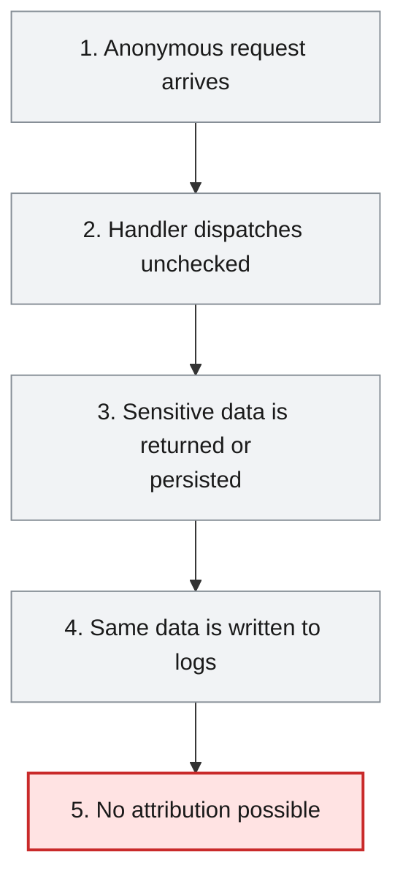
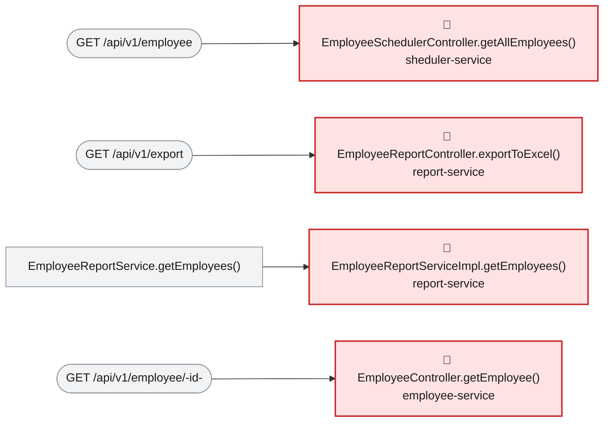

# Root Cause Analysis — ISSUE-002

## Employee PII and payroll data are exposed to unauthenticated callers and written to application logs

> Nobody has to prove who they are to read or change any employee's personal and salary information through this platform, and the same personal and salary details are also written out in plain text to the application's log files on every normal request.

_Generated by the Root Cause Analyst agent on 2026-08-17. Evidence collected 2026-08-17T12:43:46.646Z._

## At a glance

| | |
|---|---|
| **What breaks** | Employee PII and payroll data are exposed to unauthenticated callers and written to application logs |
| **Root cause** | No module configures any authentication or authorization mechanism (no spring-boot-starter-security dependency in any of the six pom.xml files, no SecurityFilterChain/@PreAuthorize anywhere in src/main/java), so every REST handler that reads or writes employee PII and payroll data is dispatched for anonymous callers with no identity or entitlement check, and the same lack of data-handling discipline is why those handlers additionally emit full PII/salary objects to SLF4J loggers on the normal request path. |
| **Where** | `Workspace-wide absence — none of department-service/pom.xml, employee-service/pom.xml, report-service/pom.xml, sheduler-service/pom.xml, discovery-service/pom.xml or configuaration-server/pom.xml declares spring-boot-starter-security; representative logging sinks: report-service/src/main/java/com/aura/vihanga/reportservice/service/implementation/EmployeeReportServiceImpl.java:63, department-service/src/main/java/com/aura/vihanga/departmentservice/controller/DepartmentController.java:42, employee-service/src/main/java/com/aura/vihanga/employeeservice/controller/EmployeeController.java:33,53` |
| **Service** | `employee-service`, `report-service`, `sheduler-service`, `department-service`, `configuaration-server`, `discovery-service` |
| **Severity** | Critical (Vulnerability) |
| **Confidence** | High |

Issue: [docs/agent_output/00-issues/issue-register.xlsx](../../../docs/agent_output/00-issues/issue-register.xlsx) · Reported 2026-08-09 by Security review (sensitive data exposure and access control) · Status Open

<details><summary>Technical summary</summary>

No module in the workspace declares spring-boot-starter-security, and no SecurityFilterChain, WebSecurityConfigurerAdapter, @PreAuthorize, @Secured or @RolesAllowed exists anywhere in src/main/java, so Spring Boot builds no filter chain and dispatches every @RequestMapping handler for anonymous callers. All six REST endpoints on the affected area's reaching paths — reads of PII, reads of salary/payroll data, and an employeeId-keyed write that behaves as an anonymous upsert — are reachable with no credentials. The same absence of a security/data-handling discipline is why the affected handlers also pass whole entity and salary-bearing response objects to SLF4J loggers on the normal, non-error path instead of logging identifiers only.

</details>

## 1. What was reported

- No module declares spring-boot-starter-security. A search across all six pom.xml files for spring-boot-starter-security returns zero matches.
- No SecurityFilterChain, WebSecurityConfigurerAdapter, @PreAuthorize, @Secured or @RolesAllowed exists anywhere in src/main/java.
- Consequently Spring Boot applies no filter chain, and every @RequestMapping handler is dispatched for anonymous requests. No handler performs its own identity or entitlement check.
- Requests carry no correlation to any principal, so there is no audit trail: it is not possible to determine after the fact who read or modified an employee record.
- GET /api/v1/employee serialises the persistence entity directly rather than a DTO, so every persisted field is emitted whether or not the caller needs it.
- Salary values reach the log sink at INFO on the normal export path. Log files are commonly shipped to aggregation platforms and retained far longer, and with broader read access, than the database itself.

Source: [docs/agent_output/00-issues/issue-register.xlsx](../../../docs/agent_output/00-issues/issue-register.xlsx)

## 2. What should happen — and what happens instead

```mermaid
flowchart TB
  classDef broken fill:#ffe3e3,stroke:#c92a2a,stroke-width:2px,color:#1a1a1a
  classDef warn fill:#fff3bf,stroke:#e8590c,stroke-width:2px,color:#1a1a1a
  classDef ok fill:#e6fcf5,stroke:#2f9e44,stroke-width:1px,color:#1a1a1a
  classDef neutral fill:#f1f3f5,stroke:#868e96,stroke-width:1px,color:#1a1a1a
  subgraph EXPECTED["✅ What should happen"]
    direction LR
    E0["Request must carry<br/>credentials"]:::ok
    E1["Filter chain authenticates<br/>the caller"]:::ok
    E0 --> E1
    E2["Handler authorizes against<br/>the resource"]:::ok
    E1 --> E2
    E3["Only permitted, redacted<br/>data returned"]:::ok
    E2 --> E3
    E4["Sensitive fields never<br/>reach the logger"]:::ok
    E3 --> E4
  end
  subgraph ACTUAL["❌ What actually happens"]
    direction LR
    A0["Anonymous request arrives"]:::neutral
    A1["Handler dispatches<br/>unchecked"]:::neutral
    A0 --> A1
    A2["Sensitive data is returned<br/>or persisted"]:::neutral
    A1 --> A2
    A3["Same data is written to<br/>logs"]:::neutral
    A2 --> A3
    A4["No attribution possible"]:::broken
    A3 --> A4
  end
```



## 3. How it fails, step by step

1. **Anonymous request arrives** — A client opens a connection to any of department-service, employee-service, report-service or sheduler-service; because no module declares spring-boot-starter-security, Spring Boot never assembles a filter chain, so nothing intercepts the request before it reaches the handler.
2. **Handler dispatches unchecked** — The matching @RequestMapping handler (EmployeeController, EmployeeSchedulerController, EmployeeReportController or DepartmentController) executes for the anonymous caller; none of the six endpoints on the affected area's reaching paths performs its own identity or entitlement check.
3. **Sensitive data is returned or persisted** — Reads (GET /api/v1/employee, /api/v1/export, /api/v1/department/salary/{minSalary}, /api/v1/employee/{id}, /api/v1/employee/search) return name, address, phone, gender and salary directly; the write path (POST /api/v1/employee) accepts a client-supplied employeeId, which is the Mongo @Id, so save() behaves as an anonymous upsert.
4. **Same data is written to logs** — On the same normal, non-error path, EmployeeReportServiceImpl.getEmployees() (line 63) and DepartmentController.getAllDepartments() (line 42) log the full salary-bearing object at INFO, and EmployeeController logs whole Employee objects and raw search parameters at TRACE (lines 33 and 53), which is the committed default log level for that package.
5. **No attribution possible** — Because no principal is ever established on any request, none of the reads, writes or resulting log entries can be tied to a caller after the fact.



## 4. Where the defect is

> **No module configures any authentication or authorization mechanism (no spring-boot-starter-security dependency in any of the six pom.xml files, no SecurityFilterChain/@PreAuthorize anywhere in src/main/java), so every REST handler that reads or writes employee PII and payroll data is dispatched for anonymous callers with no identity or entitlement check, and the same lack of data-handling discipline is why those handlers additionally emit full PII/salary objects to SLF4J loggers on the normal request path.**

**Location:** `Workspace-wide absence — none of department-service/pom.xml, employee-service/pom.xml, report-service/pom.xml, sheduler-service/pom.xml, discovery-service/pom.xml or configuaration-server/pom.xml declares spring-boot-starter-security; representative logging sinks: report-service/src/main/java/com/aura/vihanga/reportservice/service/implementation/EmployeeReportServiceImpl.java:63, department-service/src/main/java/com/aura/vihanga/departmentservice/controller/DepartmentController.java:42, employee-service/src/main/java/com/aura/vihanga/employeeservice/controller/EmployeeController.java:33,53`



Independently confirmed by re-running the issue's own detection method: `grep -i security` against all six pom.xml files returns zero matches for spring-boot-starter-security, matching the evidence bundle's Detection Notes. Reading each affected handler directly confirms no request-scoped identity check exists: EmployeeSchedulerController.getAllEmployees() (evidence section 2), EmployeeReportController.exportToExcel(), EmployeeController.getEmployee()/createEmployee()/searchEmployees(), and DepartmentController.getAllDepartments() all dispatch straight from @GetMapping/@PostMapping to the service layer with no annotation or code performing authentication or authorization. This directly explains the reported symptom: six REST endpoints across four modules (department-service, employee-service, report-service, sheduler-service — evidence section 3's affected area) are reachable by any caller who can reach the port, exactly as the issue's reproduction steps demonstrate. The second exposure channel shares the same root defect class rather than being an unrelated bug: reading the actual source confirms EmployeeReportServiceImpl.java:63 logs the full EmployeeSalaryResponse (salary included) at INFO on every row of a normal export; DepartmentController.java:42 logs the full departmentResponses list (which the service layer populates with salary) at INFO; and EmployeeController.java:33 and :53 log whole Employee objects and raw search parameters at TRACE. `logging.level.com.aura.vihanga.employeeservice.controller = trace` is confirmed present and uncommented at employee-service/src/main/resources/application.properties:1, making TRACE the committed default for that package. None of these log statements is gated by any authorization decision either, because none exists to gate on.

**The code involved**

| Method | Service | File | Calls | Called by |
|---|---|---|---|---|
| `EmployeeSchedulerController.getAllEmployees()` | `sheduler-service` | [EmployeeSchedulerController.java:18-21](../../../sheduler-service/src/main/java/com/aura/vihanga/shedulerservice/controller/EmployeeSchedulerController.java#L18-L21) | `EmployeeSchedulerService.getAllEmployees()` | _entry point_ |
| `EmployeeReportController.exportToExcel()` | `report-service` | [EmployeeReportController.java:25-39](../../../report-service/src/main/java/com/aura/vihanga/reportservice/controller/EmployeeReportController.java#L25-L39) | `EmployeeReportService.getEmployees()`, `EmployeeReportService.generateExcelFile()` | _entry point_ |
| `EmployeeReportServiceImpl.getEmployees()` | `report-service` | [EmployeeReportServiceImpl.java:38-72](../../../report-service/src/main/java/com/aura/vihanga/reportservice/service/implementation/EmployeeReportServiceImpl.java#L38-L72) | `DepartmentConfigUrl.getDepartmentUrl()` | `EmployeeReportService.getEmployees()` |
| `EmployeeController.getEmployee()` | `employee-service` | [EmployeeController.java:61-69](../../../employee-service/src/main/java/com/aura/vihanga/employeeservice/controller/EmployeeController.java#L61-L69) | `EmployeeService.getEmployee()` | _entry point_ |
| `EmployeeController.createEmployee()` | `employee-service` | [EmployeeController.java:31-39](../../../employee-service/src/main/java/com/aura/vihanga/employeeservice/controller/EmployeeController.java#L31-L39) | `EmployeeService.createEmployee()` | _entry point_ |
| `EmployeeController.searchEmployees()` | `employee-service` | [EmployeeController.java:50-59](../../../employee-service/src/main/java/com/aura/vihanga/employeeservice/controller/EmployeeController.java#L50-L59) | `EmployeeService.searchEmployees()` | _entry point_ |
| `DepartmentController.getAllDepartments()` | `department-service` | [DepartmentController.java:39-44](../../../department-service/src/main/java/com/aura/vihanga/departmentservice/controller/DepartmentController.java#L39-L44) | `DepartmentService.getAllDepartments()` | _entry point_ |

<details><summary>Show the source of each method</summary>

**`EmployeeSchedulerController.getAllEmployees()`** — `sheduler-service/src/main/java/com/aura/vihanga/shedulerservice/controller/EmployeeSchedulerController.java` lines 18-21

```java
@GetMapping("employee")
    public List<Employee> getAllEmployees() {
        return schedulerService.getAllEmployees();
    }
```

**`EmployeeReportController.exportToExcel()`** — `report-service/src/main/java/com/aura/vihanga/reportservice/controller/EmployeeReportController.java` lines 25-39

```java
@GetMapping("export")
    public void exportToExcel(HttpServletResponse response) throws IOException {
        List<EmployeeSalaryResponse> employeeSalaryResponseList = reportService.getEmployees();

//        List<Employee> employees = new ArrayList<>();
//
        byte[] excelBytes = reportService.generateExcelFile(employeeSalaryResponseList);

        response.setContentType("application/vnd.openxmlformats-officedocument.spreadsheetml.sheet");
        response.setHeader("Content-Disposition", "attachment; filename=employees.xlsx");
        response.getOutputStream().write(excelBytes);
        response.getOutputStream().flush();

        log.info("Report Controller");
    }
```

**`EmployeeReportServiceImpl.getEmployees()`** — `report-service/src/main/java/com/aura/vihanga/reportservice/service/implementation/EmployeeReportServiceImpl.java` lines 38-72

```java
public List<EmployeeSalaryResponse> getEmployees() {
        log.info("Report Service");
        List<Employee> employeesList = employeeReportRepository.findAll();

//        List<String> employeeDepartmentId = employees.stream().map(employee -> employee.getDepartment()).toList();

        DepartmentResponse[] departmentResponses = builder.build().get()
                .uri(departmentConfigUrl.getDepartmentUrl(), 10000)
                .retrieve()
                .bodyToMono(DepartmentResponse[].class)
                .block();
        List<DepartmentResponse> departmentResponseList = Arrays.asList(departmentResponses);

        List<EmployeeSalaryResponse> employeeSalaryResponseList = new ArrayList<>();

        for (Employee employee : employeesList) {
            for (DepartmentResponse department : departmentResponseList) {
                if (employee.getDepartment().equals(department.getDepartmentId())) {
                    EmployeeSalaryResponse employeeSalaryResponse = EmployeeSalaryResponse.builder()
                            .employeeId(employee.getEmployeeId())
                            .name(employee.getName())
                            .departmentName(department.getDepartmentName())
                            .salary(department.getSalary())
                            .build();

                    log.info("employee Salary {}",employeeSalaryResponse);

                    employeeSalaryResponseList.add(employeeSalaryResponse);
                }
            }
        }

        return employeeSalaryResponseList;

    }
```

Reaching paths:

- `EmployeeReportController.exportToExcel()` → `EmployeeReportService.getEmployees()` → `EmployeeReportServiceImpl.getEmployees()`

**`EmployeeController.getEmployee()`** — `employee-service/src/main/java/com/aura/vihanga/employeeservice/controller/EmployeeController.java` lines 61-69

```java
@GetMapping("employee/{id}")
    public ResponseEntity<StandardResponse> getEmployee(@PathVariable("id") String employeeId) throws EmployeeNotFoundException {
        log.trace("EmployeeController - getEmployee - employeeId {}", employeeId);
        EmployeeResponse employeeResponse = employeeService.getEmployee(employeeId);

        return new ResponseEntity<StandardResponse>(
                new StandardResponse(200, "Employee Fetch Successfully", employeeResponse), HttpStatus.OK
        );
    }
```

**`EmployeeController.createEmployee()`** — `employee-service/src/main/java/com/aura/vihanga/employeeservice/controller/EmployeeController.java` lines 31-39

```java
@PostMapping("employee")
    public ResponseEntity<StandardResponse> createEmployee(@RequestBody Employee employee) {
        log.trace("EmployeeController - createEmployee - employee {}", employee);
        EmployeeResponse employeeResponse = employeeService.createEmployee(employee);

        return new ResponseEntity<StandardResponse>(
                new StandardResponse(201, "Employee Created Successfully", employeeResponse), HttpStatus.CREATED
        );
    }
```

**`EmployeeController.searchEmployees()`** — `employee-service/src/main/java/com/aura/vihanga/employeeservice/controller/EmployeeController.java` lines 50-59

```java
@GetMapping("employee/search")
    public ResponseEntity<StandardResponse> searchEmployees(@RequestParam("name") String name,
                                                            @RequestParam(value = "department", required = false) String department) {
        log.trace("EmployeeController - searchEmployees - name {} department {}", name, department);
        List<EmployeeResponse> employeeResponses = employeeService.searchEmployees(name, department);

        return new ResponseEntity<StandardResponse>(
                new StandardResponse(200, "Employee Search Completed Successfully", employeeResponses), HttpStatus.OK
        );
    }
```

**`DepartmentController.getAllDepartments()`** — `department-service/src/main/java/com/aura/vihanga/departmentservice/controller/DepartmentController.java` lines 39-44

```java
@GetMapping("department/salary/{minSalary}")
    public List<DepartmentResponse> getAllDepartments(@PathVariable("minSalary") double minSalary) {
        List<DepartmentResponse> departmentResponses = departmentService.getAllDepartments(minSalary);
        log.info("Department Controller {}", departmentResponses);
        return  departmentResponses;
    }
```

</details>

## 5. What it means

All six REST endpoints identified in the affected area (GET /api/v1/employee, GET /api/v1/export, GET /api/v1/department/salary/{minSalary}, POST /api/v1/employee, GET /api/v1/employee/{id}, GET /api/v1/employee/search) are reachable by any caller with network access to department-service, employee-service, report-service and sheduler-service, with no authentication step anywhere in the request path. The complete workforce dataset (name, address, phone, gender) and payroll figures (salary) can each be pulled in one unauthenticated call, and because employeeId is client-supplied and is the Mongo @Id, an anonymous caller can overwrite an existing employee's record rather than only append new ones. Because no principal is ever established, none of this read or write activity can be attributed to a caller after the fact, so a breach could not be scoped. The same PII and salary fields additionally land in plaintext in report-service and employee-service log output on every normal (non-error) request — a second, independently-exploitable exposure channel (log aggregation typically has broader readership and longer retention than the database) that would remain live even after the REST surface above is authenticated.

**Why Critical severity:** Critical is correct: this is unauthenticated read and write access to regulated personal data and payroll figures across four business modules, with no audit trail and a secondary plaintext-logging channel that persists independently of any REST-layer fix. It maps directly to CWE-306, CWE-862, CWE-359 and CWE-532 as the issue states, and OWASP A01:2021/A09:2021.

## 6. Why it happened

- No security starter or filter chain was ever added to any of the six modules, so there was no existing authentication mechanism for a developer to reuse when adding a new endpoint.
- Handlers return the persistence entity or a full-field response DTO rather than a role-aware, field-limited projection, so there is no natural point where a missing authorization check would even have somewhere to plug in.
- Logger calls pass whole domain/response objects as SLF4J arguments (a common convenience for debugging) with no lint rule or log-scrubbing layer to catch PII/salary fields before they reach the sink.
- employee-service/src/main/resources/application.properties commits `logging.level...controller = trace` as the only uncommented logging directive in the workspace, so TRACE-level PII logging is the shipped default rather than an opt-in debug setting.

## 7. How to fix it

Add spring-boot-starter-security to every business-facing module and configure a SecurityFilterChain that requires an authenticated principal for every endpoint except an explicit, narrow health/readiness allow-list; add role-based authorization (@PreAuthorize or per-endpoint authority checks) so the payroll-bearing endpoints (GET /api/v1/export, GET /api/v1/department/salary/{minSalary}) require a distinct privileged role beyond ordinary authenticated access; add an ownership/entitlement check on POST /api/v1/employee so a caller cannot upsert an arbitrary employeeId without the right to do so. Separately — because it is an independent exposure channel that survives an auth fix — stop passing PII/salary objects to SLF4J: log identifiers (employeeId) only, remove or mask name/address/phoneNo/salary from all log statements identified above, and drop the committed `logging.level...controller = trace` default in employee-service/application.properties.

| File | Change |
|---|---|
| [pom.xml](../../../employee-service/pom.xml) | Add spring-boot-starter-security (and repeat for department-service, report-service, sheduler-service pom.xml files). |
| [EmployeeController.java](../../../employee-service/src/main/java/com/aura/vihanga/employeeservice/controller/EmployeeController.java) | Replace the log.trace calls at lines 33 and 53 that pass whole Employee objects / raw search parameters with calls that log only employeeId; add authorization checks (or rely on the new filter chain) ahead of createEmployee, getEmployee and searchEmployees. |
| [application.properties](../../../employee-service/src/main/resources/application.properties) | Remove or raise the committed `logging.level.com.aura.vihanga.employeeservice.controller = trace` default. |
| [EmployeeReportServiceImpl.java](../../../report-service/src/main/java/com/aura/vihanga/reportservice/service/implementation/EmployeeReportServiceImpl.java) | Remove the salary-bearing object from the log.info call at line 63; log employeeId only. Restrict GET /api/v1/export to a privileged role. |
| [DepartmentController.java](../../../department-service/src/main/java/com/aura/vihanga/departmentservice/controller/DepartmentController.java) | Remove the salary-bearing departmentResponses list from the log.info call at line 42; restrict GET /api/v1/department/salary/{minSalary} to a privileged role. |
| [EmployeeSchedulerController.java](../../../sheduler-service/src/main/java/com/aura/vihanga/shedulerservice/controller/EmployeeSchedulerController.java) | Require authentication on GET /api/v1/employee once the filter chain is in place. |

<details><summary>Sketch of the change</summary>

```java
http.authorizeHttpRequests(auth -> auth
    .requestMatchers("/actuator/health").permitAll()
    .requestMatchers(HttpMethod.GET, "/api/v1/export", "/api/v1/department/salary/**").hasRole("PAYROLL_ADMIN")
    .anyRequest().authenticated());
```

</details>

## 8. How to check the fix worked

1. Replay the issue's reproduction step 3 (`curl -s http://localhost:8503/api/v1/employee`) with no credentials and confirm a 401/403 response instead of the workforce list.
2. Replay reproduction step 4 (`curl -s -o payroll.xlsx http://localhost:8502/api/v1/export`) as an authenticated non-privileged user and confirm 403; as a PAYROLL_ADMIN user confirm 200.
3. Replay reproduction step 5 (anonymous POST /api/v1/employee) and confirm it now returns 401/403 rather than 201 CREATED.
4. Trigger an authenticated GET /api/v1/export and inspect the report-service log output to confirm no name/address/phone/salary appears — only employeeId.
5. Confirm employee-service no longer logs at TRACE by default after the application.properties change, and that EmployeeController's remaining log statements carry only employeeId.

## 9. How to stop it happening again

- Add an architecture/CI test asserting every business-facing module declares spring-boot-starter-security and that a SecurityFilterChain bean exists.
- Add a code-review checklist item (or a log-scrubbing/lint rule) that flags logger calls receiving a whole domain or response object rather than named identifier fields.
- Treat any committed `logging.level=trace` directive on a controller package as a required review flag before merge.

## 10. Open questions

- The issue register frames this as one issue spanning two exposure channels (missing authentication/authorization and plaintext PII/salary logging); the evidence supports both as real and independently exploitable, and the team may want to track remediation of each as a separate work item even though this report analyzes them together as filed.
- The evidence collector resolved no Java focus points for configuaration-server or discovery-service (the issue's reported services list includes both) because neither module contains application controller code with a matching affected_symbol — the register's config-server/Eureka hardening claims (open config store, unauthenticated Eureka registration) were not independently re-verified against those modules' source in this report and would need a follow-up pass directly against their bootstrap/application properties.
- The concrete role model (e.g., what distinguishes an ordinary authenticated user from a PAYROLL_ADMIN) is a product/identity-provider decision not settled by the evidence.

## Appendix — how this was determined

| Input | Detail |
|---|---|
| Issue report | [docs/agent_output/00-issues/issue-register.xlsx](../../../docs/agent_output/00-issues/issue-register.xlsx) |
| Architecture document | [docs/agent_output/01-architecture/architecture.md](../../../docs/agent_output/01-architecture/architecture.md) |
| Function reference | [docs/agent_output/01-architecture/function-reference.md](../../../docs/agent_output/01-architecture/function-reference.md) |
| Code scan | `.github/.pipeline-context/artifacts.json` (generated 2026-08-17T12:36:06.304Z) |
| Knowledge graph | Neo4j, traversal depth 4 |

<details><summary>Architecture observations considered</summary>

- Each service (`department-service`, `employee-service`, `report-service`, `sheduler-service`) follows the same layered convention: `controller` → `service` → `repository` → `model`/`entity`, backed by MongoDB repositories.
- `configuaration-server` and `discovery-service` are infrastructure services (Spring Cloud Config + Eureka) that every business service depends on at startup via `bootstrap.properties`.
- No Feign clients were detected — cross-service calls, if any, likely go through `RestTemplate`/`WebClient` rather than declarative Feign interfaces. Worth confirming if service-to-service coupling should show up as graph edges.
- The generated Neo4j graph can be queried directly (e.g. `MATCH (m:Module)-[:CONTAINS]->(t:Type) RETURN m.name, count(t)`) for deeper, ad-hoc architecture questions beyond this static document.

</details>

<details><summary>Graph queries executed</summary>

**upstream callers**

```cypher
MATCH path = (caller:Method)-[:CALLS*1..4]->(target:Method {id: $id})
         RETURN [n IN nodes(path) | n.id] AS chain LIMIT 200
```

**downstream callees**

```cypher
MATCH path = (target:Method {id: $id})-[:CALLS*1..4]->(callee:Method)
         RETURN [n IN nodes(path) | n.id] AS chain LIMIT 200
```

**owning type, module and exposed endpoints**

```cypher
MATCH (ty:Type)-[:HAS_METHOD]->(m:Method {id: $id})
         OPTIONAL MATCH (ty)-[:EXPOSES]->(e:Endpoint)
         RETURN ty.id AS typeId, ty.name AS typeName, ty.module AS module,
                collect(DISTINCT e.id) AS endpoints
```

**types depending on the owning type**

```cypher
MATCH (other:Type)-[:USES]->(ty:Type)-[:HAS_METHOD]->(:Method {id: $id})
         RETURN DISTINCT other.id AS typeId, other.name AS name, other.module AS module
```

**modules reaching the focus method**

```cypher
MATCH (caller:Method)-[:CALLS*1..4]->(:Method {id: $id})
         MATCH (ct:Type)-[:HAS_METHOD]->(caller)
         RETURN DISTINCT ct.module AS module
```

**graph node counts**

```cypher
MATCH (n) RETURN labels(n)[0] AS label, count(*) AS count ORDER BY count DESC
```

**graph relationship counts**

```cypher
MATCH ()-[r]->() RETURN type(r) AS type, count(*) AS count ORDER BY count DESC
```

**maven dependencies of affected modules**

```cypher
MATCH (m:Module)-[:DEPENDS_ON]->(dep:MavenDependency)
       WHERE m.name IN $modules
       RETURN m.name AS module, collect(dep.ga) AS dependencies
```

</details>

---

The reported symptom, the code table, the source and the call paths are rendered verbatim from the issue, the code scan and the knowledge graph. The plain-language summary, the causal chain, the root cause, what it means, why it happened, the fix, the verification steps and the prevention measures are the judgement of the Root Cause Analyst agent.
