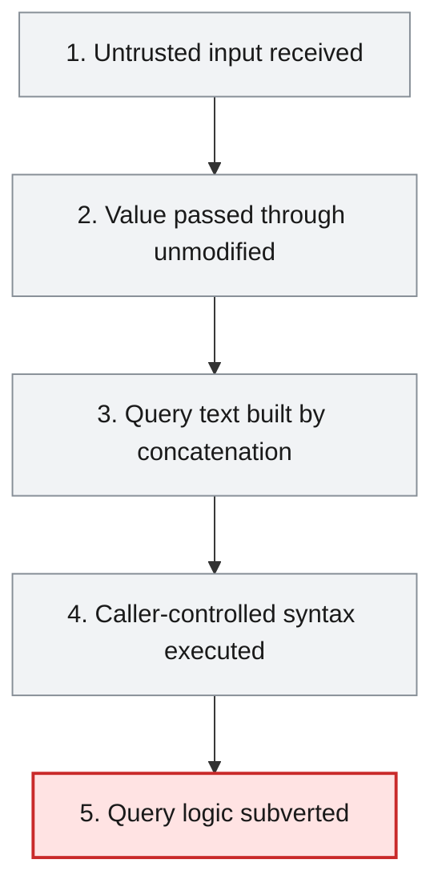
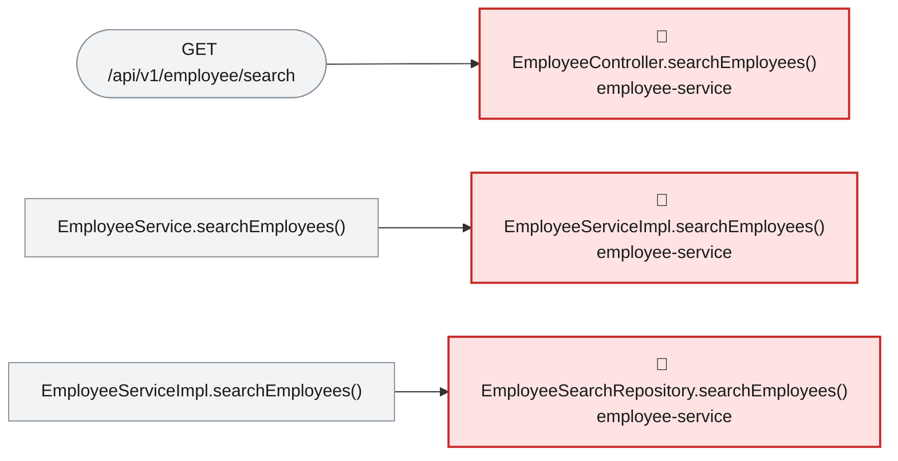

# Root Cause Analysis — ISSUE-003

## MongoDB (NoSQL) injection in the employee search endpoint via string-concatenated BasicQuery

> The employee search feature builds its database query by pasting the caller's search text directly into a query string, so a caller can type search terms that change what the query does instead of just what it matches, letting anyone pull out the entire employee list.

_Generated by the Root Cause Analyst agent on 2026-08-17. Evidence collected 2026-08-17T12:43:56.782Z._

## At a glance

| | |
|---|---|
| **What breaks** | MongoDB (NoSQL) injection in the employee search endpoint via string-concatenated BasicQuery |
| **Root cause** | EmployeeSearchRepository.searchEmployees() concatenates the untrusted `name` and `department` parameters directly into a MongoDB JSON filter string via StringBuilder.append(), then executes that string as a query via `new BasicQuery(filter.toString())`, so caller input controls query structure rather than only query values. |
| **Where** | `employee-service/src/main/java/com/aura/vihanga/employeeservice/repository/EmployeeSearchRepository.java:20-31` |
| **Service** | `employee-service` |
| **Severity** | Critical (Vulnerability) |
| **Confidence** | High |

Issue: [docs/agent_output/00-issues/issue-register.xlsx](../../../docs/agent_output/00-issues/issue-register.xlsx) · Reported 2026-08-09 by Security review (injection) · Status Open

<details><summary>Technical summary</summary>

EmployeeSearchRepository.searchEmployees() builds a MongoDB query by StringBuilder-concatenating the caller-supplied name and department parameters directly into a JSON filter string, with no escaping, quoting or parameterisation, and hands that raw string to `new BasicQuery(...)`. Because the values are spliced into the query document's syntax rather than bound as literal values, a caller can break out of the intended `$regex` clause and inject arbitrary MongoDB query operators (`$ne`, `$where`, etc.), turning a name filter into a query that matches or manipulates the whole collection.

</details>

## 1. What was reported

Because the value is placed inside a single-quoted JSON string that the caller can break out of, the injected payload closes the intended $regex clause and appends attacker-chosen query operators.

Benign request - filter becomes { 'name': { $regex: 'Ann' } }:
   GET /api/v1/employee/search?name=Ann

Injection - return every employee regardless of name. Supplying a name that closes the $regex object and injects an always-true operator turns the filter into one that matches all documents:
   GET /api/v1/employee/search?name=x' } }, { 'name': { $ne: '
The resulting filter string is { 'name': { $regex: 'x' } }, { 'name': { $ne: '' } }, i.e. the $regex constraint is neutralised and the query returns the full collection.

Injection - operator abuse via the department field. The department value is interpolated as a bare JSON value, so an operator document can be injected directly:
   GET /api/v1/employee/search?name=x&department=' }, 'name': { $ne: '

Injection - server-side JavaScript evaluation. If $where/JavaScript execution is enabled on the MongoDB deployment, a $where clause injected through the same hole runs arbitrary JavaScript in the database engine, which can be used for boolean/time-based blind extraction and resource exhaustion.

Reproducibility: Deterministic. The endpoint is unauthenticated (see ISSUE-002), so no credentials are needed to reach the sink.

Source: [docs/agent_output/00-issues/issue-register.xlsx](../../../docs/agent_output/00-issues/issue-register.xlsx)

## 2. What should happen — and what happens instead

```mermaid
flowchart TB
  classDef broken fill:#ffe3e3,stroke:#c92a2a,stroke-width:2px,color:#1a1a1a
  classDef warn fill:#fff3bf,stroke:#e8590c,stroke-width:2px,color:#1a1a1a
  classDef ok fill:#e6fcf5,stroke:#2f9e44,stroke-width:1px,color:#1a1a1a
  classDef neutral fill:#f1f3f5,stroke:#868e96,stroke-width:1px,color:#1a1a1a
  subgraph EXPECTED["✅ What should happen"]
    direction LR
    E0["Request supplies<br/>name/department text"]:::ok
    E1["Service passes values<br/>through unmodified"]:::ok
    E0 --> E1
    E2["Repository binds values as<br/>literal criteria"]:::ok
    E1 --> E2
    E3["MongoDB matches only<br/>intended documents"]:::ok
    E2 --> E3
  end
  subgraph ACTUAL["❌ What actually happens"]
    direction LR
    A0["Untrusted input received"]:::neutral
    A1["Value passed through<br/>unmodified"]:::neutral
    A0 --> A1
    A2["Query text built by<br/>concatenation"]:::neutral
    A1 --> A2
    A3["Caller-controlled syntax<br/>executed"]:::neutral
    A2 --> A3
    A4["Query logic subverted"]:::broken
    A3 --> A4
  end
```



## 3. How it fails, step by step

1. **Untrusted input received** — EmployeeController.searchEmployees() (GET /api/v1/employee/search) reads `name` and, optionally, `department` from @RequestParam with no format or content validation.
2. **Value passed through unmodified** — EmployeeServiceImpl.searchEmployees() forwards both strings to EmployeeSearchRepository.searchEmployees() without inspecting, escaping or quoting them.
3. **Query text built by concatenation** — EmployeeSearchRepository.searchEmployees() builds the filter with `StringBuilder.append()`, splicing `name` inside a `$regex` value and `department` inside a bare JSON value, both delimited only by literal single quotes the caller's own input can contain.
4. **Caller-controlled syntax executed** — The finished string is executed verbatim via `new BasicQuery(filter.toString())`; a `'` or `}` in the input closes the intended sub-document early and lets the caller append arbitrary MongoDB operators such as `$ne`, `$gt` or `$where`.
5. **Query logic subverted** — The database evaluates the caller-authored query structure instead of the intended name filter, returning the full collection (or worse, evaluating injected server-side JavaScript if `$where` execution is enabled), regardless of what the `name` field actually held.



## 4. Where the defect is

> **EmployeeSearchRepository.searchEmployees() concatenates the untrusted `name` and `department` parameters directly into a MongoDB JSON filter string via StringBuilder.append(), then executes that string as a query via `new BasicQuery(filter.toString())`, so caller input controls query structure rather than only query values.**

**Location:** `employee-service/src/main/java/com/aura/vihanga/employeeservice/repository/EmployeeSearchRepository.java:20-31`



Confirmed by reading the file directly: line 20 opens the filter with a literal `{ `, line 21 appends `'name': { $regex: '` + the raw `name` parameter + `' }` with no escaping of quote or brace characters, lines 23-25 conditionally append `, 'department': '` + the raw `department` parameter + `'` under the same pattern, and line 31 passes the fully concatenated string straight into `mongoTemplate.find(new BasicQuery(filter.toString()), Employee.class)`. The evidence bundle's call-chain trace (section 2) shows this is the only place the value is ever inspected or transformed: EmployeeController.searchEmployees() reads `name`/`department` from `@RequestParam` and passes them unmodified to EmployeeService.searchEmployees(), which EmployeeServiceImpl.searchEmployees() (lines 108-122) forwards unmodified again to EmployeeSearchRepository.searchEmployees() — no validation, escaping or `Pattern.quote()` call exists anywhere on this path. This matches the issue's own Detection Notes: `BasicQuery` fed by `StringBuilder`/`append` is used in exactly this one place in the codebase and nowhere else, and no `@Valid` or bean validation is applied at the controller boundary. Because the injected text lands inside the query document's syntax (a raw `'` character or `}` can close the intended sub-document early), a caller controls the shape of the executed query rather than just the value being searched for — this is the mechanism the issue's reproduction demonstrates: `name=x' } }, { 'name': { $ne: '` produces the literal filter `{ 'name': { $regex: 'x' } }, { 'name': { $ne: '' } }`, neutralising the intended constraint.

**The code involved**

| Method | Service | File | Calls | Called by |
|---|---|---|---|---|
| `EmployeeController.searchEmployees()` | `employee-service` | [EmployeeController.java:50-59](../../../employee-service/src/main/java/com/aura/vihanga/employeeservice/controller/EmployeeController.java#L50-L59) | `EmployeeService.searchEmployees()` | _entry point_ |
| `EmployeeServiceImpl.searchEmployees()` | `employee-service` | [EmployeeServiceImpl.java:108-122](../../../employee-service/src/main/java/com/aura/vihanga/employeeservice/service/implementation/EmployeeServiceImpl.java#L108-L122) | `EmployeeSearchRepository.searchEmployees()` | `EmployeeService.searchEmployees()` |
| `EmployeeSearchRepository.searchEmployees()` | `employee-service` | [EmployeeSearchRepository.java:19-32](../../../employee-service/src/main/java/com/aura/vihanga/employeeservice/repository/EmployeeSearchRepository.java#L19-L32) | _none_ | `EmployeeServiceImpl.searchEmployees()` |

<details><summary>Show the source of each method</summary>

**`EmployeeController.searchEmployees()`** — `employee-service/src/main/java/com/aura/vihanga/employeeservice/controller/EmployeeController.java` lines 50-59

```java
@GetMapping("employee/search")
    public ResponseEntity<StandardResponse> searchEmployees(@RequestParam("name") String name,
                                                            @RequestParam(value = "department", required = false) String department) {
        log.trace("EmployeeController - searchEmployees - name {} department {}", name, department);
        List<EmployeeResponse> employeeResponses = employeeService.searchEmployees(name, department);

        return new ResponseEntity<StandardResponse>(
                new StandardResponse(200, "Employee Search Completed Successfully", employeeResponses), HttpStatus.OK
        );
    }
```

**`EmployeeServiceImpl.searchEmployees()`** — `employee-service/src/main/java/com/aura/vihanga/employeeservice/service/implementation/EmployeeServiceImpl.java` lines 108-122

```java
@Override
    public List<EmployeeResponse> searchEmployees(String name, String department) {
        log.trace("EmployeeServiceImpl - searchEmployees - name {} department {}", name, department);
        List<Employee> employees = employeeSearchRepository.searchEmployees(name, department);

        return employees.stream().map(employee -> EmployeeResponse.builder()
                .employeeId(employee.getEmployeeId())
                .name(employee.getName())
                .department(employee.getDepartment())
                .phoneNo(employee.getPhoneNo())
                .address(employee.getAddress())
                .gender(employee.getGender())
                .employeeType(employee.getEmployeeType())
                .build()).collect(Collectors.toList());
    }
```

Reaching paths:

- `EmployeeController.searchEmployees()` → `EmployeeService.searchEmployees()` → `EmployeeServiceImpl.searchEmployees()`

**`EmployeeSearchRepository.searchEmployees()`** — `employee-service/src/main/java/com/aura/vihanga/employeeservice/repository/EmployeeSearchRepository.java` lines 19-32

```java
public List<Employee> searchEmployees(String name, String department) {
        StringBuilder filter = new StringBuilder("{ ");
        filter.append("'name': { $regex: '").append(name).append("' }");

        if (department != null && !department.isEmpty()) {
            filter.append(", 'department': '").append(department).append("'");
        }

        filter.append(" }");

        log.info("EmployeeSearchRepository - searchEmployees - filter {}", filter);

        return mongoTemplate.find(new BasicQuery(filter.toString()), Employee.class);
    }
```

Reaching paths:

- `EmployeeController.searchEmployees()` → `EmployeeService.searchEmployees()` → `EmployeeServiceImpl.searchEmployees()` → `EmployeeSearchRepository.searchEmployees()`

</details>

## 5. What it means

GET /api/v1/employee/search (employee-service, the only endpoint on this issue's affected area) lets any caller who can reach the port neutralise the intended name filter and enumerate the entire employee collection — full PII per the response DTO — by injecting operators such as `$ne` through either the `name` or `department` parameter. Because the injection point sits inside a `$regex` context, a caller can also mount catastrophic/unanchored regex patterns or, if server-side JavaScript execution is enabled on the MongoDB deployment, inject a `$where` clause that runs arbitrary JavaScript inside the database engine for blind boolean/time-based extraction or resource exhaustion. `EmployeeSearchRepository` has no other caller in the graph besides `EmployeeServiceImpl.searchEmployees()` (graph findings, section 5: upstream caller paths 1, confined to employee-service), so the blast surface for this specific defect is this one endpoint, but it sits behind no authentication layer and no upstream bound on result size, so nothing stops an attacker from exploiting it repeatedly and in bulk.

**Why Critical severity:** Critical is correct: this is a full-collection-disclosure and potential remote-code-execution-in-the-database-engine primitive (CWE-943, OWASP A03:2021 Injection) reachable with zero credentials, requiring only a crafted query string. It is chained with ISSUE-002 (no authentication gates the endpoint) and ISSUE-001 (no bound on how much data a single query can return), each of which independently would already justify urgency, and together remove every barrier between an anonymous caller and a full-collection injection.

## 6. Why it happened

- No `@Valid` or bean validation is applied at the EmployeeController boundary, so there is no layer that could reject or sanitise unusual characters before they reach the repository.
- `BasicQuery` accepts a raw JSON string with no distinction between structure and value, so the developer had to opt out of Spring Data's parameterised alternatives (derived queries, `Criteria`) to introduce this pattern.
- The endpoint is unauthenticated (ISSUE-002), so exploiting the injection requires no credentials and can be automated freely.
- No test exercises `searchEmployees()` with adversarial input (quote or brace characters), so the flaw was never caught before reaching this analysis.

## 7. How to fix it

Replace the string-concatenated BasicQuery with Spring Data's parameterised query mechanisms so caller input can only ever populate a bound value, never query structure: use the Criteria API (`Criteria.where("name").regex(Pattern.quote(name))` and `.and("department").is(department)`) built into a `Query` object, or a derived repository method (e.g. `findByNameContainingIgnoreCaseAndDepartment`) if the matching semantics allow it. If a substring/regex search is a hard requirement, wrap the raw input in `Pattern.quote(...)` before it is ever used as a regex source, and add allow-list input validation (length and character class) at the EmployeeController boundary as defence in depth.

| File | Change |
|---|---|
| [EmployeeSearchRepository.java](../../../employee-service/src/main/java/com/aura/vihanga/employeeservice/repository/EmployeeSearchRepository.java) | Replace the StringBuilder/BasicQuery construction with a Criteria-based Query (Criteria.where("name").regex(Pattern.quote(name)), optionally .and("department").is(department)), so name/department are bound as literal values rather than spliced into query text. |
| [EmployeeController.java](../../../employee-service/src/main/java/com/aura/vihanga/employeeservice/controller/EmployeeController.java) | Add bean validation (@Pattern/@Size or a custom validator) on the `name` and `department` @RequestParam values at the controller boundary, as defence in depth alongside the repository fix. |

<details><summary>Sketch of the change</summary>

```java
Query query = new Query(Criteria.where("name").regex(Pattern.quote(name)));
if (department != null && !department.isEmpty()) {
    query.addCriteria(Criteria.where("department").is(department));
}
return mongoTemplate.find(query, Employee.class);
```

</details>

## 8. How to check the fix worked

1. Replay the issue's benign reproduction (`GET /api/v1/employee/search?name=Ann`) and confirm only matching records are returned, same as before the fix.
2. Replay the issue's injection payload (`name=x' } }, { 'name': { $ne: '`) and confirm the response is now either zero matches or a 4xx validation error — not the full collection.
3. Replay the department-field injection payload from the issue and confirm the department value can no longer inject a sibling operator document.
4. Add a unit/integration test asserting EmployeeSearchRepository.searchEmployees() treats a name value containing `'`, `}` or `$` characters as a literal search term, not as query syntax.
5. Confirm via a MongoDB query log (or a Criteria/Query assertion in a slice test) that the executed filter is now built through Criteria, not through string concatenation.

## 9. How to stop it happening again

- Add a static-analysis/SAST rule flagging `new BasicQuery(` (or any MongoTemplate query built from string concatenation of a variable) as a blocked pattern.
- Add bean validation at every controller boundary that accepts free-text search input.
- Add a regression test suite of adversarial inputs (quotes, braces, `$`-prefixed operator names) run against every search/filter endpoint in CI.
- Disable server-side JavaScript execution ($where, mapReduce with JS) on the MongoDB deployment and apply least-privilege to the application's database user, per the issue's Expected Behavior section.

## Appendix — how this was determined

| Input | Detail |
|---|---|
| Issue report | [docs/agent_output/00-issues/issue-register.xlsx](../../../docs/agent_output/00-issues/issue-register.xlsx) |
| Architecture document | [docs/agent_output/01-architecture/architecture.md](../../../docs/agent_output/01-architecture/architecture.md) |
| Function reference | [docs/agent_output/01-architecture/function-reference.md](../../../docs/agent_output/01-architecture/function-reference.md) |
| Code scan | `.github/.pipeline-context/artifacts.json` (generated 2026-08-17T12:36:06.304Z) |
| Knowledge graph | Neo4j, traversal depth 4 |

<details><summary>Architecture observations considered</summary>

- Each service (`department-service`, `employee-service`, `report-service`, `sheduler-service`) follows the same layered convention: `controller` → `service` → `repository` → `model`/`entity`, backed by MongoDB repositories.
- `configuaration-server` and `discovery-service` are infrastructure services (Spring Cloud Config + Eureka) that every business service depends on at startup via `bootstrap.properties`.
- No Feign clients were detected — cross-service calls, if any, likely go through `RestTemplate`/`WebClient` rather than declarative Feign interfaces. Worth confirming if service-to-service coupling should show up as graph edges.
- The generated Neo4j graph can be queried directly (e.g. `MATCH (m:Module)-[:CONTAINS]->(t:Type) RETURN m.name, count(t)`) for deeper, ad-hoc architecture questions beyond this static document.

</details>

<details><summary>Graph queries executed</summary>

**upstream callers**

```cypher
MATCH path = (caller:Method)-[:CALLS*1..4]->(target:Method {id: $id})
         RETURN [n IN nodes(path) | n.id] AS chain LIMIT 200
```

**downstream callees**

```cypher
MATCH path = (target:Method {id: $id})-[:CALLS*1..4]->(callee:Method)
         RETURN [n IN nodes(path) | n.id] AS chain LIMIT 200
```

**owning type, module and exposed endpoints**

```cypher
MATCH (ty:Type)-[:HAS_METHOD]->(m:Method {id: $id})
         OPTIONAL MATCH (ty)-[:EXPOSES]->(e:Endpoint)
         RETURN ty.id AS typeId, ty.name AS typeName, ty.module AS module,
                collect(DISTINCT e.id) AS endpoints
```

**types depending on the owning type**

```cypher
MATCH (other:Type)-[:USES]->(ty:Type)-[:HAS_METHOD]->(:Method {id: $id})
         RETURN DISTINCT other.id AS typeId, other.name AS name, other.module AS module
```

**modules reaching the focus method**

```cypher
MATCH (caller:Method)-[:CALLS*1..4]->(:Method {id: $id})
         MATCH (ct:Type)-[:HAS_METHOD]->(caller)
         RETURN DISTINCT ct.module AS module
```

**graph node counts**

```cypher
MATCH (n) RETURN labels(n)[0] AS label, count(*) AS count ORDER BY count DESC
```

**graph relationship counts**

```cypher
MATCH ()-[r]->() RETURN type(r) AS type, count(*) AS count ORDER BY count DESC
```

**maven dependencies of affected modules**

```cypher
MATCH (m:Module)-[:DEPENDS_ON]->(dep:MavenDependency)
       WHERE m.name IN $modules
       RETURN m.name AS module, collect(dep.ga) AS dependencies
```

</details>

---

The reported symptom, the code table, the source and the call paths are rendered verbatim from the issue, the code scan and the knowledge graph. The plain-language summary, the causal chain, the root cause, what it means, why it happened, the fix, the verification steps and the prevention measures are the judgement of the Root Cause Analyst agent.
