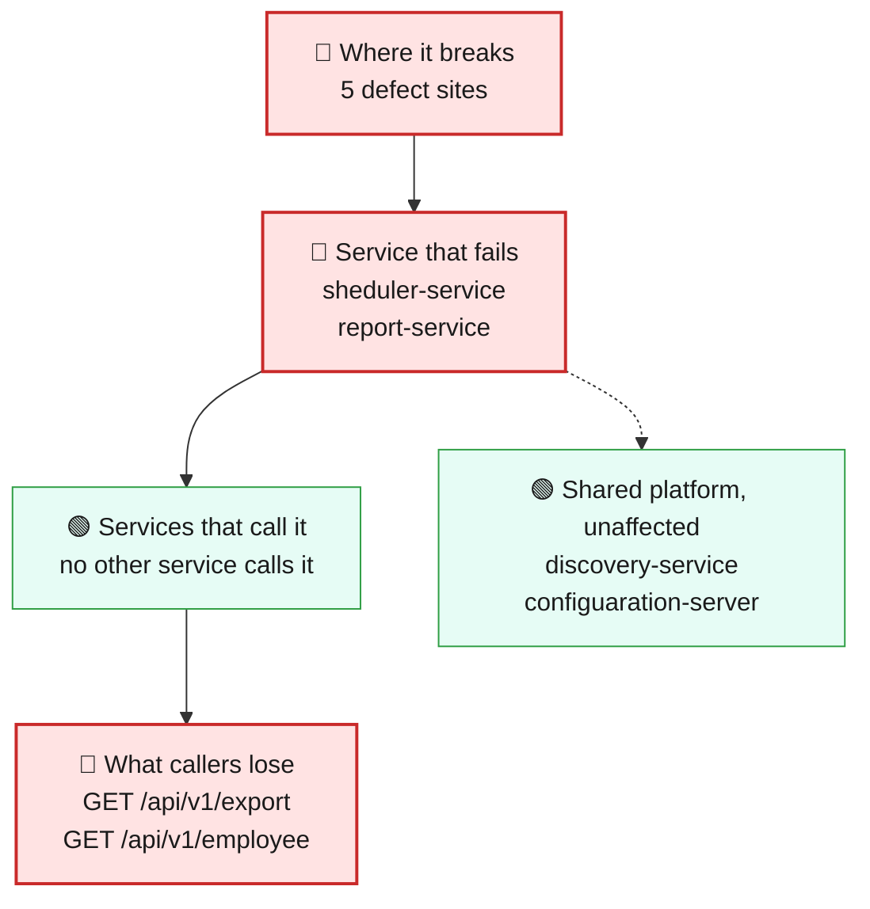
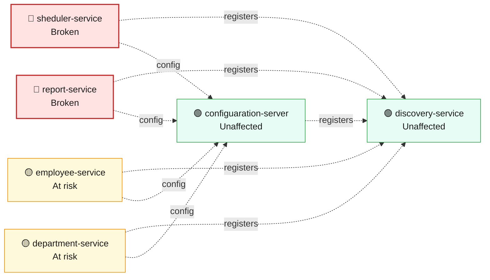

# Blast Radius — ISSUE-001

## Unbounded repository findAll() reads whole collections into memory across multiple services

> A normal-looking request to view the employee list or download the payroll report can force that service to load every employee record into memory at once, risking a slowdown or crash under load -- and the same full-memory cost repeats automatically every year on 8 March.

_Generated by the Blast Radius Analyst on 2026-08-17. Reach measured 2026-08-17T12:49:52.424Z._

## At a glance

| | |
|---|---|
| **Priority** | P2 -- availability risk that scales with data volume and traffic rather than an active breach; fix before the next release, sooner if the employee collection is already large or ISSUE-002 remains unauthenticated (removing any barrier to triggering it repeatedly). |
| **Severity** | High |
| **How far it spreads** | Multiple services |
| **Services broken** | `sheduler-service`, `report-service` |
| **Services degraded** | none |
| **Endpoints down** | 2 of 10 |
| **Scheduled jobs hit** | 1 |
| **Confidence** | Medium |

Root cause: [docs/agent_output/02-root-cause/root_cause_ISSUE-001.md](../../../docs/agent_output/02-root-cause/root_cause_ISSUE-001.md) · Issue: [docs/agent_output/00-issues/issue-register.xlsx](../../../docs/agent_output/00-issues/issue-register.xlsx)

## 1. What is broken

Two unrelated services each load their entire employee collection into memory on every call instead of a bounded page: the scheduler's employee-list endpoint and the report service's payroll export. Every single call already pays the full cost of the collection's current size -- it is not an occasional glitch -- and it gets worse as the number of employees grows or as more people call it at the same time. In the worst case, enough concurrent traffic exhausts the service's memory and it degrades or crashes.

## 2. How far it spreads



| Ring | What it means |
|---|---|
| 🔴 Where it breaks | `EmployeeSchedulerServiceImpl.getAllEmployees()`, `EmployeeReportServiceImpl.getEmployees()`, `WomenDaySchedulerImpl.printWomenDayMessage()`, `EmployeeSchedulerController.getAllEmployees()`, `EmployeeReportController.exportToExcel()` |
| 🔴 Service that fails | sheduler-service and report-service are single-purpose services in this workspace: sheduler-service hosts only the employee-list endpoint, and report-service hosts only the payroll export. Each is broken independently of the other -- neither one calls into the other's defect -- so there is nothing else inside either service left to lose, but if the memory pressure is severe enough to crash the process, that takes the whole service down, not just the one endpoint. |
| 🟢 Services that call it | No other service calls sheduler-service or report-service over HTTP. employee-service holds an HTTP client (WebClient.Builder) but the collector found no reference from it to either affected service, so nothing downstream inherits this defect secondhand. |
| 🟡 Wider platform | sheduler-service and report-service share the same MongoDB deployment as employee-service and department-service. A heap-exhaustion event adds read load to that shared database, but this is a resource-contention risk, not a broken code path -- employee-service and department-service keep working unless the shared database itself is overwhelmed. |

## 3. Which services are affected



| Service | Status | What happens to it |
|---|---|---|
| `sheduler-service` | 🔴 Broken | Contains the defect. This is where the failure starts. |
| `report-service` | 🔴 Broken | Contains the defect. This is where the failure starts. |
| `employee-service` | 🟡 At risk | Shares infrastructure with the broken service, so heavy load or exhaustion there can spill over. |
| `discovery-service` | 🟢 Unaffected | Not on any path to the defect. Keeps working normally. |
| `department-service` | 🟡 At risk | Shares infrastructure with the broken service, so heavy load or exhaustion there can spill over. |
| `configuaration-server` | 🟢 Unaffected | Not on any path to the defect. Keeps working normally. |

## 4. Which endpoints are affected

| Endpoint | Service | Status | What a caller sees |
|---|---|---|---|
| `GET /api/v1/export` | `report-service` | 🔴 Broken | Request fails — this path runs the defect |
| `GET /api/v1/employee` | `sheduler-service` | 🔴 Broken | Request fails — this path runs the defect |

<details><summary>8 endpoint(s) not affected</summary>

| Endpoint | Service |
|---|---|
| `GET /api/v1/department/{id}` | `department-service` |
| `GET /api/v1/department/salary/{minSalary}` | `department-service` |
| `POST /api/v1/department` | `department-service` |
| `GET /api/v1/employee/{id}` | `employee-service` |
| `GET /api/v1/employee/salary/{id}` | `employee-service` |
| `GET /api/v1/employee/search` | `employee-service` |
| `POST /api/v1/employee` | `employee-service` |
| `POST /api/v1/employee/excelUpload` | `employee-service` |

</details>

**Scheduled jobs on the failing path**

| Job | Service | Runs |
|---|---|---|
| `WomenDaySchedulerImpl.printWomenDayMessage()` | `sheduler-service` | cron `0 0 0 8 3 *` |

## 5. What happens on a single request

```mermaid
flowchart LR
  classDef broken fill:#ffe3e3,stroke:#c92a2a,stroke-width:2px,color:#1a1a1a
  classDef degraded fill:#fff3bf,stroke:#e8590c,stroke-width:2px,color:#1a1a1a
  classDef atrisk fill:#fff9db,stroke:#f08c00,stroke-width:1px,color:#1a1a1a
  classDef ok fill:#e6fcf5,stroke:#2f9e44,stroke-width:1px,color:#1a1a1a
  classDef neutral fill:#f1f3f5,stroke:#868e96,stroke-width:1px,color:#1a1a1a
  CALLER(["Caller"]):::neutral
  EP["GET /api/v1/export"]:::neutral
  CALLER --> EP
  N0["EmployeeReportController.exportToExcel()"]:::neutral
  EP --> N0
  N1["EmployeeSchedulerServiceImpl.getAllEmployees()"]:::neutral
  N0 --> N1
  N2["EmployeeReportServiceImpl.getEmployees()"]:::broken
  N1 --> N2
  FAIL["❌ loads entire collection into memory"]:::broken
  N2 --> FAIL
```



## 6. Who feels it

| Who | What they experience | Status |
|---|---|---|
| Anyone calling the scheduler's employee-list endpoint (GET /api/v1/employee) | A response that gets slower as the workforce grows, and -- under enough concurrent calls against a large collection -- a failed or timed-out request as the service runs low on memory. | At risk |
| HR/Payroll staff downloading the payroll export (GET /api/v1/export) | The export can take a long time or fail outright, because report-service holds the full employee list, the full department list, and the finished spreadsheet in memory at the same time before sending a single byte back. | At risk |
| Whoever relies on the annual Women's Day scheduled message (sheduler-service cron, 8 March) | The message still goes out and still lists only female employees, but the job now pays the full-memory cost of loading every employee record just to discard most of them -- wasted resource cost with no visible benefit, and a candidate to fail quietly at midnight if the collection has grown large by then. | Degraded |

## 7. What is NOT affected

Scoping the damage matters as much as describing it.

- Services working normally: `discovery-service`, `configuaration-server`
- employee-service's own endpoints (create, search, get by id, get salary, Excel upload) use different, unrelated repository calls and are not touched by this defect.
- department-service is not on any path to this defect.
- The 8 March scheduled job still delivers its message every time -- it is wasteful, not broken.
- No other service calls sheduler-service or report-service over HTTP, so this does not cascade to a third service.

## 8. Containment and priority

**Priority:** P2 -- availability risk that scales with data volume and traffic rather than an active breach; fix before the next release, sooner if the employee collection is already large or ISSUE-002 remains unauthenticated (removing any barrier to triggering it repeatedly).

**If it is not fixed:** As the employee collection grows, every call to these two endpoints gets heavier; eventually ordinary traffic is enough to exhaust memory and crash the service outright. Because these endpoints require no login (ISSUE-002), anyone can trigger this repeatedly and at will once that threshold is crossed.

**Containment steps**

- Rate-limit or cap concurrent calls to GET /api/v1/employee and GET /api/v1/export until pagination ships.
- Add heap/GC monitoring and alerting on sheduler-service and report-service so pressure is visible before a crash.
- If the employee collection is already large, consider a temporary result cap or scheduling the export for low-traffic windows until the fix ships.
- Flag the 8 March cron run for a manual check until the underlying query is fixed.

The fix itself is in the root cause report: [Recommended Fix](../../../docs/agent_output/02-root-cause/root_cause_ISSUE-001.md).

## 9. Open questions

- The actual size of the employee collection is not visible from the code or the graph -- whether this presents as a minor slowdown or an outright crash depends on it, and the root cause report leaves this open.
- Concurrent production traffic levels against these two endpoints are not visible from the code or graph.

## Appendix — how this was measured

| Input | Detail |
|---|---|
| Root cause report | [docs/agent_output/02-root-cause/root_cause_ISSUE-001.md](../../../docs/agent_output/02-root-cause/root_cause_ISSUE-001.md) |
| Issue report | [docs/agent_output/00-issues/issue-register.xlsx](../../../docs/agent_output/00-issues/issue-register.xlsx) |
| Architecture document | [docs/agent_output/01-architecture/architecture.md](../../../docs/agent_output/01-architecture/architecture.md) |
| Function reference | [docs/agent_output/01-architecture/function-reference.md](../../../docs/agent_output/01-architecture/function-reference.md) |
| Code scan | `.github/.pipeline-context/artifacts.json` |
| Knowledge graph | Neo4j, traversal depth 6 |

**Rules used to assign status**

- 🔴 **Broken** — the service contains the defect, or an endpoint whose handler reaches it
- 🟠 **Degraded** — the service calls a broken service over HTTP; its own code is sound
- 🟡 **At risk** — shares infrastructure with a broken service
- 🟢 **Unaffected** — no code path and no HTTP call to anything broken

Scope for this issue is **multi-service**, so every endpoint hosted by the broken service is marked down.

<details><summary>Graph queries executed</summary>

**endpoints whose handler reaches the defect**

```cypher
MATCH (ty:Type)-[:EXPOSES]->(e:Endpoint)
       MATCH (ty)-[:HAS_METHOD]->(handler:Method)
       MATCH (handler)-[:CALLS*0..6]->(target:Method)
       WHERE target.id IN $defectIds
       RETURN DISTINCT e.id AS endpoint, ty.module AS module, ty.name AS controller
```

**modules that reach the defect in code**

```cypher
MATCH (caller:Method)-[:CALLS*1..6]->(target:Method)
       WHERE target.id IN $defectIds
       MATCH (ct:Type)-[:HAS_METHOD]->(caller)
       RETURN DISTINCT ct.module AS module
```

**endpoint count per affected module**

```cypher
MATCH (m:Module)-[:CONTAINS]->(ty:Type)-[:EXPOSES]->(e:Endpoint)
       WHERE m.name IN $modules
       RETURN m.name AS module, collect(DISTINCT e.id) AS endpoints
```

**types depending on the affected modules**

```cypher
MATCH (other:Type)-[:USES]->(t:Type)
       WHERE t.module IN $modules AND other.module <> t.module
       RETURN DISTINCT other.module AS module, other.name AS type, t.name AS dependsOn
```

**infrastructure shared with other modules**

```cypher
MATCH (m:Module)-[:DEPENDS_ON]->(dep:MavenDependency)<-[:DEPENDS_ON]-(other:Module)
       WHERE m.name IN $modules AND NOT other.name IN $modules
         AND dep.artifactId IN ['spring-boot-starter-data-mongodb','spring-cloud-starter-config','spring-cloud-starter-netflix-eureka-client']
       RETURN dep.artifactId AS dependency, collect(DISTINCT other.name) AS alsoUsedBy
```

**graph size**

```cypher
MATCH (n) RETURN labels(n)[0] AS label, count(*) AS count ORDER BY count DESC
```

</details>

---

Sections 3, 4, 5 and 7 (service lists) are measured from the code scan and the knowledge graph. Sections 1, 2 (ring descriptions), 6 and 8 are the analyst's judgement, scoped to that measurement.
