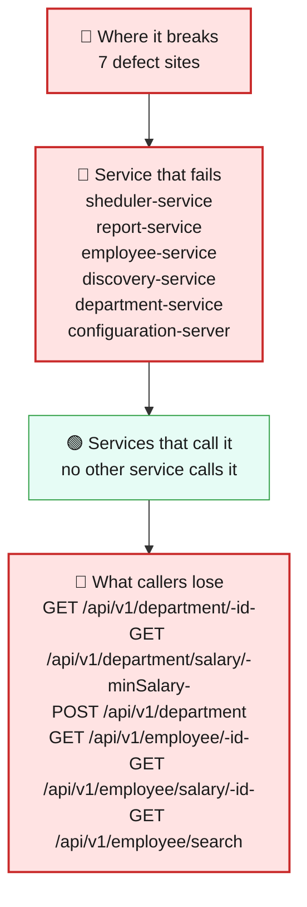
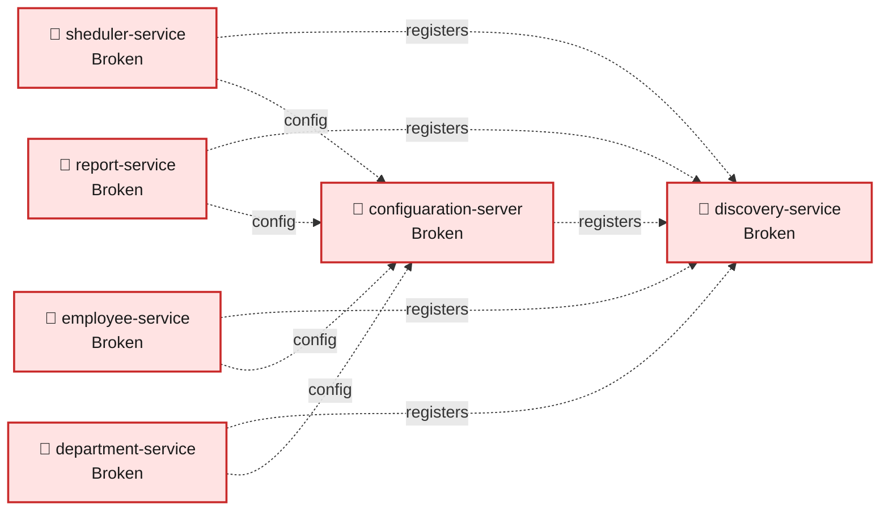

# Blast Radius — ISSUE-002

## Employee PII and payroll data are exposed to unauthenticated callers and written to application logs

> Anyone who can reach these four services over the network can read or overwrite any employee's personal and salary details without logging in -- and the same information is written out in plain text to application log files on every normal request.

_Generated by the Blast Radius Analyst on 2026-08-17. Reach measured 2026-08-17T12:49:58.450Z._

## At a glance

| | |
|---|---|
| **Priority** | P0 -- unauthenticated read/write access to regulated PII and payroll data across four services, plus a live plaintext-logging channel; contain at the network layer today and fix before anything else ships. |
| **Severity** | Critical |
| **How far it spreads** | Multiple services |
| **Services broken** | `sheduler-service`, `report-service`, `employee-service`, `discovery-service`, `department-service`, `configuaration-server` |
| **Services degraded** | none |
| **Endpoints down** | 10 of 10 |
| **Scheduled jobs hit** | 0 |
| **Confidence** | High |

Root cause: [docs/agent_output/02-root-cause/root_cause_ISSUE-002.md](../../../docs/agent_output/02-root-cause/root_cause_ISSUE-002.md) · Issue: [docs/agent_output/00-issues/issue-register.xlsx](../../../docs/agent_output/00-issues/issue-register.xlsx)

## 1. What is broken

None of the six modules in this workspace configures any login or permission check, so every request to department-service, employee-service, report-service and sheduler-service is treated as if it came from a trusted user, whether or not it did. This is not limited to a handful of call sites -- because the check is missing at the workspace level rather than in one piece of code, every endpoint each of those four services hosts is equally reachable without credentials. On top of that, several of those same request paths also print the personal and salary data they just handled into the application's log files in plain text, on every normal (non-error) call, which is a second exposure channel that survives even after login is added.

## 2. How far it spreads



| Ring | What it means |
|---|---|
| 🔴 Where it breaks | `EmployeeSchedulerController.getAllEmployees()`, `EmployeeReportController.exportToExcel()`, `EmployeeReportServiceImpl.getEmployees()`, `EmployeeController.getEmployee()`, `EmployeeController.createEmployee()`, `EmployeeController.searchEmployees()`, `DepartmentController.getAllDepartments()` |
| 🔴 Service that fails | Inside each of the four business services, every endpoint it hosts is reachable without logging in, not only the specific call sites already confirmed exploitable -- department-service exposes department records and salary-banded lookups, employee-service exposes and accepts employee records and free-text search, report-service exposes the full payroll export, and sheduler-service exposes the employee list. Because no service ever assembles a security layer at all, this applies uniformly across every handler each one hosts, not to one code path. |
| 🟢 Services that call it | No service in this workspace holds a working HTTP client that reaches another one of the four -- the collector found zero confirmed cross-service HTTP callers for this issue. Nobody receives this data secondhand from a service that already checked it; every caller reaches the unprotected data directly. |
| 🟢 Wider platform | The four business services all share the same MongoDB database, so this is effectively one exposure surface, not four independent ones. The issue register also lists configuaration-server and discovery-service as affected, but neither this analysis nor a graph query run for this report could find any endpoint, controller or authentication-relevant code in either module -- see the open question below before treating those two the same as the four confirmed services. |

## 3. Which services are affected



| Service | Status | What happens to it |
|---|---|---|
| `sheduler-service` | 🔴 Broken | Contains the defect. This is where the failure starts. |
| `report-service` | 🔴 Broken | Contains the defect. This is where the failure starts. |
| `employee-service` | 🔴 Broken | Contains the defect. This is where the failure starts. |
| `discovery-service` | 🔴 Broken | Contains the defect. This is where the failure starts. |
| `department-service` | 🔴 Broken | Contains the defect. This is where the failure starts. |
| `configuaration-server` | 🔴 Broken | Contains the defect. This is where the failure starts. |

## 4. Which endpoints are affected

| Endpoint | Service | Status | What a caller sees |
|---|---|---|---|
| `GET /api/v1/department/{id}` | `department-service` | 🔴 Broken | Request fails — the service hosting it is down |
| `GET /api/v1/department/salary/{minSalary}` | `department-service` | 🔴 Broken | Request fails — this path runs the defect |
| `POST /api/v1/department` | `department-service` | 🔴 Broken | Request fails — the service hosting it is down |
| `GET /api/v1/employee/{id}` | `employee-service` | 🔴 Broken | Request fails — this path runs the defect |
| `GET /api/v1/employee/salary/{id}` | `employee-service` | 🔴 Broken | Request fails — the service hosting it is down |
| `GET /api/v1/employee/search` | `employee-service` | 🔴 Broken | Request fails — this path runs the defect |
| `POST /api/v1/employee` | `employee-service` | 🔴 Broken | Request fails — this path runs the defect |
| `POST /api/v1/employee/excelUpload` | `employee-service` | 🔴 Broken | Request fails — the service hosting it is down |
| `GET /api/v1/export` | `report-service` | 🔴 Broken | Request fails — this path runs the defect |
| `GET /api/v1/employee` | `sheduler-service` | 🔴 Broken | Request fails — this path runs the defect |

## 5. What happens on a single request

```mermaid
flowchart LR
  classDef broken fill:#ffe3e3,stroke:#c92a2a,stroke-width:2px,color:#1a1a1a
  classDef degraded fill:#fff3bf,stroke:#e8590c,stroke-width:2px,color:#1a1a1a
  classDef atrisk fill:#fff9db,stroke:#f08c00,stroke-width:1px,color:#1a1a1a
  classDef ok fill:#e6fcf5,stroke:#2f9e44,stroke-width:1px,color:#1a1a1a
  classDef neutral fill:#f1f3f5,stroke:#868e96,stroke-width:1px,color:#1a1a1a
  CALLER(["Caller"]):::neutral
  EP["GET /api/v1/department/salary/-minSalary-"]:::neutral
  CALLER --> EP
  N0["DepartmentController.getAllDepartments()"]:::neutral
  EP --> N0
  N1["EmployeeSchedulerController.getAllEmployees()"]:::neutral
  N0 --> N1
  N2["EmployeeReportController.exportToExcel()"]:::broken
  N1 --> N2
  FAIL["❌ no login step exists anywhere"]:::broken
  N2 --> FAIL
```



## 6. Who feels it

| Who | What they experience | Status |
|---|---|---|
| Every employee whose record exists in the system (the data subject) | Nothing visible -- this is silent to them. Their name, address, phone number, gender and salary can be read, and their record can be overwritten, by anyone who can reach the service, with no login step and no log entry tying the action to a person. | At risk |
| Security, privacy and compliance teams | Regulated PII and payroll data are reachable and writable with zero credentials, and the same fields land in plaintext log output on every normal call -- a reportable exposure regardless of whether it has already been exploited. | At risk |
| Anyone who later needs to investigate a suspected breach | No investigation is possible -- because no request is ever tied to an authenticated caller, there is no way to determine after the fact who read or changed a given record, or to prove that nobody did. | Blocked |
| Whoever operates the log aggregation platform report-service and employee-service ship to | Full names and salary figures accumulating in that platform in plaintext on every normal request, independent of whatever gets done about authentication. | At risk |

## 7. What is NOT affected

Scoping the damage matters as much as describing it.

- The functional behaviour of every endpoint is unchanged for a legitimate caller -- reads still return correct data and writes still save correctly. Nothing here breaks a feature; it removes the door that should have been locked in front of it.
- No cross-service HTTP call was found that spreads this beyond the four business services -- nothing downstream receives bad data secondhand.
- The business logic itself (validation, calculations, storage) in each of the four services is not implicated -- the defect is the absence of a security layer plus unscrubbed logging, not a logic error in what each endpoint computes.

## 8. Containment and priority

**Priority:** P0 -- unauthenticated read/write access to regulated PII and payroll data across four services, plus a live plaintext-logging channel; contain at the network layer today and fix before anything else ships.

**If it is not fixed:** Every day this stays live, more PII and payroll data accumulates in plaintext logs, which are typically retained longer and read more broadly than the database itself, and the absence of any audit trail means a breach that has already happened can never be scoped or ruled out.

**Containment steps**

- Put the exposed endpoints behind a network-level control (VPN, firewall allow-list, or API gateway auth) immediately -- there is no in-application barrier today.
- Scrub or restrict access to any log aggregation platform that report-service and employee-service already ship to, since PII and salary data have been flowing there in plaintext.
- Turn down employee-service's committed TRACE logging level as an immediate stop-gap.
- Treat this as a reportable exposure for compliance purposes given the regulated data involved and the absence of any audit trail to scope a prior breach.

The fix itself is in the root cause report: [Recommended Fix](../../../docs/agent_output/02-root-cause/root_cause_ISSUE-002.md).

## 9. Open questions

- The issue register lists configuaration-server and discovery-service as affected, and the measured facts mark both 'Broken' on that basis alone. A graph query run for this report ('configuaration-server and discovery-service code inventory', see appendix) found exactly 2 Type nodes and 0 endpoints in each module -- almost certainly just the @SpringBootApplication class -- with no controller code or resolvable defect site. The register's claims about open Eureka registration and cleartext config-store secrets concern bootstrap/application properties, which this code graph does not capture the way it captures controller code. Treat those two services' 'Broken' status as unverified pending a direct review of their configuration files, not as confirmed the way the four business services are.
- The concrete role model a fix would need (e.g., what distinguishes an ordinary authenticated user from someone allowed to see payroll data) is a product decision the evidence does not settle, per the root cause report.

## Appendix — how this was measured

| Input | Detail |
|---|---|
| Root cause report | [docs/agent_output/02-root-cause/root_cause_ISSUE-002.md](../../../docs/agent_output/02-root-cause/root_cause_ISSUE-002.md) |
| Issue report | [docs/agent_output/00-issues/issue-register.xlsx](../../../docs/agent_output/00-issues/issue-register.xlsx) |
| Architecture document | [docs/agent_output/01-architecture/architecture.md](../../../docs/agent_output/01-architecture/architecture.md) |
| Function reference | [docs/agent_output/01-architecture/function-reference.md](../../../docs/agent_output/01-architecture/function-reference.md) |
| Code scan | `.github/.pipeline-context/artifacts.json` |
| Knowledge graph | Neo4j, traversal depth 6 |

**Rules used to assign status**

- 🔴 **Broken** — the service contains the defect, or an endpoint whose handler reaches it
- 🟠 **Degraded** — the service calls a broken service over HTTP; its own code is sound
- 🟡 **At risk** — shares infrastructure with a broken service
- 🟢 **Unaffected** — no code path and no HTTP call to anything broken

Scope for this issue is **multi-service**, so every endpoint hosted by the broken service is marked down.

<details><summary>Graph queries executed</summary>

**endpoints whose handler reaches the defect**

```cypher
MATCH (ty:Type)-[:EXPOSES]->(e:Endpoint)
       MATCH (ty)-[:HAS_METHOD]->(handler:Method)
       MATCH (handler)-[:CALLS*0..6]->(target:Method)
       WHERE target.id IN $defectIds
       RETURN DISTINCT e.id AS endpoint, ty.module AS module, ty.name AS controller
```

**modules that reach the defect in code**

```cypher
MATCH (caller:Method)-[:CALLS*1..6]->(target:Method)
       WHERE target.id IN $defectIds
       MATCH (ct:Type)-[:HAS_METHOD]->(caller)
       RETURN DISTINCT ct.module AS module
```

**endpoint count per affected module**

```cypher
MATCH (m:Module)-[:CONTAINS]->(ty:Type)-[:EXPOSES]->(e:Endpoint)
       WHERE m.name IN $modules
       RETURN m.name AS module, collect(DISTINCT e.id) AS endpoints
```

**types depending on the affected modules**

```cypher
MATCH (other:Type)-[:USES]->(t:Type)
       WHERE t.module IN $modules AND other.module <> t.module
       RETURN DISTINCT other.module AS module, other.name AS type, t.name AS dependsOn
```

**infrastructure shared with other modules**

```cypher
MATCH (m:Module)-[:DEPENDS_ON]->(dep:MavenDependency)<-[:DEPENDS_ON]-(other:Module)
       WHERE m.name IN $modules AND NOT other.name IN $modules
         AND dep.artifactId IN ['spring-boot-starter-data-mongodb','spring-cloud-starter-config','spring-cloud-starter-netflix-eureka-client']
       RETURN dep.artifactId AS dependency, collect(DISTINCT other.name) AS alsoUsedBy
```

**graph size**

```cypher
MATCH (n) RETURN labels(n)[0] AS label, count(*) AS count ORDER BY count DESC
```

**configuaration-server and discovery-service code inventory (verify whether either module has any resolvable defect site, controller, or endpoint before accepting the issue register's Broken classification for these two infra modules) — asked by the analyst**

```cypher
MATCH (m:Module) WHERE m.name IN ['configuaration-server','discovery-service'] OPTIONAL MATCH (m)-[:CONTAINS]->(t:Type) OPTIONAL MATCH (t)-[:EXPOSES]->(e:Endpoint) RETURN m.name AS module, count(DISTINCT t) AS types, count(DISTINCT e) AS endpoints, collect(DISTINCT t.name)[0..10] AS sampleTypes
```

</details>

---

Sections 3, 4, 5 and 7 (service lists) are measured from the code scan and the knowledge graph. Sections 1, 2 (ring descriptions), 6 and 8 are the analyst's judgement, scoped to that measurement.
