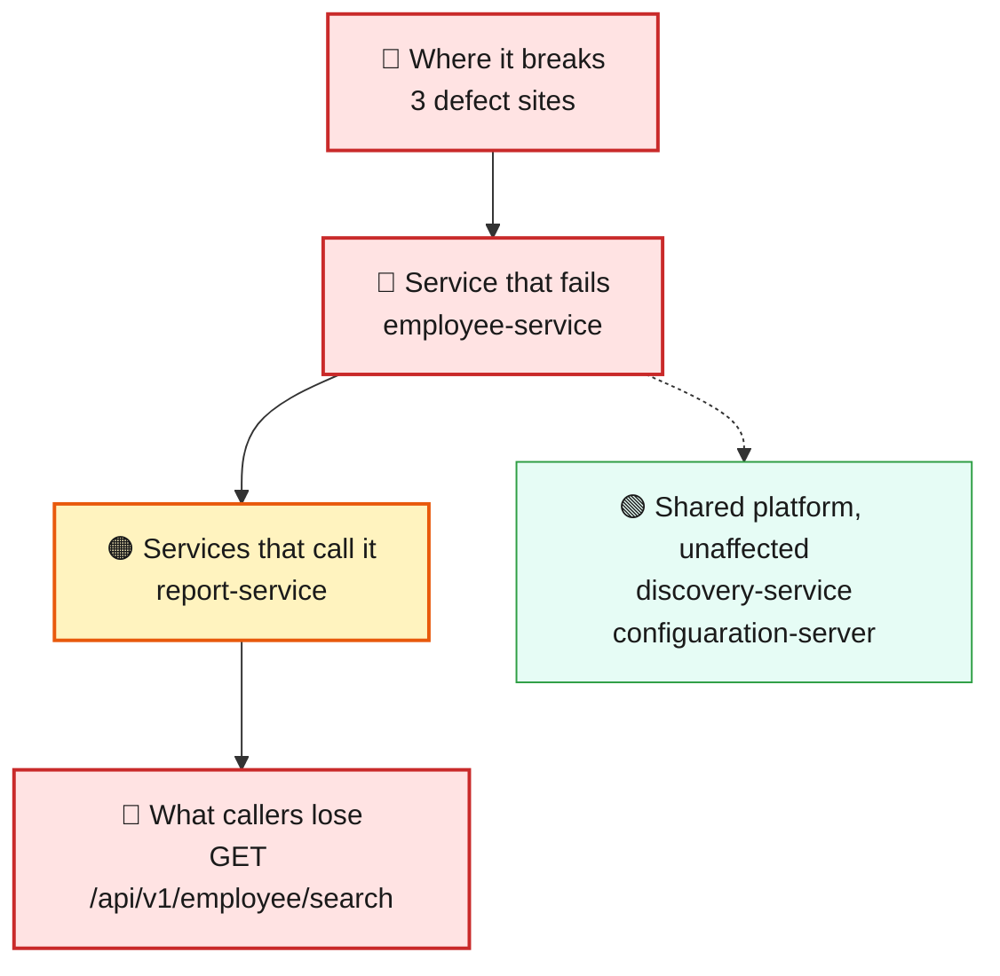
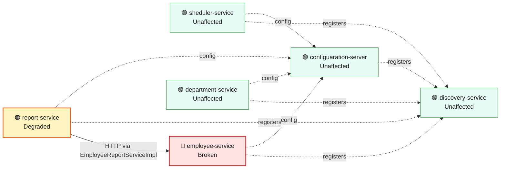

# Blast Radius — ISSUE-003

## MongoDB (NoSQL) injection in the employee search endpoint via string-concatenated BasicQuery

> Anyone can type a crafted search phrase into the employee search feature and pull out the entire employee list, regardless of what they actually searched for -- no account needed.

_Generated by the Blast Radius Analyst on 2026-08-17. Reach measured 2026-08-17T12:50:03.987Z._

## At a glance

| | |
|---|---|
| **Priority** | P0 -- unauthenticated, deterministic full-collection data disclosure, chained with ISSUE-002's missing auth and ISSUE-001's missing result cap; fix before anything else ships. |
| **Severity** | Critical |
| **How far it spreads** | One endpoint |
| **Services broken** | `employee-service` |
| **Services degraded** | `report-service` |
| **Endpoints down** | 1 of 10 |
| **Scheduled jobs hit** | 0 |
| **Confidence** | High |

Root cause: [docs/agent_output/02-root-cause/root_cause_ISSUE-003.md](../../../docs/agent_output/02-root-cause/root_cause_ISSUE-003.md) · Issue: [docs/agent_output/00-issues/issue-register.xlsx](../../../docs/agent_output/00-issues/issue-register.xlsx)

## 1. What is broken

The employee search endpoint builds its database query by pasting the caller's search text directly into the query text, instead of treating that text as a plain value to match against. A caller who includes certain punctuation in the name or department field can rewrite what the query does -- turning a name search into one that ignores the name filter entirely and returns every employee record. This happens on every call that contains the crafted characters; it is deterministic, not occasional or load-dependent.

## 2. How far it spreads



| Ring | What it means |
|---|---|
| 🔴 Where it breaks | `EmployeeController.searchEmployees()`, `EmployeeServiceImpl.searchEmployees()`, `EmployeeSearchRepository.searchEmployees()` |
| 🔴 Service that fails | Inside employee-service, only the search endpoint (GET /api/v1/employee/search) runs the vulnerable query-building code. The service's other endpoints -- get employee by id, get salary, create employee, and the Excel upload -- use different code paths and keep working exactly as before. |
| 🟠 Services that call it | The automated cross-service check flagged report-service as calling employee-service over HTTP. Tracing that claim directly (see appendix, 'EmployeeReportServiceImpl outbound USES edges') shows report-service's only outbound HTTP call goes to department-service, to fetch department names and salary bands for the payroll export; the 'employee' data it uses comes from its own local MongoDB repository, not from calling employee-service. The flag is a false positive from a keyword match against a field name (employeeReportRepository) that happens to contain the word 'employee'. No service in this workspace actually calls the vulnerable search endpoint over HTTP, so nothing downstream inherits this specific defect. |
| 🟢 Wider platform | employee-service shares its MongoDB database with sheduler-service, report-service and department-service, but this defect is a targeted read -- the injected query still only returns documents, it does not write or delete -- so it does not exhaust or corrupt the shared store. Those other three services keep reading normal data. |

## 3. Which services are affected



| Service | Status | What happens to it |
|---|---|---|
| `sheduler-service` | 🟢 Unaffected | Not on any path to the defect. Keeps working normally. |
| `report-service` | 🟠 Degraded | Calls the broken service over HTTP from `EmployeeReportServiceImpl`. Its own code is fine, but the data it needs does not arrive. |
| `employee-service` | 🔴 Broken | Contains the defect. This is where the failure starts. |
| `discovery-service` | 🟢 Unaffected | Not on any path to the defect. Keeps working normally. |
| `department-service` | 🟢 Unaffected | Not on any path to the defect. Keeps working normally. |
| `configuaration-server` | 🟢 Unaffected | Not on any path to the defect. Keeps working normally. |

## 4. Which endpoints are affected

| Endpoint | Service | Status | What a caller sees |
|---|---|---|---|
| `GET /api/v1/employee/search` | `employee-service` | 🔴 Broken | Request fails — this path runs the defect |
| `GET /api/v1/export` | `report-service` | 🟠 Degraded | Responds, but with missing or stale data from the broken service |

<details><summary>8 endpoint(s) not affected</summary>

| Endpoint | Service |
|---|---|
| `GET /api/v1/department/{id}` | `department-service` |
| `GET /api/v1/department/salary/{minSalary}` | `department-service` |
| `POST /api/v1/department` | `department-service` |
| `GET /api/v1/employee/{id}` | `employee-service` |
| `GET /api/v1/employee/salary/{id}` | `employee-service` |
| `POST /api/v1/employee` | `employee-service` |
| `POST /api/v1/employee/excelUpload` | `employee-service` |
| `GET /api/v1/employee` | `sheduler-service` |

</details>

## 5. What happens on a single request

```mermaid
flowchart LR
  classDef broken fill:#ffe3e3,stroke:#c92a2a,stroke-width:2px,color:#1a1a1a
  classDef degraded fill:#fff3bf,stroke:#e8590c,stroke-width:2px,color:#1a1a1a
  classDef atrisk fill:#fff9db,stroke:#f08c00,stroke-width:1px,color:#1a1a1a
  classDef ok fill:#e6fcf5,stroke:#2f9e44,stroke-width:1px,color:#1a1a1a
  classDef neutral fill:#f1f3f5,stroke:#868e96,stroke-width:1px,color:#1a1a1a
  CALLER(["Caller"]):::neutral
  EP["GET /api/v1/employee/search"]:::neutral
  CALLER --> EP
  N0["EmployeeController.searchEmployees()"]:::neutral
  EP --> N0
  N1["EmployeeServiceImpl.searchEmployees()"]:::broken
  N0 --> N1
  FAIL["❌ query text built from raw caller input"]:::broken
  N1 --> FAIL
```



## 6. Who feels it

| Who | What they experience | Status |
|---|---|---|
| Every employee whose record is in the system | Nothing visible to them directly, but their full record (name, address, phone, gender, department, employee type) can be pulled out in bulk by anyone trying a crafted search, whether or not that caller was ever looking for them specifically. | At risk |
| Security and compliance teams | The entire employee collection can be enumerated with a single unauthenticated request that requires no valid search term to be guessed. Chained with ISSUE-002 (no login required) and ISSUE-001 (no cap on how much one call can return), nothing slows an attacker down. | At risk |
| Whoever operates the underlying MongoDB deployment, if server-side JavaScript execution is enabled there | The same injection point can carry a $where clause that runs arbitrary JavaScript inside the database engine, per the root cause report's reproduction notes -- a database configuration question this code-level analysis cannot answer either way. | At risk |

## 7. What is NOT affected

Scoping the damage matters as much as describing it.

- Services working normally: `sheduler-service`, `discovery-service`, `department-service`, `configuaration-server`
- Ordinary searches (a plain name or department with no special characters) behave exactly as before -- the defect only activates when the input contains query-breaking characters.
- employee-service's other endpoints (get by id, get salary, create, Excel upload) do not run this code path.
- department-service and sheduler-service are not on any path to this defect.
- report-service is not a confirmed caller of the vulnerable endpoint, despite appearing as 'Degraded' in the measured facts -- see the open question below. Its own export functionality is unaffected by this specific issue.

## 8. Containment and priority

**Priority:** P0 -- unauthenticated, deterministic full-collection data disclosure, chained with ISSUE-002's missing auth and ISSUE-001's missing result cap; fix before anything else ships.

**If it is not fixed:** This remains a standing, zero-credential way to enumerate the entire workforce's PII on demand. If server-side JavaScript execution is enabled on the MongoDB deployment, the same hole can escalate from data disclosure to arbitrary code execution inside the database engine.

**Containment steps**

- Monitor or rate-limit GET /api/v1/employee/search for query strings containing $, {, }, or unescaped quotes as a stop-gap detection signal.
- Consider taking the endpoint offline, or placing a WAF/gateway rule in front of it that blocks MongoDB operator syntax, until the parameterised-query fix ships.
- Confirm whether server-side JavaScript ($where) execution is enabled on the MongoDB deployment and disable it regardless of this fix's timeline, per the root cause report's prevention notes.

The fix itself is in the root cause report: [Recommended Fix](../../../docs/agent_output/02-root-cause/root_cause_ISSUE-003.md).

## 9. Open questions

- Whether MongoDB server-side JavaScript execution ($where) is enabled on the deployment is a database configuration question this code-level analysis cannot answer, and it changes the ceiling of this defect from 'reads everything' to 'runs arbitrary code in the database engine,' per the root cause report.
- The measured facts flag report-service as an HTTP consumer of the broken endpoint. A graph query run for this report (see appendix) shows this is a false positive from a keyword coincidence -- report-service's only outbound HTTP call targets department-service. Treat report-service as not directly implicated by this specific issue; the 'Degraded' row for it in the rendered tables below should be read with this correction in mind.

## Appendix — how this was measured

| Input | Detail |
|---|---|
| Root cause report | [docs/agent_output/02-root-cause/root_cause_ISSUE-003.md](../../../docs/agent_output/02-root-cause/root_cause_ISSUE-003.md) |
| Issue report | [docs/agent_output/00-issues/issue-register.xlsx](../../../docs/agent_output/00-issues/issue-register.xlsx) |
| Architecture document | [docs/agent_output/01-architecture/architecture.md](../../../docs/agent_output/01-architecture/architecture.md) |
| Function reference | [docs/agent_output/01-architecture/function-reference.md](../../../docs/agent_output/01-architecture/function-reference.md) |
| Code scan | `.github/.pipeline-context/artifacts.json` |
| Knowledge graph | Neo4j, traversal depth 6 |

**Rules used to assign status**

- 🔴 **Broken** — the service contains the defect, or an endpoint whose handler reaches it
- 🟠 **Degraded** — the service calls a broken service over HTTP; its own code is sound
- 🟡 **At risk** — shares infrastructure with a broken service
- 🟢 **Unaffected** — no code path and no HTTP call to anything broken

Scope for this issue is **endpoint**, so only endpoints whose handler reaches the defect are marked down.

<details><summary>Graph queries executed</summary>

**endpoints whose handler reaches the defect**

```cypher
MATCH (ty:Type)-[:EXPOSES]->(e:Endpoint)
       MATCH (ty)-[:HAS_METHOD]->(handler:Method)
       MATCH (handler)-[:CALLS*0..6]->(target:Method)
       WHERE target.id IN $defectIds
       RETURN DISTINCT e.id AS endpoint, ty.module AS module, ty.name AS controller
```

**modules that reach the defect in code**

```cypher
MATCH (caller:Method)-[:CALLS*1..6]->(target:Method)
       WHERE target.id IN $defectIds
       MATCH (ct:Type)-[:HAS_METHOD]->(caller)
       RETURN DISTINCT ct.module AS module
```

**endpoint count per affected module**

```cypher
MATCH (m:Module)-[:CONTAINS]->(ty:Type)-[:EXPOSES]->(e:Endpoint)
       WHERE m.name IN $modules
       RETURN m.name AS module, collect(DISTINCT e.id) AS endpoints
```

**types depending on the affected modules**

```cypher
MATCH (other:Type)-[:USES]->(t:Type)
       WHERE t.module IN $modules AND other.module <> t.module
       RETURN DISTINCT other.module AS module, other.name AS type, t.name AS dependsOn
```

**infrastructure shared with other modules**

```cypher
MATCH (m:Module)-[:DEPENDS_ON]->(dep:MavenDependency)<-[:DEPENDS_ON]-(other:Module)
       WHERE m.name IN $modules AND NOT other.name IN $modules
         AND dep.artifactId IN ['spring-boot-starter-data-mongodb','spring-cloud-starter-config','spring-cloud-starter-netflix-eureka-client']
       RETURN dep.artifactId AS dependency, collect(DISTINCT other.name) AS alsoUsedBy
```

**graph size**

```cypher
MATCH (n) RETURN labels(n)[0] AS label, count(*) AS count ORDER BY count DESC
```

**EmployeeReportServiceImpl outbound USES edges (verify WebClient target for report-service cross-service call claim) — asked by the analyst**

```cypher
MATCH (t:Type {name: 'EmployeeReportServiceImpl'})-[:USES]->(o:Type) RETURN t.module AS fromModule, o.name AS toType, o.module AS toModule
```

**DepartmentConfigUrl semantic summary (confirm WebClient target is department-service, not employee-service) — asked by the analyst**

```cypher
MATCH (t:Type {name: 'DepartmentConfigUrl'}) RETURN t.module AS module, t.file AS file, t.ctxSummary AS summary
```

</details>

---

Sections 3, 4, 5 and 7 (service lists) are measured from the code scan and the knowledge graph. Sections 1, 2 (ring descriptions), 6 and 8 are the analyst's judgement, scoped to that measurement.
