# The Vulnerability Remediation Pipeline — End-to-End Flow

This is the plain-language, diagram-led explanation of the whole pipeline: what goes in, what comes
out, and what happens at every step in between. It covers all 8 agents (`00`–`07`), and goes into
extra depth on **Agent 4**, since that's the agent that actually decides *how* to fix something.

> If you want the terse, technical reference instead, see
> [`agent-workflow-reference.md`](agent-workflow-reference.md) or
> [`../.github/README.md`](../.github/README.md). This file is the "explain it to a new teammate"
> version, with a diagram for every stage.

---

## 1. What this whole thing does, in one paragraph

Someone (a scanner, a pen-tester, a security reviewer) reports a vulnerability. Instead of a person
manually reading the code, figuring out the blast radius, writing a fix, testing it, and deciding if
it's safe to ship, this pipeline does all of that — but every step is written down as a file, every
factual claim is separated from every opinion, a human has to explicitly approve the fix approach
*before* any code gets touched, and one clearly-defined stage (and only that stage) is allowed to say
"this is safe to merge." Nothing is ever pushed to a branch or opened as a PR unless a human explicitly
asks for it after seeing a `Cleared` verdict.

Think of it like a hospital: a patient's chart comes in (the vulnerability report), a specialist maps
out the whole facility once (the Architect), a diagnostician figures out what's actually wrong (Root
Cause), another specialist checks how far the illness could spread (Blast Radius), a doctor writes a
treatment plan that a patient (human) has to sign off on before any treatment happens (Fix Generator +
human gate), the treatment is administered and independently checked from three different angles (the
test agents), and finally a review board either clears the patient to go home or blocks discharge with
a written reason (Audit & PR). Every step leaves a paper trail.

---

## 2. The whole pipeline in one picture

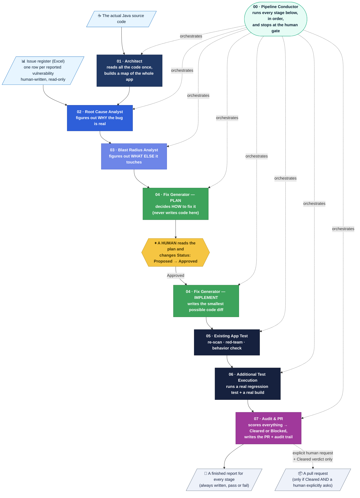

**Reading it left to right, top to bottom:** two things go in — the issue register (what's wrong) and
the source code (where it lives). Everything from `01` to `03` is fully automatic and just builds
understanding. `04` is where the pipeline stops being automatic: it proposes a plan, and a **real
person** has to approve it before any code is written. Once approved, `04` writes the smallest possible
patch, and `05`/`06` independently beat on that patch to see if it actually holds up. `07` is the only
stage allowed to say "ship it," and even then, nothing gets pushed anywhere unless a human explicitly
asks for it.

---

## 3. Every agent, one at a time

Every stage follows the same discipline: **facts are collected by a script** (it can only measure, not
opine), **judgement is written by the agent** (but only inside a fixed template it can't escape), and a
**renderer script** merges the two into the final Markdown report. That way, anyone reading a report can
tell which sentences are *measured* and which are *reasoned*.

### 00 · Pipeline Conductor — the orchestrator

Doesn't analyze anything itself. It just calls the other agents in the right order, waits for each one
to finish, checks whether the next stage actually has work to do, and enforces the human-approval gate.

| | |
|---|---|
| **Input** | A mode word — `analyze` (run 01→04-plan) or `resume` (run 04-implement→07) — or a specific issue id |
| **Output** | A short run ledger: which stages ran, which issues were covered, where it stopped and why |
| **Never does** | Edit application code, skip a gate, or override any other agent's judgement |

```mermaid
flowchart LR
    START([Operator says<br/>"analyze" or "resume"]) --> C{Which mode?}
    C -->|analyze| P1["01 → 02 → 03 → 04-plan"]
    C -->|resume| P2["04-implement → 05 → 06 → 07"]
    P1 --> STOP1["Stop — report which plans<br/>are waiting for human approval"]
    P2 --> STOP2["Stop — report the final<br/>Cleared / Blocked verdicts"]
    classDef step fill:#e6fcf5,stroke:#0ca678,color:#0b1f33
    class P1,P2 step
```

### 01 · Architect — builds the map

Reads **every** Java file and every `pom.xml` **once**, turns that into a structured model of the
codebase, adds a plain-English description of what the important pieces mean, loads all of it into a
graph database (Neo4j) so later agents can ask "what calls this?" or "what does this depend on?", and
writes two human-readable documents. Every later agent reuses this — it doesn't run again unless the
code changes.

| | |
|---|---|
| **Input** | Raw Java + Maven source (6 microservices) |
| **Output** | `artifacts.json` (parsed facts) → semantic descriptions → a Neo4j knowledge graph → `architecture.md` + `function-reference.md` |
| **Runs** | Once per application, then reused by every other agent |

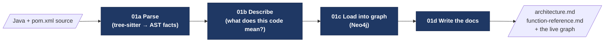

### 02 · Root Cause Analyst — figures out WHY

Takes one row from the issue register and asks: is this actually a real bug, and if so, exactly where
and why? It cross-references the reported symptom against the architecture docs and the live graph, so
it can tell the difference between the file that's actually broken and a file that merely sits on the
call path to it.

| | |
|---|---|
| **Input** | One issue row (from the Excel register) + `architecture.md` + `function-reference.md` + the knowledge graph |
| **Output** | `root_cause_<issue_id>.md` — one per issue |
| **Never does** | Edit the register, propose a fix, or measure impact (that's Agent 03) |

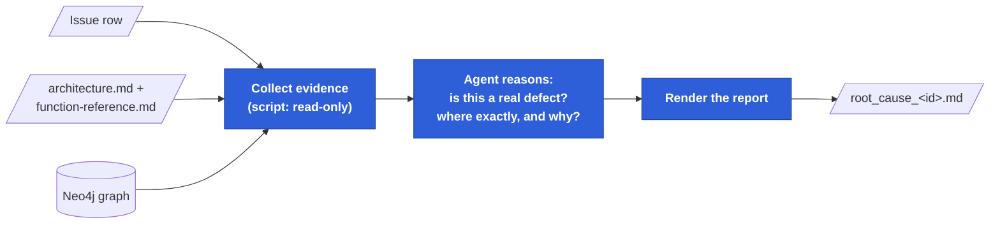

### 03 · Blast Radius Analyst — figures out WHAT ELSE breaks

Takes the confirmed root cause and traces outward through the graph: which services actually break,
which just degrade, which endpoints are exposed to it, and — just as important — what is **not**
affected. Priority is set by real reachability, not by how scary the CWE name sounds.

| | |
|---|---|
| **Input** | `root_cause_<id>.md` + `architecture.md` + `function-reference.md` + the knowledge graph |
| **Output** | `blast_radius_<id>.md` — one per root-cause report |
| **Never does** | Re-diagnose the defect or propose a fix |

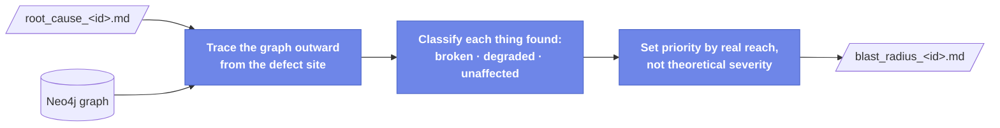

### 04 · Fix Generator — decides HOW, then writes the code

This is the pipeline's most complex agent — it has **two stages and four skills**, with a human
approval checkpoint sitting between them. Because it deserves more than a summary paragraph, it gets
its own full section: **[Section 4 — Deep dive on Agent 4](#4-deep-dive--agent-4-the-fix-generator)**.

In one line: **Stage 1** picks a remediation approach and writes it down as a plan (never code); a
**human must approve it**; **Stage 2** turns only an Approved plan into the smallest possible verified
code diff.

### 05 · Existing App Test Agent — does the fix actually work?

Applies the drafted diff inside a **throwaway copy** of the repo (a `git worktree` — never the real
one) and runs three independent checks against it, purely by reasoning over the code (no live server
needed).

| | |
|---|---|
| **Input** | The drafted diff (`fix_<id>.md` / `fix_<id>.diff`) + the original issue's detection notes + the cited CWE's known attack patterns |
| **Output** | `rescan_<id>.md`, `redteam_<id>.md`, `behavior_<id>.md` |
| **Never does** | Decide whether the patch ships — that's Agent 07's job alone |

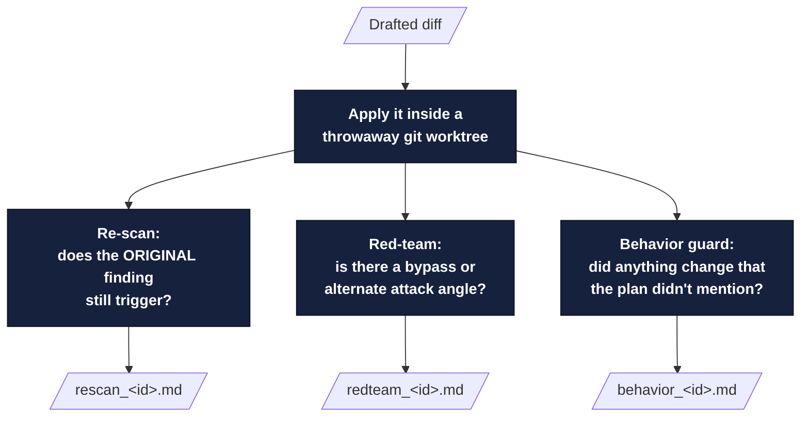

### 06 · Additional Test Execution — deterministic, no agent opinions allowed

The one part of the pipeline that is deliberately **zero agent-authored content** where it counts most:
a script applies the fix and a regression test for real, in an isolated worktree, and the **real exit
code** decides pass or fail — the agent cannot soften or reinterpret a failure.

| | |
|---|---|
| **Input** | The drafted diff + current source of the affected files |
| **Output** | `qa_<id>.md` (regression test result), `build_<id>.md` (Maven build + dependency drift) |
| **Never does** | Override a script's exit code, or claim a test passed that didn't |

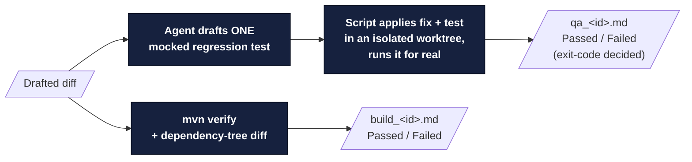

### 07 · Audit & PR — the only stage allowed to say "ship it"

Pulls together all five upstream reports (rescan, red-team, behavior, QA, build) into one
**deterministic** weighted score, checked against hard gates that can never be out-scored. Always
writes a verdict — Cleared *or* Blocked, never silence — plus PR content and a full audit trail. It
only creates an actual PR when a human explicitly asks for a Cleared issue.

| | |
|---|---|
| **Input** | The five upstream reports |
| **Output** | `verdict_<id>.md` (Cleared/Blocked), `pr_<id>.md`, `audit_<id>.md`, and — only on explicit request — a real pull request |
| **Never does** | Turn a Blocked verdict into Cleared, or publish anything without an explicit ask |

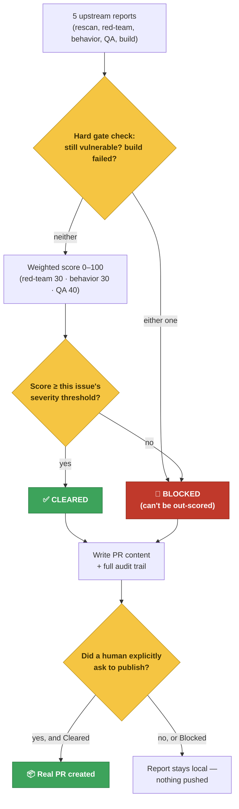

---

## 4. Deep dive — Agent 4, the Fix Generator

Agent 4 is the only agent that produces code, and the only place in the pipeline with a **human
decision gate in the middle of it**. It runs in **two stages** and is built from **four skills**:

| Skill | Stage | In one line |
|---|---|---|
| `04a-fix-strategist` | 1 (plan) | Write the plan from the **known CWE catalog** — the default path |
| `04c-remediation-intelligence` | 1 (plan) | Write the plan from a **local knowledge base** of past fixes — only if the catalog has nothing |
| `04d-remediation-research` | 1 (plan) | **Research a brand-new plan** — only if the catalog *and* the KB both have nothing |
| `04b-fixer` | 2 (implement) | Turn an **Approved** plan into the smallest verified diff |

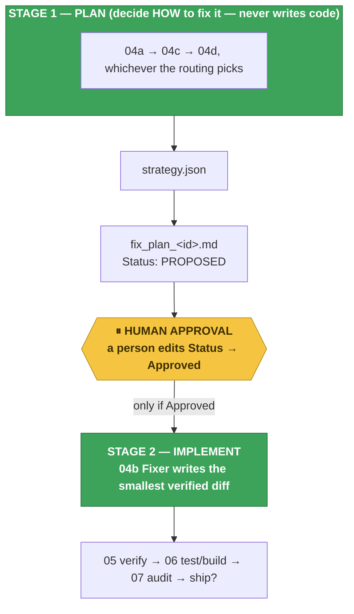

**The one rule that matters most:** human approval is **not** a skill or a script — it's a manual step
that happens *between* Stage 1 and Stage 2. Stage 2 only ever checks "does this plan's Status say
exactly `Approved`?" and refuses outright if it doesn't. No amount of asking nicely changes that.

### 4.1 The routing decision — which Stage-1 skill actually runs?

Think of it as three levels of "how much do we already know about fixing this kind of bug?":

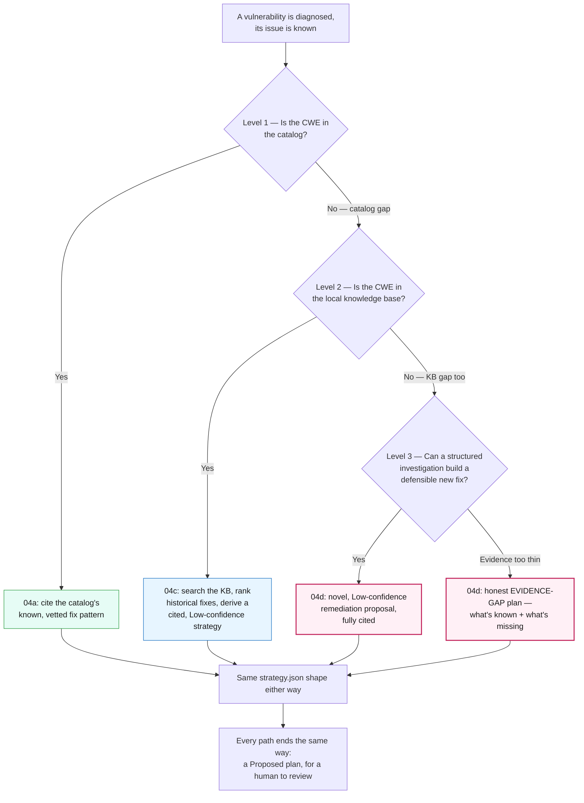

Whichever level actually runs, it produces the **same shape** of `strategy.json`, rendered by the
**same** script into the **same** `fix_plan_<id>.md` at `Status: Proposed`. Nothing downstream needs to
know or care which of the three wrote it — the only visible difference is the `Confidence` field and,
for `04c`/`04d`, a provenance block explaining exactly where the reasoning came from.

### 4.2 04a — Fix Strategist (the default path)

- **Fires when:** the diagnosed CWE **is** in `catalog/cwe-patterns.json`.
- **What it does:** cites the catalog's already-vetted remediation pattern, adapted to this specific
  defect site.
- **Confidence:** established — the pattern is known-good.

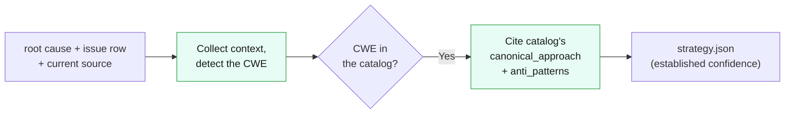

### 4.3 04c — Remediation Intelligence (the knowledge-base fallback)

- **Fires when:** the CWE is **not** in the catalog, but **is** in the local knowledge base
  (`remediation-kb.json` — path traversal, SSRF, missing authorization, and broken authorization today).
- **What it does:** searches the KB and ranks historical fixes with a **hybrid score** — exact +
  synonym keyword overlap, TF-IDF cosine similarity, and (if set up — it's optional) real local
  semantic embedding similarity — then derives a cited strategy from the closest match.
- **Why hybrid, not keyword-only:** a root-cause report rarely uses the KB's exact words. A report
  that says "the handler persists a resource under a caller-supplied name" instead of "write the
  file" used to score `0` under pure keyword matching and silently fall back to alphabetical order.
  `keyword_synonyms` and TF-IDF both patch specific, hand-anticipated gaps; the optional embedding
  signal is the only one that generalises to a paraphrase nobody thought to add a synonym for (see
  [`04c`'s self-test](../.github/skills/04c-remediation-intelligence/scripts/test-sample.js)).
- **What it never does:** reach the open internet, call a hosted AI service, or invent a pattern the
  KB doesn't actually contain — the optional embedding model runs entirely on your own machine and
  only ever scores how close the root-cause text is to candidates *already in the KB*, never
  generates or suggests a new one. If the KB has nothing at all, it reports a **KB gap** and hands
  off to `04d`.
- **Confidence:** Low — it's derived, not an off-the-shelf vetted pattern.

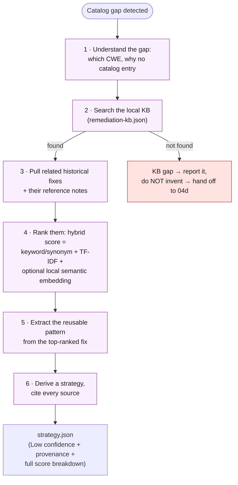

**The ranking formula, in plain English:** every candidate historical fix gets up to three scores —
how many of its keywords (or a listed synonym of one) actually appear in the root-cause text; how
similar its text is by TF-IDF cosine similarity (weighing rare, specific words more heavily than
common ones, computed purely from the KB's own small corpus); and, if the optional local model is set
up, how semantically similar it is by **real sentence embeddings** — a small local language model
(no network call, runs from a `.venv` on your own machine) that can recognise two differently-worded
sentences mean the same thing even with zero shared words and no hand-written synonym. The available
scores are combined with externally editable weights
([`ranking-weights.json`](../.github/skills/04c-remediation-intelligence/ranking-weights.json),
30% keyword / 30% TF-IDF / 40% embedding by default) into one `score` — renormalized automatically if
the embedding signal isn't available on a given machine. Every candidate's full breakdown is written
to `derived_pattern.ranked_examples[]` so a human reviewer sees exactly why the top pick won — not
just a final number. Deterministic given the model: same input, same local model, same ranking every
time.

### 4.4 04d — Remediation Research (the deepest fallback)

- **Fires when:** the CWE is in **neither** the catalog **nor** the knowledge base — a genuine
  double gap, meaning nobody's fix for this class of bug has ever been recorded anywhere the pipeline
  can see.
- **What it does:** runs a real, structured security investigation instead of guessing — thirteen
  steps, from confirming the gap all the way to defining how the fix should be validated — and produces
  either a novel remediation proposal or, if the evidence just isn't there, an honest **evidence-gap**
  plan. It never fabricates a citation, and it **never silently stops** — one of those two outcomes
  always reaches a human.
- **Confidence:** always Low. This is the only skill whose output was never seen before.

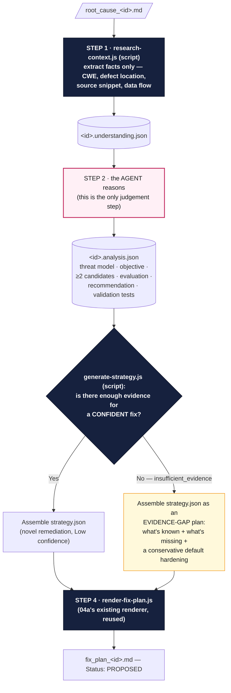

**The 13 research steps the agent authors in Step 2** (in plain English): confirm the gap really
exists → gather everything Agents 1/2/3 already know → understand what the vulnerable code actually
does → separate hard facts from conclusions from hypotheses → build a threat model (who could exploit
this, how) → state the security objective in one sentence (what must become impossible) → research
possible approaches → generate **at least two** candidate fixes, not just one → evaluate their
tradeoffs → pick the smallest one that's actually safe → write down how to test that it worked → attach
evidence and honest provenance for every claim → emit the final `strategy.json`.

**Evidence gap, explained simply:** if 04d can't back up a confident fix, it doesn't invent one and it
doesn't just give up either. It writes down exactly what it *does* know, exactly what evidence is
*missing* to go further, and a conservative default hardening for that CWE class — clearly labeled "not
a confident fix, please gather more evidence." Either way, a human always gets something to review.

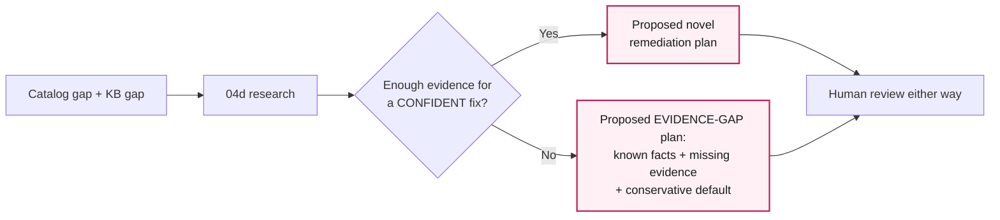

### 4.5 04b — Fixer (Stage 2: the only skill that writes code)

- **Fires when:** a human has edited a plan's Status to exactly `Approved` — nothing else counts.
- **What it does:** turns the approved plan into the smallest possible diff, matching the file's
  existing style, then builds and verifies it inside a **throwaway git worktree** — the real repository
  is never touched. If it doesn't compile, that's reported honestly too (`Compile Failed`), not hidden.

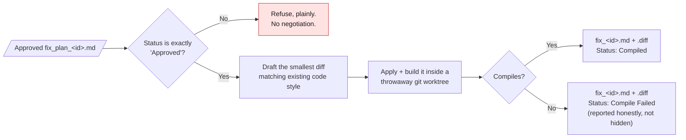

### 4.6 The knowledge-learning loop — the pipeline gets smarter over time

A `04d` remediation that ships cleanly doesn't just disappear — it can become tomorrow's `04c` entry,
so the *next* vulnerability of that same kind no longer needs fresh research. This only happens through
human review; nothing is ever auto-added to the knowledge base.

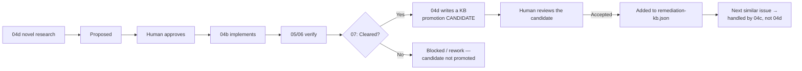

### 4.7 Agent 4, everything on one table

| Skill | Runs when | Reads | Writes | Confidence |
|---|---|---|---|---|
| `04a` | CWE is in the catalog | catalog + context | `strategy.json` → plan | Established |
| `04c` | catalog gap, CWE is in the KB | KB + reference notes + context | `strategy.json` (+ `derived_pattern`) → plan | Low |
| `04d` | catalog gap **and** KB gap | root cause → understanding → analysis | `strategy.json` (+ research) → plan | Low |
| — | (any of the above) | — | `fix_plan_<id>.md` at `Status: Proposed` | — |
| **Human** | plan is `Proposed` | the plan | edits `Status` → `Approved` / `Rejected` | — |
| `04b` | `Status: Approved` | Approved plan + current source | `fix_<id>.diff` | — |

---

## 5. The two human checkpoints

The pipeline is otherwise fully automatic — these are the only two places it deliberately stops and
waits for a person, both chosen because automated judgement shouldn't be trusted alone here.

| # | Where | What the human actually does | Why it's here |
|---|---|---|---|
| 1️⃣ | After Agent 4 **Stage 1** (any of `04a`/`04c`/`04d`) | Edits the plan's `Status` cell from `Proposed` to `Approved` (or `Rejected`) | No code exists yet — approving or rejecting the *approach* is cheap and safe here |
| 2️⃣ | After Agent **07** writes up a `Cleared` verdict | Explicitly asks for the patch to be published | Agent 07 re-validates the diff in a fresh isolated worktree before creating and pushing anything |

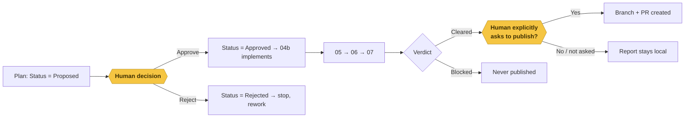

---

## 6. A short glossary (plain English)

| Term | What it actually means here |
|---|---|
| **CWE** | "Common Weakness Enumeration" — a standard numeric label for a *kind* of bug (e.g. CWE-89 is SQL injection). Used so the pipeline can talk about a class of bug, not just one instance of it. |
| **Catalog gap** | The diagnosed CWE isn't one of the ~10 the catalog (`04a`) already has a vetted fix pattern for. |
| **KB gap** | The CWE is also missing from `04c`'s local knowledge base of past fixes — the deepest kind of "we've never handled this before." |
| **Evidence gap** | `04d` investigated but the evidence wasn't solid enough to back a confident fix, so it hands a human a "here's what we know / here's what's missing" plan instead of guessing. |
| **git worktree** | A disposable, throwaway copy of the repository used to apply and test a patch. The real repo is never touched by any analysis or verification step. |
| **Proposed / Approved / Rejected** | The three states a fix plan's `Status` cell can be in. Only a human ever sets it to `Approved` or `Rejected` — no agent does. |
| **Compiled / Compile Failed / Refused** | What Stage 2 (`04b`) reports honestly about a diff: it built, it didn't build, or it wasn't allowed to try (plan not Approved). |
| **Cleared / Blocked** | Agent 07's final verdict. Cleared means it's eligible to ship; Blocked means it isn't — and Blocked patches still get a full written report, never silence. |
| **Hard gate** | A rule that can never be "scored around" — e.g. if the original vulnerability still triggers, or the build fails, the verdict is Blocked no matter how well everything else scored. |

---

## 7. Where to go deeper

| If you want... | Go to |
|---|---|
| The terse per-agent input/output reference table | [`agent-workflow-reference.md`](agent-workflow-reference.md) |
| The harness's own README (badges, design principles, repo layout) | [`../.github/README.md`](../.github/README.md) |
| Only the pre-`04d` (catalog + KB) version of the Agent 4 story | [`pipeline-flow-with-04c.md`](pipeline-flow-with-04c.md) |
| Only the `04d` research-fallback story, on its own | [`agent4-04d-flow.md`](agent4-04d-flow.md) |
| The full Agent 4 story (all four skills) with extra ASCII diagrams | [`agent4-complete-flow.md`](agent4-complete-flow.md) |
| The exact agent persona instructions Agent 4 follows | [`../.github/agents/04_fix-generator.agent.md`](../.github/agents/04_fix-generator.agent.md) |
| The status/field contract every stage must honor | [`../.github/pipeline-contract.md`](../.github/pipeline-contract.md) |

---

> **In one sentence:** two inputs (an issue register and the source code) go through three
> understanding agents, a two-stage fix agent that always stops for a human before writing code and
> reaches for progressively deeper knowledge (`04a` → `04c` → `04d`) only when it has to, three
> independent verification checks, two deterministic test gates, and one final scoring agent that is
> the only place a patch is ever declared safe — and even then, nothing gets published without a human
> explicitly asking.
