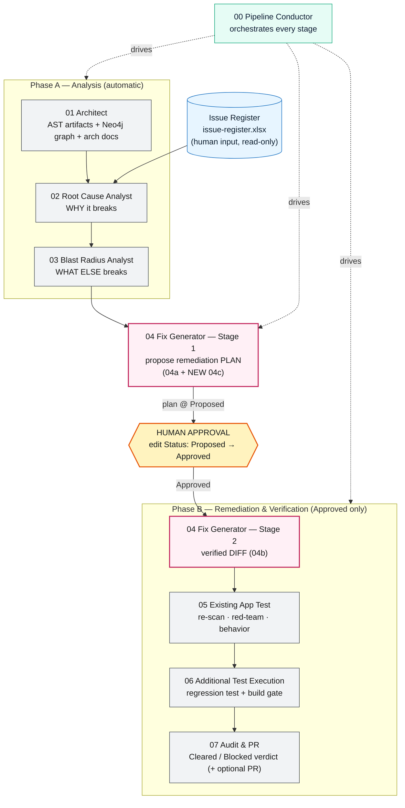
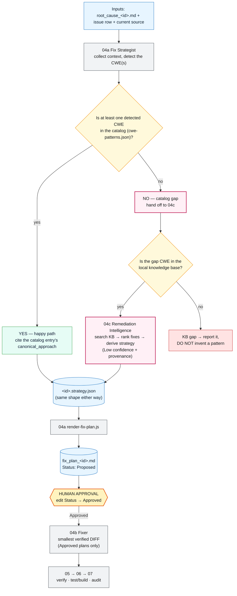
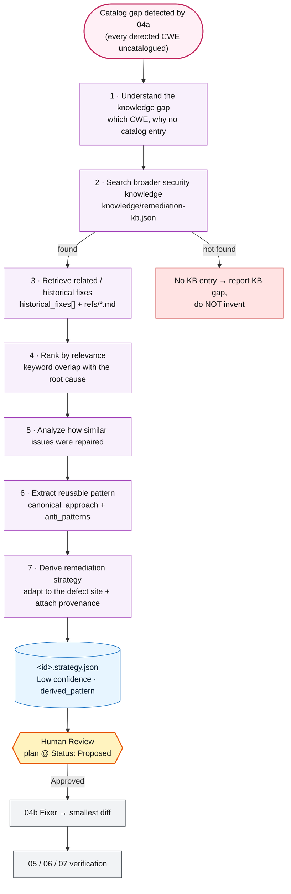

# Vulnerability Pipeline — Flow with the New Remediation-Intelligence Skill (04c)

This document shows the **overall agent flow**, what each agent does, and then goes deep on the
**newly added third skill of Agent 4** — `04c-remediation-intelligence`, the catalog-gap fallback —
including a real end-to-end run that proves it works.

> New in this revision: **Agent 4 now has three skills** (`04a` → `04c` → `04b`) instead of two.
> `04c` activates only when a diagnosed CWE has **no entry** in the remediation catalog, so the
> pipeline can still produce a grounded, cited fix plan instead of a dead-end. Everything else is
> unchanged — the human-approval gate and every downstream verification gate still apply.
>
> **Point-in-time note:** this document (and the run below) predates a later upgrade to `04c`'s
> ranking — it now scores historical fixes with a hybrid of keyword/synonym overlap and TF-IDF
> cosine similarity, not raw keyword-overlap counts alone. The run's exact integer scores below are a
> historical record of that specific run under the old algorithm, not current behavior. See
> [`04c`'s `SKILL.md`](../.github/skills/04c-remediation-intelligence/SKILL.md#ranking-algorithm--hybrid-keywordsynonym--tf-idf-cosine)
> or [`docs/flow.md`](flow.md#43-04c--remediation-intelligence-the-knowledge-base-fallback) for the
> current algorithm.

---

## 1. The overall flow (with 04c)



**Reading it:** the register is the only input. Phase A analyses the code; Agent 4 Stage 1 proposes a
plan; a **human** must approve it; then Phase B implements and verifies it. The Conductor (00) just
sequences the specialists — it writes no code and reads no register itself.

---

## 2. What each agent does (at a glance)

| # | Agent | Input | Output | One-line job |
|---|-------|-------|--------|--------------|
| 00 | Pipeline Conductor | a mode word (`analyze`/`resume`) or issue id | a run ledger | Orchestrates the stages; enforces gates. |
| 01 | Architect | Java + Maven source | AST artifacts, Neo4j graph, `architecture.md`, `function-reference.md` | Turns source into facts + a knowledge graph. |
| 02 | Root Cause Analyst | issue row + arch docs + graph | `root_cause_<id>.md` | Diagnoses **why** each issue happens. |
| 03 | Blast Radius Analyst | root-cause report + graph | `blast_radius_<id>.md` | Measures **what else** the defect reaches. |
| 04 | **Fix Generator** | root cause + issue + source + **catalog / KB** | `fix_plan_<id>.md` then `fix_<id>.md` + `.diff` | **Plans** a fix (Stage 1), then **implements** it after approval (Stage 2). |
| 05 | Existing App Test | the drafted diff | `rescan/redteam/behavior_<id>.md` | Checks the patch isn't still vulnerable/bypassable/behavior-breaking. |
| 06 | Additional Test Execution | the drafted diff | `qa_<id>.md`, `build_<id>.md` | Runs a regression test + `mvn verify`. |
| 07 | Audit & PR | the 5 upstream reports | `verdict_<id>.md`, `pr_<id>.md`, `audit_<id>.md` | Scores it Cleared/Blocked; the only stage that can ship. |

*(A fuller per-agent breakdown lives in [agent-workflow-reference.md](agent-workflow-reference.md).)*

---

## 3. Focus — Agent 4 (Fix Generator) and its **three** skills

Agent 4 is the only agent that produces code, and it runs in two gated stages. Stage 1 (planning)
now has a fork in it: the normal path (`04a`) and the **new fallback** (`04c`).



**The three skills:**

| Skill | Role | When it runs |
|-------|------|--------------|
| `04a-fix-strategist` | Writes the plan from the **CWE catalog** | Always (Stage 1). |
| `04c-remediation-intelligence` **(NEW)** | Derives the plan from a **local knowledge base** | Only when **every** detected CWE is a catalog gap. |
| `04b-fixer` | Turns an **Approved** plan into a verified diff | Stage 2, after human approval. |

Both `04a` and `04c` write the **same** `<id>.strategy.json` and are rendered by the **same**
`render-fix-plan.js` into the **same** `Proposed` plan — so everything downstream is identical. The
only visible difference on a `04c` plan is `Confidence: Low`, `CWE — catalog gap`, and a
`derived_pattern` provenance block.

---

## 4. Deep dive — the new **04c** skill (the "NO" branch)

### 4.1 The problem it solves

`04a` draws its remediation strategy from exactly one source: `catalog/cwe-patterns.json` (10 CWEs
today). If the diagnosed CWE isn't in there, `04a`'s rule is to **stop and report a catalog gap**
rather than invent a fix. Safe — but a dead-end. `04c` turns that dead-end into a **grounded, cited,
low-confidence proposal**, without loosening any gate.

### 4.2 What it will and won't do

| It **does** | It **never** does |
|---|---|
| Search a local, version-controlled knowledge base | Reach the open web or the model's memory for a pattern |
| Rank historical fixes by relevance to the root cause | Invent a pattern for a CWE missing from the KB (that's a reported *KB gap*) |
| Derive a strategy and cite every source (repo paths) | Write a diff or edit real source |
| Mark it `Low` confidence with provenance | Approve a plan — a human still must |

### 4.3 The 04c internal flow



### 4.4 Inputs and outputs

| Direction | Item | Location |
|---|---|---|
| **In** | Remediation context bundle | `.github/.pipeline-context/fix-strategy/<id>.context.json` (from `04a` collect) |
| **In** | The CWE catalog (to confirm the gap) | `.github/skills/04a-fix-strategist/catalog/cwe-patterns.json` |
| **In** | The knowledge base | `.github/skills/04c-remediation-intelligence/knowledge/remediation-kb.json` + `knowledge/refs/*.md` |
| **Out** | The derived strategy | `.github/.pipeline-context/fix-strategy/<id>.strategy.json` (with `derived_pattern`) |
| **Out** *(via 04a renderer)* | The plan | `docs/agent_output/04-remediation/fix_plan_<id>.md` @ `Proposed` |

### 4.5 The trigger, precisely

- **Fires** only when CWE(s) were detected **and none** is in the catalog (a *pure* gap).
- **Declines** when any detected CWE is catalogued — that's `04a`'s job (e.g. ISSUE-002 mixes the
  catalogued CWE-306 with uncatalogued CWE-862/CWE-359, so `04a` handles it, not `04c`).
- **Reports a KB gap** (and stops) when the gap CWE isn't in the knowledge base either.

---

## 5. Proof — a real end-to-end run (ISSUE-004)

To verify the wiring, a synthetic gap issue **ISSUE-004** (path traversal, **CWE-22** — a real
catalog gap) was registered, given a root-cause report, and handed to the **real `04-fix-generator`
agent** with no hint to use 04c. The agent discovered the gap and reached for the skill on its own.

```mermaid
sequenceDiagram
  autonumber
  participant U as Operator
  participant A4 as 04 Fix Generator (agent)
  participant S1 as 04a Strategist
  participant C as 04c Remediation Intelligence
  participant KB as Knowledge Base
  participant R as render-fix-plan.js

  U->>A4: Process ISSUE-004 (Stage 1 only)
  A4->>S1: list workload + collect context
  S1-->>A4: detected CWE-22 — NOT in catalog (gap)
  A4->>C: detect-gap → GAP; run-fallback
  C->>KB: search CWE-22
  KB-->>C: entry + historical fixes
  C->>C: rank (HF-PATH-001=8, HF-PATH-002=2) → derive
  C-->>A4: ISSUE-004.strategy.json (Low, provenance)
  A4->>R: render-fix-plan --issue ISSUE-004
  R-->>A4: fix_plan_ISSUE-004.md @ Proposed
  A4-->>U: plan ready — awaiting human approval
```

**Verified artifacts from that run:**

- Plan: `docs/agent_output/04-remediation/fix_plan_ISSUE-004.md` — `Status: Proposed`,
  `CWE-22 — catalog gap`, `Confidence: Low`.
- Provenance rendered in the plan's approach **and** appendix:
  `Derived remediation | 04c fallback (expanded-catalog); sources: knowledge/remediation-kb.json, knowledge/refs/path-traversal.md#L1, …`
- Strategy JSON: `catalog_reference.title: null`, `derived_pattern.ranked_examples: HF-PATH-001(8), HF-PATH-002(2)`.
- ISSUE-001/002/003 untouched (still Approved).

> ISSUE-004 is a **declared test fixture** — the real `exportToExcel` streams a fixed filename, so
> the vulnerability is illustrative. It exercises the agent-to-skill wiring, not a live defect.

---

## 6. What changed in the repo

**New skill — `.github/skills/04c-remediation-intelligence/`:**

| File | Purpose |
|---|---|
| `SKILL.md` | When 04c fires, its inputs/outputs, procedure |
| `knowledge/remediation-kb.json` | Local, citable KB for gap CWEs (22, 918, 359, 862) |
| `knowledge/README.md` | KB entry contract + promotion path |
| `knowledge/refs/*.md` | Citable reference notes (path-traversal, ssrf, pii-exposure, missing-authorization) |
| `scripts/lib/fallback.js` | Core: gap classification, ranking, strategy derivation |
| `scripts/detect-gap.js` | The YES/NO classifier |
| `scripts/run-fallback.js` | The NO-branch worker → writes `<id>.strategy.json` |
| `scripts/test-sample.js` | Self-contained end-to-end self-test |
| `templates/derived_pattern.schema.json` | The provenance-block contract |
| `fixtures/SAMPLE-CWE22.context.json` | Bundled sample input for the self-test |
| `package.json` | Zero-dependency manifest |

**New wrapper:** `.claude/skills/04c-remediation-intelligence/SKILL.md`

**Modified (backward-compatible):**

| File | Change |
|---|---|
| `.github/skills/04a-fix-strategist/scripts/lib/plans.js` | Added opt-in `PIPELINE_OUTPUT_DIR` override (isolated testing) |
| `.github/skills/04a-fix-strategist/scripts/render-fix-plan.js` | Appendix now cites `derived_pattern` provenance for fallback plans |
| `.github/skills/04a-fix-strategist/templates/strategy.schema.json` | Added optional `derived_pattern` field |
| `.github/skills/04a-fix-strategist/SKILL.md` | Documented the catalog-gap fallback hook (Step 3) |
| `.github/agents/04_fix-generator.agent.md` | Added 04c to Skills + Stage-1 gap handling |
| `.claude/agents/04-fix-generator.md` | Registered `04c-remediation-intelligence` on the agent |

---

## 7. How to run it yourself

```powershell
# 1. Self-test the skill in isolation (touches nothing in the repo):
node .github/skills/04c-remediation-intelligence/scripts/test-sample.js

# 2. Check which registered issues are catalog gaps (YES/NO classifier):
node .github/skills/04c-remediation-intelligence/scripts/detect-gap.js --all

# 3. Full run through the real agent (needs a registered gap issue):
#    invoke the 04-fix-generator agent for that issue — it discovers the gap and
#    delegates to 04c automatically, producing a Proposed plan for human approval.
```

The pipeline stays **file-driven** and **gated**: a `04c` plan is still just a `Proposed` proposal
that a human must approve, and it still passes through every verification stage (05 → 06 → 07) before
anything can ship.
